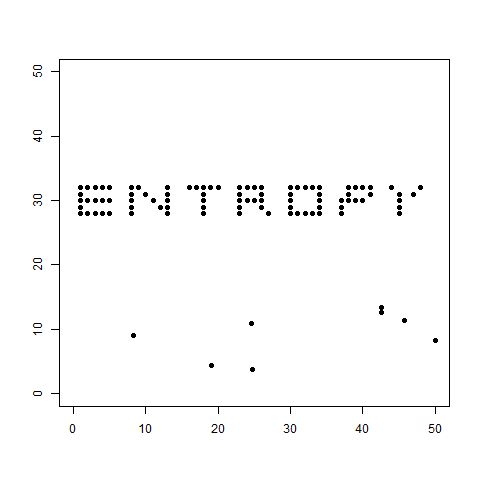
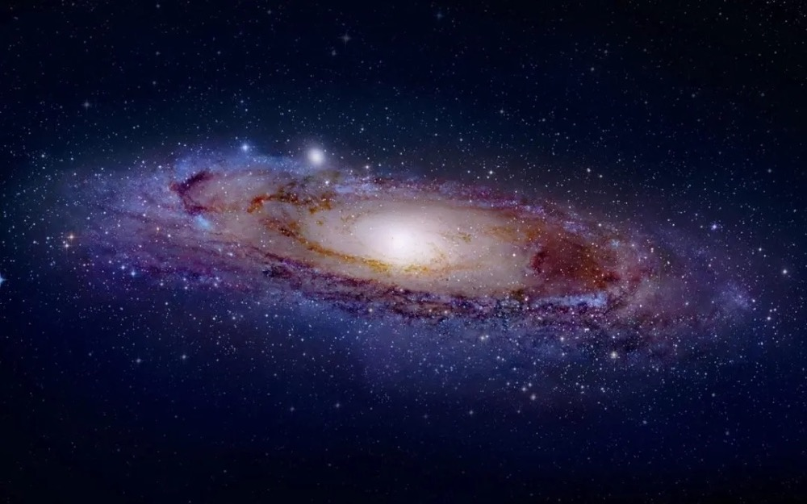
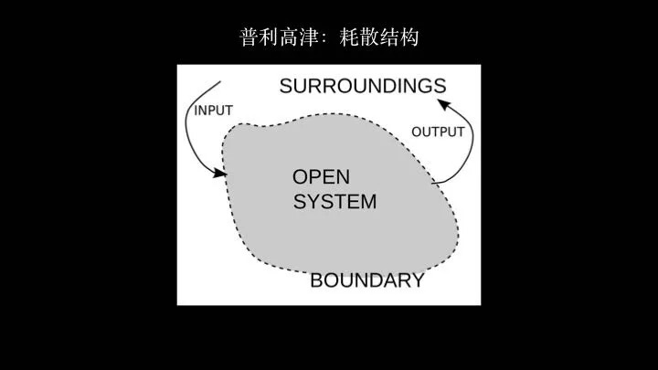
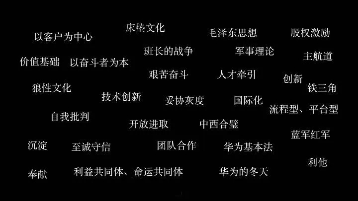

## 生命以负熵为生

>  				在任何一个封闭的环境，里面的任何事物，必然会从有序到无序，直至死亡。世间万
>  				 物都是这样。-这是对熵增定律比较好理解的解释。延时死亡就必须要有反熵增的思维。

大家生活中，有没有这些现象：

1、刚搬新房时，一切物件都井井有条，2年后一切都乱了。

2、刚毕业那会，一夏天衣服就2套，人活的很精神，现在衣柜里面满满当当的，很多衣服都已经穿不上了，弃之可惜、留之无用。

3、微信好友几十人时，很好经营和维护，几千人时，有一种很堵的感觉，无数小红点，无数群消息，无数朋友圈内容。

4、一个人生活很无忧无虑，二个人生活很快乐幸福，有小有老一大家子人生活时，出现了各种矛盾和隔阂。

。。。。。。

是的，这些现象都有个共性：随着时间的推移，变的越来越混乱了。

**一、熵增定律**

这些看起来理所应当的现象，背后往往隐藏着我们这个世界最基本的规律，这些现象所遵循的就是“熵增定律”。

熵增定律，也叫热力学第二定律，这是德国人克劳修斯和英国人开尔文提出的理论。克劳修斯对热力学第二定律的表述为：不可能把热量从低温物体传向高温物体而不引起其它变化。换种表述方法为：在孤立的系统里面，热量肯定是从高温流向低温，此过程是不可逆的”。 

而热力学第二定律真正的内涵，并不仅仅是热量传导的方向性，而是一个颇有哲学意味的结论：事物一定会自发地向混乱、无序的方向发展。 

熵是用来度量混乱的，指事物的混乱、无序程度。

熵增就是越来越混乱，越来越无序。

熵的英文为Entropy，通过下面这张动图来理解下熵增的混乱过程，一开始，熵很小，很有序，随着时间的推移，熵越来越大，直至一片混乱。

对熵增定律的理解表述有（意思都一样）：

在自然过程中，一个孤立系统的总混乱度（即“熵”）只会增加，不会减少，当熵达到最大值时，系统会出现严重混乱，最后走向死亡。

封闭系统的熵随着时间的推移不断增加，且不可逆。

在任何一个封闭的环境，里面的任何事物，必然会从有序到无序，直至死亡。世间万物都是这样。

任何封闭系统，最终的命运是死亡。

如果物理学只能留一条定律，我会留熵增定律。-吴国盛教授（清华大学科学系主任）

熵增定律，它揭示了宇宙演化的终极规律，这个规律包括我们所有生命和非生命的演化规律。

个人生活中的各种坏习惯和不规律，公司越大组织越臃肿，国家越封闭越落后，等等，都是生命的熵增演化过程。

文章一开始举例的那些现象，以及电脑手机会越来越卡，马路会越来越脏，交通会越来越堵，太阳会不断燃烧直至热寂，等等，都是非生命的熵增演化过程。

熵增定律，它一直被认为是令全宇宙都绝望的定律，因为它断绝了人类对于宇宙永恒的幻想，宇宙不是永恒的，灭亡是人类无法避免的最终归宿。

**二、反熵增**

竟然知道了，这么一个最令人沮丧的定律，灭亡是改变不了的。那我们该如何对抗它呢？

对抗熵增的过程称作：反熵增、负熵、熵减。反熵增的本质就是为了系统有序。

对抗熵增的过程就是在和时间赛跑，减缓灭亡的的速度。

一株小树苗，从栽下的那一刻开始，它就不断地从外界获取各种能量，比如：水分、阳光、肥料。春去秋来，它会发芽，长出枝丫，强化根系，落叶，不停地进行着新陈代谢，不断地进行着分形，它扩大出自己的生长边界，最终长成参天大树。

人的出生就和小树苗一样，我们的身体不停地进行着新陈代谢，我们会吸入氧气呼出废气，会摄入营养排出异物，会吸收知识武装头脑，最终成就自己的一生。

人的出生是由不得自己的，而死却是可以自己决定的。如果人生是一场不可避免的死亡之路，我们完全可以自己决定向死这条路上的过程，我们可以很好的体验生活，享受人生，活得精彩。

生命系统是熵增的特例，人活着就是在对抗熵增定律，负熵代表的是生命的活力。

纵观已知的整个生命系统，在漫长的数十亿年历史当中，越来越复杂，但却越来越有序。

从生命系统里面可以看出，生命系统是一个开放系统，由于生命系统不停地与外界交换物质和能量，可以从外界获取负嫡用来抵消自身嫡的增加，从而使生命系统实现从无序到有序、从简单到复杂的演化。 

反熵增的一个特点就是：系统必须开放。

为了更详细的理解，这时，我们再引入伊里亚·普里高津的“耗散结构”原理。

普里高津是1977年诺贝尔化学奖的得主，他的耗散结构理论的物理内涵为：一个远离平衡态的非线性的开放系统，通过不断地与外界交换物质和能量，在系统内部某个参量的变化达到一定的阂值时，通过涨落，系统可能发生突变，即产生非平衡相变，由原来的混沌无序状态转变为一种在时间上、空间上或功能上的有序状态。

这种在远离平衡的非线性区形成的新的稳定的宏观有序结构，由于需要不断与外界交换物质或能量才能维持，因此称之为”耗散结构”。 

根据普里高津“耗散结构”原理可以总结归纳出，系统形成有序结构所需要的几个条件： 

1 、系统必须开放。打破原来的封闭系统，才能使系统实现从无序变有序。 

2 、远离平衡态。系统由于开放离开了平衡态，逐渐推向了非线性区，相互作用的非线性，才可能会涌现出新的有序结构。

所以，反熵增的另外一个特点就是：远离平衡态。

总结，怎么进行反熵增？就2个特点：

1、开放

2、非平衡

现在，知道为什么中国要大力搞改革开放，为什么中国不希望美国搞贸易战了吧。国家也在反熵增。

国家的方针政策就不在这儿讨论了，我们简单分析下个人和企业的反熵增。

**三、企业反熵增**

在阿里巴巴5周年庆的时候，马云曾经提出一个新的目标：“阿里巴巴要做102年的公司。”马云是知道企业的熵增道理的，没有不死的企业，企业最终都逃不过熵增定律。

华为是一家伟大的企业，它为什么能发展的那么好，因为它的反熵增做的好。

总结华为的几个反熵增关键点：

1、开放 ：向外部市场开放，能自产的也外购，给行业保留利润

2、非平衡：以奋斗者为本，换工号二次上岗，红蓝军机制

**四、个人反熵增**

还记得我讲过的“弱连接”理论吗？它就是一种开放，弱连接能引领我们接触新的人，新的事，新的思想。

个人不管是工作、生活、学习、成长、关系......都一定要有反熵增的思维。要绝对的思想开放，要善于打破各种平衡。

我们再也不能被生活中的各种混乱牵着走了，我们要通过反熵增的思维掌控自己的人生。

最后，以薛定谔《生命是什么》中的一句名言作为结尾，送给自己也送给大家。

**生命以负熵为生。** 