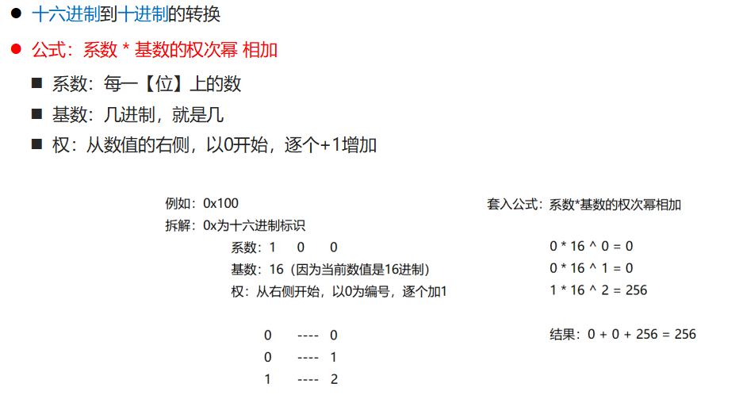
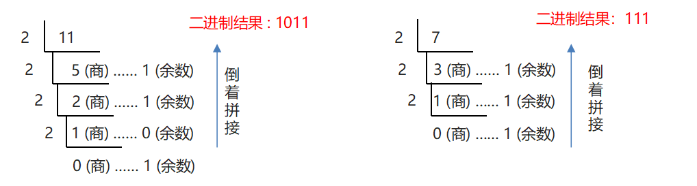
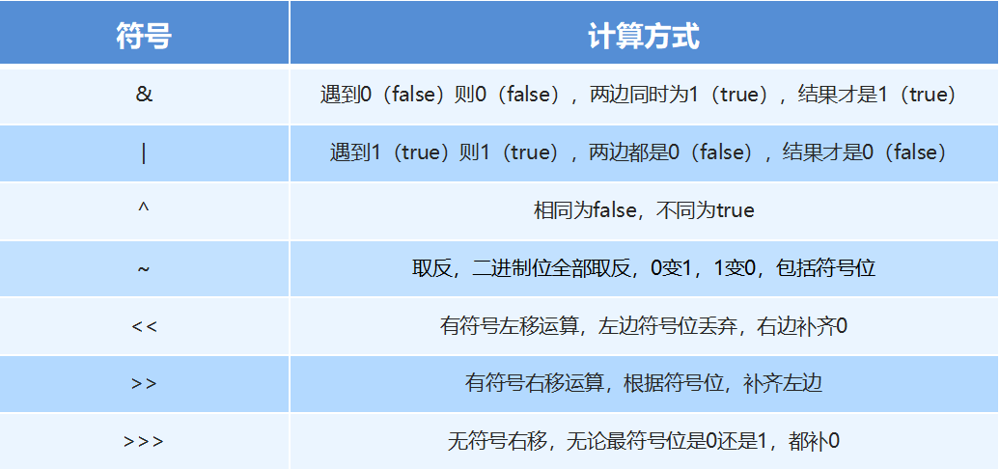

## 1.Debug模式

### 1.1 什么是Debug模式

是供程序员使用的程序调试工具，它可以用于查看程序的执行流程，也可以用于追踪程序执行过程来调试程序。

### 1.2 Debug介绍与操作流程

- 如何加断点

  - 选择要设置断点的代码行，在行号的区域后面单击鼠标左键即可

- 如何运行加了断点的程序

  - 在代码区域右键Debug执行

- 看哪里

  - 看Debugger窗口

  - 看Console窗口

- 点哪里

  - 点Step Into (F7)这个箭头，也可以直接按F7

- 如何删除断点

  - 选择要删除的断点，单击鼠标左键即可

  - 如果是多个断点，可以每一个再点击一次。也可以一次性全部删除


## 2. 进制的介绍与书写格式

### 2.1 进制的介绍与书写格式

代码 : 

```java
public class Demo1 {
    /*
        十进制：Java中，数值默认都是10进制，不需要加任何修饰。
        二进制：数值前面以0b开头，b大小写都可以。
        八进制：数值前面以0开头。
        十六进制：数值前面以0x开头，x大小写都可以。

        注意: 书写的时候, 虽然加入了进制的标识, 但打印在控制台展示的都是十进制数据.
     */
    public static void main(String[] args) {
        System.out.println(10);
        System.out.println("二进制数据0b10的十进制表示为:" + 0b10);
        System.out.println("八进制数据010的十进制表示为:" + 010);
        System.out.println("十六进制数据0x10的十进制表示为:" + 0x10);
    }
}
```

### 2.2 任意进制到十进制的转换


 


### 2.3 进制转换-十进制到任意进制转换

​	**2.3.1 : 十进制到二进制的转换**

​	公式：除基取余使用源数据，不断的除以基数（几进制，基数就是几）得到余数，直到商为0，再将余数倒着拼起来即可。

​	需求：将十进制数字11，转换为2进制。

​	实现方式：源数据为11，使用11不断的除以基数，也就是2，直到商为0。



​	**2.3.2 : 十进制到十六进制的转换**

​	公式：除基取余使用源数据，不断的除以基数（几进制，基数就是几）得到余数，直到商为0，再将余数倒着拼起来即可。

​	需求：将十进制数字60，转换为16进制。

​	实现方式：源数据为60，使用60不断的除以基数，也就是16，直到商为0。


​	结论：十进制到任意进制的转换

​	公式：除基取余使用源数据，不断的除以基数（几进制，基数就是几）得到余数，直到商为0，再将余数倒着	拼起来即可

### 2.4  快速进制转换法

​	8421码：

​	8421码又称BCD码，是BCD代码中最常用的一种BCD： (Binary-Coded Decimal‎) 二进制码十进制数在这种编码方式中，每一位二进制值的1都是代表一个固定数值，把每一位的1代表的十进制数加起来得到的结果就是它所代表的十进制数。

​	


### 2.5  原码反码补码

前言 : 计算机中的数据，都是以二进制补码的形式在运算，而补码则是通过反码和原码推算出来的

**原码 **:（可直观看出数据大小）

就是二进制定点表示法，即最高位为符号位，【0】表示正，【1】表示负，其余位表示数值的大小。

通过一个字节表示+7和-7，代码：byte b1 = 7;   byte b2 = -7;一个字节等于8个比特位，也就是8个二进制位	

0(符号位)	0000111 	

1(符号位)	0000111

**反码 :** 正数的反码与其原码相同；负数的反码是对其原码逐位取反，但符号位除外。

**补码 :** （数据以该状态进行运算）正数的补码与其原码相同；负数的补码是在其反码的末位加1。


### 2.6 位运算-基本位运算符

```java
package com.itheima.demo;

public class Demo2 {
    /*
        位运算:

            位运算符指的是二进制位的运算，先将十进制数转成二进制后再进行运算。
            在二进制位运算中，1表示true，0表示false。

             & 位与 : 遇false则false, 遇0则0

                        00000000 00000000 00000000 00000110     // 6的二进制
                     &  00000000 00000000 00000000 00000010     // 2的二进制
                    -----------------------------------------
                        00000000 00000000 00000000 00000010     // 结果: 2

             | 位或 : 遇true则true, 遇1则1

             ^ 位异或 : 相同为false, 不同为true

             ~ 取反 : 全部取反, 0变1, 1变0  (也包括符号位)

                    00000000 00000000 00000000 00000110         // 6的二进制补码
                  ~ 11111111 11111111 11111111 11111001

                  -                                   1         // -1求反码
                   ------------------------------------
                    11111111 11111111 11111111 11111000         // 反码推原码

                    10000000 00000000 00000000 00000111         // -7
     */
    public static void main(String[] args) {
        System.out.println(6 & 2);
        System.out.println(~6);
    }
}

```


### 2.7 位运算-位移运算符

**位运算概述 :**  位运算符指的是二进制位的运算，先将十进制数转成二进制后再进行运算。在二进制位运算中，1表示true，0表示false。

**位运算符介绍 :** 

**代码 :** 

```java
package com.itheima.demo;

public class Demo3 {
    /*
       位移运算符:

               << 有符号左移运算，二进制位向左移动, 左边符号位丢弃, 右边补齐0
                        运算规律: 向左移动几位, 就是乘以2的几次幂

                                12 << 2

                                (0)0000000 00000000 00000000 000011000  // 12的二进制

       -----------------------------------------------------------------------------
               >> 有符号右移运算，二进制位向右移动, 使用符号位进行补位
                        运算规律: 向右移动几位, 就是除以2的几次幂

                                000000000 00000000 00000000 0000001(1)  // 3的二进制

       -----------------------------------------------------------------------------

                >>> 无符号右移运算符,  无论符号位是0还是1，都补0

                                010000000 00000000 00000000 00000110  // -6的二进制

     */
    public static void main(String[] args) {
        System.out.println(12 << 1);  // 24
        System.out.println(12 << 2);  // 48

    }
}

```

```java
package com.itheima.demo;

public class Demo4 {
    /*
        ^ 运算符的特点

                一个数, 被另外一个数, 异或两次, 该数本身不变
     */
    public static void main(String[] args) {
        System.out.println(10 ^ 5 ^ 10);
    }
}

```

## 3.基础练习

### 3.1 数据交换

**案例需求**

​	已知两个整数变量a = 10，b = 20，使用程序实现这两个变量的数据交换
        最终输出a = 20，b = 10;

**代码实现**

```java
package com.itheima.test;

public class Test1 {
    /*
        需求：已知两个整数变量a = 10，b = 20，使用程序实现这两个变量的数据交换
        最终输出a = 20，b = 10;


        思路：
        1. 定义一个三方变量temp，将a原本记录的值，交给temp记录 （a的值，不会丢了）
        2. 使用 a 变量记录 b 的值，（第一步交换完毕，b的值也丢不了了）
        3. 使用 b 变量记录 temp的值，也就是a原本的值 （交换完毕）
        4. 输出 a 和 b 变量即可
     */
    /*
        动态初始化格式：

            数据类型[][] 变量名 = new 数据类型[m][n];
            m表示这个二维数组，可以存放多少个一维数组
            n表示每一个一维数组，可以存放多少个元素
     */
    public static void main(String[] args) {
        int a = 10;
        int b = 20;

        // 将a原本记录的值，交给temp记录 （a的值，不会丢了）
        int temp = a;
        // 用 a 变量记录 b 的值，（第一步交换完毕，b的值也丢不了了）
        a = b;
        // 使用 b 变量记录 temp的值，也就是a原本的值 （交换完毕）
        b = temp;

        // 输出 a 和 b 变量即可
        System.out.println("a=" + a);
        System.out.println("b=" + b);
    }
}
```

### 3.2 数组反转【应用】

**案例需求 :** 

​	已知一个数组 arr = {19, 28, 37, 46, 50}; 用程序实现把数组中的元素值交换，

​	交换后的数组 arr = {50, 46, 37, 28, 19}; 并在控制台输出交换后的数组元素

**实现步骤 :** 

 	1. 定义两个变量, start和end来表示开始和结束的指针.          

2. 确定交换条件, start < end 允许交换          
3. 循环中编写交换逻辑代码         
4. 每一次交换完成, 改变两个指针所指向的索引 start++, end--          
5. 循环结束后, 遍历数组并打印, 查看反转后的数组

**代码实现 :** 

```java
package com.itheima.test;

public class Test2 {
    /*
        需求：已知一个数组 arr = {19, 28, 37, 46, 50}; 用程序实现把数组中的元素值交换，
          交换后的数组 arr = {50, 46, 37, 28, 19}; 并在控制台输出交换后的数组元素。

        步骤:
              1. 定义两个变量, start和end来表示开始和结束的指针.
              2. 确定交换条件, start < end 允许交换
              3. 循环中编写交换逻辑代码
              4. 每一次交换完成, 改变两个指针所指向的索引 start++, end--
              5. 循环结束后, 遍历数组并打印, 查看反转后的数组
     */
    public static void main(String[] args) {
        int[] arr = {19, 28, 37, 46, 50};
        //  1. 定义两个变量, start和end来表示开始和结束的指针.
        int start = 0;
        int end = arr.length -1;
        //  2. 确定交换条件, start < end 允许交换
        // 4. 每一次交换完成, 改变两个指针所指向的索引 start++, end--
        // for(int start = 0, end = arr.length -1; start < end; start++, end--)
        for( ; start < end; start++, end--){
            // 3. 循环中编写交换逻辑代码
            int temp = arr[start];
            arr[start] = arr[end];
            arr[end] = temp;
        }

        for (int i = 0; i < arr.length; i++) {
            System.out.println(arr[i]);
        }
    }
}

```

### 3.3 二维数组概述

​	**概述 :**  二维数组也是一种容器，不同于一维数组，该容器存储的都是一维数组容器

### 3.4 二维数组动态初始化

```java
动态初始化格式：

数据类型[][] 变量名 = new 数据类型[m][n];
m表示这个二维数组，可以存放多少个一维数组
n表示每一个一维数组，可以存放多少个元素
```

```java
package com.itheima.demo;

public class Demo1Array {
    /*
        动态初始化格式：

            数据类型[][] 变量名 = new 数据类型[m][n];
            m表示这个二维数组，可以存放多少个一维数组
            n表示每一个一维数组，可以存放多少个元素
     */
    public static void main(String[] args) {
        // 数据类型[][] 变量名 = new 数据类型[m][n];
        int[][] arr = new int[3][3];
        /*
            [[I@10f87f48

            @ : 分隔符
            10f87f48 : 十六进制内存地址
            I : 数组中存储的数据类型
            [[ : 几个中括号就代表的是几维数组
         */
        System.out.println(arr);

        /*
            二维数组存储一维数组的时候, 存储的是一维数组的内存地址
         */
        System.out.println(arr[0]);
        System.out.println(arr[1]);
        System.out.println(arr[2]);

        System.out.println(arr[0][0]);
        System.out.println(arr[1][1]);
        System.out.println(arr[2][2]);

        // 向二维数组中存储元素
        arr[0][0] = 11;
        arr[0][1] = 22;
        arr[0][2] = 33;

        arr[1][0] = 11;
        arr[1][1] = 22;
        arr[1][2] = 33;

        arr[2][0] = 11;
        arr[2][1] = 22;
        arr[2][2] = 33;

        // 从二维数组中取出元素并打印
        System.out.println(arr[0][0]);
        System.out.println(arr[0][1]);
        System.out.println(arr[0][2]);
        System.out.println(arr[1][0]);
        System.out.println(arr[1][1]);
        System.out.println(arr[1][2]);
        System.out.println(arr[2][0]);
        System.out.println(arr[2][1]);
        System.out.println(arr[2][2]);
    }
}
```

### 3.5  二维数组访问元素的细节问题

问题 :  二维数组中存储的是一维数组, 那能不能存入 [提前创建好的一维数组] 呢 ?

答 : 可以的

#### 代码实现

```java
package com.itheima.demo;

public class Demo2Array {
    /*
        问题: 二维数组中存储的是一维数组, 那能不能存入 [提前创建好的一维数组] 呢 ?
        答 : 可以的
     */
    public static void main(String[] args) {
        int[] arr1 = {11,22,33};
        int[] arr2 = {44,55,66};
        int[] arr3 = {77,88,99,100};

        int[][] arr = new int[3][3];

        arr[2][3] = 100;

        arr[0] = arr1;
        arr[1] = arr2;
        arr[2] = arr3;

        System.out.println(arr[1][2]);
        System.out.println(arr[2][3]);
    }
}
```

### 3.6 二维数组静态初始化

 	**完整格式 :** 数据类型[][] 变量名 = new 数据类型[][]{ {元素1, 元素2...} , {元素1, 元素2...} 

 	**简化格式 :**  数据类型[][] 变量名 = { {元素1, 元素2...} , {元素1, 元素2...} ...};

**代码实现 : **

```java
package com.itheima.demo;

public class Demo3Array {
    /*
        完整格式：数据类型[][] 变量名 = new 数据类型[][]{ {元素1, 元素2...} , {元素1, 元素2...} ...};

        简化格式: 数据类型[][] 变量名 = { {元素1, 元素2...} , {元素1, 元素2...} ...};
     */
    public static void main(String[] args) {
        int[] arr1 = {11,22,33};
        int[] arr2 = {44,55,66};

        int[][] arr = {{11,22,33}, {44,55,66}};
        System.out.println(arr[0][2]);

        int[][] array = {arr1,arr2};
        System.out.println(array[0][2]);
    }
}

```

### 3.7 二维数组遍历

**需求 :**   

​	已知一个二维数组 arr = {{11, 22, 33}, {33, 44, 55}};

​	遍历该数组，取出所有元素并打印

**步骤 :** 

 	1. 遍历二维数组，取出里面每一个一维数组
 	2. 在遍历的过程中，对每一个一维数组继续完成遍历，获取内部存储的每一个元素

**代码实现 :** 

```java
package com.itheima.test;

public class Test1 {
    /*
        需求:

            已知一个二维数组 arr = {{11, 22, 33}, {33, 44, 55}};
            遍历该数组，取出所有元素并打印

        步骤:
            1. 遍历二维数组，取出里面每一个一维数组
            2. 在遍历的过程中，对每一个一维数组继续完成遍历，获取内部存储的每一个元素
     */
    public static void main(String[] args) {
        int[][] arr = {{11, 22, 33}, {33, 44, 55}};

        // 1. 遍历二维数组，取出里面每一个一维数组
        for (int i = 0; i < arr.length; i++) {
            //System.out.println(arr[i]);
            // 2. 在遍历的过程中，对每一个一维数组继续完成遍历，获取内部存储的每一个元素
            //int[] temp = arr[i];
            for (int j = 0; j < arr[i].length; j++) {
                System.out.println(arr[i][j]);
            }
        }
    }
}
```

### 3.8 二维数组求和

**需求 :**

 	某公司季度和月份统计的数据如下：单位(万元)
	第一季度：22,66,44
	第二季度：77,33,88
	第三季度：25,45,65
	第四季度：11,66,99

 **步骤 :**	

1. 定义求和变量，准备记录最终累加结果
2. 使用二维数组来存储数据，每个季度是一个一维数组，再将4个一维数组装起来
3. 遍历二维数组，获取所有元素，累加求和
4. 输出最终结果

**代码实现 :** 

```java
package com.itheima.test;

public class Test2 {
    /*
        需求:
            某公司季度和月份统计的数据如下：单位(万元)
            第一季度：22,66,44
            第二季度：77,33,88
            第三季度：25,45,65
            第四季度：11,66,99

        步骤:
            1. 定义求和变量，准备记录最终累加结果
            2. 使用二维数组来存储数据，每个季度是一个一维数组，再将4个一维数组装起来
            3. 遍历二维数组，获取所有元素，累加求和
            4. 输出最终结果
     */
    public static void main(String[] args) {
        // 1. 定义求和变量，准备记录最终累加结果
        int sum = 0;
        // 2. 使用二维数组来存储数据，每个季度是一个一维数组，再将4个一维数组装起来
        int[][] arr = { {22,66,44} , {77,33,88} , {25,45,65} , {11,66,99}};
        // 3. 遍历二维数组，获取所有元素，累加求和
        for (int i = 0; i < arr.length; i++) {
            for(int j = 0; j < arr[i].length; j++){
                sum += arr[i][j];
            }
        }
        // 4. 输出最终结果
        System.out.println(sum);
    }
}
```
