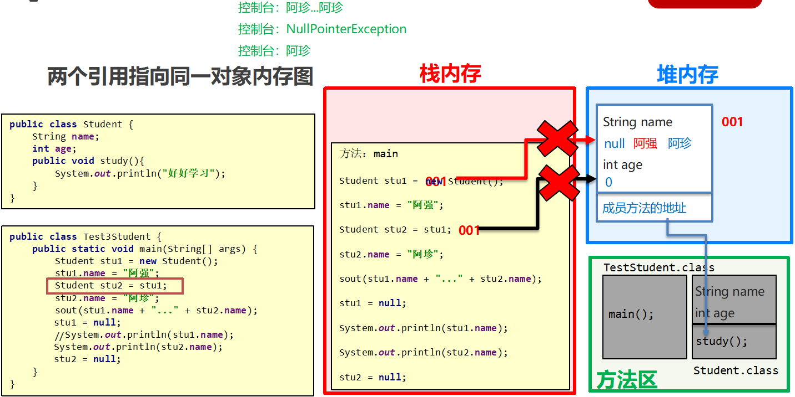

<!--
 * @Date           : 2021-04-27 00:23:17
 * @FilePath       : /jinnian-space/src/pages/java/module/basics/md/day07-面向对象.md
 * @Description    : 
-->
## 1. 类和对象

**面向对象和面向过程的思想对比 : **

​	**面向过程 ：**是一种以过程为中心的编程思想，实现功能的每一步，都是自己实现的

​	**面向对象 ：**是一种以对象为中心的编程思想，通过指挥对象实现具体的功能

### 1.1 类和对象的关系

客观存在的事物皆为对象 ，所以我们也常常说万物皆对象。

* 类
  * 类的理解
    * 类是对现实生活中一类具有共同属性和行为的事物的抽象
    * 类是对象的数据类型，类是具有相同属性和行为的一组对象的集合
    * 简单理解：类就是对现实事物的一种描述
  * 类的组成
    * 属性：指事物的特征，例如：手机事物（品牌，价格，尺寸）
    * 行为：指事物能执行的操作，例如：手机事物（打电话，发短信）
* 类和对象的关系
  * 类：类是对现实生活中一类具有共同属性和行为的事物的抽象
  * 对象：是能够看得到摸的着的真实存在的实体
  * 简单理解：**类是对事物的一种描述，对象则为具体存在的事物**

### 1.2 类的定义【应用】

类的组成是由属性和行为两部分组成

* **属性：**在类中通过成员变量来体现（类中方法外的变量）
* **行为：**在类中通过成员方法来体现（和前面的方法相比去掉static关键字即可）

**类的定义步骤：**

​	① 定义类

​	② 编写类的成员变量

​	③ 编写类的成员方法

```java
public class Student {
    // 属性 : 姓名, 年龄
    // 成员变量: 跟之前定义变量的格式一样, 只不过位置发生了改变, 类中方法外
    String name;
    int age;

    // 行为 : 学习
    // 成员方法: 跟之前定义方法的格式一样, 只不过去掉了static关键字.
    public void study(){
        System.out.println("学习");
    }
}
```


### 1.3 对象的创建和使用

* **创建对象的格式：**
  * 类名 对象名 = new 类名();
* **调用成员的格式：**
  * 对象名.成员变量
  * 对象名.成员方法();
* **示例代码 : **

```java
package com.itheima.object1;

public class TestStudent {
    /*
        创建对象的格式:
                类名 对象名 = new 类名();
        调用成员变量的格式:
                对象名.变量名
        调用成员方法的格式:
                对象名.方法名();
     */
    public static void main(String[] args) {
        // 类名 对象名 = new 类名();
        Student stu = new Student();
        // 对象名.变量名
        // 默认初始化值
        System.out.println(stu.name);  // null
        System.out.println(stu.age);   // 0

        stu.name = "张三";
        stu.age = 23;

        System.out.println(stu.name);  // 张三
        System.out.println(stu.age);   // 23

        // 对象名.方法名();
        stu.study();
        // com.itheima.object1.Student@b4c966a
        // 全类名(包名 + 类名)
        System.out.println(stu);
    }
}
```

### 1.4 案例-手机类的创建和使用

**需求 ：**首先定义一个手机类，然后定义一个手机测试类，在手机测试类中通过对象完成成员变量和成员方法的使用

**分析 ：**
* 成员变量：品牌, 价格
* 成员方法：打电话, 发短信

* 示例代码：

```java
package com.itheima.test1;

public class Phone {
    // 品牌, 价格
    String brand;
    int price;

    // 打电话, 发短信
    public void call(String name){
        System.out.println("给"+name+"打电话");
    }

    public void sendMessage(){
        System.out.println("群发短信");
    }
}
```

```java
package com.itheima.test1;

public class TestPhone {
    public static void main(String[] args) {
        // 1. 创建对象
        Phone p = new Phone();
        // 2. 给成员变量进行赋值
        p.brand = "大米";
        p.price = 2999;
        // 3. 打印赋值后的成员变量
        System.out.println(p.brand + "..." + p.price);
        // 4. 调用成员方法
        p.call("阿强");
        p.sendMessage();
    }
}
```

## 2. 对象内存图

### 2.1 单个对象内存图【理解】

* 


### 2.2 多个对象内存图【理解】

* 

* **总结：**

  多个对象在堆内存中，都有不同的内存划分，成员变量存储在各自的内存区域中，成员方法多个对象共用的一份

### 2.3 多个对象指向相同内存图【理解】



* **总结 :** 

  当多个对象的引用指向同一个内存空间（变量所记录的地址值是一样的）

  只要有任何一个对象修改了内存中的数据，随后，无论使用哪一个对象进行数据获取，都是修改后的数据。


## 3. 成员变量和局部变量

### 3.1 成员变量和局部变量的区别

* **类中位置不同：**成员变量（类中方法外）局部变量（方法内部或方法声明上）
* **内存中位置不同：**成员变量（堆内存）局部变量（栈内存）
* **生命周期不同：**成员变量（随着对象的存在而存在，随着对象的消失而消失）局部变量（随着方法的调用而存在，醉着方法的调用完毕而消失）
* **初始化值不同：**成员变量（有默认初始化值）局部变量（没有默认初始化值，必须先定义，赋值才能使用）

## 4. 封装

### 4.1 private关键字

​	**概述 :** private是一个修饰符，可以用来修饰成员（成员变量，成员方法）

​	**特点 :** 被private修饰的成员，只能在本类进行访问，针对private修饰的成员变量，如果需要被其他类使用，	提供相应的操作

​		提供“get变量名()”方法，用于获取成员变量的值，方法用public修饰

​		提供“set变量名(参数)”方法，用于设置成员变量的值，方法用public修饰

​	**示例代码：**

```java
/*
    学生类
 */
class Student {
    //成员变量
    String name;
    private int age;

    //提供get/set方法
    public void setAge(int a) {
        if(a<0 || a>120) {
            System.out.println("你给的年龄有误");
        } else {
            age = a;
        }
    }

    public int getAge() {
        return age;
    }

    //成员方法
    public void show() {
        System.out.println(name + "," + age);
    }
}
/*
    学生测试类
 */
public class StudentDemo {
    public static void main(String[] args) {
        //创建对象
        Student s = new Student();
        //给成员变量赋值
        s.name = "林青霞";
        s.setAge(30);
        //调用show方法
        s.show();
    }
}
```
### 4.2 private关键字的使用

* **需求：**

  * 定义标准的学生类，要求name和age使用private修饰
  * 并提供set和get方法以及便于显示数据的show方法
  * 测试类中创建对象并使用，最终控制台输出  林青霞，30 

* **示例代码：**

  ```java
  /*
      学生类
   */
  class Student {
      //成员变量
      private String name;
      private int age;
  
      //get/set方法
      public void setName(String n) {
          name = n;
      }
  
      public String getName() {
          return name;
      }
  
      public void setAge(int a) {
          age = a;
      }
  
      public int getAge() {
          return age;
      }
  
      public void show() {
          System.out.println(name + "," + age);
      }
  }
  /*
      学生测试类
   */
  public class StudentDemo {
      public static void main(String[] args) {
          //创建对象
          Student s = new Student();
  
          //使用set方法给成员变量赋值
          s.setName("林青霞");
          s.setAge(30);
  
          s.show();
  
          //使用get方法获取成员变量的值
          System.out.println(s.getName() + "---" + s.getAge());
          System.out.println(s.getName() + "," + s.getAge());
  
      }
  }
  ```

### 4.3 this关键字【应用】

**概述 :** this修饰的变量用于指代成员变量，其主要作用是（区分局部变量和成员变量的重名问题）
* 方法的形参如果与成员变量同名，不带this修饰的变量指的是形参，而不是成员变量
* 方法的形参没有与成员变量同名，不带this修饰的变量指的是成员变量

**代码实现 :** 

```java
public class Student {
    private String name;
    private int age;

    public void setName(String name) {
        this.name = name;
    }

    public String getName() {
        return name;
    }

    public void setAge(int age) {
        this.age = age;
    }

    public int getAge() {
        return age;
    }

    public void show() {
        System.out.println(name + "," + age);
    }
}
```

### 4.4 this内存原理【理解】

* **注意 :** this代表当前调用方法的引用，哪个对象调用的方法，this就代表哪一个对象

* **图解 ：**

* 

  

### 4.5 封装思想

1. **封装概述**
    是面向对象三大特征之一（封装，继承，多态）
    是面向对象编程语言对客观世界的模拟，客观世界里成员变量都是隐藏在对象内部的，外界是无法直接操作的
2. **封装原则**
    将类的某些信息隐藏在类内部，不允许外部程序直接访问，而是通过该类提供的方法来实现对隐藏信息的操作和访问
    成员变量private，提供对应的getXxx()/setXxx()方法
3. **封装好处**
    通过方法来控制成员变量的操作，提高了代码的安全性
    把代码用方法进行封装，提高了代码的复用性

## 5. 构造方法

### 5.1 构造方法的格式和执行时机

* **格式注意 :**
  *  方法名与类名相同，大小写也要一致
  * 没有返回值类型，连void都没有
  * 没有具体的返回值（不能由retrun带回结果数据）
* **执行时机 ：**
  * 创建对象的时候调用，每创建一次对象，就会执行一次构造方法
  * 不能手动调用构造方法
* **示例代码：**

```java
class Student {
    private String name;
    private int age;

    //构造方法
    public Student() {
        System.out.println("无参构造方法");
    }

    public void show() {
        System.out.println(name + "," + age);
    }
}
/*
    测试类
 */
public class StudentDemo {
    public static void main(String[] args) {
        //创建对象
        Student s = new Student();
        s.show();
    }
}
```

### 5.2 构造方法的作用

* 用于给对象的数据（属性）进行初始化

```java
package com.itheima.constructor;

public class Student {
    /*
        格式:

               1. 方法名需要跟类名相同, 大小写也要一致
               2. 没有返回值类型, 连void都没有
               3. 没有具体的返回值(不能由return带回具体的结果)
     */

    private String name;
    private int age;

    // 1. 如果一个类中没有编写任何构造方法, 系统将会提供一个默认的无参数构造方法
    public Student(){}

    // 2. 如果手动编写了构造方法, 系统就不会再提供默认的无参数构造方法了
    public Student(String name, int age){
        this.name = name;
        this.age = age;
        System.out.println("我是Student类的构造方法");
    }

    public void show(){
        System.out.println(name + "..." + age);
    }
}
```

```java
package com.itheima.constructor;

public class TestStudent {
    public static void main(String[] args) {
        Student stu1 = new Student("张三",23);
        stu1.show();

        Student stu2 = new Student();
    }
}
```


### 5.3 构造方法的注意事项

**构造方法的创建 :** 

​	如果没有定义构造方法，系统将给出一个默认的无参数构造方法

​	如果定义了构造方法，系统将不再提供默认的构造方法

**构造方法的创建 :** 

​	如果没有定义构造方法，系统将给出一个默认的无参数构造方法如果定义了构造方法，系统将不再提供默认的构造方法

**推荐的使用方式 :** 

​	无论是否使用，都手动书写无参数构造方法，和带参数构造方法


### 5.4 标准类的代码编写和使用

**代码 :** 

```java
package com.itheima.test3;

/*
    JavaBean类: 封装数据
 */
public class Student {
    private String name;
    private int age;

    public Student() {
    }

    public Student(String name, int age) {
        this.name = name;
        this.age = age;
    }

    public String getName() {
        return name;
    }

    public void setName(String name) {
        this.name = name;
    }

    public int getAge() {
        return age;
    }

    public void setAge(int age) {
        this.age = age;
    }

    public void show(){
        System.out.println(name + "..." + age);
    }
}

```

```java
package com.itheima.test3;

public class TestStudent {
    public static void main(String[] args) {
        // 1. 无参数构造方法创建对象, 通过setXxx方法给成员变量进行赋值
        Student stu1 = new Student();
        stu1.setName("张三");
        stu1.setAge(23);
        stu1.show();

        // 2. 通过带参数构造方法, 直接给属性进行赋值
        Student stu2 = new Student("李四",24);
        stu2.show();
    }
}

```

