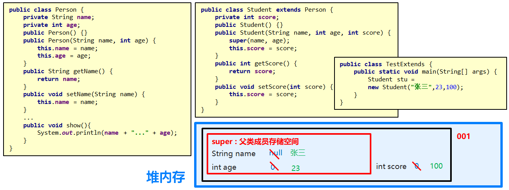
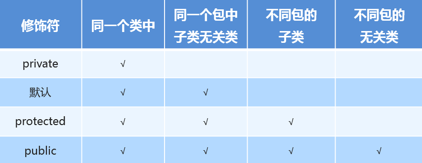

## 1. 继承

### 1.1 继承的实现（掌握）

- 继承的概念

  - 继承是面向对象三大特征之一，可以使得子类具有父类的属性和方法，还可以在子类中重新定义，以及追加属性和方法

- 实现继承的格式

  - 继承通过extends实现
  - 格式：class 子类 extends 父类 { } 
    - 举例：class Dog extends Animal { }

- 继承带来的好处

  - 继承可以让类与类之间产生关系，子父类关系，产生子父类后，子类则可以使用父类中非私有的成员。

- 示例代码

  ```java
  public class Fu {
      public void show() {
          System.out.println("show方法被调用");
      }
  }
  public class Zi extends Fu {
      public void method() {
          System.out.println("method方法被调用");
      }
  }
  public class Demo {
      public static void main(String[] args) {
          //创建对象，调用方法
          Fu f = new Fu();
          f.show();

          Zi z = new Zi();
          z.method();
          z.show();
      }
  }
  ```

### 1.2 继承的好处和弊端（理解）

- 继承好处
  - 提高了代码的复用性(多个类相同的成员可以放到同一个类中)
  - 提高了代码的维护性(如果方法的代码需要修改，修改一处即可)
- 继承弊端
  - 继承让类与类之间产生了关系，类的耦合性增强了，当父类发生变化时子类实现也不得不跟着变化，削弱了子类的独立性
- 继承的应用场景：
  - 使用继承，需要考虑类与类之间是否存在is..a的关系，不能盲目使用继承
    - is..a的关系：谁是谁的一种，例如：老师和学生是人的一种，那人就是父类，学生和老师就是子类

### 1.3. Java中继承的特点（掌握）

- Java中继承的特点

  1. Java中类只支持单继承，不支持多继承
     - 错误范例：class A extends B, C { }
  2. Java中类支持多层继承

- 多层继承示例代码：

  ```java
  public class Granddad {

      public void drink() {
          System.out.println("爷爷爱喝酒");
      }

  }

  public class Father extends Granddad {

      public void smoke() {
          System.out.println("爸爸爱抽烟");
      }

  }

  public class Mother {

      public void dance() {
          System.out.println("妈妈爱跳舞");
      }

  }
  public class Son extends Father {
  	// 此时，Son类中就同时拥有drink方法以及smoke方法
  }
  ```

## 2. 继承中的成员访问特点

### 2.1 继承中变量的访问特点（掌握）

在子类方法中访问一个变量，采用的是就近原则。

1. 子类局部范围找
2. 子类成员范围找
3. 父类成员范围找
4. 如果都没有就报错(不考虑父亲的父亲…)

- 示例代码

  ```java
  class Fu {
      int num = 10;
  }
  class Zi {
      int num = 20;
      public void show(){
          int num = 30;
          System.out.println(num);
      }
  }
  public class Demo1 {
      public static void main(String[] args) {
          Zi z = new Zi();
          z.show();	// 输出show方法中的局部变量30
      }
  }
  ```

### 2.2 super（掌握）

- this&super关键字：
  - this：代表本类对象的引用
  - super：代表父类存储空间的标识(可以理解为父类对象引用)
- this和super的使用分别
  - 成员变量：
    - this.成员变量    -   访问本类成员变量
    - super.成员变量 -   访问父类成员变量
  - 成员方法：
    - this.成员方法  - 访问本类成员方法
    - super.成员方法 - 访问父类成员方法
- 构造方法：
  - this(…)  -  访问本类构造方法
  - super(…)  -  访问父类构造方法

### 2.3 继承中构造方法的访问特点（理解）

**注意：子类中所有的构造方法默认都会访问父类中无参的构造方法**

​	子类会继承父类中的数据，可能还会使用父类的数据。所以，子类初始化之前，一定要先完成父类数据的初始化，原因在于，每一个子类构造方法的第一条语句默认都是：super()

**问题：如果父类中没有无参构造方法，只有带参构造方法，该怎么办呢？**

```
1. 通过使用super关键字去显示的调用父类的带参构造方法
2. 子类通过this去调用本类的其他构造方法,本类其他构造方法再通过super去手动调用父类的带参的构造方法

注意: this(…)super(…) 必须放在构造方法的第一行有效语句，并且二者不能共存
```

### 2.4 继承中成员方法的访问特点（掌握）

通过子类对象访问一个方法

1. 子类成员范围找
2. 父类成员范围找
3. 如果都没有就报错(不考虑父亲的父亲…)

### 2.5 super内存图（理解）

- 对象在堆内存中，会单独存在一块super区域，用来存放父类的数据 

  

### 2.6 方法重写（掌握）

- 1、方法重写概念
  - 子类出现了和父类中一模一样的方法声明（方法名一样，参数列表也必须一样）
- 2、方法重写的应用场景
  - 当子类需要父类的功能，而功能主体子类有自己特有内容时，可以重写父类中的方法，这样，即沿袭了父类的功能，又定义了子类特有的内容
- 3、Override注解
  - 用来检测当前的方法，是否是重写的方法，起到【校验】的作用

### 2.7 方法重写的注意事项（掌握）

- 方法重写的注意事项

1. 私有方法不能被重写(父类私有成员子类是不能继承的)
2. 子类方法访问权限不能更低(public > 默认 > 私有)
3. 静态方法不能被重写,如果子类也有相同的方法,并不是重写的父类的方法

- 示例代码

```java
public class Fu {
    private void show() {
        System.out.println("Fu中show()方法被调用");
    }

    void method() {
        System.out.println("Fu中method()方法被调用");
    }
}

public class Zi extends Fu {

    /* 编译【出错】，子类不能重写父类私有的方法*/
    @Override
    private void show() {
        System.out.println("Zi中show()方法被调用");
    }
   
    /* 编译【出错】，子类重写父类方法的时候，访问权限需要大于等于父类 */
    @Override
    private void method() {
        System.out.println("Zi中method()方法被调用");
    }

    /* 编译【通过】，子类重写父类方法的时候，访问权限需要大于等于父类 */
    @Override
    public void method() {
        System.out.println("Zi中method()方法被调用");
    }
}
```

### 2.8 权限修饰符 (理解) 



### 2.9 黑马信息管理系统使用继承改进 (掌握) 

+ 需求

  把学生类和老师类共性的内容向上抽取,抽取到出一个 Person 父类,让学生类和老师类继承 Person 类

+ 实现步骤

  1. 抽取Person类

  2. 优化StudentController类中，inputStudentInfo方法，将setXxx赋值方式，改进为构造方法初始化

     注意：直接修改这种操作方式，不符合我们开发中的一个原则

     ​	开闭原则 ( 对扩展开放对修改关闭 ) : 尽量在不更改原有代码的前提下以完成需求 

     解决：重新创建一个OtherStudentController类

     编写新的inputStudentInfo方法

  3. 根据StudentController类、OtherStudentController类，向上抽取出BaseStudentController类
     再让StudentController类、OtherStudentController类，继承BaseStudentController类

+ 代码实现

  Person类及学生类和老师类

  ```java
  public class Person {
      private String id;
      private String name;
      private String age;
      private String birthday;

      public Person() {
      }

      public Person(String id, String name, String age, String birthday) {
          this.id = id;
          this.name = name;
          this.age = age;
          this.birthday = birthday;
      }

      public String getId() {
          return id;
      }

      public void setId(String id) {
          this.id = id;
      }

      public String getName() {
          return name;
      }

      public void setName(String name) {
          this.name = name;
      }

      public String getAge() {
          return age;
      }

      public void setAge(String age) {
          this.age = age;
      }

      public String getBirthday() {
          return birthday;
      }

      public void setBirthday(String birthday) {
          this.birthday = birthday;
      }
  }
  // Student类
  public class Student extends Person {
      public Student() {
      }

      public Student(String id, String name, String age, String birthday) {
          super(id, name, age, birthday);
      }
  }
  // Teacher类
  public class Teacher extends Person {
      public Teacher() {
      }

      public Teacher(String id, String name, String age, String birthday) {
          super(id, name, age, birthday);
      }
  }
  ```

  BaseStudentController类

  ```java
  public abstract class BaseStudentController {
      // 业务员对象
      private StudentService studentService = new StudentService();

      private Scanner sc = new Scanner(System.in);

      // 开启学生管理系统, 并展示学生管理系统菜单
      public void start() {
          //Scanner sc = new Scanner(System.in);
          studentLoop:
          while (true) {
              System.out.println("--------欢迎来到 <学生> 管理系统--------");
              System.out.println("请输入您的选择: 1.添加学生  2.删除学生  3.修改学生  4.查看学生  5.退出");
              String choice = sc.next();
              switch (choice) {
                  case "1":
                      // System.out.println("添加");
                      addStudent();
                      break;
                  case "2":
                      // System.out.println("删除");
                      deleteStudentById();
                      break;
                  case "3":
                      // System.out.println("修改");
                      updateStudent();
                      break;
                  case "4":
                      // System.out.println("查询");
                      findAllStudent();
                      break;
                  case "5":
                      System.out.println("感谢您使用学生管理系统, 再见!");
                      break studentLoop;
                  default:
                      System.out.println("您的输入有误, 请重新输入");
                      break;
              }
          }
      }

      // 修改学生方法
      public void updateStudent() {
          String updateId = inputStudentId();
          Student newStu = inputStudentInfo(updateId);
          studentService.updateStudent(updateId, newStu);

          System.out.println("修改成功!");
      }

      // 删除学生方法
      public void deleteStudentById() {
          String delId = inputStudentId();
          // 3. 调用业务员中的deleteStudentById根据id, 删除学生
          studentService.deleteStudentById(delId);
          // 4. 提示删除成功
          System.out.println("删除成功!");
      }

      // 查看学生方法
      public void findAllStudent() {
          // 1. 调用业务员中的获取方法, 得到学生的对象数组
          Student[] stus = studentService.findAllStudent();
          // 2. 判断数组的内存地址, 是否为null
          if (stus == null) {
              System.out.println("查无信息, 请添加后重试");
              return;
          }
          // 3. 遍历数组, 获取学生信息并打印在控制台
          System.out.println("学号\t\t姓名\t年龄\t生日");
          for (int i = 0; i < stus.length; i++) {
              Student stu = stus[i];
              if (stu != null) {
                  System.out.println(stu.getId() + "\t" + stu.getName() + "\t" + stu.getAge() + "\t\t" + stu.getBirthday());
              }
          }
      }

      // 添加学生方法
      public void addStudent() {
          // StudentService studentService = new StudentService();
          // 1. 键盘接收学生信息
          String id;
          while (true) {
              System.out.println("请输入学生id:");
              id = sc.next();
              boolean flag = studentService.isExists(id);
              if (flag) {
                  System.out.println("学号已被占用, 请重新输入");
              } else {
                  break;
              }
          }

          Student stu = inputStudentInfo(id);

          // 3. 将学生对象,传递给StudentService(业务员)中的addStudent方法
          boolean result = studentService.addStudent(stu);
          // 4. 根据返回的boolean类型结果, 在控制台打印成功\失败
          if (result) {
              System.out.println("添加成功");
          } else {
              System.out.println("添加失败");
          }
      }

      // 键盘录入学生id
      public String inputStudentId() {
          String id;
          while (true) {
              System.out.println("请输入学生id:");
              id = sc.next();
              boolean exists = studentService.isExists(id);
              if (!exists) {
                  System.out.println("您输入的id不存在, 请重新输入:");
              } else {
                  break;
              }
          }
          return id;
      }

      // 键盘录入学生信息
      // 开闭原则: 对扩展内容开放, 对修改内容关闭
    public Student inputStudentInfo(String id){
      return null;
    }
  }
  ```

  StudentController类

  ```java
  public class StudentController extends BaseStudentController {

      private Scanner sc = new Scanner(System.in);

      // 键盘录入学生信息
      // 开闭原则: 对扩展内容开放, 对修改内容关闭
      @Override
      public Student inputStudentInfo(String id) {
          System.out.println("请输入学生姓名:");
          String name = sc.next();
          System.out.println("请输入学生年龄:");
          String age = sc.next();
          System.out.println("请输入学生生日:");
          String birthday = sc.next();
          Student stu = new Student();
          stu.setId(id);
          stu.setName(name);
          stu.setAge(age);
          stu.setBirthday(birthday);
          return stu;
      }
  }
  ```

  OtherStudentController类

  ```java
  public class OtherStudentController extends BaseStudentController {

      private Scanner sc = new Scanner(System.in);

      // 键盘录入学生信息
      // 开闭原则: 对扩展内容开放, 对修改内容关闭
      @Override
      public Student inputStudentInfo(String id) {
          System.out.println("请输入学生姓名:");
          String name = sc.next();
          System.out.println("请输入学生年龄:");
          String age = sc.next();
          System.out.println("请输入学生生日:");
          String birthday = sc.next();
          Student stu = new Student(id,name,age,birthday);
          return stu;
      }
  }
  ```

## 3.抽象类

### 3.1抽象类的概述（理解）

​	当我们在做子类共性功能抽取时，有些方法在父类中并没有具体的体现，这个时候就需要抽象类了！

​	在Java中，一个没有方法体的方法应该定义为抽象方法，而类中如果有抽象方法，该类必须定义为抽象类！

### 3.2抽象类的特点（记忆）

- 抽象类和抽象方法必须使用 abstract 关键字修饰

  ```java
  //抽象类的定义
  public abstract class 类名 {}

  //抽象方法的定义
  public abstract void eat();
  ```

- 抽象类中不一定有抽象方法，有抽象方法的类一定是抽象类

- 抽象类不能实例化

- 抽象类可以有构造方法

- 抽象类的子类

  ​	要么重写抽象类中的所有抽象方法

  ​	要么是抽象类

### 3.3抽象类的案例（应用）

- 案例需求

  ​	定义猫类(Cat)和狗类(Dog)

  ​	猫类成员方法：eat（猫吃鱼）drink（喝水…）

  ​	狗类成员方法：eat（狗吃肉）drink（喝水…）

- 实现步骤

  1. 猫类和狗类中存在共性内容，应向上抽取出一个动物类（Animal）
  2. 父类Animal中，无法将 eat 方法具体实现描述清楚，所以定义为抽象方法
  3. 抽象方法需要存活在抽象类中，将Animal定义为抽象类
  4. 让 Cat 和 Dog 分别继承 Animal，重写eat方法
  5. 测试类中创建 Cat 和 Dog 对象，调用方法测试

- 代码实现

  - 动物类

  ```java
  public abstract class Animal {
      public void drink(){
          System.out.println("喝水");
      }

      public Animal(){

      }

      public abstract void eat();
  }
  ```

  - 猫类

  ```java
  public class Cat extends Animal {
      @Override
      public void eat() {
          System.out.println("猫吃鱼");
      }
  }
  ```

  - 狗类

  ```java
  public class Dog extends Animal {
      @Override
      public void eat() {
          System.out.println("狗吃肉");
      }
  }
  ```

  - 测试类

  ```java
  public static void main(String[] args) {
          Dog d = new Dog();
          d.eat();
          d.drink();

          Cat c = new Cat();
          c.drink();
          c.eat();

          //Animal a = new Animal();
          //a.eat();
      }
  ```

### 3.4模板设计模式 

+ 设计模式

  设计模式（Design pattern）是一套被反复使用、多数人知晓的、经过分类编目的、代码设计经验的总结。
  使用设计模式是为了可重用代码、让代码更容易被他人理解、保证代码可靠性、程序的重用性。

+ 模板设计模式

  把抽象类整体就可以看做成一个模板，模板中不能决定的东西定义成抽象方法
  让使用模板的类（继承抽象类的类）去重写抽象方法实现需求

+ 模板设计模式的优势

  模板已经定义了通用结构，使用者只需要关心自己需要实现的功能即可

+ 示例代码

  模板类

  ```java
  /*
      作文模板类
   */
  public abstract class CompositionTemplate {

      public final void write(){
          System.out.println("<<我的爸爸>>");

          body();

          System.out.println("啊~ 这就是我的爸爸");

      }

      public abstract void body();
  }
  ```

  实现类A

  ```java
  public class Tom extends CompositionTemplate {

      @Override
      public void body() {
          System.out.println("那是一个秋天, 风儿那么缠绵,记忆中, " +
                  "那天爸爸骑车接我放学回家,我的脚卡在了自行车链当中, 爸爸蹬不动,他就站起来蹬...");
      }
  }
  ```

  实现类B

  ```java
  public class Tony extends CompositionTemplate {
      @Override
      public void body() {

      }

      /*public void write(){

      }*/
  }
  ```

  测试类

  ```java
  public class Test {
      public static void main(String[] args) {
          Tom t = new Tom();
          t.write();
      }
  }
  ```

### 3.5final（应用）

- fianl关键字的作用

  - final代表最终的意思，可以修饰成员方法，成员变量，类

- final修饰类、方法、变量的效果  

  - fianl修饰类：该类不能被继承（不能有子类，但是可以有父类）

  - final修饰方法：该方法不能被重写

  - final修饰变量：表明该变量是一个常量，不能再次赋值

    + 变量是基本类型,不能改变的是值

    + 变量是引用类型,不能改变的是地址值,但地址里面的内容是可以改变的

    + 举例

      ```java
      public static void main(String[] args){
          final Student s = new Student(23);
        	s = new Student(24);  // 错误
       	s.setAge(24);  // 正确
      }
      ```

### 3.6黑马信息管理系统使用抽象类改进 (应用)

+ 需求

  1. 使用抽象类的思想，将BaseStudentController 中的 inputStudentInfo 方法，定义为抽象方法
  2. 将不希望子类重写的方法，使用 final 进行修饰

+ 代码实现

  BaseStudentController类

  ```java
  public abstract class BaseStudentController {
      // 业务员对象
      private StudentService studentService = new StudentService();

      private Scanner sc = new Scanner(System.in);

      // 开启学生管理系统, 并展示学生管理系统菜单
      public final void start() {
          //Scanner sc = new Scanner(System.in);
          studentLoop:
          while (true) {
              System.out.println("--------欢迎来到 <学生> 管理系统--------");
              System.out.println("请输入您的选择: 1.添加学生  2.删除学生  3.修改学生  4.查看学生  5.退出");
              String choice = sc.next();
              switch (choice) {
                  case "1":
                      // System.out.println("添加");
                      addStudent();
                      break;
                  case "2":
                      // System.out.println("删除");
                      deleteStudentById();
                      break;
                  case "3":
                      // System.out.println("修改");
                      updateStudent();
                      break;
                  case "4":
                      // System.out.println("查询");
                      findAllStudent();
                      break;
                  case "5":
                      System.out.println("感谢您使用学生管理系统, 再见!");
                      break studentLoop;
                  default:
                      System.out.println("您的输入有误, 请重新输入");
                      break;
              }
          }
      }

      // 修改学生方法
      public final void updateStudent() {
          String updateId = inputStudentId();
          Student newStu = inputStudentInfo(updateId);
          studentService.updateStudent(updateId, newStu);

          System.out.println("修改成功!");
      }

      // 删除学生方法
      public final void deleteStudentById() {
          String delId = inputStudentId();
          // 3. 调用业务员中的deleteStudentById根据id, 删除学生
          studentService.deleteStudentById(delId);
          // 4. 提示删除成功
          System.out.println("删除成功!");
      }

      // 查看学生方法
      public final void findAllStudent() {
          // 1. 调用业务员中的获取方法, 得到学生的对象数组
          Student[] stus = studentService.findAllStudent();
          // 2. 判断数组的内存地址, 是否为null
          if (stus == null) {
              System.out.println("查无信息, 请添加后重试");
              return;
          }
          // 3. 遍历数组, 获取学生信息并打印在控制台
          System.out.println("学号\t\t姓名\t年龄\t生日");
          for (int i = 0; i < stus.length; i++) {
              Student stu = stus[i];
              if (stu != null) {
                  System.out.println(stu.getId() + "\t" + stu.getName() + "\t" + stu.getAge() + "\t\t" + stu.getBirthday());
              }
          }
      }

      // 添加学生方法
      public final void addStudent() {
          // StudentService studentService = new StudentService();
          // 1. 键盘接收学生信息
          String id;
          while (true) {
              System.out.println("请输入学生id:");
              id = sc.next();
              boolean flag = studentService.isExists(id);
              if (flag) {
                  System.out.println("学号已被占用, 请重新输入");
              } else {
                  break;
              }
          }

          Student stu = inputStudentInfo(id);

          // 3. 将学生对象,传递给StudentService(业务员)中的addStudent方法
          boolean result = studentService.addStudent(stu);
          // 4. 根据返回的boolean类型结果, 在控制台打印成功\失败
          if (result) {
              System.out.println("添加成功");
          } else {
              System.out.println("添加失败");
          }
      }

      // 键盘录入学生id
      public String inputStudentId() {
          String id;
          while (true) {
              System.out.println("请输入学生id:");
              id = sc.next();
              boolean exists = studentService.isExists(id);
              if (!exists) {
                  System.out.println("您输入的id不存在, 请重新输入:");
              } else {
                  break;
              }
          }
          return id;
      }

      // 键盘录入学生信息
      // 开闭原则: 对扩展内容开放, 对修改内容关闭
    public abstract Student inputStudentInfo(String id);
  }
  ```

## 4.代码块 

### 4.1代码块概述 (理解)

在Java中，使用 { } 括起来的代码被称为代码块

### 4.2代码块分类 (理解) 

+ 局部代码块

  + 位置: 方法中定义

  + 作用: 限定变量的生命周期，及早释放，提高内存利用率

  + 示例代码

    ```java
    public class Test {
        /*
            局部代码块
                位置：方法中定义
                作用：限定变量的生命周期，及早释放，提高内存利用率
         */
        public static void main(String[] args) {
            {
                int a = 10;
                System.out.println(a);
            }

           // System.out.println(a);
        }
    }
    ```

+ 构造代码块

  + 位置: 类中方法外定义

  + 特点: 每次构造方法执行的时，都会执行该代码块中的代码，并且在构造方法执行前执行

  + 作用: 将多个构造方法中相同的代码，抽取到构造代码块中，提高代码的复用性

  + 示例代码

    ```java
    public class Test {
        /*
            构造代码块:
                位置：类中方法外定义
                特点：每次构造方法执行的时，都会执行该代码块中的代码，并且在构造方法执行前执行
                作用：将多个构造方法中相同的代码，抽取到构造代码块中，提高代码的复用性
         */
        public static void main(String[] args) {
            Student stu1 = new Student();
            Student stu2 = new Student(10);
        }
    }

    class Student {

        {
            System.out.println("好好学习");
        }

        public Student(){
            System.out.println("空参数构造方法");
        }

        public Student(int a){
            System.out.println("带参数构造方法...........");
        }
    }
    ```

+ 静态代码块

  + 位置: 类中方法外定义

  + 特点: 需要通过static关键字修饰，随着类的加载而加载，并且只执行一次

  + 作用: 在类加载的时候做一些数据初始化的操作

  + 示例代码

    ```java
    public class Test {
        /*
            静态代码块:
                位置：类中方法外定义
                特点：需要通过static关键字修饰，随着类的加载而加载，并且只执行一次
                作用：在类加载的时候做一些数据初始化的操作
         */
        public static void main(String[] args) {
            Person p1 = new Person();
            Person p2 = new Person(10);
        }
    }

    class Person {
        static {
            System.out.println("我是静态代码块, 我执行了");
        }

        public Person(){
            System.out.println("我是Person类的空参数构造方法");
        }

        public Person(int a){
            System.out.println("我是Person类的带...........参数构造方法");
        }
    }
    ```

### 4.3黑马信息管理系统使用代码块改进 (应用) 

+ 需求

  使用静态代码块，初始化一些学生数据

+ 实现步骤

  1. 在StudentDao类中定义一个静态代码块，用来初始化一些学生数据
  2. 将初始化好的学生数据存储到学生数组中

+ 示例代码

  StudentDao类

  ```java
  public class StudentDao {
      // 创建学生对象数组
      private static Student[] stus = new Student[5];

      static {
          Student stu1 = new Student("heima001","张三","23","1999-11-11");
          Student stu2 = new Student("heima002","李四","24","2000-11-11");

          stus[0] = stu1;
          stus[1] = stu2;
      }

      // 添加学生方法
      public boolean addStudent(Student stu) {

          // 2. 添加学生到数组
          //2.1 定义变量index为-1，假设数组已经全部存满，没有null的元素
          int index = -1;
          //2.2 遍历数组取出每一个元素，判断是否是null
          for (int i = 0; i < stus.length; i++) {
              Student student = stus[i];
              if(student == null){
                  index = i;
                  //2.3 如果为null，让index变量记录当前索引位置，并使用break结束循环遍历
                  break;
              }
          }

          // 3. 返回是否添加成功的boolean类型状态
          if(index == -1){
              // 装满了
              return false;
          }else{
              // 没有装满, 正常添加, 返回true
              stus[index] = stu;
              return true;
          }
      }
      // 查看学生方法
      public Student[] findAllStudent() {
          return stus;
      }

      public void deleteStudentById(String delId) {
          // 1. 查找id在容器中所在的索引位置
          int index = getIndex(delId);
          // 2. 将该索引位置,使用null元素进行覆盖
          stus[index] = null;
      }

      public int getIndex(String id){
          int index = -1;
          for (int i = 0; i < stus.length; i++) {
              Student stu = stus[i];
              if(stu != null && stu.getId().equals(id)){
                  index = i;
                  break;
              }
          }
          return index;
      }

      public void updateStudent(String updateId, Student newStu) {
          // 1. 查找updateId, 在容器中的索引位置
          int index = getIndex(updateId);
          // 2. 将该索引位置, 使用新的学生对象替换
          stus[index] = newStu;
      }
  }
  ```

  ​

