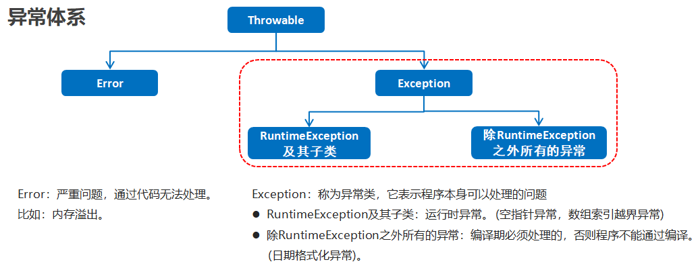
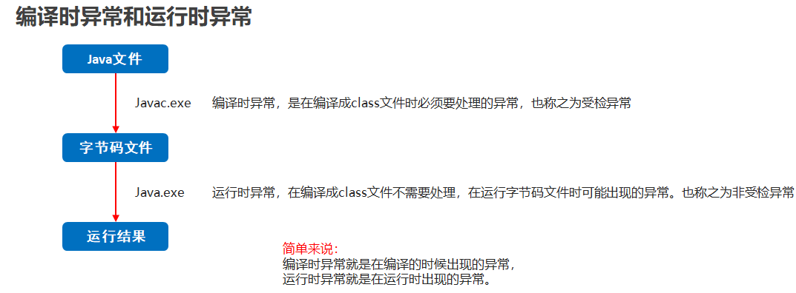
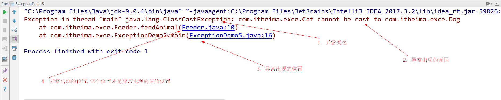

## 1.时间日期类

### 1.1 Date类（应用）

+ 计算机中时间原点

  1970年1月1日 00:00:00

+ 时间换算单位

  1秒 = 1000毫秒

+ Date类概述

  Date 代表了一个特定的时间，精确到毫秒

+ Date类构造方法

  | 方法名                    | 说明                                  |
  | ---------------------- | ----------------------------------- |
  | public Date()          | 分配一个 Date对象，并初始化，以便它代表它被分配的时间，精确到毫秒 |
  | public Date(long date) | 分配一个 Date对象，并将其初始化为表示从标准基准时间起指定的毫秒数 |

+ 示例代码

  ```java
  public class DateDemo01 {
      public static void main(String[] args) {
          //public Date()：分配一个 Date对象，并初始化，以便它代表它被分配的时间，精确到毫秒
          Date d1 = new Date();
          System.out.println(d1);

          //public Date(long date)：分配一个 Date对象，并将其初始化为表示从标准基准时间起指定的毫秒数
          long date = 1000*60*60;
          Date d2 = new Date(date);
          System.out.println(d2);
      }
  }
  ```

### 1.2 Date类常用方法（应用）

- 常用方法

  | 方法名                            | 说明                                 |
  | ------------------------------ | ---------------------------------- |
  | public long getTime()          | 获取的是日期对象从1970年1月1日 00:00:00到现在的毫秒值 |
  | public void setTime(long time) | 设置时间，给的是毫秒值                        |

- 示例代码

  ```java
  public class DateDemo02 {
      public static void main(String[] args) {
          //创建日期对象
          Date d = new Date();

          //public long getTime():获取的是日期对象从1970年1月1日 00:00:00到现在的毫秒值
  //        System.out.println(d.getTime());
  //        System.out.println(d.getTime() * 1.0 / 1000 / 60 / 60 / 24 / 365 + "年");

          //public void setTime(long time):设置时间，给的是毫秒值
  //        long time = 1000*60*60;
          long time = System.currentTimeMillis();
          d.setTime(time);

          System.out.println(d);
      }
  }
  ```

### 1.3 SimpleDateFormat类（应用）

- SimpleDateFormat类概述

  ​	SimpleDateFormat是一个具体的类，用于以区域设置敏感的方式格式化和解析日期。

  ​	我们重点学习日期格式化和解析

- SimpleDateFormat类构造方法

  | 方法名                                     | 说明                                  |
  | --------------------------------------- | ----------------------------------- |
  | public   SimpleDateFormat()             | 构造一个SimpleDateFormat，使用默认模式和日期格式    |
  | public SimpleDateFormat(String pattern) | 构造一个SimpleDateFormat使用给定的模式和默认的日期格式 |

- SimpleDateFormat类的常用方法

  - 格式化(从Date到String)
    - public final String format(Date date)：将日期格式化成日期/时间字符串
  - 解析(从String到Date)
    - public Date parse(String source)：从给定字符串的开始解析文本以生成日期

- 示例代码

  ```java
  public class SimpleDateFormatDemo {
      public static void main(String[] args) throws ParseException {
          //格式化：从 Date 到 String
          Date d = new Date();
  //        SimpleDateFormat sdf = new SimpleDateFormat();
          SimpleDateFormat sdf = new SimpleDateFormat("yyyy年MM月dd日 HH:mm:ss");
          String s = sdf.format(d);
          System.out.println(s);
          System.out.println("--------");

          //从 String 到 Date
          String ss = "2048-08-09 11:11:11";
          //ParseException
          SimpleDateFormat sdf2 = new SimpleDateFormat("yyyy-MM-dd HH:mm:ss");
          Date dd = sdf2.parse(ss);
          System.out.println(dd);
      }
  }
  ```

### 1.4 时间日期类练习 (应用) 

+ 需求

  秒杀开始时间是2020年11月11日 00:00:00,结束时间是2020年11月11日 00:10:00,用户小贾下单时间是2020年11月11日 00:03:47,用户小皮下单时间是2020年11月11日 00:10:11,判断用户有没有成功参与秒杀活动

+ 实现步骤

  1. 判断下单时间是否在开始到结束的范围内
  2. 把字符串形式的时间变成毫秒值

+ 代码实现

  ```java
  public class DateDemo5 {
      public static void main(String[] args) throws ParseException {
          //开始时间：2020年11月11日 0:0:0
          //结束时间：2020年11月11日 0:10:0

          //小贾2020年11月11日 0:03:47
          //小皮2020年11月11日 0:10:11

          //1.判断两位同学的下单时间是否在范围之内就可以了。

          //2.要把每一个时间都换算成毫秒值。

          String start = "2020年11月11日 0:0:0";
          String end = "2020年11月11日 0:10:0";

          String jia = "2020年11月11日 0:03:47";
          String pi = "2020年11月11日 0:10:11";

          SimpleDateFormat sdf = new SimpleDateFormat("yyyy年MM月dd日 HH:mm:ss");
          long startTime = sdf.parse(start).getTime();
          long endTime = sdf.parse(end).getTime();

  //        System.out.println(startTime);
  //        System.out.println(endTime);
          long jiaTime = sdf.parse(jia).getTime();
          long piTime = sdf.parse(pi).getTime();

          if(jiaTime >= startTime && jiaTime <= endTime){
              System.out.println("小贾同学参加上了秒杀活动");
          }else{
              System.out.println("小贾同学没有参加上秒杀活动");
          }

          System.out.println("------------------------");

          if(piTime >= startTime && piTime <= endTime){
              System.out.println("小皮同学参加上了秒杀活动");
          }else{
              System.out.println("小皮同学没有参加上秒杀活动");
          }

      }
    
  }
  ```

## 2.JDK8时间日期类 

### 2.1 JDK8新增日期类 (理解) 

+ LocalDate       表示日期（年月日）  
+ LocalTime       表示时间（时分秒）
+ LocalDateTime    表示时间+ 日期 （年月日时分秒）

### 2.2 LocalDateTime创建方法 (应用) 

+ 方法说明

  | 方法名                                      | 说明                              |
  | ---------------------------------------- | ------------------------------- |
  | public static LocalDateTime now()        | 获取当前系统时间                        |
  | public static LocalDateTime of  (年, 月 , 日, 时, 分, 秒) | 使用指定年月日和时分秒初始化一个LocalDateTime对象 |

+ 示例代码

  ```java
  public class JDK8DateDemo2 {
      public static void main(String[] args) {
          LocalDateTime now = LocalDateTime.now();
          System.out.println(now);

          LocalDateTime localDateTime = LocalDateTime.of(2020, 11, 11, 11, 11, 11);
          System.out.println(localDateTime);
      }
  }
  ```

### 2.3 LocalDateTime获取方法 (应用)

+ 方法说明

  | 方法名                             | 说明               |
  | ------------------------------- | ---------------- |
  | public int getYear()            | 获取年              |
  | public int getMonthValue()      | 获取月份（1-12）       |
  | public int getDayOfMonth()      | 获取月份中的第几天（1-31）  |
  | public int getDayOfYear()       | 获取一年中的第几天（1-366） |
  | public DayOfWeek getDayOfWeek() | 获取星期             |
  | public int getMinute()          | 获取分钟             |
  | public int getHour()            | 获取小时             |

+ 示例代码

  ```java
  public class JDK8DateDemo3 {
      public static void main(String[] args) {
          LocalDateTime localDateTime = LocalDateTime.of(2020, 11, 11, 11, 11, 20);
          //public int getYear()           获取年
          int year = localDateTime.getYear();
          System.out.println("年为" +year);
          //public int getMonthValue()     获取月份（1-12）
          int month = localDateTime.getMonthValue();
          System.out.println("月份为" + month);

          Month month1 = localDateTime.getMonth();
  //        System.out.println(month1);

          //public int getDayOfMonth()     获取月份中的第几天（1-31）
          int day = localDateTime.getDayOfMonth();
          System.out.println("日期为" + day);

          //public int getDayOfYear()      获取一年中的第几天（1-366）
          int dayOfYear = localDateTime.getDayOfYear();
          System.out.println("这是一年中的第" + dayOfYear + "天");

          //public DayOfWeek getDayOfWeek()获取星期
          DayOfWeek dayOfWeek = localDateTime.getDayOfWeek();
          System.out.println("星期为" + dayOfWeek);

          //public int getMinute()        获取分钟
          int minute = localDateTime.getMinute();
          System.out.println("分钟为" + minute);
          //public int getHour()           获取小时
    
          int hour = localDateTime.getHour();
          System.out.println("小时为" + hour);
      }
  }
  ```

### 2.4 LocalDateTime转换方法 (应用)

+ 方法说明

  | 方法名                              | 说明                |
  | -------------------------------- | ----------------- |
  | public LocalDate  toLocalDate () | 转换成为一个LocalDate对象 |
  | public LocalTime toLocalTime ()  | 转换成为一个LocalTime对象 |

+ 示例代码

  ```java
  public class JDK8DateDemo4 {
      public static void main(String[] args) {
          LocalDateTime localDateTime = LocalDateTime.of(2020, 12, 12, 8, 10, 12);
          //public LocalDate toLocalDate ()    转换成为一个LocalDate对象
          LocalDate localDate = localDateTime.toLocalDate();
          System.out.println(localDate);

          //public LocalTime toLocalTime ()    转换成为一个LocalTime对象
          LocalTime localTime = localDateTime.toLocalTime();
          System.out.println(localTime);
      }
  }
  ```

### 2.5 LocalDateTime格式化和解析 (应用)

+ 方法说明

  | 方法名                                      | 说明                                     |
  | ---------------------------------------- | -------------------------------------- |
  | public String format (指定格式)              | 把一个LocalDateTime格式化成为一个字符串             |
  | public LocalDateTime parse (准备解析的字符串, 解析格式) | 把一个日期字符串解析成为一个LocalDateTime对象          |
  | public static DateTimeFormatter ofPattern(String pattern) | 使用指定的日期模板获取一个日期格式化器DateTimeFormatter对象 |

+ 示例代码

  ```java
  public class JDK8DateDemo5 {
      public static void main(String[] args) {
          //method1();
          //method2();
      }

      private static void method2() {
          //public static LocalDateTime parse (准备解析的字符串, 解析格式) 把一个日期字符串解析成为一个LocalDateTime对象
          String s = "2020年11月12日 13:14:15";
          DateTimeFormatter pattern = DateTimeFormatter.ofPattern("yyyy年MM月dd日 HH:mm:ss");
          LocalDateTime parse = LocalDateTime.parse(s, pattern);
          System.out.println(parse);
      }

      private static void method1() {
          LocalDateTime localDateTime = LocalDateTime.of(2020, 11, 12, 13, 14, 15);
          System.out.println(localDateTime);
          //public String format (指定格式)   把一个LocalDateTime格式化成为一个字符串
          DateTimeFormatter pattern = DateTimeFormatter.ofPattern("yyyy年MM月dd日 HH:mm:ss");
          String s = localDateTime.format(pattern);
          System.out.println(s);
      }
  }
  ```

### 2.6 LocalDateTime增加或者减少时间的方法 (应用)

+ 方法说明

  | 方法名                                      | 说明      |
  | ---------------------------------------- | ------- |
  | public LocalDateTime plusYears (long years) | 添加或者减去年 |
  | public LocalDateTime plusMonths(long months) | 添加或者减去月 |
  | public LocalDateTime plusDays(long days) | 添加或者减去日 |
  | public LocalDateTime plusHours(long hours) | 添加或者减去时 |
  | public LocalDateTime plusMinutes(long minutes) | 添加或者减去分 |
  | public LocalDateTime plusSeconds(long seconds) | 添加或者减去秒 |
  | public LocalDateTime plusWeeks(long weeks) | 添加或者减去周 |

+ 示例代码

  ```java
  /**
   * JDK8 时间类添加或者减去时间的方法
   */
  public class JDK8DateDemo6 {
      public static void main(String[] args) {
          //public LocalDateTime plusYears (long years)   添加或者减去年

          LocalDateTime localDateTime = LocalDateTime.of(2020, 11, 11, 13, 14, 15);
          //LocalDateTime newLocalDateTime = localDateTime.plusYears(1);
          //System.out.println(newLocalDateTime);

          LocalDateTime newLocalDateTime = localDateTime.plusYears(-1);
          System.out.println(newLocalDateTime);
      }
  }
  ```

### 2.7 LocalDateTime减少或者增加时间的方法 (应用)

+ 方法说明

  | 方法名                                      | 说明      |
  | ---------------------------------------- | ------- |
  | public LocalDateTime  minusYears (long years) | 减去或者添加年 |
  | public LocalDateTime  minusMonths(long months) | 减去或者添加月 |
  | public LocalDateTime minusDays(long days) | 减去或者添加日 |
  | public LocalDateTime minusHours(long hours) | 减去或者添加时 |
  | public LocalDateTime minusMinutes(long minutes) | 减去或者添加分 |
  | public LocalDateTime minusSeconds(long seconds) | 减去或者添加秒 |
  | public LocalDateTime minusWeeks(long weeks) | 减去或者添加周 |

+ 示例代码

  ```java
  /**
   * JDK8 时间类减少或者添加时间的方法
   */
  public class JDK8DateDemo7 {
      public static void main(String[] args) {
          //public LocalDateTime minusYears (long years)  减去或者添加年
          LocalDateTime localDateTime = LocalDateTime.of(2020, 11, 11, 13, 14, 15);
          //LocalDateTime newLocalDateTime = localDateTime.minusYears(1);
          //System.out.println(newLocalDateTime);

          LocalDateTime newLocalDateTime = localDateTime.minusYears(-1);
          System.out.println(newLocalDateTime);

      }
  }
  ```

### 2.8 LocalDateTime修改方法 (应用)

+ 方法说明

  | 方法名                                      | 说明               |
  | ---------------------------------------- | ---------------- |
  | public LocalDateTime withYear(int year)  | 直接修改年            |
  | public LocalDateTime withMonth(int month) | 直接修改月            |
  | public LocalDateTime withDayOfMonth(int dayofmonth) | 直接修改日期(一个月中的第几天) |
  | public LocalDateTime withDayOfYear(int dayOfYear) | 直接修改日期(一年中的第几天)  |
  | public LocalDateTime withHour(int hour)  | 直接修改小时           |
  | public LocalDateTime withMinute(int minute) | 直接修改分钟           |
  | public LocalDateTime withSecond(int second) | 直接修改秒            |

+ 示例代码

  ```java
  /**
   * JDK8 时间类修改时间
   */
  public class JDK8DateDemo8 {
      public static void main(String[] args) {
          //public LocalDateTime withYear(int year)   修改年
          LocalDateTime localDateTime = LocalDateTime.of(2020, 11, 11, 13, 14, 15);
         // LocalDateTime newLocalDateTime = localDateTime.withYear(2048);
         // System.out.println(newLocalDateTime);

          LocalDateTime newLocalDateTime = localDateTime.withMonth(20);
          System.out.println(newLocalDateTime);

      }
  }
  ```

### 2.9 Period (应用)

+ 方法说明

  | 方法名                                     | 说明          |
  | --------------------------------------- | ----------- |
  | public static Period between(开始时间,结束时间) | 计算两个“时间"的间隔 |
  | public int getYears()                   | 获得这段时间的年数   |
  | public int getMonths()                  | 获得此期间的总月数   |
  | public int getDays()                    | 获得此期间的天数    |
  | public long toTotalMonths()             | 获取此期间的总月数   |

+ 示例代码

  ```java
  /**
   *  计算两个时间的间隔
   */
  public class JDK8DateDemo9 {
      public static void main(String[] args) {
          //public static Period between(开始时间,结束时间)  计算两个"时间"的间隔

          LocalDate localDate1 = LocalDate.of(2020, 1, 1);
          LocalDate localDate2 = LocalDate.of(2048, 12, 12);
          Period period = Period.between(localDate1, localDate2);
          System.out.println(period);//P28Y11M11D

          //public int getYears()         获得这段时间的年数
          System.out.println(period.getYears());//28
          //public int getMonths()        获得此期间的月数
          System.out.println(period.getMonths());//11
          //public int getDays()          获得此期间的天数
          System.out.println(period.getDays());//11

          //public long toTotalMonths()   获取此期间的总月数
          System.out.println(period.toTotalMonths());//347

      }
  }
  ```

### 2.10 Duration (应用)

+ 方法说明

  | 方法名                                      | 说明          |
  | ---------------------------------------- | ----------- |
  | public static Durationbetween(开始时间,结束时间) | 计算两个“时间"的间隔 |
  | public long toSeconds()                  | 获得此时间间隔的秒   |
  | public int toMillis()                    | 获得此时间间隔的毫秒  |
  | public int toNanos()                     | 获得此时间间隔的纳秒  |

+ 示例代码

  ```java
  /**
   *  计算两个时间的间隔
   */
  public class JDK8DateDemo10 {
      public static void main(String[] args) {
          //public static Duration between(开始时间,结束时间)  计算两个“时间"的间隔

          LocalDateTime localDateTime1 = LocalDateTime.of(2020, 1, 1, 13, 14, 15);
          LocalDateTime localDateTime2 = LocalDateTime.of(2020, 1, 2, 11, 12, 13);
          Duration duration = Duration.between(localDateTime1, localDateTime2);
          System.out.println(duration);//PT21H57M58S
          //public long toSeconds()	       获得此时间间隔的秒
          System.out.println(duration.toSeconds());//79078
          //public int toMillis()	           获得此时间间隔的毫秒
          System.out.println(duration.toMillis());//79078000
          //public int toNanos()             获得此时间间隔的纳秒
          System.out.println(duration.toNanos());//79078000000000
      }
  }
  ```

## 3.异常

### 3.1 异常（记忆）

- 异常的概述

  ​	异常就是程序出现了不正常的情况

- 异常的体系结构

  

### 3.2 编译时异常和运行时异常的区别（记忆）

- 编译时异常

  - 都是Exception类及其子类
  - 必须显示处理，否则程序就会发生错误，无法通过编译

- 运行时异常

  - 都是RuntimeException类及其子类
  - 无需显示处理，也可以和编译时异常一样处理

- 图示

  

### 3.3 JVM默认处理异常的方式（理解）

- 如果程序出现了问题，我们没有做任何处理，最终JVM 会做默认的处理，处理方式有如下两个步骤：
  - 把异常的名称，错误原因及异常出现的位置等信息输出在了控制台
  - 程序停止执行

### 3.4 查看异常信息 (理解) 

控制台在打印异常信息时,会打印异常类名,异常出现的原因,异常出现的位置

我们调bug时,可以根据提示,找到异常出现的位置,分析原因,修改异常代码



### 3.5 throws方式处理异常（应用）

- 定义格式

  ```java
  public void 方法() throws 异常类名 {
      
  }
  ```

- 示例代码

  ```java
  public class ExceptionDemo {
      public static void main(String[] args) throws ParseException{
          System.out.println("开始");
  //        method();
            method2();

          System.out.println("结束");
      }

      //编译时异常
      public static void method2() throws ParseException {
          String s = "2048-08-09";
          SimpleDateFormat sdf = new SimpleDateFormat("yyyy-MM-dd");
          Date d = sdf.parse(s);
          System.out.println(d);
      }

      //运行时异常
      public static void method() throws ArrayIndexOutOfBoundsException {
          int[] arr = {1, 2, 3};
          System.out.println(arr[3]);
      }
  }
  ```

- 注意事项

  - 这个throws格式是跟在方法的括号后面的
  - 编译时异常必须要进行处理，两种处理方案：try...catch …或者 throws，如果采用 throws 这种方案，在方法上进行显示声明,将来谁调用这个方法谁处理
  - 运行时异常因为在运行时才会发生,所以在方法后面可以不写,运行时出现异常默认交给jvm处理

### 3.6 throw抛出异常 (应用) 

+ 格式

  throw new 异常();

+ 注意

  这个格式是在方法内的，表示当前代码手动抛出一个异常，下面的代码不用再执行了

+ throws和throw的区别

  | throws                  | throw                 |
  | ----------------------- | --------------------- |
  | 用在方法声明后面，跟的是异常类名        | 用在方法体内，跟的是异常对象名       |
  | 表示声明异常，调用该方法有可能会出现这样的异常 | 表示手动抛出异常对象，由方法体内的语句处理 |

+ 示例代码

  ```java
  public class ExceptionDemo8 {
      public static void main(String[] args) {
          //int [] arr = {1,2,3,4,5};
          int [] arr = null;
          printArr(arr);//就会 接收到一个异常.
                          //我们还需要自己处理一下异常.
      }

      private static void printArr(int[] arr) {
          if(arr == null){
              //调用者知道成功打印了吗?
              //System.out.println("参数不能为null");
              throw new NullPointerException(); //当参数为null的时候
                                              //手动创建了一个异常对象,抛给了调用者,产生了一个异常
          }else{
              for (int i = 0; i < arr.length; i++) {
                  System.out.println(arr[i]);
              }
          }
      }

  }
  ```

### 3.7 try-catch方式处理异常（应用）

- 定义格式

  ```java
  try {
  	可能出现异常的代码;
  } catch(异常类名 变量名) {
  	异常的处理代码;
  }
  ```

- 执行流程

  - 程序从 try 里面的代码开始执行
  - 出现异常，就会跳转到对应的 catch 里面去执行
  - 执行完毕之后，程序还可以继续往下执行

- 示例代码

  ```java
  public class ExceptionDemo01 {
      public static void main(String[] args) {
          System.out.println("开始");
          method();
          System.out.println("结束");
      }

      public static void method() {
          try {
              int[] arr = {1, 2, 3};
              System.out.println(arr[3]);
              System.out.println("这里能够访问到吗");
          } catch (ArrayIndexOutOfBoundsException e) {
              System.out.println("你访问的数组索引不存在，请回去修改为正确的索引");
          }
      }
  }
  ```

- 注意

  1. 如果 try 中没有遇到问题，怎么执行？

     会把try中所有的代码全部执行完毕,不会执行catch里面的代码

  2. 如果 try 中遇到了问题，那么 try 下面的代码还会执行吗？

     那么直接跳转到对应的catch语句中,try下面的代码就不会再执行了
     当catch里面的语句全部执行完毕,表示整个体系全部执行完全,继续执行下面的代码

  3. 如果出现的问题没有被捕获，那么程序如何运行？

     那么try...catch就相当于没有写.那么也就是自己没有处理.
     默认交给虚拟机处理.

  4. 同时有可能出现多个异常怎么处理？

     出现多个异常,那么就写多个catch就可以了.
     注意点:如果多个异常之间存在子父类关系.那么父类一定要写在下面

### 3.8 Throwable成员方法（应用）

- 常用方法

  | 方法名                           | 说明                     |
  | ----------------------------- | ---------------------- |
  | public String getMessage()    | 返回此 throwable 的详细消息字符串 |
  | public String toString()      | 返回此可抛出的简短描述            |
  | public void printStackTrace() | 把异常的错误信息输出在控制台         |

- 示例代码

  ```java
  public class ExceptionDemo02 {
      public static void main(String[] args) {
          System.out.println("开始");
          method();
          System.out.println("结束");
      }

      public static void method() {
          try {
              int[] arr = {1, 2, 3};
              System.out.println(arr[3]); //new ArrayIndexOutOfBoundsException();
              System.out.println("这里能够访问到吗");
          } catch (ArrayIndexOutOfBoundsException e) { //new ArrayIndexOutOfBoundsException();
  //            e.printStackTrace();

              //public String getMessage():返回此 throwable 的详细消息字符串
  //            System.out.println(e.getMessage());
              //Index 3 out of bounds for length 3

              //public String toString():返回此可抛出的简短描述
  //            System.out.println(e.toString());
              //java.lang.ArrayIndexOutOfBoundsException: Index 3 out of bounds for length 3

              //public void printStackTrace():把异常的错误信息输出在控制台
              e.printStackTrace();
  //            java.lang.ArrayIndexOutOfBoundsException: Index 3 out of bounds for length 3
  //            at com.itheima_02.ExceptionDemo02.method(ExceptionDemo02.java:18)
  //            at com.itheima_02.ExceptionDemo02.main(ExceptionDemo02.java:11)

          }
      }
  }
  ```

### 3.9 异常的练习 (应用) 

+ 需求

  键盘录入学生的姓名和年龄,其中年龄为18 - 25岁,超出这个范围是异常数据不能赋值.需要重新录入,一直录到正确为止

+ 实现步骤

  1. 创建学生对象
  2. 键盘录入姓名和年龄，并赋值给学生对象
  3. 如果是非法数据就再次录入

+ 代码实现

  学生类

  ```java
  public class Student {
      private String name;
      private int age;

      public Student() {
      }

      public Student(String name, int age) {
          this.name = name;
          this.age = age;
      }

      public String getName() {
          return name;
      }

      public void setName(String name) {
          this.name = name;
      }

      public int getAge() {
          return age;
      }

      public void setAge(int age) {
          if(age >= 18 && age <= 25){
              this.age = age;
          }else{
              //当年龄不合法时,产生一个异常
              throw new RuntimeException("年龄超出了范围");
          }
      }

      @Override
      public String toString() {
          return "Student{" +
                  "name='" + name + '\'' +
                  ", age=" + age +
                  '}';
      }
  }
  ```

  测试类

  ```java
  public class ExceptionDemo12 {
      public static void main(String[] args) {
          // 键盘录入学生的姓名和年龄,其中年龄为 18 - 25岁,
          // 超出这个范围是异常数据不能赋值.需要重新录入,一直录到正确为止。

          Student s = new Student();

          Scanner sc = new Scanner(System.in);
          System.out.println("请输入姓名");
          String name = sc.nextLine();
          s.setName(name);
         while(true){
             System.out.println("请输入年龄");
             String ageStr = sc.nextLine();
             try {
                 int age = Integer.parseInt(ageStr);
                 s.setAge(age);
                 break;
             } catch (NumberFormatException e) {
                 System.out.println("请输入一个整数");
                 continue;
             } catch (AgeOutOfBoundsException e) {
                 System.out.println(e.toString());
                 System.out.println("请输入一个符合范围的年龄");
                 continue;
             }
             /*if(age >= 18 && age <=25){
                 s.setAge(age);
                 break;
             }else{
                 System.out.println("请输入符合要求的年龄");
                 continue;
             }*/
         }
          System.out.println(s);

      }
  }
  ```

### 3.10 自定义异常（应用）

+ 自定义异常概述

  当Java中提供的异常不能满足我们的需求时,我们可以自定义异常

+ 实现步骤

  1. 定义异常类
  2. 写继承关系
  3. 提供空参构造
  4. 提供带参构造

+ 代码实现

  异常类

  ```java
  public class AgeOutOfBoundsException extends RuntimeException {
      public AgeOutOfBoundsException() {
      }

      public AgeOutOfBoundsException(String message) {
          super(message);
      }
  }
  ```

  学生类

  ```java
  public class Student {
      private String name;
      private int age;

      public Student() {
      }

      public Student(String name, int age) {
          this.name = name;
          this.age = age;
      }

      public String getName() {
          return name;
      }

      public void setName(String name) {
          this.name = name;
      }

      public int getAge() {
          return age;
      }

      public void setAge(int age) {
          if(age >= 18 && age <= 25){
              this.age = age;
          }else{
              //如果Java中提供的异常不能满足我们的需求,我们可以使用自定义的异常
              throw new AgeOutOfBoundsException("年龄超出了范围");
          }
      }

      @Override
      public String toString() {
          return "Student{" +
                  "name='" + name + '\'' +
                  ", age=" + age +
                  '}';
      }
  }
  ```

  测试类

  ```java
  public class ExceptionDemo12 {
      public static void main(String[] args) {
          // 键盘录入学生的姓名和年龄,其中年龄为 18 - 25岁,
          // 超出这个范围是异常数据不能赋值.需要重新录入,一直录到正确为止。

          Student s = new Student();

          Scanner sc = new Scanner(System.in);
          System.out.println("请输入姓名");
          String name = sc.nextLine();
          s.setName(name);
         while(true){
             System.out.println("请输入年龄");
             String ageStr = sc.nextLine();
             try {
                 int age = Integer.parseInt(ageStr);
                 s.setAge(age);
                 break;
             } catch (NumberFormatException e) {
                 System.out.println("请输入一个整数");
                 continue;
             } catch (AgeOutOfBoundsException e) {
                 System.out.println(e.toString());
                 System.out.println("请输入一个符合范围的年龄");
                 continue;
             }
             /*if(age >= 18 && age <=25){
                 s.setAge(age);
                 break;
             }else{
                 System.out.println("请输入符合要求的年龄");
                 continue;
             }*/
         }
          System.out.println(s);

      }
  }
  ```


## 4.Optional

### 4.1获取对象(应用)

+ Optional概述

  可能包含或不包含非null值的容器对象

+ 方法介绍

  | 方法名                                      | 说明                                       |
  | ---------------------------------------- | ---------------------------------------- |
  | static <T> Optional<T> of(T value)       | 获取一个Optional对象，封装的是非null值的对象             |
  | static <T> Optional<T> ofNullable(T value) | 获取一个Optional对象，Optional封装的值对象可以是null也可以不是null |

+ 示例代码

  ```java
  public class OptionalDemo1 {
      public static void main(String[] args) {
          //method1();

          //public static <T> Optional<T> ofNullable(T value)
          //获取一个Optional对象，Optional封装的值对象可以是null也可以不是null
          //Student s = new Student("zhangsan",23);
          Student s = null;
          //ofNullable方法，封装的对象可以是null，也可以不是null。
          Optional<Student> optional = Optional.ofNullable(s);

          System.out.println(optional);
      }

      private static void method1() {
          //static <T> Optional<T> of(T value)    获取一个Optional对象，封装的是非null值的对象

          //Student s = new Student("zhangsan",23);
          Student s = null;
          //Optional可以看做是一个容器，里面装了一个引用数据类型的对象。
          //返回值就是Optional的对象
          //如果使用of方法，封装的对象如果为空，那么还是会抛出空指针异常
          Optional<Student> optional1 = Optional.of(s);
          System.out.println(optional1);
      }
  }
  ```

### 4.2常用方法(应用)

+ 方法介绍

  | 方法名                 | 说明                                   |
  | ------------------- | ------------------------------------ |
  | T get()             | 如果存在值,返回值,否则抛出NoSuchElementException |
  | boolean isPresent() | 如果存在值,则返回true,否则为false               |

+ 示例代码

  ```java
  public class OptionalDemo2 {
      public static void main(String[] args) {
          //get() 如果存在值，返回值，否则抛出NoSuchElementException
          //public boolean isPresent()    判断Optional所封装的对象是否不为空，如果不为空返回true , 否则返回false

          //Student s = new Student("zhangsan",23);
          Student s = null;
          Optional<Student> optional = Optional.ofNullable(s);
          //如果封装的是一个null，那么通过get方法再次获取会抛出NoSuchElementException。
          if(optional.isPresent()){
              Student student = optional.get();
              System.out.println(student);
          }else{
              System.out.println("Optional封装的对象为空");
          }
      }
  }
  ```

### 4.3处理空指针的方法(应用)

+ 方法介绍

  | 方法名                                      | 说明                               |
  | ---------------------------------------- | -------------------------------- |
  | T orElse(T other)                        | 如果不为空,则返回具体的值,否则返回参数中的值          |
  | T orElseGet(Supplier<? extends T> supplier) | 如果不为空,则返回具体的值,否则返回由括号中函数产生的结果    |
  | void ifPresent (Consumer<? super T> action) | 如果不为空,则使用该值执行给定的操作,否则不执行任何操作     |
  | void ifPresentOrElse(Consumer<? super T> action, Runnable emptyAction) | 如果不为空,则使用该值执行给定的操作,否则执行给定的基于空的操作 |

+ 示例代码

  ```java
  public class OptionalDemo3 {
      public static void main(String[] args) {
          //method1();

          //method2();
          //method3();
          //method4();

      }

      private static void method4() {
          //Student s = new Student("zhangsan",23);
          Student s = null;
          Optional<Student> optional = Optional.ofNullable(s);
          //public void ifPresentOrElse(Consumer<? super T> action, Runnable emptyAction)、
          //如果不为空，则使用该值执行给定的操作，否则执行给定的基于空的操作。
          optional.ifPresentOrElse(student -> System.out.println(student),
                  ()->System.out.println("为空了"));
      }

      private static void method3() {
          //Student s = new Student("zhangsan",23);
          Student s = null;
          Optional<Student> optional = Optional.ofNullable(s);
          //ifPresent (Consumer<? super T> action)
          //如果不为空，则使用该值执行给定的操作，否则不执行任何操作
          optional.ifPresent(student -> System.out.println(student));
      }

      private static void method2() {
          Student s = new Student("zhangsan",23);
          //Student s = null;
          Optional<Student> optional = Optional.ofNullable(s);
          //orElseGet(Supplier<? extends T> supplier)
          //如果不为空，则返回具体的值，否则返回由括号中函数产生的结果

          Student student = optional.orElseGet(()-> new Student("lisi" , 24));
          System.out.println(student);
      }

      private static void method1() {
          //Student s = new Student("zhangsan",23);
          Student s = null;
          Optional<Student> optional = Optional.ofNullable(s);
          //orElse(T other) 如果不为空，则返回具体的值，否则返回参数中的值
          Student student = optional.orElse(new Student("lisi", 24));
          System.out.println(student);
      }
  }
  ```

  ​