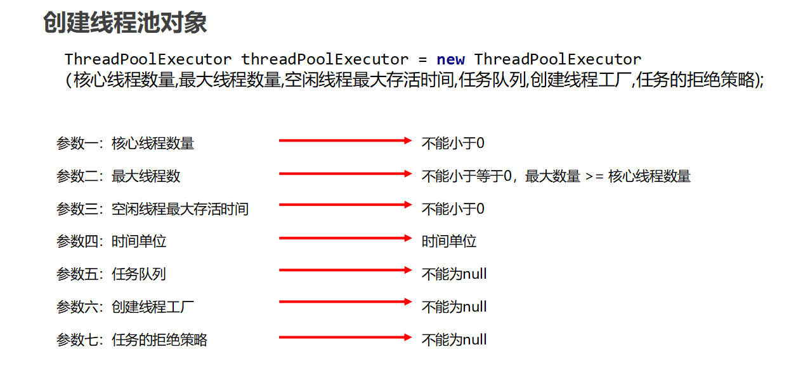
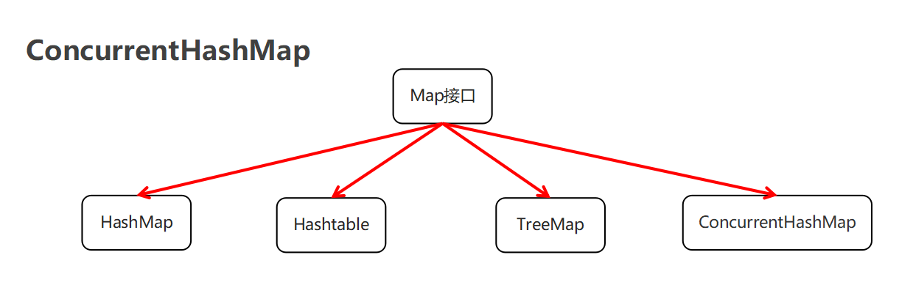
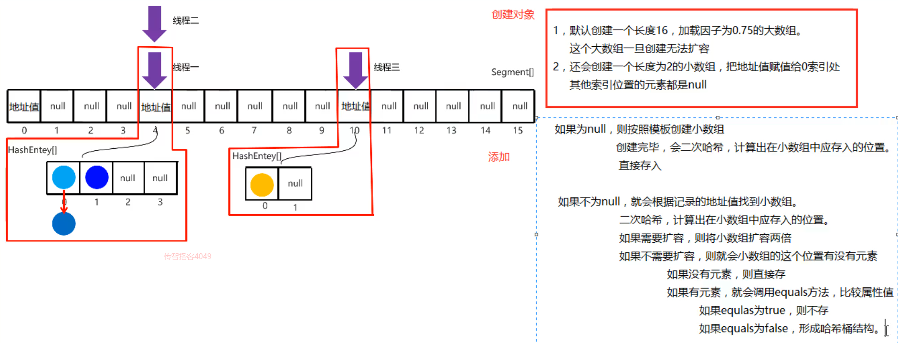

## 1.线程池

### 1.1 线程状态介绍

当线程被创建并启动以后，它既不是一启动就进入了执行状态，也不是一直处于执行状态。线程对象在不同的时期有不同的状态。那么Java中的线程存在哪几种状态呢？Java中的线程

状态被定义在了java.lang.Thread.State枚举类中，State枚举类的源码如下：

```java
public class Thread {
    
    public enum State {
    
        /* 新建 */
        NEW , 

        /* 可运行状态 */
        RUNNABLE , 

        /* 阻塞状态 */
        BLOCKED , 

        /* 无限等待状态 */
        WAITING , 

        /* 计时等待 */
        TIMED_WAITING , 

        /* 终止 */
        TERMINATED;
    
	}
    
    // 获取当前线程的状态
    public State getState() {
        return jdk.internal.misc.VM.toThreadState(threadStatus);
    }
    
}
```

通过源码我们可以看到Java中的线程存在6种状态，每种线程状态的含义如下

| 线程状态          | 具体含义                                     |
| ------------- | ---------------------------------------- |
| NEW           | 一个尚未启动的线程的状态。也称之为初始状态、开始状态。线程刚被创建，但是并未启动。还没调用start方法。MyThread t = new MyThread()只有线程象，没有线程特征。 |
| RUNNABLE      | 当我们调用线程对象的start方法，那么此时线程对象进入了RUNNABLE状态。那么此时才是真正的在JVM进程中创建了一个线程，线程一经启动并不是立即得到执行，线程的运行与否要听令与CPU的调度，那么我们把这个中间状态称之为可执行状态(RUNNABLE)也就是说它具备执行的资格，但是并没有真正的执行起来而是在等待CPU的度。 |
| BLOCKED       | 当一个线程试图获取一个对象锁，而该对象锁被其他的线程持有，则该线程进入Blocked状态；当该线程持有锁时，该线程将变成Runnable状态。 |
| WAITING       | 一个正在等待的线程的状态。也称之为等待状态。造成线程等待的原因有两种，分别是调用Object.wait()、join()方法。处于等待状态的线程，正在等待其他线程去执行一个特定的操作。例如：因为wait()而等待的线程正在等待另一个线程去调用notify()或notifyAll()；一个因为join()而等待的线程正在等待另一个线程结束。 |
| TIMED_WAITING | 一个在限定时间内等待的线程的状态。也称之为限时等待状态。造成线程限时等待状态的原因有三种，分别是：Thread.sleep(long)，Object.wait(long)、join(long)。 |
| TERMINATED    | 一个完全运行完成的线程的状态。也称之为终止状态、结束状态             |

各个状态的转换，如下图所示：


### 1.2 线程的状态-练习1

**目的 :** 本案例主要演示TIME_WAITING的状态转换。

**需求：**编写一段代码，依次显示一个线程的这些状态：NEW -> RUNNABLE -> TIME_WAITING -> RUNNABLE -> TERMINATED

为了简化我们的开发，本次我们使用匿名内部类结合lambda表达式的方式使用多线程。

**代码实现**

```java
public class ThreadStateDemo01 {

    public static void main(String[] args) throws InterruptedException {

        //定义一个内部线程
        Thread thread = new Thread(() -> {
            System.out.println("2.执行thread.start()之后，线程的状态：" + Thread.currentThread().getState());
            try {
                //休眠100毫秒
                Thread.sleep(100);
            } catch (InterruptedException e) {
                e.printStackTrace();
            }
            System.out.println("4.执行Thread.sleep(long)完成之后，线程的状态：" + Thread.currentThread().getState());
        });

        //获取start()之前的状态
        System.out.println("1.通过new初始化一个线程，但是还没有start()之前，线程的状态：" + thread.getState());

        //启动线程
        thread.start();

        //休眠50毫秒
        Thread.sleep(50);

        //因为thread1需要休眠100毫秒，所以在第50毫秒，thread处于sleep状态
        System.out.println("3.执行Thread.sleep(long)时，线程的状态：" + thread.getState());

        //thread1和main线程主动休眠150毫秒，所以在第150毫秒,thread早已执行完毕
        Thread.sleep(100);

        System.out.println("5.线程执行完毕之后，线程的状态：" + thread.getState() + "\n");

    }

}
```

控制台输出

```java
1.通过new初始化一个线程，但是还没有start()之前，线程的状态：NEW
2.执行thread.start()之后，线程的状态：RUNNABLE
3.执行Thread.sleep(long)时，线程的状态：TIMED_WAITING
4.执行Thread.sleep(long)完成之后，线程的状态：RUNNABLE
5.线程执行完毕之后，线程的状态：TERMINATED
```

### 

### 1.3 线程的状态-练习2

**目的 :** 本案例主要演示WAITING的状态转换。

**需求 ：**编写一段代码，依次显示一个线程的这些状态：NEW -> RUNNABLE -> WAITING -> RUNNABLE -> TERMINATED

**代码实现 :** 

```java
public class ThreadStateDemo02 {

    public static void main(String[] args) throws InterruptedException {

        //定义一个对象，用来加锁和解锁
        Object obj = new Object();

        //定义一个内部线程
        Thread thread1 = new Thread(() -> {
            System.out.println("2.执行thread.start()之后，线程的状态：" + Thread.currentThread().getState());
            synchronized (obj) {
                try {

                    //thread1需要休眠100毫秒
                    Thread.sleep(100);

                    //thread1100毫秒之后，通过wait()方法释放obj对象是锁
                    obj.wait();
                    
                } catch (InterruptedException e) {
                    e.printStackTrace();
                }
            }
            System.out.println("4.被object.notify()方法唤醒之后，线程的状态：" + Thread.currentThread().getState());
        });

        //获取start()之前的状态
        System.out.println("1.通过new初始化一个线程，但是还没有start()之前，线程的状态：" + thread1.getState());

        //启动线程
        thread1.start();

        //main线程休眠150毫秒
        Thread.sleep(150);

        //因为thread1在第100毫秒进入wait等待状态，所以第150秒肯定可以获取其状态
        System.out.println("3.执行object.wait()时，线程的状态：" + thread1.getState());

        //声明另一个线程进行解锁
        new Thread(() -> {
            synchronized (obj) {
                //唤醒等待的线程
                obj.notify();
            }
        }).start();

        //main线程休眠10毫秒等待thread1线程能够苏醒
        Thread.sleep(10);

        //获取thread1运行结束之后的状态
        System.out.println("5.线程执行完毕之后，线程的状态：" + thread1.getState() + "\n");

    }

}
```

控制台输出结果

```java
1.通过new初始化一个线程，但是还没有start()之前，线程的状态：NEW
2.执行thread.start()之后，线程的状态：RUNNABLE
3.执行object.wait()时，线程的状态：WAITING
4.被object.notify()方法唤醒之后，线程的状态：RUNNABLE
5.线程执行完毕之后，线程的状态：TERMINATED
```

### 

### 1.4 线程的状态-练习3

**目的 :**   本案例主要演示BLOCKED的状态转换。

**需求 ：**编写一段代码，依次显示一个线程的这些状态：NEW -> RUNNABLE -> BLOCKED -> RUNNABLE -> TERMINATED

```java
public class ThreadStateDemo03 {

    public static void main(String[] args) throws InterruptedException {

        //定义一个对象，用来加锁和解锁
        Object obj2 = new Object();

        //定义一个线程，先抢占了obj2对象的锁
        new Thread(() -> {
            synchronized (obj2) {
                try {
                    Thread.sleep(100);              //第一个线程要持有锁100毫秒
                    obj2.wait();                          //然后通过wait()方法进行等待状态，并释放obj2的对象锁
                } catch (InterruptedException e) {
                    e.printStackTrace();
                }
            }
        }).start();

        //定义目标线程，获取等待获取obj2的锁
        Thread thread = new Thread(() -> {
            System.out.println("2.执行thread.start()之后，线程的状态：" + Thread.currentThread().getState());
            synchronized (obj2) {
                try {
                    Thread.sleep(100);              //thread3要持有对象锁100毫秒
                    obj2.notify();                        //然后通过notify()方法唤醒所有在ojb2上等待的线程继续执行后续操作
                } catch (InterruptedException e) {
                    e.printStackTrace();
                }
            }
            System.out.println("4.阻塞结束后，线程的状态：" + Thread.currentThread().getState());
        });

        //获取start()之前的状态
        System.out.println("1.通过new初始化一个线程，但是还没有thread.start()之前，线程的状态：" + thread.getState());

        //启动线程
        thread.start();

        //先等100毫秒
        Thread.sleep(50);

        //第一个线程释放锁至少需要100毫秒，所以在第50毫秒时，thread正在因等待obj的对象锁而阻塞
        System.out.println("3.因为等待锁而阻塞时，线程的状态：" + thread.getState());

        //再等300毫秒
        Thread.sleep(300);

        //两个线程的执行时间加上之前等待的50毫秒总共是250毫秒，所以第300毫秒，所有的线程都已经执行完毕
        System.out.println("5.线程执行完毕之后，线程的状态：" + thread.getState());

    }

}
```

**控制台输出结果**

```java
1.通过new初始化一个线程，但是还没有thread.start()之前，线程的状态：NEW
2.执行thread.start()之后，线程的状态：RUNNABLE
3.因为等待锁而阻塞时，线程的状态：BLOCKED
4.阻塞结束后，线程的状态：RUNNABLE
5.线程执行完毕之后，线程的状态：TERMINATED
```


### 1.5 线程池-基本原理

**概述 :** 

​	提到池，大家应该能想到的就是水池。水池就是一个容器，在该容器中存储了很多的水。那么什么是线程池呢？线程池也是可以看做成一个池子，在该池子中存储很多个线程。

线程池存在的意义：

​	系统创建一个线程的成本是比较高的，因为它涉及到与操作系统交互，当程序中需要创建大量生存期很短暂的线程时，频繁的创建和销毁线程对系统的资源消耗有可能大于业务处理是对系

​	统资源的消耗，这样就有点"舍本逐末"了。针对这一种情况，为了提高性能，我们就可以采用线程池。线程池在启动的时，会创建大量空闲线程，当我们向线程池提交任务的时，线程池就

​	会启动一个线程来执行该任务。等待任务执行完毕以后，线程并不会死亡，而是再次返回到线程池中称为空闲状态。等待下一次任务的执行。

**线程池的设计思路 :**

1. 准备一个任务容器
2. 一次性启动多个(2个)消费者线程
3. 刚开始任务容器是空的，所以线程都在wait
4. 直到一个外部线程向这个任务容器中扔了一个"任务"，就会有一个消费者线程被唤醒
5. 这个消费者线程取出"任务"，并且执行这个任务，执行完毕后，继续等待下一次任务的到来

### 1.6 线程池-Executors默认线程池

概述 : JDK对线程池也进行了相关的实现，在真实企业开发中我们也很少去自定义线程池，而是使用JDK中自带的线程池。

我们可以使用Executors中所提供的**静态**方法来创建线程池

​	static ExecutorService newCachedThreadPool()   创建一个默认的线程池
	static newFixedThreadPool(int nThreads)	    创建一个指定最多线程数量的线程池

**代码实现 :** 

```java
package com.itheima.mythreadpool;


//static ExecutorService newCachedThreadPool()   创建一个默认的线程池
//static newFixedThreadPool(int nThreads)	    创建一个指定最多线程数量的线程池

import java.util.concurrent.ExecutorService;
import java.util.concurrent.Executors;

public class MyThreadPoolDemo {
    public static void main(String[] args) throws InterruptedException {

        //1,创建一个默认的线程池对象.池子中默认是空的.默认最多可以容纳int类型的最大值.
        ExecutorService executorService = Executors.newCachedThreadPool();
        //Executors --- 可以帮助我们创建线程池对象
        //ExecutorService --- 可以帮助我们控制线程池

        executorService.submit(()->{
            System.out.println(Thread.currentThread().getName() + "在执行了");
        });

        //Thread.sleep(2000);

        executorService.submit(()->{
            System.out.println(Thread.currentThread().getName() + "在执行了");
        });

        executorService.shutdown();
    }
}

```


### 1.7 线程池-Executors创建指定上限的线程池

**使用Executors中所提供的静态方法来创建线程池**

​	static ExecutorService newFixedThreadPool(int nThreads) : 创建一个指定最多线程数量的线程池

**代码实现 :** 

```java
package com.itheima.mythreadpool;

//static ExecutorService newFixedThreadPool(int nThreads)
//创建一个指定最多线程数量的线程池

import java.util.concurrent.ExecutorService;
import java.util.concurrent.Executors;
import java.util.concurrent.ThreadPoolExecutor;

public class MyThreadPoolDemo2 {
    public static void main(String[] args) {
        //参数不是初始值而是最大值
        ExecutorService executorService = Executors.newFixedThreadPool(10);

        ThreadPoolExecutor pool = (ThreadPoolExecutor) executorService;
        System.out.println(pool.getPoolSize());//0

        executorService.submit(()->{
            System.out.println(Thread.currentThread().getName() + "在执行了");
        });

        executorService.submit(()->{
            System.out.println(Thread.currentThread().getName() + "在执行了");
        });

        System.out.println(pool.getPoolSize());//2
//        executorService.shutdown();
    }
}

```


### 1.8 线程池-ThreadPoolExecutor

**创建线程池对象 :** 

ThreadPoolExecutor threadPoolExecutor = new ThreadPoolExecutor(核心线程数量,最大线程数量,空闲线程最大存活时间,任务队列,创建线程工厂,任务的拒绝策略);

**代码实现 :** 

```java
package com.itheima.mythreadpool;

import java.util.concurrent.ArrayBlockingQueue;
import java.util.concurrent.Executors;
import java.util.concurrent.ThreadPoolExecutor;
import java.util.concurrent.TimeUnit;

public class MyThreadPoolDemo3 {
//    参数一：核心线程数量
//    参数二：最大线程数
//    参数三：空闲线程最大存活时间
//    参数四：时间单位
//    参数五：任务队列
//    参数六：创建线程工厂
//    参数七：任务的拒绝策略
    public static void main(String[] args) {
        ThreadPoolExecutor pool = new ThreadPoolExecutor(2,5,2,TimeUnit.SECONDS,new ArrayBlockingQueue<>(10), Executors.defaultThreadFactory(),new ThreadPoolExecutor.AbortPolicy());
        pool.submit(new MyRunnable());
        pool.submit(new MyRunnable());

        pool.shutdown();
    }
}
```

### 1.9 线程池-参数详解



```java
public ThreadPoolExecutor(int corePoolSize,
                              int maximumPoolSize,
                              long keepAliveTime,
                              TimeUnit unit,
                              BlockingQueue<Runnable> workQueue,
                              ThreadFactory threadFactory,
                              RejectedExecutionHandler handler)
    
corePoolSize：   核心线程的最大值，不能小于0
maximumPoolSize：最大线程数，不能小于等于0，maximumPoolSize >= corePoolSize
keepAliveTime：  空闲线程最大存活时间,不能小于0
unit：           时间单位
workQueue：      任务队列，不能为null
threadFactory：  创建线程工厂,不能为null      
handler：        任务的拒绝策略,不能为null  
```


### 1.10 线程池-非默认任务拒绝策略

RejectedExecutionHandler是jdk提供的一个任务拒绝策略接口，它下面存在4个子类。

```java
ThreadPoolExecutor.AbortPolicy: 		    丢弃任务并抛出RejectedExecutionException异常。是默认的策略。
ThreadPoolExecutor.DiscardPolicy： 		   丢弃任务，但是不抛出异常 这是不推荐的做法。
ThreadPoolExecutor.DiscardOldestPolicy：    抛弃队列中等待最久的任务 然后把当前任务加入队列中。
ThreadPoolExecutor.CallerRunsPolicy:        调用任务的run()方法绕过线程池直接执行。
```

注：明确线程池对多可执行的任务数 = 队列容量 + 最大线程数

**案例演示1**：演示ThreadPoolExecutor.AbortPolicy任务处理策略

```java
public class ThreadPoolExecutorDemo01 {

    public static void main(String[] args) {

        /**
         * 核心线程数量为1 ， 最大线程池数量为3, 任务容器的容量为1 ,空闲线程的最大存在时间为20s
         */
        ThreadPoolExecutor threadPoolExecutor = new ThreadPoolExecutor(1 , 3 , 20 , TimeUnit.SECONDS ,
                new ArrayBlockingQueue<>(1) , Executors.defaultThreadFactory() , new ThreadPoolExecutor.AbortPolicy()) ;

        // 提交5个任务，而该线程池最多可以处理4个任务，当我们使用AbortPolicy这个任务处理策略的时候，就会抛出异常
        for(int x = 0 ; x < 5 ; x++) {
            threadPoolExecutor.submit(() -> {
                System.out.println(Thread.currentThread().getName() + "---->> 执行了任务");
            });
        }
    }
}
```

**控制台输出结果**

```java
pool-1-thread-1---->> 执行了任务
pool-1-thread-3---->> 执行了任务
pool-1-thread-2---->> 执行了任务
pool-1-thread-3---->> 执行了任务
```

控制台报错，仅仅执行了4个任务，有一个任务被丢弃了


**案例演示2**：演示ThreadPoolExecutor.DiscardPolicy任务处理策略

```java
public class ThreadPoolExecutorDemo02 {
    public static void main(String[] args) {
        /**
         * 核心线程数量为1 ， 最大线程池数量为3, 任务容器的容量为1 ,空闲线程的最大存在时间为20s
         */
        ThreadPoolExecutor threadPoolExecutor = new ThreadPoolExecutor(1 , 3 , 20 , TimeUnit.SECONDS ,
                new ArrayBlockingQueue<>(1) , Executors.defaultThreadFactory() , new ThreadPoolExecutor.DiscardPolicy()) ;

        // 提交5个任务，而该线程池最多可以处理4个任务，当我们使用DiscardPolicy这个任务处理策略的时候，控制台不会报错
        for(int x = 0 ; x < 5 ; x++) {
            threadPoolExecutor.submit(() -> {
                System.out.println(Thread.currentThread().getName() + "---->> 执行了任务");
            });
        }
    }
}
```

**控制台输出结果**

```java
pool-1-thread-1---->> 执行了任务
pool-1-thread-1---->> 执行了任务
pool-1-thread-3---->> 执行了任务
pool-1-thread-2---->> 执行了任务
```

控制台没有报错，仅仅执行了4个任务，有一个任务被丢弃了


**案例演示3**：演示ThreadPoolExecutor.DiscardOldestPolicy任务处理策略

```java
public class ThreadPoolExecutorDemo02 {
    public static void main(String[] args) {
        /**
         * 核心线程数量为1 ， 最大线程池数量为3, 任务容器的容量为1 ,空闲线程的最大存在时间为20s
         */
        ThreadPoolExecutor threadPoolExecutor;
        threadPoolExecutor = new ThreadPoolExecutor(1 , 3 , 20 , TimeUnit.SECONDS ,
                new ArrayBlockingQueue<>(1) , Executors.defaultThreadFactory() , new ThreadPoolExecutor.DiscardOldestPolicy());
        // 提交5个任务
        for(int x = 0 ; x < 5 ; x++) {
            // 定义一个变量，来指定指定当前执行的任务;这个变量需要被final修饰
            final int y = x ;
            threadPoolExecutor.submit(() -> {
                System.out.println(Thread.currentThread().getName() + "---->> 执行了任务" + y);
            });     
        }
    }
}
```

**控制台输出结果**

```java
pool-1-thread-2---->> 执行了任务2
pool-1-thread-1---->> 执行了任务0
pool-1-thread-3---->> 执行了任务3
pool-1-thread-1---->> 执行了任务4
```

由于任务1在线程池中等待时间最长，因此任务1被丢弃。


**案例演示4**：演示ThreadPoolExecutor.CallerRunsPolicy任务处理策略

```java
public class ThreadPoolExecutorDemo04 {
    public static void main(String[] args) {

        /**
         * 核心线程数量为1 ， 最大线程池数量为3, 任务容器的容量为1 ,空闲线程的最大存在时间为20s
         */
        ThreadPoolExecutor threadPoolExecutor;
        threadPoolExecutor = new ThreadPoolExecutor(1 , 3 , 20 , TimeUnit.SECONDS ,
                new ArrayBlockingQueue<>(1) , Executors.defaultThreadFactory() , new ThreadPoolExecutor.CallerRunsPolicy());

        // 提交5个任务
        for(int x = 0 ; x < 5 ; x++) {
            threadPoolExecutor.submit(() -> {
                System.out.println(Thread.currentThread().getName() + "---->> 执行了任务");
            });
        }
    }
}
```

**控制台输出结果**

```java
pool-1-thread-1---->> 执行了任务
pool-1-thread-3---->> 执行了任务
pool-1-thread-2---->> 执行了任务
pool-1-thread-1---->> 执行了任务
main---->> 执行了任务
```

通过控制台的输出，我们可以看到次策略没有通过线程池中的线程执行任务，而是直接调用任务的run()方法绕过线程池直接执行。

## 2. 原子性

### 2.1 volatile-问题

**代码分析 :** 

```java
package com.itheima.myvolatile;

public class Demo {
    public static void main(String[] args) {
        MyThread1 t1 = new MyThread1();
        t1.setName("小路同学");
        t1.start();

        MyThread2 t2 = new MyThread2();
        t2.setName("小皮同学");
        t2.start();
    }
}
```

```java
package com.itheima.myvolatile;

public class Money {
    public static int money = 100000;
}
```

```java
package com.itheima.myvolatile;

public class MyThread1 extends  Thread {
    @Override
    public void run() {
        while(Money.money == 100000){

        }

        System.out.println("结婚基金已经不是十万了");
    }
}

```

```java
package com.itheima.myvolatile;

public class MyThread2 extends Thread {
    @Override
    public void run() {
        try {
            Thread.sleep(10);
        } catch (InterruptedException e) {
            e.printStackTrace();
        }

        Money.money = 90000;
    }
}

```

**程序问题 :**  女孩虽然知道结婚基金是十万，但是当基金的余额发生变化的时候，女孩无法知道最新的余额。


### 2.2 volatile解决

**以上案例出现的问题 :**

​	当A线程修改了共享数据时，B线程没有及时获取到最新的值，如果还在使用原先的值，就会出现问题 

​	1，堆内存是唯一的，每一个线程都有自己的线程栈。

​	2 ，每一个线程在使用堆里面变量的时候，都会先拷贝一份到变量的副本中。

​	3 ，在线程中，每一次使用是从变量的副本中获取的。

**Volatile关键字 :** 强制线程每次在使用的时候，都会看一下共享区域最新的值

**代码实现 :** **使用volatile关键字解决**

```java
package com.itheima.myvolatile;

public class Demo {
    public static void main(String[] args) {
        MyThread1 t1 = new MyThread1();
        t1.setName("小路同学");
        t1.start();

        MyThread2 t2 = new MyThread2();
        t2.setName("小皮同学");
        t2.start();
    }
}
```

```java
package com.itheima.myvolatile;

public class Money {
    public static volatile int money = 100000;
}
```

```java
package com.itheima.myvolatile;

public class MyThread1 extends  Thread {
    @Override
    public void run() {
        while(Money.money == 100000){

        }

        System.out.println("结婚基金已经不是十万了");
    }
}

```

```java
package com.itheima.myvolatile;

public class MyThread2 extends Thread {
    @Override
    public void run() {
        try {
            Thread.sleep(10);
        } catch (InterruptedException e) {
            e.printStackTrace();
        }

        Money.money = 90000;
    }
}

```


### 2.3 synchronized解决

**synchronized解决 :** 

​	1 ，线程获得锁

​	2 ，清空变量副本

​	3 ，拷贝共享变量最新的值到变量副本中

​	4 ，执行代码

​	5 ，将修改后变量副本中的值赋值给共享数据

​	6 ，释放锁

**代码实现 :** 

```java
package com.itheima.myvolatile2;

public class Demo {
    public static void main(String[] args) {
        MyThread1 t1 = new MyThread1();
        t1.setName("小路同学");
        t1.start();

        MyThread2 t2 = new MyThread2();
        t2.setName("小皮同学");
        t2.start();
    }
}
```

```java
package com.itheima.myvolatile2;

public class Money {
    public static Object lock = new Object();
    public static volatile int money = 100000;
}
```

```java
package com.itheima.myvolatile2;

public class MyThread1 extends  Thread {
    @Override
    public void run() {
        while(true){
            synchronized (Money.lock){
                if(Money.money != 100000){
                    System.out.println("结婚基金已经不是十万了");
                    break;
                }
            }
        }
    }
}
```

```java
package com.itheima.myvolatile2;

public class MyThread2 extends Thread {
    @Override
    public void run() {
        synchronized (Money.lock) {
            try {
                Thread.sleep(10);
            } catch (InterruptedException e) {
                e.printStackTrace();
            }

            Money.money = 90000;
        }
    }
}
```


### 2.4 原子性

**概述 :** 所谓的原子性是指在一次操作或者多次操作中，要么所有的操作全部都得到了执行并且不会受到任何因素的干扰而中断，要么所有的操作都不执行，多个操作是一个不可以分割的整体。

**代码实现 :** 

```java
package com.itheima.threadatom;

public class AtomDemo {
    public static void main(String[] args) {
        MyAtomThread atom = new MyAtomThread();

        for (int i = 0; i < 100; i++) {
            new Thread(atom).start();
        }
    }
}
class MyAtomThread implements Runnable {
    private volatile int count = 0; //送冰淇淋的数量

    @Override
    public void run() {
        for (int i = 0; i < 100; i++) {
            //1,从共享数据中读取数据到本线程栈中.
            //2,修改本线程栈中变量副本的值
            //3,会把本线程栈中变量副本的值赋值给共享数据.
            count++;
            System.out.println("已经送了" + count + "个冰淇淋");
        }
    }
}
```

**代码总结 :** count++ 不是一个原子性操作, 他在执行的过程中,有可能被其他线程打断


### 2.5 volatile关键字不能保证原子性

解决方案 : 我们可以给count++操作添加锁，那么count++操作就是临界区中的代码，临界区中的代码一次只能被一个线程去执行，所以count++就变成了原子操作。

```java
package com.itheima.threadatom2;

public class AtomDemo {
    public static void main(String[] args) {
        MyAtomThread atom = new MyAtomThread();

        for (int i = 0; i < 100; i++) {
            new Thread(atom).start();
        }
    }
}
class MyAtomThread implements Runnable {
    private volatile int count = 0; //送冰淇淋的数量
    private Object lock = new Object();

    @Override
    public void run() {
        for (int i = 0; i < 100; i++) {
            //1,从共享数据中读取数据到本线程栈中.
            //2,修改本线程栈中变量副本的值
            //3,会把本线程栈中变量副本的值赋值给共享数据.
            synchronized (lock) {
                count++;
                System.out.println("已经送了" + count + "个冰淇淋");
            }
        }
    }
}
```


### 2.6 原子性_AtomicInteger

概述：java从JDK1.5开始提供了java.util.concurrent.atomic包(简称Atomic包)，这个包中的原子操作类提供了一种用法简单，性能高效，线程安全地更新一个变量的方式。因为变

量的类型有很多种，所以在Atomic包里一共提供了13个类，属于4种类型的原子更新方式，分别是原子更新基本类型、原子更新数组、原子更新引用和原子更新属性(字段)。本次我们只讲解

使用原子的方式更新基本类型，使用原子的方式更新基本类型Atomic包提供了以下3个类：

AtomicBoolean： 原子更新布尔类型

AtomicInteger：   原子更新整型

AtomicLong：	原子更新长整型

以上3个类提供的方法几乎一模一样，所以本节仅以AtomicInteger为例进行讲解，AtomicInteger的常用方法如下：

```java
public AtomicInteger()：	   			    初始化一个默认值为0的原子型Integer
public AtomicInteger(int initialValue)：  初始化一个指定值的原子型Integer

int get():   			 				获取值
int getAndIncrement():      			 以原子方式将当前值加1，注意，这里返回的是自增前的值。
int incrementAndGet():     				 以原子方式将当前值加1，注意，这里返回的是自增后的值。
int addAndGet(int data):				 以原子方式将输入的数值与实例中的值（AtomicInteger里的value）相加，并返回结果。
int getAndSet(int value):   			 以原子方式设置为newValue的值，并返回旧值。
```

**代码实现 :**

```java
package com.itheima.threadatom3;

import java.util.concurrent.atomic.AtomicInteger;

public class MyAtomIntergerDemo1 {
//    public AtomicInteger()：	               初始化一个默认值为0的原子型Integer
//    public AtomicInteger(int initialValue)： 初始化一个指定值的原子型Integer
    public static void main(String[] args) {
        AtomicInteger ac = new AtomicInteger();
        System.out.println(ac);

        AtomicInteger ac2 = new AtomicInteger(10);
        System.out.println(ac2);
    }

}
```

```java
package com.itheima.threadatom3;

import java.lang.reflect.Field;
import java.util.concurrent.atomic.AtomicInteger;

public class MyAtomIntergerDemo2 {
//    int get():   		 		获取值
//    int getAndIncrement():     以原子方式将当前值加1，注意，这里返回的是自增前的值。
//    int incrementAndGet():     以原子方式将当前值加1，注意，这里返回的是自增后的值。
//    int addAndGet(int data):	 以原子方式将参数与对象中的值相加，并返回结果。
//    int getAndSet(int value):  以原子方式设置为newValue的值，并返回旧值。
    public static void main(String[] args) {
//        AtomicInteger ac1 = new AtomicInteger(10);
//        System.out.println(ac1.get());

//        AtomicInteger ac2 = new AtomicInteger(10);
//        int andIncrement = ac2.getAndIncrement();
//        System.out.println(andIncrement);
//        System.out.println(ac2.get());

//        AtomicInteger ac3 = new AtomicInteger(10);
//        int i = ac3.incrementAndGet();
//        System.out.println(i);//自增后的值
//        System.out.println(ac3.get());

//        AtomicInteger ac4 = new AtomicInteger(10);
//        int i = ac4.addAndGet(20);
//        System.out.println(i);
//        System.out.println(ac4.get());

        AtomicInteger ac5 = new AtomicInteger(100);
        int andSet = ac5.getAndSet(20);
        System.out.println(andSet);
        System.out.println(ac5.get());
    }
}
```


### 2.7 AtomicInteger-内存解析

**AtomicInteger原理 :** 自旋锁  + CAS 算法

**CAS算法：**

​	有3个操作数（内存值V， 旧的预期值A，要修改的值B）

​	当旧的预期值A == 内存值   此时修改成功，将V改为B                 

​	当旧的预期值A！=内存值   此时修改失败，不做任何操作                 

​	并重新获取现在的最新值（这个重新获取的动作就是自旋）

### 2.8 AtomicInteger-源码解析

**代码实现 :**

```java
package com.itheima.threadatom4;

public class AtomDemo {
    public static void main(String[] args) {
        MyAtomThread atom = new MyAtomThread();

        for (int i = 0; i < 100; i++) {
            new Thread(atom).start();
        }
    }
}
```

```java
package com.itheima.threadatom4;

import java.util.concurrent.atomic.AtomicInteger;

public class MyAtomThread implements Runnable {
    //private volatile int count = 0; //送冰淇淋的数量
    //private Object lock = new Object();
    AtomicInteger ac = new AtomicInteger(0);

    @Override
    public void run() {
        for (int i = 0; i < 100; i++) {
            //1,从共享数据中读取数据到本线程栈中.
            //2,修改本线程栈中变量副本的值
            //3,会把本线程栈中变量副本的值赋值给共享数据.
            //synchronized (lock) {
//                count++;
//                ac++;
            int count = ac.incrementAndGet();
            System.out.println("已经送了" + count + "个冰淇淋");
           // }
        }
    }
}

```

**源码解析 :** 

```java

//先自增，然后获取自增后的结果
public final int incrementAndGet() {
        //+ 1 自增后的结果
        //this 就表示当前的atomicInteger（值）
        //1    自增一次
        return U.getAndAddInt(this, VALUE, 1) + 1;
}

public final int getAndAddInt(Object o, long offset, int delta) {
        //v 旧值
        int v;
        //自旋的过程
        do {
            //不断的获取旧值
            v = getIntVolatile(o, offset);
            //如果这个方法的返回值为false，那么继续自旋
            //如果这个方法的返回值为true，那么自旋结束
            //o 表示的就是内存值
            //v 旧值
            //v + delta 修改后的值
        } while (!weakCompareAndSetInt(o, offset, v, v + delta));
            //作用：比较内存中的值，旧值是否相等，如果相等就把修改后的值写到内存中，返回true。表示修改成功。
            //                                 如果不相等，无法把修改后的值写到内存中，返回false。表示修改失败。
            //如果修改失败，那么继续自旋。
        return v;
}
```


### 2.9 悲观锁和乐观锁

**synchronized和CAS的区别 :** 

**相同点：**在多线程情况下，都可以保证共享数据的安全性。

**不同点：**synchronized总是从最坏的角度出发，认为每次获取数据的时候，别人都有可能修改。所以在每                       次操作共享数据之前，都会上锁。（悲观锁）

​	cas是从乐观的角度出发，假设每次获取数据别人都不会修改，所以不会上锁。只不过在修改共享数据的时候，会检查一下，别人有没有修改过这个数据。

​	如果别人修改过，那么我再次获取现在最新的值。            

​	 如果别人没有修改过，那么我现在直接修改共享数据的值.(乐观锁）


## 3. 并发工具类

### 3.1 并发工具类-Hashtable

​	**Hashtable出现的原因 :** 在集合类中HashMap是比较常用的集合对象，但是HashMap是线程不安全的(多线程环境下可能会存在问题)。为了保证数据的安全性我们可以使用Hashtable，但是Hashtable的效率低下。

**代码实现 :** 

```java
package com.itheima.mymap;

import java.util.HashMap;
import java.util.Hashtable;

public class MyHashtableDemo {
    public static void main(String[] args) throws InterruptedException {
        Hashtable<String, String> hm = new Hashtable<>();

        Thread t1 = new Thread(() -> {
            for (int i = 0; i < 25; i++) {
                hm.put(i + "", i + "");
            }
        });


        Thread t2 = new Thread(() -> {
            for (int i = 25; i < 51; i++) {
                hm.put(i + "", i + "");
            }
        });

        t1.start();
        t2.start();

        System.out.println("----------------------------");
        //为了t1和t2能把数据全部添加完毕
        Thread.sleep(1000);

        //0-0 1-1 ..... 50- 50

        for (int i = 0; i < 51; i++) {
            System.out.println(hm.get(i + ""));
        }//0 1 2 3 .... 50


    }
}
```


### 3.2 并发工具类-ConcurrentHashMap基本使用

​	**ConcurrentHashMap出现的原因 :** 在集合类中HashMap是比较常用的集合对象，但是HashMap是线程不安全的(多线程环境下可能会存在问题)。为了保证数据的安全性我们可以使用Hashtable，但是Hashtable的效率低下。

基于以上两个原因我们可以使用JDK1.5以后所提供的ConcurrentHashMap。

**体系结构 :** 



**总结 :** 

​	1 ，HashMap是线程不安全的。多线程环境下会有数据安全问题

​	2 ，Hashtable是线程安全的，但是会将整张表锁起来，效率低下

​	3，ConcurrentHashMap也是线程安全的，效率较高。     在JDK7和JDK8中，底层原理不一样。

**代码实现 :** 

```java
package com.itheima.mymap;

import java.util.Hashtable;
import java.util.concurrent.ConcurrentHashMap;

public class MyConcurrentHashMapDemo {
    public static void main(String[] args) throws InterruptedException {
        ConcurrentHashMap<String, String> hm = new ConcurrentHashMap<>(100);

        Thread t1 = new Thread(() -> {
            for (int i = 0; i < 25; i++) {
                hm.put(i + "", i + "");
            }
        });


        Thread t2 = new Thread(() -> {
            for (int i = 25; i < 51; i++) {
                hm.put(i + "", i + "");
            }
        });

        t1.start();
        t2.start();

        System.out.println("----------------------------");
        //为了t1和t2能把数据全部添加完毕
        Thread.sleep(1000);

        //0-0 1-1 ..... 50- 50

        for (int i = 0; i < 51; i++) {
            System.out.println(hm.get(i + ""));
        }//0 1 2 3 .... 50
    }
}
```


### 3.3 并发工具类-ConcurrentHashMap1.7原理



### 3.4 并发工具类-ConcurrentHashMap1.8原理


**总结 :** 

​	1，如果使用空参构造创建ConcurrentHashMap对象，则什么事情都不做。     在第一次添加元素的时候创建哈希表

​	2，计算当前元素应存入的索引。

​	3，如果该索引位置为null，则利用cas算法，将本结点添加到数组中。

​	4，如果该索引位置不为null，则利用volatile关键字获得当前位置最新的结点地址，挂在他下面，变成链表。		

​	5，当链表的长度大于等于8时，自动转换成红黑树6，以链表或者红黑树头结点为锁对象，配合悲观锁保证多线程操作集合时数据的安全性

### 3.5 并发工具类-CountDownLatch

**CountDownLatch类 :** 		

| 方法                               | 解释               |
| -------------------------------- | ---------------- |
| public CountDownLatch(int count) | 参数传递线程数，表示等待线程数量 |
| public void await()              | 让线程等待            |
| public void countDown()          | 当前线程执行完毕         |

**使用场景：** 让某一条线程等待其他线程执行完毕之后再执行

**代码实现 :** 

```java
package com.itheima.mycountdownlatch;

import java.util.concurrent.CountDownLatch;

public class ChileThread1 extends Thread {

    private CountDownLatch countDownLatch;
    public ChileThread1(CountDownLatch countDownLatch) {
        this.countDownLatch = countDownLatch;
    }

    @Override
    public void run() {
        //1.吃饺子
        for (int i = 1; i <= 10; i++) {
            System.out.println(getName() + "在吃第" + i + "个饺子");
        }
        //2.吃完说一声
        //每一次countDown方法的时候，就让计数器-1
        countDownLatch.countDown();
    }
}

```

```java
package com.itheima.mycountdownlatch;

import java.util.concurrent.CountDownLatch;

public class ChileThread2 extends Thread {

    private CountDownLatch countDownLatch;
    public ChileThread2(CountDownLatch countDownLatch) {
        this.countDownLatch = countDownLatch;
    }
    @Override
    public void run() {
        //1.吃饺子
        for (int i = 1; i <= 15; i++) {
            System.out.println(getName() + "在吃第" + i + "个饺子");
        }
        //2.吃完说一声
        //每一次countDown方法的时候，就让计数器-1
        countDownLatch.countDown();
    }
}

```

```java
package com.itheima.mycountdownlatch;

import java.util.concurrent.CountDownLatch;

public class ChileThread3 extends Thread {

    private CountDownLatch countDownLatch;
    public ChileThread3(CountDownLatch countDownLatch) {
        this.countDownLatch = countDownLatch;
    }
    @Override
    public void run() {
        //1.吃饺子
        for (int i = 1; i <= 20; i++) {
            System.out.println(getName() + "在吃第" + i + "个饺子");
        }
        //2.吃完说一声
        //每一次countDown方法的时候，就让计数器-1
        countDownLatch.countDown();
    }
}

```

```java
package com.itheima.mycountdownlatch;

import java.util.concurrent.CountDownLatch;

public class MotherThread extends Thread {
    private CountDownLatch countDownLatch;
    public MotherThread(CountDownLatch countDownLatch) {
        this.countDownLatch = countDownLatch;
    }

    @Override
    public void run() {
        //1.等待
        try {
            //当计数器变成0的时候，会自动唤醒这里等待的线程。
            countDownLatch.await();
        } catch (InterruptedException e) {
            e.printStackTrace();
        }
        //2.收拾碗筷
        System.out.println("妈妈在收拾碗筷");
    }
}

```

```java
package com.itheima.mycountdownlatch;

import java.util.concurrent.CountDownLatch;

public class MyCountDownLatchDemo {
    public static void main(String[] args) {
        //1.创建CountDownLatch的对象，需要传递给四个线程。
        //在底层就定义了一个计数器，此时计数器的值就是3
        CountDownLatch countDownLatch = new CountDownLatch(3);
        //2.创建四个线程对象并开启他们。
        MotherThread motherThread = new MotherThread(countDownLatch);
        motherThread.start();

        ChileThread1 t1 = new ChileThread1(countDownLatch);
        t1.setName("小明");

        ChileThread2 t2 = new ChileThread2(countDownLatch);
        t2.setName("小红");

        ChileThread3 t3 = new ChileThread3(countDownLatch);
        t3.setName("小刚");

        t1.start();
        t2.start();
        t3.start();
    }
}
```

**总结 :** 

​	1. CountDownLatch(int count)：参数写等待线程的数量。并定义了一个计数器。

​	2. await()：让线程等待，当计数器为0时，会唤醒等待的线程

​	3. countDown()： 线程执行完毕时调用，会将计数器-1。

### 3.6 并发工具类-Semaphore

**使用场景 :** 

​	可以控制访问特定资源的线程数量。

**实现步骤 :** 

​	1，需要有人管理这个通道

​	2，当有车进来了，发通行许可证

​	3，当车出去了，收回通行许可证

​	4，如果通行许可证发完了，那么其他车辆只能等着

**代码实现 :** 

```java
package com.itheima.mysemaphore;

import java.util.concurrent.Semaphore;

public class MyRunnable implements Runnable {
    //1.获得管理员对象，
    private Semaphore semaphore = new Semaphore(2);
    @Override
    public void run() {
        //2.获得通行证
        try {
            semaphore.acquire();
            //3.开始行驶
            System.out.println("获得了通行证开始行驶");
            Thread.sleep(2000);
            System.out.println("归还通行证");
            //4.归还通行证
            semaphore.release();
        } catch (InterruptedException e) {
            e.printStackTrace();
        }
    }
}

```

```java
package com.itheima.mysemaphore;

public class MySemaphoreDemo {
    public static void main(String[] args) {
        MyRunnable mr = new MyRunnable();

        for (int i = 0; i < 100; i++) {
            new Thread(mr).start();
        }
    }
}
```


