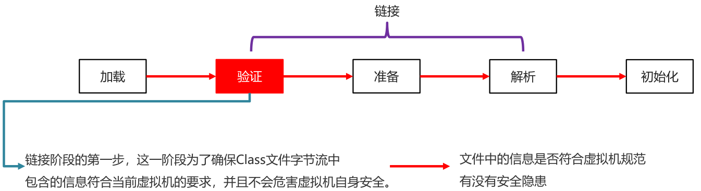

## 1.类加载器

### 1.1类加载器【理解】

+ 作用

  负责将.class文件（存储的物理文件）加载在到内存中

  

### 1.2类加载的过程【理解】

+ 类加载时机

  + 创建类的实例（对象）
  + 调用类的类方法
  + 访问类或者接口的类变量，或者为该类变量赋值
  + 使用反射方式来强制创建某个类或接口对应的java.lang.Class对象
  + 初始化某个类的子类
  + 直接使用java.exe命令来运行某个主类

+ 类加载过程

  1. 加载

     + 通过包名 + 类名，获取这个类，准备用流进行传输
     + 在这个类加载到内存中
     + 加载完毕创建一个class对象

     

  2. 链接

     + 验证

       确保Class文件字节流中包含的信息符合当前虚拟机的要求，并且不会危害虚拟机自身安全

       (文件中的信息是否符合虚拟机规范有没有安全隐患)

     

     + 准备

       负责为类的类变量（被static修饰的变量）分配内存，并设置默认初始化值

       (初始化静态变量)

     

     + 解析

       将类的二进制数据流中的符号引用替换为直接引用

       (本类中如果用到了其他类，此时就需要找到对应的类)

     

  3. 初始化

     根据程序员通过程序制定的主观计划去初始化类变量和其他资源

     (静态变量赋值以及初始化其他资源)

     

+ 小结

  + 当一个类被使用的时候，才会加载到内存
  + 类加载的过程: 加载、验证、准备、解析、初始化

### 1.3类加载的分类【理解】

+ 分类
  + Bootstrap class loader：虚拟机的内置类加载器，通常表示为null ，并且没有父null
  + Platform class loader：平台类加载器,负责加载JDK中一些特殊的模块
  + System class loader：系统类加载器,负责加载用户类路径上所指定的类库

+ 类加载器的继承关系

  + System的父加载器为Platform
  + Platform的父加载器为Bootstrap

+ 代码演示

  ```java
  public class ClassLoaderDemo1 {
      public static void main(String[] args) {
          //获取系统类加载器
          ClassLoader systemClassLoader = ClassLoader.getSystemClassLoader();

          //获取系统类加载器的父加载器 --- 平台类加载器
          ClassLoader classLoader1 = systemClassLoader.getParent();

          //获取平台类加载器的父加载器 --- 启动类加载器
          ClassLoader classLoader2 = classLoader1.getParent();

          System.out.println("系统类加载器" + systemClassLoader);
          System.out.println("平台类加载器" + classLoader1);
          System.out.println("启动类加载器" + classLoader2);

      }
  }
  ```

### 1.4双亲委派模型【理解】

+ 介绍

  如果一个类加载器收到了类加载请求，它并不会自己先去加载，而是把这个请求委托给父类的加载器去执行，如果父类加载器还存在其父类加载器，则进一步向上委托，依次递归，请求最终将到达顶层的启动类加载器，如果父类加载器可以完成类加载任务，就成功返回，倘若父类加载器无法完成此加载任务，子加载器才会尝试自己去加载，这就是双亲委派模式

  


### 1.5ClassLoader 中的两个方法【应用】

- 方法介绍

  | 方法名                                      | 说明        |
  | ---------------------------------------- | --------- |
  | public static ClassLoader getSystemClassLoader() | 获取系统类加载器  |
  | public InputStream getResourceAsStream(String name) | 加载某一个资源文件 |

- 示例代码

  ```java
  public class ClassLoaderDemo2 {
      public static void main(String[] args) throws IOException {
          //static ClassLoader getSystemClassLoader() 获取系统类加载器
          //InputStream getResourceAsStream(String name)  加载某一个资源文件

          //获取系统类加载器
          ClassLoader systemClassLoader = ClassLoader.getSystemClassLoader();

          //利用加载器去加载一个指定的文件
          //参数：文件的路径（放在src的根目录下，默认去那里加载）
          //返回值：字节流。
          InputStream is = systemClassLoader.getResourceAsStream("prop.properties");

          Properties prop = new Properties();
          prop.load(is);

          System.out.println(prop);

          is.close();
      }
  }
  ```

## 2.反射

### 2.1反射的概述【理解】

+ 反射机制

  是在运行状态中，对于任意一个类，都能够知道这个类的所有属性和方法；
  对于任意一个对象，都能够调用它的任意属性和方法；
  这种动态获取信息以及动态调用对象方法的功能称为Java语言的反射机制。

### 2.2获取Class类对象的三种方式【应用】

+ 三种方式分类
  + 类名.class属性

  + 对象名.getClass()方法

  + Class.forName(全类名)方法

    ​

  

+ 示例代码

  ```java
  public class Student {
      private String name;
      private int age;

      public Student() {
      }

      public Student(String name, int age) {
          this.name = name;
          this.age = age;
      }

      public String getName() {
          return name;
      }

      public void setName(String name) {
          this.name = name;
      }

      public int getAge() {
          return age;
      }

      public void setAge(int age) {
          this.age = age;
      }

      public void study(){
          System.out.println("学生在学习");
      }

      @Override
      public String toString() {
          return "Student{" +
                  "name='" + name + '\'' +
                  ", age=" + age +
                  '}';
      }
  }
  public class ReflectDemo1 {
      public static void main(String[] args) throws ClassNotFoundException {
          //1.Class类中的静态方法forName("全类名")
              //全类名:包名 + 类名
          Class clazz = Class.forName("com.itheima.myreflect2.Student");
          System.out.println(clazz);

          //2.通过class属性来获取
          Class clazz2 = Student.class;
          System.out.println(clazz2);

          //3.利用对象的getClass方法来获取class对象
          //getClass方法是定义在Object类中.
          Student s = new Student();
          Class clazz3 = s.getClass();
          System.out.println(clazz3);

          System.out.println(clazz == clazz2);
          System.out.println(clazz2 == clazz3);
      }
  }
  ```

### 2.3反射获取构造方法并使用【应用】

#### 2.3.1Class类获取构造方法对象的方法

- 方法介绍

  | 方法名                                      | 说明              |
  | ---------------------------------------- | --------------- |
  | Constructor<?>[] getConstructors()       | 返回所有公共构造方法对象的数组 |
  | Constructor<?>[] getDeclaredConstructors() | 返回所有构造方法对象的数组   |
  | Constructor<T> getConstructor(Class<?>... parameterTypes) | 返回单个公共构造方法对象    |
  | Constructor<T> getDeclaredConstructor(Class<?>... parameterTypes) | 返回单个构造方法对象      |

- 示例代码

  ```java
  public class Student {
      private String name;
      private int age;

      //私有的有参构造方法
      private Student(String name) {
          System.out.println("name的值为:" + name);
          System.out.println("private...Student...有参构造方法");
      }

      //公共的无参构造方法
      public Student() {
          System.out.println("public...Student...无参构造方法");
      }

      //公共的有参构造方法
      public Student(String name, int age) {
          System.out.println("name的值为:" + name + "age的值为:" + age);
          System.out.println("public...Student...有参构造方法");
      }
  }
  public class ReflectDemo1 {
      public static void main(String[] args) throws ClassNotFoundException, NoSuchMethodException {
          //method1();
          //method2();
          //method3();
          //method4();
      }

      private static void method4() throws ClassNotFoundException, NoSuchMethodException {
          //        Constructor<T> getDeclaredConstructor(Class<?>... parameterTypes)：
  //                                      返回单个构造方法对象
          //1.获取Class对象
          Class clazz = Class.forName("com.itheima.myreflect3.Student");
          Constructor constructor = clazz.getDeclaredConstructor(String.class);
          System.out.println(constructor);
      }

      private static void method3() throws ClassNotFoundException, NoSuchMethodException {
          //        Constructor<T> getConstructor(Class<?>... parameterTypes)：
  //                                      返回单个公共构造方法对象
          //1.获取Class对象
          Class clazz = Class.forName("com.itheima.myreflect3.Student");
          //小括号中,一定要跟构造方法的形参保持一致.
          Constructor constructor1 = clazz.getConstructor();
          System.out.println(constructor1);

          Constructor constructor2 = clazz.getConstructor(String.class, int.class);
          System.out.println(constructor2);

          //因为Student类中,没有只有一个int的构造,所以这里会报错.
          Constructor constructor3 = clazz.getConstructor(int.class);
          System.out.println(constructor3);
      }

      private static void method2() throws ClassNotFoundException {
          //        Constructor<?>[] getDeclaredConstructors()：
  //                                      返回所有构造方法对象的数组
          //1.获取Class对象
          Class clazz = Class.forName("com.itheima.myreflect3.Student");

          Constructor[] constructors = clazz.getDeclaredConstructors();
          for (Constructor constructor : constructors) {
              System.out.println(constructor);
          }
      }

      private static void method1() throws ClassNotFoundException {
          //        Constructor<?>[] getConstructors()：
  //                                      返回所有公共构造方法对象的数组
          //1.获取Class对象
          Class clazz = Class.forName("com.itheima.myreflect3.Student");
          Constructor[] constructors = clazz.getConstructors();
          for (Constructor constructor : constructors) {
              System.out.println(constructor);
          }
      }
  }
  ```

#### 2.3.2Constructor类用于创建对象的方法

+ 方法介绍

  | 方法名                              | 说明               |
  | -------------------------------- | ---------------- |
  | T newInstance(Object...initargs) | 根据指定的构造方法创建对象    |
  | setAccessible(boolean flag)      | 设置为true,表示取消访问检查 |

+ 示例代码

  ```java
  // Student类同上一个示例,这里就不在重复提供了
  public class ReflectDemo2 {
      public static void main(String[] args) throws ClassNotFoundException, NoSuchMethodException, IllegalAccessException, InvocationTargetException, InstantiationException {
          //T newInstance(Object... initargs)：根据指定的构造方法创建对象
          //method1();
          //method2();
          //method3();
          //method4();

      }

      private static void method4() throws ClassNotFoundException, NoSuchMethodException, InstantiationException, IllegalAccessException, InvocationTargetException {
          //获取一个私有的构造方法并创建对象
          //1.获取class对象
          Class clazz = Class.forName("com.itheima.myreflect3.Student");

          //2.获取一个私有化的构造方法.
          Constructor constructor = clazz.getDeclaredConstructor(String.class);

          //被private修饰的成员,不能直接使用的
          //如果用反射强行获取并使用,需要临时取消访问检查
          constructor.setAccessible(true);

          //3.直接创建对象
          Student student = (Student) constructor.newInstance("zhangsan");

          System.out.println(student);
      }

      private static void method3() throws ClassNotFoundException, InstantiationException, IllegalAccessException {
          //简写格式
          //1.获取class对象
          Class clazz = Class.forName("com.itheima.myreflect3.Student");

          //2.在Class类中,有一个newInstance方法,可以利用空参直接创建一个对象
          Student student = (Student) clazz.newInstance();//这个方法现在已经过时了,了解一下

          System.out.println(student);
      }

      private static void method2() throws ClassNotFoundException, NoSuchMethodException, InstantiationException, IllegalAccessException, InvocationTargetException {
          //1.获取class对象
          Class clazz = Class.forName("com.itheima.myreflect3.Student");

          //2.获取构造方法对象
          Constructor constructor = clazz.getConstructor();

          //3.利用空参来创建Student的对象
          Student student = (Student) constructor.newInstance();

          System.out.println(student);
      }

      private static void method1() throws ClassNotFoundException, NoSuchMethodException, InstantiationException, IllegalAccessException, InvocationTargetException {
          //1.获取class对象
          Class clazz = Class.forName("com.itheima.myreflect3.Student");

          //2.获取构造方法对象
          Constructor constructor = clazz.getConstructor(String.class, int.class);

          //3.利用newInstance创建Student的对象
          Student student = (Student) constructor.newInstance("zhangsan", 23);

          System.out.println(student);
      }
  }
  ```

#### 2.3.3小结

+ 获取class对象

  三种方式: Class.forName(“全类名”), 类名.class, 对象名.getClass()

+ 获取里面的构造方法对象

  getConstructor (Class<?>... parameterTypes)
  getDeclaredConstructor (Class<?>... parameterTypes)

+ 如果是public的，直接创建对象

  newInstance(Object... initargs)

+ 如果是非public的，需要临时取消检查，然后再创建对象

  setAccessible(boolean)  暴力反射

### 2.4反射获取成员变量并使用【应用】

#### 2.4.1Class类获取成员变量对象的方法

- 方法分类

  | 方法名                                 | 说明              |
  | ----------------------------------- | --------------- |
  | Field[] getFields()                 | 返回所有公共成员变量对象的数组 |
  | Field[] getDeclaredFields()         | 返回所有成员变量对象的数组   |
  | Field getField(String name)         | 返回单个公共成员变量对象    |
  | Field getDeclaredField(String name) | 返回单个成员变量对象      |

- 示例代码

  ```java
  public class Student {

      public String name;

      public int age;

      public String gender;

      private int money = 300;

      @Override
      public String toString() {
          return "Student{" +
                  "name='" + name + '\'' +
                  ", age=" + age +
                  ", gender='" + gender + '\'' +
                  ", money=" + money +
                  '}';
      }
  }
  public class ReflectDemo1 {
      public static void main(String[] args) throws ClassNotFoundException, NoSuchFieldException {
         // method1();
          //method2();
          //method3();
          //method4();

      }

      private static void method4() throws ClassNotFoundException, NoSuchFieldException {
          //        Field getDeclaredField(String name)：返回单个成员变量对象
          //1.获取class对象
          Class clazz = Class.forName("com.itheima.myreflect4.Student");
    
          //2.获取money成员变量
          Field field = clazz.getDeclaredField("money");
    
          //3.打印一下
          System.out.println(field);
      }
    
      private static void method3() throws ClassNotFoundException, NoSuchFieldException {
          //        Field getField(String name)：返回单个公共成员变量对象
          //想要获取的成员变量必须是真实存在的
          //且必须是public修饰的.
          //1.获取class对象
          Class clazz = Class.forName("com.itheima.myreflect4.Student");
    
          //2.获取name这个成员变量
          //Field field = clazz.getField("name");
          //Field field = clazz.getField("name1");
          Field field = clazz.getField("money");
    
          //3.打印一下
          System.out.println(field);
      }
    
      private static void method2() throws ClassNotFoundException {
          //        Field[] getDeclaredFields()：返回所有成员变量对象的数组
          //1.获取class对象
          Class clazz = Class.forName("com.itheima.myreflect4.Student");
    
          //2.获取所有的Field对象
          Field[] fields = clazz.getDeclaredFields();
    
          //3.遍历
          for (Field field : fields) {
              System.out.println(field);
          }
      }
    
      private static void method1() throws ClassNotFoundException {
          //        Field[] getFields()：返回所有公共成员变量对象的数组
    
          //1.获取class对象
          Class clazz = Class.forName("com.itheima.myreflect4.Student");
    
          //2.获取Field对象.
          Field[] fields = clazz.getFields();
    
          //3.遍历
          for (Field field : fields) {
              System.out.println(field);
          }
      }
  }
  ```

#### 2.4.2Field类用于给成员变量赋值的方法

+ 方法介绍

  | 方法名                                | 说明   |
  | ---------------------------------- | ---- |
  | void set(Object obj, Object value) | 赋值   |
  | Object get(Object obj)             | 获取值  |

+ 示例代码

  ```java
  // Student类同上一个示例,这里就不在重复提供了
  public class ReflectDemo2 {
      public static void main(String[] args) throws ClassNotFoundException, NoSuchFieldException, IllegalAccessException, InstantiationException {
  //        Object get(Object obj) 返回由该 Field表示的字段在指定对象上的值。
          //method1();
          //method2();

      }

      private static void method2() throws ClassNotFoundException, NoSuchFieldException, InstantiationException, IllegalAccessException {
          //1.获取class对象
          Class clazz = Class.forName("com.itheima.myreflect4.Student");

          //2.获取成员变量Field的对象
          Field field = clazz.getDeclaredField("money");

          //3.取消一下访问检查
          field.setAccessible(true);

          //4.调用get方法来获取值
          //4.1创建一个对象
          Student student = (Student) clazz.newInstance();
          //4.2获取指定对象的money的值
          Object o = field.get(student);

          //5.打印一下
          System.out.println(o);
      }

      private static void method1() throws ClassNotFoundException, NoSuchFieldException, InstantiationException, IllegalAccessException {
          //        void set(Object obj, Object value)：给obj对象的成员变量赋值为value
          //1.获取class对象
          Class clazz = Class.forName("com.itheima.myreflect4.Student");

          //2.获取name这个Field对象
          Field field = clazz.getField("name");

          //3.利用set方法进行赋值.
          //3.1先创建一个Student对象
          Student student = (Student) clazz.newInstance();
          //3.2有了对象才可以给指定对象进行赋值
          field.set(student,"zhangsan");

          System.out.println(student);
      }
  }
  ```

### 2.5反射获取成员方法并使用【应用】

#### 2.5.1Class类获取成员方法对象的方法

- 方法分类

  | 方法名                                      | 说明                    |
  | ---------------------------------------- | --------------------- |
  | Method[] getMethods()                    | 返回所有公共成员方法对象的数组，包括继承的 |
  | Method[] getDeclaredMethods()            | 返回所有成员方法对象的数组，不包括继承的  |
  | Method getMethod(String name, Class<?>... parameterTypes) | 返回单个公共成员方法对象          |
  | Method getDeclaredMethod(String name, Class<?>... parameterTypes) | 返回单个成员方法对象            |

- 示例代码

  ```java
  public class Student {

      //私有的，无参无返回值
      private void show() {
          System.out.println("私有的show方法，无参无返回值");
      }

      //公共的，无参无返回值
      public void function1() {
          System.out.println("function1方法，无参无返回值");
      }

      //公共的，有参无返回值
      public void function2(String name) {
          System.out.println("function2方法，有参无返回值,参数为" + name);
      }

      //公共的，无参有返回值
      public String function3() {
          System.out.println("function3方法，无参有返回值");
          return "aaa";
      }

      //公共的，有参有返回值
      public String function4(String name) {
          System.out.println("function4方法，有参有返回值,参数为" + name);
          return "aaa";
      }
  }
  public class ReflectDemo1 {
      public static void main(String[] args) throws ClassNotFoundException, NoSuchMethodException {
          //method1();
          //method2();
          //method3();
          //method4();
          //method5();
      }

      private static void method5() throws ClassNotFoundException, NoSuchMethodException {
          //        Method getDeclaredMethod(String name, Class<?>... parameterTypes)：
  //                                返回单个成员方法对象
          //1.获取class对象
          Class clazz = Class.forName("com.itheima.myreflect5.Student");
          //2.获取一个成员方法show
          Method method = clazz.getDeclaredMethod("show");
          //3.打印一下
          System.out.println(method);
      }
    
      private static void method4() throws ClassNotFoundException, NoSuchMethodException {
          //1.获取class对象
          Class clazz = Class.forName("com.itheima.myreflect5.Student");
          //2.获取一个有形参的方法function2
          Method method = clazz.getMethod("function2", String.class);
          //3.打印一下
          System.out.println(method);
      }
    
      private static void method3() throws ClassNotFoundException, NoSuchMethodException {
          //        Method getMethod(String name, Class<?>... parameterTypes) ：
  //                                返回单个公共成员方法对象
          //1.获取class对象
          Class clazz = Class.forName("com.itheima.myreflect5.Student");
          //2.获取成员方法function1
          Method method1 = clazz.getMethod("function1");
          //3.打印一下
          System.out.println(method1);
      }
    
      private static void method2() throws ClassNotFoundException {
          //        Method[] getDeclaredMethods()：
  //                                返回所有成员方法对象的数组，不包括继承的
          //1.获取class对象
          Class clazz = Class.forName("com.itheima.myreflect5.Student");
    
          //2.获取Method对象
          Method[] methods = clazz.getDeclaredMethods();
          //3.遍历一下数组
          for (Method method : methods) {
              System.out.println(method);
          }
      }
    
      private static void method1() throws ClassNotFoundException {
          //        Method[] getMethods()：返回所有公共成员方法对象的数组，包括继承的
          //1.获取class对象
          Class clazz = Class.forName("com.itheima.myreflect5.Student");
          //2.获取成员方法对象
          Method[] methods = clazz.getMethods();
          //3.遍历
          for (Method method : methods) {
              System.out.println(method);
          }
      }
  }
  ```

#### 2.5.2Method类用于执行方法的方法

+ 方法介绍

  | 方法名                                      | 说明   |
  | ---------------------------------------- | ---- |
  | Object invoke(Object obj, Object... args) | 运行方法 |

  参数一: 用obj对象调用该方法

  参数二: 调用方法的传递的参数(如果没有就不写)

  返回值: 方法的返回值(如果没有就不写)

+ 示例代码

  ```java
  public class ReflectDemo2 {
      public static void main(String[] args) throws ClassNotFoundException, NoSuchMethodException, IllegalAccessException, InstantiationException, InvocationTargetException {
  //        Object invoke(Object obj, Object... args)：运行方法
  //        参数一：用obj对象调用该方法
  //        参数二：调用方法的传递的参数（如果没有就不写）
  //        返回值：方法的返回值（如果没有就不写）

          //1.获取class对象
          Class clazz = Class.forName("com.itheima.myreflect5.Student");
          //2.获取里面的Method对象  function4
          Method method = clazz.getMethod("function4", String.class);
          //3.运行function4方法就可以了
          //3.1创建一个Student对象,当做方法的调用者
          Student student = (Student) clazz.newInstance();
          //3.2运行方法
          Object result = method.invoke(student, "zhangsan");
          //4.打印一下返回值
          System.out.println(result);
      }
  }
  ```

## 3.http服务器改写

### 3.1静态资源和动态资源【理解】


+ 静态资源

  在服务器提前准备好的文件。(图片，文本)

  

+ 动态资源

  在图示的案例中，当用户点击了浏览器上的按钮。
  本质上访问的就是服务端的某一个类中的某一个方法。
  在方法中，可以写一些判断代码和逻辑代码，让响应的内容，有可能不一样了。
  那么，服务端所对应的这个类我们常常将其称之为“动态资源”

  

### 3.2准备工作【理解】

+ 修改四个地方

  + HttpResponse -> 常量WEB_APP_PATH的值与当前模块一致
  + HttpServer -> main方法中端口改成80
  + HttpResponse -> 添加一个write方法，添加一个带参数的构造方法
  + HttpResponse -> 添加一个contentType成员变量，生成对应的set/get方法

+ 示例代码

  ```java
  // 1.HttpResponse -> 常量WEB_APP_PATH的值与当前模块一致
  public class HttpResponse {
    ...
    public static final String WEB_APP_PATH = "http-dynamic-server\\webapp";
    ...
  }

  // 2.HttpServer -> main方法中端口改成80
  public class HttpServer {
    public static void main(String[] args) throws IOException {
      ...
      //2.让这个通道绑定一个端口
    	serverSocketChannel.bind(new InetSocketAddress(80));
      ...
    }
  }  

  // 3.HttpResponse -> 添加一个write方法，添加一个带参数的构造方法
  public class HttpResponse {
    ...
    // 已经提供了selectionKey，所以之前的方法接收这个参数的可以去掉了，直接使用这个即可
    // HttpRequest也按照此方式进行优化，定义成员变量，在构造方法中赋值，其他方法直接使用即可
    private SelectionKey selectionKey;
    
    public HttpResponse(SelectionKey selectionKey) {
          this.selectionKey = selectionKey;
      }
    
    //给浏览器响应数据的方法 ---- 浏览器在请求动态资源时,响应数据的方法.
    //content:响应的内容
    public void write(String content){
    }
    ...
  }

  public class HttpServer {
    public static void main(String[] args) throws IOException {
      ...
      //响应数据  //修改后的构造方法中要传入参数
      HttpResponse httpResponse = new HttpResponse(selectionKey);
      ...
    }
  }  

  // 4.HttpResponse -> 添加一个contentType成员变量，生成对应的set/get方法
  public class HttpResponse {
    ...
    private String contentType;//MIME类型
    
    public String getContentType() {
          return contentType;
      }
    public void setContentTpye(String contentType) {
          this.contentType = contentType;
          //添加到map集合中
          hm.put("Content-Type",contentType);
      }
    ...
  }
  ```

### 3.3浏览器请求动态资源【理解】

+ 两个小问题

  + 服务器如何判断浏览器请求的是静态资源还是动态资源?

    我们可以规定：如果浏览器地址栏中的uri是以”/servlet”开始的，那么就表示请求动态资源

  + 在一个项目中有很多类，很多方法。那么请求过来之后，执行哪个方法呢?

    写一个UserServlet类，在类中写service方法
    我们可以规定：如果请求动态资源，就创建这个类对象，并调用service方法，表示服务器处理了当前请求

+ 实现步骤

  1. 解析http请求

  2. 处理浏览器请求

     定义一个UserServlet 类，类中定义service方法，处理浏览器请求动态资源
     解析完http请求之后，再判断uri是否以/servlet开头

  3. 响应

+ 示例代码

  ```java
  public class UserServlet{
    public void service(){
          //模拟业务处理  ---- 就可以对这个手机号进行判断验证
          System.out.println("UserServlet处理了用户的请求...");
      }
  }
  public class HttpServer {
    public static void main(String[] args) throws IOException {
      	...
      	//响应数据
      	HttpResponse httpResponse = new HttpResponse(selectionKey);
          httpResponse.setHttpRequest(httpRequest);

          if(httpRequest.getRequestURI().startsWith("/servlet")){
            	//本次请求动态资源
            	//处理 
            	UserServlet userServlet = new UserServlet();
            	userServlet.service();
            	//响应
          	httpResponse.setContentTpye("text/html;charset=UTF-8");
          	httpResponse.write("ok,UserServlet处理了本次请求....");  
          }else{
            //本次请求静态资源
            httpResponse.sendStaticResource();
          }
      	...
    }
  } 

  public class HttpResponse {
    	...
  	//给浏览器响应数据的方法 ---- 浏览器在请求动态资源时,响应数据的方法.
      //content:响应的内容
      public void write(String content){
          //准备响应行数据
          this.version = "HTTP/1.1";
          this.status = "200";
          this.desc = "ok";

          //把响应行拼接在一起
          String responseLine = this.version + " " + this.status + " " + this.desc + "\r\n";

          //准备响应头
          StringBuilder sb = new StringBuilder();
          Set<Map.Entry<String, String>> entries = hm.entrySet();
          for (Map.Entry<String, String> entry : entries) {
              //entry依次表示每一个键值对对象
              //键 --- 响应头的名称
              //值 --- 响应头的值
              sb.append(entry.getKey()).append(": ").append(entry.getValue()).append("\r\n");
          }

          //处理响应空行
          String emptyLine = "\r\n";

          //拼接响应行,响应头,响应空行
          String result = responseLine + sb.toString() + emptyLine;

          try {
              //给浏览器响应 响应行,响应头,响应空行
              ByteBuffer byteBuffer1 = ByteBuffer.wrap(result.getBytes());
              SocketChannel channel = (SocketChannel) selectionKey.channel();
              channel.write(byteBuffer1);

              //给浏览器响应 响应体
              ByteBuffer byteBuffer2 = ByteBuffer.wrap(content.getBytes());
              channel.write(byteBuffer2);

              //释放资源
              channel.close();

          } catch (IOException e) {
              System.out.println("响应数据失败....");
              e.printStackTrace();
          }

      }    
   	 ...
  }
  ```

### 3.4main方法和Servlet优化【理解】

+ main方法优化

  + 需求

    将请求动态资源的代码抽取到一个单独的类单独的方法中，简化main中的代码

  + 代码实现

    ```java
    public class DynamicResourceProcess {
      
        //执行指定动态资源的service方法
        //参数一
        //由于后期可能根据用户请求的uri做出相应的处理.
        //参数二
        //要给用户响应数据,那么就需要使用到httpResponse.
        public void process(HttpRequest httpRequest,HttpResponse httpResponse) {
            // 创建UserServlet对象,调用service方法,进行处理
            UserServlet userServlet = new UserServlet();
            userServlet.service();

            //给浏览器响应
            httpResponse.setContentTpye("text/html;charset=UTF-8");
            httpResponse.write("ok,UserServlet处理了本次请求....");
        }
    }

    public class HttpServer {
      public static void main(String[] args) throws IOException {
        	...
        	//响应数据
        	HttpResponse httpResponse = new HttpResponse(selectionKey);
            httpResponse.setHttpRequest(httpRequest);

            if(httpRequest.getRequestURI().startsWith("/servlet")){
              	//本次请求动态资源
           		DynamicResourceProcess drp = new DynamicResourceProcess();
                drp.process(httpRequest,httpResponse);
            }else{
              //本次请求静态资源
              httpResponse.sendStaticResource();
            }
        	...
      }
    } 
    ```

+ Servlet优化

  + 需求

    将给浏览器响应的代码写到Servlet中

  + 代码实现

    ```java
    public class UserServlet implements HttpServlet{

        //处理浏览器请求的方法
        //参数一
        //由于后期可能根据用户请求的uri做出相应的处理.
        //参数二
        //要给用户响应数据,那么就需要使用到httpResponse.
        public void service(HttpRequest httpRequest, HttpResponse httpResponse){
            //模拟业务处理  ---- 就可以对这个手机号进行判断验证
            System.out.println("UserServlet处理了用户的请求...");
            //给浏览器响应
            httpResponse.setContentTpye("text/html;charset=UTF-8");
            httpResponse.write("ok,UserServlet处理了本次请求....");
        }
    }

    public class DynamicResourceProcess {
      
        //执行指定动态资源的service方法
        //参数一
        //由于后期可能根据用户请求的uri做出相应的处理.
        //参数二
        //要给用户响应数据,那么就需要使用到httpResponse.
        public void process(HttpRequest httpRequest,HttpResponse httpResponse) {
            // 创建UserServlet对象,调用service方法,进行处理
            UserServlet userServlet = new UserServlet();
            userServlet.service(httpRequest,httpResponse);
        }
    }
    ```

### 3.5多个动态资源【理解】

+ 多个动态资源

  针对每一个业务操作，我们都会去定义一个对应的Servlet来完成。
  就会在服务端产生很多个Servlet

  

+ 实现步骤

  + 定义一个接口HttpServlet，接口中定义service方法。
  + 针对于每一种业务，都定义一个servlet类与之对应，该类实现HttpServlet接口
  + 获取请求的uri，进行判断，调用不同的servlet类中的service方法

+ 代码实现

  ```java
  // 1.定义一个接口HttpServlet，接口中定义service方法
  public interface HttpServlet {

      //定义业务处理的方法
      public abstract void service(HttpRequest httpRequest, HttpResponse httpResponse);
  }

  // 2.针对于每一种业务，都定义一个servlet类与之对应，该类实现HttpServlet接口
  public class UserServlet implements HttpServlet{
      //处理浏览器请求的方法
      //参数一
      //由于后期可能根据用户请求的uri做出相应的处理.
      //参数二
      //要给用户响应数据,那么就需要使用到httpResponse.
      public void service(HttpRequest httpRequest, HttpResponse httpResponse){
          //模拟业务处理  ---- 就可以对这个手机号进行判断验证
          System.out.println("UserServlet处理了用户的请求...");
          //给浏览器响应
          httpResponse.setContentTpye("text/html;charset=UTF-8");
          httpResponse.write("ok,UserServlet处理了本次请求....");
      }
  }

  public class LoginServlet implements HttpServlet{
      @Override
      public void service(HttpRequest httpRequest, HttpResponse httpResponse) {
         //处理
          System.out.println("LoginServlet处理了登录请求");
         //响应
          httpResponse.setContentTpye("text/html;charset=UTF-8");
          httpResponse.write("登录成功");
      }
  }

  public class RegisterServlet implements HttpServlet{
      @Override
      public void service(HttpRequest httpRequest, HttpResponse httpResponse) {
         //处理
          System.out.println("RegisterServlet处理了注册请求");
         //响应
          httpResponse.setContentTpye("text/html;charset=UTF-8");
          httpResponse.write("注册成功");
      }
  }

  public class SearchServlet implements HttpServlet{
      @Override
      public void service(HttpRequest httpRequest, HttpResponse httpResponse) {
         //处理
          System.out.println("SearchServlet处理了搜索商品请求");
         //响应
          httpResponse.setContentTpye("text/html;charset=UTF-8");
          httpResponse.write("响应了一些商品信息");
      }
  }

  // 3.获取请求的uri，进行判断，调用不同的servlet类中的service方法
  public class DynamicResourceProcess {
    
      public void process(HttpRequest httpRequest,HttpResponse httpResponse){
            //获取请求的uri
            String requestURI = httpRequest.getRequestURI();
   
            //根据请求的uri进行判断
            if("/servlet/loginservlet".equals(requestURI)){
                //登录请求
                LoginServlet loginServlet = new LoginServlet();
                loginServlet.service(httpRequest,httpResponse);
            }else if("/servlet/registerservlet".equals(requestURI)){
                //注册请求
                RegisterServlet registerServlet = new RegisterServlet();
                registerServlet.service(httpRequest,httpResponse);
            }else if("/servlet/searchservlet".equals(requestURI)){
                //搜索商品请求
                SearchServlet searchServlet = new SearchServlet();
                searchServlet.service(httpRequest,httpResponse);
            }else{
                //表示默认处理方法
                //创建UserServlet对象,调用service方法,进行处理
                UserServlet userServlet = new UserServlet();
                userServlet.service(httpRequest,httpResponse);
            }
        }
  }
  ```

### 3.6通过反射和配置文件优化【理解】

+ 优化步骤

  1. 把Servlet信息写到properties配置文件中

     格式为：servlet-info=/servlet/UserServlet，全类名；/servlet/loginServlet，全类名

  2. 定义一个接口ServletConcurrentHashMap，接口中定义ConcurrentHashMap，该集合存储所有的servlet信息

  3. 定义一个接口ParseServletConfig，该接口中定义一个方法（parse）

  4. 定义ParseServletConfig的实现类，解析配置文件，并把配置文件中Servlet信息存到map集合中

  5. 在main方法的第一行，开启一条线程执行解析配置文件的代码

  6. 修改处理DynamicResourceProcess中的process方法

     

+ 代码实现

  ```java
  // 1.把Servlet信息写到properties配置文件中
  // 在webapp\config\servlet-info.properties文件中，写入如下内容
  servlet-info=/servlet/loginservlet,com.itheima.myservlet.LoginServlet;/servlet/registerservlet,com.itheima.myservlet.RegisterServlet;/servlet/searchservlet,com.itheima.myservlet.SearchServlet;/servlet/lostpasswordservlet,com.itheima.myservlet.LostPasswordServlet

  // 2.定义一个接口ServletConcurrentHashMap，接口中定义ConcurrentHashMap，该集合存储所有的servlet信息
  public interface ServletConcurrentHashMap {
      //存储请求路径和对应的servlet的map集合
      //键: 请求的uri
      //值: 对应的Servlet对象
      public static final ConcurrentHashMap<String,  HttpServlet> map = new ConcurrentHashMap<>();
  }

  // 3.定义一个接口ParseServletConfig，该接口中定义一个方法（parse）
  public interface ParseServletConfig {
      //解析数据的方法
      public abstract void parse();
  }

  // 4.定义ParseServletConfig的实现类，解析配置文件，并把配置文件中Servlet信息存到map集合中
  public class PropertiesParseServletConfig implements ParseServletConfig {
      @Override
      public void parse() {

          try {
              //1.读取配置文件中的数据
              Properties properties = new Properties();
              FileReader fr = new FileReader("http-dynamic-server/webapp/config/servlet-info.properties");
              properties.load(fr);
              fr.close();

              //2.获取集合中servlet-info的属性值
              String properValue = (String) properties.get("servlet-info");
              // uri,全类名;uri,全类名

              //3.解析
              String[] split = properValue.split(";");
              for (String servletInfo : split) {
                  String[] servletInfoArr = servletInfo.split(",");
                  String uri = servletInfoArr[0];
                  String servletName = servletInfoArr[1];

                  //我们需要通过servletName(全类名)来创建他的对象
                  Class clazz = Class.forName(servletName);
                  HttpServlet httpServlet = (HttpServlet) clazz.newInstance();
                  //4.将uri和httpServlet添加到map集合中
                  ServletConcurrentHashMap.map.put(uri,httpServlet);
              }
          } catch (Exception e) {
              System.out.println("解析数据异常.....");
              e.printStackTrace();
          }
      }
  }

  public class LoaderResourceRunnable implements  Runnable {
      @Override
      public void run() {
          //执行parse方法
          ParseServletConfig parseServletConfig = new PropertiesParseServletConfig();
          parseServletConfig.parse();
          
      }
  }

  // 5.在main方法的第一行，开启一条线程执行解析配置文件的代码
  public class HttpServer {
      public static void main(String[] args) throws IOException {
          //开启一条线程去解析配置文件
          new Thread(new LoaderResourceRunnable()).start();
          ...
      }
  }

  // 6.修改处理DynamicResourceProcess中的process方法
  public class DynamicResourceProcess {
    
      public void process(HttpRequest httpRequest,HttpResponse httpResponse){
            	//获取请求的uri
            	String requestURI = httpRequest.getRequestURI();
            	//根据请求的uri到map集合中直接找到对应的servlet的对象
          	HttpServlet httpServlet = ServletConcurrentHashMap.map.get(requestURI);
              //调用service方法对请求进行处理并响应
              httpServlet.service(httpRequest,httpResponse);
      }
  }    
  ```

### 3.7Servlet忘记实现HttpServlet接口处理【理解】

+ 出现情况

  在写Servlet时，忘记了实现HttpServlet接口

+ 导致结果

  在反射创建对象后，强转成HttpServlet时，会报类型转换异常

+ 解决方案

  在反射创建对象后，强转成HttpServlet前，进行判断

  如果有实现HttpServlet接口，就进行强转

  否则抛出一个异常

+ 代码实现

  ```java
  public class PropertiesParseServletConfig implements ParseServletConfig {
      @Override
      public void parse() {

          try {
              //1.读取配置文件中的数据
              Properties properties = new Properties();
              FileReader fr = new FileReader("http-dynamic-server/webapp/config/servlet-info.properties");
              properties.load(fr);
              fr.close();

              //2.获取集合中servlet-info的属性值
              String properValue = (String) properties.get("servlet-info");
              // uri,全类名;uri,全类名

              //3.解析
              String[] split = properValue.split(";");
              for (String servletInfo : split) {
                  String[] servletInfoArr = servletInfo.split(",");
                  String uri = servletInfoArr[0];
                  String servletName = servletInfoArr[1];

                  //我们需要通过servletName(全类名)来创建他的对象
                  Class clazz = Class.forName(servletName);

                  //获取该类所实现的所有的接口信息,得到的是一个数组
                  Class[] interfaces = clazz.getInterfaces();

                  //定义一个boolean类型的变量
                  boolean flag =  false;
                  //遍历数组
                  for (Class clazzInfo : interfaces) {
                      //判断当前所遍历的接口的字节码对象是否和HttpServlet的字节码文件对象相同
                      if(clazzInfo == HttpServlet.class){

                          //如果相同,就需要更改flag值.结束循环
                          flag = true;
                          break;
                      }
                  }

                  if(flag){
                      //true就表示当前的类已经实现了HttpServlet接口
                      HttpServlet httpServlet = (HttpServlet) clazz.newInstance();
                      //4.将uri和httpServlet添加到map集合中
                      ServletConcurrentHashMap.map.put(uri,httpServlet);
                  }else{
                      //false就表示当前的类还没有实现HttpServlet接口
                      throw new NotImplementsHttpServletException(clazz.getName() + "Not Implements HttpServlet");
                  }
              }
          } catch (NotImplementsHttpServletException e) {
              e.printStackTrace();
          }catch (Exception e) {
              System.out.println("解析数据异常.....");
              e.printStackTrace();
          }
      }
  }

  ```

### 3.8响应404【理解】

+ 出现情况

  客户端浏览器请求了一个服务器中不存在的动态资源

+ 导致结果

  服务器中代码出现异常，程序停止

+ 解决方案

  如果请求的动态资源不存在，服务器根据请求的uri找到对应的Servlet时为null，继续调用方法会出现异常

  增加一个非空的判断，如果不为null，则继续处理请求，调用方法

  如果为null，则响应404

+ 代码实现

  ```java
  public class DynamicResourceProcess {
      //执行指定动态资源的service方法
      //参数一
      //由于后期可能根据用户请求的uri做出相应的处理.
      //参数二
      //要给用户响应数据,那么就需要使用到httpResponse.
      public void process(HttpRequest httpRequest,HttpResponse httpResponse){
          //获取请求的uri
          String requestURI = httpRequest.getRequestURI();
          //根据请求的uri到map集合中直接找到对应的servlet的对象
          HttpServlet httpServlet = ServletConcurrentHashMap.map.get(requestURI);
          if(httpServlet != null){
              //调用service方法对请求进行处理并响应
              httpServlet.service(httpRequest,httpResponse);
          }else{
              //浏览器请求的动态资源不存在
              //响应404
              response404(httpResponse);
          }
      }
      //浏览器请求动态资源不存在,响应404的方法
      private void response404(HttpResponse httpResponse) {
          try {
              //准备响应行
              String responseLine = "HTTP/1.1 404 NOT FOUND\r\n";
              //准备响应头
              String responseHeader = "Content-Type: text/html;charset=UTF-8\r\n";
              //准备响应空行
              String emptyLine = "\r\n";
              //拼接在一起
              String result = responseLine + responseHeader + emptyLine;

              //把响应行,响应头,响应空行去响应给浏览器
              SelectionKey selectionKey = httpResponse.getSelectionKey();
              SocketChannel channel = (SocketChannel) selectionKey.channel();

              ByteBuffer byteBuffer1 = ByteBuffer.wrap(result.getBytes());
              channel.write(byteBuffer1);

              //给浏览器 响应 响应体内容
              ByteBuffer byteBuffer2 = ByteBuffer.wrap("404 NOT FOUND....".getBytes());
              channel.write(byteBuffer2);

              //释放资源
              channel.close();
          } catch (IOException e) {
              e.printStackTrace();
          }
      }
  }
  ```

  ​

