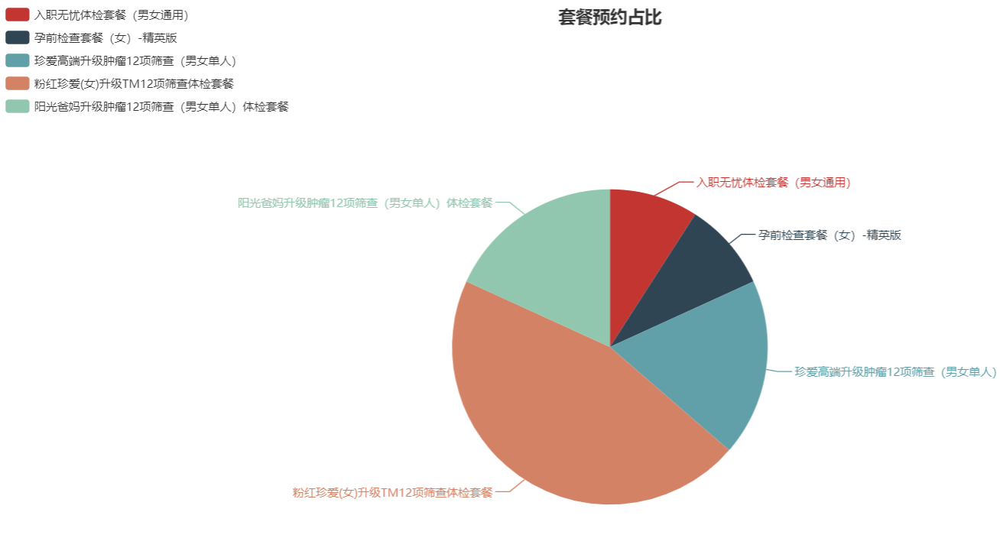
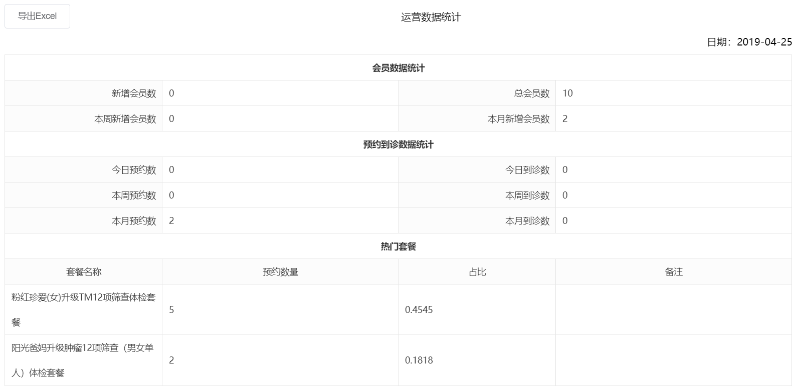
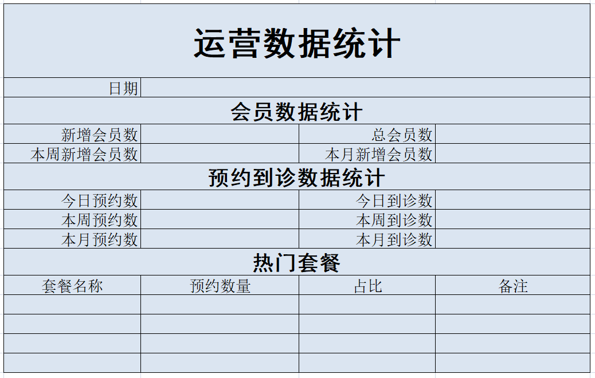

# 第11章 图形报表、POI报表

## 1. 套餐预约占比饼形图

### 1.1 需求分析

会员可以通过移动端自助进行体检预约，在预约时需要选择预约的体检套餐。本章节我们需要通过饼形图直观的展示出会员预约的各个套餐占比情况。展示效果如下图：



### 1.2 完善页面

套餐预约占比饼形图对应的页面为/pages/report_setmeal.html。

#### 1.2.1 导入ECharts库

```
<script src="../plugins/echarts/echarts.js"></script>
```

#### 1.2.2 参照官方实例导入饼形图

```
<div class="box">
  <!-- 为 ECharts 准备一个具备大小（宽高）的 DOM -->
  <div id="chart1" style="height:600px;"></div>
</div>
<script type="text/javascript">
  // 基于准备好的dom，初始化echarts实例
  var myChart1 = echarts.init(document.getElementById('chart1'));
  //发送ajax请求获取动态数据
  axios.get("/report/getSetmealReport.do").then((res)=>{
    myChart1.setOption({
      title : {
        text: '套餐预约占比',
        subtext: '',
        x:'center'
      },
      tooltip : {//提示框组件
        trigger: 'item',//触发类型，在饼形图中为item
        formatter: "{a} <br/>{b} : {c} ({d}%)"//提示内容格式
      },
      legend: {
        orient: 'vertical',
        left: 'left',
        data: res.data.data.setmealNames
      },
      series : [
        {
          name: '套餐预约占比',
          type: 'pie',
          radius : '55%',
          center: ['50%', '60%'],
          data:res.data.data.setmealCount,
          itemStyle: {
            emphasis: {
              shadowBlur: 10,
              shadowOffsetX: 0,
              shadowColor: 'rgba(0, 0, 0, 0.5)'
            }
          }
        }
      ]
    });
  });
</script>
```

根据饼形图对数据格式的要求，我们发送ajax请求，服务端需要返回如下格式的数据：

```
{
    "data":{
            "setmealNames":["套餐1","套餐2","套餐3"],
            "setmealCount":[
                            {"name":"套餐1","value":10},
                            {"name":"套餐2","value":30},
                            {"name":"套餐3","value":25}
                           ]
           },
    "flag":true,
    "message":"获取套餐统计数据成功"
}
```

### 1.3 后台代码

#### 1.3.1 Controller

在health_backend工程的ReportController中提供getSetmealReport方法

```
@Reference
private SetmealService setmealService;
/**
 * 套餐占比统计
 * @return
 */
@RequestMapping("/getSetmealReport")
public Result getSetmealReport(){
  List<Map<String, Object>> list = setmealService.findSetmealCount();

  Map<String,Object> map = new HashMap<>();
  map.put("setmealCount",list);

  List<String> setmealNames = new ArrayList<>();
  for(Map<String,Object> m : list){
    String name = (String) m.get("name");
    setmealNames.add(name);
  }
  map.put("setmealNames",setmealNames);
  
  return new Result(true, MessageConstant.GET_SETMEAL_COUNT_REPORT_SUCCESS,map);
}
```

#### 1.3.2 服务接口

在SetmealService服务接口中扩展方法findSetmealCount

```
public List<Map<String,Object>> findSetmealCount();
```

#### 1.3.3 服务实现类

在SetmealServiceImpl服务实现类中实现findSetmealCount方法

```
public List<Map<String, Object>> findSetmealCount() {
  return setmealDao.findSetmealCount();
}
```

#### 1.3.4 Dao接口

在SetmealDao接口中扩展方法findSetmealCount

```
public List<Map<String,Object>> findSetmealCount();
```

#### 1.3.5 Mapper映射文件

在SetmealDao.xml映射文件中提供SQL语句

```
<select id="findSetmealCount" resultType="map">
  select s.name,count(o.id) as value 
    from t_order o ,t_setmeal s 
    where o.setmeal_id = s.id 
    group by s.name
</select>
```

## 2. 运营数据统计

### 2.1 需求分析

通过运营数据统计可以展示出体检机构的运营情况，包括会员数据、预约到诊数据、热门套餐等信息。本章节就是要通过一个表格的形式来展示这些运营数据。效果如下图：



### 2.2 完善页面

运营数据统计对应的页面为/pages/report_business.html。

#### 2.2.1 定义模型数据

定义数据模型，通过VUE的数据绑定展示数据

```
<script>
  var vue = new Vue({
    el: '#app',
    data:{
      reportData:{
        reportDate:null,
        todayNewMember :0,
        totalMember :0,
        thisWeekNewMember :0,
        thisMonthNewMember :0,
        todayOrderNumber :0,
        todayVisitsNumber :0,
        thisWeekOrderNumber :0,
        thisWeekVisitsNumber :0,
        thisMonthOrderNumber :0,
        thisMonthVisitsNumber :0,
        hotSetmeal :[]
      }
    }
  })
</script>
<div class="box" style="height: 900px">
  <div class="excelTitle" >
    <el-button @click="exportExcel">导出Excel</el-button>运营数据统计
  </div>
  <div class="excelTime">日期：{{reportData.reportDate}}</div>
  <table class="exceTable" cellspacing="0" cellpadding="0">
    <tr>
      <td colspan="4" class="headBody">会员数据统计</td>
    </tr>
    <tr>
      <td width='20%' class="tabletrBg">新增会员数</td>
      <td width='30%'>{{reportData.todayNewMember}}</td>
      <td width='20%' class="tabletrBg">总会员数</td>
      <td width='30%'>{{reportData.totalMember}}</td>
    </tr>
    <tr>
      <td class="tabletrBg">本周新增会员数</td>
      <td>{{reportData.thisWeekNewMember}}</td>
      <td class="tabletrBg">本月新增会员数</td>
      <td>{{reportData.thisMonthNewMember}}</td>
    </tr>
    <tr>
      <td colspan="4" class="headBody">预约到诊数据统计</td>
    </tr>
    <tr>
      <td class="tabletrBg">今日预约数</td>
      <td>{{reportData.todayOrderNumber}}</td>
      <td class="tabletrBg">今日到诊数</td>
      <td>{{reportData.todayVisitsNumber}}</td>
    </tr>
    <tr>
      <td class="tabletrBg">本周预约数</td>
      <td>{{reportData.thisWeekOrderNumber}}</td>
      <td class="tabletrBg">本周到诊数</td>
      <td>{{reportData.thisWeekVisitsNumber}}</td>
    </tr>
    <tr>
      <td class="tabletrBg">本月预约数</td>
      <td>{{reportData.thisMonthOrderNumber}}</td>
      <td class="tabletrBg">本月到诊数</td>
      <td>{{reportData.thisMonthVisitsNumber}}</td>
    </tr>
    <tr>
      <td colspan="4" class="headBody">热门套餐</td>
    </tr>
    <tr class="tabletrBg textCenter">
      <td>套餐名称</td>
      <td>预约数量</td>
      <td>占比</td>
      <td>备注</td>
    </tr>
    <tr v-for="s in reportData.hotSetmeal">
      <td>{{s.name}}</td>
      <td>{{s.setmeal_count}}</td>
      <td>{{s.proportion}}</td>
      <td></td>
    </tr>
  </table>
</div>
```

#### 2.2.2 发送请求获取动态数据

在VUE的钩子函数中发送ajax请求获取动态数据，通过VUE的数据绑定将数据展示到页面

```
<script>
  var vue = new Vue({
    el: '#app',
    data:{
      reportData:{
        reportDate:null,
        todayNewMember :0,
        totalMember :0,
        thisWeekNewMember :0,
        thisMonthNewMember :0,
        todayOrderNumber :0,
        todayVisitsNumber :0,
        thisWeekOrderNumber :0,
        thisWeekVisitsNumber :0,
        thisMonthOrderNumber :0,
        thisMonthVisitsNumber :0,
        hotSetmeal :[]
      }
    },
    created() {
      //发送ajax请求获取动态数据
      axios.get("/report/getBusinessReportData.do").then((res)=>{
        this.reportData = res.data.data;
      });
    }
  })
</script>
```

根据页面对数据格式的要求，我们发送ajax请求，服务端需要返回如下格式的数据：

```
{
  "data":{
    "todayVisitsNumber":0,
    "reportDate":"2019-04-25",
    "todayNewMember":0,
    "thisWeekVisitsNumber":0,
    "thisMonthNewMember":2,
    "thisWeekNewMember":0,
    "totalMember":10,
    "thisMonthOrderNumber":2,
    "thisMonthVisitsNumber":0,
    "todayOrderNumber":0,
    "thisWeekOrderNumber":0,
    "hotSetmeal":[
      {"proportion":0.4545,"name":"粉红珍爱(女)升级TM12项筛查体检套餐","setmeal_count":5},
      {"proportion":0.1818,"name":"阳光爸妈升级肿瘤12项筛查体检套餐","setmeal_count":2},
      {"proportion":0.1818,"name":"珍爱高端升级肿瘤12项筛查","setmeal_count":2},
      {"proportion":0.0909,"name":"孕前检查套餐","setmeal_count":1}
    ],
  },
  "flag":true,
  "message":"获取运营统计数据成功"
}
```

### 2.3 后台代码

#### 2.3.1 Controller

在ReportController中提供getBusinessReportData方法

```
@Reference
private ReportService reportService;

/**
 * 获取运营统计数据
 * @return
*/
@RequestMapping("/getBusinessReportData")
public Result getBusinessReportData(){
  try {
    Map<String, Object> result = reportService.getBusinessReport();
    return new Result(true,MessageConstant.GET_BUSINESS_REPORT_SUCCESS,result);
  } catch (Exception e) {
    e.printStackTrace();
    return new Result(true,MessageConstant.GET_BUSINESS_REPORT_FAIL);
  }
}
```

#### 2.3.2 服务接口

在health_interface工程中创建ReportService服务接口并声明getBusinessReport方法

```
package com.itheima.service;

import java.util.Map;

public interface ReportService {
    /**
     * 获得运营统计数据
     * Map数据格式：
     *      todayNewMember -> number
     *      totalMember -> number
     *      thisWeekNewMember -> number
     *      thisMonthNewMember -> number
     *      todayOrderNumber -> number
     *      todayVisitsNumber -> number
     *      thisWeekOrderNumber -> number
     *      thisWeekVisitsNumber -> number
     *      thisMonthOrderNumber -> number
     *      thisMonthVisitsNumber -> number
     *      hotSetmeals -> List<Setmeal>
     */
    public Map<String,Object> getBusinessReport() throws Exception;
}
```

#### 2.3.3 服务实现类

在health_service_provider工程中创建服务实现类ReportServiceImpl并实现ReportService接口

```
package com.itheima.service;

import com.alibaba.dubbo.config.annotation.Service;
import com.itheima.dao.MemberDao;
import com.itheima.dao.OrderDao;
import com.itheima.utils.DateUtils;
import org.springframework.beans.factory.annotation.Autowired;
import org.springframework.transaction.annotation.Transactional;
import java.util.Date;
import java.util.HashMap;
import java.util.List;
import java.util.Map;

/**
 * 统计报表服务
 */
@Service(interfaceClass = ReportService.class)
@Transactional
public class ReportServiceImpl implements ReportService {
    @Autowired
    private MemberDao memberDao;
    @Autowired
    private OrderDao orderDao;

    /**
     * 获得运营统计数据
     * Map数据格式：
     *      todayNewMember -> number
     *      totalMember -> number
     *      thisWeekNewMember -> number
     *      thisMonthNewMember -> number
     *      todayOrderNumber -> number
     *      todayVisitsNumber -> number
     *      thisWeekOrderNumber -> number
     *      thisWeekVisitsNumber -> number
     *      thisMonthOrderNumber -> number
     *      thisMonthVisitsNumber -> number
     *      hotSetmeal -> List<Setmeal>
     */
    public Map<String, Object> getBusinessReport() throws Exception{
        //获得当前日期
        String today = DateUtils.parseDate2String(DateUtils.getToday());
        //获得本周一的日期
        String thisWeekMonday = DateUtils.parseDate2String(DateUtils.getThisWeekMonday());
        //获得本月第一天的日期  
        String firstDay4ThisMonth = 
                            DateUtils.parseDate2String(DateUtils.getFirstDay4ThisMonth());

        //今日新增会员数
        Integer todayNewMember = memberDao.findMemberCountByDate(today);

        //总会员数
        Integer totalMember = memberDao.findMemberTotalCount();

        //本周新增会员数
        Integer thisWeekNewMember = memberDao.findMemberCountAfterDate(thisWeekMonday);

        //本月新增会员数
        Integer thisMonthNewMember = memberDao.findMemberCountAfterDate(firstDay4ThisMonth);

        //今日预约数
        Integer todayOrderNumber = orderDao.findOrderCountByDate(today);

        //本周预约数
        Integer thisWeekOrderNumber = orderDao.findOrderCountAfterDate(thisWeekMonday);

        //本月预约数
        Integer thisMonthOrderNumber = orderDao.findOrderCountAfterDate(firstDay4ThisMonth);

        //今日到诊数
        Integer todayVisitsNumber = orderDao.findVisitsCountByDate(today);

        //本周到诊数
        Integer thisWeekVisitsNumber = orderDao.findVisitsCountAfterDate(thisWeekMonday);

        //本月到诊数
        Integer thisMonthVisitsNumber = orderDao.findVisitsCountAfterDate(firstDay4ThisMonth);

        //热门套餐（取前4）
        List<Map> hotSetmeal = orderDao.findHotSetmeal();

        Map<String,Object> result = new HashMap<>();
        result.put("reportDate",today);
        result.put("todayNewMember",todayNewMember);
        result.put("totalMember",totalMember);
        result.put("thisWeekNewMember",thisWeekNewMember);
        result.put("thisMonthNewMember",thisMonthNewMember);
        result.put("todayOrderNumber",todayOrderNumber);
        result.put("thisWeekOrderNumber",thisWeekOrderNumber);
        result.put("thisMonthOrderNumber",thisMonthOrderNumber);
        result.put("todayVisitsNumber",todayVisitsNumber);
        result.put("thisWeekVisitsNumber",thisWeekVisitsNumber);
        result.put("thisMonthVisitsNumber",thisMonthVisitsNumber);
        result.put("hotSetmeal",hotSetmeal);

        return result;
    }
}
```

#### 2.3.4 Dao接口

在OrderDao和MemberDao中声明相关统计查询方法

```
package com.itheima.dao;

import com.itheima.pojo.Order;
import java.util.List;
import java.util.Map;

public interface OrderDao {
    public void add(Order order);
    public List<Order> findByCondition(Order order);
    public Map findById4Detail(Integer id);
    public Integer findOrderCountByDate(String date);
    public Integer findOrderCountAfterDate(String date);
    public Integer findVisitsCountByDate(String date);
    public Integer findVisitsCountAfterDate(String date);
    public List<Map> findHotSetmeal();
}
package com.itheima.dao;

import com.github.pagehelper.Page;
import com.itheima.pojo.Member;
import java.util.List;

public interface MemberDao {
    public List<Member> findAll();
    public Page<Member> selectByCondition(String queryString);
    public void add(Member member);
    public void deleteById(Integer id);
    public Member findById(Integer id);
    public Member findByTelephone(String telephone);
    public void edit(Member member);
    public Integer findMemberCountBeforeDate(String date);
    public Integer findMemberCountByDate(String date);
    public Integer findMemberCountAfterDate(String date);
    public Integer findMemberTotalCount();
}
```

#### 2.3.5 Mapper映射文件

在OrderDao.xml和MemberDao.xml中定义SQL语句

OrderDao.xml：

```
<!--根据日期统计预约数-->
<select id="findOrderCountByDate" parameterType="string" resultType="int">
  select count(id) from t_order where orderDate = #{value}
</select>

<!--根据日期统计预约数，统计指定日期之后的预约数-->
<select id="findOrderCountAfterDate" parameterType="string" resultType="int">
  select count(id) from t_order where orderDate &gt;= #{value}
</select>

<!--根据日期统计到诊数-->
<select id="findVisitsCountByDate" parameterType="string" resultType="int">
  select count(id) from t_order where orderDate = #{value} and orderStatus = '已到诊'
</select>

<!--根据日期统计到诊数，统计指定日期之后的到诊数-->
<select id="findVisitsCountAfterDate" parameterType="string" resultType="int">
  select count(id) from t_order where orderDate &gt;= #{value} and orderStatus = '已到诊'
</select>

<!--热门套餐，查询前4条-->
<select id="findHotSetmeal" resultType="map">
  select 
      s.name, 
      count(o.id) setmeal_count ,
      count(o.id)/(select count(id) from t_order) proportion
    from t_order o inner join t_setmeal s on s.id = o.setmeal_id
    group by o.setmeal_id
    order by setmeal_count desc 
    limit 0,4
</select>
```

MemberDao.xml：

```
<!--根据日期统计会员数，统计指定日期之前的会员数-->
<select id="findMemberCountBeforeDate" parameterType="string" resultType="int">
  select count(id) from t_member where regTime &lt;= #{value}
</select>

<!--根据日期统计会员数-->
<select id="findMemberCountByDate" parameterType="string" resultType="int">
  select count(id) from t_member where regTime = #{value}
</select>

<!--根据日期统计会员数，统计指定日期之后的会员数-->
<select id="findMemberCountAfterDate" parameterType="string" resultType="int">
  select count(id) from t_member where regTime &gt;= #{value}
</select>

<!--总会员数-->
<select id="findMemberTotalCount" resultType="int">
  select count(id) from t_member
</select>
```

## 3. 运营数据统计报表导出

### 3.1 需求分析

运营数据统计报表导出就是将统计数据写入到Excel并提供给客户端浏览器进行下载，以便体检机构管理人员对运营数据的查看和存档。

### 3.2 提供模板文件

本章节我们需要将运营统计数据通过POI写入到Excel文件，对应的Excel效果如下：



通过上面的Excel效果可以看到，表格比较复杂，涉及到合并单元格、字体、字号、字体加粗、对齐方式等的设置。如果我们通过POI编程的方式来设置这些效果代码会非常繁琐。

在企业实际开发中，对于这种比较复杂的表格导出一般我们会提前设计一个Excel模板文件，在这个模板文件中提前将表格的结构和样式设置好，我们的程序只需要读取这个文件并在文件中的相应位置写入具体的值就可以了。

在本章节资料中已经提供了一个名为report_template.xlsx的模板文件，需要将这个文件复制到health_backend工程的template目录中

### 3.3 完善页面

在report_business.html页面提供导出按钮并绑定事件

```
<div class="excelTitle" >
  <el-button @click="exportExcel">导出Excel</el-button>运营数据统计
</div>
methods:{
  //导出Excel报表
  exportExcel(){
    window.location.href = '/report/exportBusinessReport.do';
  }
}
```

### 3.4 后台代码

在ReportController中提供exportBusinessReport方法，基于POI将数据写入到Excel中并通过输出流下载到客户端

```
/**
  * 导出Excel报表
  * @return
*/
@RequestMapping("/exportBusinessReport")
public Result exportBusinessReport(HttpServletRequest request, HttpServletResponse response){
  try{
    //远程调用报表服务获取报表数据
    Map<String, Object> result = reportService.getBusinessReport();
    
    //取出返回结果数据，准备将报表数据写入到Excel文件中
    String reportDate = (String) result.get("reportDate");
    Integer todayNewMember = (Integer) result.get("todayNewMember");
    Integer totalMember = (Integer) result.get("totalMember");
    Integer thisWeekNewMember = (Integer) result.get("thisWeekNewMember");
    Integer thisMonthNewMember = (Integer) result.get("thisMonthNewMember");
    Integer todayOrderNumber = (Integer) result.get("todayOrderNumber");
    Integer thisWeekOrderNumber = (Integer) result.get("thisWeekOrderNumber");
    Integer thisMonthOrderNumber = (Integer) result.get("thisMonthOrderNumber");
    Integer todayVisitsNumber = (Integer) result.get("todayVisitsNumber");
    Integer thisWeekVisitsNumber = (Integer) result.get("thisWeekVisitsNumber");
    Integer thisMonthVisitsNumber = (Integer) result.get("thisMonthVisitsNumber");
    List<Map> hotSetmeal = (List<Map>) result.get("hotSetmeal");
    
    //获得Excel模板文件绝对路径
    String temlateRealPath = request.getSession().getServletContext().getRealPath("template") +
                                                File.separator + "report_template.xlsx";
    
    //读取模板文件创建Excel表格对象
    XSSFWorkbook workbook = new XSSFWorkbook(new FileInputStream(new File(temlateRealPath)));
    XSSFSheet sheet = workbook.getSheetAt(0);
    
    XSSFRow row = sheet.getRow(2);
    row.getCell(5).setCellValue(reportDate);//日期

    row = sheet.getRow(4);
    row.getCell(5).setCellValue(todayNewMember);//新增会员数（本日）
    row.getCell(7).setCellValue(totalMember);//总会员数

    row = sheet.getRow(5);
    row.getCell(5).setCellValue(thisWeekNewMember);//本周新增会员数
    row.getCell(7).setCellValue(thisMonthNewMember);//本月新增会员数

    row = sheet.getRow(7);
    row.getCell(5).setCellValue(todayOrderNumber);//今日预约数   
    row.getCell(7).setCellValue(todayVisitsNumber);//今日到诊数

    row = sheet.getRow(8);
    row.getCell(5).setCellValue(thisWeekOrderNumber);//本周预约数
    row.getCell(7).setCellValue(thisWeekVisitsNumber);//本周到诊数

    row = sheet.getRow(9);
    row.getCell(5).setCellValue(thisMonthOrderNumber);//本月预约数
    row.getCell(7).setCellValue(thisMonthVisitsNumber);//本月到诊数

    int rowNum = 12;
    for(Map map : hotSetmeal){//热门套餐
      String name = (String) map.get("name");
      Long setmeal_count = (Long) map.get("setmeal_count");
      BigDecimal proportion = (BigDecimal) map.get("proportion");
      row = sheet.getRow(rowNum ++);
      row.getCell(4).setCellValue(name);//套餐名称
      row.getCell(5).setCellValue(setmeal_count);//预约数量
      row.getCell(6).setCellValue(proportion.doubleValue());//占比
    }

    //通过输出流进行文件下载
    ServletOutputStream out = response.getOutputStream();
    response.setContentType("application/vnd.ms-excel");
    response.setHeader("content-Disposition", "attachment;filename=report.xlsx");
    workbook.write(out);
    
    out.flush();
    out.close();
    workbook.close();
    
    return null;
  }catch (Exception e){
    return new Result(false, MessageConstant.GET_BUSINESS_REPORT_FAIL,null);
  }
}
```

 