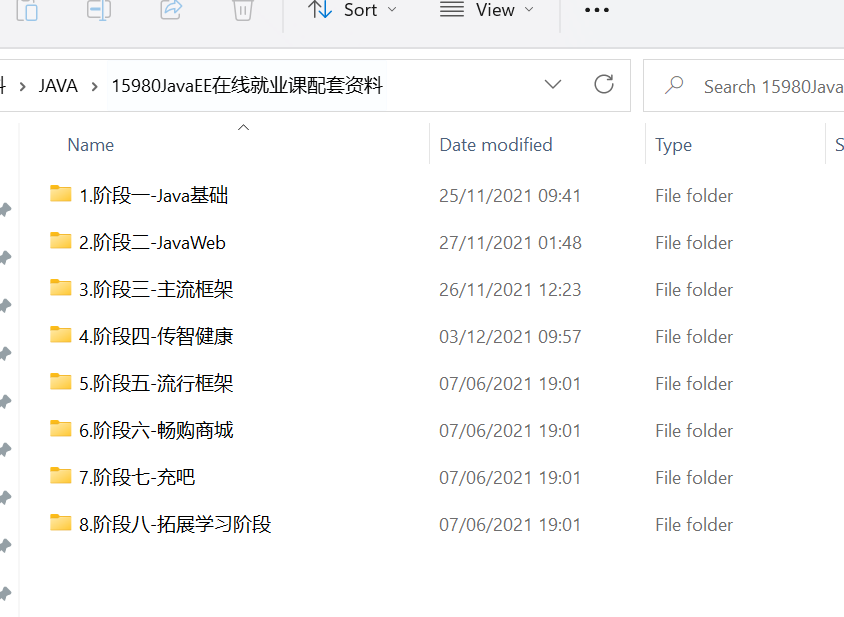
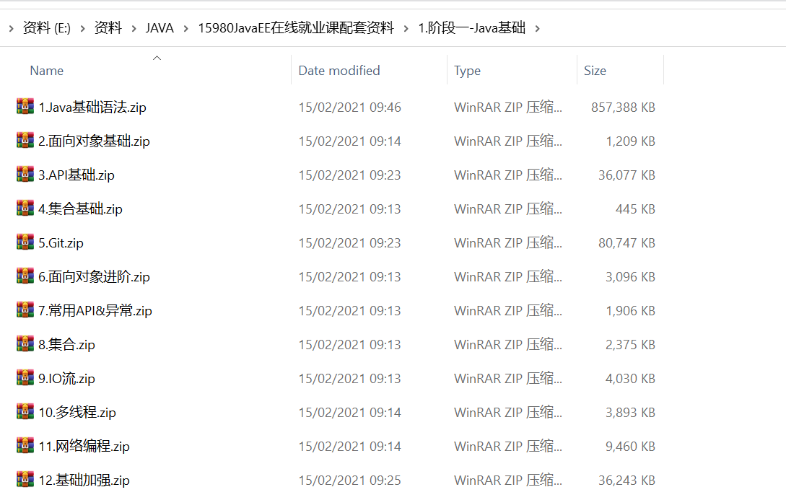
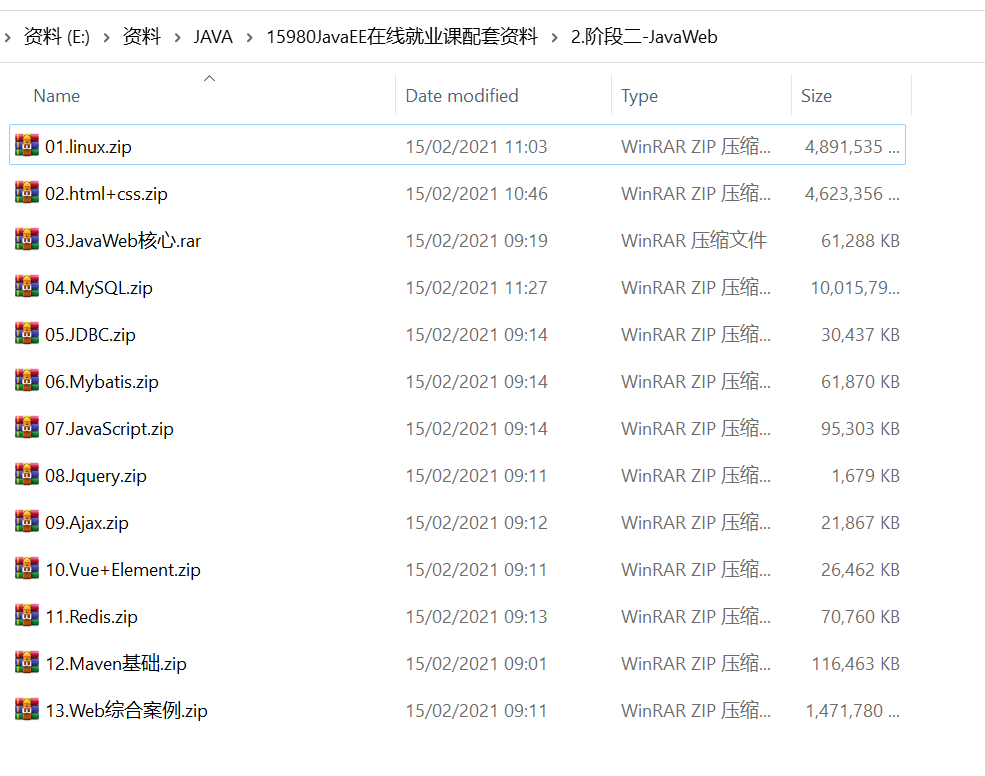
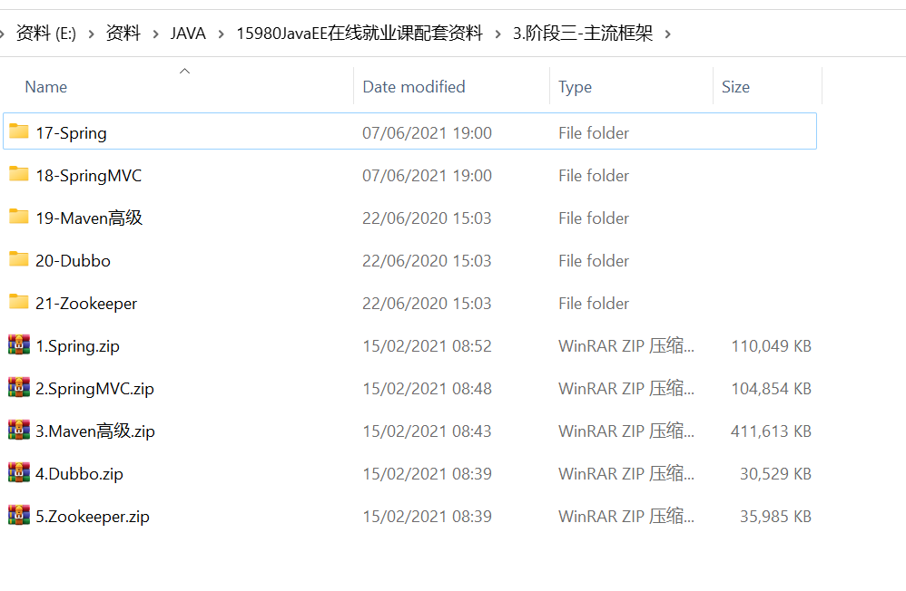
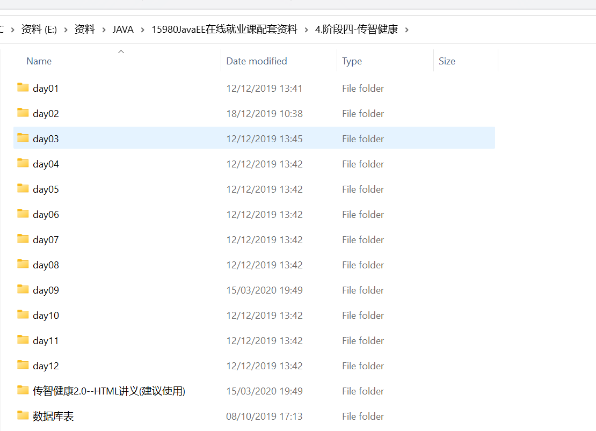
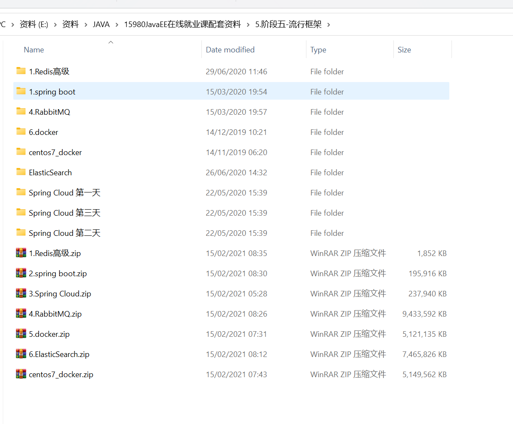
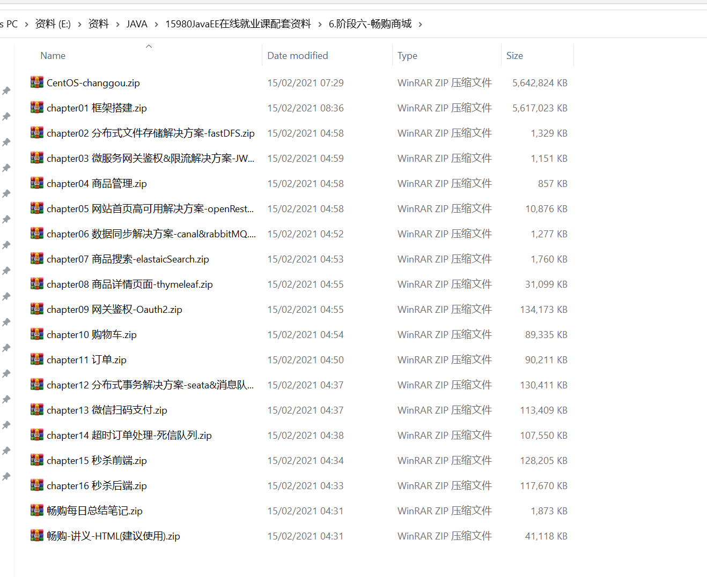
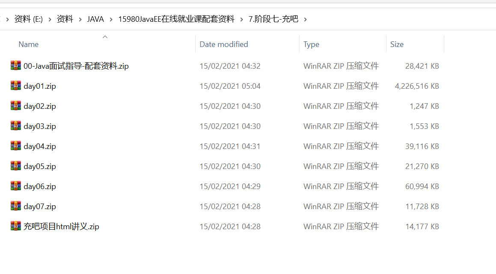
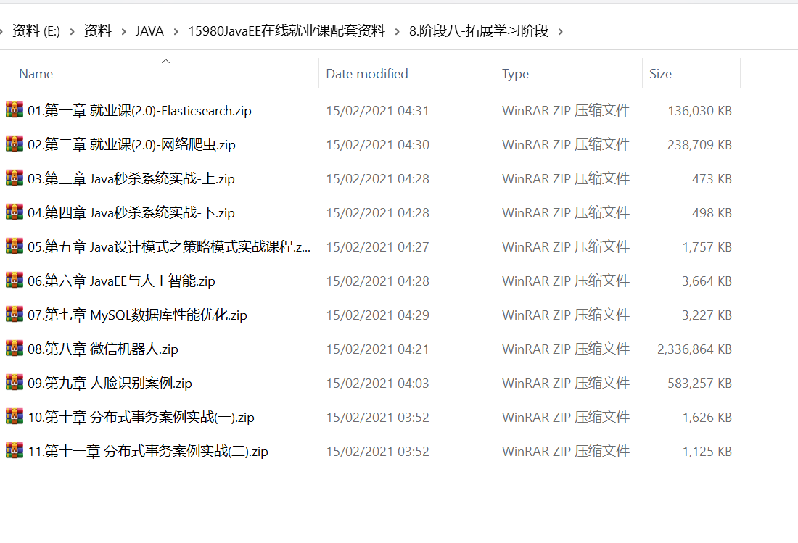

# java相关一些代码参照

### java相关一些代码参照

|      |                                                              |      |
| ---- | ------------------------------------------------------------ | ---- |
|      | [源码下载: SpringMVC--黑马教学代码.zip](源码下载:SpringMVC--黑马教学代码.zip) |      |
|      | [源码下载: Zookeeper-配置参照.zip](源码下载:Zookeeper-配置参照.zip) |      |
|      | [源码下载: dubbo-配置参照.zip](源码下载:dubbo-配置参照.zip)  |      |
|      | [源码下载: Maven高级--代码.zip](源码下载:Maven高级--代码.zip) |      |
|      | [源码下载: javaweb-综合案例.zip](源码下载:javaweb-综合案例.zip) |      |
|      | [源码下载:传智健康-代码.zip](源码下载:传智健康-代码.zip)     |      |
|      | [源码下载:传智健康-数据库表.zip](源码下载:传智健康-数据库表.zip) |      |

### 黑马JAVA-2021-学习路线图

