# WEB综合案例

## 学习目标：

目标1：能够说出案例的系统架构和技术架构

目标2：能够说出案例的大致需求

目标3：完成案例工程结构和页面结构的搭建

目标4：完成企业模块相关功能的业务开发

目标5：完成部门模块相关功能的业务开发

目标6：完成用户模块相关功能的业务的开发

## 1. 概述

### 1.1 案例介绍

**黑马面面是一款面向程序员的面试刷题系统**，服务于学员培训学习完毕后的复习问题，通过大量刷题，提高企业面试题的熟知度，辅助学员顺利完成求职面试。

注意：我们在本课程中只做黑马面面系统的一部分，对有些功能进行了微缩改造，

黑马面面本原始系统又分为三个子系统：**后台系统，前台系统，手机端**（在本课程中不涉及），以下是各子系统核心的功能介绍

**后台系统**：试题的录入

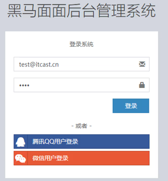

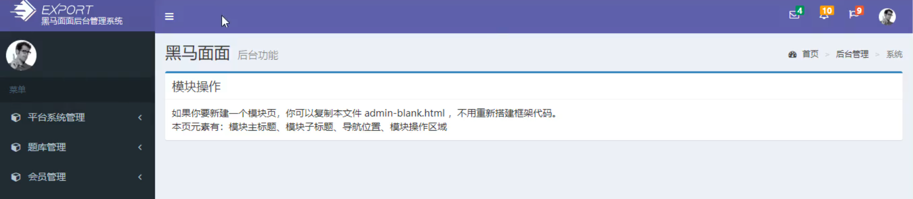

**前台系统**：会员刷题

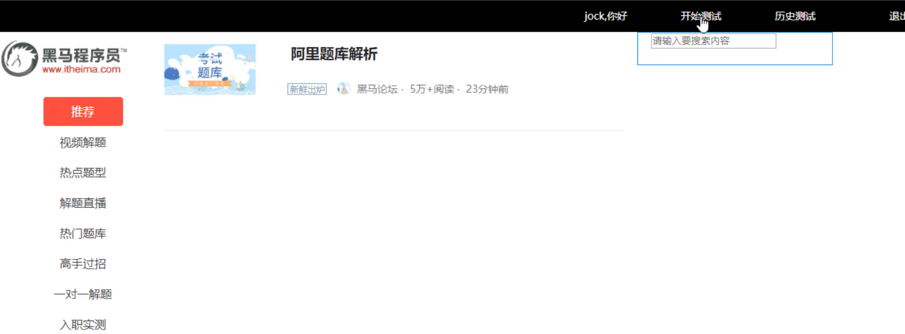

**手机端**：会员刷题（常用/主流）

### 1.2系统架构

接下来在做之前，我们就要说说这套案例制作的时候应该采用怎样的一种结构进行搭建？同时采用什么样的技术进行实现。那么首先我们先聊一聊整个项目的系统架构。

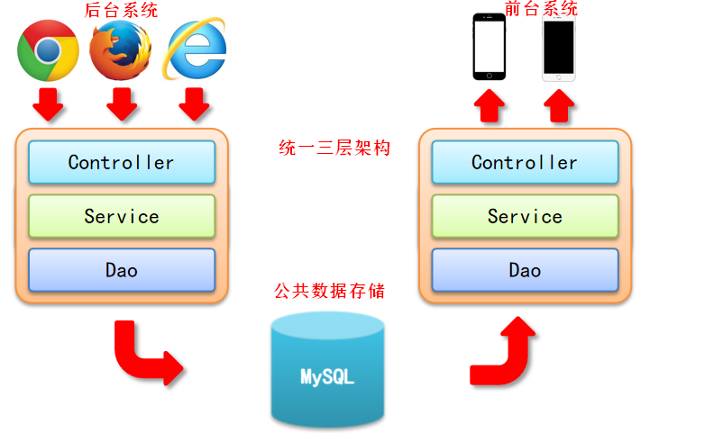

对于整个系统来说，它分成两块，一个是后台系统，一个是前台系统。那么我们在访问后台系统的时候，是通过浏览器来进行访问，最终把我们的数据存入到我们的数据库端。记得一点，我们从后台系统录入的题目数据，最终会被前台系统使用，所以说前后台系统，他们在数据这一端上来说是进行共享的。也就是前后台系统用的基础数据是同一组。那么前台系统是通过手机端来进行刷这个题，那么我们在这里边呢，不做手机端的，我们也做浏览器的，这就是它的一个整体的结构，你要先了解。

那么对于后台系统来说，开发的时候，我们采用三层架构的形式开发，分为表现、业务、数据。表现层负责数据的收集以及回显，业务层负责业务逻辑处理，数据层负责与数据库打交道。那么对于前台系统来说呢，它仍然是这样的，只不过他们之间用的技术有差别。那么都有哪些差别呢？接下来咱们就要来说一下技术架构！

### 1.3 技术架构

对于后台系统与前台系统，我们分成五个层面来介绍他们的产品。分别是页面端的技术，也就是我们的前端技术了，以及controller、service、Dao、DB。

详情见下图：

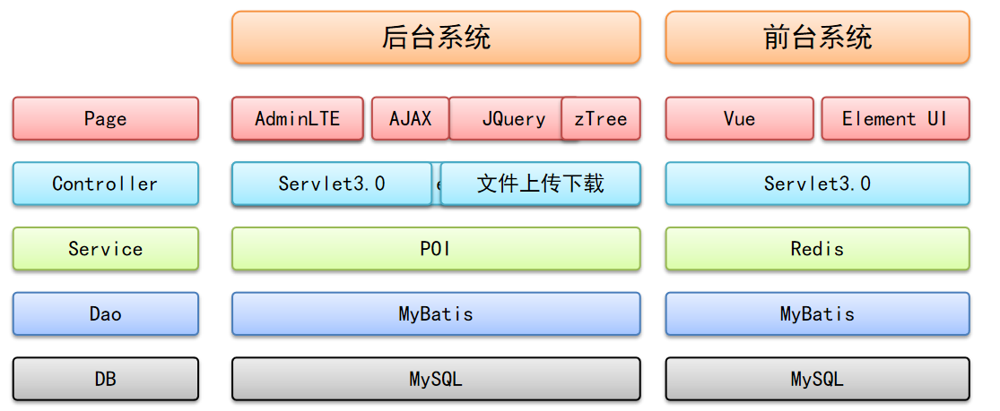

AdminLTE：一个前端框架，提供了很多友好的主题样式，动态功能效果，可直接使用，非常方便

POI：数据报表工具，可用于报表导出

### 1.4 需求分析

刷题是整个项目的核心功能，那么试题一定是我们的核心。对一道题来说，体型会多种多样，这次我们以最复杂的选择题来演示。选择题一般由题目与选项构成，题目与选项是一对多的关系。在下图中，我们以线和圆点来表述它们之间的关系。没有圆点的是“一”方，有圆点的是“多”方。

继续看，试题一定有归属的学科，比如你Java的同学做python的题，其实意义不大对吧。题目和学科能直产生一对多的关系吗？一个学科下其实分了很多的东西，比如Java下分Java基础、JavaWeb等等，所以在学科和试题建，需要有个目录。

假如你现在想去一个企业，是不想想看看这个企业以前都出些什么面试题呀。那就需要一个企业的模块了。一个企业与试题之间，也是一对多的关系。

试题是谁录入系统呢？需要有用户模块，那肯定是操作系统的人，对于这个用户来说，并不是所有人都能录入，所以需要约定一个部门。然后，那是部门中所有人都需要录入么？这样就涉及到了一个权限的问题了，我们说你这个用户有一种角色，就能拥有录入试题的权限！所以在用户与角色之间形成一个多对多的关系。

这个人分配角色了就能录试题了吗？不，还需要一个叫模块的东西。就是这个系统中一共有多少种操作？在我们系统中有一个模块叫做录入试题的模块，有一个模块叫审核试题的模块，是这个角色能操作这个模块儿，所以这个用户才能执行这项操作。模块与角色之间也是一个多对多的关系。

录入完了就能直接用么？不能，万一你录的题有问题呢？所以一定要有一个审核机制。对于所有的操作，我们都需要有一个日志来记录了，所以还要有一个日志的东西。

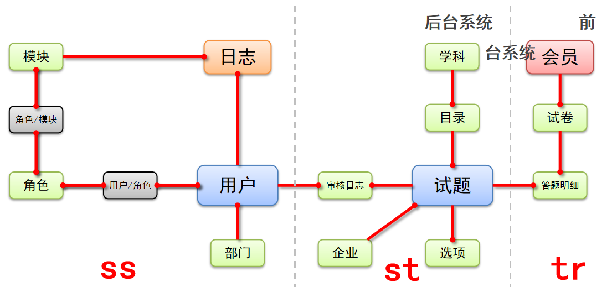

接下来要开始答题 ，那谁来答题呢？，会员。所以我们要有一个会员的模块。会员就直接做题吗？，做题应该是以试卷的形式呈现。作为一个会员，登录以后，你要去做一套卷子，而不是做一道题，当然你说能不能做单个题，可以，可以把单个题理解为这个试卷就一道题。会员与试卷是一对多的关系。

那试卷就与我们的试题直接产生关系么，不需要。我们每一个试卷生成以后。都需要把这个题给做出来，你做出来以后，除了有题目以外，试卷中还得有你做题的答案。所以说试卷中会保存一个试卷的答题明细，这个地方试卷对答题明细是一个一对多的关系。其实答题明细中本身就有试题的ID，因此我们这里用试卷与答题明细对试题进行关联。

总结一下，左边这块是属于后台系统，负责保障录入试题的。右边这块属于前台系统，负责学员的刷题功能。

### 1.5 课程计划安排

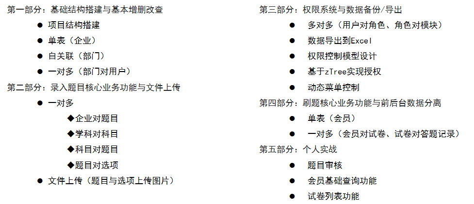

## 2. 环境搭建

### 2.1 工程结构搭建

创建工程的要求，及注意点：

- 创建maven工程（web工程）


- 导入项目依赖的坐标（资源）


- 补全目录结构

>web
>
>​    |-----src
>
>​	       |-------main
>
>​			      |------------java
>
>​	                      |------------resources
>
>​                              |------------webapp
>
>​                |-------test
>
>​			      |-------------java
>
>​			      |-------------resources


- 创建三层架构开发的包层次结构


- 创建三层架构开发的包层次结构

>domain
>
>dao
>
>service
>
>web
>
>​       controller
>
>​	filters
>
>utils
>
>factory


1：创建项目：mm

```xml
<groupId>com.itheima</groupId>
<artifactId>mm</artifactId>
<version>1.0-SNAPSHOT</version>
<packaging>war</packaging>
```

2：在pom.xml文件中添加相关坐标：

```xml
<properties>
    <project.build.sourceEncoding>UTF-8</project.build.sourceEncoding>
    <maven.compiler.source>1.8</maven.compiler.source>
    <maven.compiler.target>1.8</maven.compiler.target>
</properties>

<dependencies>
    <!--mybatis_-->
    <dependency>
        <groupId>org.mybatis</groupId>
        <artifactId>mybatis</artifactId>
        <version>3.5.3</version>
    </dependency>
    <!--分页插件-->
    <dependency>
        <groupId>com.github.pagehelper</groupId>
        <artifactId>pagehelper</artifactId>
        <version>5.1.2</version>
    </dependency>
    <!--mysql-->
    <dependency>
        <groupId>mysql</groupId>
        <artifactId>mysql-connector-java</artifactId>
        <version>5.1.46</version>
    </dependency>
    <!--druid数据源-->
    <dependency>
        <groupId>com.alibaba</groupId>
        <artifactId>druid</artifactId>
        <version>1.1.21</version>
    </dependency>
    <!--junit-->
    <dependency>
        <groupId>junit</groupId>
        <artifactId>junit</artifactId>
        <version>4.12</version>
        <scope>test</scope>
    </dependency>
    <!-- servlet3.0 -->
    <dependency>
        <groupId>javax.servlet</groupId>
        <artifactId>javax.servlet-api</artifactId>
        <version>3.1.0</version>
        <scope>provided</scope>
    </dependency>
    <!--jsp-->
    <dependency>
        <groupId>javax.servlet.jsp</groupId>
        <artifactId>javax.servlet.jsp-api</artifactId>
        <version>2.3.3</version>
        <scope>provided</scope>
    </dependency>
    <!--bean-utils-->
    <dependency>
        <groupId>commons-beanutils</groupId>
        <artifactId>commons-beanutils</artifactId>
        <version>1.9.4</version>
    </dependency>
    <!--apache工具包-->
    <dependency>
        <groupId>org.apache.commons</groupId>
        <artifactId>commons-lang3</artifactId>
        <version>3.9</version>
    </dependency>
    <!--jstl-->
    <dependency>
        <groupId>jstl</groupId>
        <artifactId>jstl</artifactId>
        <version>1.2</version>
    </dependency>
    <!--jackson-->
    <dependency>
        <groupId>com.fasterxml.jackson.core</groupId>
        <artifactId>jackson-annotations</artifactId>
        <version>2.9.0</version>
    </dependency>
    <dependency>
        <groupId>com.fasterxml.jackson.core</groupId>
        <artifactId>jackson-core</artifactId>
        <version>2.9.0</version>
    </dependency>
    <dependency>
        <groupId>com.fasterxml.jackson.core</groupId>
        <artifactId>jackson-databind</artifactId>
        <version>2.9.0</version>
    </dependency>
    <!--文件上传-->
    <dependency>
        <groupId>commons-fileupload</groupId>
        <artifactId>commons-fileupload</artifactId>
        <version>1.3.1</version>
    </dependency>
    <!--POI-->
    <dependency>
        <groupId>org.apache.poi</groupId>
        <artifactId>poi</artifactId>
        <version>4.0.1</version>
    </dependency>
    <dependency>
        <groupId>org.apache.poi</groupId>
        <artifactId>poi-ooxml</artifactId>
        <version>4.0.1</version>
    </dependency>
    <dependency>
        <groupId>org.apache.poi</groupId>
        <artifactId>poi-ooxml-schemas</artifactId>
        <version>4.0.1</version>
    </dependency>
</dependencies>

<build>
    <plugins>
        <!--tomcat插件-->
        <plugin>
            <groupId>org.apache.tomcat.maven</groupId>
            <artifactId>tomcat7-maven-plugin</artifactId>
            <version>2.1</version>
            <configuration>
                <port>80</port>
                <path>/</path>
            </configuration>
        </plugin>
    </plugins>
</build>
```

3：创建相关目录结构，包结构，如下

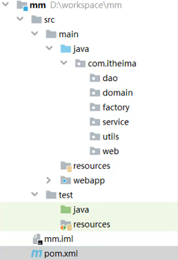

删除：web.xml

4：启动初始项目，运行查看！

5：从今日课程资料-------->工程资源文件中找到项目数据库脚本，导入到mysql数据库，创建好相关的库表结构

### 2.2 页面结构搭建

管理后台一般有着固定的页面构建模式，我们可以进行快速构建

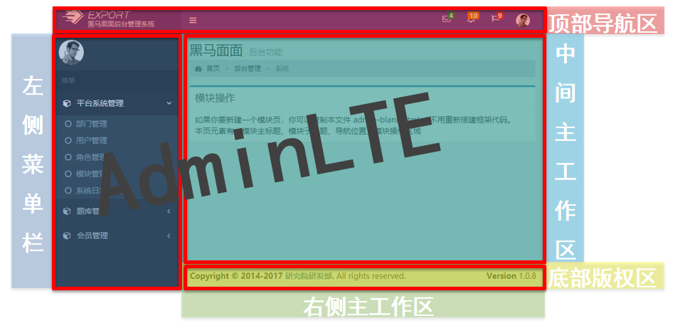

- AdminLTE是一款建立在bootstrap和jquery之上的开源模板主题工具，其中内置了多个模板页面，可以用于快速创建响应式Html5网站，并免去了书写大量的 CSS 与 JS 的工作
- 黑马程序员研究院对AdminLTE进行了汉化，并改良了个别功能，方便学员学习使用


从今日课程资料中找到：模块页面---------->案例结构页面----------->导入到项目的webapp目录下，如果有文件需要覆盖则选择覆盖，

导入完成后可以启动项目进行查看

由AdminLTE构建的网站后台的整体页面布局如下：

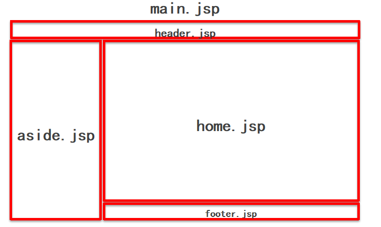

## 3. 企业模块

我们选择一个单表的增删改查功能来进行入门，熟悉开发的模式和流程，因此选择企业模块

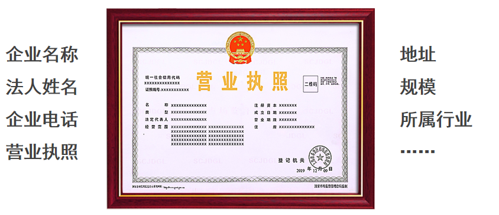

要对企业信息做CRUD，我们需要知道要操作企业的那些字段，

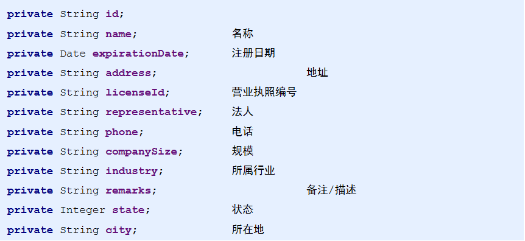

### 3.1 数据层开发

1：创建实体：com.itheima.domain.store.Company

```java
public class Company {

    private String id;
    private String name;
    private Date expirationDate;
    private String address;
    private String licenseId;
    private String representative;
    private String phone;
    private String companySize;
    private String industry;
    private String remarks;
    private Integer state;
    private String city;

    public String getId() {
        return id;
    }

    public void setId(String id) {
        this.id = id;
    }

    public String getName() {
        return name;
    }

    public void setName(String name) {
        this.name = name;
    }

    public Date getExpirationDate() {
        return expirationDate;
    }

    public void setExpirationDate(Date expirationDate) {
        this.expirationDate = expirationDate;
    }

    public String getAddress() {
        return address;
    }

    public void setAddress(String address) {
        this.address = address;
    }

    public String getLicenseId() {
        return licenseId;
    }

    public void setLicenseId(String licenseId) {
        this.licenseId = licenseId;
    }

    public String getRepresentative() {
        return representative;
    }

    public void setRepresentative(String representative) {
        this.representative = representative;
    }

    public String getPhone() {
        return phone;
    }

    public void setPhone(String phone) {
        this.phone = phone;
    }

    public String getCompanySize() {
        return companySize;
    }

    public void setCompanySize(String companySize) {
        this.companySize = companySize;
    }

    public String getIndustry() {
        return industry;
    }

    public void setIndustry(String industry) {
        this.industry = industry;
    }

    public String getRemarks() {
        return remarks;
    }

    public void setRemarks(String remarks) {
        this.remarks = remarks;
    }

    public Integer getState() {
        return state;
    }

    public void setState(Integer state) {
        this.state = state;
    }

    public String getCity() {
        return city;
    }

    public void setCity(String city) {
        this.city = city;
    }
}
```

2：创建dao：com.itheima.dao.store.CompanyDao

```java
public interface CompanyDao {

    int save(Company company);

    int delete(Company company);

    int update(Company company);

    Company findById(String id);

    List<Company> findAll();

}
```

3：从今日课程资料中找到：dao层资源文件---------拷贝配置文件下的资源到项目resources目录下

4：在项目resources目录下创建一个目录：com\itheima\dao\store，然后把CompanyDao.xml配置文件放到该目录中

5：从今日课程资料中找到：dao层资源文件----------拷贝工具类下的资源到项目中的utils包和factory包下；注意别放错位置


**总结**：

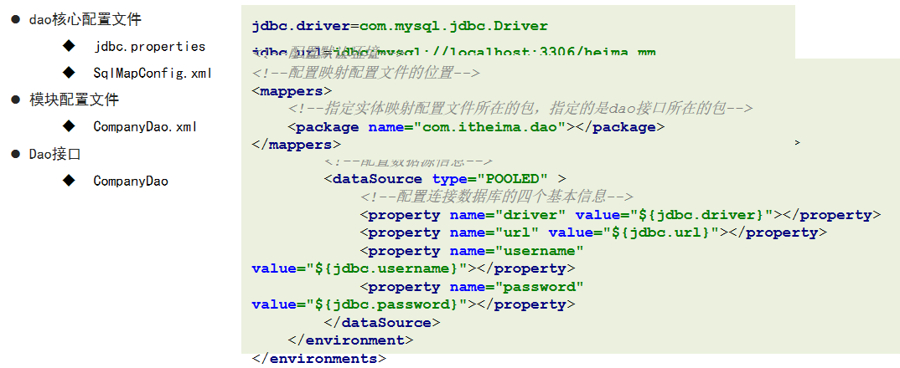


### 3.2 业务层开发

业务层基础功能：

增

删

改

查单个

查全部

分页查（分页插件）


我们依次来实现

1：创建业务层接口：com.itheima.service.store.CompanyService

```java
public interface CompanyService {

    /**
     * 添加
     * @param company
     * @return
     */
    void save(Company company);

    /**
     * 删除
     * @param company
     * @return
     */
    void delete(Company company);

    /**
     * 修改
     * @param company
     * @return
     */
    void update(Company company);

    /**
     * 查询单个
     * @param id 查询的条件（id）
     * @return 查询的结果，单个对象
     */
    Company findById(String id);

    /**
     * 查询全部的数据
     * @return 全部数据的列表对象
     */
    List<Company> findAll();

    /**
     * 分页查询数据
     * @param page 页码
     * @param size 每页显示的数据总量
     * @return
     */
    PageInfo findAll(int page,int size);

}
```

2：创建业务层实现类：com.itheima.service.store.impl.CompanyServiceImpl

```java
public class CompanyServiceImpl implements CompanyService {
    @Override
    public void save(Company company) {
        SqlSession sqlSession = null;
        try{
            //1.获取SqlSession
            sqlSession = MapperFactory.getSqlSession();
            //2.获取Dao
            CompanyDao companyDao = MapperFactory.getMapper(sqlSession,CompanyDao.class);
            //id使用UUID的生成策略来获取
            String id = UUID.randomUUID().toString();
            company.setId(id);
            //3.调用Dao层操作
            companyDao.save(company);
            //4.提交事务
            TransactionUtil.commit(sqlSession);
        }catch (Exception e){
            TransactionUtil.rollback(sqlSession);
            throw new RuntimeException(e);
            //记录日志
        }finally {
            try {
                TransactionUtil.close(sqlSession);
            }catch (Exception e){
                e.printStackTrace();
            }
        }
    }

    @Override
    public void delete(Company company) {
        SqlSession sqlSession = null;
        try{
            //1.获取SqlSession
            sqlSession = MapperFactory.getSqlSession();
            //2.获取Dao
            CompanyDao companyDao = MapperFactory.getMapper(sqlSession,CompanyDao.class);
            //3.调用Dao层操作
            companyDao.delete(company);
            //4.提交事务
            TransactionUtil.commit(sqlSession);
        }catch (Exception e){
            TransactionUtil.rollback(sqlSession);
            throw new RuntimeException(e);
            //记录日志
        }finally {
            try {
                TransactionUtil.close(sqlSession);
            }catch (Exception e){
                e.printStackTrace();
            }
        }
    }

    @Override
    public void update(Company company) {
        SqlSession sqlSession = null;
        try{
            //1.获取SqlSession
            sqlSession = MapperFactory.getSqlSession();
            //2.获取Dao
            CompanyDao companyDao = MapperFactory.getMapper(sqlSession,CompanyDao.class);
            //3.调用Dao层操作
            companyDao.update(company);
            //4.提交事务
            TransactionUtil.commit(sqlSession);
        }catch (Exception e){
            TransactionUtil.rollback(sqlSession);
            throw new RuntimeException(e);
            //记录日志
        }finally {
            try {
                TransactionUtil.close(sqlSession);
            }catch (Exception e){
                e.printStackTrace();
            }
        }
    }

    @Override
    public Company findById(String id) {
        SqlSession sqlSession = null;
        try{
            //1.获取SqlSession
            sqlSession = MapperFactory.getSqlSession();
            //2.获取Dao
            CompanyDao companyDao = MapperFactory.getMapper(sqlSession,CompanyDao.class);
            //3.调用Dao层操作
            return companyDao.findById(id);
        }catch (Exception e){
            throw new RuntimeException(e);
            //记录日志
        }finally {
            try {
                TransactionUtil.close(sqlSession);
            }catch (Exception e){
                e.printStackTrace();
            }
        }
    }

    @Override
    public List<Company> findAll() {
        SqlSession sqlSession = null;
        try{
            //1.获取SqlSession
            sqlSession = MapperFactory.getSqlSession();
            //2.获取Dao
            CompanyDao companyDao = MapperFactory.getMapper(sqlSession,CompanyDao.class);
            //3.调用Dao层操作
            return companyDao.findAll();
        }catch (Exception e){
            throw new RuntimeException(e);
            //记录日志
        }finally {
            try {
                TransactionUtil.close(sqlSession);
            }catch (Exception e){
                e.printStackTrace();
            }
        }
    }

    @Override
    public PageInfo findAll(int page, int size) {
        SqlSession sqlSession = null;
        try{
            //1.获取SqlSession
            sqlSession = MapperFactory.getSqlSession();
            //2.获取Dao
            CompanyDao companyDao = MapperFactory.getMapper(sqlSession,CompanyDao.class);
            //3.调用Dao层操作
            PageHelper.startPage(page,size);
            List<Company> all = companyDao.findAll();
            PageInfo pageInfo = new PageInfo(all);
            return pageInfo;
        }catch (Exception e){
            throw new RuntimeException(e);
            //记录日志
        }finally {
            try {
                TransactionUtil.close(sqlSession);
            }catch (Exception e){
                e.printStackTrace();
            }
        }
    }
}
```

3：创建测试类，对业务层方法依次测试，在测试包下创建：com.itheima.service.store.CompanyServiceTest

```java
public class CompanyServiceTest {
    private static CompanyService companyService = null;
    @BeforeClass
    public static void init(){
        companyService = new CompanyServiceImpl();
    }

    @Test
    public void testSave(){
        Company company = new Company();
        company.setName("测试数据");
        companyService.save(company);
    }

    @Test
    public void testFindAll(){
        PageInfo all = companyService.findAll(1, 100);
        System.out.println(all);
    }

    @AfterClass
    public static void destory(){
        companyService = null;
    }


}
```


### 3.3 表现层列表功能

功能分析：

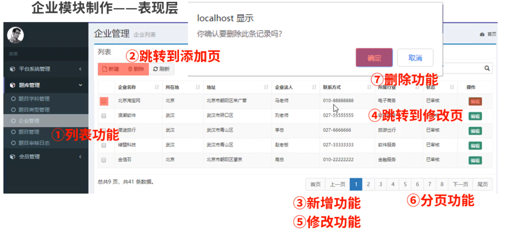

1：在今日课程资料中找到：模块页面--------->company下的所有页面----->拷贝并添加到项目`webapp\pages\store\company`目录下，当然后两级目录需要自己新建

2：在`webapp/pages/home/aside.jsp`中找到企业管理，修改对应的连接为`${ctx}/pages/store/company/list.jsp`

3：在项目中创建目录：`webapp/pages/common`，从今日课程给大家提供的模块页面中找到：公共页面，将里面的jsp拷贝到刚刚创建好的common目录中

4：创建Servlet：com.itheima.web.controller.store.company.CompanyServlet

```java
// uri:/store/company?operation=list
@WebServlet("/store/company")
public class CompanyServlet extends HttpServlet {

    @Override
    protected void doGet(HttpServletRequest request, HttpServletResponse response) throws ServletException, IOException {
        String operation = request.getParameter("operation");
        if("list".equals(operation)){
            CompanyService companyService = new CompanyServiceImpl();
            PageInfo all = companyService.findAll(1, 100);
            //将数据保存到指定的位置
            request.setAttribute("page",all);
            //跳转页面
            request.getRequestDispatcher("/WEB-INF/pages/store/company/list.jsp").forward(request,response);
        }else if("list".equals(operation)){

        }else if("list".equals(operation)){

        }else if("list".equals(operation)){

        }else if("list".equals(operation)){

        }else if("list".equals(operation)){

        }
    }

    @Override
    protected void doPost(HttpServletRequest request, HttpServletResponse response) throws ServletException, IOException {
        this.doGet(request,response);
    }
}
```

5：将项目webapp下的pages目录拷贝到WEB-INF目录，并删除home目录，然后删除原本webapp/pages目录下的common及store目录

6：找到`webapp/pages/home/aside.jsp`中的企业管理，修改连接为`${ctx}/store/company?operation=list`

7：在页面中进行数据渲染，找到`WEB-INF/pages/store/compay/list.jsp`，填充数据区，注意页面中已经写好了

```jsp
<!--数据列表-->
<table id="dataList" class="table table-bordered table-striped table-hover dataTable">
    <thead>
        <tr>
            <th class="" style="padding-right:0px;">

            </th>
            <th class="sorting">企业名称</th>
            <th class="sorting">所在地</th>
            <th class="sorting">地址</th>
            <th class="sorting">企业法人</th>
            <th class="sorting">联系方式</th>
            <th class="sorting">所属行业</th>
            <th class="sorting">状态</th>
            <th class="text-center">操作</th>
        </tr>
    </thead>
    <tbody>
        <c:forEach items="${page.list}" var="item">
            <tr>
                <td><input name="ids" value="${item.id}" type="checkbox"></td>
                <td>
                    ${item.name}
                </td>
                <td>${item.city}</td>
                <td>${item.address}</td>
                <td>${item.representative}</td>
                <td>${item.phone}</td>
                <td>${item.industry}</td>
                <td>${item.state ==0?'未审核':'已审核'}</td>
                <td class="text-center">
                    <button type="button" class="btn bg-olive btn-xs" onclick='location.href="${ctx}/store/company?operation=toEdit&id=${item.id}"'>编辑</button>
                </td>
            </tr>
        </c:forEach>
    </tbody>
</table>
```

8：优化doGost方法，添加分页控制

```java
@Override
protected void doGet(HttpServletRequest request, HttpServletResponse response) throws ServletException, IOException {
    String operation = request.getParameter("operation");
    if("list".equals(operation)){
        CompanyService companyService = new CompanyServiceImpl();
        int page = 1;
        int size = 5;
        if(StringUtils.isNotBlank(request.getParameter("page"))){
            page = Integer.parseInt(request.getParameter("page"));
        }
        if(StringUtils.isNotBlank(request.getParameter("size"))){
            size = Integer.parseInt(request.getParameter("size"));
        }
        PageInfo all = companyService.findAll(page, size);
        //将数据保存到指定的位置
        request.setAttribute("page",all);
        //跳转页面
        request.getRequestDispatcher("/WEB-INF/pages/store/company/list.jsp").forward(request,response);
    }else if("list".equals(operation)){

    }else if("list".equals(operation)){

    }else if("list".equals(operation)){

    }else if("list".equals(operation)){

    }else if("list".equals(operation)){

    }
}
```

### 3.4 表现层添加功能

1：为了应对更多的方法，我们进行方法抽取

```java
// uri:/store/company?operation=list
@WebServlet("/store/company")
public class CompanyServlet extends HttpServlet {

    @Override
    protected void doGet(HttpServletRequest request, HttpServletResponse response) throws ServletException, IOException {
        String operation = request.getParameter("operation");
        if("list".equals(operation)){
            this.list(request,response);
        }else if("toAdd".equals(operation)){
            this.toAdd(request,response);
        }else if("save".equals(operation)){
            this.save(request, response);
        }
    }

    private void list(HttpServletRequest request,HttpServletResponse response) throws ServletException, IOException {
        //进入列表页
        //获取数据
        CompanyService companyService = new CompanyServiceImpl();
        int page = 1;
        int size = 5;
        if(StringUtils.isNotBlank(request.getParameter("page"))){
            page = Integer.parseInt(request.getParameter("page"));
        }
        if(StringUtils.isNotBlank(request.getParameter("size"))){
            size = Integer.parseInt(request.getParameter("size"));
        }
        PageInfo all = companyService.findAll(page, size);
        //将数据保存到指定的位置
        request.setAttribute("page",all);
        //跳转页面
        request.getRequestDispatcher("/WEB-INF/pages/store/company/list.jsp").forward(request,response);
    }

    private void toAdd(HttpServletRequest request,HttpServletResponse response) throws ServletException, IOException {
        //跳转页面
        request.getRequestDispatcher("/WEB-INF/pages/store/company/add.jsp").forward(request,response);
    }

    private void save(HttpServletRequest request,HttpServletResponse response) throws ServletException, IOException {
      
    }

    @Override
    protected void doPost(HttpServletRequest request, HttpServletResponse response) throws ServletException, IOException {
        this.doGet(request,response);
    }
}
```

2：编辑`/WEB-INF/pages/store/company/add.jsp`页面（无需修改）

3：从课程资料中找到：web层资源文件，在里面找到：`BeanUtil.java`拷贝到项目utils包下

4：编写save方法，完成数据的保存

```java
private void save(HttpServletRequest request,HttpServletResponse response) throws ServletException, IOException {
    //将数据获取到，封装成一个对象
    Company company = BeanUtil.fillBean(request,Company.class,"yyyy-MM-dd");
    //调用业务层接口save
    CompanyService companyService = new CompanyServiceImpl();
    companyService.save(company);
    //跳转回到页面list
    //list(request,response);
    response.sendRedirect(request.getContextPath()+"/store/company?operation=list");
}
```

### 3.5 表现层删除修改功能

修改和保存差异不大，一个是做save，一个是做update，

1：在doGet方法添加去到修改页面和真正修改的两个方法

```java
@Override
protected void doGet(HttpServletRequest request, HttpServletResponse response) throws ServletException, IOException {
    String operation = request.getParameter("operation");
    if("list".equals(operation)){
        this.list(request,response);
    }else if("toAdd".equals(operation)){
        this.toAdd(request,response);
    }else if("save".equals(operation)){
        this.save(request, response);
    }else if("toEdit".equals(operation)){
        this.toEdit(request,response);
    }else if("edit".equals(operation)){
        this.edit(request,response);
    }
}

private void toEdit(HttpServletRequest request, HttpServletResponse response) throws ServletException, IOException {
        //查询要修改的数据findById
        String id = request.getParameter("id");
        CompanyService companyService = new CompanyServiceImpl();
        Company company = companyService.findById(id);
        //将数据加载到指定区域，供页面获取
        request.setAttribute("company",company);
        //跳转页面
        request.getRequestDispatcher("/WEB-INF/pages/store/company/update.jsp").forward(request,response);
    }

    private void edit(HttpServletRequest request, HttpServletResponse response) throws IOException {
        //将数据获取到，封装成一个对象
        Company company = BeanUtil.fillBean(request,Company.class,"yyyy-MM-dd");
        //调用业务层接口save
        CompanyService companyService = new CompanyServiceImpl();
        companyService.update(company);
        //跳转回到页面list
        //list(request,response);
        response.sendRedirect(request.getContextPath()+"/store/company?operation=list");
    }
```

2：删除功能后台相对简单，主要是前台对要删除数据的id如何获取，对于后台，在doGet方法中添加对删除操作的判断，并添加删除方法

```java
@Override
protected void doGet(HttpServletRequest request, HttpServletResponse response) throws ServletException, IOException {
    String operation = request.getParameter("operation");
    if("list".equals(operation)){
        this.list(request,response);
    }else if("toAdd".equals(operation)){
        this.toAdd(request,response);
    }else if("save".equals(operation)){
        this.save(request, response);
    }else if("toEdit".equals(operation)){
        this.toEdit(request,response);
    }else if("edit".equals(operation)){
        this.edit(request,response);
    }else if("delete".equals(operation)){
        this.delete(request,response);
    }
}

private void delete(HttpServletRequest request, HttpServletResponse response) throws IOException {
    //将数据获取到，封装成一个对象
    Company company = BeanUtil.fillBean(request,Company.class);
    //调用业务层接口save
    //        CompanyService companyService = new CompanyServiceImpl();
    companyService.delete(company);
    //跳转回到页面list
    //list(request,response);
    response.sendRedirect(request.getContextPath()+"/store/company?operation=list");
}
```


3：代码优化，在所有的操作方法中我们要调用业务层，我们都要去创建业务层对象，每个方法中都去创建略显复杂，怎么办？

创建一个BaseServlet：com.itheima.web.controller.BaseServlet

```java
public class BaseServlet extends HttpServlet {
    protected CompanyService companyService;

    @Override
    public void init() throws ServletException {
        companyService = new CompanyServiceImpl();
    }
}
```

4：修改`CompanyServlet`让其继承自`BaseServlet`，然后在各个方法中注释掉业务层对象创建的代码，完整的`CompanyServlet`如下

```java
// uri:/store/company?operation=list
@WebServlet("/store/company")
public class CompanyServlet extends BaseServlet {

    @Override
    protected void doGet(HttpServletRequest request, HttpServletResponse response) throws ServletException, IOException {
        String operation = request.getParameter("operation");
        if("list".equals(operation)){
            this.list(request,response);
        }else if("toAdd".equals(operation)){
            this.toAdd(request,response);
        }else if("save".equals(operation)){
            this.save(request, response);
        }else if("toEdit".equals(operation)){
            this.toEdit(request,response);
        }else if("edit".equals(operation)){
            this.edit(request,response);
        }else if("delete".equals(operation)){
            this.delete(request,response);
        }
    }

    private void list(HttpServletRequest request,HttpServletResponse response) throws ServletException, IOException {
        //进入列表页
        //获取数据
//        CompanyService companyService = new CompanyServiceImpl();
        int page = 1;
        int size = 5;
        if(StringUtils.isNotBlank(request.getParameter("page"))){
            page = Integer.parseInt(request.getParameter("page"));
        }
        if(StringUtils.isNotBlank(request.getParameter("size"))){
            size = Integer.parseInt(request.getParameter("size"));
        }
        PageInfo all = companyService.findAll(page, size);
        //将数据保存到指定的位置
        request.setAttribute("page",all);
        //跳转页面
        request.getRequestDispatcher("/WEB-INF/pages/store/company/list.jsp").forward(request,response);
    }

    private void toAdd(HttpServletRequest request,HttpServletResponse response) throws ServletException, IOException {
        //跳转页面
        request.getRequestDispatcher("/WEB-INF/pages/store/company/add.jsp").forward(request,response);
    }

    private void save(HttpServletRequest request,HttpServletResponse response) throws ServletException, IOException {
        //将数据获取到，封装成一个对象
        Company company = BeanUtil.fillBean(request,Company.class,"yyyy-MM-dd");
        //调用业务层接口save
//        CompanyService companyService = new CompanyServiceImpl();
        companyService.save(company);
        //跳转回到页面list
        //list(request,response);
        response.sendRedirect(request.getContextPath()+"/store/company?operation=list");
    }

    private void toEdit(HttpServletRequest request, HttpServletResponse response) throws ServletException, IOException {
        //查询要修改的数据findById
        String id = request.getParameter("id");
//        CompanyService companyService = new CompanyServiceImpl();
        Company company = companyService.findById(id);
        //将数据加载到指定区域，供页面获取
        request.setAttribute("company",company);
        //跳转页面
        request.getRequestDispatcher("/WEB-INF/pages/store/company/update.jsp").forward(request,response);
    }

    private void edit(HttpServletRequest request, HttpServletResponse response) throws IOException {
        //将数据获取到，封装成一个对象
        Company company = BeanUtil.fillBean(request,Company.class,"yyyy-MM-dd");
        //调用业务层接口save
//        CompanyService companyService = new CompanyServiceImpl();
        companyService.update(company);
        //跳转回到页面list
        //list(request,response);
        response.sendRedirect(request.getContextPath()+"/store/company?operation=list");
    }

    private void delete(HttpServletRequest request, HttpServletResponse response) throws IOException {
        //将数据获取到，封装成一个对象
        Company company = BeanUtil.fillBean(request,Company.class);
        //调用业务层接口save
//        CompanyService companyService = new CompanyServiceImpl();
        companyService.delete(company);
        //跳转回到页面list
        //list(request,response);
        response.sendRedirect(request.getContextPath()+"/store/company?operation=list");
    }

    @Override
    protected void doPost(HttpServletRequest request, HttpServletResponse response) throws ServletException, IOException {
        this.doGet(request,response);
    }
}
```

## 4. 部门模块

对于部门，我们要弄清楚的部门的结构

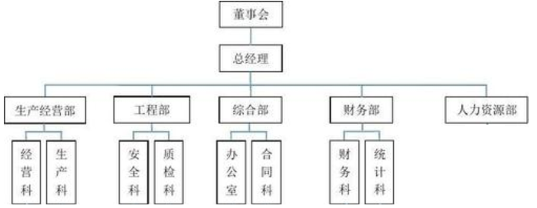

### 4.1 部门模块单表开发

1：创建实体：com.itheima.domain.system.Dept

```java
public class Dept {
    private String id;
    private String deptName;
    private String parentId;
    private Integer state;

    public String getId() {
        return id;
    }

    public void setId(String id) {
        this.id = id;
    }

    public String getDeptName() {
        return deptName;
    }

    public void setDeptName(String deptName) {
        this.deptName = deptName;
    }

    public String getParentId() {
        return parentId;
    }

    public void setParentId(String parentId) {
        this.parentId = parentId;
    }

    public Integer getState() {
        return state;
    }

    public void setState(Integer state) {
        this.state = state;
    }
}
```

2：在`src/main/resources`下创建目录`com/itheima/dao/system`，找到课程资料的`dao层资源文件\配置文件\DeptDao.xml`，拷贝到该目录下

3：创建dao接口：com.itheima.dao.system.DeptDao

```java
public interface DeptDao {
    int save(Dept dept);

    int delete(Dept dept);

    int update(Dept dept);

    Dept findById(String id);

    List<Dept> findAll();

}
```

4：创建业务层接口：com.itheima.service.system.DeptService

```java
public interface DeptService {
    /**
     * 添加
     * @param dept
     * @return
     */
    void save(Dept dept);

    /**
     * 删除
     * @param dept
     * @return
     */
    void delete(Dept dept);

    /**
     * 修改
     * @param dept
     * @return
     */
    void update(Dept dept);

    /**
     * 查询单个
     * @param id 查询的条件（id）
     * @return 查询的结果，单个对象
     */
    Dept findById(String id);

    /**
     * 查询全部的数据
     * @return 全部数据的列表对象
     */
    List<Dept> findAll();

    /**
     * 分页查询数据
     * @param page 页码
     * @param size 每页显示的数据总量
     * @return
     */
    PageInfo findAll(int page, int size);
}
```

5：创建业务层实现类：com.itheima.service.system.impl.DeptServiceImpl

```java
public class DeptServiceImpl implements DeptService {
    @Override
    public void save(Dept dept) {
        SqlSession sqlSession = null;
        try{
            //1.获取SqlSession
            sqlSession = MapperFactory.getSqlSession();
            //2.获取Dao
            DeptDao deptDao = MapperFactory.getMapper(sqlSession,DeptDao.class);
            //id使用UUID的生成策略来获取
            String id = UUID.randomUUID().toString();
            dept.setId(id);
            //3.调用Dao层操作
            deptDao.save(dept);
            //4.提交事务
            TransactionUtil.commit(sqlSession);
        }catch (Exception e){
            TransactionUtil.rollback(sqlSession);
            throw new RuntimeException(e);
            //记录日志
        }finally {
            try {
                TransactionUtil.close(sqlSession);
            }catch (Exception e){
                e.printStackTrace();
            }
        }
    }

    @Override
    public void delete(Dept dept) {
        SqlSession sqlSession = null;
        try{
            //1.获取SqlSession
            sqlSession = MapperFactory.getSqlSession();
            //2.获取Dao
            DeptDao deptDao = MapperFactory.getMapper(sqlSession,DeptDao.class);
            //3.调用Dao层操作
            deptDao.delete(dept);
            //4.提交事务
            TransactionUtil.commit(sqlSession);
        }catch (Exception e){
            TransactionUtil.rollback(sqlSession);
            throw new RuntimeException(e);
            //记录日志
        }finally {
            try {
                TransactionUtil.close(sqlSession);
            }catch (Exception e){
                e.printStackTrace();
            }
        }
    }

    @Override
    public void update(Dept dept) {
        SqlSession sqlSession = null;
        try{
            //1.获取SqlSession
            sqlSession = MapperFactory.getSqlSession();
            //2.获取Dao
            DeptDao deptDao = MapperFactory.getMapper(sqlSession,DeptDao.class);
            //3.调用Dao层操作
            deptDao.update(dept);
            //4.提交事务
            TransactionUtil.commit(sqlSession);
        }catch (Exception e){
            TransactionUtil.rollback(sqlSession);
            throw new RuntimeException(e);
            //记录日志
        }finally {
            try {
                TransactionUtil.close(sqlSession);
            }catch (Exception e){
                e.printStackTrace();
            }
        }
    }

    @Override
    public Dept findById(String id) {
        SqlSession sqlSession = null;
        try{
            //1.获取SqlSession
            sqlSession = MapperFactory.getSqlSession();
            //2.获取Dao
            DeptDao deptDao = MapperFactory.getMapper(sqlSession,DeptDao.class);
            //3.调用Dao层操作
            return deptDao.findById(id);
        }catch (Exception e){
            throw new RuntimeException(e);
            //记录日志
        }finally {
            try {
                TransactionUtil.close(sqlSession);
            }catch (Exception e){
                e.printStackTrace();
            }
        }
    }

    @Override
    public List<Dept> findAll() {
        SqlSession sqlSession = null;
        try{
            //1.获取SqlSession
            sqlSession = MapperFactory.getSqlSession();
            //2.获取Dao
            DeptDao deptDao = MapperFactory.getMapper(sqlSession,DeptDao.class);
            //3.调用Dao层操作
            return deptDao.findAll();
        }catch (Exception e){
            throw new RuntimeException(e);
            //记录日志
        }finally {
            try {
                TransactionUtil.close(sqlSession);
            }catch (Exception e){
                e.printStackTrace();
            }
        }
    }

    @Override
    public PageInfo findAll(int page, int size) {
        SqlSession sqlSession = null;
        try{
            //1.获取SqlSession
            sqlSession = MapperFactory.getSqlSession();
            //2.获取Dao
            DeptDao deptDao = MapperFactory.getMapper(sqlSession,DeptDao.class);
            //3.调用Dao层操作
            PageHelper.startPage(page,size);
            List<Dept> all = deptDao.findAll();
            PageInfo pageInfo = new PageInfo(all);
            return pageInfo;
        }catch (Exception e){
            throw new RuntimeException(e);
            //记录日志
        }finally {
            try {
                TransactionUtil.close(sqlSession);
            }catch (Exception e){
                e.printStackTrace();
            }
        }
    }
}
```

6：创建Servlet：com.itheima.web.controller.system.DeptServlet

```java
// uri:/system/dept?operation=list
@WebServlet("/system/dept")
public class DeptServlet extends BaseServlet {

    @Override
    protected void doGet(HttpServletRequest request, HttpServletResponse response) throws ServletException, IOException {
        String operation = request.getParameter("operation");
        if("list".equals(operation)){
            this.list(request,response);
        }else if("toAdd".equals(operation)){
            this.toAdd(request,response);
        }else if("save".equals(operation)){
            this.save(request, response);
        }else if("toEdit".equals(operation)){
            this.toEdit(request,response);
        }else if("edit".equals(operation)){
            this.edit(request,response);
        }else if("delete".equals(operation)){
            this.delete(request,response);
        }
    }

    private void list(HttpServletRequest request,HttpServletResponse response) throws ServletException, IOException {
        //进入列表页
        //获取数据
        int page = 1;
        int size = 5;
        if(StringUtils.isNotBlank(request.getParameter("page"))){
            page = Integer.parseInt(request.getParameter("page"));
        }
        if(StringUtils.isNotBlank(request.getParameter("size"))){
            size = Integer.parseInt(request.getParameter("size"));
        }
        PageInfo all = deptService.findAll(page, size);
        //将数据保存到指定的位置
        request.setAttribute("page",all);
        //跳转页面
        request.getRequestDispatcher("/WEB-INF/pages/system/dept/list.jsp").forward(request,response);
    }

    private void toAdd(HttpServletRequest request,HttpServletResponse response) throws ServletException, IOException {
        //跳转页面
        request.getRequestDispatcher("/WEB-INF/pages/system/dept/add.jsp").forward(request,response);
    }

    private void save(HttpServletRequest request,HttpServletResponse response) throws ServletException, IOException {
        //将数据获取到，封装成一个对象
        Dept dept = BeanUtil.fillBean(request,Dept.class,"yyyy-MM-dd");
        //调用业务层接口save
//        DeptService deptService = new DeptServiceImpl();
        deptService.save(dept);
        //跳转回到页面list
        //list(request,response);
        response.sendRedirect(request.getContextPath()+"/system/dept?operation=list");
    }

    private void toEdit(HttpServletRequest request, HttpServletResponse response) throws ServletException, IOException {
        //查询要修改的数据findById
        String id = request.getParameter("id");
//        DeptService deptService = new DeptServiceImpl();
        Dept dept = deptService.findById(id);
        //将数据加载到指定区域，供页面获取
        request.setAttribute("dept",dept);
        //跳转页面
        request.getRequestDispatcher("/WEB-INF/pages/system/dept/update.jsp").forward(request,response);
    }

    private void edit(HttpServletRequest request, HttpServletResponse response) throws IOException {
        //将数据获取到，封装成一个对象
        Dept dept = BeanUtil.fillBean(request,Dept.class,"yyyy-MM-dd");
        //调用业务层接口save
//        DeptService deptService = new DeptServiceImpl();
        deptService.update(dept);
        //跳转回到页面list
        //list(request,response);
        response.sendRedirect(request.getContextPath()+"/system/dept?operation=list");
    }

    private void delete(HttpServletRequest request, HttpServletResponse response) throws IOException {
        //将数据获取到，封装成一个对象
        Dept dept = BeanUtil.fillBean(request,Dept.class);
        //调用业务层接口save
//        DeptService deptService = new DeptServiceImpl();
        deptService.delete(dept);
        //跳转回到页面list
        //list(request,response);
        response.sendRedirect(request.getContextPath()+"/system/dept?operation=list");
    }

    @Override
    protected void doPost(HttpServletRequest request, HttpServletResponse response) throws ServletException, IOException {
        this.doGet(request,response);
    }
}
```

7：在BaseServlet中添加新的代码，如下

```java
public class BaseServlet extends HttpServlet {
    protected CompanyService companyService;
    protected DeptService deptService;

    @Override
    public void init() throws ServletException {
        companyService = new CompanyServiceImpl();
        deptService = new DeptServiceImpl();
    }
}
```

8：创建目录`WEB-INF/pages/system/dept`，从`WEB-INF/pages/store/company/`下拷贝`add.jsp,list.jsp,update.jsp`到该目录中

9：调整上述拷贝过来的`list.jsp`，修改数据表格部分

```jsp
<!--数据列表-->
<table id="dataList" class="table table-bordered table-striped table-hover dataTable">
    <thead>
        <tr>
            <th class="" style="padding-right:0px;">
                <input type="checkbox" name="selid" onclick="checkAll('id',this)">
            </th>
            <th class="sorting">部门名称</th>
            <th class="sorting">所属部门</th>
            <th class="sorting">状态</th>
            <th class="text-center">操作</th>
        </tr>
    </thead>
    <tbody>
        <c:forEach items="${page.list}" var="dept">
            <tr>
                <td><input type="checkbox" name="id" value="${dept.id }"/></td>
                <td>${dept.deptName }</td>
                <td>${dept.parent.deptName }</td>
                <td>${dept.state ==0?'未启用':'使用中'}</td>
                <th class="text-center">
                    <button type="button" class="btn bg-olive btn-xs" onclick='location.href="${ctx}/system/dept?operation=toEdit&id=${dept.id}"'>编辑</button>
                </th>
            </tr>
        </c:forEach>
    </tbody>
</table>
```

了解了如何去修改这些页面后，为方便我们的开发：从今日的课程资料中找到：`模块页面\dept`下的所有页面，用他们替换`WEB-INF/pages/system/dept`下的这些页面即可

### 4.2 部门自连接

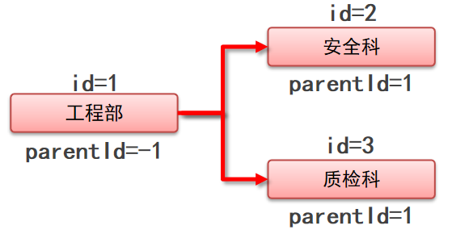

1：在实体中添加自关联的字段，parent

```java
public class Dept {
    private String id;
    private String deptName;
    private String parentId;
    private Integer state;

    private Dept parent;

    public Dept getParent() {
        return parent;
    }

    public void setParent(Dept parent) {
        this.parent = parent;
    }

    //-------其他get/set方法略
}
```

2：修改映射配置，找到`src/main/resources/com/itheima/dao/system/DeptDao.xml`，添加关联映射

```xml
<!--配置实体类属性和数据库表中列的对应关系-->
<resultMap id="BaseResultMap" type="com.itheima.domain.system.Dept">
    <id column="dept_id" jdbcType="VARCHAR" property="id"/>
    <result column="dept_name" jdbcType="VARCHAR" property="deptName"/>
    <result column="parent_id" jdbcType="VARCHAR" property="parentId"/>
    <result column="state" jdbcType="DECIMAL" property="state"/>
    <!--关联关系-->
    <association
                 property="parent"
                 javaType="com.itheima.domain.system.Dept"
                 column="parent_id"
                 select="com.itheima.dao.system.DeptDao.findById"
                 />
</resultMap>
```

3：新建的时候要查询所有部门数据，装载到页面上

找到：DeptServlet中的toAdd方法，添加查询部门信息的代码

```java
private void toAdd(HttpServletRequest request,HttpServletResponse response) throws ServletException, IOException {
    //加载所有的部门信息放入到deptList
    List<Dept> all = deptService.findAll();
    request.setAttribute("deptList",all);
    //跳转页面
    request.getRequestDispatcher("/WEB-INF/pages/system/dept/add.jsp").forward(request,response);
}
```

4：同理找到DeptServlet中的toEdit方法，添加查询部门信息的代码

```java
private void toEdit(HttpServletRequest request, HttpServletResponse response) throws ServletException, IOException {
    //查询要修改的数据findById
    String id = request.getParameter("id");
    //        DeptService deptService = new DeptServiceImpl();
    Dept dept = deptService.findById(id);
    //加载所有的部门信息放入到deptList
    List<Dept> all = deptService.findAll();
    request.setAttribute("deptList",all);
    //将数据加载到指定区域，供页面获取
    request.setAttribute("dept",dept);
    //跳转页面
    request.getRequestDispatcher("/WEB-INF/pages/system/dept/update.jsp").forward(request,response);
}
```


## 5. 用户模块

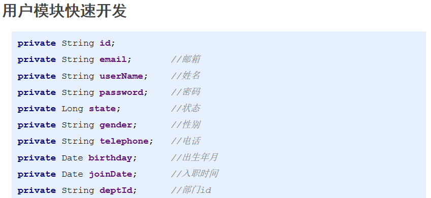

1：创建实体：com.itheima.domain.system.User

```java
public class User {
    private String id;
    private String email;       //邮箱
    private String userName;    //姓名
    private String password;    //密码
    private Long state;         //状态
    private String gender;      //性别
    private String telephone;   //电话
    private Date birthday;      //出生年月
    private Date joinDate;      //入职时间
    private String deptId;      //部门id

    private Dept dept;

    public Dept getDept() {
        return dept;
    }

    @Override
    public String toString() {
        return "User{" +
                "id='" + id + '\'' +
                ", email='" + email + '\'' +
                ", userName='" + userName + '\'' +
                ", password='" + password + '\'' +
                ", state=" + state +
                ", gender='" + gender + '\'' +
                ", telephone='" + telephone + '\'' +
                ", birthday=" + birthday +
                ", joinDate=" + joinDate +
                ", deptId='" + deptId + '\'' +
                ", dept=" + dept +
                '}';
    }

	//---------get/set方法略
}
```

2：创建dao接口：com.itheima.dao.system.UserDao

```java
public interface UserDao {
    int save(User user);

    int delete(User user);

    int update(User user);

    User findById(String id);

    List<User> findAll();
}
```

3：添加映射配置文件，从今日课程中找到：`dao层资源文件\配置文件\UserDao.xml`，拷贝到项目中`src/main/resources/com/itheima/dao/system/`目录下

4：创建业务层接口：com.itheima.service.system.UserService

```java
public interface UserService {
    /**
     * 添加
     * @param user
     * @return
     */
    void save(User user);

    /**
     * 删除
     * @param user
     * @return
     */
    void delete(User user);

    /**
     * 修改
     * @param user
     * @return
     */
    void update(User user);

    /**
     * 查询单个
     * @param id 查询的条件（id）
     * @return 查询的结果，单个对象
     */
    User findById(String id);

    /**
     * 查询全部的数据
     * @return 全部数据的列表对象
     */
    List<User> findAll();

    /**
     * 分页查询数据
     * @param page 页码
     * @param size 每页显示的数据总量
     * @return
     */
    PageInfo findAll(int page, int size);
}
```

5：创建业务层实现类：com.itheima.service.system.impl.UserServiceImpl

```java
public class UserServiceImpl implements UserService {
    @Override
    public void save(User user) {
        SqlSession sqlSession = null;
        try{
            //1.获取SqlSession
            sqlSession = MapperFactory.getSqlSession();
            //2.获取Dao
            UserDao userDao = MapperFactory.getMapper(sqlSession,UserDao.class);
            //id使用UUID的生成策略来获取
            String id = UUID.randomUUID().toString();
            user.setId(id);
            //3.调用Dao层操作
            userDao.save(user);
            //4.提交事务
            TransactionUtil.commit(sqlSession);
        }catch (Exception e){
            TransactionUtil.rollback(sqlSession);
            throw new RuntimeException(e);
            //记录日志
        }finally {
            try {
                TransactionUtil.close(sqlSession);
            }catch (Exception e){
                e.printStackTrace();
            }
        }
    }

    @Override
    public void delete(User user) {
        SqlSession sqlSession = null;
        try{
            //1.获取SqlSession
            sqlSession = MapperFactory.getSqlSession();
            //2.获取Dao
            UserDao userDao = MapperFactory.getMapper(sqlSession,UserDao.class);
            //3.调用Dao层操作
            userDao.delete(user);
            //4.提交事务
            TransactionUtil.commit(sqlSession);
        }catch (Exception e){
            TransactionUtil.rollback(sqlSession);
            throw new RuntimeException(e);
            //记录日志
        }finally {
            try {
                TransactionUtil.close(sqlSession);
            }catch (Exception e){
                e.printStackTrace();
            }
        }
    }

    @Override
    public void update(User user) {
        SqlSession sqlSession = null;
        try{
            //1.获取SqlSession
            sqlSession = MapperFactory.getSqlSession();
            //2.获取Dao
            UserDao userDao = MapperFactory.getMapper(sqlSession,UserDao.class);
            //3.调用Dao层操作
            userDao.update(user);
            //4.提交事务
            TransactionUtil.commit(sqlSession);
        }catch (Exception e){
            TransactionUtil.rollback(sqlSession);
            throw new RuntimeException(e);
            //记录日志
        }finally {
            try {
                TransactionUtil.close(sqlSession);
            }catch (Exception e){
                e.printStackTrace();
            }
        }
    }

    @Override
    public User findById(String id) {
        SqlSession sqlSession = null;
        try{
            //1.获取SqlSession
            sqlSession = MapperFactory.getSqlSession();
            //2.获取Dao
            UserDao userDao = MapperFactory.getMapper(sqlSession,UserDao.class);
            //3.调用Dao层操作
            return userDao.findById(id);
        }catch (Exception e){
            throw new RuntimeException(e);
            //记录日志
        }finally {
            try {
                TransactionUtil.close(sqlSession);
            }catch (Exception e){
                e.printStackTrace();
            }
        }
    }

    @Override
    public List<User> findAll() {
        SqlSession sqlSession = null;
        try{
            //1.获取SqlSession
            sqlSession = MapperFactory.getSqlSession();
            //2.获取Dao
            UserDao userDao = MapperFactory.getMapper(sqlSession,UserDao.class);
            //3.调用Dao层操作
            return userDao.findAll();
        }catch (Exception e){
            throw new RuntimeException(e);
            //记录日志
        }finally {
            try {
                TransactionUtil.close(sqlSession);
            }catch (Exception e){
                e.printStackTrace();
            }
        }
    }

    @Override
    public PageInfo findAll(int page, int size) {
        SqlSession sqlSession = null;
        try{
            //1.获取SqlSession
            sqlSession = MapperFactory.getSqlSession();
            //2.获取Dao
            UserDao userDao = MapperFactory.getMapper(sqlSession,UserDao.class);
            //3.调用Dao层操作
            PageHelper.startPage(page,size);
            List<User> all = userDao.findAll();
            PageInfo pageInfo = new PageInfo(all);
            return pageInfo;
        }catch (Exception e){
            throw new RuntimeException(e);
            //记录日志
        }finally {
            try {
                TransactionUtil.close(sqlSession);
            }catch (Exception e){
                e.printStackTrace();
            }
        }
    }
}
```

6：创建servlet：com.itheima.web.controller.system.UserServlet

```java
// uri:/system/user?operation=list
@WebServlet("/system/user")
public class UserServlet extends BaseServlet {

    @Override
    protected void doGet(HttpServletRequest request, HttpServletResponse response) throws ServletException, IOException {
        String operation = request.getParameter("operation");
        if("list".equals(operation)){
            this.list(request,response);
        }else if("toAdd".equals(operation)){
            this.toAdd(request,response);
        }else if("save".equals(operation)){
            this.save(request, response);
        }else if("toEdit".equals(operation)){
            this.toEdit(request,response);
        }else if("edit".equals(operation)){
            this.edit(request,response);
        }else if("delete".equals(operation)){
            this.delete(request,response);
        }
    }

    private void list(HttpServletRequest request,HttpServletResponse response) throws ServletException, IOException {
        //进入列表页
        //获取数据
//        UserService userService = new UserServiceImpl();
        int page = 1;
        int size = 5;
        if(StringUtils.isNotBlank(request.getParameter("page"))){
            page = Integer.parseInt(request.getParameter("page"));
        }
        if(StringUtils.isNotBlank(request.getParameter("size"))){
            size = Integer.parseInt(request.getParameter("size"));
        }
        PageInfo all = userService.findAll(page, size);
        //将数据保存到指定的位置
        request.setAttribute("page",all);
        //跳转页面
        request.getRequestDispatcher("/WEB-INF/pages/system/user/list.jsp").forward(request,response);
    }

    private void toAdd(HttpServletRequest request,HttpServletResponse response) throws ServletException, IOException {
        //跳转页面
        request.getRequestDispatcher("/WEB-INF/pages/system/user/add.jsp").forward(request,response);
    }

    private void save(HttpServletRequest request,HttpServletResponse response) throws ServletException, IOException {
        //将数据获取到，封装成一个对象
        User user = BeanUtil.fillBean(request,User.class,"yyyy-MM-dd");
        //调用业务层接口save
        userService.save(user);
        //跳转回到页面list
        response.sendRedirect(request.getContextPath()+"/system/user?operation=list");
    }

    private void toEdit(HttpServletRequest request, HttpServletResponse response) throws ServletException, IOException {
        //查询要修改的数据findById
        String id = request.getParameter("id");
        User user = userService.findById(id);
        //将数据加载到指定区域，供页面获取
        request.setAttribute("user",user);
        //查询部门信息
        List<Dept> all = deptService.findAll();
        //放入指定位置
        request.setAttribute("deptList",all);
        //跳转页面
        request.getRequestDispatcher("/WEB-INF/pages/system/user/update.jsp").forward(request,response);
    }

    private void edit(HttpServletRequest request, HttpServletResponse response) throws IOException {
        //将数据获取到，封装成一个对象
        User user = BeanUtil.fillBean(request,User.class,"yyyy-MM-dd");
        //调用业务层接口save
        userService.update(user);
        //跳转回到页面list
        response.sendRedirect(request.getContextPath()+"/system/user?operation=list");
    }

    private void delete(HttpServletRequest request, HttpServletResponse response) throws IOException {
        //将数据获取到，封装成一个对象
        User user = BeanUtil.fillBean(request,User.class);
        //调用业务层接口save
        userService.delete(user);
        //跳转回到页面list
        response.sendRedirect(request.getContextPath()+"/system/user?operation=list");
    }

    @Override
    protected void doPost(HttpServletRequest request, HttpServletResponse response) throws ServletException, IOException {
        this.doGet(request,response);
    }
}
```

7：修改BaseServlet

```java
public class BaseServlet extends HttpServlet {
    protected CompanyService companyService;
    protected DeptService deptService;
    protected UserService userService;

    @Override
    public void init() throws ServletException {
        companyService = new CompanyServiceImpl();
        deptService = new DeptServiceImpl();
        userService = new UserServiceImpl();
    }
}
```

8：创建`WEB-INF/pages/user`，然后从今日课程资料中找到`模块页面\user`下的所有页面，拷贝到该目录

注意：在此处希望大家是自行的拷贝之前dept的页面然后自己修改

9：新建功能时，去新建页面时需要查询部门信息，修改toAdd方法

```java
private void toAdd(HttpServletRequest request,HttpServletResponse response) throws ServletException, IOException {
    //查询部门信息
    List<Dept> all = deptService.findAll();
    //放入指定位置
    request.setAttribute("deptList",all);
    //跳转页面
    request.getRequestDispatcher("/WEB-INF/pages/system/user/add.jsp").forward(request,response);
}
```

10：新建用户时，用户的密码需要加密

从今日课程资料中找到：`service层资源文件/MD5Util.java`拷贝到项目utils包下

11：修改业务层代码，找到：save方法，给密码加密完成后再存入数据库

```java
@Override
public void save(User user) {
    SqlSession sqlSession = null;
    try{
        //1.获取SqlSession
        sqlSession = MapperFactory.getSqlSession();
        //2.获取Dao
        UserDao userDao = MapperFactory.getMapper(sqlSession,UserDao.class);
        //id使用UUID的生成策略来获取
        String id = UUID.randomUUID().toString();
        user.setId(id);
        //密码必须经过加密处理MD5加密
        user.setPassword(MD5Util.md5(user.getPassword()));
        //3.调用Dao层操作
        userDao.save(user);
        //4.提交事务
        TransactionUtil.commit(sqlSession);
    }catch (Exception e){
        TransactionUtil.rollback(sqlSession);
        throw new RuntimeException(e);
        //记录日志
    }finally {
        try {
            TransactionUtil.close(sqlSession);
        }catch (Exception e){
            e.printStackTrace();
        }
    }
}
```

12：修改时，在去修改页面是，需要加载部门信息，找到UseServlet的toEdit方法，

```java
private void toEdit(HttpServletRequest request, HttpServletResponse response) throws ServletException, IOException {
    //查询要修改的数据findById
    String id = request.getParameter("id");
    User user = userService.findById(id);
    //将数据加载到指定区域，供页面获取
    request.setAttribute("user",user);
    //查询部门信息
    List<Dept> all = deptService.findAll();
    //放入指定位置
    request.setAttribute("deptList",all);
    //跳转页面
    request.getRequestDispatcher("/WEB-INF/pages/system/user/update.jsp").forward(request,response);
}
```

13：真正在修改时，我们需要在业务层做一些处理，找到用户的业务层实现类，修改update方法

```java
@Override
public void update(User user) {
    SqlSession sqlSession = null;
    try{
        //1.获取SqlSession
        sqlSession = MapperFactory.getSqlSession();
        //2.获取Dao
        UserDao userDao = MapperFactory.getMapper(sqlSession,UserDao.class);

        //方案1：读取现有库中的信息，覆盖现有的数据
        //方案2：修改update语句
        System.out.println(user);
        //3.调用Dao层操作
        userDao.update(user);
        //4.提交事务
        TransactionUtil.commit(sqlSession);
    }catch (Exception e){
        TransactionUtil.rollback(sqlSession);
        throw new RuntimeException(e);
        //记录日志
    }finally {
        try {
            TransactionUtil.close(sqlSession);
        }catch (Exception e){
            e.printStackTrace();
        }
    }
}
```

我们采用方案二：找到用户对应的xml配置文件：`UserDao.XML`，找到update标签，做出修改

```xml
<!--配置全字段更新，当提供的数据为null时，数据库数据会被更新为null-->
<update id="update" parameterType="com.itheima.domain.system.User">
    update ss_user
    set user_name = #{userName,jdbcType=VARCHAR},
    state = #{state,jdbcType=DECIMAL},
    gender = #{gender,jdbcType=CHAR},
    telephone = #{telephone,jdbcType=VARCHAR},
    dept_id = #{deptId,jdbcType=VARCHAR}
    where user_id = #{id,jdbcType=VARCHAR}
</update>
```

