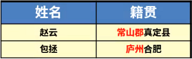
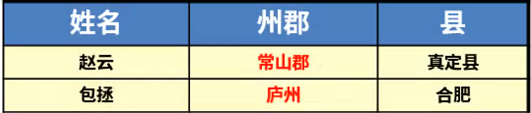
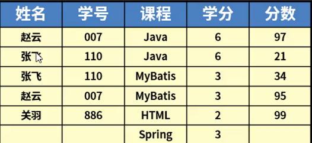
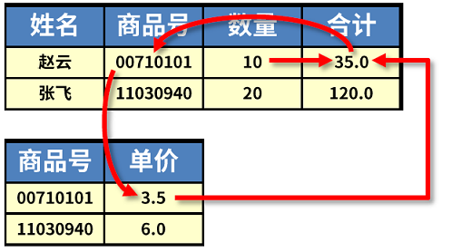
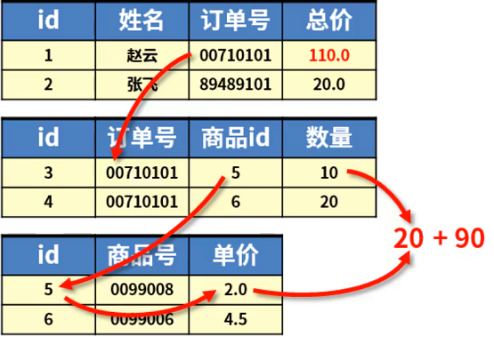
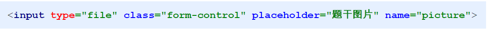
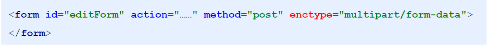

# web综合案例

## 学习目标

目标1：能够说出数据库设计的三种常用范式

目标2：能够使用PD工具进行表结构设计

目标3：完成学科模块的业务开发

目标4：完成目录模块的业务开发

目标5：完成题目模块的业务开发

目标6：能够说出文件上传前台的三要素

目标7：能够完成题目选项模块的业务开发

## 1. 数据库设计

### 1.1 数据库设计范式

**什么叫数据库设计范式？**

**范式：规范的形式，应用于各个行业的标准化**

数据库设计中有5种范式，但是常用的分别是：第一范式（1NF）,第二范式（2NF），第三范式（3NF）

**第一范式（1NF）**：针对数据表中的列，列要具备原子性，不可再拆分



如果数据表这样设计，籍贯这一列不具备原子性，因为数据可再次拆分，不拆分的话无法获取用户的州郡信息或县市信息，拆分之后如下：



**第二范式（2NF）**：数据表要具备唯一主键，不存在多主键，使得每一行数据具有唯一性



在如图所示的表中：没有哪一个字段（列）能唯一确定一条数据，要想唯一确定一条数据，需要两个或更多的字段，这就违反了第二范式，数据表不具备唯一主键而存在多主键。

那如何来解决呢？在表中加一个唯一主键列：id

**第三范式（3NF）**：不依赖非主键的字段及更深层次的依赖，使得每个字段都独立依赖于主键字段（独立性）

 >什么叫依赖：依赖，就是在一个表中，其中某个字段的值B可以由另一个字段值A来决定，那我们称字段B依赖字段A或字段A决定字段B



在如图所示的表结构中：合计列=单价 X 数量，当然这中间还需要依赖商品编号来查询商品单价

总而言之，合计这一列，依赖了表中的非主键字段，以及非主键字段的更深层次的依赖，这表明合计这一列的数据是冗余的，因为我们完全可以通过计算的方式得到合计数据，而不需要在表中来存储。


**反三范式**：允许少量的数据冗余，提高查询的速度



### 1.2 数据库设计工具

PowerDesigner：简称PD，是一款功能强大的建模软件，提供强大的元数据管理功能，可以帮助用户构建关键信息的全方位视图，创建多种类型的模型，包括概念数据模型，物理数据模型，面向对象模型等等，同时集成了数据管理，BI，数据集成和数据整合多种功能。

## 2. 学科模块快速开发

下面我们进行学科模块的快速开发：

（1）创建学科实体：com.itheima.domain.store.Course

```java
public class Course {
    private String id;
    private String name;
    private String remark;
    private String state;
    private Date createTime;

    // getter/setter略
}
```

（2）创建dao接口：com.itheima.dao.store.CourseDao

```java
public interface CourseDao {
    int save(Course course);

    int delete(Course course);

    int update(Course course);

    Course findById(String id);

    List<Course> findAll();
}
```

（3）从今日课程资料中找到`dao层资源文件\CourseDao.xml`，拷贝到项目`src/main/resources/com/itheima/dao/store/`下

当然这个地方可以将该目录下的所有映射配置文件都拷贝到该目录下，在做后续业务时就无需在拷贝了。

（4）创建业务层接口：com.itheima.service.store.CourseService

```java
public interface CourseService {
    /**
     * 添加
     * @param course
     * @return
     */
    void save(Course course);

    /**
     * 删除
     * @param course
     * @return
     */
    void delete(Course course);

    /**
     * 修改
     * @param course
     * @return
     */
    void update(Course course);

    /**
     * 查询单个
     * @param id 查询的条件（id）
     * @return 查询的结果，单个对象
     */
    Course findById(String id);

    /**
     * 查询全部的数据
     * @return 全部数据的列表对象
     */
    List<Course> findAll();

    /**
     * 分页查询数据
     * @param page 页码
     * @param size 每页显示的数据总量
     * @return
     */
    PageInfo findAll(int page, int size);
}
```

（5）创建业务层实现类：com.itheima.service.store.impl.CourseServiceImpl

```java
public class CourseServiceImpl implements CourseService {
    @Override
    public void save(Course course) {
        SqlSession sqlSession = null;
        try{
            //1.获取SqlSession
            sqlSession = MapperFactory.getSqlSession();
            //2.获取Dao
            CourseDao courseDao = MapperFactory.getMapper(sqlSession,CourseDao.class);
            //id使用UUID的生成策略来获取
            String id = UUID.randomUUID().toString();
            course.setId(id);
            //3.调用Dao层操作
            courseDao.save(course);
            //4.提交事务
            TransactionUtil.commit(sqlSession);
        }catch (Exception e){
            TransactionUtil.rollback(sqlSession);
            throw new RuntimeException(e);
            //记录日志
        }finally {
            try {
                TransactionUtil.close(sqlSession);
            }catch (Exception e){
                e.printStackTrace();
            }
        }
    }

    @Override
    public void delete(Course course) {
        SqlSession sqlSession = null;
        try{
            //1.获取SqlSession
            sqlSession = MapperFactory.getSqlSession();
            //2.获取Dao
            CourseDao courseDao = MapperFactory.getMapper(sqlSession,CourseDao.class);
            //3.调用Dao层操作
            courseDao.delete(course);
            //4.提交事务
            TransactionUtil.commit(sqlSession);
        }catch (Exception e){
            TransactionUtil.rollback(sqlSession);
            throw new RuntimeException(e);
            //记录日志
        }finally {
            try {
                TransactionUtil.close(sqlSession);
            }catch (Exception e){
                e.printStackTrace();
            }
        }
    }

    @Override
    public void update(Course course) {
        SqlSession sqlSession = null;
        try{
            //1.获取SqlSession
            sqlSession = MapperFactory.getSqlSession();
            //2.获取Dao
            CourseDao courseDao = MapperFactory.getMapper(sqlSession,CourseDao.class);
            //3.调用Dao层操作
            courseDao.update(course);
            //4.提交事务
            TransactionUtil.commit(sqlSession);
        }catch (Exception e){
            TransactionUtil.rollback(sqlSession);
            throw new RuntimeException(e);
            //记录日志
        }finally {
            try {
                TransactionUtil.close(sqlSession);
            }catch (Exception e){
                e.printStackTrace();
            }
        }
    }

    @Override
    public Course findById(String id) {
        SqlSession sqlSession = null;
        try{
            //1.获取SqlSession
            sqlSession = MapperFactory.getSqlSession();
            //2.获取Dao
            CourseDao courseDao = MapperFactory.getMapper(sqlSession,CourseDao.class);
            //3.调用Dao层操作
            return courseDao.findById(id);
        }catch (Exception e){
            throw new RuntimeException(e);
            //记录日志
        }finally {
            try {
                TransactionUtil.close(sqlSession);
            }catch (Exception e){
                e.printStackTrace();
            }
        }
    }

    @Override
    public List<Course> findAll() {
        SqlSession sqlSession = null;
        try{
            //1.获取SqlSession
            sqlSession = MapperFactory.getSqlSession();
            //2.获取Dao
            CourseDao courseDao = MapperFactory.getMapper(sqlSession,CourseDao.class);
            //3.调用Dao层操作
            return courseDao.findAll();
        }catch (Exception e){
            throw new RuntimeException(e);
            //记录日志
        }finally {
            try {
                TransactionUtil.close(sqlSession);
            }catch (Exception e){
                e.printStackTrace();
            }
        }
    }

    @Override
    public PageInfo findAll(int page, int size) {
        SqlSession sqlSession = null;
        try{
            //1.获取SqlSession
            sqlSession = MapperFactory.getSqlSession();
            //2.获取Dao
            CourseDao courseDao = MapperFactory.getMapper(sqlSession,CourseDao.class);
            //3.调用Dao层操作
            PageHelper.startPage(page,size);
            List<Course> all = courseDao.findAll();
            PageInfo pageInfo = new PageInfo(all);
            return pageInfo;
        }catch (Exception e){
            throw new RuntimeException(e);
            //记录日志
        }finally {
            try {
                TransactionUtil.close(sqlSession);
            }catch (Exception e){
                e.printStackTrace();
            }
        }
    }
}
```

（6）创建servlet：com.itheima.web.controller.store.CourseServlet

```java
// uri:/store/course?operation=list
@WebServlet("/store/course")
public class CourseServlet extends BaseServlet {

    @Override
    protected void doGet(HttpServletRequest request, HttpServletResponse response) throws ServletException, IOException {
        String operation = request.getParameter("operation");
        if("list".equals(operation)){
            this.list(request,response);
        }else if("toAdd".equals(operation)){
            this.toAdd(request,response);
        }else if("save".equals(operation)){
            this.save(request, response);
        }else if("toEdit".equals(operation)){
            this.toEdit(request,response);
        }else if("edit".equals(operation)){
            this.edit(request,response);
        }else if("delete".equals(operation)){
            this.delete(request,response);
        }
    }

    private void list(HttpServletRequest request,HttpServletResponse response) throws ServletException, IOException {
        //进入列表页
        //获取数据
        int page = 1;
        int size = 5;
        if(StringUtils.isNotBlank(request.getParameter("page"))){
            page = Integer.parseInt(request.getParameter("page"));
        }
        if(StringUtils.isNotBlank(request.getParameter("size"))){
            size = Integer.parseInt(request.getParameter("size"));
        }
        PageInfo all = courseService.findAll(page, size);
        //将数据保存到指定的位置
        request.setAttribute("page",all);
        //跳转页面
        request.getRequestDispatcher("/WEB-INF/pages/store/course/list.jsp").forward(request,response);
    }

    private void toAdd(HttpServletRequest request,HttpServletResponse response) throws ServletException, IOException {
        //跳转页面
        request.getRequestDispatcher("/WEB-INF/pages/store/course/add.jsp").forward(request,response);
    }

    private void save(HttpServletRequest request,HttpServletResponse response) throws ServletException, IOException {
        //将数据获取到，封装成一个对象
        Course course = BeanUtil.fillBean(request,Course.class,"yyyy-MM-dd");
        //调用业务层接口save
        courseService.save(course);
        //跳转回到页面list
        response.sendRedirect(request.getContextPath()+"/store/course?operation=list");
    }

    private void toEdit(HttpServletRequest request, HttpServletResponse response) throws ServletException, IOException {
        //查询要修改的数据findById
        String id = request.getParameter("id");
        Course course = courseService.findById(id);
        //将数据加载到指定区域，供页面获取
        request.setAttribute("course",course);
        //跳转页面
        request.getRequestDispatcher("/WEB-INF/pages/store/course/update.jsp").forward(request,response);
    }

    private void edit(HttpServletRequest request, HttpServletResponse response) throws IOException {
        //将数据获取到，封装成一个对象
        Course course = BeanUtil.fillBean(request,Course.class,"yyyy-MM-dd");
        //调用业务层接口save
        courseService.update(course);
        //跳转回到页面list
        response.sendRedirect(request.getContextPath()+"/store/course?operation=list");
    }

    private void delete(HttpServletRequest request, HttpServletResponse response) throws IOException {
        //将数据获取到，封装成一个对象
        Course course = BeanUtil.fillBean(request,Course.class);
        //调用业务层接口save
        courseService.delete(course);
        //跳转回到页面list
        response.sendRedirect(request.getContextPath()+"/store/course?operation=list");
    }

    @Override
    protected void doPost(HttpServletRequest request, HttpServletResponse response) throws ServletException, IOException {
        this.doGet(request,response);
    }
}
```

（7）修改BaseServlet，添加`CourseService`

```java
public class BaseServlet extends HttpServlet {
    protected CompanyService companyService;
    protected DeptService deptService;
    protected UserService userService;
    protected CourseService courseService;

    @Override
    public void init() throws ServletException {
        companyService = new CompanyServiceImpl();
        deptService = new DeptServiceImpl();
        userService = new UserServiceImpl();
        courseService = new CourseServiceImpl();
    }
}
```

（8）创建`/WEB-INF/pages/store/course`目录，然后从今日课程资料中找到`模块页面\course`下的所有页面，拷贝到刚刚创建的目录下

（9）修改业务层的保存方法，添加创建时间的保存

```java
@Override
public void save(Course course) {
    SqlSession sqlSession = null;
    try{
        //1.获取SqlSession
        sqlSession = MapperFactory.getSqlSession();
        //2.获取Dao
        CourseDao courseDao = MapperFactory.getMapper(sqlSession,CourseDao.class);
        //id使用UUID的生成策略来获取
        String id = UUID.randomUUID().toString();
        course.setId(id);

        //添加创建的时间
        course.setCreateTime(new Date());

        //3.调用Dao层操作
        courseDao.save(course);
        //4.提交事务
        TransactionUtil.commit(sqlSession);
    }catch (Exception e){
        TransactionUtil.rollback(sqlSession);
        throw new RuntimeException(e);
        //记录日志
    }finally {
        try {
            TransactionUtil.close(sqlSession);
        }catch (Exception e){
            e.printStackTrace();
        }
    }
}
```

（10）在修改时，我们的创建时间是不允许修改的，因此我们在dao层进行update操作是去掉对创建时间的修改，找到`CourseDao`对应的持久层映射配置文件`CourseDao.xml`中的`update`，去掉创建时间即可

```xml
<!--配置全字段更新，当提供的数据为null时，数据库数据会被更新为null-->
<update id="update" parameterType="com.itheima.domain.store.Course">
    update st_course
    set name = #{name,jdbcType=VARCHAR},
    remark = #{remark,jdbcType=VARCHAR},
    state = #{state,jdbcType=VARCHAR}
    where id = #{id,jdbcType=VARCHAR}
</update>
```

（11）解决站点字符编码的问题，从今日课程资料中找到`web层资源文件\CharacterEncodingFilter.java`

然后创建一个包`com.itheima.web.filters`，然后把该文件拷贝到该包下

（12）启动项目进行测试

## 3. 目录模块

（1）创建目录实体：com.itheima.domain.store.Catalog

```java
public class Catalog {    private String id;    private String name;    private String remark;    private String state;    private Date createTime;    private String courseId;    private Course course;	// getter/setter略}
```

（2）创建dao接口：com.itheima.dao.store.CatalogDao

```java
public interface CatalogDao {    int save(Catalog catalog);    int delete(Catalog catalog);    int update(Catalog catalog);    Catalog findById(String id);    List<Catalog> findAll();}
```

（3）拷贝dao映射配置文件：前面已完成

（4）创建业务层接口：com.itheima.service.store.CatalogService

```java
public interface CatalogService {    /**     * 添加     * @param catalog     * @return     */    void save(Catalog catalog);    /**     * 删除     * @param catalog     * @return     */    void delete(Catalog catalog);    /**     * 修改     * @param catalog     * @return     */    void update(Catalog catalog);    /**     * 查询单个     * @param id 查询的条件（id）     * @return 查询的结果，单个对象     */    Catalog findById(String id);    /**     * 查询全部的数据     * @return 全部数据的列表对象     */    List<Catalog> findAll();    /**     * 分页查询数据     * @param page 页码     * @param size 每页显示的数据总量     * @return     */    PageInfo findAll(int page, int size);}
```

（5）创建业务层实现类：com.itheima.service.store.impl.CatalogServiceImpl

```java
public class CatalogServiceImpl implements CatalogService {    @Override    public void save(Catalog catalog) {        SqlSession sqlSession = null;        try {            //1.获取SqlSession            sqlSession = MapperFactory.getSqlSession();            //2.获取Dao            CatalogDao catalogDao = MapperFactory.getMapper(sqlSession, CatalogDao.class);            //id使用UUID的生成策略来获取            String id = UUID.randomUUID().toString();            catalog.setId(id);            //3.调用Dao层操作            catalogDao.save(catalog);            //4.提交事务            TransactionUtil.commit(sqlSession);        } catch (Exception e) {            TransactionUtil.rollback(sqlSession);            throw new RuntimeException(e);            //记录日志        } finally {            try {                TransactionUtil.close(sqlSession);            } catch (Exception e) {                e.printStackTrace();            }        }    }    @Override    public void delete(Catalog catalog) {        SqlSession sqlSession = null;        try {            //1.获取SqlSession            sqlSession = MapperFactory.getSqlSession();            //2.获取Dao            CatalogDao catalogDao = MapperFactory.getMapper(sqlSession, CatalogDao.class);            //3.调用Dao层操作            catalogDao.delete(catalog);            //4.提交事务            TransactionUtil.commit(sqlSession);        } catch (Exception e) {            TransactionUtil.rollback(sqlSession);            throw new RuntimeException(e);            //记录日志        } finally {            try {                TransactionUtil.close(sqlSession);            } catch (Exception e) {                e.printStackTrace();            }        }    }    @Override    public void update(Catalog catalog) {        SqlSession sqlSession = null;        try {            //1.获取SqlSession            sqlSession = MapperFactory.getSqlSession();            //2.获取Dao            CatalogDao catalogDao = MapperFactory.getMapper(sqlSession, CatalogDao.class);            //3.调用Dao层操作            catalogDao.update(catalog);            //4.提交事务            TransactionUtil.commit(sqlSession);        } catch (Exception e) {            TransactionUtil.rollback(sqlSession);            throw new RuntimeException(e);            //记录日志        } finally {            try {                TransactionUtil.close(sqlSession);            } catch (Exception e) {                e.printStackTrace();            }        }    }    @Override    public Catalog findById(String id) {        SqlSession sqlSession = null;        try {            //1.获取SqlSession            sqlSession = MapperFactory.getSqlSession();            //2.获取Dao            CatalogDao catalogDao = MapperFactory.getMapper(sqlSession, CatalogDao.class);            //3.调用Dao层操作            return catalogDao.findById(id);        } catch (Exception e) {            throw new RuntimeException(e);            //记录日志        } finally {            try {                TransactionUtil.close(sqlSession);            } catch (Exception e) {                e.printStackTrace();            }        }    }    @Override    public List<Catalog> findAll() {        SqlSession sqlSession = null;        try {            //1.获取SqlSession            sqlSession = MapperFactory.getSqlSession();            //2.获取Dao            CatalogDao catalogDao = MapperFactory.getMapper(sqlSession, CatalogDao.class);            //3.调用Dao层操作            return catalogDao.findAll();        } catch (Exception e) {            throw new RuntimeException(e);            //记录日志        } finally {            try {                TransactionUtil.close(sqlSession);            } catch (Exception e) {                e.printStackTrace();            }        }    }    @Override    public PageInfo findAll(int page, int size) {        SqlSession sqlSession = null;        try {            //1.获取SqlSession            sqlSession = MapperFactory.getSqlSession();            //2.获取Dao            CatalogDao catalogDao = MapperFactory.getMapper(sqlSession, CatalogDao.class);            //3.调用Dao层操作            PageHelper.startPage(page, size);            List<Catalog> all = catalogDao.findAll();            PageInfo pageInfo = new PageInfo(all);            return pageInfo;        } catch (Exception e) {            throw new RuntimeException(e);            //记录日志        } finally {            try {                TransactionUtil.close(sqlSession);            } catch (Exception e) {                e.printStackTrace();            }        }    }}
```

（6）创建servlet：com.itheima.web.controller.store.CatalogServlet

```java
// uri:/store/catalog?operation=list@WebServlet("/store/catalog")public class CatalogServlet extends BaseServlet {    @Override    protected void doGet(HttpServletRequest request, HttpServletResponse response) throws ServletException, IOException {        String operation = request.getParameter("operation");        if("list".equals(operation)){            this.list(request,response);        }else if("toAdd".equals(operation)){            this.toAdd(request,response);        }else if("save".equals(operation)){            this.save(request, response);        }else if("toEdit".equals(operation)){            this.toEdit(request,response);        }else if("edit".equals(operation)){            this.edit(request,response);        }else if("delete".equals(operation)){            this.delete(request,response);        }    }    private void list(HttpServletRequest request,HttpServletResponse response) throws ServletException, IOException {        //进入列表页        //获取数据        int page = 1;        int size = 5;        if(StringUtils.isNotBlank(request.getParameter("page"))){            page = Integer.parseInt(request.getParameter("page"));        }        if(StringUtils.isNotBlank(request.getParameter("size"))){            size = Integer.parseInt(request.getParameter("size"));        }        PageInfo all = catalogService.findAll(page, size);        //将数据保存到指定的位置        request.setAttribute("page",all);        //跳转页面        request.getRequestDispatcher("/WEB-INF/pages/store/catalog/list.jsp").forward(request,response);    }    private void toAdd(HttpServletRequest request,HttpServletResponse response) throws ServletException, IOException {        //跳转页面        request.getRequestDispatcher("/WEB-INF/pages/store/catalog/add.jsp").forward(request,response);    }    private void save(HttpServletRequest request,HttpServletResponse response) throws ServletException, IOException {        //将数据获取到，封装成一个对象        Catalog catalog = BeanUtil.fillBean(request,Catalog.class,"yyyy-MM-dd");        //调用业务层接口save        catalogService.save(catalog);        //跳转回到页面list        response.sendRedirect(request.getContextPath()+"/store/catalog?operation=list");    }    private void toEdit(HttpServletRequest request, HttpServletResponse response) throws ServletException, IOException {        //查询要修改的数据findById        String id = request.getParameter("id");        Catalog catalog = catalogService.findById(id);        //将数据加载到指定区域，供页面获取        request.setAttribute("catalog",catalog);        //跳转页面        request.getRequestDispatcher("/WEB-INF/pages/store/catalog/update.jsp").forward(request,response);    }    private void edit(HttpServletRequest request, HttpServletResponse response) throws IOException {        //将数据获取到，封装成一个对象        Catalog catalog = BeanUtil.fillBean(request,Catalog.class,"yyyy-MM-dd");        //调用业务层接口save        catalogService.update(catalog);        //跳转回到页面list        response.sendRedirect(request.getContextPath()+"/store/catalog?operation=list");    }    private void delete(HttpServletRequest request, HttpServletResponse response) throws IOException {        //将数据获取到，封装成一个对象        Catalog catalog = BeanUtil.fillBean(request,Catalog.class);        //调用业务层接口save        catalogService.delete(catalog);        //跳转回到页面list        response.sendRedirect(request.getContextPath()+"/store/catalog?operation=list");    }    @Override    protected void doPost(HttpServletRequest request, HttpServletResponse response) throws ServletException, IOException {        this.doGet(request,response);    }}
```

（7）修改BaseServlet，添加`CatalogService`

```java
public class BaseServlet extends HttpServlet {    protected CompanyService companyService;    protected DeptService deptService;    protected UserService userService;    protected CourseService courseService;    protected CatalogService catalogService;    @Override    public void init() throws ServletException {        companyService = new CompanyServiceImpl();        deptService = new DeptServiceImpl();        userService = new UserServiceImpl();        courseService = new CourseServiceImpl();        catalogService = new CatalogServiceImpl();    }}
```

（8）创建页面存放目录`/WEB-INF/pages/store/catalog`，然后从今日课程资料中找到`模块页面\catalog`下的所有页面到该目录

（9）修改servlet代码，找到`toAdd`方法，在去添加页面之前查询所有的学科数据

```java
private void toAdd(HttpServletRequest request,HttpServletResponse response) throws ServletException, IOException {    //加载学科信息    List<Course> all = courseService.findAll();    request.setAttribute("courseList",all);    //跳转页面    request.getRequestDispatcher("/WEB-INF/pages/store/catalog/add.jsp").forward(request,response);}
```

（10）保存目录的时候要保存创建时间，修改业务层的save方法，添加对创建时间的保存

```java
@Overridepublic void save(Catalog catalog) {    SqlSession sqlSession = null;    try {        //1.获取SqlSession        sqlSession = MapperFactory.getSqlSession();        //2.获取Dao        CatalogDao catalogDao = MapperFactory.getMapper(sqlSession, CatalogDao.class);        //id使用UUID的生成策略来获取        String id = UUID.randomUUID().toString();        catalog.setId(id);        catalog.setCreateTime(new Date());        //3.调用Dao层操作        catalogDao.save(catalog);        //4.提交事务        TransactionUtil.commit(sqlSession);    } catch (Exception e) {        TransactionUtil.rollback(sqlSession);        throw new RuntimeException(e);        //记录日志    } finally {        try {            TransactionUtil.close(sqlSession);        } catch (Exception e) {            e.printStackTrace();        }    }}
```

（11）修改servlet代码，找到`toEdit`方法，去到编辑页面之前查询所有的学科信息，

```java
private void toEdit(HttpServletRequest request, HttpServletResponse response) throws ServletException, IOException {    //查询要修改的数据findById    String id = request.getParameter("id");    Catalog catalog = catalogService.findById(id);    //将数据加载到指定区域，供页面获取    request.setAttribute("catalog",catalog);    //加载学科信息    List<Course> all = courseService.findAll();    request.setAttribute("courseList",all);    //跳转页面    request.getRequestDispatcher("/WEB-INF/pages/store/catalog/update.jsp").forward(request,response);}
```

（12）启动项目，进行测试

## 4. 题目模块

### 4.1 题目模块快速开发

（1）创建题目实体：com.itheima.domain.store.Question

```java
public class Question {    private String id;			//题目ID    private String companyId;	//所属企业    private String catalogId;	//题目所属目录ID    private String remark;		//题目简介    private String subject;     //题干    private String analysis;	//题目分析    private String type;       	//题目类型  1:单选，2：多选，3：简答    private String difficulty; 	//难易程度： 1极易 2容易 3普通  4困难  5极难    private String isClassic; 	//是否经典面试题 0：否 1：是    private String state;   	//题目状态  0：不可用  1：可用（只有审核通过的题目才可以设置）    private String reviewStatus;//审核状态  -1 审核不通过  0 审核中   1 审核通过    private Date createTime;        private Company company;    private Catalog catalog;    	// getter/setter 略}
```

（2）创建dao接口：com.itheima.dao.store.QuestionDao

```java
public interface QuestionDao {    int save(Question question);    int delete(Question question);    int update(Question question);    Question findById(String id);    List<Question> findAll();}
```

（3）添加题目dao的映射配置文件，之前已操作，略

（4）创建业务层接口：com.itheima.service.store.QuestionService

```java
public interface QuestionService {    /**     * 添加     * @param question     * @return     */    void save(Question question);    /**     * 删除     * @param question     * @return     */    void delete(Question question);    /**     * 修改     * @param question     * @return     */    void update(Question question);    /**     * 查询单个     * @param id 查询的条件（id）     * @return 查询的结果，单个对象     */    Question findById(String id);    /**     * 查询全部的数据     * @return 全部数据的列表对象     */    List<Question> findAll();    /**     * 分页查询数据     * @param page 页码     * @param size 每页显示的数据总量     * @return     */    PageInfo findAll(int page, int size);}
```

（5）创建业务层实现类：com.itheima.service.store.impl.QuestionServiceImpl

```java
public class QuestionServiceImpl implements QuestionService {    @Override    public void save(Question question) {        SqlSession sqlSession = null;        try{            //1.获取SqlSession            sqlSession = MapperFactory.getSqlSession();            //2.获取Dao            QuestionDao questionDao = MapperFactory.getMapper(sqlSession,QuestionDao.class);            //id使用UUID的生成策略来获取            String id = UUID.randomUUID().toString();            question.setId(id);            //3.调用Dao层操作            questionDao.save(question);            //4.提交事务            TransactionUtil.commit(sqlSession);        }catch (Exception e){            TransactionUtil.rollback(sqlSession);            throw new RuntimeException(e);            //记录日志        }finally {            try {                TransactionUtil.close(sqlSession);            }catch (Exception e){                e.printStackTrace();            }        }    }    @Override    public void delete(Question question) {        SqlSession sqlSession = null;        try{            //1.获取SqlSession            sqlSession = MapperFactory.getSqlSession();            //2.获取Dao            QuestionDao questionDao = MapperFactory.getMapper(sqlSession,QuestionDao.class);            //3.调用Dao层操作            questionDao.delete(question);            //4.提交事务            TransactionUtil.commit(sqlSession);        }catch (Exception e){            TransactionUtil.rollback(sqlSession);            throw new RuntimeException(e);            //记录日志        }finally {            try {                TransactionUtil.close(sqlSession);            }catch (Exception e){                e.printStackTrace();            }        }    }    @Override    public void update(Question question) {        SqlSession sqlSession = null;        try{            //1.获取SqlSession            sqlSession = MapperFactory.getSqlSession();            //2.获取Dao            QuestionDao questionDao = MapperFactory.getMapper(sqlSession,QuestionDao.class);            //3.调用Dao层操作            questionDao.update(question);            //4.提交事务            TransactionUtil.commit(sqlSession);        }catch (Exception e){            TransactionUtil.rollback(sqlSession);            throw new RuntimeException(e);            //记录日志        }finally {            try {                TransactionUtil.close(sqlSession);            }catch (Exception e){                e.printStackTrace();            }        }    }    @Override    public Question findById(String id) {        SqlSession sqlSession = null;        try{            //1.获取SqlSession            sqlSession = MapperFactory.getSqlSession();            //2.获取Dao            QuestionDao questionDao = MapperFactory.getMapper(sqlSession,QuestionDao.class);            //3.调用Dao层操作            return questionDao.findById(id);        }catch (Exception e){            throw new RuntimeException(e);            //记录日志        }finally {            try {                TransactionUtil.close(sqlSession);            }catch (Exception e){                e.printStackTrace();            }        }    }    @Override    public List<Question> findAll() {        SqlSession sqlSession = null;        try{            //1.获取SqlSession            sqlSession = MapperFactory.getSqlSession();            //2.获取Dao            QuestionDao questionDao = MapperFactory.getMapper(sqlSession,QuestionDao.class);            //3.调用Dao层操作            return questionDao.findAll();        }catch (Exception e){            throw new RuntimeException(e);            //记录日志        }finally {            try {                TransactionUtil.close(sqlSession);            }catch (Exception e){                e.printStackTrace();            }        }    }    @Override    public PageInfo findAll(int page, int size) {        SqlSession sqlSession = null;        try{            //1.获取SqlSession            sqlSession = MapperFactory.getSqlSession();            //2.获取Dao            QuestionDao questionDao = MapperFactory.getMapper(sqlSession,QuestionDao.class);            //3.调用Dao层操作            PageHelper.startPage(page,size);            List<Question> all = questionDao.findAll();            PageInfo pageInfo = new PageInfo(all);            return pageInfo;        }catch (Exception e){            throw new RuntimeException(e);            //记录日志        }finally {            try {                TransactionUtil.close(sqlSession);            }catch (Exception e){                e.printStackTrace();            }        }    }}
```

（6）创建servlet：com.itheima.web.controller.store.QuestionServlet

```java
// uri:/store/question?operation=list@WebServlet("/store/question")public class QuestionServlet extends BaseServlet {    @Override    protected void doGet(HttpServletRequest request, HttpServletResponse response) throws ServletException, IOException {        String operation = request.getParameter("operation");        if("list".equals(operation)){            this.list(request,response);        }else if("toAdd".equals(operation)){            this.toAdd(request,response);        }else if("save".equals(operation)){            this.save(request, response);        }else if("toEdit".equals(operation)){            this.toEdit(request,response);        }else if("edit".equals(operation)){            this.edit(request,response);        }else if("delete".equals(operation)){            this.delete(request,response);        }    }    private void list(HttpServletRequest request,HttpServletResponse response) throws ServletException, IOException {        //进入列表页        //获取数据        int page = 1;        int size = 5;        if(StringUtils.isNotBlank(request.getParameter("page"))){            page = Integer.parseInt(request.getParameter("page"));        }        if(StringUtils.isNotBlank(request.getParameter("size"))){            size = Integer.parseInt(request.getParameter("size"));        }        PageInfo all = questionService.findAll(page, size);        //将数据保存到指定的位置        request.setAttribute("page",all);        //跳转页面        request.getRequestDispatcher("/WEB-INF/pages/store/question/list.jsp").forward(request,response);    }    private void toAdd(HttpServletRequest request,HttpServletResponse response) throws ServletException, IOException {        //跳转页面        request.getRequestDispatcher("/WEB-INF/pages/store/question/add.jsp").forward(request,response);    }    private void save(HttpServletRequest request,HttpServletResponse response) throws ServletException, IOException {        //将数据获取到，封装成一个对象        Question question = BeanUtil.fillBean(request,Question.class,"yyyy-MM-dd");        //调用业务层接口save        questionService.save(question);        //跳转回到页面list        response.sendRedirect(request.getContextPath()+"/store/question?operation=list");    }    private void toEdit(HttpServletRequest request, HttpServletResponse response) throws ServletException, IOException {        //查询要修改的数据findById        String id = request.getParameter("id");        Question question = questionService.findById(id);        //将数据加载到指定区域，供页面获取        request.setAttribute("question",question);        //跳转页面        request.getRequestDispatcher("/WEB-INF/pages/store/question/update.jsp").forward(request,response);    }    private void edit(HttpServletRequest request, HttpServletResponse response) throws IOException {        //将数据获取到，封装成一个对象        Question question = BeanUtil.fillBean(request,Question.class,"yyyy-MM-dd");        //调用业务层接口save        questionService.update(question);        //跳转回到页面list        //list(request,response);        response.sendRedirect(request.getContextPath()+"/store/question?operation=list");    }    private void delete(HttpServletRequest request, HttpServletResponse response) throws IOException {        //将数据获取到，封装成一个对象        Question question = BeanUtil.fillBean(request,Question.class);        //调用业务层接口save        questionService.delete(question);        //跳转回到页面list        response.sendRedirect(request.getContextPath()+"/store/question?operation=list");    }    @Override    protected void doPost(HttpServletRequest request, HttpServletResponse response) throws ServletException, IOException {        this.doGet(request,response);    }}
```

（7）修改BaserServlet，添加`QuestionService`

```java
public class BaseServlet extends HttpServlet {    protected CompanyService companyService;    protected DeptService deptService;    protected UserService userService;    protected CourseService courseService;    protected CatalogService catalogService;    protected QuestionService questionService;    @Override    public void init() throws ServletException {        companyService = new CompanyServiceImpl();        deptService = new DeptServiceImpl();        userService = new UserServiceImpl();        courseService = new CourseServiceImpl();        catalogService = new CatalogServiceImpl();        questionService = new QuestionServiceImpl();    }}
```

（8）创建页面存放目录,`/WEB-INF/pages/store/question`，从今日课程资料中找到`模块页面\question`，将下面的所有页面拷贝到该目录下

（9）修改servlet，找到`toAdd`方法，去添加页面之前查询企业和目录数据

```java
private void toAdd(HttpServletRequest request,HttpServletResponse response) throws ServletException, IOException {    List<Company> companyList = companyService.findAll();    List<Catalog> catalogList = catalogService.findAll();    request.setAttribute("companyList",companyList);    request.setAttribute("catalogList",catalogList);    //跳转页面    request.getRequestDispatcher("/WEB-INF/pages/store/question/add.jsp").forward(request,response);}
```

找到`toEdit`方法，去修改页面之前查询企业和目录数据

```java
private void toEdit(HttpServletRequest request, HttpServletResponse response) throws ServletException, IOException {    //查询要修改的数据findById    String id = request.getParameter("id");    Question question = questionService.findById(id);    //将数据加载到指定区域，供页面获取    request.setAttribute("question",question);    List<Company> companyList = companyService.findAll();    List<Catalog> catalogList = catalogService.findAll();    request.setAttribute("companyList",companyList);    request.setAttribute("catalogList",catalogList);    //跳转页面    request.getRequestDispatcher("/WEB-INF/pages/store/question/update.jsp").forward(request,response);}
```

（10）修改业务层代码，找到添加数据的方法，需要新增审核状态和创建时间的数据

```java
@Overridepublic void save(Question question) {    SqlSession sqlSession = null;    try{        //1.获取SqlSession        sqlSession = MapperFactory.getSqlSession();        //2.获取Dao        QuestionDao questionDao = MapperFactory.getMapper(sqlSession,QuestionDao.class);        //id使用UUID的生成策略来获取        String id = UUID.randomUUID().toString();        question.setId(id);        //设置新创建的题目默认的审核状态为未审核（0）        question.setReviewStatus("0");        question.setCreateTime(new Date());        //3.调用Dao层操作        questionDao.save(question);        //4.提交事务        TransactionUtil.commit(sqlSession);    }catch (Exception e){        TransactionUtil.rollback(sqlSession);        throw new RuntimeException(e);        //记录日志    }finally {        try {            TransactionUtil.close(sqlSession);        }catch (Exception e){            e.printStackTrace();        }    }}
```

（11）修改查询所有数据时的排序，修改对应的dao映射配置文件`QuestionDao.xml`

```xml
<!--配置查询所有，带条件--><select id="findAll" resultMap="BaseResultMap">    select    <include refid="Base_Column_List"/>    from st_question    order by create_time desc</select>
```

（12）在进行数据修改时，有些数据是不能修改的，我们可以在持久层映射配置文件中进行控制

```xml
<!--配置全字段更新，当提供的数据为null时，数据库数据会被更新为null--><update id="update" parameterType="com.itheima.domain.store.Question">    update    st_question    set    company_id = #{companyId,jdbcType=VARCHAR},    catalog_id = #{catalogId,jdbcType=VARCHAR},    remark = #{remark,jdbcType=VARCHAR},    subject = #{subject,jdbcType=VARCHAR},    analysis = #{analysis,jdbcType=VARCHAR},    difficulty = #{difficulty,jdbcType=VARCHAR},    is_classic = #{isClassic,jdbcType=VARCHAR},    state = #{state,jdbcType=VARCHAR}    where    id = #{id,jdbcType=VARCHAR}</update>
```


### 4.2 文件上传基础演示

文件上传功能需要前台功能和后台功能共同配合完成

**前台**：文件上传的三要素

- 页面提供文件上传的表单元素



- form表单enctype属性的值为`multipart/form-data`



- 表单的提交方式必须是`POST`，get方式无法提交大量的数据

**后台**：可以使用的技术有很多，在此处我们使用apache提供的commons-fileupload组件完成文件上次操作，后台的操作步骤如下

- 确认请求操作是否支持文件上传
- 创建磁盘工厂对象，用于将页面上传的文件保存到磁盘中
- 获取servet文件上传核心对象
- 读取数据
- 对读取到数据中的文件表单进行操作，并将内容写到指定位置


下面我们开始进行文件上传的演示：

（1）从今日课程资料找到`文件下载\testFileUpload.jsp`文件上传页面，将其添加到项目`/WEB-INF/pages/store/question目录下`

（2）在question目录下的list.jsp页面上添加一个新的按钮，点击该按钮跳转到文件上传页面

```html
<button type="button" class="btn btn-default" title="测试文件上传" onclick='location.href="${ctx}/store/question?operation=toTestUpload"'><i class="fa fa-file-o"></i> 测试文件上传</button>
```

（3）在`QuestionServlet`中添加`toTestUpload`方法，跳转到文件上传页面

```java
@WebServlet("/store/question")public class QuestionServlet extends BaseServlet {    @Override    protected void doGet(HttpServletRequest request, HttpServletResponse response) throws ServletException, IOException {        String operation = request.getParameter("operation");        if("list".equals(operation)){            this.list(request,response);        }else if("toAdd".equals(operation)){            this.toAdd(request,response);        }else if("save".equals(operation)){            this.save(request, response);        }else if("toEdit".equals(operation)){            this.toEdit(request,response);        }else if("edit".equals(operation)){            this.edit(request,response);        }else if("delete".equals(operation)){            this.delete(request,response);        }else if("toTestUpload".equals(operation)){            this.toTestUpload(request,response);        }else if("testUpload".equals(operation)){            try {                this.testUpload(request,response);            } catch (Exception e) {                e.printStackTrace();            }        }    }    private void toTestUpload(HttpServletRequest request,HttpServletResponse response) throws ServletException, IOException {        request.getRequestDispatcher("/WEB-INF/pages/store/question/testFileUpload.jsp").forward(request,response);    }    private void testUpload(HttpServletRequest request,HttpServletResponse response) throws Exception {          }}   
```

（4）完成文件上传的后台代码

```java
private void testUpload(HttpServletRequest request,HttpServletResponse response) throws Exception {    //1.确认该操作是否支持文件上传操作，enctype="multipart/form-data"    if(ServletFileUpload.isMultipartContent(request)){        //2.创建磁盘工厂对象        DiskFileItemFactory factory = new DiskFileItemFactory();        //3.Servlet文件上传核心对象        ServletFileUpload fileUpload = new ServletFileUpload(factory);        //4.从request中读取数据        List<FileItem> fileItems = fileUpload.parseRequest(request);        for(FileItem item : fileItems){            //5.当前表单是否是文件表单            if(!item.isFormField()){                //6.从临时存储文件的地方将内容写入到指定位置                item.write(new File(this.getServletContext().getRealPath("upload"),item.getName()));            }        }    }}
```

需要在项目`webapp`目录下创建一个upload目录用于存储上传过来的文件

（5）启动测试

### 4.3 添加题目时加入文件上传

（1）在题目实体中添加图片的属性

```java
public class Question {	// 其他属性略    private String picture;        public String getPicture() {        return picture;    }    public void setPicture(String picture) {        this.picture = picture;    }}    
```

（2）在对应的dao映射配置文件中添加图片字段的配置，在`resultMap，查询的sql片段，保存，更新`几个位置添加映射配置即可，更新的时候是不需要更改图片的名称，因此是去掉对图片名称的更新

```xml
<!--配置实体类属性和数据库表中列的对应关系--><resultMap id="BaseResultMap" type="com.itheima.domain.store.Question">    <id column="id" jdbcType="VARCHAR" property="id"/>    <result column="company_id" jdbcType="VARCHAR" property="companyId"/>    <result column="catalog_id" jdbcType="VARCHAR" property="catalogId"/>    <result column="remark" jdbcType="VARCHAR" property="remark"/>    <result column="subject" jdbcType="VARCHAR" property="subject"/>    <result column="analysis" jdbcType="VARCHAR" property="analysis"/>    <result column="type" jdbcType="VARCHAR" property="type"/>    <result column="difficulty" jdbcType="VARCHAR" property="difficulty"/>    <result column="is_classic" jdbcType="VARCHAR" property="isClassic"/>    <result column="state" jdbcType="VARCHAR" property="state"/>    <result column="review_status" jdbcType="VARCHAR" property="reviewStatus"/>    <result column="create_time" jdbcType="TIMESTAMP" property="createTime"/>    <result column="picture" jdbcType="VARCHAR" property="picture"/>    <association                 property="company"                 column="company_id"                 javaType="com.itheima.domain.store.Course"                 select="com.itheima.dao.store.CompanyDao.findById"/>    <association                 property="catalog"                 column="catalog_id"                 javaType="com.itheima.domain.store.Course"                 select="com.itheima.dao.store.CatalogDao.findById"                 /></resultMap><!--配置查询的列名公共SQL语句--><sql id="Base_Column_List">    id, catalog_id, company_id, remark,subject,analysis,type, difficulty, is_classic,    state, review_status, create_time, picture</sql><!--配置全字段插入，当某个字段没有值时，插入null--><insert id="save" parameterType="com.itheima.domain.store.Question">    insert into st_question(id, company_id, catalog_id, remark, subject, analysis, type,    difficulty, is_classic, state, review_status, create_time ,picture )    values (#{id,jdbcType=VARCHAR}, #{companyId,jdbcType=VARCHAR}, #{catalogId,jdbcType=VARCHAR},    #{remark,jdbcType=VARCHAR}, #{subject,jdbcType=VARCHAR}, #{analysis,jdbcType=VARCHAR},    #{type,jdbcType=VARCHAR}, #{difficulty,jdbcType=VARCHAR}, #{isClassic,jdbcType=VARCHAR},    #{state,jdbcType=VARCHAR}, #{reviewStatus,jdbcType=VARCHAR}, #{createTime,jdbcType=TIMESTAMP},    #{picture,jdbcType=VARCHAR} )</insert><!--配置全字段更新，当提供的数据为null时，数据库数据会被更新为null--><update id="update" parameterType="com.itheima.domain.store.Question">    update    st_question    set    company_id = #{companyId,jdbcType=VARCHAR},    catalog_id = #{catalogId,jdbcType=VARCHAR},    remark = #{remark,jdbcType=VARCHAR},    subject = #{subject,jdbcType=VARCHAR},    analysis = #{analysis,jdbcType=VARCHAR},    difficulty = #{difficulty,jdbcType=VARCHAR},    is_classic = #{isClassic,jdbcType=VARCHAR},    state = #{state,jdbcType=VARCHAR}    where    id = #{id,jdbcType=VARCHAR}</update>
```

（3）在question模块的添加页面`add.jsp`中加入图片上传的表单项

```jsp
<form id="editForm" action="${ctx}/store/question?operation=save" method="post" enctype="multipart/form-data">    <!--其他元素略-->        <div class="col-md-2 title">题干图片</div><!--放到题干后面-->    <div class="col-md-10 data ">        <input type="file" class="form-control" placeholder="题干图片" name="picture">    </div>    </form>
```

（4）在servlet中修改保存题目的方法`save`，首先要更改的就是接收数据的方式，我们要按照文件上传的形式来接收

```java
@Overrideprotected void doGet(HttpServletRequest request, HttpServletResponse response) throws ServletException, IOException {    String operation = request.getParameter("operation");    if("list".equals(operation)){        this.list(request,response);    }else if("toAdd".equals(operation)){        this.toAdd(request,response);    }else if("save".equals(operation)){        try {            this.save(request, response);        } catch (Exception e) {            e.printStackTrace();        }    }else if("toEdit".equals(operation)){        this.toEdit(request,response);    }else if("edit".equals(operation)){        this.edit(request,response);    }else if("delete".equals(operation)){        this.delete(request,response);    }else if("toTestUpload".equals(operation)){        this.toTestUpload(request,response);    }else if("testUpload".equals(operation)){        try {            this.testUpload(request,response);        } catch (Exception e) {            e.printStackTrace();        }    }}private void save(HttpServletRequest request,HttpServletResponse response) throws Exception {    //1.确认该操作是否支持文件上传操作，enctype="multipart/form-data"    if(ServletFileUpload.isMultipartContent(request)){        //2.创建磁盘工厂对象        DiskFileItemFactory factory = new DiskFileItemFactory();        //3.Servlet文件上传核心对象        ServletFileUpload fileUpload = new ServletFileUpload(factory);        //4.从request中读取数据        List<FileItem> fileItems = fileUpload.parseRequest(request);        // --处理form表单提交过来的普通数据        //将数据获取到，封装成一个对象        Question question = BeanUtil.fillBean(fileItems,Question.class);        //调用业务层接口save        questionService.save(question);        // --处理form表单提交过来的文件数据        for(FileItem item : fileItems){            //5.当前表单是否是文件表单            if(!item.isFormField()){                //6.从临时存储文件的地方将内容写入到指定位置                item.write(new File(this.getServletContext().getRealPath("upload"),item.getName()));            }        }    }    //跳转回到页面list    response.sendRedirect(request.getContextPath()+"/store/question?operation=list");}
```


### 4.4 文件上传的重名问题

（1）在question模块的`list.jsp`页面中添加对图片名称的展示

```jsp
<!--数据列表--><table id="dataList" class="table table-bordered table-striped table-hover dataTable">    <thead>        <tr>            <th class="" style="padding-right:0px;">                <input type="checkbox" name="selid" onclick="checkAll('id',this)">            </th>            <th class="sorting">图片</th>            <th class="sorting">企业</th>            <th class="sorting">类别</th>            <th class="sorting">题目</th>            <th class="sorting">类型</th>            <th class="sorting">难度</th>            <th class="sorting">经典面试题</th>            <th class="sorting">状态</th>            <th class="sorting">审核结果</th>            <th class="text-center">操作</th>        </tr>    </thead>    <tbody>        <c:forEach items="${page.list}" var="o" varStatus="status">            <tr class="odd" onmouseover="this.className='highlight'" onmouseout="this.className='odd'" >                <td><input type="checkbox" name="id" value="${o.id}"/></td>                <td>${o.picture}</td>                <td>${o.company.name}</td>                <td>${o.catalog.name}</td>                <td>${o.subject}</td>                <td>                    <c:choose>                        <c:when test="${o.type eq '1'}">单选</c:when>                        <c:when test="${o.type eq '2'}">多选</c:when>                        <c:when test="${o.type eq '3'}">简答</c:when>                    </c:choose>                </td>                <td>                    <c:forEach begin="1" end="${o.difficulty}">                        ★                    </c:forEach>                </td>                <td>${o.isClassic eq "1" ? "经典题":"普通题"}</td>                <td>${o.state eq "1" ? "<font color='green'>启用</font>" : "<font color='red'>禁用</font>"}</td>                <td>                    <c:choose>                        <c:when test="${o.reviewStatus eq '1'}"><font color="green">审核通过</font></c:when>                        <c:when test="${o.reviewStatus eq '0'}">审核中</c:when>                        <c:when test="${o.reviewStatus eq '-1'}"><font color="red">审核不通过</font></c:when>                    </c:choose>                </td>                <th class="text-center">                    <button type="button" class="btn bg-olive btn-xs" onclick='location.href="${ctx}/store/question?operation=toEdit&id=${o.id}"'>编辑</button>                    <button type="button" class="btn bg-olive btn-xs" onclick='location.href="${ctx}/store/question?operation=toExamine&id=${o.id}"'>审核</button>                </th>            </tr>        </c:forEach>    </tbody></table>
```


文件上传的常见问题：**文件重名问题**

（1）修改业务层接口`QuestionService`的保存方法，添加返回值，将图片的名称返回

```java
/**     * 添加     * @param question     * @return 保存的图片名称     */String save(Question question);
```

（2）修改实现类，添加对图片名称的存储及返回图片的名称，图片名称使用该条数据的id

```java
@Overridepublic String save(Question question) {    SqlSession sqlSession = null;    try{        //1.获取SqlSession        sqlSession = MapperFactory.getSqlSession();        //2.获取Dao        QuestionDao questionDao = MapperFactory.getMapper(sqlSession,QuestionDao.class);        //id使用UUID的生成策略来获取        String id = UUID.randomUUID().toString();        question.setId(id);        //设置新创建的题目默认的审核状态为未审核（0）        question.setReviewStatus("0");        question.setCreateTime(new Date());        //设置当前存储的图片名称为id值        question.setPicture(id);        //3.调用Dao层操作        questionDao.save(question);        //4.提交事务        TransactionUtil.commit(sqlSession);        return id;    }catch (Exception e){        TransactionUtil.rollback(sqlSession);        throw new RuntimeException(e);        //记录日志    }finally {        try {            TransactionUtil.close(sqlSession);        }catch (Exception e){            e.printStackTrace();        }    }}
```

（3）在servlet中的`save`方法中接收图片名称

```java
private void save(HttpServletRequest request,HttpServletResponse response) throws Exception {    //1.确认该操作是否支持文件上传操作，enctype="multipart/form-data"    if(ServletFileUpload.isMultipartContent(request)){        //2.创建磁盘工厂对象        DiskFileItemFactory factory = new DiskFileItemFactory();        //3.Servlet文件上传核心对象        ServletFileUpload fileUpload = new ServletFileUpload(factory);        //4.从request中读取数据        List<FileItem> fileItems = fileUpload.parseRequest(request);        // --处理form表单提交过来的普通数据        //将数据获取到，封装成一个对象        Question question = BeanUtil.fillBean(fileItems,Question.class);        //调用业务层接口save        String picture = questionService.save(question);        // --处理form表单提交过来的文件数据        for(FileItem item : fileItems){            //5.当前表单是否是文件表单            if(!item.isFormField()){                //6.从临时存储文件的地方将内容写入到指定位置                item.write(new File(this.getServletContext().getRealPath("upload"),picture));            }        }    }    //跳转回到页面list    response.sendRedirect(request.getContextPath()+"/store/question?operation=list");}
```


### 4.5 修改题目时加入文件上传

修改之前需要先将图片展示出来

（1）在`question`模块的`update.jsp`页面中添加图片的展示，同时把修改时上传图片的表单项添加进去，以及表单也要配套修改

```jsp
<form id="editForm" action="${ctx}/store/question?operation=edit" method="post" enctype="multipart/form-data">		<!--其他省略-->               <div class="col-md-2 title">题干图片</div>            <div class="col-md-10 data ">                <input type="file" class="form-control" placeholder="题干图片" name="picture" value="${question.picture}">            </div>            <div class="col-md-2 title">题干图片</div>            <div class="col-md-10 data ">                            </div>           </form>
```

（2）修改后台的servlet，找到`edit`方法进行修改

```java
@Overrideprotected void doGet(HttpServletRequest request, HttpServletResponse response) throws ServletException, IOException {    String operation = request.getParameter("operation");    if("list".equals(operation)){        this.list(request,response);    }else if("toAdd".equals(operation)){        this.toAdd(request,response);    }else if("save".equals(operation)){        try {            this.save(request, response);        } catch (Exception e) {            e.printStackTrace();        }    }else if("toEdit".equals(operation)){        this.toEdit(request,response);    }else if("edit".equals(operation)){        try {            this.edit(request,response);        } catch (Exception e) {            e.printStackTrace();        }    }else if("delete".equals(operation)){        this.delete(request,response);    }else if("toTestUpload".equals(operation)){        this.toTestUpload(request,response);    }else if("testUpload".equals(operation)){        try {            this.testUpload(request,response);        } catch (Exception e) {            e.printStackTrace();        }    }}private void edit(HttpServletRequest request, HttpServletResponse response) throws Exception {    //1.确认该操作是否支持文件上传操作，enctype="multipart/form-data"    if(ServletFileUpload.isMultipartContent(request)){        //2.创建磁盘工厂对象        DiskFileItemFactory factory = new DiskFileItemFactory();        //3.Servlet文件上传核心对象        ServletFileUpload fileUpload = new ServletFileUpload(factory);        //4.从request中读取数据        List<FileItem> fileItems = fileUpload.parseRequest(request);        // --处理form表单提交过来的普通数据        //将数据获取到，封装成一个对象        Question question = BeanUtil.fillBean(fileItems,Question.class);        //调用业务层接口save        questionService.update(question);        // --处理form表单提交过来的文件数据        for(FileItem item : fileItems){            //5.当前表单是否是文件表单            if(!item.isFormField()){                //6.从临时存储文件的地方将内容写入到指定位置                item.write(new File(this.getServletContext().getRealPath("upload"),question.getId()));            }        }    }    //跳转回到页面list    response.sendRedirect(request.getContextPath()+"/store/question?operation=list");}
```

（3）业务层实现类的`update`方法在进行数据修改时，图片名称不需要修改，这个我们在持久层的update操作时去掉对图片的更改，我们改一下对应的映射配置文件（这步操作之前已完成）如下

```xml
<!--配置全字段更新，当提供的数据为null时，数据库数据会被更新为null--><update id="update" parameterType="com.itheima.domain.store.Question">    update    st_question    set    company_id = #{companyId,jdbcType=VARCHAR},    catalog_id = #{catalogId,jdbcType=VARCHAR},    remark = #{remark,jdbcType=VARCHAR},    subject = #{subject,jdbcType=VARCHAR},    analysis = #{analysis,jdbcType=VARCHAR},    difficulty = #{difficulty,jdbcType=VARCHAR},    is_classic = #{isClassic,jdbcType=VARCHAR},    state = #{state,jdbcType=VARCHAR}    where    id = #{id,jdbcType=VARCHAR}</update>
```


### 4.6 兼容图片上传可选操作与显示问题

**问题**：

如果在新增的时候没有选择上传图片，会导致在修改的时候页面上展示不出图片，如下图所示


**产生问题的原因：**

新增的时候虽然没有上传图片，但是由于我们保存数据的时候默认是将数据的id作为图片的名称，所以在展示的时候会去找这个名称的图片，但是我们又没上传因此会找到不到

**改进方法：**

在新增时做一个判断，如果上传了图片再去保存图片的名称，没有上传则不保存图片的名称

（1）在servlet的`add`方法中去判断当前是否上传文件，可以用一个布尔值标记来表明是否有文件上传，同时在业务层执行保存操作时可以把这个是否有图片的标记传递过去

```java
private void save(HttpServletRequest request,HttpServletResponse response) throws Exception {    //1.确认该操作是否支持文件上传操作，enctype="multipart/form-data"    if(ServletFileUpload.isMultipartContent(request)){        //2.创建磁盘工厂对象        DiskFileItemFactory factory = new DiskFileItemFactory();        //3.Servlet文件上传核心对象        ServletFileUpload fileUpload = new ServletFileUpload(factory);        //4.从request中读取数据        List<FileItem> fileItems = fileUpload.parseRequest(request);        //创建一个标记位,标记当前时候有上传文件的操作        boolean flag = false;        for(FileItem item :fileItems){            if(StringUtils.isNotBlank(item.getName())){                flag = true;                break;            }        }        // --处理form表单提交过来的普通数据        //将数据获取到，封装成一个对象        Question question = BeanUtil.fillBean(fileItems,Question.class);        //调用业务层接口save        String picture = questionService.save(question , flag);        // --处理form表单提交过来的文件数据        for(FileItem item : fileItems){            //5.当前表单是否是文件表单            if(!item.isFormField()){                //6.从临时存储文件的地方将内容写入到指定位置                item.write(new File(this.getServletContext().getRealPath("upload"),picture));            }        }    }    //跳转回到页面list    response.sendRedirect(request.getContextPath()+"/store/question?operation=list");}
```

（2）修改业务层接口方法`save`，添加参数

```java
/**     * 添加     * @param question     * @param flag 是否有上传文件的操作     * @return 保存的图片名称     */String save(Question question,boolean flag);
```

（3）修改对应的接口实现类：

```java
@Overridepublic String save(Question question,boolean flag) {    SqlSession sqlSession = null;    try{        //1.获取SqlSession        sqlSession = MapperFactory.getSqlSession();        //2.获取Dao        QuestionDao questionDao = MapperFactory.getMapper(sqlSession,QuestionDao.class);        //id使用UUID的生成策略来获取        String id = UUID.randomUUID().toString();        question.setId(id);        //设置新创建的题目默认的审核状态为未审核（0）        question.setReviewStatus("0");        question.setCreateTime(new Date());        //检测到前端上传文件了，记录文件名，否则不记录        if(flag) {            //设置当前存储的图片名称为id值            question.setPicture(id);        }        //3.调用Dao层操作        questionDao.save(question);        //4.提交事务        TransactionUtil.commit(sqlSession);        return id;    }catch (Exception e){        TransactionUtil.rollback(sqlSession);        throw new RuntimeException(e);        //记录日志    }finally {        try {            TransactionUtil.close(sqlSession);        }catch (Exception e){            e.printStackTrace();        }    }}
```

（4）在修改时，如果没有图片则不显示图片，有图片信息的时候再显示，我们可以使用`<c:if>`进行判断

```jsp
<div class="col-md-2 title">题干图片</div><div class="col-md-10 data ">    <input type="file" class="form-control" placeholder="题干图片" name="picture" value="${question.picture}"></div><c:if test="${question.picture.length() > 0}">    <div class="col-md-2 title">题干图片</div>    <div class="col-md-10 data ">            </div></c:if>
```

（5）页面修改完成后，在进行真正的修改操作时，我们同样需要进行判断，如果上传了图片则进行修改，否则不进行修改。

找到后台的servlet的`edit`方法，做出如下修改

```java
private void edit(HttpServletRequest request, HttpServletResponse response) throws Exception {    //1.确认该操作是否支持文件上传操作，enctype="multipart/form-data"    if(ServletFileUpload.isMultipartContent(request)){        //2.创建磁盘工厂对象        DiskFileItemFactory factory = new DiskFileItemFactory();        //3.Servlet文件上传核心对象        ServletFileUpload fileUpload = new ServletFileUpload(factory);        //4.从request中读取数据        List<FileItem> fileItems = fileUpload.parseRequest(request);        //创建一个标记位,标记当前时候有上传文件的操作        boolean flag = false;        for(FileItem item :fileItems){            if(StringUtils.isNotBlank(item.getName())){                flag = true;                break;            }        }        // --处理form表单提交过来的普通数据        //将数据获取到，封装成一个对象        Question question = BeanUtil.fillBean(fileItems,Question.class);        //调用业务层接口save        questionService.update(question , flag);        // --处理form表单提交过来的文件数据        for(FileItem item : fileItems){            //5.当前表单是否是文件表单            if(!item.isFormField()){                //6.从临时存储文件的地方将内容写入到指定位置                item.write(new File(this.getServletContext().getRealPath("upload"),question.getId()));            }        }    }    //跳转回到页面list    response.sendRedirect(request.getContextPath()+"/store/question?operation=list");}
```

（6）同样需要修改业务层接口，在`update`方法上添加是否修改图片的参数

```java
/**     * 修改     * @param question     * @param flag 是否有上传文件的操作     * @return     */void update(Question question,boolean flag);
```

（7）在业务层实现类中修改该方法

```java
@Overridepublic void update(Question question, boolean flag) {    SqlSession sqlSession = null;    try{        //1.获取SqlSession        sqlSession = MapperFactory.getSqlSession();        //2.获取Dao        QuestionDao questionDao = MapperFactory.getMapper(sqlSession,QuestionDao.class);        //检测到前端上传文件了，记录文件名，否则不记录        if(flag) {            //设置当前存储的图片名称为id值            question.setPicture(question.getId());        }        //3.调用Dao层操作        questionDao.update(question);        //4.提交事务        TransactionUtil.commit(sqlSession);    }catch (Exception e){        TransactionUtil.rollback(sqlSession);        throw new RuntimeException(e);        //记录日志    }finally {        try {            TransactionUtil.close(sqlSession);        }catch (Exception e){            e.printStackTrace();        }    }}
```

（8）在持久层dao真正进行update操作的时候我们把对图片的更新添加进去，我们去修改对应的映射配置文件即可

```xml
<!--配置全字段更新，当提供的数据为null时，数据库数据会被更新为null--><update id="update" parameterType="com.itheima.domain.store.Question">    update    st_question    set    company_id = #{companyId,jdbcType=VARCHAR},    catalog_id = #{catalogId,jdbcType=VARCHAR},    remark = #{remark,jdbcType=VARCHAR},    subject = #{subject,jdbcType=VARCHAR},    analysis = #{analysis,jdbcType=VARCHAR},    difficulty = #{difficulty,jdbcType=VARCHAR},    is_classic = #{isClassic,jdbcType=VARCHAR},    picture = #{picture,jdbcType=VARCHAR},    state = #{state,jdbcType=VARCHAR}    where    id = #{id,jdbcType=VARCHAR}</update>
```

## 5. 题目选项模块

### 5.1 列表页制作

（1）创建题目选项实体：com.itheima.domain.store.QuestionItem

```java
public class QuestionItem {    private String id;          	//ID    private String questionId;  //题目ID    private String content;     //选项内容    private String picture;      //选项图片    private String isRight;    //是否正确答案    @Override    public String toString() {        return "QuestionItem{" +                "id='" + id + '\'' +                ", questionId='" + questionId + '\'' +                ", content='" + content + '\'' +                ", picture='" + picture + '\'' +                ", isRight='" + isRight + '\'' +                '}';    }	// getter/setter方法略}
```

（2）创建dao接口：com.itheima.dao.store.QuestionItemDao

```java
public interface QuestionItemDao { 	int save(QuestionItem questionItem);    int delete(QuestionItem questionItem);    int update(QuestionItem questionItem);    QuestionItem findById(String id);    List<QuestionItem> findAll();}
```

（3）添加对应的映射配置文件，之前已导入过了

（4）创建业务层接口：com.itheima.service.store.QuestionItemService

```java
public interface QuestionItemService {    /**     * 添加     * @param questionItem     * @return     */    void save(QuestionItem questionItem);    /**     * 删除     * @param questionItem     * @return     */    void delete(QuestionItem questionItem);    /**     * 修改     * @param questionItem     * @return     */    void update(QuestionItem questionItem);    /**     * 查询单个     * @param id 查询的条件（id）     * @return 查询的结果，单个对象     */    QuestionItem findById(String id);    /**     * 查询全部的数据     * @return 全部数据的列表对象     */    List<QuestionItem> findAll();    /**     * 分页查询数据     * @param page 页码     * @param size 每页显示的数据总量     * @return     */    PageInfo findAll(int page, int size);}
```

（5）创建业务层实现类：com.itheima.service.store.impl.QuestionItemServiceImpl

我们基于`CompanyServiceImpl`拷贝然后改造

```java
public class QuestionItemServiceImpl implements QuestionItemService {    @Override    public void save(QuestionItem questionItem) {        SqlSession sqlSession = null;        try{            //1.获取SqlSession            sqlSession = MapperFactory.getSqlSession();            //2.获取Dao            QuestionItemDao questionItemDao = MapperFactory.getMapper(sqlSession,QuestionItemDao.class);            //id使用UUID的生成策略来获取            String id = UUID.randomUUID().toString();            questionItem.setId(id);            //3.调用Dao层操作            questionItemDao.save(questionItem);            //4.提交事务            TransactionUtil.commit(sqlSession);        }catch (Exception e){            TransactionUtil.rollback(sqlSession);            throw new RuntimeException(e);            //记录日志        }finally {            try {                TransactionUtil.close(sqlSession);            }catch (Exception e){                e.printStackTrace();            }        }    }    @Override    public void delete(QuestionItem questionItem) {        SqlSession sqlSession = null;        try{            //1.获取SqlSession            sqlSession = MapperFactory.getSqlSession();            //2.获取Dao            QuestionItemDao questionItemDao = MapperFactory.getMapper(sqlSession,QuestionItemDao.class);            //3.调用Dao层操作            questionItemDao.delete(questionItem);            //4.提交事务            TransactionUtil.commit(sqlSession);        }catch (Exception e){            TransactionUtil.rollback(sqlSession);            throw new RuntimeException(e);            //记录日志        }finally {            try {                TransactionUtil.close(sqlSession);            }catch (Exception e){                e.printStackTrace();            }        }    }    @Override    public void update(QuestionItem questionItem) {        SqlSession sqlSession = null;        try{            //1.获取SqlSession            sqlSession = MapperFactory.getSqlSession();            //2.获取Dao            QuestionItemDao questionItemDao = MapperFactory.getMapper(sqlSession,QuestionItemDao.class);            //3.调用Dao层操作            questionItemDao.update(questionItem);            //4.提交事务            TransactionUtil.commit(sqlSession);        }catch (Exception e){            TransactionUtil.rollback(sqlSession);            throw new RuntimeException(e);            //记录日志        }finally {            try {                TransactionUtil.close(sqlSession);            }catch (Exception e){                e.printStackTrace();            }        }    }    @Override    public QuestionItem findById(String id) {        SqlSession sqlSession = null;        try{            //1.获取SqlSession            sqlSession = MapperFactory.getSqlSession();            //2.获取Dao            QuestionItemDao questionItemDao = MapperFactory.getMapper(sqlSession,QuestionItemDao.class);            //3.调用Dao层操作            return questionItemDao.findById(id);        }catch (Exception e){            throw new RuntimeException(e);            //记录日志        }finally {            try {                TransactionUtil.close(sqlSession);            }catch (Exception e){                e.printStackTrace();            }        }    }    @Override    public List<QuestionItem> findAll() {        SqlSession sqlSession = null;        try{            //1.获取SqlSession            sqlSession = MapperFactory.getSqlSession();            //2.获取Dao            QuestionItemDao questionItemDao = MapperFactory.getMapper(sqlSession,QuestionItemDao.class);            //3.调用Dao层操作            return questionItemDao.findAll();        }catch (Exception e){            throw new RuntimeException(e);            //记录日志        }finally {            try {                TransactionUtil.close(sqlSession);            }catch (Exception e){                e.printStackTrace();            }        }    }    @Override    public PageInfo findAll(int page, int size) {        SqlSession sqlSession = null;        try{            //1.获取SqlSession            sqlSession = MapperFactory.getSqlSession();            //2.获取Dao            QuestionItemDao questionItemDao = MapperFactory.getMapper(sqlSession,QuestionItemDao.class);            //3.调用Dao层操作            PageHelper.startPage(page,size);            List<QuestionItem> all = questionItemDao.findAll();            PageInfo pageInfo = new PageInfo(all);            return pageInfo;        }catch (Exception e){            throw new RuntimeException(e);            //记录日志        }finally {            try {                TransactionUtil.close(sqlSession);            }catch (Exception e){                e.printStackTrace();            }        }    }}
```

（6）创建servlet：com.itheima.web.controller.store.QuestionItemServlet

基于`CompanyServlet`拷贝进行改造（修改完成后有些方法其实没有用，我们暂时不用去修改，后续我们会逐级进行修改）

```java
@WebServlet("/store/questionItem")public class QuestionItemServlet extends BaseServlet {    @Override    protected void doGet(HttpServletRequest request, HttpServletResponse response) throws ServletException, IOException {        String operation = request.getParameter("operation");        if("list".equals(operation)){            this.list(request,response);        }else if("toAdd".equals(operation)){            this.toAdd(request,response);        }else if("save".equals(operation)){            this.save(request, response);        }else if("toEdit".equals(operation)){            this.toEdit(request,response);        }else if("edit".equals(operation)){            this.edit(request,response);        }else if("delete".equals(operation)){            this.delete(request,response);        }    }    private void list(HttpServletRequest request,HttpServletResponse response) throws ServletException, IOException {        //进入列表页        //获取数据        int page = 1;        int size = 5;        if(StringUtils.isNotBlank(request.getParameter("page"))){            page = Integer.parseInt(request.getParameter("page"));        }        if(StringUtils.isNotBlank(request.getParameter("size"))){            size = Integer.parseInt(request.getParameter("size"));        }        PageInfo all = questionItemService.findAll(page, size);        //将数据保存到指定的位置        request.setAttribute("page",all);        //跳转页面        request.getRequestDispatcher("/WEB-INF/pages/store/questionItem/list.jsp").forward(request,response);    }    private void toAdd(HttpServletRequest request,HttpServletResponse response) throws ServletException, IOException {        //跳转页面        request.getRequestDispatcher("/WEB-INF/pages/store/questionItem/add.jsp").forward(request,response);    }    private void save(HttpServletRequest request,HttpServletResponse response) throws ServletException, IOException {        //将数据获取到，封装成一个对象        QuestionItem questionItem = BeanUtil.fillBean(request,QuestionItem.class,"yyyy-MM-dd");        //调用业务层接口save        questionItemService.save(questionItem);        //跳转回到页面list        response.sendRedirect(request.getContextPath()+"/store/questionItem?operation=list");    }    private void toEdit(HttpServletRequest request, HttpServletResponse response) throws ServletException, IOException {        //查询要修改的数据findById        String id = request.getParameter("id");        QuestionItem questionItem = questionItemService.findById(id);        //将数据加载到指定区域，供页面获取        request.setAttribute("questionItem",questionItem);        //跳转页面        request.getRequestDispatcher("/WEB-INF/pages/store/questionItem/update.jsp").forward(request,response);    }    private void edit(HttpServletRequest request, HttpServletResponse response) throws IOException {        //将数据获取到，封装成一个对象        QuestionItem questionItem = BeanUtil.fillBean(request,QuestionItem.class,"yyyy-MM-dd");        //调用业务层接口save        questionItemService.update(questionItem);        //跳转回到页面list        response.sendRedirect(request.getContextPath()+"/store/questionItem?operation=list");    }    private void delete(HttpServletRequest request, HttpServletResponse response) throws IOException {        //将数据获取到，封装成一个对象        QuestionItem questionItem = BeanUtil.fillBean(request,QuestionItem.class);        //调用业务层接口save        questionItemService.delete(questionItem);        //跳转回到页面list        response.sendRedirect(request.getContextPath()+"/store/questionItem?operation=list");    }    @Override    protected void doPost(HttpServletRequest request, HttpServletResponse response) throws ServletException, IOException {        this.doGet(request,response);    }
```

（7）在BaseServlet中添加`QuestionItemService`

```java
public class BaseServlet extends HttpServlet {    protected CompanyService companyService;    protected DeptService deptService;    protected UserService userService;    protected CourseService courseService;    protected CatalogService catalogService;    protected QuestionService questionService;    protected QuestionItemService questionItemService;    @Override    public void init() throws ServletException {        companyService = new CompanyServiceImpl();        deptService = new DeptServiceImpl();        userService = new UserServiceImpl();        courseService = new CourseServiceImpl();        catalogService = new CatalogServiceImpl();        questionService = new QuestionServiceImpl();        questionItemService = new QuestionItemServiceImpl();    }}
```

（8）创建页面存放的目录`/WEB-INF/pages/store/questionItem`，从今日课程资料中的`模块页面\questionItem`下复制所有的页面到刚创建好的目录中

（9）在`question`模块的`list.jsp`页面中添加题目选项列表页的入口，因为题目选项是针对某个具体的题目的，在每条列表数据的操作中添加一个配置选项的按钮

```jsp
<button type="button" class="btn bg-olive btn-xs" onclick='location.href="${ctx}/store/questionItem?operation=list&questionId=${o.id}"'>配置选项</button>
```

同时在`questionItem`模块中的`list.jsp`页面中我们需要删除一些页面元素，分页，新建按钮，删除按钮，只留下刷新按钮

（10）在后台servlet的list方法中接收题目的id，我们要查询的列表应该是该题目下的所有选项列表

```java
private void list(HttpServletRequest request,HttpServletResponse response) throws ServletException, IOException {    String questionId = request.getParameter("questionId");    PageInfo all = questionItemService.findAll(questionId,1, 100);    //将数据保存到指定的位置    request.setAttribute("page",all);    //跳转页面    request.getRequestDispatcher("/WEB-INF/pages/store/questionItem/list.jsp").forward(request,response);}
```

（11）修改业务层接口方法，添加参数，注意是改带分页的那个方法

```java
/**     * 分页查询数据     * @param questionId 题目对应的id     * @param page 页码     * @param size 每页显示的数据总量     * @return     */PageInfo findAll(String questionId,int page, int size);
```

（12）在业务层实现类中修改对应的方法

```java
@Overridepublic PageInfo findAll(String questionId,int page, int size) {    SqlSession sqlSession = null;    try{        //1.获取SqlSession        sqlSession = MapperFactory.getSqlSession();        //2.获取Dao        QuestionItemDao questionItemDao = MapperFactory.getMapper(sqlSession,QuestionItemDao.class);        //3.调用Dao层操作        PageHelper.startPage(page,size);        List<QuestionItem> all = questionItemDao.findAll(questionId);        PageInfo pageInfo = new PageInfo(all);        return pageInfo;    }catch (Exception e){        throw new RuntimeException(e);        //记录日志    }finally {        try {            TransactionUtil.close(sqlSession);        }catch (Exception e){            e.printStackTrace();        }    }}
```

（13）修改持久层接口方法`findAll`，添加查询参数

```java
/**     * 根据题目id查询所有选项      * @param questionId     * @return     */List<QuestionItem> findAll(String questionId);
```

（14）修改dao映射配置文件，添加条件

```xml
<!--配置查询所有，带条件--><select id="findAll" parameterType="java.lang.String" resultMap="BaseResultMap">    select    <include refid="Base_Column_List"/>    from st_question_item    where question_id = #{questionId,jdbcType=VARCHAR}</select>
```

（15）对于业务层原有的不带任何参数的`findAll`方法，我们可以去掉，删除接口和实现类中的无参的`findAll`方法

（16）启动项目测试效果 

### 5.2 添加功能制作

（1）在后台servlet的`doGet`方法中去掉一些逻辑，`toAdd`的逻辑判断和对应的`toAdd`方法需要删除，然后直接查看`save`方法

（2）`save`方法最后需要去跳转页面，我们让它直接调用`list`方法，该方法最后就是跳转页面的

```java
private void save(HttpServletRequest request,HttpServletResponse response) throws ServletException, IOException {    //将数据获取到，封装成一个对象    QuestionItem questionItem = BeanUtil.fillBean(request,QuestionItem.class,"yyyy-MM-dd");    //调用业务层接口save    questionItemService.save(questionItem);    //跳转回到页面list    list(request,response);}
```

（3）找到`questionItem`模块下的`list.jsp`页面，在`<form id="editForm">`该表单里面添加一个隐藏域，接收题目的id

```jsp
<input type="hidden" name="questionId" value="${questionId}">
```

同时要保证这个值能够在该页面中获取到，我们需要在跳转到该页面的后台`list`方法中向`request`域中存入该值即可，修改后台servlet的`list`方法

```java
private void list(HttpServletRequest request,HttpServletResponse response) throws ServletException, IOException {    String questionId = request.getParameter("questionId");    //进入list页时添加对应的问题id，为添加操作使用    request.setAttribute("questionId",questionId);    PageInfo all = questionItemService.findAll(questionId,1, 100);    //将数据保存到指定的位置    request.setAttribute("page",all);    //跳转页面    request.getRequestDispatcher("/WEB-INF/pages/store/questionItem/list.jsp").forward(request,response);}
```

（4）启动项目进行测试

### 5.3 删除功能制作

（1）删除首先要解决的是删除完成后端页面跳转问题，需要修改后台servlet的`delete`方法，删除完成后调用`list`方法进行跳转

```java
private void delete(HttpServletRequest request, HttpServletResponse response) throws IOException, ServletException {    //将数据获取到，封装成一个对象    QuestionItem questionItem = BeanUtil.fillBean(request,QuestionItem.class);    //调用业务层接口save    questionItemService.delete(questionItem);    //跳转回到页面list    list(request,response);}
```

（2）产生的新的问题是，删除后跳转回`list.jsp`页面其他的数据都不见了，分析得到的原因是后台servlet执行完成删除调用`list`方法时，需要去获取题目的id，来查询该题目下的所有选项，这个地方缺少了题目的id，因此解决方案是在页面发送删除请求时需要将题目id传递给后台，因此我们需要去修改页面删除的js代码

```javascript
<script type="text/javascript">    function deleteById(id) {    var questionId = '${questionId}';    if(confirm("你确认要删除此条记录吗？")) {        window.location.href="${ctx}/store/questionItem?operation=delete&questionId=${questionId}&id="+id;    }}</script>
```

（3）启动项目，进行测试

### 5.4 修改功能制作

（1）修改后台servlet的`toEdit`方法，查询完数据后跳转页面仍然是调用`list`方法完成跳转

```java
private void toEdit(HttpServletRequest request, HttpServletResponse response) throws ServletException, IOException {    //查询要修改的数据findById    String id = request.getParameter("id");    QuestionItem questionItem = questionItemService.findById(id);    //将数据加载到指定区域，供页面获取    request.setAttribute("questionItem",questionItem);    //跳转回到页面list    list(request,response);}
```

（2）出现的问题是，点完编辑后跳转到页面上所有数据都无法显示，包括之前的所有选项数据，我们需要先来解决之前所有的选项数据的显示问题，原因很简单，还是因为在点击编辑的时候没有传递题目的id到后台，后台在通过list方法进行跳转的时候没有题目的id就无法查询题目下的选项

在`questionItem/list.jsp`页面上修改编辑按钮，添加题目id的参数

```jsp
<button type="button" class="btn bg-olive btn-xs" onclick='location.href="${ctx}/store/questionItem?operation=toEdit&questionId=${questionId}&id=${o.id}"'>编辑</button>
```

（3）然后在解决点完编辑后对应编辑的数据无法展示的问题，需要调整`questionItem/list.jsp`页面表单，添加数据的展示

```jsp
<form id="editForm" action="${ctx}/store/questionItem?operation=saveOrUpdate" method="post">    <input type="hidden" name="questionId" value="${questionId}">    <input type="hidden" name="id" value="${questionItem.id}">    <div class="row data-type" style="margin: 0px">        <div class="col-md-2 title">选项内容</div>        <div class="col-md-4 data">            <input type="text" class="form-control" placeholder="选项内容" name="content" value="${questionItem.content}">        </div>        <div class="col-md-2 title">选项图片</div>        <div class="col-md-4 data">            <input type="file" class="form-control" placeholder="请选择" name="picture" >        </div>        <%--<div class="col-md-2 title">是否正确答案</div>                    <div class="col-md-4 data">                        <select class="form-control" name="isRight">                            <option value="">请选择</option>                            <option value="1">正确答案</option>                            <option value="0">错误选项</option>                        </select>                    </div>--%>        <div class="col-md-2 title">是否正确答案</div>        <div class="col-md-4 data">            <select class="form-control" name="isRight">                <option value="">请选择</option>                <option value="1" ${questionItem.isRight eq "1" ? "selected" : ""}>正确答案</option>                <option value="0" ${questionItem.isRight eq "0" ? "selected" : ""}>错误选项</option>            </select>        </div>    </div></form>
```

（4）启动后测试，发现了新的问题，我们要提交编辑的数据，但结果却变成了保存，问题的原因是什么呢？

经过分析发现是因为表单的提交路径一直写的就是保存的路径，如何解决呢？

通过后台传递一个操作类型的变量值到前端，前端在表单的`action`里面使用该变量值，通过这个变量我们来控制是新增还是编辑

在后台的`list`和`toEdit`方法中来操作该变量值

```java
private void list2(HttpServletRequest request,HttpServletResponse response) throws ServletException, IOException {    String questionId = request.getParameter("questionId");    //进入list页时添加对应的问题id，为添加操作使用    request.setAttribute("questionId",questionId);    //获取数据    PageInfo all = questionItemService.findAll(questionId, 1, 100);    //将数据保存到指定的位置    request.setAttribute("page",all);    if(request.getAttribute("operation") == null) {        //保存一个操作的类型，传递到前端save        request.setAttribute("operation", "save");    }    //跳转页面    request.getRequestDispatcher("/WEB-INF/pages/store/questionItem/list.jsp").forward(request,response);}private void toEdit(HttpServletRequest request, HttpServletResponse response) throws ServletException, IOException {    //查询要修改的数据findById    String id = request.getParameter("id");    QuestionItem questionItem = questionItemService.findById(id);    //将数据加载到指定区域，供页面获取    request.setAttribute("questionItem",questionItem);    //保存一个操作的类型，传递到前端save    request.setAttribute("operation","edit");    //跳转回到页面list    list(request,response);}
```

然后需要在页面的表单`action`属性上接收该值

```jsp
<form id="editForm" action="${ctx}/store/questionItem?operation=${operation}" method="post">
```

（5）启动项目进行测试

（6）测试发现编辑后，提交编辑的数据完成编辑哦呼跳转回页面，页面所有的数据又消失了，回到后台servlet查看`edit`方法，发现是页面跳转的问题

```java
private void edit(HttpServletRequest request, HttpServletResponse response) throws IOException, ServletException {    //将数据获取到，封装成一个对象    QuestionItem questionItem = BeanUtil.fillBean(request,QuestionItem.class,"yyyy-MM-dd");    //调用业务层接口save    questionItemService.update(questionItem);    //跳转回到页面list    list(request,response);}
```

（7）数据显示的问题解决后我们发现数据并没有真正的修改完成，分析原因发现是因为编辑后提交编辑的数据进行修改，但是没有提交问题选项的id值，我们需要在表单中接收问题选项的id值，能够让它在编辑的时候被提交到后台

```jsp
<input type="hidden" name="id" value="${questionItem.id}">
```

（8）启动项目进行测试

### 5.5 添加修改功能合并

（1）把`questionItem/list.jsp`进行备份，`questionItem/list2.jsp`

（2）将后台`list,toEdit`方法进行备份，分别叫做`list2,toEdit2`，与前台的`list2.jsp`配套，

（3）在后台servlet中封装一个`saveOrUpdate`方法，同时需要修改`doGet`方法

```java
@Overrideprotected void doGet(HttpServletRequest request, HttpServletResponse response) throws ServletException, IOException {    String operation = request.getParameter("operation");    if("list".equals(operation)){        this.list(request,response);    }else if("save".equals(operation)){        this.save(request, response);    }else if("toEdit".equals(operation)){        this.toEdit(request,response);    }else if("edit".equals(operation)){        this.edit(request,response);    }else if("delete".equals(operation)){        this.delete(request,response);    }else if("saveOrUpdate".equals(operation)){        this.saveOrUpdate(request,response);    }}private void saveOrUpdate(HttpServletRequest request,HttpServletResponse response) throws ServletException, IOException {    //将数据获取到，封装成一个对象    QuestionItem questionItem = BeanUtil.fillBean(request,QuestionItem.class,"yyyy-MM-dd");    //如果页面传递了当前数据的id，则为修改业务，否则为添加业务    if(StringUtils.isNotBlank(questionItem.getId())){        questionItemService.update(questionItem);    }else {        questionItemService.save(questionItem);    }    //跳转回到页面list    list(request,response);}
```

（4）修改原始的`list,toEdit`方法，不需要之前添加操作标识的变量了

```java
private void list(HttpServletRequest request,HttpServletResponse response) throws ServletException, IOException {    String questionId = request.getParameter("questionId");    //进入list页时添加对应的问题id，为添加操作使用    request.setAttribute("questionId",questionId);    //获取数据    PageInfo all = questionItemService.findAll(questionId, 1, 100);    //将数据保存到指定的位置    request.setAttribute("page",all);    //跳转页面    request.getRequestDispatcher("/WEB-INF/pages/store/questionItem/list.jsp").forward(request,response);}private void toEdit(HttpServletRequest request, HttpServletResponse response) throws ServletException, IOException {    //查询要修改的数据findById    String id = request.getParameter("id");    QuestionItem questionItem = questionItemService.findById(id);    //将数据加载到指定区域，供页面获取    request.setAttribute("questionItem",questionItem);    //跳转回到页面list    list(request,response);}
```

（5）修改`list.jsp`页面表单的`action`属性

```java
 <form id="editForm" action="${ctx}/store/questionItem?operation=saveOrUpdate" method="post">
```

（6）启动项目测试

### 5.6 删除功能相关问题及解决方案

题目选项功能完成后，伴随而来的是题目的有些功能出现了问题，比如：删除题目，题目数据删除了，那该题目下的选项数据呢？目前是没有删除，

因此我们要解决的是：删除题目数据的时候伴随着删除该题目下的选项数据

**解决方案**

**解决方案一:触发器**

◆注意使用触发器实现是将业务绑定到了数据库端,在进行系统设计时要确认方案

**解决方案二:业务层删除操作中分别调用两个模块的删除功能**

◆注意删除主使用按id删除,删除从使用按关联id删除

◆注意删除的顺序,先删从,后删主

**解决方案三:存储过程**

◆整套的数据层解决方案,没有单一功能使用的

**解决方案四:依赖框架提供的级联删除功能**

**解决方案五:定时维护/垃圾数据清理**