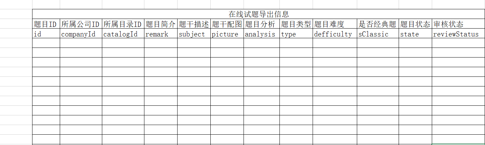
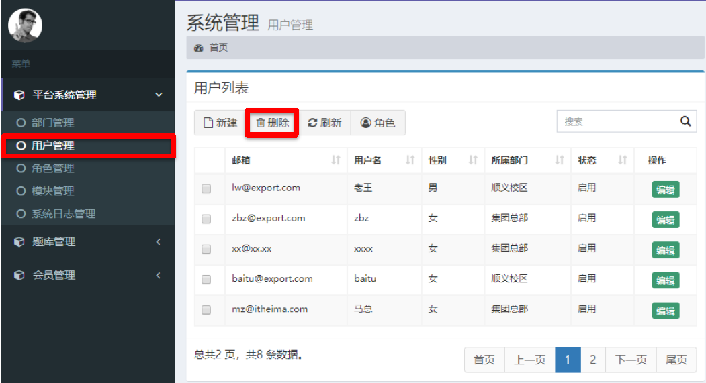
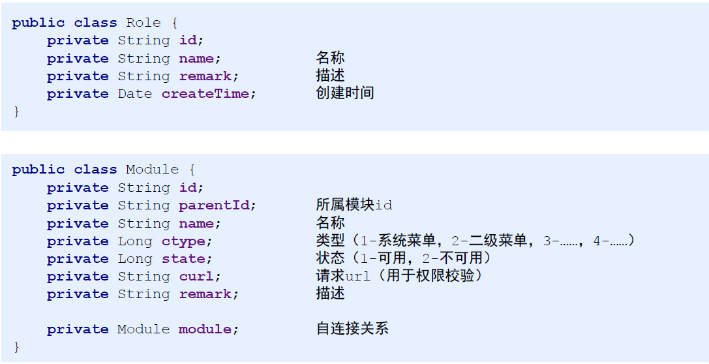
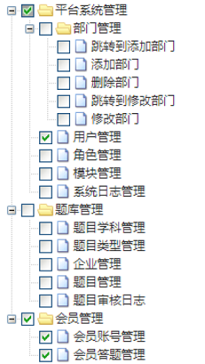
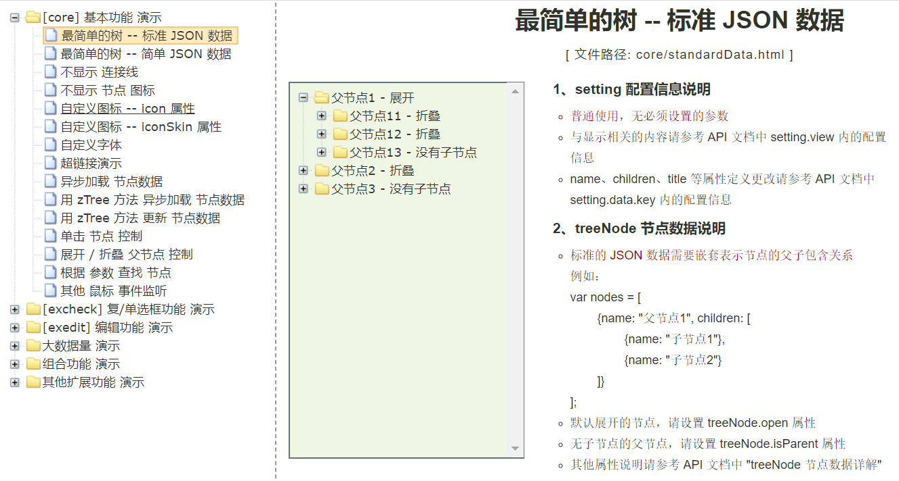

# web综合案例

## 学习目标

目标1：完成使用POI读写Excel的测试案例

目标2：完成题目模板的制作，包括表头，标题及数据

目标3：完成题目报表数据导出的业务功能

目标4：完成角色与模块功能的快速开发

目标5：能够自己独立分析树形控件的页面制作

目标6：完成授权时动态加载授权数据

目标7：完成角色与模块的绑定关系

## 1. ​报表

**报表**：简单的说，报表就是用表格、图表等格式来动态显示数据，可以用公式表示为：“报表 = 多样的格式 + 动态的数据”。

报表的种类有很多：Excel报表，PDF报表，网页报表等，他们各有优缺点


在本课程中，我们主要来将Excel报表。

对于Excel报表的技术实现上也有很多种选择：

- JXL：支持xls文件操作
- POI：支持xls和xlsx文件操作

我们只要来讲POI技术，要使用POI就要导入其坐标，如下

```xml
<!--POI-->
<dependency>
    <groupId>org.apache.poi</groupId>
    <artifactId>poi</artifactId>
    <version>4.0.1</version>
</dependency>
<dependency>
    <groupId>org.apache.poi</groupId>
    <artifactId>poi-ooxml</artifactId>
    <version>4.0.1</version>
</dependency>
<dependency>
    <groupId>org.apache.poi</groupId>
    <artifactId>poi-ooxml-schemas</artifactId>
    <version>4.0.1</version>
</dependency>
```


### 1.1 POI写Excel文件

在测试包下创建POI测试类：com.itheima.service.store.PoiTest

```java
public class PoiTest {

    @Test
    public void testWriteByPoi() throws IOException {
        //1.获取到对应的Excel文件，工作簿文件
        Workbook wb = new XSSFWorkbook();
        //2.创建工作表
        Sheet sheet = wb.createSheet();
        wb.createSheet("这是啥呀");

        //3.创建工作表中的行对象
        Row row = sheet.createRow(1);
        //4.创建工作表中行中的列对象
        Cell cell = row.createCell(1);
        //5.在列中写数据
        cell.setCellValue("测试一下单元格");

        //创建一个文件对象，作为excel文件内容的输出文件
        File f = new File("test.xlsx");
        //输出时通过流的形式对外输出，包装对应的目标文件
        OutputStream os = new FileOutputStream(f);
        //将内存中的workbook数据写入到流中
        wb.write(os);
        wb.close();
        os.close();
    }
}
```

使用单元测试进行测试！

### 1.2 POI读Excel文件

创建读Excel的测试方法：`testReadByPoi`

```java
@Test
public void testReadByPoi() throws IOException {
    //1.获取要读取的文件工作簿对象
    Workbook wb = new XSSFWorkbook("test.xlsx");
    //2.获取工作表
    Sheet s = wb.getSheetAt(0);
    //3.获取行
    Row row = s.getRow(3);
    //4.获取列
    Cell cell = row.getCell(1);
    //5.根据数据的类型获取数据
    //        String data = cell.getStringCellValue();
    //        double data = cell.getNumericCellValue();
    boolean data = cell.getBooleanCellValue();

    System.out.println(data);

    wb.close();
}
```

直接读取第一节创建好的Excel文件

### 1.3 题目模板表头制作

前两节我们讲了如何去读取及写入Excel数据，操作相对简单，但是实际业务中我们要操作的Excel报表还是比较繁琐的，我们可以从今日课程资料中找到我们最终要导出报表的模板：`资料\Excel解析\模板.xlsx`



这种形式的我们如何去操作呢？

在测试类中再编写一个测试方法：`testProjectPoi`

```java
@Test
public void testProjectPoi() throws IOException {
    //1.获取到对应的Excel文件，工作簿文件
    Workbook wb = new XSSFWorkbook();
    //2.创建工作表
    Sheet s = wb.createSheet("题目数据文件");
    //制作标题
    s.addMergedRegion(new CellRangeAddress(1,1,1,12)); 
    Row row_1 = s.createRow(1);
    Cell cell_1_1 = row_1.createCell(1);
    cell_1_1.setCellValue("在线试题导出信息");
    //创建一个样式
    CellStyle cs_title = wb.createCellStyle();
    cs_title.setAlignment(HorizontalAlignment.CENTER);
    cs_title.setVerticalAlignment(VerticalAlignment.CENTER);
    cell_1_1.setCellStyle(cs_title);
    //制作表头
    
    //制作数据区
    
    //创建一个文件对象，作为excel文件内容的输出文件
    File f = new File("test.xlsx");
    //输出时通过流的形式对外输出，包装对应的目标文件
    OutputStream os = new FileOutputStream(f);
    //将内存中的workbook数据写入到流中
    wb.write(os);
    wb.close();
    os.close();
}
```

### 1.4 题目模板标题制作

下面我们接着来做Excel的表头

在测试方法`testProjectPoi`中继续编写代码

```java
@Test
public void testProjectPoi() throws IOException {
    //1.获取到对应的Excel文件，工作簿文件
    Workbook wb = new XSSFWorkbook();
    //2.创建工作表
    Sheet s = wb.createSheet("题目数据文件");
    //设置通用配置
    //        s.setColumnWidth(4,100);
    //制作标题
    s.addMergedRegion(new CellRangeAddress(1,1,1,12));  
    Row row_1 = s.createRow(1);
    Cell cell_1_1 = row_1.createCell(1);
    cell_1_1.setCellValue("在线试题导出信息");
    //创建一个样式
    CellStyle cs_title = wb.createCellStyle();
    cs_title.setAlignment(HorizontalAlignment.CENTER);
    cs_title.setVerticalAlignment(VerticalAlignment.CENTER);
    cell_1_1.setCellStyle(cs_title);
    //制作表头
   String[] fields = {"题目ID","所属公司ID","所属目录ID","题目简介","题干描述",
                "题干配图","题目分析","题目类型","题目难度","是否经典题","题目状态","审核状态"};
    Row row_2 = s.createRow(2);
    for (int i = 0; i < fields.length; i++) {
        Cell cell_2_temp = row_2.createCell(1 + i); //++
        cell_2_temp.setCellValue(fields[i]);    //++
        
        CellStyle cs_field = wb.createCellStyle();
        cs_field.setAlignment(HorizontalAlignment.CENTER);
        cell_2_temp.setCellStyle(cs_field);
    }
    
    //制作数据区

    //创建一个文件对象，作为excel文件内容的输出文件
    File f = new File("test.xlsx");
    //输出时通过流的形式对外输出，包装对应的目标文件
    OutputStream os = new FileOutputStream(f);
    //将内存中的workbook数据写入到流中
    wb.write(os);
    wb.close();
    os.close();
}
```


### 1.5 题目模板数据制作

我们继续来做数据区

```java
@Test
public void testProjectPoi() throws IOException {
    //1.获取到对应的Excel文件，工作簿文件
    Workbook wb = new XSSFWorkbook();
    //2.创建工作表
    Sheet s = wb.createSheet("题目数据文件");
    //设置通用配置
    //        s.setColumnWidth(4,100);
    CellStyle cs_field = wb.createCellStyle();
    cs_field.setAlignment(HorizontalAlignment.CENTER);
    cs_field.setBorderTop(BorderStyle.THIN);
    cs_field.setBorderBottom(BorderStyle.THIN);
    cs_field.setBorderLeft(BorderStyle.THIN);
    cs_field.setBorderRight(BorderStyle.THIN);

    
    //制作标题
    s.addMergedRegion(new CellRangeAddress(1,1,1,12));
    Row row_1 = s.createRow(1);
    Cell cell_1_1 = row_1.createCell(1);
    cell_1_1.setCellValue("在线试题导出信息");
    //创建一个样式
    CellStyle cs_title = wb.createCellStyle();
    cs_title.setAlignment(HorizontalAlignment.CENTER);
    cs_title.setVerticalAlignment(VerticalAlignment.CENTER);
    cell_1_1.setCellStyle(cs_title);
    //制作表头
    String[] fields = {"题目ID","所属公司ID","所属目录ID","题目简介","题干描述",
                       "题干配图","题目分析","题目类型","题目难度","是否经典题","题目状态","审核状态"};
    Row row_2 = s.createRow(2);

    for (int i = 0; i < fields.length; i++) {
        Cell cell_2_temp = row_2.createCell(1 + i); //++
        cell_2_temp.setCellValue(fields[i]);    //++
        cell_2_temp.setCellStyle(cs_field);
    }

    
    //制作数据区
    List<Question> questionList = new ArrayList<>();
    Question qq = new Question();
    qq.setId("1");
    qq.setPicture("12");
    qq.setReviewStatus("13");
    qq.setAnalysis("14");
    qq.setCatalogId("15");
    qq.setCompanyId("16");
    qq.setDifficulty("17");
    qq.setIsClassic("18");
    qq.setRemark("19");
    qq.setState("21");
    qq.setSubject("31");
    qq.setType("41");
    questionList.add(qq);
    Question qqq = new Question();
    qqq.setId("1");
    qqq.setPicture("12");
    qqq.setReviewStatus("13");
    qqq.setAnalysis("14");
    qqq.setCatalogId("15");
    qqq.setCompanyId("16");
    qqq.setDifficulty("17");
    qqq.setIsClassic("18");
    qqq.setRemark("19");
    qqq.setState("21");
    qqq.setSubject("31");
    qqq.setType("41");
    questionList.add(qqq);


    int row_index = 0;
    for (Question q : questionList) {
        int cell_index = 0;
        Row row_temp = s.createRow(3 + row_index++);

        Cell cell_data_1 = row_temp.createCell(1 + cell_index++);
        cell_data_1.setCellValue(q.getId());    //++
        cell_data_1.setCellStyle(cs_field);

        Cell cell_data_2 = row_temp.createCell(1 + cell_index++);
        cell_data_2.setCellValue(q.getCompanyId());    //++
        cell_data_2.setCellStyle(cs_field);

        Cell cell_data_3 = row_temp.createCell(1 + cell_index++);
        cell_data_3.setCellValue(q.getCatalogId());    //++
        cell_data_3.setCellStyle(cs_field);

        Cell cell_data_4 = row_temp.createCell(1 + cell_index++);
        cell_data_4.setCellValue(q.getRemark());    //++
        cell_data_4.setCellStyle(cs_field);

        Cell cell_data_5 = row_temp.createCell(1 + cell_index++);
        cell_data_5.setCellValue(q.getSubject());    //++
        cell_data_5.setCellStyle(cs_field);

        Cell cell_data_6 = row_temp.createCell(1 + cell_index++);
        cell_data_6.setCellValue(q.getPicture());    //++
        cell_data_6.setCellStyle(cs_field);

        Cell cell_data_7 = row_temp.createCell(1 + cell_index++);
        cell_data_7.setCellValue(q.getAnalysis());    //++
        cell_data_7.setCellStyle(cs_field);

        Cell cell_data_8 = row_temp.createCell(1 + cell_index++);
        cell_data_8.setCellValue(q.getType());    //++
        cell_data_8.setCellStyle(cs_field);

        Cell cell_data_9 = row_temp.createCell(1 + cell_index++);
        cell_data_9.setCellValue(q.getDifficulty());    //++
        cell_data_9.setCellStyle(cs_field);

        Cell cell_data_10 = row_temp.createCell(1 + cell_index++);
        cell_data_10.setCellValue(q.getIsClassic());    //++
        cell_data_10.setCellStyle(cs_field);

        Cell cell_data_11 = row_temp.createCell(1 + cell_index++);
        cell_data_11.setCellValue(q.getState());    //++
        cell_data_11.setCellStyle(cs_field);

        Cell cell_data_12 = row_temp.createCell(1 + cell_index++);
        cell_data_12.setCellValue(q.getReviewStatus());    //++
        cell_data_12.setCellStyle(cs_field);
    }

    //创建一个文件对象，作为excel文件内容的输出文件
    File f = new File("test.xlsx");
    //输出时通过流的形式对外输出，包装对应的目标文件
    OutputStream os = new FileOutputStream(f);
    //将内存中的workbook数据写入到流中
    wb.write(os);
    wb.close();
    os.close();
}
```

测试即可！

### 1.6 题目报表数据准备

（1）找到`/WEB-INF/pages/store/question/list.jsp`页面，修改导出题目的链接

```jsp
<button type="button" class="btn btn-default" title="导出题目" onclick=location.href="${ctx}/store/question?operation=downloadReport"> <i class="fa fa-download"></i>导出题目</button>
```

（2）在后台servlet中添加对应的方法

```java
// uri:/store/question?operation=list
@WebServlet("/store/question")
public class QuestionServlet extends BaseServlet {

    @Override
    protected void doGet(HttpServletRequest request, HttpServletResponse response) throws ServletException, IOException {
        String operation = request.getParameter("operation");
        if("list".equals(operation)){
            this.list(request,response);
        }
        //其他的else if判断省略
        else if("downloadReport".equals(operation)){
            this.downloadReport(request,response);
        }
    }

    private void downloadReport(HttpServletRequest request, HttpServletResponse response) throws IOException {
        //生成报告的文件，然后传递到前端页面
        questionService.getReport();
    }
}
```

（3）在业务层`QuestionService`添加一个方法`getReport`

```java
public void getReport() throws IOException;
```

（4）在对应的实现类中去实现该方法，把之前在测试类中的测试方法`testProjectPoi`里面的所有代码拷贝过来，其中数据我们应该是从数据库中查询出来，因此调用dao完成数据的查询

```java
@Overridepublic void getReport() throws IOException{     //获取对应要展示的数据        SqlSession sqlSession = null;        List<Question> questionList = null;        try{            //1.获取SqlSession            sqlSession = MapperFactory.getSqlSession();            //2.获取Dao            QuestionDao questionDao = MapperFactory.getMapper(sqlSession,QuestionDao.class);            //3.调用Dao层操作            questionList = questionDao.findAll();        }catch (Exception e){            throw new RuntimeException(e);            //记录日志        }finally {            try {                TransactionUtil.close(sqlSession);            }catch (Exception e){                e.printStackTrace();            }        }                //1.获取到对应的Excel文件，工作簿文件        Workbook wb = new XSSFWorkbook();        //2.创建工作表        Sheet s = wb.createSheet("题目数据文件");        //设置通用配置//        s.setColumnWidth(4,100);        CellStyle cs_field = wb.createCellStyle();        cs_field.setAlignment(HorizontalAlignment.CENTER);        cs_field.setBorderTop(BorderStyle.THIN);        cs_field.setBorderBottom(BorderStyle.THIN);        cs_field.setBorderLeft(BorderStyle.THIN);        cs_field.setBorderRight(BorderStyle.THIN);        //制作标题        s.addMergedRegion(new CellRangeAddress(1,1,1,12));        Row row_1 = s.createRow(1);        Cell cell_1_1 = row_1.createCell(1);        cell_1_1.setCellValue("在线试题导出信息");        //创建一个样式        CellStyle cs_title = wb.createCellStyle();        cs_title.setAlignment(HorizontalAlignment.CENTER);        cs_title.setVerticalAlignment(VerticalAlignment.CENTER);        cell_1_1.setCellStyle(cs_title);            //制作表头        String[] fields = {"题目ID","所属公司ID","所属目录ID","题目简介","题干描述",                "题干配图","题目分析","题目类型","题目难度","是否经典题","题目状态","审核状态"};        Row row_2 = s.createRow(2);        for (int i = 0; i < fields.length; i++) {            Cell cell_2_temp = row_2.createCell(1 + i); //++            cell_2_temp.setCellValue(fields[i]);    //++            cell_2_temp.setCellStyle(cs_field);        }        //制作数据区        int row_index = 0;        for (Question q : questionList) {            int cell_index = 0;            Row row_temp = s.createRow(3 + row_index++);            Cell cell_data_1 = row_temp.createCell(1 + cell_index++);            cell_data_1.setCellValue(q.getId());    //++            cell_data_1.setCellStyle(cs_field);            Cell cell_data_2 = row_temp.createCell(1 + cell_index++);            cell_data_2.setCellValue(q.getCompanyId());    //++            cell_data_2.setCellStyle(cs_field);            Cell cell_data_3 = row_temp.createCell(1 + cell_index++);            cell_data_3.setCellValue(q.getCatalogId());    //++            cell_data_3.setCellStyle(cs_field);            Cell cell_data_4 = row_temp.createCell(1 + cell_index++);            cell_data_4.setCellValue(q.getRemark());    //++            cell_data_4.setCellStyle(cs_field);            Cell cell_data_5 = row_temp.createCell(1 + cell_index++);            cell_data_5.setCellValue(q.getSubject());    //++            cell_data_5.setCellStyle(cs_field);            Cell cell_data_6 = row_temp.createCell(1 + cell_index++);            cell_data_6.setCellValue(q.getPicture());    //++            cell_data_6.setCellStyle(cs_field);            Cell cell_data_7 = row_temp.createCell(1 + cell_index++);            cell_data_7.setCellValue(q.getAnalysis());    //++            cell_data_7.setCellStyle(cs_field);            Cell cell_data_8 = row_temp.createCell(1 + cell_index++);            cell_data_8.setCellValue(q.getType());    //++            cell_data_8.setCellStyle(cs_field);            Cell cell_data_9 = row_temp.createCell(1 + cell_index++);            cell_data_9.setCellValue(q.getDifficulty());    //++            cell_data_9.setCellStyle(cs_field);            Cell cell_data_10 = row_temp.createCell(1 + cell_index++);            cell_data_10.setCellValue(q.getIsClassic());    //++            cell_data_10.setCellStyle(cs_field);            Cell cell_data_11 = row_temp.createCell(1 + cell_index++);            cell_data_11.setCellValue(q.getState());    //++            cell_data_11.setCellStyle(cs_field);            Cell cell_data_12 = row_temp.createCell(1 + cell_index++);            cell_data_12.setCellValue(q.getReviewStatus());    //++            cell_data_12.setCellStyle(cs_field);        }        //创建一个文件对象，作为excel文件内容的输出文件        File f = new File("test.xlsx");        //输出时通过流的形式对外输出，包装对应的目标文件        OutputStream os = new FileOutputStream(f);        //将内存中的workbook数据写入到流中        wb.write(os);        wb.close();        os.close();}
```


### 1.7 题目报表业务实现

现在后台已经能够生成Excel文件并且填充了数据，但是真实的业务中我们是需要将这个文件下载到客户端

（1）修改接口方法`getReport`，添加返回值

```java
/**     * 获取包含了数据的流对象     * @return 包含了报表数据的流对象     * @throws IOException     */ByteArrayOutputStream getReport() throws IOException;
```

（2）在实现类中实现该方法时，将内存中的Excel相关数据写入到`ByteArrayOutputStream`流中

```java
@Overridepublic ByteArrayOutputStream getReport() throws IOException {    //前面的代码无变动 故省略        /**    //创建一个文件对象，作为excel文件内容的输出文件        File f = new File("test.xlsx");        //输出时通过流的形式对外输出，包装对应的目标文件        OutputStream os = new FileOutputStream(f);        //将内存中的workbook数据写入到流中        wb.write(os);        wb.close();        os.close();    */    //将内存中的workbook数据写入到流中    ByteArrayOutputStream os = new ByteArrayOutputStream();    wb.write(os);    wb.close();    return os;}
```

（3）修改后台servlet的`downloadReport`方法

```java
private void downloadReport(HttpServletRequest request, HttpServletResponse response) throws IOException {    //返回的数据类型为文件xlsx类型    response.setContentType("application/vnd.openxmlformats-officedocument.spreadsheetml.sheet;charset=utf-8");    String fileName = new String("测试文件名.xlsx".getBytes(),"iso8859-1");    response.addHeader("Content-Disposition","attachment;fileName="+fileName);    //生成报告的文件，然后传递到前端页面    ByteArrayOutputStream os = questionService.getReport();    //获取产生响应的流对象    ServletOutputStream sos = response.getOutputStream();    //将数据从原始的字节流对象中提取出来写入到servlet对应的输出流中    os.writeTo(sos);    //将输出流刷新    sos.flush();    os.close();}
```

（4）启动项目，进行测试

## 2.权限系统设计与开发

### 2.1 权限系统简介与结构设计



**什么是权限系统？**

**权限系统是一种设定用户与可操作模块之间关系的系统。**

**通过设定用户与可操作的模块之间的关系,控制用户在可指定范围内进行业务执行**

**基于用户的权限控制(UBAC:User-BasedAccessControl)**

**基于角色的权限控制(RBAC:role-BasedAccessControl)**


在本课程中我们采用基于角色的权限控制RBAC


### 2.2 角色与模块功能快速开发

首先来看角色与模块各自的结构



（1）创建角色实体：com.itheima.domain.system.Role

```java
public class Role {    private String id;    private String name;    private String remark;    private Date createTime;	// getter/setter略}
```

（2）创建角色Dao：com.itheima.dao.system.RoleDao

```java
public interface RoleDao {    int save(Role role);    int delete(Role role);    int update(Role role);    Role findById(String id);    List<Role> findAll();}
```

（3）添加接口的映射配置文件，从今日课程资料中找到`资料\dao层资源文件`将里面所有的xml映射配置文件拷贝到项目`src/main/resources/com/itheima/dao/system`目录下

（4）创建业务层接口：com.itheima.service.system.RoleService

```java
public interface RoleService {    /**     * 添加     * @param role     * @return     */    void save(Role role);    /**     * 删除     * @param role     * @return     */    void delete(Role role);    /**     * 修改     * @param role     * @return     */    void update(Role role);    /**     * 查询单个     * @param id 查询的条件（id）     * @return 查询的结果，单个对象     */    Role findById(String id);    /**     * 查询全部的数据     * @return 全部数据的列表对象     */    List<Role> findAll();    /**     * 分页查询数据     * @param page 页码     * @param size 每页显示的数据总量     * @return     */    PageInfo findAll(int page, int size);}
```

（5）创建接口的实现：com.itheima.service.system.impl

```java
public class RoleServiceImpl implements RoleService {    @Override    public void save(Role role) {        SqlSession sqlSession = null;        try{            //1.获取SqlSession            sqlSession = MapperFactory.getSqlSession();            //2.获取Dao            RoleDao roleDao = MapperFactory.getMapper(sqlSession,RoleDao.class);            //id使用UUID的生成策略来获取            String id = UUID.randomUUID().toString();            role.setId(id);            //3.调用Dao层操作            roleDao.save(role);            //4.提交事务            TransactionUtil.commit(sqlSession);        }catch (Exception e){            TransactionUtil.rollback(sqlSession);            throw new RuntimeException(e);            //记录日志        }finally {            try {                TransactionUtil.close(sqlSession);            }catch (Exception e){                e.printStackTrace();            }        }    }    @Override    public void delete(Role role) {        SqlSession sqlSession = null;        try{            //1.获取SqlSession            sqlSession = MapperFactory.getSqlSession();            //2.获取Dao            RoleDao roleDao = MapperFactory.getMapper(sqlSession,RoleDao.class);            //3.调用Dao层操作            roleDao.delete(role);            //4.提交事务            TransactionUtil.commit(sqlSession);        }catch (Exception e){            TransactionUtil.rollback(sqlSession);            throw new RuntimeException(e);            //记录日志        }finally {            try {                TransactionUtil.close(sqlSession);            }catch (Exception e){                e.printStackTrace();            }        }    }    @Override    public void update(Role role) {        SqlSession sqlSession = null;        try{            //1.获取SqlSession            sqlSession = MapperFactory.getSqlSession();            //2.获取Dao            RoleDao roleDao = MapperFactory.getMapper(sqlSession,RoleDao.class);            //3.调用Dao层操作            roleDao.update(role);            //4.提交事务            TransactionUtil.commit(sqlSession);        }catch (Exception e){            TransactionUtil.rollback(sqlSession);            throw new RuntimeException(e);            //记录日志        }finally {            try {                TransactionUtil.close(sqlSession);            }catch (Exception e){                e.printStackTrace();            }        }    }    @Override    public Role findById(String id) {        SqlSession sqlSession = null;        try{            //1.获取SqlSession            sqlSession = MapperFactory.getSqlSession();            //2.获取Dao            RoleDao roleDao = MapperFactory.getMapper(sqlSession,RoleDao.class);            //3.调用Dao层操作            return roleDao.findById(id);        }catch (Exception e){            throw new RuntimeException(e);            //记录日志        }finally {            try {                TransactionUtil.close(sqlSession);            }catch (Exception e){                e.printStackTrace();            }        }    }    @Override    public List<Role> findAll() {        SqlSession sqlSession = null;        try{            //1.获取SqlSession            sqlSession = MapperFactory.getSqlSession();            //2.获取Dao            RoleDao roleDao = MapperFactory.getMapper(sqlSession,RoleDao.class);            //3.调用Dao层操作            return roleDao.findAll();        }catch (Exception e){            throw new RuntimeException(e);            //记录日志        }finally {            try {                TransactionUtil.close(sqlSession);            }catch (Exception e){                e.printStackTrace();            }        }    }    @Override    public PageInfo findAll(int page, int size) {        SqlSession sqlSession = null;        try{            //1.获取SqlSession            sqlSession = MapperFactory.getSqlSession();            //2.获取Dao            RoleDao roleDao = MapperFactory.getMapper(sqlSession,RoleDao.class);            //3.调用Dao层操作            PageHelper.startPage(page,size);            List<Role> all = roleDao.findAll();            PageInfo pageInfo = new PageInfo(all);            return pageInfo;        }catch (Exception e){            throw new RuntimeException(e);            //记录日志        }finally {            try {                TransactionUtil.close(sqlSession);            }catch (Exception e){                e.printStackTrace();            }        }    }}
```

（6）创建sevlet：com.itheima.web.controller.system.RoleServlet

```java
// uri:/system/role?operation=list@WebServlet("/system/role")public class RoleServlet extends BaseServlet {    @Override    protected void doGet(HttpServletRequest request, HttpServletResponse response) throws ServletException, IOException {        String operation = request.getParameter("operation");        if("list".equals(operation)){            this.list(request,response);        }else if("toAdd".equals(operation)){            this.toAdd(request,response);        }else if("save".equals(operation)){            this.save(request, response);        }else if("toEdit".equals(operation)){            this.toEdit(request,response);        }else if("edit".equals(operation)){            this.edit(request,response);        }else if("delete".equals(operation)){            this.delete(request,response);        }else if("author".equals(operation)){            this.author(request,response);        }    }    private void list(HttpServletRequest request,HttpServletResponse response) throws ServletException, IOException {        //进入列表页        //获取数据        int page = 1;        int size = 5;        if(StringUtils.isNotBlank(request.getParameter("page"))){            page = Integer.parseInt(request.getParameter("page"));        }        if(StringUtils.isNotBlank(request.getParameter("size"))){            size = Integer.parseInt(request.getParameter("size"));        }        PageInfo all = roleService.findAll(page, size);        //将数据保存到指定的位置        request.setAttribute("page",all);        //跳转页面        request.getRequestDispatcher("/WEB-INF/pages/system/role/list.jsp").forward(request,response);    }    private void toAdd(HttpServletRequest request,HttpServletResponse response) throws ServletException, IOException {        //加载所有的部门信息放入到roleList        List<Role> all = roleService.findAll();        request.setAttribute("roleList",all);        //跳转页面        request.getRequestDispatcher("/WEB-INF/pages/system/role/add.jsp").forward(request,response);    }    private void save(HttpServletRequest request,HttpServletResponse response) throws ServletException, IOException {        //将数据获取到，封装成一个对象        Role role = BeanUtil.fillBean(request,Role.class,"yyyy-MM-dd");        //调用业务层接口save        roleService.save(role);        //跳转回到页面list        response.sendRedirect(request.getContextPath()+"/system/role?operation=list");    }    private void toEdit(HttpServletRequest request, HttpServletResponse response) throws ServletException, IOException {        //查询要修改的数据findById        String id = request.getParameter("id");        Role role = roleService.findById(id);        //将数据加载到指定区域，供页面获取        request.setAttribute("role",role);        //跳转页面        request.getRequestDispatcher("/WEB-INF/pages/system/role/update.jsp").forward(request,response);    }    private void edit(HttpServletRequest request, HttpServletResponse response) throws IOException {        //将数据获取到，封装成一个对象        Role role = BeanUtil.fillBean(request,Role.class,"yyyy-MM-dd");        //调用业务层接口save        roleService.update(role);        //跳转回到页面list        response.sendRedirect(request.getContextPath()+"/system/role?operation=list");    }    private void delete(HttpServletRequest request, HttpServletResponse response) throws IOException {        //将数据获取到，封装成一个对象        Role role = BeanUtil.fillBean(request,Role.class);        //调用业务层接口save        roleService.delete(role);        //跳转回到页面list        response.sendRedirect(request.getContextPath()+"/system/role?operation=list");    }    private void author(HttpServletRequest request, HttpServletResponse response) throws IOException, ServletException {        //获取要授权的角色id        String roleId = request.getParameter("id");        //使用id查询对应的数据（角色id对应的模块信息）        Role role = roleService.findById(roleId);        request.setAttribute("role",role);        //根据当前的角色id获取所有的模块数据，并加载关系数据        List<Map> map = moduleService.findAuthorDataByRoleId(roleId);        //map转成json数据        ObjectMapper om = new ObjectMapper();        String json = om.writeValueAsString(map);        request.setAttribute("roleModuleJson",json);        // TODO 数据未查询        //跳转到树页面中        request.getRequestDispatcher("/WEB-INF/pages/system/role/author.jsp").forward(request,response);    }    @Override    protected void doPost(HttpServletRequest request, HttpServletResponse response) throws ServletException, IOException {        this.doGet(request,response);    }}
```

同时需要在BaseServlet中添加`RoleService`

```java
public class BaseServlet extends HttpServlet {    protected CompanyService companyService;    protected DeptService deptService;    protected UserService userService;    protected CourseService courseService;    protected CatalogService catalogService;    protected QuestionService questionService;    protected QuestionItemService questionItemService;    protected RoleService roleService;    @Override    public void init() throws ServletException {        companyService = new CompanyServiceImpl();        deptService = new DeptServiceImpl();        userService = new UserServiceImpl();        courseService = new CourseServiceImpl();        catalogService = new CatalogServiceImpl();        questionService = new QuestionServiceImpl();        questionItemService = new QuestionItemServiceImpl();        roleService = new RoleServiceImpl();    }}
```

（7）拷贝页面到项目中，从今日课程资料中找到：`资料\模块页面`将下面所有模块全部拷贝到项目`/WEB-INF/pages/system`目录下

（8）启动项目，进行测试


然后我们按照相同的方式将模块的相关功能快速开发完成

（1）创建模块实体：com.itheima.domain.system.Module

```java
public class Module {    private String id;    private String parentId;    private String name;    private Long ctype;    private Long state;    private String curl;    private String remark;    private Module module;	// getter/setter略}
```

（2）创建模块dao：com.itheima.dao.system.ModuleDao

```java
public interface ModuleDao {    int save(Module module);    int delete(Module module);    int update(Module module);    Module findById(String id);    List<Module> findAll();}
```

（3）映射配置文件，之前已拷贝，查看一下即可

（4）创建业务层接口：com.itheima.service.system.ModuleService

```java
public interface ModuleService {    /**     * 添加     * @param module     * @return     */    void save(Module module);    /**     * 删除     * @param module     * @return     */    void delete(Module module);    /**     * 修改     * @param module     * @return     */    void update(Module module);    /**     * 查询单个     * @param id 查询的条件（id）     * @return 查询的结果，单个对象     */    Module findById(String id);    /**     * 查询全部的数据     * @return 全部数据的列表对象     */    List<Module> findAll();    /**     * 分页查询数据     * @param page 页码     * @param size 每页显示的数据总量     * @return     */    PageInfo findAll(int page, int size);}
```

（5）创建业务层实现类：com.itheima.service.system.impl.ModuleServiceImpl

```java
public class ModuleServiceImpl implements ModuleService {    @Override    public void save(Module module) {        SqlSession sqlSession = null;        try{            //1.获取SqlSession            sqlSession = MapperFactory.getSqlSession();            //2.获取Dao            ModuleDao moduleDao = MapperFactory.getMapper(sqlSession,ModuleDao.class);            //id使用UUID的生成策略来获取            String id = UUID.randomUUID().toString();            module.setId(id);            //3.调用Dao层操作            moduleDao.save(module);            //4.提交事务            TransactionUtil.commit(sqlSession);        }catch (Exception e){            TransactionUtil.rollback(sqlSession);            throw new RuntimeException(e);            //记录日志        }finally {            try {                TransactionUtil.close(sqlSession);            }catch (Exception e){                e.printStackTrace();            }        }    }    @Override    public void delete(Module module) {        SqlSession sqlSession = null;        try{            //1.获取SqlSession            sqlSession = MapperFactory.getSqlSession();            //2.获取Dao            ModuleDao moduleDao = MapperFactory.getMapper(sqlSession,ModuleDao.class);            //3.调用Dao层操作            moduleDao.delete(module);            //4.提交事务            TransactionUtil.commit(sqlSession);        }catch (Exception e){            TransactionUtil.rollback(sqlSession);            throw new RuntimeException(e);            //记录日志        }finally {            try {                TransactionUtil.close(sqlSession);            }catch (Exception e){                e.printStackTrace();            }        }    }    @Override    public void update(Module module) {        SqlSession sqlSession = null;        try{            //1.获取SqlSession            sqlSession = MapperFactory.getSqlSession();            //2.获取Dao            ModuleDao moduleDao = MapperFactory.getMapper(sqlSession,ModuleDao.class);            //3.调用Dao层操作            moduleDao.update(module);            //4.提交事务            TransactionUtil.commit(sqlSession);        }catch (Exception e){            TransactionUtil.rollback(sqlSession);            throw new RuntimeException(e);            //记录日志        }finally {            try {                TransactionUtil.close(sqlSession);            }catch (Exception e){                e.printStackTrace();            }        }    }    @Override    public Module findById(String id) {        SqlSession sqlSession = null;        try{            //1.获取SqlSession            sqlSession = MapperFactory.getSqlSession();            //2.获取Dao            ModuleDao moduleDao = MapperFactory.getMapper(sqlSession,ModuleDao.class);            //3.调用Dao层操作            return moduleDao.findById(id);        }catch (Exception e){            throw new RuntimeException(e);            //记录日志        }finally {            try {                TransactionUtil.close(sqlSession);            }catch (Exception e){                e.printStackTrace();            }        }    }    @Override    public List<Module> findAll() {        SqlSession sqlSession = null;        try{            //1.获取SqlSession            sqlSession = MapperFactory.getSqlSession();            //2.获取Dao            ModuleDao moduleDao = MapperFactory.getMapper(sqlSession,ModuleDao.class);            //3.调用Dao层操作            return moduleDao.findAll();        }catch (Exception e){            throw new RuntimeException(e);            //记录日志        }finally {            try {                TransactionUtil.close(sqlSession);            }catch (Exception e){                e.printStackTrace();            }        }    }    @Override    public PageInfo findAll(int page, int size) {        SqlSession sqlSession = null;        try{            //1.获取SqlSession            sqlSession = MapperFactory.getSqlSession();            //2.获取Dao            ModuleDao moduleDao = MapperFactory.getMapper(sqlSession,ModuleDao.class);            //3.调用Dao层操作            PageHelper.startPage(page,size);            List<Module> all = moduleDao.findAll();            PageInfo pageInfo = new PageInfo(all);            return pageInfo;        }catch (Exception e){            throw new RuntimeException(e);            //记录日志        }finally {            try {                TransactionUtil.close(sqlSession);            }catch (Exception e){                e.printStackTrace();            }        }    }}
```

（6）创建servlet：com.itheima.web.controller.system.ModuleServlet

```java
// uri:/system/module?operation=list@WebServlet("/system/module")public class ModuleServlet extends BaseServlet {    @Override    protected void doGet(HttpServletRequest request, HttpServletResponse response) throws ServletException, IOException {        String operation = request.getParameter("operation");        if("list".equals(operation)){            this.list(request,response);        }else if("toAdd".equals(operation)){            this.toAdd(request,response);        }else if("save".equals(operation)){            this.save(request, response);        }else if("toEdit".equals(operation)){            this.toEdit(request,response);        }else if("edit".equals(operation)){            this.edit(request,response);        }else if("delete".equals(operation)){            this.delete(request,response);        }    }    private void list(HttpServletRequest request,HttpServletResponse response) throws ServletException, IOException {        //进入列表页        //获取数据        int page = 1;        int size = 10;        if(StringUtils.isNotBlank(request.getParameter("page"))){            page = Integer.parseInt(request.getParameter("page"));        }        if(StringUtils.isNotBlank(request.getParameter("size"))){            size = Integer.parseInt(request.getParameter("size"));        }        PageInfo all = moduleService.findAll(page, size);        //将数据保存到指定的位置        request.setAttribute("page",all);        //跳转页面        request.getRequestDispatcher("/WEB-INF/pages/system/module/list.jsp").forward(request,response);    }    private void toAdd(HttpServletRequest request,HttpServletResponse response) throws ServletException, IOException {        //加载所有的信息放入到moduleList        List<Module> all = moduleService.findAll();        request.setAttribute("moduleList",all);        //跳转页面        request.getRequestDispatcher("/WEB-INF/pages/system/module/add.jsp").forward(request,response);    }    private void save(HttpServletRequest request,HttpServletResponse response) throws ServletException, IOException {        //将数据获取到，封装成一个对象        Module module = BeanUtil.fillBean(request,Module.class,"yyyy-MM-dd");        //调用业务层接口save        moduleService.save(module);        //跳转回到页面list        response.sendRedirect(request.getContextPath()+"/system/module?operation=list");    }    private void toEdit(HttpServletRequest request, HttpServletResponse response) throws ServletException, IOException {        //查询要修改的数据findById        String id = request.getParameter("id");        Module module = moduleService.findById(id);        //将数据加载到指定区域，供页面获取        request.setAttribute("module",module);        //跳转页面        request.getRequestDispatcher("/WEB-INF/pages/system/module/update.jsp").forward(request,response);    }    private void edit(HttpServletRequest request, HttpServletResponse response) throws IOException {        //将数据获取到，封装成一个对象        Module module = BeanUtil.fillBean(request,Module.class,"yyyy-MM-dd");        //调用业务层接口save        moduleService.update(module);        //跳转回到页面list        response.sendRedirect(request.getContextPath()+"/system/module?operation=list");    }    private void delete(HttpServletRequest request, HttpServletResponse response) throws IOException {        //将数据获取到，封装成一个对象        Module module = BeanUtil.fillBean(request,Module.class);        //调用业务层接口save        moduleService.delete(module);        //跳转回到页面list        response.sendRedirect(request.getContextPath()+"/system/module?operation=list");    }    @Override    protected void doPost(HttpServletRequest request, HttpServletResponse response) throws ServletException, IOException {        this.doGet(request,response);    }}
```

同时需要在BserServlet中添加`ModuleService`

```java
public class BaseServlet extends HttpServlet {    protected CompanyService companyService;    protected DeptService deptService;    protected UserService userService;    protected CourseService courseService;    protected CatalogService catalogService;    protected QuestionService questionService;    protected QuestionItemService questionItemService;    protected RoleService roleService;    protected ModuleService moduleService;    @Override    public void init() throws ServletException {        companyService = new CompanyServiceImpl();        deptService = new DeptServiceImpl();        userService = new UserServiceImpl();        courseService = new CourseServiceImpl();        catalogService = new CatalogServiceImpl();        questionService = new QuestionServiceImpl();        questionItemService = new QuestionItemServiceImpl();        roleService = new RoleServiceImpl();        moduleService = new ModuleServiceImpl();    }}
```

（7）拷贝页面：之前已经拷贝过了，我们可以直接启动项目进行测试！


### 2.3 树形控件结构分析（1）

树形结构如下图所示：



对应的实现技术有：

**dTree**

**tdTree**

**zTree**


我们主要来看关于**zTree**的相关操作，从今日课程资料中找到：`资料\树\zTree-zTree_v3-master\zTree_v3\demo\cn\index.html`，打开就可查阅




我们主要是针对里面的Checkbox 勾选操作进行学习，我们自己来编写一个测试页面`test.html`来完成一个树形结构，操作步骤：

- 1.观察整体的页面结构
- 2.去除无效的基础信息
- 3.去除页面无效的基础信息
- 4.分析页面js内容
- 5.分页结构所使用的数据
- 6.简化页面内容书写

```html
- 1.观察整体的页面结构- 2.去除无效的基础信息- 3.去除页面无效的基础信息- 4.分析页面js内容- 5.分页结构所使用的数据- 6.简化页面内容书写<meta http-equiv="content-type" content="text/html; charset=UTF-8"><link rel="stylesheet" href="../../../css/demo.css" type="text/css"><link rel="stylesheet" href="../../../css/zTreeStyle/zTreeStyle.css" type="text/css"><script type="text/javascript" src="../../../js/jquery-1.4.4.min.js"></script><script type="text/javascript" src="../../../js/jquery.ztree.core-3.5.js"></script><script type="text/javascript" src="../../../js/jquery.ztree.excheck-3.5.js"></script><SCRIPT type="text/javascript">    var setting = {        check: {            enable: true        },        data: {            simpleData: {                enable: true            }        }    };    /**/var zNodes =[        { id:11, pId:1, name:"随意勾选 1-1", open:true},        { id:111, pId:11, name:"随意勾选 1-1-1"},        { id:112, pId:11, name:"随意勾选 1-1-2"},        { id:12, pId:1, name:"随意勾选 1-2", open:true},        { id:121, pId:12, name:"随意勾选 1-2-1"},        { id:122, pId:12, name:"随意勾选 1-2-2"},        { id:2, pId:0, name:"随意勾选 2", checked:true, open:true},        { id:21, pId:2, name:"随意勾选 2-1"},        { id:22, pId:2, name:"随意勾选 2-2", open:true},        { id:221, pId:22, name:"随意勾选 2-2-1", checked:true},        { id:222, pId:22, name:"随意勾选 2-2-2"},        { id:23, pId:2, name:"随意勾选 2-3"},        { id:1, pId:0, name:"随意勾选 1", open:true}    ];    var code;    function setCheck() {        var zTree = $.fn.zTree.getZTreeObj("treeDemo"),            py = $("#py").attr("checked")? "p":"",            sy = $("#sy").attr("checked")? "s":"",            pn = $("#pn").attr("checked")? "p":"",            sn = $("#sn").attr("checked")? "s":"",            type = { "Y":py + sy, "N":pn + sn};        zTree.setting.check.chkboxType = type;        showCode('setting.check.chkboxType = { "Y" : "' + type.Y + '", "N" : "' + type.N + '" };');    }    function showCode(str) {        if (!code) code = $("#code");        code.empty();        code.append("<li>"+str+"</li>");    }    $(document).ready(function(){        $.fn.zTree.init($("#treeDemo"), setting, zNodes);        setCheck();        $("#py").bind("change", setCheck);        $("#sy").bind("change", setCheck);        $("#pn").bind("change", setCheck);        $("#sn").bind("change", setCheck);    });</SCRIPT><div class="content_wrap">    <div class="zTreeDemoBackground left">        <ul id="treeDemo" class="ztree"></ul>    </div>    <div class="right">        <ul class="info">            <li class="title">                <ul class="list">                    <li>                        <input type="checkbox" id="py" class="checkbox first" checked /><span>关联父</span>                        <input type="checkbox" id="sy" class="checkbox first" checked /><span>关联子</span><br/>                        <input type="checkbox" id="pn" class="checkbox first" checked /><span>关联父</span>                        <input type="checkbox" id="sn" class="checkbox first" checked /><span>关联子</span><br/>                        <ul id="code" class="log" style="height:20px;"></ul></p>            </li>        </ul>        </li>    </ul></div></div>
```

### 2.4 树形控件结构分析（2）

分析页面js

```html
- 1.观察整体的页面结构- 2.去除无效的基础信息- 3.去除页面无效的基础信息- 4.分析页面js内容- 5.分页结构所使用的数据- 6.简化页面内容书写<meta http-equiv="content-type" content="text/html; charset=UTF-8"><link rel="stylesheet" href="../../../css/demo.css" type="text/css"><link rel="stylesheet" href="../../../css/zTreeStyle/zTreeStyle.css" type="text/css"><script type="text/javascript" src="../../../js/jquery-1.4.4.min.js"></script><script type="text/javascript" src="../../../js/jquery.ztree.core-3.5.js"></script><script type="text/javascript" src="../../../js/jquery.ztree.excheck-3.5.js"></script><SCRIPT type="text/javascript">	var setting = {check: {enable: true},data: {	simpleData: {enable: true}}};	var zNodes =[        { id:11, pId:1, name:"随意勾选 1-1", open:true},        { id:111, pId:11, name:"随意勾选 1-1-1"},        { id:112, pId:11, name:"随意勾选 1-1-2"},        { id:12, pId:1, name:"随意勾选 1-2", open:true},        { id:121, pId:12, name:"随意勾选 1-2-1"},        { id:122, pId:12, name:"随意勾选 1-2-2"},        { id:2, pId:0, name:"随意勾选 2", checked:true, open:true},        { id:21, pId:2, name:"随意勾选 2-1"},        { id:22, pId:2, name:"随意勾选 2-2", open:true},        { id:221, pId:22, name:"随意勾选 2-2-1", checked:true},        { id:222, pId:22, name:"随意勾选 2-2-2"},        { id:23, pId:2, name:"随意勾选 2-3"},        { id:1, pId:0, name:"随意勾选 1", open:true}    ];	$(document).ready(function(){		$.fn.zTree.init($("#treeDemo"), setting, zNodes);		var zTree = $.fn.zTree.getZTreeObj("treeDemo")		zTree.setting.check.chkboxType = { "Y" : "ps", "N" : "ps" }	});</SCRIPT><ul id="treeDemo" class="ztree"></ul>
```

### 2.5 树形控件结构分析（3）

继续进行数据结构的分析

```html
<meta http-equiv="content-type" content="text/html; charset=UTF-8"><link rel="stylesheet" href="../../../css/demo.css" type="text/css"><link rel="stylesheet" href="../../../css/zTreeStyle/zTreeStyle.css" type="text/css"><script type="text/javascript" src="../../../js/jquery-1.4.4.min.js"></script><script type="text/javascript" src="../../../js/jquery.ztree.core-3.5.js"></script><script type="text/javascript" src="../../../js/jquery.ztree.excheck-3.5.js"></script><SCRIPT type="text/javascript">	var setting = {check: {enable: true},data: {	simpleData: {enable: true}}};	var zNodes =[		{ id:2, pId:0, name:"test", checked:true, open:true},		{ id:21, pId:2, name:"test22222"},		{ id:22, pId:1, name:"test22222"}	];	$(document).ready(function(){		$.fn.zTree.init($("#treeDemo"), setting, zNodes);		var zTree = $.fn.zTree.getZTreeObj("treeDemo")		zTree.setting.check.chkboxType = { "Y" : "ps", "N" : "ps" }	});</SCRIPT><ul id="treeDemo" class="ztree"></ul>
```

### 2.6 动态加载授权数据

（1）查看页面：`/WEB-INF/pages/system/role/list.jsp`，授权按钮点击时要传递id

（2）进入后台servlet：`RoleServlet`添加`author`方法

```java
@Overrideprotected void doGet(HttpServletRequest request, HttpServletResponse response) throws ServletException, IOException {    String operation = request.getParameter("operation");    if("list".equals(operation)){        this.list(request,response);    }else if("toAdd".equals(operation)){        this.toAdd(request,response);    }else if("save".equals(operation)){        this.save(request, response);    }else if("toEdit".equals(operation)){        this.toEdit(request,response);    }else if("edit".equals(operation)){        this.edit(request,response);    }else if("delete".equals(operation)){        this.delete(request,response);    }else if("author".equals(operation)){        this.author(request,response);    }}private void author(HttpServletRequest request, HttpServletResponse response) throws IOException, ServletException {    //获取要授权的角色id    String roleId = request.getParameter("id");    // TODO 数据未查询    //跳转到树页面中    request.getRequestDispatcher("/WEB-INF/pages/system/role/author.jsp").forward(request,response);}
```

（3）在`/WEB-INF/pages/system/role`下创建一个jsp页面：`test.jsp`，内容粘贴我们之前编辑的`test.html`页面，我们在后台跳转的时候跳转的是该目录下的`author.jsp`，我们可以拿这俩页面做一个对比

（4）完善servlet中的`author`方法

```java
private void author(HttpServletRequest request, HttpServletResponse response) throws IOException, ServletException {    //获取要授权的角色id    String roleId = request.getParameter("id");    //使用id查询对应的数据（角色id对应的模块信息）    Role role = roleService.findById(roleId);    request.setAttribute("role",role);    //根据当前的角色id获取所有的模块数据，并加载关系数据    List<Map> map = moduleService.findAuthorDataByRoleId(roleId);    //map转成json数据    ObjectMapper om = new ObjectMapper();    String json = om.writeValueAsString(map);    request.setAttribute("roleModuleJson",json);    // TODO 数据未查询    //跳转到树页面中    request.getRequestDispatcher("/WEB-INF/pages/system/role/author.jsp").forward(request,response);}
```

在`WEB-INF\pages\system\role\author.jsp`页面中修改js代码：用后台查询的数据直接赋值给zNodes

```javascript
var zNodes =${roleModuleJson}
```


（5）在`ModuleService`中添加`findAuthorDataByRoleId`方法

```java
/**     * 根据角色id获取对应的所有模块关联数据     * @param roleId 角色id     */List<Map> findAuthorDataByRoleId(String roleId);
```

（6）在实现类中实现该方法

```java
@Overridepublic List<Map> findAuthorDataByRoleId(String roleId) {    SqlSession sqlSession = null;    try{        //1.获取SqlSession        sqlSession = MapperFactory.getSqlSession();        //2.获取Dao        ModuleDao moduleDao = MapperFactory.getMapper(sqlSession,ModuleDao.class);        //3.调用Dao层操作        return moduleDao.findAuthorDataByRoleId(roleId);    }catch (Exception e){        throw new RuntimeException(e);        //记录日志    }finally {        try {            TransactionUtil.close(sqlSession);        }catch (Exception e){            e.printStackTrace();        }    }}
```

（7）添加dao接口方法：`findAuthorDataByRoleId`

```java
List<Map> findAuthorDataByRoleId(String roleId);
```

（8）在ModuleDao对应的映射配置文件中添加对应的查询语句

```xml
<select id="findAuthorDataByRoleId" parameterType="string" resultType="java.util.Map">	select		module_id as id,		parent_id as pId,		name as name,		case			when module_id in (select module_id from ss_role_module where role_id = #{roleId})				then 'true'				else 'false'			end		as checked	from		ss_module</select>
```

（9）启动测试

### 2.7 绑定角色与模块关系

（1）查看`WEB-INF\pages\system\role\author.jsp`页面中提交保存的js代码

```html
<SCRIPT type="text/javascript">    //实现权限分配    function submitCheckedNodes() {        //1.获取所有的勾选权限节点        var nodes = zTreeObj.getCheckedNodes(true);//true:被勾选，false：未被勾选        //2.循环nodes，获取每个节点的id，并将数据加入数组        //1,2,3,4,5     1+","+2+","+3.....        //数据的临时存储数组，为了方便内容连接成为一个由逗号分隔的字符串        var moduleArrays = [];        for(var i=0;i<nodes.length;i++) {            moduleArrays.push(nodes[i].id);        }        //3.将数组中的数据使用,连接后，赋值给表单，传入后台        $("#moduleIds").val(moduleArrays.join(','));    //1,2,3,4,5        $("#icform").submit();    }</SCRIPT><form id="icform" method="post" action="${ctx}/system/role?operation=updateRoleModule">    <input type="hidden" name="roleId" value="${role.id}"/>        <input type="hidden" id="moduleIds" name="moduleIds" value=""/>            <ul id="treeDemo" class="ztree"></ul></form><!--工具栏--></form>
```

（2）在后台servlet中添加方法`updateRoleModule`

```java
@Overrideprotected void doGet(HttpServletRequest request, HttpServletResponse response) throws ServletException, IOException {    String operation = request.getParameter("operation");    if("list".equals(operation)){        this.list(request,response);    }    //中间的else if无变动 省略    else if("updateRoleModule".equals(operation)){        this.updateRoleModule(request,response);    }}private void updateRoleModule(HttpServletRequest request, HttpServletResponse response) throws IOException, ServletException {    String roleId = request.getParameter("roleId");    String moduleIds = request.getParameter("moduleIds");    roleService.updateRoleModule(roleId,moduleIds);    //跳转回到页面list    response.sendRedirect(request.getContextPath()+"/system/role?operation=list");}
```

（3）在`RoleService`中添加方法`updateRoleModule`

```java
/**     * 建立角色与模块之间的关联     * @param roleId 角色id     * @param moduleIds 模块id（多个）     */void updateRoleModule(String roleId, String moduleIds);
```

（4）在对应的实现类中实现该方法

```java
@Overridepublic void updateRoleModule(String roleId, String moduleIds) {    SqlSession sqlSession = null;    try{        //1.获取SqlSession        sqlSession = MapperFactory.getSqlSession();        //2.获取Dao        RoleDao roleDao = MapperFactory.getMapper(sqlSession,RoleDao.class);        //3.调用Dao层操作        //修改role_module        //3.1现有的关系全部取消掉        roleDao.deleteRoleModule(roleId);        //3.2建立新的关系（多个）        String[] moduleArray = moduleIds.split(",");        for(String moduleId:moduleArray){            roleDao.saveRoleModule(roleId,moduleId);        }        //4.提交事务        TransactionUtil.commit(sqlSession);    }catch (Exception e){        TransactionUtil.rollback(sqlSession);        throw new RuntimeException(e);        //记录日志    }finally {        try {            TransactionUtil.close(sqlSession);        }catch (Exception e){            e.printStackTrace();        }    }}
```

（5）在`RoleDao`中添加方法`deleteRoleModule`，`saveRoleModule`

```java
    void deleteRoleModule(String roleId);    void saveRoleModule(@Param("roleId") String roleId, @Param("moduleId") String moduleId);
```

（6）在对应的映射配置文件中添加对应的操作

```xml
<!--配置根据roleId删除关系表数据--><delete id="deleteRoleModule" parameterType="java.lang.String">    delete from ss_role_module    where role_id = #{roleId,jdbcType=VARCHAR}</delete><!--配置全字段插入，当某个字段没有值时，插入null--><insert id="saveRoleModule" parameterType="map">    insert into ss_role_module (role_id, module_id)    values (#{roleId,jdbcType=VARCHAR}, #{moduleId,jdbcType=VARCHAR})</insert>
```

（7）启动项目进行测试