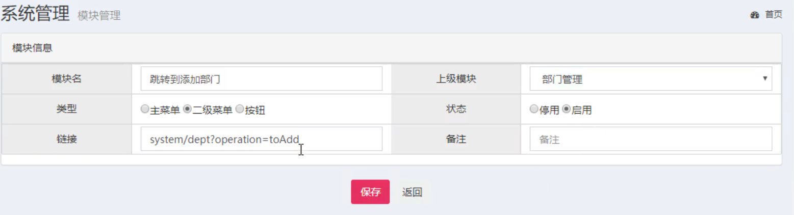
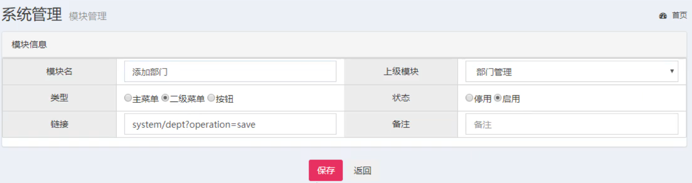
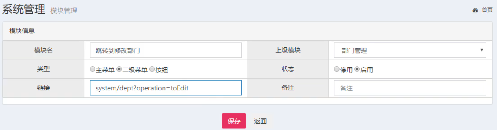
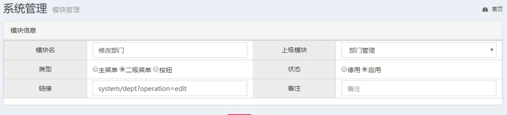
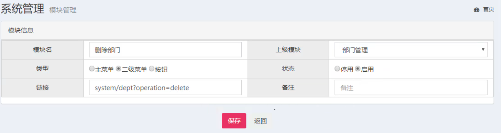

# web综合案例

## 学习目标

目标1：完成用户与角色的绑定功能

目标2：完成登陆功能的快速开发

目标3：完成登陆用户菜单控制的功能

目标4：完成登陆用户权限校验的功能

## 1.  用户与角色

### 1.1 绑定用户与角色关系数据准备

（1）在用户模块下的`\WEB-INF\pages\system\user\list.jsp`页面中找到`角色`按钮，对应的点击事件和函数的绑定都已完成，`roleList`方法中向后台`UserServelt`发送请求，执行`userRoleList`方法，传递参数用户id

（2）找到`UserServlet`，添加方法

```java
@Override
protected void doGet(HttpServletRequest request, HttpServletResponse response) throws ServletException, IOException {
    String operation = request.getParameter("operation");
    if("list".equals(operation)){
        this.list(request,response);
    }
    //中间的省略
    else if("userRoleList".equals(operation)){
        this.userRoleList(request,response);
    }
}
private void userRoleList(HttpServletRequest request, HttpServletResponse response) throws ServletException, IOException {
    String userId = request.getParameter("id");
    User user = userService.findById(userId);
    //将数据加载到指定区域，供页面获取
    request.setAttribute("user,user);
    //获取所有的角色列表
    List<Role> all = roleService.findAllRoleByUserId(userId);
    request.setAttribute("roleList",all);
    //跳转页面
    request.getRequestDispatcher("/WEB-INF/pages/system/user/role.jsp").forward(request,response);
}
```

同时从`day03`的课程资料中找到：`模块页面\user\role.jsp`，拷贝到工程`/WEB-INF/pages/system/user/`目录下

（3）在`RoleService`接口中添加查询方法，根据用户id查询角色列表

```java
List<Role> findAllRoleByUserId(String userId);
```

（4）在对应的实现类中去实现该方法

```java
@Override
public List<Role> findAllRoleByUserId(String userId) {
    SqlSession sqlSession = null;
    try{
        //1.获取SqlSession
        sqlSession = MapperFactory.getSqlSession();
        //2.获取Dao
        RoleDao roleDao = MapperFactory.getMapper(sqlSession,RoleDao.class);
        //3.调用Dao层操作
        return roleDao.findAllRoleByUserId(userId);
    }catch (Exception e){
        throw new RuntimeException(e);
        //记录日志
    }finally {
        try {
            TransactionUtil.close(sqlSession);
        }catch (Exception e){
            e.printStackTrace();
        }
    }
}
```

（5）在dao接口`RoleDao`中添加查询方法`findAllRoleByUserId`

```java
List<Role> findAllRoleByUserId(String userId);
```

（6）在映射配置文件`RoleDao.xml`中添加对应的查询

```xml
    <!--配置根据ID查询-->
<select id="findAllRoleByUserId" parameterType="java.lang.String" resultMap="BaseResultMap">
	SELECT
		role_id,
		NAME,
		CASE
			WHEN role_id IN (SELECT role_id FROM ss_role_user WHERE user_id = #{'userId'})
			THEN 'checked'
			ELSE ''
		END
		AS remark
	FROM
		ss_role
</select>
```

（7）修改页面`/WEB-INF/pages/system/user/role.jsp`，添加checked

```jsp
<form id="urform" action="${ctx}/system/user?operation=updateRole" method="post">
    <input type="hidden" name="userId" value="${user.id}"/>
    <div class="textbox" id="centerTextbox">
        <div style="text-align:left">
            <c:forEach items="${roleList}" var="role" varStatus="vs">
                <span style="padding:3px;margin-right:30px;width: 160px;display: inline-block">
        <input type="checkbox" name="roleIds" value="${role.id}" ${role.remark}/>${role.name}
                </span>
            </c:forEach>
        </div>
    </div>
</form>
```

（8）启动项目测试！

### 1.2 绑定用户与角色关系

现在要真正去绑定用户与角色的关系，前台页面提交表单后会将用户的id和选择的角色的id传递到后台servlet

（1）在`UserServlet`中添加新的方法

```java
@Override
protected void doGet(HttpServletRequest request, HttpServletResponse response) throws ServletException, IOException {
    String operation = request.getParameter("operation");
    if("list".equals(operation)){
        this.list(request,response);
    }
    //中间的省略
    else if("userRoleList".equals(operation)){
        this.userRoleList(request,response);
    }else if("updateRole".equals(operation)){
        this.updateRole(request,response);
    }
}
private void updateRole(HttpServletRequest request, HttpServletResponse response) throws IOException {
    String userId = request.getParameter("userId");
    String[] roleIds = request.getParameterValues("roleIds");
    userService.updateRole(userId,roleIds);
    //跳转回到页面list
    response.sendRedirect(request.getContextPath()+"/system/user?operation=list");
}
```

（2）在`UserService`接口中添加一个新的方法`updateRole`

```java
void updateRole(String userId, String[] roleIds);
```

（3）在对应的实现类中去实现

```java
@Overridepublic void updateRole(String userId, String[] roleIds) {    SqlSession sqlSession = null;    try{        //1.获取SqlSession        sqlSession = MapperFactory.getSqlSession();        //2.获取Dao        UserDao userDao = MapperFactory.getMapper(sqlSession,UserDao.class);        userDao.deleteRole(userId);        for(String roleId : roleIds){            userDao.updateRole(userId,roleId);        }        //4.提交事务        TransactionUtil.commit(sqlSession);    }catch (Exception e){        TransactionUtil.rollback(sqlSession);        throw new RuntimeException(e);        //记录日志    }finally {        try {            TransactionUtil.close(sqlSession);        }catch (Exception e){            e.printStackTrace();        }    }}
```

（4）在dao接口`UserDao`中添加两个方法

```java
void deleteRole(String userId);void updateRole(@Param("userId") String userId, @Param("roleId")String roleId);
```

（5）在该接口对应的映射配置文件中添加两个操作

```xml
<!--配置根据roleId删除关系表数据--><delete id="deleteRole" parameterType="java.lang.String">    delete from ss_role_user    where user_id = #{userId,jdbcType=VARCHAR}</delete><!--配置全字段插入，当某个字段没有值时，插入null--><insert id="updateRole" parameterType="map">    insert into ss_role_user (role_id, user_id)    values (#{roleId,jdbcType=VARCHAR}, #{userId,jdbcType=VARCHAR})</insert>
```

（6）启动项目进行测试！

## 2. 登陆

### 2.1 登陆功能快速开发

（1）找到项目`webapp/login.jsp`登陆页面，修改form表单提交的action路径

```html
<form action="${pageContext.request.contextPath}/login?operation=login" method="post"></form>
```

（2）在后台`UserServlet`添加登陆的方法

```java
@Overrideprotected void doGet(HttpServletRequest request, HttpServletResponse response) throws ServletException, IOException {    String operation = request.getParameter("operation");    if("list".equals(operation)){        this.list(request,response);    }    //中间省略    else if("login".equals(operation)){        this.login(request,response);    }}private void login(HttpServletRequest request, HttpServletResponse response) throws ServletException, IOException {    String email = request.getParameter("email");    String pwd = request.getParameter("password");    User user = userService.login(email,pwd);    if(user != null) {        request.getSession().setAttribute("loginUser", user);        //跳转页面        request.getRequestDispatcher("/WEB-INF/pages/home/main.jsp").forward(request, response);    }else{        response.sendRedirect(request.getContextPath()+"/login.jsp");    }}
```

（3）在因为层接口`UserService`中添加登陆的方法

```java
/**     * 根据邮箱和密码登录     * @param email     * @param pwd     * @return     */    User login(String email, String pwd);
```

（4）在对应的实现类中去实现登陆方法

```java
@Overridepublic User login(String email, String pwd) {    SqlSession sqlSession = null;    try{        //1.获取SqlSession        sqlSession = MapperFactory.getSqlSession();        //2.获取Dao        UserDao userDao = MapperFactory.getMapper(sqlSession,UserDao.class);        //3.调用Dao层操作        pwd = MD5Util.md5(pwd);        return userDao.findByEmailAndPwd(email,pwd);    }catch (Exception e){        throw new RuntimeException(e);        //记录日志    }finally {        try {            TransactionUtil.close(sqlSession);        }catch (Exception e){            e.printStackTrace();        }    }}
```

（5）在`UserDao`接口中添加查询方法

```java
User findByEmailAndPwd(@Param("email")String email, @Param("password")String pwd);
```

（6）在`UserDao.xml`中添加查询

```xml
<select id="findByEmailAndPwd" parameterType="map" resultMap="BaseResultMap">    select    <include refid="Base_Column_List"/>    from ss_user    where email = #{email,jdbcType=VARCHAR} and password = #{password,jdbcType=VARCHAR}</select>
```

（7）将原本在`webapp/pages/home`下的所有页面统一挪到`/WEB-INF/pages`下，注意是连同`home`目录一起挪

（8）修改`/WEB-INF/pages/home/main.jsp`内容区的路径

```jsp
<!-- 内容区域 --><div class="content-wrapper">    <iframe id="iframe" name="iframe"            style="overflow:visible;"            scrolling="auto"            frameborder="no" height="100%" width="100%"            src="${ctx}/system/user?operation=home"></iframe></div>
```

（9）在后台`UserServlet`中添加方法

```java
@Overrideprotected void doGet(HttpServletRequest request, HttpServletResponse response) throws ServletException, IOException {    String operation = request.getParameter("operation");    if("list".equals(operation)){        this.list(request,response);    }    //中间省略    else if("home".equals(operation)){        this.home(request,response);    }}private void home(HttpServletRequest request, HttpServletResponse response) throws ServletException, IOException {    request.getRequestDispatcher("/WEB-INF/pages/home/home.jsp").forward(request, response);}
```

（10）启动项目测试

### 2.2 用户菜单控制数据准备

我们先来完成登陆后的注销操作，这是一套的

（1）找到`/WEB-INF/pages/home/header.jsp`中找到注销，添加请求连接

```jsp
<div class="pull-right">    <a href="${ctx}/system/user?operation=logout" class="btn btn-default btn-flat">注销</a></div>
```

（2）在后台`UserServlet`中添加对应的方法logout

```java
@Overrideprotected void doGet(HttpServletRequest request, HttpServletResponse response) throws ServletException, IOException {    String operation = request.getParameter("operation");    if("list".equals(operation)){        this.list(request,response);    }    //中间的省略    else if("login".equals(operation)){        this.login(request,response);    }else if("logout".equals(operation)){        this.logout(request,response);    }else if("home".equals(operation)){        this.home(request,response);    }}private void logout(HttpServletRequest request, HttpServletResponse response) throws ServletException, IOException {    request.getSession().removeAttribute("loginUser");    response.sendRedirect(request.getContextPath()+"/login.jsp");}
```

（3）在用户登陆的时候需要去查询该用户对应的角色对应的所有模块，因此需要在后台的`UserServlet`中修改用户登陆的方法，添加数据的查询

```java
private void login(HttpServletRequest request, HttpServletResponse response) throws ServletException, IOException {    String email = request.getParameter("email");    String pwd = request.getParameter("password");    User user = userService.login(email,pwd);    if(user != null) {        request.getSession().setAttribute("loginUser", user);        //如果登录成功，加载该用户对应的角色对应的所有模块        List<Module> moduleList = userService.findModuleById(user.getId());        request.setAttribute("moduleList",moduleList);        //跳转页面        request.getRequestDispatcher("/WEB-INF/pages/home/main.jsp").forward(request, response);    }else{        response.sendRedirect(request.getContextPath()+"/login.jsp");    }}
```

（4）在`UserService`接口中添加方法`findModuleById`

```java
/**     * 根据用户id查询所有可以操作的菜单对象     * @param id 用户的id     * @return     */    List<Module> findModuleById(String id);
```

（5）在实现类中去实现该方法

```java
@Overridepublic List<Module> findModuleById(String id) {    SqlSession sqlSession = null;    try{        //1.获取SqlSession        sqlSession = MapperFactory.getSqlSession();        //2.获取Dao        ModuleDao moduleDao = MapperFactory.getMapper(sqlSession,ModuleDao.class);        //3.调用Dao层操作        return moduleDao.findModuleByUserId(id);    }catch (Exception e){        throw new RuntimeException(e);        //记录日志    }finally {        try {            TransactionUtil.close(sqlSession);        }catch (Exception e){            e.printStackTrace();        }    }}
```

（6）在`ModuleDao`接口中添加查询方法`findModuleByUserId`

```java
List<Module> findModuleByUserId(String id);
```

（7）在`ModuleDao.xml`中添加对应的查询

```xml
<select id="findModuleByUserId" parameterType="java.lang.String" resultMap="BaseResultMap">        /*userid->用户角色关系表->roleid->角色模块关系表->moduleid->module信息*/        SELECT DISTINCT          m.module_id, m.parent_id, m.name, m.ctype, m.state, m.curl, m.remark        FROM            ss_module AS m,            ss_role_module AS rm,            ss_role_user AS ru        WHERE            m.module_id = rm.module_id        AND	rm.role_id = ru.role_id        AND	ru.user_id = #{id,jdbcType=VARCHAR}    </select>
```

至此：用户的角色对应的模块数据已查询出来了，后续就是要在页面进行控制展示

### 2.3 登陆用户菜单控制

（1）找到`/WEB-INF/pages/home/aside.jsp`页面，添加用户菜单的展示

```jsp
<!-- sidebar menu: : style can be found in sidebar.less --><ul class="sidebar-menu">    <li class="header">菜单</li>    <c:forEach items="${moduleList}" var="item">        <c:if test="${item.ctype==0}">            <li class="treeview">                <a href="#">                    <i class="fa fa-cube"></i> <span>${item.name}</span>                    <span class="pull-right-container"><i class="fa fa-angle-left pull-right"></i></span>                </a>                <ul class="treeview-menu">                    <c:forEach items="${moduleList}" var="item2">                        <c:if test="${item2.ctype==1 && item2.parentId == item.id}">                            <li id="${item2.id}">                                <a onclick="setSidebarActive(this)" href="${ctx}/${item2.curl}" target="iframe">                                    <i class="fa fa-circle-o"></i>${item2.name}                                </a>                            </li>                        </c:if>                    </c:forEach>                </ul>            </li>        </c:if>    </c:forEach>
```

启动项目进行测试

## 3.权限校验

### 3.1 获取请求url

（1）创建过滤器：com.itheima.web.filters.AuthorFilter

```java
@WebFilter(value = "/*")public class AuthorFilter implements Filter {    private FilterConfig filterConfig;    /**     * 初始化方法，获取过滤器的配置对象     * @param filterConfig     * @throws ServletException     */    @Override    public void init(FilterConfig filterConfig) throws ServletException {        this.filterConfig = filterConfig;    }    @Override    public void doFilter(ServletRequest req, ServletResponse resp, FilterChain chain) throws IOException, ServletException {        //1.定义和协议相关的请求和响应对象        HttpServletRequest request ;        HttpServletResponse response;        try{            //2.把参数转换成协议相关的对象            request = (HttpServletRequest)req;            response = (HttpServletResponse)resp;            //1.获取本次操作            String url = request.getRequestURI();            String queryString = request.getQueryString();            //1.当前获取到的url：   /system/dept            url = url.substring(1);            //2.当前获取到的查询参数：operation=list       operation=toEdit&id=100            int index = queryString.indexOf('&');            if(index != -1){                queryString = queryString.substring(0,index);            }            url = url + "?" + queryString;            //2.获取到当前登录人允许的操作            //3.比对本次操作是否在当前登录人允许的操作范围内            //3.1如果允许，放行            //3.2不允许跳转到非法访问页            //6.放行            chain.doFilter(request,response);        }catch (Exception e){            e.printStackTrace();        }    }    @Override    public void destroy() {        //可以做一些清理操作    }}
```

### 3.2 获取登陆用户可执行操作

（1）登陆成功后需要将用户的觉得对应的模块信息存放到session，找到`UserServlet`中的登陆方法`login`，

```java
private void login(HttpServletRequest request, HttpServletResponse response) throws ServletException, IOException {    String email = request.getParameter("email");    String pwd = request.getParameter("password");    User user = userService.login(email,pwd);    if(user != null) {        request.getSession().setAttribute("loginUser", user);        //如果登录成功，加载该用户对应的角色对应的所有模块        List<Module> moduleList = userService.findModuleById(user.getId());        request.setAttribute("moduleList",moduleList);        //当前登录用户对应的可操作模块的所有url拼接成一个大的字符串        StringBuffer sbf = new StringBuffer();        for(Module m: moduleList){            sbf.append(m.getCurl());            sbf.append(',');        }        request.getSession().setAttribute("authorStr",sbf.toString());        //跳转页面        request.getRequestDispatcher("/WEB-INF/pages/home/main.jsp").forward(request, response);    }else{        response.sendRedirect(request.getContextPath()+"/login.jsp");    }}
```

（2）修改`AuthorFilter`

```java
@Overridepublic void doFilter(ServletRequest req, ServletResponse resp, FilterChain chain) throws IOException, ServletException {    //1.定义和协议相关的请求和响应对象    HttpServletRequest request ;    HttpServletResponse response;    HttpSession session;    try{        //2.把参数转换成协议相关的对象        request = (HttpServletRequest)req;        response = (HttpServletResponse)resp;        session = request.getSession();        //1.获取本次操作        String url = request.getRequestURI();        //.css   .js    .png   .jpg   .index        if(url.endsWith(".css")           || url.endsWith(".js")           || url.endsWith(".png")           || url.endsWith(".jpg")           || url.endsWith("index.jsp")           || url.endsWith("login.jsp")){            chain.doFilter(request,response);            return;        }        String queryString = request.getQueryString();        if(queryString.endsWith("operation=login")){            chain.doFilter(request,response);            return;        }        //1.当前获取到的url：   /system/dept        url = url.substring(1);        //2.当前获取到的查询参数：operation=list       operation=toEdit&id=100        int index = queryString.indexOf('&');        if(index != -1){            queryString = queryString.substring(0,index);        }        url = url + "?" + queryString;        //2.获取到当前登录人允许的操作        String authorStr = session.getAttribute("authorStr").toString();        //3.比对本次操作是否在当前登录人允许的操作范围内        //3.1如果允许，放行        //3.2不允许跳转到非法访问页        //6.放行        chain.doFilter(request,response);    }catch (Exception e){        e.printStackTrace();    }}
```

（3）启动项目在模块管理功能中去添加一些数据，如下所示











然后需要在角色管理中为对应的角色进行授权

### 3.3 权限校验

开始授权

（1）从`day03`的课程资料中找到`模块页面/unauthorized.jsp`，拷贝到项目的`webapp`下即可

（2）更改`AuthorFilter`，

```java
@Overridepublic void doFilter(ServletRequest req, ServletResponse resp, FilterChain chain) throws IOException, ServletException {    HttpServletRequest request ;    HttpServletResponse response;    HttpSession session;    try{        request = (HttpServletRequest)req;        response = (HttpServletResponse)resp;        session = request.getSession();        //1.获取本次操作        String url = request.getRequestURI();        //.css   .js    .png   .jpg   .index        if(url.endsWith(".css")           || url.endsWith(".js")           || url.endsWith(".png")           || url.endsWith(".jpg")           || url.endsWith("index.jsp")           || url.endsWith("unauthorized.jsp")           || url.endsWith("login.jsp")){            chain.doFilter(request,response);            return;        }        String queryString = request.getQueryString();        if(queryString.endsWith("operation=login")           ||queryString.endsWith("operation=home")           ||queryString.endsWith("operation=logout")){            chain.doFilter(request,response);            return;        }        //1.当前获取到的url：   /system/dept        url = url.substring(1);        //2.当前获取到的查询参数：operation=list       operation=toEdit&id=100        int index = queryString.indexOf('&');        if(index != -1){            queryString = queryString.substring(0,index);        }        url = url + "?" + queryString;        //2.获取到当前登录人允许的操作        String authorStr = session.getAttribute("authorStr").toString();        //3.比对本次操作是否在当前登录人允许的操作范围内        if(authorStr.contains(url)){            //3.1如果允许，放行            chain.doFilter(request,response);            return;        }else{            //3.2不允许跳转到非法访问页            response.sendRedirect(request.getContextPath()+"/unauthorized.jsp");        }    }catch (Exception e){        e.printStackTrace();    }}
```

（3）对于页面上的元素，如果没有操作权限，我们直接让用户看不到即可，怎么操作呢？在页面上做一个判断，我们举一个例子，其他操作都是一样的

找到`/WEB-INF/pages/system/user/list.jsp`，

```jsp
<div class="btn-group">    <c:if test="${sessionScope.authorStr.contains('system/user?operation=toAdd')}">        <button type="button" class="btn btn-default" title="新建" onclick='location.href="${ctx}/system/user?operation=toAdd"'><i class="fa fa-file-o"></i> 新建</button>    </c:if>    <button type="button" class="btn btn-default" title="删除" onclick='deleteById()'><i class="fa fa-trash-o"></i> 删除</button>    <button type="button" class="btn btn-default" title="刷新" onclick="window.location.reload();"><i class="fa fa-refresh"></i> 刷新</button>    <c:if test="${sessionScope.authorStr.contains('system/user?operation=userRoleList')}">        <button type="button" class="btn btn-default" title="角色" onclick="roleList()"><i class="fa fa-user-circle-o"></i> 角色</button>    </c:if></div>
```

（4）启动项目，测试

