EL&Filter&Listener-授课

# 1 EL表达式和JSTL

## 1.1 EL表达式

### 1.1.1 EL表达式概述

**基本概念**

EL表达式，全称是Expression Language。意为表达式语言。它是Servlet规范中的一部分，是JSP2.0规范加入的内容。其作用是用于在JSP页面中获取数据，从而让我们的JSP脱离java代码块和JSP表达式。

**基本语法**

EL表达式的语法格式非常简单，写为 <b><font color='red' size='5'>${表达式内容}</font></b>

例如：在浏览器中输出请求域中名称为message的内容。

假定，我们在请求域中存入了一个名称为message的数据（`request.setAttribute("message","EL");`），此时在jsp中获取的方式，如下表显示：

| Java代码块                                                   | JSP表达式                              | EL表达式                              |
| :----------------------------------------------------------- | :------------------------------------- | :------------------------------------ |
| `<%<br/> <br/> String message = (String)request.getAttribute("message");<br/> out.write(message);<br/>%>` | `<%=request.getAttribute("message")%>` | <font color='red'>`${message}`</font> |

通过上面我们可以看出，都可以从请求域中获取数据，但是EL表达式写起来是最简单的方式。这也是以后我们在实际开发中，当使用JSP作为视图时，绝大多数都会采用的方式。

### 1.1.2 EL表达式的入门案例

#### 第一步：创建JavaWeb工程


#### 第二步：创建jsp页面

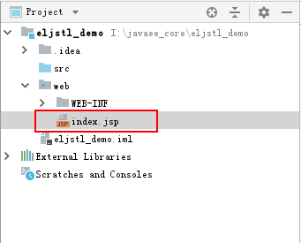

#### 第三步：在JSP页面中编写代码

```jsp
<%@ page contentType="text/html;charset=UTF-8" language="java" %>
<html>
  <head>
    <title>EL表达式入门案例</title>
  </head>
  <body>
    <%--使用java代码在请求域中存入一个名称为message的数据--%>
    <% request.setAttribute("message","Expression Language");%>

    Java代码块获取：<% out.print(request.getAttribute("message"));%>
    <br/>
    JSP表达式获取：<%=request.getAttribute("message")%>
    <br/>
    EL表达式获取：${message}
  </body>
</html>
```

#### 第四步：部署工程


#### 第五步：运行测试

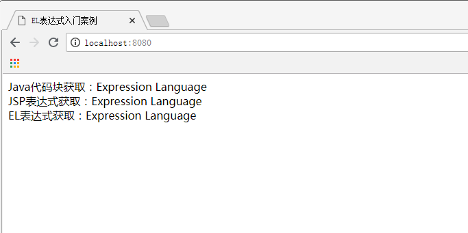

### 1.1.2 EL表达式基本用法

在前面的概述介绍中，我们介绍了EL表达式的作用，它就是用于获取数据的，那么它是从哪获取数据呢？

#### 1）获取四大域中的数据

它只能从四大域中获取数据，调用的就是`findAttribute(name,value);`方法，根据名称由小到大逐个域中查找，找到就返回，找不到就什么都不显示。

它可以获取对象，可以是对象中关联其他对象，可以是一个List集合，也可以是一个Map集合。具体代码如下：

**创建两个实体类，User和Address**

```java
/**
 * 用户的实体类
 * @author 黑马程序员
 * @Company http://www.itheima.com
 */
public class User implements Serializable{

	private String name = "黑马程序员";
	private int age = 18;
	private Address address = new Address();
	
	public String getName() {
		return name;
	}
	public void setName(String name) {
		this.name = name;
	}
	public int getAge() {
		return age;
	}
	public void setAge(int age) {
		this.age = age;
	}
	public Address getAddress() {
		return address;
	}
	public void setAddress(Address address) {
		this.address = address;
	}	
}
```

```java
/**
 * 地址的实体类
 * @author 黑马程序员
 * @Company http://www.itheima.com
 */
public class Address implements Serializable {

	private String province = "北京";
	private String city = "昌平区";
	public String getProvince() {
		return province;
	}
	public void setProvince(String province) {
		this.province = province;
	}
	public String getCity() {
		return city;
	}
	public void setCity(String city) {
		this.city = city;
	}
}
```

**JSP代码**

```jsp
<%@ page language="java" import="java.util.*" pageEncoding="UTF-8"%>
<%@ page import="com.itheima.domain.User" %>
<!DOCTYPE HTML PUBLIC "-//W3C//DTD HTML 4.01 Transitional//EN">
<html>
	<head>
		<title>EL入门</title>
	</head>
	<body>
		<%--EL表达式概念：
				它是Expression Language的缩写。它是一种替换jsp表达式的语言。
			EL表达式的语法：
				${表达式}
				表达式的特点：有明确的返回值。
				EL表达式就是把内容输出到页面上
			EL表达式的注意事项：
				1.EL表达式没有空指针异常
				2.EL表达式没有数组下标越界
				3.EL表达式没有字符串拼接
			EL表达式的数据获取：
				它只能在四大域对象中获取数据，不在四大域对象中的数据它取不到。
				它的获取方式就是findAttribute(String name)
		 --%>
		 <br/>-----------获取对象数据---------------------<br/>
		 <% //1.把用户信息存入域中
		 	User user = new User();
		 	pageContext.setAttribute("u",user);
		  %>
		  ${u}===============输出的是内存地址<%--就相当于调用此行代码<%=pageContext.findAttribute("u")%> --%><br/>
		  ${u.name}<%--就相当于调用此行代码<% User user = (User) pageContext.findAttribute("u");out.print(user.getName());%> --%><br/>
		  ${u.age}
		 <br/>-----------获取关联对象数据------------------<br/>
		 ${u.address}==========输出的address对象的地址<br/>
		 ${u.address.province}${u.address.city}<br/>
		 ${u["address"]['province']}
		 <br/>-----------获取数组数据---------------------<br/>
		 <% String[] strs = new String[]{"He","llo","Expression","Language"}; 
		 	pageContext.setAttribute("strs", strs);
		 %>
		 ${strs[0]}==========取的数组中下标为0的元素<br/>
		 ${strs[3]}
		 ${strs[5]}===========如果超过了数组的下标，则什么都不显示<br/>
		 ${strs["2"]}=========会自动为我们转换成下标<br/>
		 ${strs['1']}
		 <br/>-----------获取List集合数据-----------------<br/>
		 <% List<String> list = new ArrayList<String>();
		 	list.add("AAA");
		 	list.add("BBB");
		 	list.add("CCC");
		 	list.add("DDD");
		 	pageContext.setAttribute("list", list);
		  %>
		 ${list}<br/>
		 ${list[0] }<br/>
		 ${list[3] }<br/>	 
		 <br/>-----------获取Map集合数据------------------<br/>
		 <% Map<String,User> map = new HashMap<String,User>();
		 	map.put("aaa",new User());
		 	pageContext.setAttribute("map", map);
		  %>
		  ${map}<br/>
		  ${map.aaa}<%--获取map的value，是通过get(Key) --%><br/>
		  ${map.aaa.name}${map.aaa.age}<br/>
		  ${map["aaa"].name }
	</body>
</html>
```

运行结果如图：

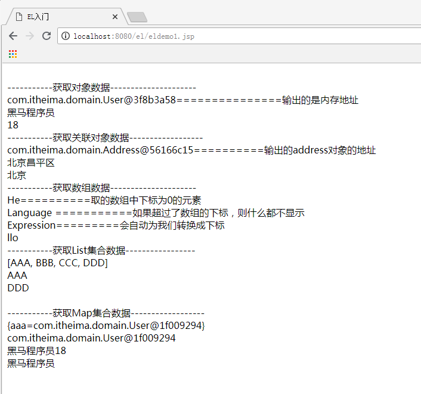

#### 2）EL表达式的注意事项

在使用EL表达式时，它帮我们做了一些处理，使我们在使用时可以避免一些错误。它没有空指针异常，没有数组下标越界，没有字符串拼接。

```jsp
<%@ page contentType="text/html;charset=UTF-8" language="java" %>
<html>
  <head>
    <title>EL表达式的注意事项</title>
  </head>
  <body>
    <%--EL表达式的三个没有--%>
    第一个：没有空指针异常<br/>
    <% String str = null;
       request.setAttribute("testNull",str);
    %>
    ${testNull}
    <hr/>
    第二个：没有数组下标越界<br/>
    <% String[] strs = new String[]{"a","b","c"};
       request.setAttribute("strs",strs);
    %>
    取第一个元素：${strs[0]}
    取第六个元素：${strs[5]}
    <hr/>
    第三个：没有字符串拼接<br/>
    <%--${strs[0]+strs[1]}--%>
    ${strs[0]}+${strs[1]}
  </body>
</html>
```

运行结果图：

\\

#### 3）EL表达式的使用细节

EL表达式除了能在四大域中获取数据，同时它可以访问其他隐式对象，并且访问对象有返回值的方法.

#### 4）EL表达式的运算符

EL表达式中运算符如下图所示，它们都是一目了然的：


但是有两个特殊的运算符，使用方式的代码如下：

```jsp
<%@ page language="java" import="java.util.*" pageEncoding="UTF-8"%>
<%@ page import="com.itheima.domain.User" %>
<!DOCTYPE HTML PUBLIC "-//W3C//DTD HTML 4.01 Transitional//EN">
<html>
	<head>
		<title>EL两个特殊的运算符</title>
	</head>
	<body>
		<%--empty运算符：
			它会判断：对象是否为null，字符串是否为空字符串，集合中元素是否是0个
		--%>
		<% String str = null;
		  String str1 = "";
		  List<String> slist = new ArrayList<String>();
		  pageContext.setAttribute("str", str);
		  pageContext.setAttribute("str1", str1);
		  pageContext.setAttribute("slist", slist);
		%>
		${empty str}============当对象为null返回true<br/>
		${empty str1 }==========当字符串为空字符串是返回true(注意：它不会调用trim()方法)<br>
		${empty slist}==========当集合中的元素是0个时，是true
		<hr/>
		<%--三元运算符 
			 条件?真:假
		--%>
		<% request.setAttribute("gender", "female"); %>
		<input type="radio" name="gender" value="male" ${gender eq "male"?"checked":""} >男
		<input type="radio" name="gender" value="female" ${gender eq "female"?"checked":""}>女
	</body>
</html>
```

运行结果图：

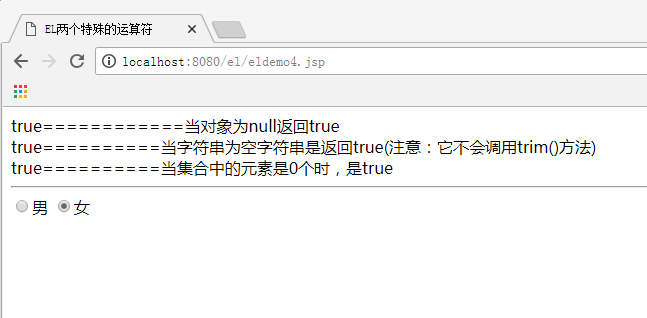

### 1.1.3 EL表达式的11个隐式对象

#### 1）隐式对象介绍

EL表达式也为我们提供隐式对象，可以让我们不声明直接来使用，十一个对象见下表，需要注意的是，它和JSP的隐式对象不是一回事：

| EL中的隐式对象   | 类型                          | 对应JSP隐式对象 | 备注                                    |
| ---------------- | ----------------------------- | --------------- | --------------------------------------- |
| PageContext      | Javax.serlvet.jsp.PageContext | PageContext     | 完全一样                                |
| ApplicationScope | Java.util.Map                 | 没有            | 应用层范围                              |
| SessionScope     | Java.util.Map                 | 没有            | 会话范围                                |
| RequestScope     | Java.util.Map                 | 没有            | 请求范围                                |
| PageScope        | Java.util.Map                 | 没有            | 页面层范围                              |
| Header           | Java.util.Map                 | 没有            | 请求消息头key，值是value（一个）        |
| HeaderValues     | Java.util.Map                 | 没有            | 请求消息头key，值是数组（一个头多个值） |
| Param            | Java.util.Map                 | 没有            | 请求参数key，值是value（一个）          |
| ParamValues      | Java.util.Map                 | 没有            | 请求参数key，值是数组（一个名称多个值） |
| InitParam        | Java.util.Map                 | 没有            | 全局参数，key是参数名称，value是参数值  |
| Cookie           | Java.util.Map                 | 没有            | Key是cookie的名称，value是cookie对象    |

## 1.2 JSTL

### 1.2.1 JSTL概述

#### 1）简介

JSTL的全称是：JSP Standard Tag Libary。它是JSP中标准的标签库。它是由Apache实现的。

它由以下5个部分组成：

| 组成      | 作用         | 说明                           |
| --------- | ------------ | ------------------------------ |
| Core      | 核心标签库。 | 通用逻辑处理                   |
| Fmt       | 国际化有关。 | 需要不同地域显示不同语言时使用 |
| Functions | EL函数       | EL表达式可以使用的方法         |
| SQL       | 操作数据库。 | 不用                           |
| XML       | 操作XML。    | 不用                           |

#### 2）使用要求

要想使用JSTL标签库，在javaweb工程中需要导入坐标。首先是在工程的WEB-INF目录中创建一个lib目录，接下来把jstl的jar拷贝到lib目录中，最后在jar包上点击右键，然后选择【Add as Libary】添加。如下图所示：

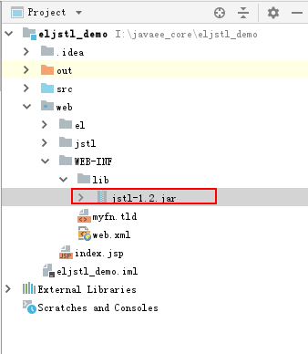

### 1.2.2 核心标签库

在我们实际开发中，用到的jstl标签库主要以核心标签库为准，偶尔会用到国际化标签库的标签。下表中把我们经常可能用到的标签列在此处，其余标签库请同学们参考【JSTL标签库.doc】文档。

| 标签名称                             | 功能分类 | 分类       | 作用             |
| ------------------------------------ | -------- | ---------- | ---------------- |
| `<c:if>`                             | 流程控制 | 核心标签库 | 用于判断         |
| `<c:choose> ,<c:when>,<c:otherwise>` | 流程控制 | 核心标签库 | 用于多个条件判断 |
| `<c:foreache>`                       | 迭代操作 | 核心标签库 | 用于循环遍历     |

### 1.2.3 JSTL使用

```jsp
<%@ page language="java" import="java.util.*" pageEncoding="UTF-8"%>
<%--导入jstl标签库 --%>
<%@ taglib uri="http://java.sun.com/jsp/jstl/core" prefix="c" %>
<!DOCTYPE HTML PUBLIC "-//W3C//DTD HTML 4.01 Transitional//EN">
<html>
  <head>
    <title>JSTL的常用标签</title>
  </head>
  <body>
    <%-- c:if  c:choose   c:when c:otherwise --%>
    <% pageContext.setAttribute("score","F"); %>
    <c:if test="${pageScope.score eq 'A' }">
    	优秀
    </c:if>
    <c:if	test="${pageScope.score eq 'C' }">
    	一般
    </c:if>
    <hr/>
    <c:choose>
    	<c:when test="${pageScope.score eq 'A' }">
    		AAA
    	</c:when>
    	<c:when test="${pageScope.score eq 'B' }">BBB
    	</c:when>
    	<c:when test="${pageScope.score eq 'C' }">CCC
    	</c:when>
    	<c:when test="${pageScope.score eq 'D' }">DDD
    	</c:when>
    	<c:otherwise>其他</c:otherwise>
    </c:choose>
    
    <%-- c:forEach 它是用来遍历集合的
    	 属性：
    	 	items：要遍历的集合，它可以是EL表达式取出来的
    	 	var：把当前遍历的元素放入指定的page域中。 var的取值就是key,当前遍历的元素就是value
    	 		注意：它不能支持EL表达式，只能是字符串常量
    	 	begin:开始遍历的索引
    	 	end:结束遍历的索引
    	 	step：步长。i+=step
    	 	varStatus：它是一个计数器对象。里面有两个属性，一个是用于记录索引。一个是用于计数。
    	 			   索引是从0开始。计数是从1开始
    --%>
    <hr/>
    <% List<String> list = new ArrayList<String>();
       list.add("AAA");
       list.add("BBB");
       list.add("CCC");
       list.add("DDD");
       list.add("EEE");
       list.add("FFF");
       list.add("GGG");
       list.add("HHH");
       list.add("III");
       list.add("JJJ");
       list.add("KKK");
       list.add("LLL");
       pageContext.setAttribute("list",list);
     %>
	<c:forEach items="${list}" var="s" begin="1" end="7" step="2">
    	${s}<br/>
    </c:forEach>
    <hr/>
    <c:forEach begin="1" end="9" var="num">
    	<a href="#">${num}</a>
    </c:forEach>
    <hr/>
    <table>
    	<tr>
    		<td>索引</td>
    		<td>序号</td>
    		<td>信息</td>
    	</tr>
    <c:forEach items="${list}" var="s" varStatus="vs">
    	<tr>
    		<td>${vs.index}</td>
    		<td>${vs.count}</td>
    		<td>${s}</td>
    	</tr>
    </c:forEach>
    </table>
  </body>
</html>
```

# 2 Servlet规范中的过滤器-Filter

## 2.1 过滤器入门

### 2.1.1 过滤器概念及作用

过滤器——Filter，它是JavaWeb三大组件之一。另外两个是Servlet和Listener。

它是在2000年发布的Servlet2.3规范中加入的一个接口。是Servlet规范中非常实用的技术。

它可以对web应用中的所有资源进行拦截，并且在拦截之后进行一些特殊的操作。

常见应用场景：URL级别的权限控制；过滤敏感词汇；中文乱码问题等等。

### 2.1.2 过滤器的入门案例

#### 1）前期准备

**创建JavaWeb工程**

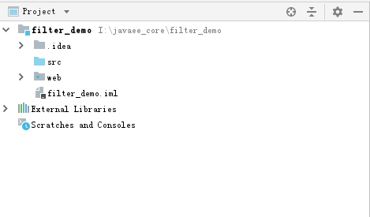

**编写和配置接收请求用的Servlet**

```java
/**
 * 用于接收和处理请求的Servlet
 * @author 黑马程序员
 * @Company http://www.itheima.com
 */
public class ServletDemo1 extends HttpServlet {

    /**
     * 处理请求的方法
     * @param req
     * @param resp
     * @throws ServletException
     * @throws IOException
     */
    @Override
    protected void doGet(HttpServletRequest req, HttpServletResponse resp) throws ServletException, IOException {
        System.out.println("ServletDemo1接收到了请求");
        req.getRequestDispatcher("/WEB-INF/pages/success.jsp").forward(req,resp);
    }

    @Override
    protected void doPost(HttpServletRequest req, HttpServletResponse resp) throws ServletException, IOException {
       doGet(req,resp);
    }
}
```

```xml
<?xml version="1.0" encoding="UTF-8"?>
<web-app xmlns="http://xmlns.jcp.org/xml/ns/javaee"
         xmlns:xsi="http://www.w3.org/2001/XMLSchema-instance"
         xsi:schemaLocation="http://xmlns.jcp.org/xml/ns/javaee
                      http://xmlns.jcp.org/xml/ns/javaee/web-app_3_1.xsd"
         version="3.1"
         metadata-complete="true">
    
    <!--配置Servlet-->
    <servlet>
        <servlet-name>ServletDemo1</servlet-name>
        <servlet-class>com.itheima.web.servlet.ServletDemo1</servlet-class>
    </servlet>
    <servlet-mapping>
        <servlet-name>ServletDemo1</servlet-name>
        <url-pattern>/ServletDemo1</url-pattern>
    </servlet-mapping>
</web-app>

```

**编写index.jsp**

```jsp
<%-- Created by IntelliJ IDEA. --%>
<%@ page contentType="text/html;charset=UTF-8" language="java" %>
<html>
  <head>
    <title>主页面</title>
  </head>
  <body>
    <a href="${pageContext.request.contextPath}/ServletDemo1">访问ServletDemo1</a>
  </body>
</html>
```

**编写success.jsp**

```jsp
<%@ page contentType="text/html;charset=UTF-8" language="java" %>
<html>
<head>
    <title>成功页面</title>
</head>
<body>
<%System.out.println("success.jsp执行了");%>
执行成功！
</body>
</html>

```

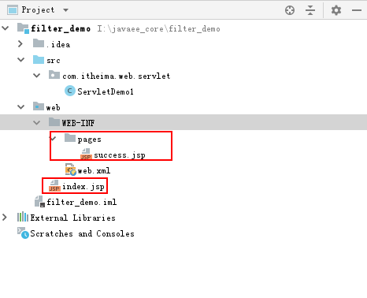

#### 2）过滤器的编写步骤

**编写过滤器**

```java
/**
 * Filter的入门案例
 * @author 黑马程序员
 * @Company http://www.itheima.com
 */
public class FilterDemo1 implements Filter {

    /**
     * 过滤器的核心方法
     * @param request
     * @param response
     * @param chain
     * @throws IOException
     * @throws ServletException
     */
    @Override
    public void doFilter(ServletRequest request, ServletResponse response, FilterChain chain) throws IOException, ServletException {
        /**
         * 如果不写此段代码，控制台会输出两次：FilterDemo1拦截到了请求。
         */
        HttpServletRequest req = (HttpServletRequest) request;
        String requestURI = req.getRequestURI();
        if (requestURI.contains("favicon.ico")) {
            return;
        }
        System.out.println("FilterDemo1拦截到了请求");
    }
}
```

**配置过滤器**

```xml
<!--配置过滤器-->
<filter>
    <filter-name>FilterDemo1</filter-name>
    <filter-class>com.itheima.web.filter.FilterDemo1</filter-class>
</filter>
<filter-mapping>
    <filter-name>FilterDemo1</filter-name>
    <url-pattern>/*</url-pattern>
</filter-mapping>
```

#### 3）测试部署

**部署项目**

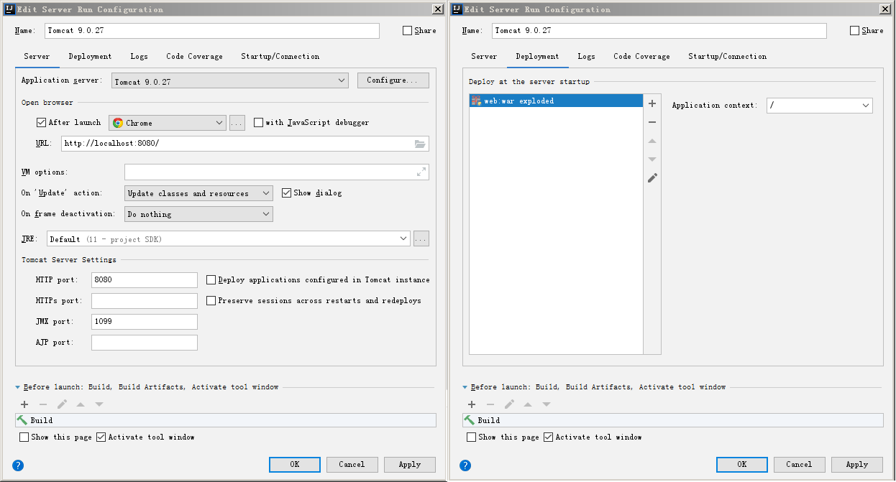

**测试结果**

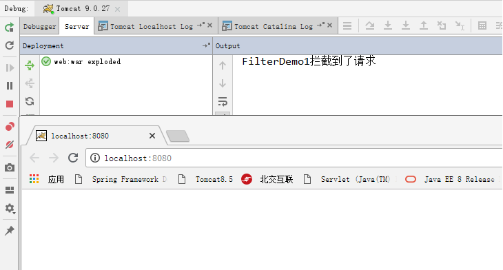

**案例的问题分析及解决**

当我们启动服务，在地址栏输入访问地址后，发现浏览器任何内容都没有，控制台却输出了【FilterDemo1拦截到了请求】，也就是说在访问任何资源的时候，都先经过了过滤器。

这是因为：我们在配置过滤器的拦截规则时，使用了<font color='red' size="5"><b>/*</b></font>,表明访问当前应用下任何资源，此过滤器都会起作用。除了这种全部过滤的规则之外，它还支持特定类型的过滤配置。我们可以稍作调整，就可以不用加上面那段过滤图标的代码了。修改的方式如下：


现在的问题是，我们拦截下来了，点击链接发送请求，运行结果是：

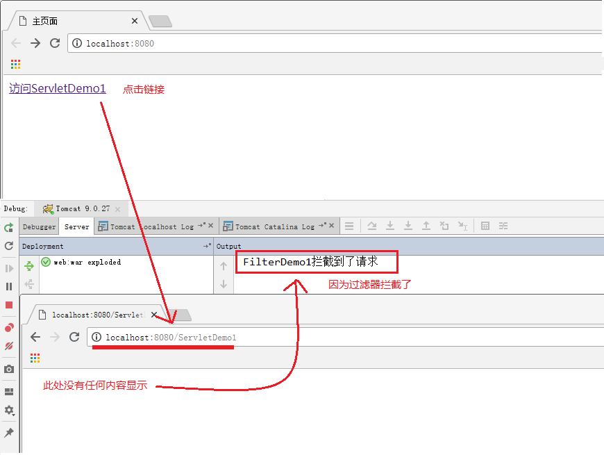

需要对过滤器执行放行操作，才能让他继续执行，那么如何放行的？

我们需要使用`FilterChain`中的`doFilter`方法放行。

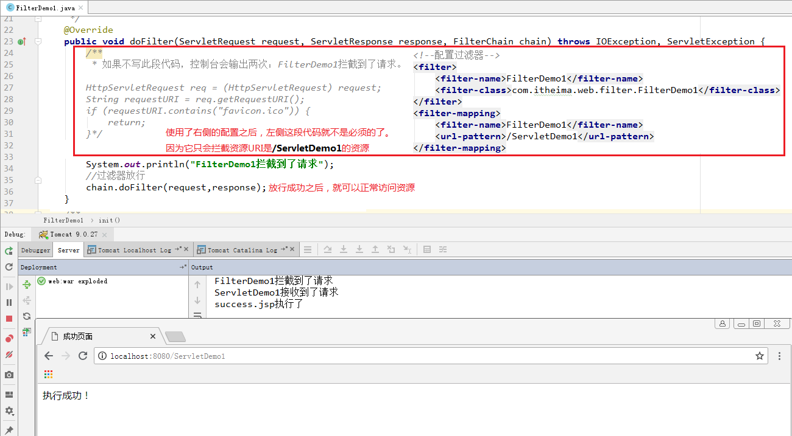

## 2.2 过滤器的细节

### 2.2.1 过滤器API介绍

#### 1）Filter

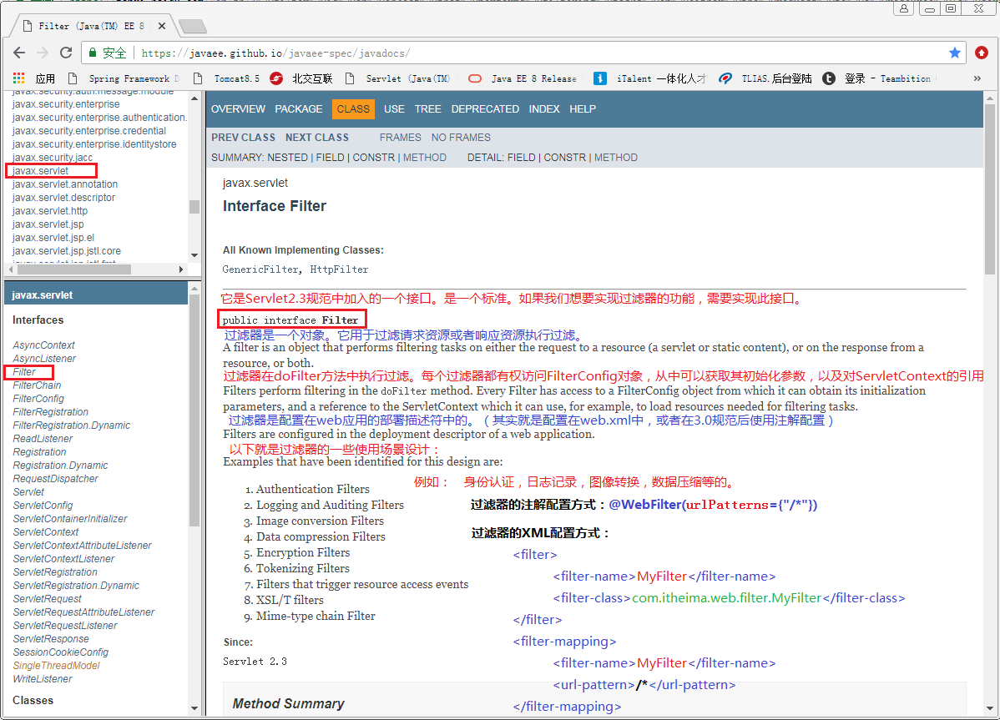


#### 2）FilterConfig

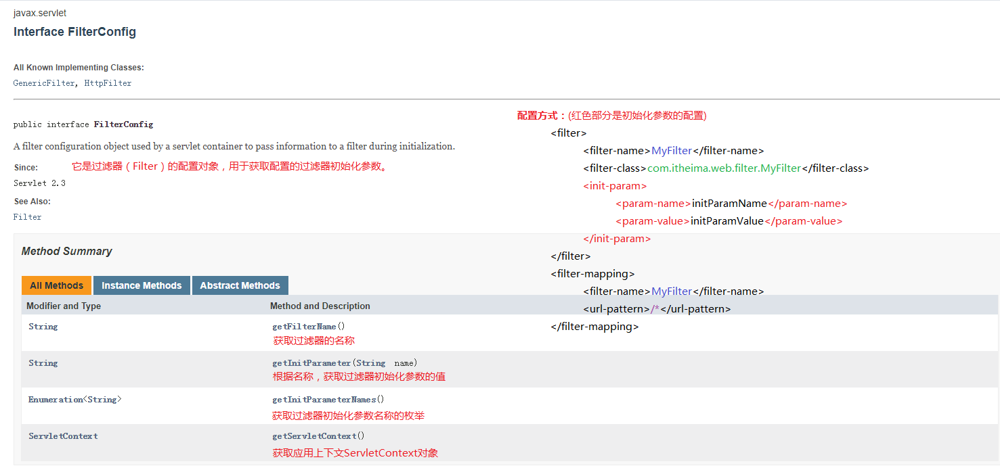

#### 3）FilterChain


### 2.2.2 入门案例过程及生命周期

#### 1）生命周期

**出生——活着——死亡**

**出生：**当应用加载的时候执行实例化和初始化方法。

**活着：**只要应用一直提供服务，对象就一直存在。

**死亡：**当应用卸载时，或者服务器宕机时，对象消亡。

**Filter的实例对象在内存中也只有一份。所以也是单例的。**

#### 2）过滤器核心方法的细节

在`FilterDemo1`的`doFilter`方法添加一行代码，如下：

```java
/**
     * 过滤器的核心方法
     * @param request
     * @param response
     * @param chain
     * @throws IOException
     * @throws ServletException
     */
    @Override
    public void doFilter(ServletRequest request, ServletResponse response, FilterChain chain) throws IOException, ServletException {
        /**
         * 如果不写此段代码，控制台会输出两次：FilterDemo1拦截到了请求。

        HttpServletRequest req = (HttpServletRequest) request;
        String requestURI = req.getRequestURI();
        if (requestURI.contains("favicon.ico")) {
            return;
        }*/
        System.out.println("FilterDemo1拦截到了请求");
        //过滤器放行
        chain.doFilter(request,response);
        System.out.println("FilterDemo1放行之后，又回到了doFilter方法");
    }
```

测试运行结果，我们发现过滤器放行之后执行完目标资源，仍会回到过滤器中：

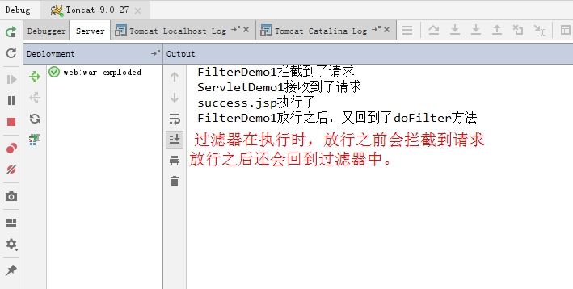

### 2.2.3 过滤器初始化参数配置

#### 1）创建过滤器FilterDemo2

```java
/**
 * Filter的初始化参数配置
 * @author 黑马程序员
 * @Company http://www.itheima.com
 */
public class FilterDemo2 implements Filter {

    private FilterConfig filterConfig;

    /**
     * 初始化方法
     * @param filterConfig
     * @throws ServletException
     */
    @Override
    public void init(FilterConfig filterConfig) throws ServletException {
        System.out.println("FilterDemo2的初始化方法执行了");
        //给过滤器配置对象赋值
        this.filterConfig = filterConfig;
    }

    /**
     * 过滤器的核心方法
     * @param request
     * @param response
     * @param chain
     * @throws IOException
     * @throws ServletException
     */
    @Override
    public void doFilter(ServletRequest request, ServletResponse response, FilterChain chain) throws IOException, ServletException {

        System.out.println("FilterDemo2拦截到了请求");
        //过滤器放行
        chain.doFilter(request,response);
    }
    
    /**
     * 销毁方法
     */
    @Override
    public void destroy() {
        System.out.println("FilterDemo2的销毁方法执行了");
    }
}
```

#### 2）配置FilterDemo2

```xml
<filter>
    <filter-name>FilterDemo2</filter-name>
    <filter-class>com.itheima.web.filter.FilterDemo2</filter-class>
    <!--配置过滤器的初始化参数-->
    <init-param>
        <param-name>filterInitParamName</param-name>
        <param-value>filterInitParamValue</param-value>
    </init-param>
</filter>
<filter-mapping>
    <filter-name>FilterDemo2</filter-name>
    <url-pattern>/ServletDemo1</url-pattern>
</filter-mapping>
```

#### 3）在FilterDemo2的doFilter方法中添加下面的代码

```java
//根据名称获取过滤器的初始化参数
String paramValue = filterConfig.getInitParameter("filterInitParamName");
System.out.println(paramValue);

//获取过滤器初始化参数名称的枚举
Enumeration<String> initNames = filterConfig.getInitParameterNames();
while(initNames.hasMoreElements()){
    String initName = initNames.nextElement();
    String initValue = filterConfig.getInitParameter(initName);
    System.out.println(initName+","+initValue);
}

//获取ServletContext对象
ServletContext servletContext = filterConfig.getServletContext();
System.out.println(servletContext);

//获取过滤器名称
String filterName = filterConfig.getFilterName();
System.out.println(filterName);
```

#### 4）测试运行结果

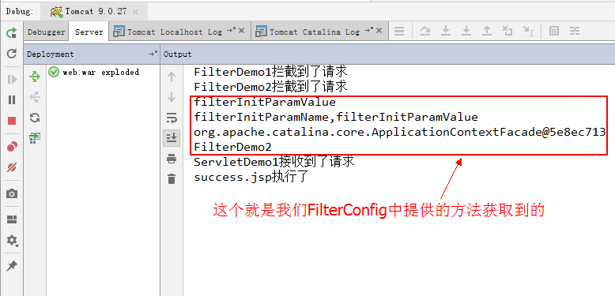

我们通过这个测试，看到了过滤器的初始化参数配置和获取的使用。但是同学们也肯定发现了，在我们的工程中两个过滤器都起作用了，这就是我们在API中说的链式调用，那么当有多个过滤器，它的执行顺序是什么样的呢？

我们来看下一小节。

### 2.2.5 多个过滤器的执行顺序

#### 1）修改FilterDemo1和FilterDemo2两个过滤器的代码，删掉多余的代码

```java
/**
 * Filter的入门案例
 * @author 黑马程序员
 * @Company http://www.itheima.com
 */
public class FilterDemo1 implements Filter {
    /**
     * 过滤器的核心方法
     * @param request
     * @param response
     * @param chain
     * @throws IOException
     * @throws ServletException
     */
    @Override
    public void doFilter(ServletRequest request, ServletResponse response, FilterChain chain) throws IOException, ServletException {
        
        System.out.println("FilterDemo1拦截到了请求");
        //过滤器放行
        chain.doFilter(request,response);
    }

    /**
     * 初始化方法
     * @param filterConfig
     * @throws ServletException
     */
    @Override
    public void init(FilterConfig filterConfig) throws ServletException {
        System.out.println("FilterDemo1的初始化方法执行了");
    }

    /**
     * 销毁方法
     */
    @Override
    public void destroy() {
        System.out.println("FilterDemo1的销毁方法执行了");
    }
}
```

```java
/**
 * Filter的初始化参数配置
 * @author 黑马程序员
 * @Company http://www.itheima.com
 */
public class FilterDemo2 implements Filter {

    /**
     * 初始化方法
     * @param filterConfig
     * @throws ServletException
     */
    @Override
    public void init(FilterConfig filterConfig) throws ServletException {
        System.out.println("FilterDemo2的初始化方法执行了");

    }

    /**
     * 过滤器的核心方法
     * @param request
     * @param response
     * @param chain
     * @throws IOException
     * @throws ServletException
     */
    @Override
    public void doFilter(ServletRequest request, ServletResponse response, FilterChain chain) throws IOException, ServletException {

        System.out.println("FilterDemo2拦截到了请求");
        //过滤器放行
        chain.doFilter(request,response);
    }

    /**
     * 销毁方法
     */
    @Override
    public void destroy() {
        System.out.println("FilterDemo2的销毁方法执行了");
    }
}
```

#### 2）修改两个过滤器的配置，删掉多余的配置

```xml
<!--配置过滤器-->
<filter>
    <filter-name>FilterDemo1</filter-name>
    <filter-class>com.itheima.web.filter.FilterDemo1</filter-class>
</filter>
<filter-mapping>
    <filter-name>FilterDemo1</filter-name>
    <url-pattern>/ServletDemo1</url-pattern>
</filter-mapping>


<filter>
    <filter-name>FilterDemo2</filter-name>
    <filter-class>com.itheima.web.filter.FilterDemo2</filter-class>
</filter>
<filter-mapping>
    <filter-name>FilterDemo2</filter-name>
    <url-pattern>/ServletDemo1</url-pattern>
</filter-mapping>
```

#### 3）测试运行结果

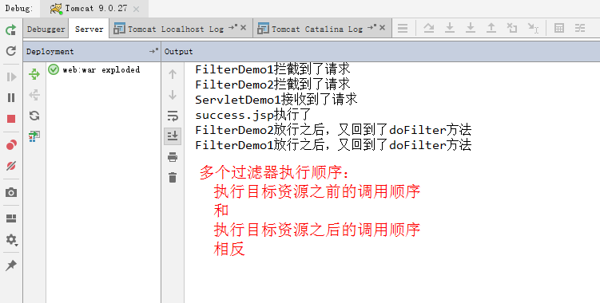

此处我们看到了多个过滤器的执行顺序，它正好和我们在web.xml中的配置顺序一致，如下图：


在过滤器的配置中，有过滤器的声明和过滤器的映射两部分，到底是声明决定顺序，还是映射决定顺序呢？

答案是：<font color='red'><b>`<filter-mapping>`的配置前后顺序决定过滤器的调用顺序，也就是由映射配置顺序决定。</b></font>

### 2.2.6 过滤器的五种拦截行为

我们的过滤器目前拦截的是请求，但是在实际开发中，我们还有请求转发和请求包含，以及由服务器触发调用的全局错误页面。默认情况下过滤器是不参与过滤的，要想使用，需要我们配置。配置的方式如下：

```xml
<!--配置过滤器-->
<filter>
    <filter-name>FilterDemo1</filter-name>
    <filter-class>com.itheima.web.filter.FilterDemo1</filter-class>
    <!--配置开启异步支持，当dispatcher配置ASYNC时，需要配置此行-->
    <async-supported>true</async-supported>
</filter>
<filter-mapping>
    <filter-name>FilterDemo1</filter-name>
    <url-pattern>/ServletDemo1</url-pattern>
    <!--过滤请求：默认值。-->
    <dispatcher>REQUEST</dispatcher>
    <!--过滤全局错误页面：当由服务器调用全局错误页面时，过滤器工作-->
    <dispatcher>ERROR</dispatcher>
    <!--过滤请求转发：当请求转发时，过滤器工作。-->
    <dispatcher>FORWARD</dispatcher>
    <!--过滤请求包含：当请求包含时，过滤器工作。它只能过滤动态包含，jsp的include指令是静态包含-->
    <dispatcher>INCLUDE</dispatcher>
    <!--过滤异步类型，它要求我们在filter标签中配置开启异步支持-->
    <dispatcher>ASYNC</dispatcher>
</filter-mapping>
```

### 2.2.4 过滤器与Servlet的区别

| 方法/类型                                          | Servlet                                                      | Filter                                                       | 备注                                                         |
| -------------------------------------------------- | ------------------------------------------------------------ | ------------------------------------------------------------ | ------------------------------------------------------------ |
| 初始化                                        方法 | `void   init(ServletConfig);   `                             | `void init(FilterConfig);   `                                | 几乎一样，都是在web.xml中配置参数，用该对象的方法可以获取到。 |
| 提供服务方法                                       | `void   service(request,response);                                               ` | `void   dofilter(request,response,FilterChain);                                   ` | Filter比Servlet多了一个FilterChain，它不仅能完成Servlet的功能，而且还可以决定程序是否能继续执行。所以过滤器比Servlet更为强大。   在Struts2中，核心控制器就是一个过滤器。 |
| 销毁方法                                           | `void destroy();`                                            | `void destroy();`                                            |                                                              |

## 2.3 过滤器的使用案例

### 2.3.1 静态资源设置缓存时间过滤器

#### 1） 需求说明

在我们访问html，js，image时，不需要每次都重新发送请求读取资源，就可以通过设置响应消息头的方式，设置缓存时间。但是如果每个Servlet都编写相同的代码，显然不符合我们统一调用和维护的理念。（此处有个非常重要的编程思想：AOP思想，在录制视频时提不提都可以）

因此，我们要采用过滤器来实现功能。

#### 2） 编写步骤

**第一步：创建JavaWeb工程**


**第二步：导入静态资源**


**第三步：编写过滤器**

```java
/**
 * 静态资源设置缓存时间
 * 	html设置为1小时
 *  js设置为2小时
 *  css设置为3小时
 * @author 黑马程序员
 * @Company http://www.itheima.com
 */
public class StaticResourceNeedCacheFilter implements Filter {

    private FilterConfig filterConfig;

    public void init(FilterConfig filterConfig) throws ServletException {
        this.filterConfig = filterConfig;
    }


    public void doFilter(ServletRequest req, ServletResponse res,
                         FilterChain chain) throws IOException, ServletException {
        //1.把doFilter的请求和响应对象转换成跟http协议有关的对象
        HttpServletRequest  request;
        HttpServletResponse response;
        try {
            request = (HttpServletRequest) req;
            response = (HttpServletResponse) res;
        } catch (ClassCastException e) {
            throw new ServletException("non-HTTP request or response");
        }
        //2.获取请求资源URI
        String uri = request.getRequestURI();
        //3.得到请求资源到底是什么类型
        String extend = uri.substring(uri.lastIndexOf(".")+1);//我们只需要判断它是不是html,css,js。其他的不管
        //4.判断到底是什么类型的资源
        long time = 60*60*1000;
        if("html".equals(extend)){
            //html 缓存1小时
            String html = filterConfig.getInitParameter("html");
            time = time*Long.parseLong(html);
        }else if("js".equals(extend)){
            //js 缓存2小时
            String js = filterConfig.getInitParameter("js");
            time = time*Long.parseLong(js);
        }else if("css".equals(extend)){
            //css 缓存3小时
            String css = filterConfig.getInitParameter("css");
            time = time*Long.parseLong(css);

        }
        //5.设置响应消息头
        response.setDateHeader("Expires", System.currentTimeMillis()+time);
        //6.放行
        chain.doFilter(request, response);
    }


    public void destroy() {

    }

}
```

**第四步：配置过滤器**

```xml
<filter>
    <filter-name>StaticResourceNeedCacheFilter</filter-name>
    <filter-class>com.itheima.web.filter.StaticResourceNeedCacheFilter</filter-class>
    <init-param>
        <param-name>html</param-name>
        <param-value>3</param-value>
    </init-param>
    <init-param>
        <param-name>js</param-name>
        <param-value>4</param-value>
    </init-param>
    <init-param>
        <param-name>css</param-name>
        <param-value>5</param-value>
    </init-param>
</filter>
<filter-mapping>
    <filter-name>StaticResourceNeedCacheFilter</filter-name>
    <url-pattern>*.html</url-pattern>
</filter-mapping>
<filter-mapping>
    <filter-name>StaticResourceNeedCacheFilter</filter-name>
    <url-pattern>*.js</url-pattern>
</filter-mapping>
<filter-mapping>
    <filter-name>StaticResourceNeedCacheFilter</filter-name>
    <url-pattern>*.css</url-pattern>
</filter-mapping>
```

#### 3） 测试结果

> 此案例演示时需要注意一下，chrome浏览器刷新时，每次也都会发送请求，所以看不到304状态码。建议用IE浏览器，因为它在刷新时不会再次请求。


### 2.3.2 特殊字符过滤器

#### 1）需求说明

在实际开发中，可能会面临一个问题，就是很多输入框都会遇到特殊字符。此时，我们也可以通过过滤器来解决。

例如：

​	我们模拟一个论坛，有人发帖问：“在HTML中表示水平线的标签是哪个？”。

如果我们在文本框中直接输入`<hr/>`就会出现一条水平线，这个会让发帖人一脸懵。

我们接下来就用过滤器来解决一下。

#### 2）编写步骤

**第一步：创建JavaWeb工程**

沿用第一个案例的工程

**第二步：编写Servlet和JSP**

```java
/**
 * @author 黑马程序员
 * @Company http://www.itheima.com
 */
public class ServletDemo1 extends HttpServlet {

    public void doGet(HttpServletRequest request, HttpServletResponse response)
            throws ServletException, IOException {
        String content = request.getParameter("content");
        response.getWriter().write(content);
    }

    public void doPost(HttpServletRequest request, HttpServletResponse response)
            throws ServletException, IOException {
        doGet(request, response);
    }

}
```

```jsp
<servlet>
    <servlet-name>ServletDemo1</servlet-name>
    <servlet-class>com.itheima.web.servlet.ServletDemo1</servlet-class>
</servlet>
<servlet-mapping>
    <servlet-name>ServletDemo1</servlet-name>
    <url-pattern>/ServletDemo1</url-pattern>
</servlet-mapping>
```

```jsp
<%@ page language="java" import="java.util.*" pageEncoding="UTF-8"%>
<!DOCTYPE HTML PUBLIC "-//W3C//DTD HTML 4.01 Transitional//EN">
<html>
<head>
    <title></title>
</head>
<body>
<form action="${pageContext.request.contextPath}/ServletDemo1" method="POST">
    回帖：<textarea rows="5" cols="25" name="content"></textarea><br/>
    <input type="submit" value="发言">
</form>
</body>
</html>
```

**第三步：编写过滤器**

```java

/**
 * @author 黑马程序员
 * @Company http://www.itheima.com
 */
public class HTMLFilter implements Filter {

    public void init(FilterConfig filterConfig) throws ServletException {

    }


    public void doFilter(ServletRequest req, ServletResponse res,
                         FilterChain chain) throws IOException, ServletException {
        HttpServletRequest request;
        HttpServletResponse response;
        try {
            request = (HttpServletRequest) req;
            response = (HttpServletResponse) res;
        } catch (ClassCastException e) {
            throw new ServletException("non-HTTP request or response");
        }
        //创建一个自己的Request类
        MyHttpServletRequest2 myrequest = new MyHttpServletRequest2(request);
        //放行：
        chain.doFilter(myrequest, response);
    }

    public void destroy() {
    }
}
class MyHttpServletRequest2 extends HttpServletRequestWrapper {
    //提供一个构造方法
    public MyHttpServletRequest2(HttpServletRequest request){
        super(request);
    }

    //重写getParameter方法
    public String getParameter(String name) {
        //1.获取出请求正文： 调用父类的获取方法
        String value = super.getParameter(name);
        //2.判断value是否有值
        if(value == null){
            return null;
        }
        return htmlfilter(value);
    }

    private String htmlfilter(String message){
        if (message == null)
            return (null);

        char content[] = new char[message.length()];
        message.getChars(0, message.length(), content, 0);
        StringBuilder result = new StringBuilder(content.length + 50);
        for (int i = 0; i < content.length; i++) {
            switch (content[i]) {
                case '<':
                    result.append("&lt;");
                    break;
                case '>':
                    result.append("&gt;");
                    break;
                case '&':
                    result.append("&amp;");
                    break;
                case '"':
                    result.append("&quot;");
                    break;
                default:
                    result.append(content[i]);
            }
        }
        return (result.toString());
    }

}
```

**第四步：配置过滤器**

```xml
<filter>
    <filter-name>HTMLFilter</filter-name>
    <filter-class>com.itheima.web.filter.HTMLFilter</filter-class>
</filter>
<filter-mapping>
    <filter-name>HTMLFilter</filter-name>
    <url-pattern>/*</url-pattern>
</filter-mapping>
```

#### 3）测试结果


# 3 Servlet规范中的监听器-Listener

## 3.1 观察者设计模式

在介绍监听器之前，先跟同学们普及一个知识，观察者设计模式。因为所有的监听器都是观察者设计模式的体现。

那什么是观察者设计模式呢？

它是事件驱动的一种体现形式。就好比在做什么事情的时候被人盯着。当对应做到某件事时，触发事件。

观察者模式通常由以下三部分组成：

​            事件源：触发事件的对象。

​			事件：触发的动作，里面封装了事件源。

​			监听器：当事件源触发事件时，要做的事情。一般是一个接口，由使用者来实现。（此处的思想还涉及了一个涉及模式，我们在JDBC的第二天课程中就给同学们讲解，策略模式）

下图描述了观察者设计模式组成：

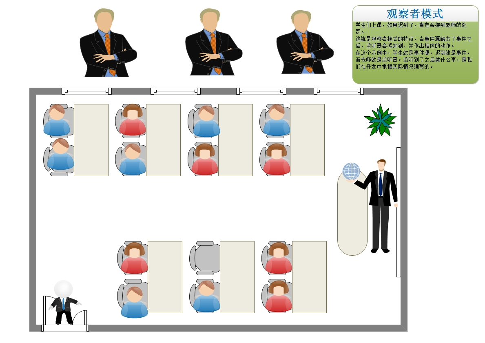

## 3.1 Servlet规范中的8个监听器简介

### 3.1.1 监听对象创建的

#### 1）ServletContextListener

```java
/**
 * 用于监听ServletContext对象创建和销毁的监听器
 * @since v 2.3
 */

public interface ServletContextListener extends EventListener {

    /**
     *	对象创建时执行此方法。该方法的参数是ServletContextEvent事件对象，事件是【创建对象】这个动作
     *  事件对象中封装着触发事件的来源，即事件源，就是ServletContext
     */
    public default void contextInitialized(ServletContextEvent sce) {
    }

    /**
     * 对象销毁执行此方法
     */
    public default void contextDestroyed(ServletContextEvent sce) {
    }
}
```

#### 2）HttpSessionListener

```java
/**
 * 用于监听HttpSession对象创建和销毁的监听器
 * @since v 2.3
 */
public interface HttpSessionListener extends EventListener {

    /**
     * 对象创建时执行此方法。
     */
    public default void sessionCreated(HttpSessionEvent se) {
    }

    /**
     *  对象销毁执行此方法
     */
    public default void sessionDestroyed(HttpSessionEvent se) {
    }
}
```

#### 3）ServletRequestListener

```java
/**
 * 用于监听ServletRequest对象创建和销毁的监听器
 * @since Servlet 2.4
 */
public interface ServletRequestListener extends EventListener {

   	/**
     *  对象创建时执行此方法。
     */
    public default void requestInitialized (ServletRequestEvent sre) {
    }
    
    /**
     * 对象销毁执行此方法
     */
    public default void requestDestroyed (ServletRequestEvent sre) {
    } 
}
```

### 3.1.2 监听域中属性发生变化的

#### 1）ServletContextAttributeListener

```java
/**
 * 用于监听ServletContext域（应用域）中属性发生变化的监听器
 * @since v 2.3
 */

public interface ServletContextAttributeListener extends EventListener {
    /**
     * 域中添加了属性触发此方法。参数是ServletContextAttributeEvent事件对象，事件是【添加属性】。
     * 事件对象中封装着事件源，即ServletContext。
     * 当ServletContext执行setAttribute方法时，此方法可以知道，并执行。
     */
    public default void attributeAdded(ServletContextAttributeEvent scae) {
    }

    /**
     * 域中删除了属性触发此方法
     */
    public default void attributeRemoved(ServletContextAttributeEvent scae) {
    }

    /**
     * 域中属性发生改变触发此方法
     */
    public default void attributeReplaced(ServletContextAttributeEvent scae) {
    }
}
```

#### 2）HttpSessionAttributeListener

```java
/**
 * 用于监听HttpSession域（会话域）中属性发生变化的监听器
 * @since v 2.3
 */
public interface HttpSessionAttributeListener extends EventListener {

    /**
     * 域中添加了属性触发此方法。
     */
    public default void attributeAdded(HttpSessionBindingEvent se) {
    }

    /**
     * 域中删除了属性触发此方法
     */
    public default void attributeRemoved(HttpSessionBindingEvent se) {
    }

    /**
     * 域中属性发生改变触发此方法
     */
    public default void attributeReplaced(HttpSessionBindingEvent se) {
    }
}
```

#### 3）ServletRequestAttributeListener

```java
/**
 * 用于监听ServletRequest域（请求域）中属性发生变化的监听器
 * @since Servlet 2.4
 */
public interface ServletRequestAttributeListener extends EventListener {
    /**
     * 域中添加了属性触发此方法。
     */
    public default void attributeAdded(ServletRequestAttributeEvent srae) {
    }

    /**
     * 域中删除了属性触发此方法
     */
    public default void attributeRemoved(ServletRequestAttributeEvent srae) {
    }

    /**
     * 域中属性发生改变触发此方法
     */
    public default void attributeReplaced(ServletRequestAttributeEvent srae) {
    }
}
```

### 3.1.3 和会话相关的两个感知型监听器

此处要跟同学们明确一下，和会话域相关的两个感知型监听器是无需配置的，直接编写代码即可。

#### 1）HttpSessionBinderListener

```java
/**
 * 用于感知对象和和会话域绑定的监听器
 * 当有数据加入会话域或从会话域中移除，此监听器的两个方法会执行。
 * 加入会话域即和会话域绑定
 * 从会话域移除即从会话域解绑
 */
public interface HttpSessionBindingListener extends EventListener {

    /**
     * 当数据加入会话域时，也就是绑定，此方法执行
     */
    public default void valueBound(HttpSessionBindingEvent event) {
    }

    /**
     * 当从会话域移除时，也就是解绑，此方法执行
     */
    public default void valueUnbound(HttpSessionBindingEvent event) {
    }
}

```

#### 2）HttpSessionActivationListener

```java
/**
 * 用于感知会话域中对象钝化和活化的监听器
 */
public interface HttpSessionActivationListener extends EventListener {

    /**
     * 当会话域中的数据钝化时，此方法执行
     */
    public default void sessionWillPassivate(HttpSessionEvent se) {
    }

    /**
     * 当会话域中的数据活化时（激活），此方法执行
     */
    public default void sessionDidActivate(HttpSessionEvent se) {
    }
}
```

## 3.2 监听器的使用

在实际开发中，我们可以根据具体情况来从这8个监听器中选择使用。感知型监听器由于无需配置，只需要根据实际需求编写代码，所以此处我们就不再演示了。我们在剩余6个中分别选择一个监听对象创建销毁和对象域中属性发生变化的监听器演示一下。

### 3.2.1 ServletContextListener的使用

**第一步：创建工程**

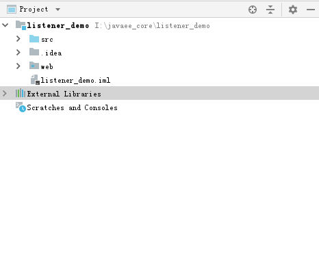

**第二步：编写监听器**

```java
/**
 * 用于监听ServletContext对象创建和销毁的监听器
 * @author 黑马程序员
 * @Company http://www.itheima.com
 */
public class ServletContextListenerDemo implements ServletContextListener {

    /**
     * 对象创建时，执行此方法
     * @param sce
     */
    @Override
    public void contextInitialized(ServletContextEvent sce) {
        System.out.println("监听到了对象的创建");
        //1.获取事件源对象
        ServletContext servletContext = sce.getServletContext();
        System.out.println(servletContext);
    }

    /**
     * 对象销毁时，执行此方法
     * @param sce
     */
    @Override
    public void contextDestroyed(ServletContextEvent sce) {
        System.out.println("监听到了对象的销毁");
    }
}
```

**第三步：在web.xml中配置监听器**

```xml
<!--配置监听器-->
<listener>
    <listener-class>com.itheima.web.listener.ServletContextListenerDemo</listener-class>
</listener>
```

**第四步：测试结果**

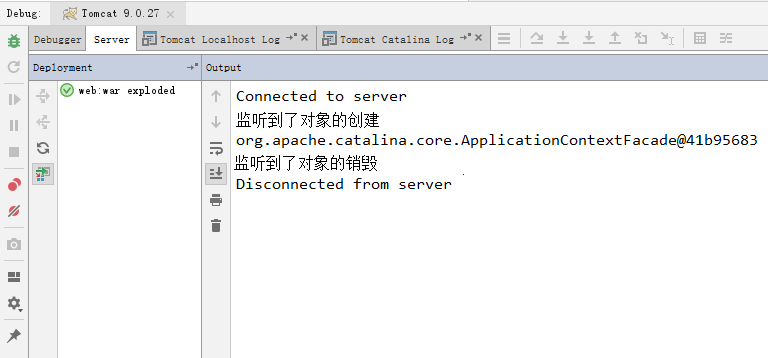

### 3.2.2 ServletContextAttributeListener的使用

**第一步：创建工程**

沿用上一个案例的工程

**第二步：编写监听器**

```java
/**
 * 监听域中属性发生变化的监听器
 * @author 黑马程序员
 * @Company http://www.itheima.com
 */
public class ServletContextAttributeListenerDemo implements ServletContextAttributeListener {

    /**
     * 域中添加了数据
     * @param scae
     */
    @Override
    public void attributeAdded(ServletContextAttributeEvent scae) {
        System.out.println("监听到域中加入了属性");
        /**
         * 由于除了我们往域中添加了数据外，应用在加载时还会自动往域中添加一些属性。
         * 我们可以获取域中所有名称的枚举，从而看到域中都有哪些属性
         */
        
        //1.获取事件源对象ServletContext
        ServletContext servletContext = scae.getServletContext();
        //2.获取域中所有名称的枚举
        Enumeration<String> names = servletContext.getAttributeNames();
        //3.遍历名称的枚举
        while(names.hasMoreElements()){
            //4.获取每个名称
            String name = names.nextElement();
            //5.获取值
            Object value = servletContext.getAttribute(name);
            //6.输出名称和值
            System.out.println("name is "+name+" and value is "+value);
        }
    }

    /**
     * 域中移除了数据
     * @param scae
     */
    @Override
    public void attributeRemoved(ServletContextAttributeEvent scae) {
        System.out.println("监听到域中移除了属性");
    }

    /**
     * 域中属性发生了替换
     * @param scae
     */
    @Override
    public void attributeReplaced(ServletContextAttributeEvent scae) {
        System.out.println("监听到域中属性发生了替换");
    }
}
```

同时，我们还需要借助第一个`ServletContextListenerDemo`监听器，往域中存入数据，替换域中的数据以及从域中移除数据，代码如下：

```java
/**
 * 用于监听ServletContext对象创建和销毁的监听器
 * @author 黑马程序员
 * @Company http://www.itheima.com
 */
public class ServletContextListenerDemo implements ServletContextListener {

    /**
     * 对象创建时，执行此方法
     * @param sce
     */
    @Override
    public void contextInitialized(ServletContextEvent sce) {
        System.out.println("监听到了对象的创建");
        //1.获取事件源对象
        ServletContext servletContext = sce.getServletContext();
        //2.往域中加入属性
        servletContext.setAttribute("servletContext","test");
    }

    /**
     * 对象销毁时，执行此方法
     * @param sce
     */
    @Override
    public void contextDestroyed(ServletContextEvent sce) {
        //1.取出事件源对象
        ServletContext servletContext = sce.getServletContext();
        //2.往域中加入属性，但是名称仍采用servletContext，此时就是替换
        servletContext.setAttribute("servletContext","demo");
        System.out.println("监听到了对象的销毁");
        //3.移除属性
        servletContext.removeAttribute("servletContext");
    }
}
```

**第三步：在web.xml中配置监听器**

```xml
<!--配置监听器-->
<listener>
    <listener-class>com.itheima.web.listener.ServletContextListenerDemo</listener-class>
</listener>

<!--配置监听器-->
<listener>
    <listener-class>com.itheima.web.listener.ServletContextAttributeListenerDemo</listener-class>
</listener>
```

**第四步：测试结果**


# 4 综合案例-学生管理系统改造

## 4.1 需求说明

### 4.1.1 解决乱码问题

我们的学生管理系统中，肯定会有请求和响应的中文乱码问题。而乱码问题在学习Servlet的课程中已经讲解了如何解决了。只是在实际开发中，当有很多的Servlet时，肯定不能在每个Servlet中都编写一遍解决乱码的代码。因此，就可以利用我们今天学习的过滤器来实现统一解决请求和响应乱码的问题。

### 4.1.2 检查登录

在学生管理系统中，它包含了学生信息的录入和学生列表的查询，用户（员工）信息的录入以及查询。当然，我们实际的功能可能远远不止这些。但是就已有功能来说，也不是谁都可以通过地址栏直接输入访问的，它应该有权限的控制，只是我们课程在此处没法深入展开讲解权限，但最起码的登录，身份的认证还是必要的。

由此，就引出来一个问题，是在每次访问Servlet时，在Servlet的代码中加入是否认证过身份的判断吗？显然，是不合理的。那么，既然不是在每个Servlet中编写，就应该是统一管理和维护。此时，我们的过滤器就又可以出场了。

### 4.1.3 页面的java代码块和jsp表达式改造

我们今天除了学习了过滤器，还学习了EL表达式和JSTL标签库，它们的出现就是避免我们的JSP页面中有过多的java代码或者jsp表达式。我们要运用今天所学知识改造页面。

## 4.2 案例实现

### 4.2.1 乱码问题过滤器

创建EncodingFilter类，解决乱码

```java
package com.itheima.filter;

import javax.servlet.Filter;
import javax.servlet.FilterChain;
import javax.servlet.ServletRequest;
import javax.servlet.ServletResponse;
import javax.servlet.annotation.WebFilter;
import javax.servlet.http.HttpServletRequest;
import javax.servlet.http.HttpServletResponse;

/*
    解决全局乱码问题
 */
@WebFilter("/*")
public class EncodingFilter implements Filter{
    @Override
    public void doFilter(ServletRequest servletRequest, ServletResponse servletResponse, FilterChain filterChain) {
        try{
            //1.将请求和响应对象转换为和HTTP协议相关
            HttpServletRequest request = (HttpServletRequest) servletRequest;
            HttpServletResponse response = (HttpServletResponse) servletResponse;

            //2.设置编码格式
            request.setCharacterEncoding("UTF-8");
            response.setContentType("text/html;charset=UTF-8");

            //3.放行
            filterChain.doFilter(request,response);
        } catch (Exception e) {
            e.printStackTrace();
        }

    }
}

```


### 4.2.2 检查登录过滤器

检查登录，创建LoginFilter 类

```java
package com.itheima.filter;

import javax.servlet.Filter;
import javax.servlet.FilterChain;
import javax.servlet.ServletRequest;
import javax.servlet.ServletResponse;
import javax.servlet.annotation.WebFilter;
import javax.servlet.http.HttpServletRequest;
import javax.servlet.http.HttpServletResponse;

/*
    检查登录
 */
@WebFilter(value = {"/addStudent.jsp","/listStudentServlet"})
public class LoginFilter implements Filter{
    @Override
    public void doFilter(ServletRequest servletRequest, ServletResponse servletResponse, FilterChain filterChain) {
        try{
            //1.将请求和响应对象转换为和HTTP协议相关
            HttpServletRequest request = (HttpServletRequest) servletRequest;
            HttpServletResponse response = (HttpServletResponse) servletResponse;

            //2.获取会话域对象中数据
            Object username = request.getSession().getAttribute("username");

            //3.判断用户名
            if(username == null || "".equals(username)) {
                //重定向到登录页面
                response.sendRedirect(request.getContextPath() + "/login.jsp");
                return;
            }

            //4.放行
            filterChain.doFilter(request,response);
        } catch (Exception e) {
            e.printStackTrace();
        }
    }
}

```


### 4.2.3 jsp页面的改造 

​	1，修改`addStudent.jsp`的虚拟访问路径

```jsp
<form action="${pageContext.request.contextPath}/addStudentServlet" method="get" autocomplete="off">
    学生姓名：<input type="text" name="username"> <br>
    学生年龄：<input type="number" name="age"> <br>
    学生成绩：<input type="number" name="score"> <br>
    <button type="submit">保存</button>
</form>
```

2，修改`index.jsp`

```jsp
<%@ page contentType="text/html;charset=UTF-8" language="java" %>
<%@taglib uri="http://java.sun.com/jsp/jstl/core" prefix="c"%>
<html>
<head>
    <title>学生管理系统首页</title>
</head>
<body>
    <%--
        获取会话域中的数据
        如果获取到了则显示添加和查看功能的超链接
        如果没获取到则显示登录功能的超链接
    --%>
    <c:if test="${sessionScope.username eq null}">
        <a href="${pageContext.request.contextPath}/login.jsp">请登录</a>
    </c:if>

    <c:if test="${sessionScope.username ne null}">
        <a href="${pageContext.request.contextPath}/addStudent.jsp">添加学生</a>
        <a href="${pageContext.request.contextPath}/listStudentServlet">查看学生</a>
    </c:if>

</body>
</html>

```

3，修改`listStudent.jsp`

```jsp
<%@ page import="com.itheima.bean.Student" %>
<%@ page import="java.util.ArrayList" %>
<%@ page contentType="text/html;charset=UTF-8" language="java" %>
<%@taglib uri="http://java.sun.com/jsp/jstl/core" prefix="c"%>
<html>
<head>
    <title>查看学生</title>
</head>
<body>
    <table width="600px" border="1px">
        <tr>
            <th>学生姓名</th>
            <th>学生年龄</th>
            <th>学生成绩</th>
        </tr>
        <c:forEach items="${students}" var="s">
            <tr align="center">
                <td>${s.username}</td>
                <td>${s.age}</td>
                <td>${s.score}</td>
            </tr>
        </c:forEach>
    </table>
</body>
</html>

```

4，修改`login.jsp`

```jsp
<%@ page contentType="text/html;charset=UTF-8" language="java" %>
<html>
<head>
    <title>学生登录</title>
</head>
<body>
    <form action="${pageContext.request.contextPath}/loginStudentServlet" method="get" autocomplete="off">
        姓名：<input type="text" name="username"> <br>
        密码：<input type="password" name="password"> <br>
        <button type="submit">登录</button>
    </form>
</body>
</html>

```

