# Tomcat&Http协议-授课

# 1 企业开发简介

## 1.1 JavaEE规范

`JavaEE`规范是`J2EE`规范的新名称，早期被称为`J2EE`规范，其全称是`Java 2 Platform Enterprise Edition`，它是由SUN公司领导、各厂家共同制定并得到广泛认可的工业标准（`JCP`组织成员）。之所以改名为`JavaEE`，目的还是让大家清楚`J2EE`只是`Java`企业应用。在2004年底中国软件技术大会`Ioc`微容器(也就是`Jdon`框架的实现原理)演讲中指出：我们需要一个跨`J2SE/WEB/EJB`的微容器，保护我们的业务核心组件，以延续它的生命力，而不是依赖`J2SE/J2EE`版本.此次`J2EE`改名为`Java EE`，实际也反映出业界这种共同心声。

`JavaEE`规范是很多`Java`开发技术的总称。这些技术规范都是沿用自`J2EE`的。一共包括了13个技术规范。例如：`jsp/servlet`，`jndi`，`jaxp`，`jdbc`，`jni`，`jaxb`，`jmf`，`jta`，`jpa`，`EJB`等。

其中，`JCP`组织的全称是`Java Community Process`。它是一个开放的国际组织，主要由`Java`开发者以及被授权者组成，职能是发展和更新。成立于1998年。官网是：[JCP](https://jcp.org/en/home/index)

`JavaEE`的版本是延续了`J2EE`的版本，但是没有继续采用其命名规则。`J2EE`的版本从1.0开始到1.4结束，而`JavaEE`版本是从`JavaEE 5`版本开始，目前最新的的版本是`JavaEE 8`。

详情请参考：[JavaEE8规范概览](https://www.oracle.com/technetwork/cn/java/javaee/overview/index.html)

## 1.2 Web概述

Web在英文中的含义是网状物，网络。在计算机领域，它通常指的是后者，即<b>网络</b>。像我们前面接触的`WWW`，它是由3个单词组成的，即：`World Wide Web `，中文含义是<b>万维网</b>。而我们前面学的`HTML`，`CSS`和`JS`的参考文档《`W3School`全套教程》中的`W3C`就是万维网联盟。他们的出现都是为了让我们在网络的世界中获取资源，这些资源的存放之处，我们称之为<b><font color='red'>网站</font></b>。我们通过输入网站的地址（即：网址），就可以访问网站中提供的资源。在网上我们能访问到的内容全是资源（不区分局域网还是广域网）。只不过，不同类型的资源展示的效果不一样。

首先，我们先来介绍资源的分类，它分为静态资源和动态资源。其中：

静态资源指的是，网站中提供给人们展示的资源是一成不变的，也就是说不同人或者在不同时间，看到的内容都是一样的。例如：我们看到的新闻，网站的使用手册，网站功能说明文档等等。而作为开发者，我们编写的`html`,`css`,`js`,图片，多媒体等等都可以称为静态资源。

动态资源它指的是，网站中提供给人们展示的资源是由程序产生的，在不同的时间或者用不同的人员由于身份的不同，所看到的内容是不一样的。例如：我们在12306上购买火车票，火车票的余票数由于时间的变化，会逐渐的减少，直到最后没有余票。还有，我们在`CSDN`上下载资料，只有登录成功后，且积分足够时才能下载。否则就不能下载，这就是访客身份和会员身份的区别。作为开发人员，我们编写的`JSP`，`servlet`，`php`，`ASP`等都是动态资源。

关于广域网和局域网的划分，广域网指的就是万维网，也就是我们说的互联网。局域网是指的是在一定范围之内可以访问的网络，出了这个范围，就不能再使用的网络。

## 1.3 系统结构

### 1.3.1 系统结构简介

在我们前面课程的学习中，开发的都是`Java`工程。这些工程在企业中称之为项目或者产品。项目也好，产品也罢，它是有系统架构的，系统架构的划分有很多种方式。我们今天讨论的是基础结构上的划分。除此之外，还有技术选型划分，部署方式划分等等。

基础结构划分：C/S结构，B/S结构两类。

技术选型划分：Model1模型，Model2模型，MVC模型和三层架构+MVC模型。

部署方式划分：一体化架构，垂直拆分架构，分布式架构，流动计算架构，微服务架构。

### 1.3.2 C/S结构

它指的是客户端——服务器的方式。其中C代表着Client，S代表着服务器。C/S结构的系统设计图如下：

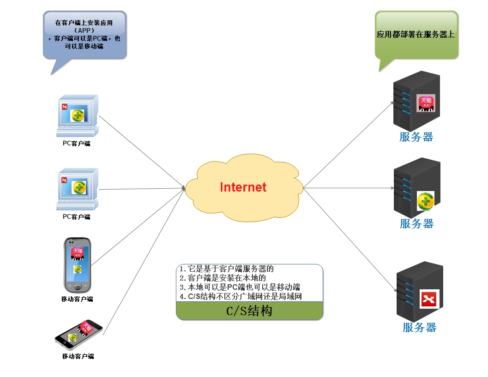

### 1.3.3 B/S结构

它指的是浏览器——服务器的方式。其中B代表着Browser，S代表着服务器。B/S结构的系统设计图如下：

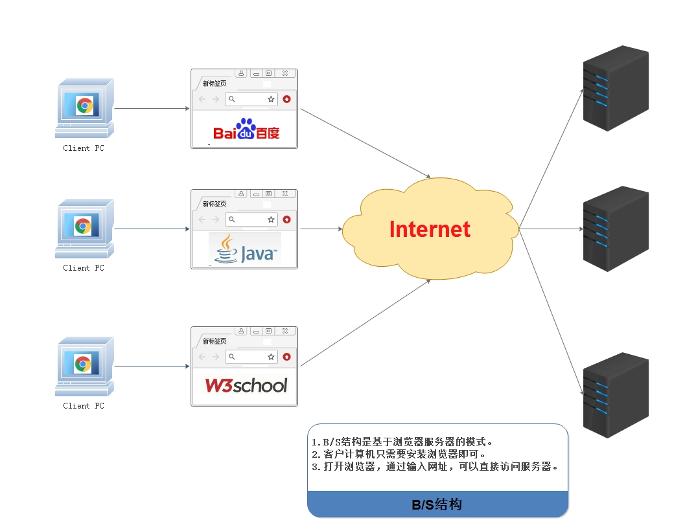

### 1.3.4 两种结构的区别及优略

**两种结构的区别**

第一：硬件环境不同，C/S通常是建立在专用的网络或小范围的网络环境上（即局域网），且必须要安装客户端。而B/S是建立在广域网上的，适应范围强，通常有操作系统和浏览器就行。

第二：C/S结构比B/S结构更安全，因为用户群相对固定，对信息的保护更强。

第三：B/S结构维护升级比较简单，而C/S结构维护升级相对困难。

**优略**

1 C/S：是能充分发挥客户端PC的处理能力，很多工作可以在客户端处理后再提交给服务器。对应的优点就是客户端响应速度快。

2 B/S：总体拥有成本低、维护方便、 分布性强、开发简单，可以不用安装任何专门的软件就能 实现在任何地方进行操作，客户端零维护，系统的扩展非常容易，只要有一台能上网的电脑就能使用。

**关于课程中结构的选择**

<b><font color='red'>我们的课程中涉及的系统结构都是是基于B/S结构。</font></b>

# 2 Tomcat

## 2.1 Tomcat介绍

### 2.1.1 关于服务器

服务器的概念非常的广泛，它可以指代一台特殊的计算机（相比普通计算机运行更快、负载更高、价格更贵），也可以指代用于部署网站的应用。我们这里说的服务器，其实是web服务器，或者应用服务器。它本质就是一个软件，一个应用。作用就是发布我们的应用（工程），让用户可以通过浏览器访问我们的应用。

常见的应用服务器，请看下表：

| 服务器名称  | 说明                                                  |
| ----------- | ----------------------------------------------------- |
| weblogic    | 实现了javaEE规范，重量级服务器，又称为javaEE容器      |
| websphereAS | 实现了javaEE规范，重量级服务器。                      |
| JBOSSAS     | 实现了JavaEE规范，重量级服务器。免费的。              |
| Tomcat      | 实现了jsp/servlet规范，是一个轻量级服务器，开源免费。 |

### 2.1.2 Tomcat下载与安装

[Tomcat官网下载地址](http://tomcat.apache.org/)


### 2.1.3 Tomcat各版本所需支持

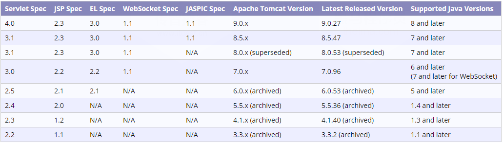

### 2.1.4 Tomcat目录结构详解

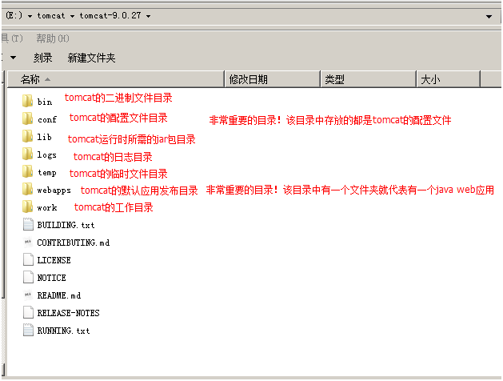

## 2.2 Tomcat基本使用

### 2.2.1 Tomcat启动和停止及问题分析解决

#### 1）启动和停止

Tomcat服务器的启动文件在二进制文件目录中：，这两个文件就是Tomcat的启动文件。

Tomcat服务器的停止文件也在二进制文件目录中：，这两个文件就是Tomcat的停止文件。

其中`.bat`文件是针对`windows`系统的运行程序，`.sh`文件是针对`linux`系统的运行程序。

#### 2）启动问题

**第一个问题：启动一闪而过**

原因：没有配置环境变量。

解决办法：配置上JAVA_HOME环境变量

**第二个：Address already in use : JVM_Bind**


原因：端口被占用

解决办法：找到占用该端口的应用

​                    进程不重要：使用cmd命令：netstat -a -o 查看pid  在任务管理器中结束占用端口的进程。

​                    进程很重要：修改自己的端口号。修改的是Tomcat目录下`\conf\server.xml`中的配置。

​			

**第三个：启动产生很多异常，但能正常启动**

原因：Tomcat中部署着很多项目，每次启动这些项目都会启动。而这些项目中有启动报异常的。

解决办法：

​			能找到报异常的项目，就把它从发布目录中移除。

​			不能确定报异常的项目，就重新解压一个新的Tomcat。

**第四个：其它问题**

例如：启动产生异常，但是不能正常启动。此时就需要解压一个新的Tomcat启动，来确定是系统问题，还是Tomcat的问题。

所以，此时就需要具体问题，具体分析，然后再对症解决。

### 2.2.2 IDEA集成Tomcat服务器

**第一步**

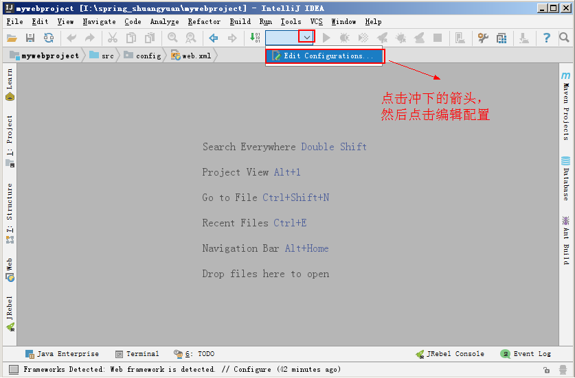

**第二步**


**第三步**


**第四步**


### 2.2.3 Linux系统安装Tomcat

**第一步：下载tomcat**

参考**2.1.2小节的《Tomcat下载与安装》**进入Tomcat官网，找到对应版本点击`download`进入下载页面，如下图：

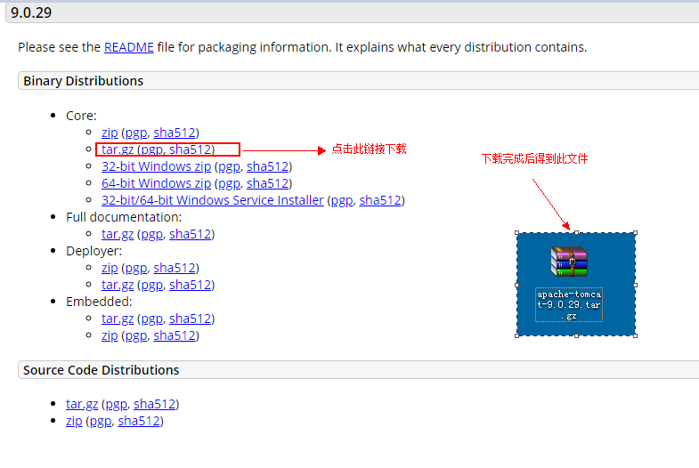

**第二步：上传到linux**

在crt上 使用 alt+p 
将windows上的软件拖进去即可(root目录)

**第三步：在 /usr/local 新建一个文件夹tomcat**

```
mkdir /usr/local/tomcat
```

**第四步：移动 tomcat...tar.gz 到 /usr/local/tomcat**

```
mv apache-tomcat-8.5.32.tar.gz /usr/local/tomcat/
```

**第五步：进入/usr/local/tomcat目录,解压Tomcat**

```
cd /usr/local/tomcat
tar -xvf apache-tomcat-8.5.32.tar.gz
```

**第六步：进入 /usr/local/tomcat/apache-tomcat-8.5.32/bin**

```
cd /usr/local/tomcat/apache-tomcat-8.5.32/bin
```

**第七步：启动tomcat**

```
方式1:
	sh startup.sh
方式2:
	./startup.sh
```

**第八步：修改防火墙的规则 **

```
方式1:service iptables stop  关闭防火墙(不建议); 用到哪一个端口号就放行哪一个(80,8080,3306...)

方式2:放行8080 端口
	修改配置文件
		cd /etc/sysconfig
		vi iptables
			复制(yy , p)	
				-A INPUT -m state --state NEW -m tcp -p tcp --dport 22 -j ACCEPT
			改成
				-A INPUT -m state --state NEW -m tcp -p tcp --dport 8080 -j ACCEPT
		重启加载防火墙或者重启防火墙
			service iptables reload  
			或者
			service iptables restart
```

## 2.3 Tomcat发布应用-JavaWeb应用

### 2.3.1 JavaWeb工程概述

`JavaWeb`应用是一个全新的应用种类。这类应用程序指供浏览器访问的程序，通常也简称为web应用。

一个web应用由多个静态web资源和动态web资源组成，例如：html、css、js文件，jsp文件、java程序、支持jar包、工程配置文件、图片、音视频等等。

Web应用开发好后，若想供外界访问，需要把web应用所在目录交给Web服务器管理（Tomcat就是Web服务器之一），这个过程称之为虚似目录的映射。

### 2.3.2 JavaWeb应用目录结构详解

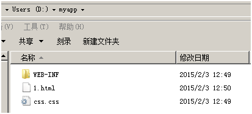

```
myapp--------------应用名称
    1.html
    css/css.css
    js/demo.js
	WEB-INF--------如果有web.xml或者.class文件时，该目录必须存在，且严格区分大小写。
		   --------该目录下的资源，客户端是无法直接访问的。
           --------目录中内容如下：
        classes目录----------------web应用的class文件（加载顺序：我们的class，lib目录中的jar包，tomcat的lib目录中的jar包。优先级依次降低）
        lib目录--------------------web应用所需的jar包（tomcat的lib目录下jar为所有应用共享）
        web.xml-------------------web应用的主配置文件
```

### 2.3.3 JavaWeb应用的创建

**第一步**


**第二步**

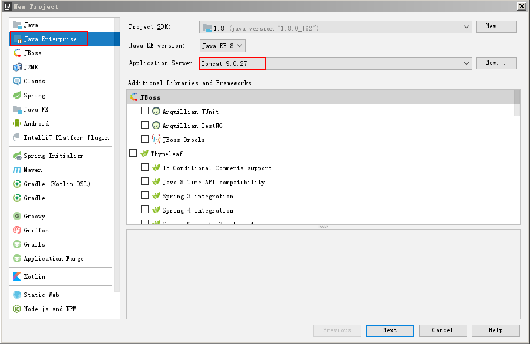

**第三步**


**第四步**


### 2.3.4 JavaWeb应用的部署

#### 1）IDEA部署

**第一步**


**第二步**

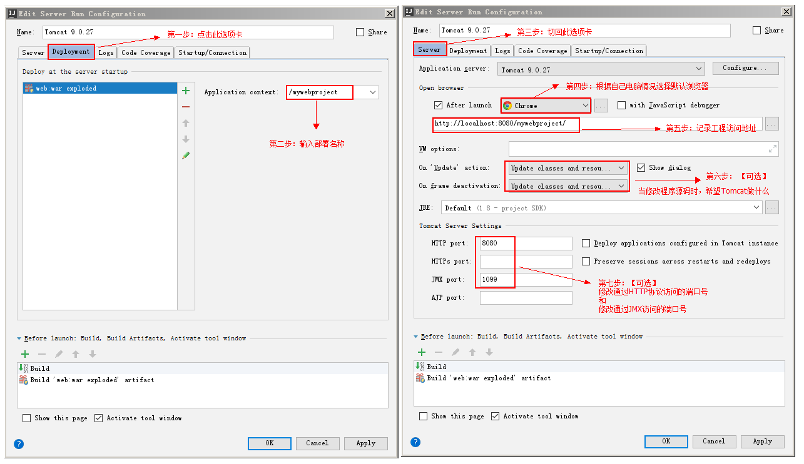

**第三步**

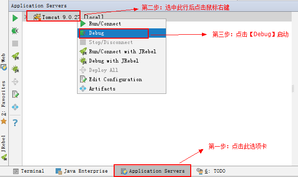

#### 2）war包发布

**第一步：使用<b>`jar -cvf war` <font color='blue'>包的名称</font>  <font color='purple'>当前目录中哪些资源要打入war</font></b>**


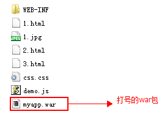

**第二步：把打好的war拷贝到tomcat的webapps目录中**

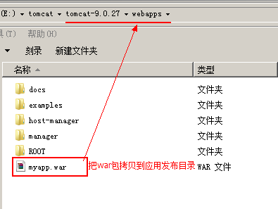

**第三步：启动服务时，tomcat会自动解压。**


### 2.4.1 Tomcat配置虚拟目录

虚拟目录的配置，支持两种方式。第一种是通过在主配置文件中添加标签实现。第二种是通过写一个独立配置文件实现。

第一种方式：在`server.xml`的`<Host>`元素中加一个`<Context path="" docBase=""/>`元素。
​					 `path`：访问资源URI。URI名称可以随便起，但是必须在前面加上一个/
​					`docBase`：资源所在的磁盘物理地址。
第二种方式：是写一个独立的`xml`文件，该文件名可以随便起。在文件内写一个`<Context/>`元素。
​					该文件要放在Tomcat目录中的`conf\Catalina\localhost\`目录下。
需要注意的是，在使用了独立的配置文件之后，访问资源URI就变成了<b><font color='red'>/+文件的名称</font></b>。而`Context`的`path`属性就失效了。

### 2.4.2 Tomcat配置虚拟主机

在`<Engine>`元素中添加一个`<Host name="" appBase="" unparkWARs="" autoDeploy="" />`，其中：
​		`name`：指定主机的名称
​		`appBase`：当前主机的应用发布目录
​		`unparkWARs`：启动时是否自动解压war包
​		`autoDeploy`：是否自动发布

配置示例如下：

```xml
<Host name="www.itcast.cn" appBase="D:\itcastapps" unpackWARs="true" autoDeploy="true"/>

<Host name="www.itheima.com" appBase="D:\itheimaapps" unpackWARs="true" autoDeploy="true"/>
```

### 2.4.3 Tomcat默认项配置

**配置默认端口**

Tomcat服务器主配置文件中配置着访问端口，它在配置文件中写的值是：8080。但是它不是Tomcat的默认端口。我们此处说的默认端口是，当使用默认值的时候，端口号可以省略。Tomcat的默认端口是<b><font color='red'>80</font></b>。

配置方式如下：

```xml
<Connector port="80" protocol="HTTP/1.1" connectionTimeout="20000" redirectPort="8443" />		
```

**配置默认应用**

有两种方式配置默认应用。
第一种：把要作为默认应用的应用，名称改为`ROOT`。放到`webapps`目录中。

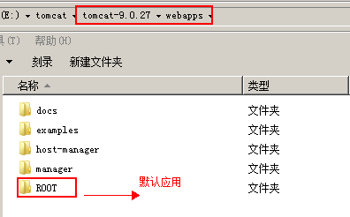

第二种：写一个独立的配置文件，文件名称为`ROOT.xml`。
​				注意：`ROOT`必须大写。当使用了独立的`ROOT.xml`文件时，`webapps`下`ROOT`应用就不是默认应用了。


**配置默认主页**

首先要明确的是，配置默认主页是针对应用说的。是应用的默认主页。
在应用的web.xml中配置：

```xml
<welcome-file-list>
    <welcome-file>默认主页</welcome-file>
</welcome-file-list>
```

例如：

```xml
<welcome-file-list>
    <welcome-file>index.html</welcome-file>
    <welcome-file>index.htm</welcome-file>
    <welcome-file>index.jsp</welcome-file>
</welcome-file-list>
```

# 3 HTTP协议

## 3.1 HTTP协议概述

### 3.1.1 HTTP协议概念

HTTP的全称是：Hyper Text Transfer Protocol，意为 超文本传输协议。它指的是服务器和客户端之间交互必须遵循的一问一答的规则。形容这个规则：问答机制、握手机制。

它规范了请求和响应内容的类型和格式。

HTTP协议是由`W3C`组织管理和维护的。

### 3.1.2 HTTP协议版本

目前HTTP协议主要是1.0版本和1.1版本。这两个版本的区别主要是两个方面。

第一：HTTP1.1版本比1.0版本多了一些消息头。

第二：HTTP1.1版本和1.0版本的执行过程不一样。执行过程如下：

| HTTP1.0            | HTTP1.1                |
| ------------------ | ---------------------- |
| 创建连接（TCP/IP） | 创建连接（TCP/IP）     |
| 发送请求           | 发送请求1              |
| 得到响应           | 得到响应1              |
| 关闭连接           | 发送请求2              |
| 创建连接（TCP/IP） | 得到响应2              |
| 发送请求           | .......                |
| 得到响应           | .......                |
| 关闭连接           | 连接超时或手动关闭连接 |

### 3.1.3 HTTP协议相关说明

HTTP协议概念是客户浏览器和服务器一种一问一答的规则，那么必须要有问有答，而且要先问后答。
但是我们使用`<script>`,`<link>`和``标签，没有手动发起请求，但是仍然能从服务器端拿到数据，原因就是：**在浏览器遇到`<script>`,`<link>`,``标签时会自动发出请求。**

## 3.2 HTTP协议组成

由HTTP协议的概念可知，它分为问和答两部分。其中问指的就是请求部分，而答指的就是响应部分。

### 3.2.1请求部分  

请求行： 永远位于请求的第一行
请求消息头： 从第二行开始，到第一个空行结束
请求的正文： 从第一个空行后开始，到正文的结束

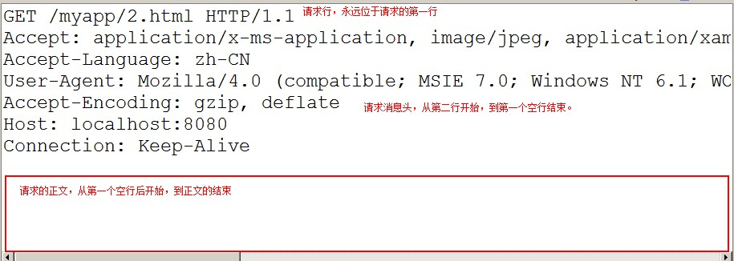

### 3.2.2 响应部分

响应行： 永远位于响应的第一行
响应消息头： 从第二行开始，到第一个空行结束
响应的正文： 从第一个空行后开始，到正文的结束

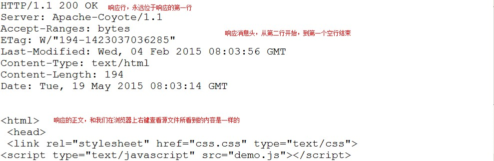

### 3.3.3 消息头的共性分析

消息头名称首字母大写，多个单词每个单词的首字母都大写。
多个单词用<b><font color='red'>-</font></b>分隔
名称和值之间用<b><font color='red'>冒号加空格</font></b>分隔
多个值之间用<b><font color='red'>逗号加空格</font></b>分隔
两个头之间用<b><font color='red'>回车</font></b>分隔

## 3.3 请求部分详解

### 3.3.1 请求行详解

请求行：`GET /myapp/2.html HTTP/1.1`

| 内容          | 说明                       |
| ------------- | -------------------------- |
| GET           | 请求的方式。（还有POST）   |
| /myapp/2.html | 请求的资源。               |
| HTTP/1.1      | 使用的协议，及协议的版本。 |

### 3.3.2 请求消息头详解

| 内容                   | 说明                                                         |
| ---------------------- | ------------------------------------------------------------ |
| Accept                 | 告知服务器，客户浏览器所支持的MIME类型。                     |
| Accept-Encoding        | 告知服务器，客户浏览器所支持的压缩编码格式。最常用的就是gzip压缩。 |
| Accept-Language        | 告知服务器，客户浏览器所支持的语言。一般都是zh_CN或en_US等。 |
| Referer                | 告知服务器，当前请求的来源。<br/>只有当前请求有来源的时候，才有这个消息头。从地址栏输入的没有来源。<br/>作用：1 投放广告  2 防盗链 |
| Content-Type           | 告知服务器，请求正文的MIME类型。                             |
| Content-Length         | 告知服务器，请求正文的长度。                                 |
| User-Agent             | 浏览器相关信息                                               |
| Connection: Keep-Alive | 连接的状态：保持连接                                         |
| If-Modified-Since      | 告知服务器，客户浏览器缓存文件的最后修改时间。               |
| Cookie（********）     | 会话管理相关，非常的重要。                                   |

### 3.3.3 请求正文详解

第一：只有post请求方式，才有请求的正文。get方式的正文是在地址栏中的。
第二：表单的输入域有name属性的才会被提交。不分get和post的请求方式。
第三：表单的enctype属性取值决定了请求正文的体现形式。概述的含义是：请求正文的MIME编码类型。

| enctype取值                       | 请求正文体现形式                                   | 示例                                                         |
| --------------------------------- | -------------------------------------------------- | ------------------------------------------------------------ |
| application/x-www-form-urlencoded | key=value&key=value                                | username=test&password=1234                                  |
| multipart/form-data               | 此时变成了多部分表单数据。多部分是靠分隔符分隔的。 | -----------------------------7df23a16c0210<br/>Content-Disposition: form-data; name="username"<br/><br/>test<br/>-----------------------------7df23a16c0210<br/>Content-Disposition: form-data; name="password"<br/><br/>1234<br/>-----------------------------7df23a16c0210<br/>Content-Disposition: form-data; name="headfile"; filename="C:\Users\zhy\Desktop\请求部分.jpg"<br/>Content-Type: image/pjpeg<br/>-----------------------------7df23a16c0210 |

## 3.4 响应部分详解

### 3.4.1 响应行详解

响应行：`HTTP/1.1 200 OK`

| 内容     | 说明             |
| -------- | ---------------- |
| HTTP/1.1 | 使用协议的版本。 |
| 200      | 响应状态码       |
| OK       | 状态码描述       |

常用状态码介绍：

| 状态码  | 说明                                             |
| ------- | ------------------------------------------------ |
| 200     | 一切都OK>                                        |
| 302/307 | 请求重定向(客户端行为，两次请求，地址栏发生改变) |
| 304     | 请求资源未发生变化，使用缓存                     |
| 404     | 请求资源未找到                                   |
| 500     | 服务器错误                                       |

### 3.4.2 响应消息头详解

| 消息头                  | 说明                                                         |
| ----------------------- | ------------------------------------------------------------ |
| Location                | 请求重定向的地址，常与302,307配合使用。                      |
| Server                  | 服务器相关信息。                                             |
| Content-Type            | 告知客户浏览器，响应正文的MIME类型。                         |
| Content-Length          | 告知客户浏览器，响应正文的长度。                             |
| Content-Encoding        | 告知客户浏览器，响应正文使用的压缩编码格式。常用的gzip压缩。 |
| Content-Language        | 告知客户浏览器，响应正文的语言。zh_CN或en_US等等。           |
| Content-Disposition     | 告知客户浏览器，以下载的方式打开响应正文。                   |
| Refresh                 | 定时刷新                                                     |
| Last-Modified           | 服务器资源的最后修改时间。                                   |
| Set-Cookie（*******）   | 会话管理相关，非常的重要                                     |
| Expires:-1              | 服务器资源到客户浏览器后的缓存时间                           |
| Catch-Control: no-catch | 不要缓存，//针对http协议1.1版本                              |
| Pragma:no-catch         | 不要缓存，//针对http协议1.0版本                              |

### 3.4.3 响应正文详解

就和我们在浏览器上右键查看源文件看到的内容是一样的。

```html
<html>
    <head>
        <link rel="stylesheet" href="css.css" type="text/css">
        <script type="text/javascript" src="demo.js"></script>
    </head>
    <body>
        
    </body>
</html>
```

# 4 综合案例-Tomcat的具体应用

## 4.1 静态资源案例-门户类网站的部署和访问

### 4.1.1 案例介绍

**需求：**

​		在浏览器中输入地址，访问静态HTML页面。

**细节说明：**

​		把`HTML`和`CSS`课程中制作的页面加入到`JavaWeb`工程中，在Tomcat中部署工程，然后启动Tomcat服务器，并使用浏览器访问。

### 4.1.2 实现步骤

**第一步：创建工程并选择使用的Tomcat版本**

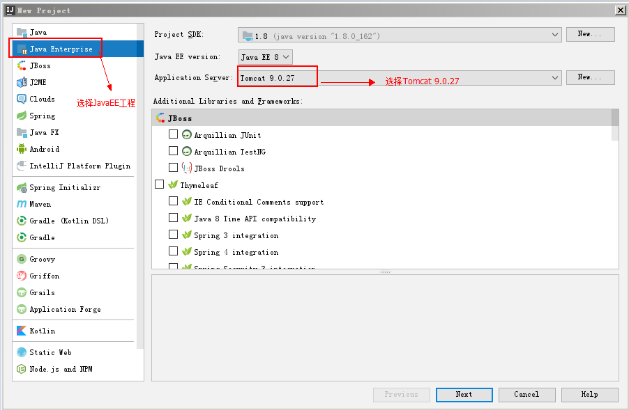


**第二步：拷贝资源到工程的web目录中**

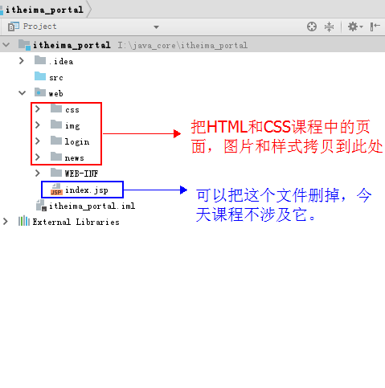

**第三步：在web.xml中配置默认主页**

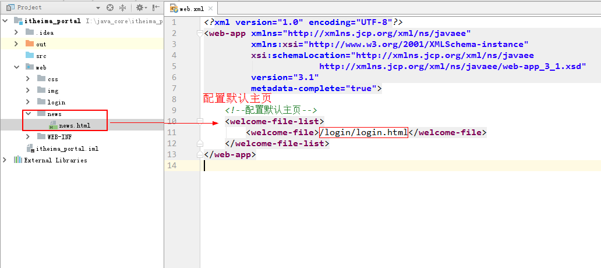

**第四步：部署工程到Tomcat服务器**


**第五步：测试浏览器访问**


## 4.2 动态资源的案例-学生管理系统的部署和访问

### 4.2.1 案例介绍

**需求：**

​		把JavaSE进阶阶段的学生管理系统的服务器改用Tomcat实现。

**细节说明：**

​		把学生管理系统涉及的HTML和样式以及图片文件拷贝到JavaWeb工程中，在Tomcat中部署工程，然后启动Tomcat服务器，并使用浏览器访问。

### 4.2.2 实现步骤

**第一步：创建工程**


**第二步：拷贝资源**


**第三步：配置默认主页**


**第四步：部署项目**

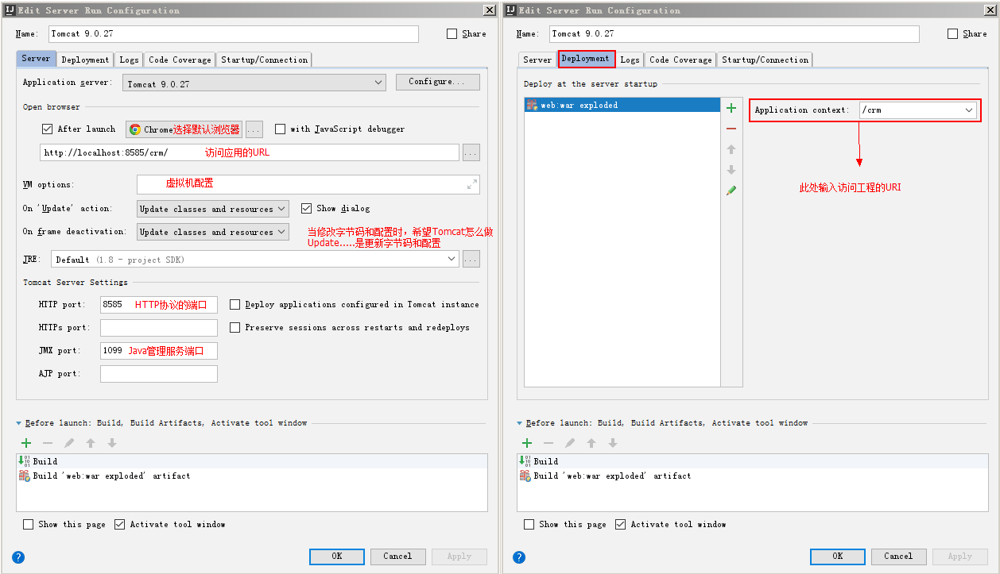

### 4.3.2 创建案例中的动态资源-Servlet

#### 1） Servlet简介

Servlet翻译成中文是服务端脚本，它是SUN公司推出的一套规范，称为Servlet规范。Servlet规范是JavaEE规范中的一部分。我们可以通过查阅JavaEE规范的API来了解Servlet的基本概念。通过点击[JavaEE8官方文档](https://javaee.github.io/javaee-spec/javadocs/)，就可以看到关于Servlet的内容介绍。

#### 2） 按步骤编写Servlet

**前期准备：在IDEA创建Javaweb工程**

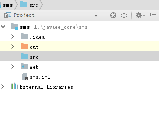

**第一步：编写一个普通类实现Servlet接口或者继承GenericServlet类或者继承HttpServlet**


**第二步：重写service方法，输出一句话**

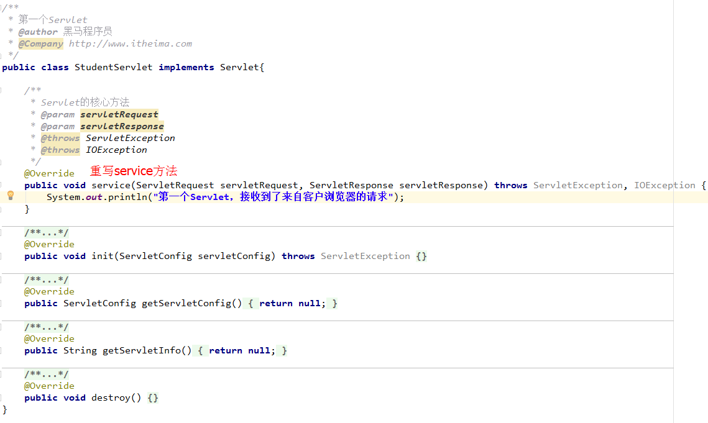

**第三步：在web.xml配置Servlet**


**第四步：启动tomcat服务器测试**

在地址栏输入：http://localhost:8585/crm/studentServlet 测试访问结果 

#### 3）测试访问

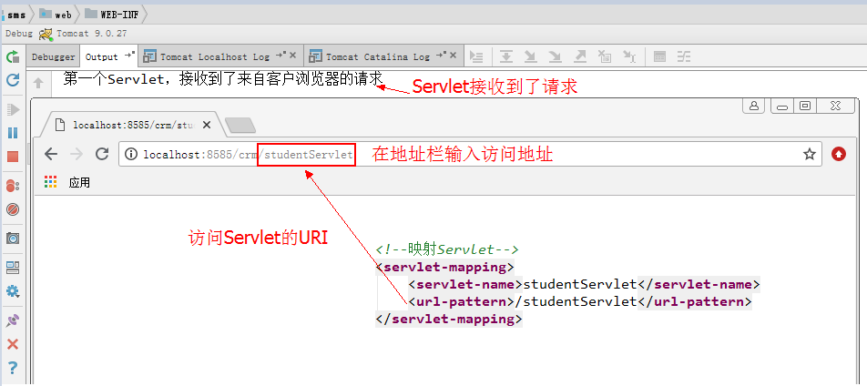