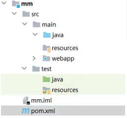
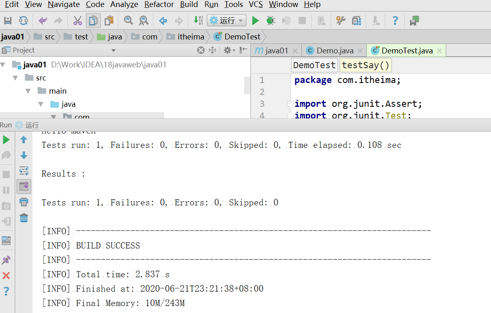
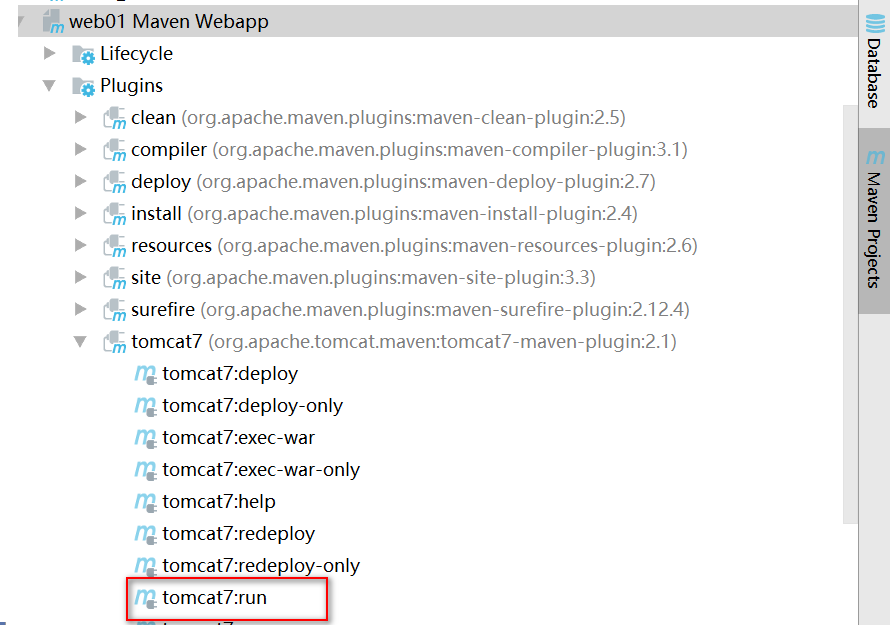
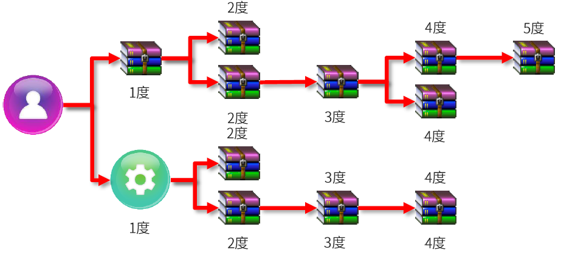

# Maven基础

## 学习目标

目标1：能够说出maven的作用，POM的概念

目标2：完成maven的下载，安装和环境配置

目标3：能够说出仓库，坐标的概念，完成仓库的配置

目标4：完成手动搭建maven项目的案例

目标5：完成IDEA工具搭建maven项目的案例

目标6：能够说出依赖的传递方式和如何解决依赖传递冲突

目标7：能够说出maven的生命周期

## 1.Maven简介

### 1.1 Maven是什么

在学习Maven之前，我们先来看一下我们现在做的项目都有哪些问题。假设你现在做了一个crm的系统，项目中肯定要用到一些jar包，比如说mybatis，log4j，JUnit等，除了这些之外，你有可能用到你的同事开发的其他的东西，比如说别人做了一个财务模块或做了一个结算的模块，你在这里边有可能要用到这些东西。


假如有一天你们的项目中mybatis进行了一个升级，但是它内部使用的JUnit没有升级，你升级以后的mybatis假如要用5.0的JUnit，而你项目中目前用的是4.0的，会不会冲突？必然会出问题！这个时候管理起来会比较麻烦，你需要各种调整。更有甚者，假如同事做的这些东西升级了但又没有通知你，这个时候，就会出现几种严重的问题：

（1）jar包不统一，jar不兼容

（2）工程升级维护过程操作繁琐

除此之外，还会有其它的一系列问题。那么要解决这些问题，就用到了我们今天要讲的Maven了。


那**Maven是什么**？

​	**Maven的本质是一个项目管理工具，将项目开发和管理过程抽象成一个项目对象模型（POM）**

Maven是用Java语言编写的。他管理的东西统统以面向对象的形式进行设计，最终他把一个项目看成一个对象，而这个对象叫做POM(project  object model)，即项目对象模型


我们说一个项目就是一个对象，作为对象的行为、对象的属性都有哪些呢？

Maven说我们需要编写一个pom.xml文件，Maven通过加载这个配置文件就可以知道我们项目的相关信息了！到这里我们知道了Maven离不开一个叫pom.xml的文件。因为这个文件代表就一个项目。

>提个问题大家思考，如果我们做8个项目，对应的是1个文件，还是8个文件？肯定是8个！

那Maven是如何帮我们进行项目资源管理的呢？这就需要用到Maven中的第二个东西：**依赖管理**。这也是它的第二个核心！

所谓依赖管理就是maven对项目所有依赖资源的一种管理，它和项目之间是一种双向关系，即当我们做项目的时候maven的依赖管理可以帮助你去管理你所需要的其他资源，当其他的项目需要依赖我们项目的时候，maven也会把我们的项目当作一种资源去进行管理，这就是一种双向关系。

那maven的依赖管理它管理的这些资源存在哪儿呢？主要有三个位置：本地仓库，私服，中央仓库

本地仓库顾名思义就是存储在本地的一种资源仓库，如果本地仓库中没有相关资源，可以去私服上获取，私服也是一个资源仓库，只不过不在本地，是一种远程仓库，如果私服上也没有相关资源，可以去中央仓库去获取，中央仓库也是一种远程仓库。

Maven除了帮我们管理项目资源之外还能帮助我们对项目进行构建，管理项目的整个生命周期，当然它的这些功能需要使用一些相关的插件来完成，当然整个生命周期过程中插件是需要配合使用的，单独一个无法完成完整的生命周期。

### 1.2 Maven的作用

Maven的作用我们可以分成三类：

（1）项目构建：提供标准的，跨平台的自动化构建项目的方式

（2）依赖管理：方便快捷的管理项目依赖的资源（jar包），避免资源间的版本冲突等问题

（3）统一开发结构：提供标准的，统一的项目开发结构，如下图所示：



各目录存放资源类型说明：

**src/main/java**：项目java源码

**src/main/resources**：项目的相关配置文件（比如mybatis配置，xml映射配置，自定义配置文件等）

**src/main/webapp**：web资源（比如html，css，js等）

src/test/java：测试代码

src/test/resources：测试相关配置文件

src/pom.xml：项目pom文件

## 2.Maven环境搭建

maven的官网：http://maven.apache.org/

### 2.2 安装

maven是一个绿色软件，解压即安装，非常容易，

maven自己的一个目录结构如下


各目录结构说明：

bin：可执行程序目录，

boot：maven自身的启动加载器

conf：maven配置文件的存放目录

lib：maven运行所需库的存放目录

### 2.3 环境配置

maven的运行需要java的环境，需要我们配置`JAVA_HOME`环境变量，这个相信大家已经存在了

下面在去配置`MAVEN_HOME`的环境变量

1：`我的电脑`-------->`属性`--------->`高级系统设置`---------->`新建系统变量MAVEN_HOME`，


系统变量值就是maven软件的根目录，我们刚刚已经将maven解压到D盘了，因此变量值就如图中所示

2：环境变量配置好之后需要测试环境配置结果，我们需要在DOS命令窗口下输入以下命令查看输出

```bash
mvn -v
```


如果能够看到输出的maven的版本信息代表配置成功

## 3.Maven基础概念

### 3.1 仓库

仓库：用于存储资源，主要是各种jar包

关于仓库，我们前面讲到了有三种：本地仓库，私服，中央仓库，其中私服和中央仓库都属于远程仓库

**中央仓库**：maven团队自身维护的仓库，属于开源的

**私服**：各公司/部门等小范围内存储资源的仓库，私服也可以从中央仓库获取资源

**本地仓库**：开发者自己电脑上存储资源的仓库，也可从远程仓库获取资源


**私服的作用：**

（1）保存具有版权的资源，包含购买或自主研发的jar

（2）一定范围内共享资源，能做到仅对内不对外开放

### 3.2 坐标

我们说maven的仓库里存储了各种各样的资源（jar包），那这些资源我们如何找到它们呢？我们需要知道它们具体的一个位置才能知道如何找到它们，这个就叫坐标

**坐标**：maven中的坐标用于描述仓库中资源的位置

https://repo1.maven.org/maven2/

那maven中的坐标是如何构成的呢？

maven坐标的主要组成如下：

**groupId**：定义当前资源隶属组织名称（通常是域名反写，如：org.mybatis；com.itheima）

**artifactId**：定义当前资源的名称（通常是项目或模块名称，如：crm，sms）

**version**：定义当前资源的版本号

>packaging：定义资源的打包方式，取值一般有如下三种
>
>（1）jar：该资源打成jar包，默认是jar
>
>（2）war：该资源打成war包
>
>（3）pom：该资源是一个父资源（表明使用maven分模块管理），打包时只生成一个pom.xml不生成jar或其他包结构

如果要查询maven某一个资源的坐标，我们通常可以去maven的仓库进行查询，

<https://mvnrepository.com/>，在该网站中可直接搜索想要的资源，然后就能得到该资源的坐标

输入资源名称进行检索


点击你想要的资源进行查看


选择版本查看坐标


**maven坐标的作用：**

使用唯一标识，唯一性定义资源位置，通过该标识可以将资源的识别与下载工作交由机器完成。

### 3.3 仓库配置

开发者要在自己电脑上做开发，首先要做的就是配置本地仓库

默认情况下maven本地仓库的位置在哪儿呢？

我们可以选择在全局进行配置，在maven的配置文件`conf/settings.xml`中可以找到它的说明

```xml
  <!-- localRepository
   | The path to the local repository maven will use to store artifacts.
   |
   | Default: ${user.home}/.m2/repository
  <localRepository>/path/to/local/repo</localRepository>
  -->
```

也就是在系统盘当前用户目录下的`.m2/repository`，比如我当前的系统用户是`zs`，则默认的本地仓库仓库位置在`C:\Users\zs\.m2\repository`

因为我们平时开发项目所有的资源会比较多，而且各种资源还有好多的版本，资源与资源之间还有相互依赖的这种情况，因此本地仓库保存的内容会非常的多，它的体积会很大，如果放在C盘下不太合适，因此我们可以自己来指定一个位置作为本地仓库的位置，这个指定同样是需要来修改maven的配置文件`conf/settings.xml`

在我们前面查看这个文件的时候大家会发现它提供了一个标签`<localRepository>/path/to/local/repo</localRepository>`，

这个标签中配置的值就是我们本地仓库的位置，但是这个标签是在注释中的，也就是说目前不起作用，因此我们要将该标签挪出注释，并修改标签内的值，指定一个新的位置作为本地仓库的位置，例如

```xml
  <!-- localRepository
   | The path to the local repository maven will use to store artifacts.
   |
   | Default: ${user.home}/.m2/repository
  <localRepository>/path/to/local/repo</localRepository>
  -->
<localRepository>D:\maven-repository</localRepository>
```

如果是局部用户配置：在仓库的同级目录也可以包含一个`settings.xml`配置文件，在里面也可以进行指定

注意：局部用户配置优先与全局配置（遇见相同配置项的时候）


另外大家需要注意：maven默认连接的远程仓库位置是：（即中央仓库）


此站点并不在国内，因此有时候下载速度非常慢，因此我们可以配置一个国内站点镜像，可用于加速下载资源

我们在`conf/settings.xml`配置文件中找到`<mirrors>`标签，在这组标签下添加镜像的配置，如下

```xml
<mirror>
    <id>nexus-aliyun</id>
    <mirrorOf>central</mirrorOf>
    <name>Nexus aliyun</name>
    <url>http://maven.aliyun.com/nexus/content/groups/public</url>
</mirror>
```

## 4.Maven项目搭建

我们回顾一下maven规范的目录结构：


### 4.1 手动搭建maven项目

我们先使用手动的方式来创建maven项目

（1）在D盘下创建目录`mvnproject`并进入该目录，作为我们的操作目录

（2）创建我们的maven项目，创建一个目录`project-java`作为我们的项目文件夹，并进入到该目录

（3）创建java代码（源代码）所在目录，即创建`src/main/java`

（4）创建配置文件所在目录，即创建`src/main/resources`

（5）创建测试源代码所在目录，即创建`src/test/java`

（6）创建测试存放配置文件存放目录，即`src/test/resources`

（7）在`src/main/java`中创建一个包（注意在windos文件夹下就是创建目录）`com/itheima`，在该目录下创建`Demo.java`文件，作为演示所需java程序，内容如下

```java
package com.itheima;

public class Demo{
	public String say(String name){
		System.out.println("hello "+name);
		return "hello "+name;
	}
}
```

（8）在`src/test/java`中创建一个测试包（目录）`com/itheima`，在该包下创建测试程序`DemoTest.java`

```java
package com.itheima;

import org.junit.*;
public class DemoTest{
	
	@Test
	public void testSay(){
		Demo d = new Demo();
		String ret = d.say("maven");
		Assert.assertEquals("hello maven",ret);
	}
	
}
```

（9）在`project-java/src`下创建`pom.xml`文件，编辑如下

```xml
<?xml version="1.0" encoding="UTF-8"?>
<project
    xmlns="http://maven.apache.org/POM/4.0.0"
    xmlns:xsi="http://www.w3.org/2001/XMLSchema-instance"
    xsi:schemaLocation="http://maven.apache.org/POM/4.0.0 http://maven.apache.org/maven-v4_0_0.xsd">

    <modelVersion>4.0.0</modelVersion>

    <groupId>com.itheima</groupId>
    <artifactId>project-java</artifactId>
    <version>1.0</version>
    <packaging>jar</packaging>

    <dependencies>
        <dependency>
            <groupId>junit</groupId>
            <artifactId>junit</artifactId>
            <version>4.12</version>
        </dependency>
    </dependencies>

</project>
```


*通过前面的操作，我们已经搭建好了maven的项目结构，下面要通过maven来构建我们的项目*

maven的构建命令以`mvn`开头，后面添加功能参数，可以一次性执行多个命令，用空格分离

`mvn compile`：编译

`mvn clean`：清理

`mvn test`：测试

`mvn package`：打包

`mvn install`：安装到本地仓库


下面我们来进行操作：

（1）在项目`project-java`所在的DOS命令窗口下执行`mvn compile`进行源码编译，当然首次执行需要先下载相关插件


编辑结果如下：


编译完成后在项目`project-java`下多了一个目录`target`，在这个目录下就存放的是maven编译好的一些东西


我们可以进入到`target`目录查看


其中生成的`classes`目录就是编译好的字节码文件

（2）当然如果我们想清理掉这些东西，我们只需执行`mvn clean`命令即可，清理掉后`target`目录也就消失了

（3）如果我们要执行测试包中的测试程序，我们只需执行`mvn test`命令即可


此时在看`target`目录会多一些东西


其中产生的`test-classes`就是测试代码的字节码文件，`surefire-reports`是它产生的测试报告


（4）使用`mvn package`命令进行打包，如下


在生成的`target`目录中可以看到打包的结果


当然，如果仔细看DOS窗口输出的我们会发现，`mvn package`命令的时候maven会把前面两个命令`mvn compile,mvn test`都执行一遍

（5）使用`mvn install`命令进行安装，将项目打好的包存入本地仓库


>仔细查看输出会发现`mvn install`命令执行的时候也会将前面的命令都执行一遍

此时我们可以去本地仓库中查找，如何查找？这个很重要

maven是按照`groupId/artifactId/version`的结构在本地仓库进行存储


前面我们是通过手动的方式创建的maven项目，相对来说比较的麻烦，maven本身也是这样觉得的，因此maven本身就给我们提供了相关的插件来帮助我们快速构建项目，当然这是一些命令：


这些命令不用记，因为实际操作的时候也用不着，因为实际开发的时候我们基本都是用过一些IDE工具来进行项目开发，这些IDE工具基本都集成了Maven，我们操作起来非常简单。

### 4.2 IDEA工具搭建maven项目

前面学习的基本都是通过命令来构建和管理项目，但是这在实际开发过程中基本不常用，常用的是通过相关IDE工具来进行项目的构建和管理，因此我们使用IDEA工具进行maven项目的搭建

需要注意的是：Maven和IDEA在版本上存在一些兼容性问题，因为要合理的选择Maven和IDEA的版本，本课程中提供安装maven-3.6.1版本是可用的

#### 4.2.1 不使用原型创建项目

（1）在IDEA中配置Maven


（2）创建maven工程


（3）填写本项目的坐标


（4）查看各目录颜色标记是否正确


（5）IDEA右侧有一个maven管理界面，可点开查看


（6）在项目的pom.xml文件中添加项目资源依赖

```xml
<dependencies>
    <dependency>
        <groupId>junit</groupId>
        <artifactId>junit</artifactId>
        <version>4.12</version>
    </dependency>
</dependencies>
```

（7）创建源代码：com.itheima.Demo

```java
package com.itheima;

/**
 * Created by 传智播客*黑马程序员.
 */
public class Demo{
    public String say(String name){
        System.out.println("hello "+name);
        return "hello "+name;
    }
}
```

（8）创建测试代码：com.itheima.DemoTest

```java
package com.itheima;

import org.junit.Assert;
import org.junit.Test;

/**
 * Created by 传智播客*黑马程序员.
 */
public class DemoTest{

    @Test
    public void testSay(){
        Demo d = new Demo();
        String ret = d.say("maven");
        Assert.assertEquals("hello maven",ret);
    }

}
```


然后可以进行测试运行


运行的时候可以编辑运行模板：


然后点击运行：




#### 4.2.2 使用原型创建项目

- 首先我们来看普通的java工程如何创建：

（1）创建maven项目的时候选择使用原型骨架


（2）创建完成后发现通过这种方式缺少一些目录，如下图


**我们需要手动去补全目录，并且要对补全的目录进行标记，切记**


- 然后我们在来看web工程如何创建：

（1）选择web对应的原型骨架

>有很多的webapp原型骨架，选择哪个基本都差不多，包括前面创建普通项目也是一样，quickstart原型也有很多


（2）和前面创建普通项目一样，通过原型创建web项目得到的目录结构是不全的，因此需要我们自行补全，同时要标记正确，最终需要得到如下结构


（3）web工程创建好之后需要启动运行，需要使用一个tomcat插件来运行我们的项目，在`pom.xml`中添加插件的坐标即可，最终改好的`pom.xml`如下

```xml
<?xml version="1.0" encoding="UTF-8"?>

<project xmlns="http://maven.apache.org/POM/4.0.0" xmlns:xsi="http://www.w3.org/2001/XMLSchema-instance"
  xsi:schemaLocation="http://maven.apache.org/POM/4.0.0 http://maven.apache.org/xsd/maven-4.0.0.xsd">
  <modelVersion>4.0.0</modelVersion>

  <groupId>com.itheima</groupId>
  <artifactId>web01</artifactId>
  <version>1.0-SNAPSHOT</version>
  <packaging>war</packaging>

  <name>web01 Maven Webapp</name>
  <url>http://www.example.com</url>

  <properties>
    <project.build.sourceEncoding>UTF-8</project.build.sourceEncoding>
    <maven.compiler.source>1.8</maven.compiler.source>
    <maven.compiler.target>1.8</maven.compiler.target>
  </properties>

  <dependencies>
    <dependency>
      <groupId>junit</groupId>
      <artifactId>junit</artifactId>
      <version>4.12</version>
      <scope>test</scope>
    </dependency>
  </dependencies>

  <build>
    <finalName>web01</finalName>
    <plugins>
      <plugin>
        <groupId>org.apache.tomcat.maven</groupId>
        <artifactId>tomcat7-maven-plugin</artifactId>
        <version>2.1</version>
      </plugin>
    </plugins>
  </build>
</project>
```

（4）插件配置好后，在IDEA右侧`maven-project`操作面板上可以看到该插件，并且可以利用该插件启动项目



运行后该插件会给我们一个可运行地址：


如果我们想更换端口，只需要在`pom.xml`中配置该插件即可

```xml
<plugins>
    <plugin>
        <groupId>org.apache.tomcat.maven</groupId>
        <artifactId>tomcat7-maven-plugin</artifactId>
        <version>2.1</version>
        <configuration>
            <port>80</port>
        </configuration>
    </plugin>
```

（5）同时为了运行方便我们也可以创建运行模板：


## 5.Maven依赖管理

### 5.1 依赖配置与依赖传递

依赖是指在当前项目中运行所需的jar，依赖配置的格式如下图


**依赖传递：**

依赖具有传递性，分两种

（1）直接依赖：在当前项目中通过依赖配置建立的依赖关系

（2）间接依赖：被依赖的资源如果依赖其他资源，则表明当前项目间接依赖其他资源

注意：直接依赖和间接依赖其实也是一个相对关系


**依赖传递的冲突问题：**

在依赖传递过程中产生了冲突，我们有三种优先法则

（1）路径优先：当依赖中出现相同资源时，层级越深，优先级越低，反之则越高

（2）声明优先：当资源在相同层级被依赖时，配置顺序靠前的覆盖靠后的

（3）特殊优先：当同级配置了相同资源的不同版本时，后配置的覆盖先配置的



**可选依赖**：


**排除依赖：**


### 5.2 依赖范围

依赖的jar默认情况可以在任何地方可用，可以通过`scope`标签设定其作用范围

这里的范围主要是指以下三种范围

（1）主程序范围有效（src/main目录范围内）

（2）测试程序范围内有效（src/test目录范围内）

（3）是否参与打包（package指令范围内）

此外：`scope`标签的取值有四种：`compile,test,provided,runtime`

这四种取值与范围的对应情况如下：


**依赖范围的传递性：**


## 6.Maven生命周期与插件

### 6.1 生命周期

maven的构建生命周期描述的是一次构建过程经历了多少个事件

比如我们项目最常用的一套流程如下：


当然maven的生命周期不止这一套，总共分为3套，每套里面包含的事件如下

（1）clean：清理工作

>pre-clean：执行一些在clean之前的工作
>
>clean：移除上一次构建产生的所有文件
>
>post-clean：执行一些在clean之后立刻完成的工作

（2）default：核心工作，例如编译，测试，打包，部署等

>这里面的事件非常的多，如下图
>
>

**对于default生命周期，每个事件在执行之前都会将之前的所有事件依次执行一遍**

（3）site：产生报告，发布站点等

>pre-site：执行一些在生成站点文档之前的工作
>
>site：生成项目的站点文档
>
>post-site：执行一些在生成站点文档之后完成的工作，为部署做准备
>
>site-deploy：将生成的站点文档部署到特定的服务器上

### 6.2 插件

前面我们讲了maven生命周期中的相关事件，那这些事件是谁来执行的呢？答案是maven的插件

**插件：**

- 插件与生命周期内的阶段绑定，在执行到对应生命周期时执行对应的插件
- maven默认在各个生命周期上都绑定了预先设定的插件来完成相应功能
- 插件还可以完成一些自定义功能

插件的配置方式如下：


在maven官网中有对插件的介绍：

http://maven.apache.org/plugins/index.html

