# Maven高级

## 1)分模块开发与设计

### **1.1)工程模块与模块划分**

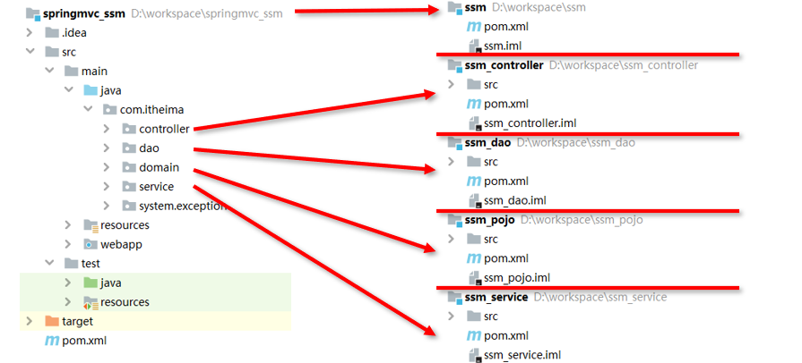

### **1.2)ssm_pojo拆分**

新建模块

拷贝原始项目中对应的相关内容到ssm_pojo模块中

​	实体类（User）

​	配置文件（无）

### **1.3)ssm_dao拆分**

- 新建模块

- 拷贝原始项目中对应的相关内容到ssm_dao模块中

  - 数据层接口（UserDao）

  - 配置文件：保留与数据层相关配置文件(3个）

  - 注意：分页插件在配置中与SqlSessionFactoryBean绑定，需要保留

  - pom.xml：引入数据层相关坐标即可，删除springmvc相关坐标

    - spring

    - mybatis

    - spring 整合mybatis

    - mysql

    - druid

    - pagehelper

    - 直接依赖ssm_pojo（对ssm_pojo模块执行install指令，将其安装到本地仓库）

### **1.4)ssm_service拆分**

- 新建模块

- 拷贝原始项目中对应的相关内容到ssm_service模块中

  - 业务层接口与实现类（UserService、UserServiceImpl）

  - 配置文件：保留与数据层相关配置文件(1个）

  - pom.xml：引入数据层相关坐标即可，删除springmvc相关坐标

    - spring

    - junit

    - spring 整合junit

    - 直接依赖ssm_dao（对ssm_dao模块执行install指令，将其安装到本地仓库）

    - 间接依赖ssm_pojo（由ssm_dao模块负责依赖关系的建立）

  - 修改service模块spring核心配置文件名，添加模块名称，格式：applicationContext-service.xml

  - 修改dao模块spring核心配置文件名，添加模块名称，格式：applicationContext-dao.xml

  - 修改单元测试引入的配置文件名称，由单个文件修改为多个文件

### **1.5)ssm_control拆分**

- 新建模块（使用webapp模板）

- 拷贝原始项目中对应的相关内容到ssm_controller模块中

  - 现层控制器类与相关设置类（UserController、异常相关……）

  - 配置文件：保留与表现层相关配置文件(1个）、服务器相关配置文件（1个）

  - pom.xml：引入数据层相关坐标即可，删除springmvc相关坐标

    - spring

    - springmvc

    - jackson

    - servlet

    - tomcat服务器插件

    - 直接依赖ssm_service（对ssm_service模块执行install指令，将其安装到本地仓库）

    - 间接依赖ssm_dao、ssm_pojo

  - 修改web.xml配置文件中加载spring环境的配置文件名称，使用*通配，加载所有applicationContext-开始的配置文件

**小节**

分模块开发

- 模块中仅包含当前模块对应的功能类与配置文件

- spring核心配置根据模块功能不同进行独立制作

- 当前模块所依赖的模块通过导入坐标的形式加入当前模块后才可以使用

- web.xml需要加载所有的spring核心配置文件

## 2)聚合

### **2.1)多模块构建维护**

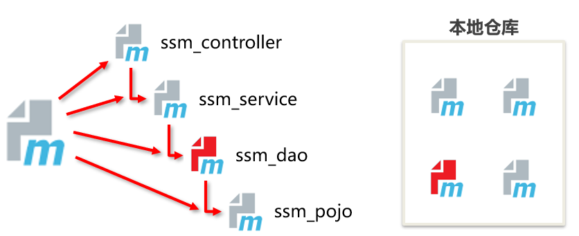

### **2.2)聚合**

- 作用：聚合用于快速构建maven工程，一次性构建多个项目/模块。

- 制作方式：

  - 创建一个空模块，打包类型定义为pom

    ```xml
    <packaging>pom</packaging>
    ```

  - 定义当前模块进行构建操作时关联的其他模块名称

    ```xml
    <modules>
        <module>../ssm_controller</module>
        <module>../ssm_service</module>
        <module>../ssm_dao</module>
        <module>../ssm_pojo</module>
    </modules>
    ```

注意事项：参与聚合操作的模块最终执行顺序与模块间的依赖关系有关，与配置顺序无关


## 3)继承

### **3.1)模块依赖关系维护**

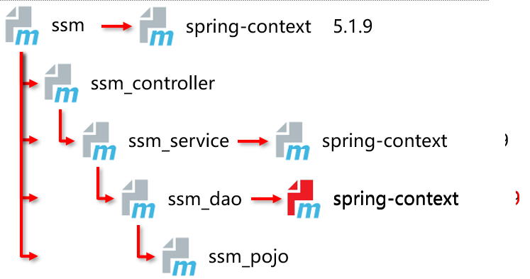

### **3.2)继承**

- 作用：通过继承可以实现在子工程中沿用父工程中的配置

  - maven中的继承与java中的继承相似，在子工程中配置继承关系

- 制作方式：

  - 在子工程中声明其父工程坐标与对应的位置

    ```xml
    <!--定义该工程的父工程-->
    <parent>
        <groupId>com.itheima</groupId>
        <artifactId>ssm</artifactId>
        <version>1.0-SNAPSHOT</version>
        <!--填写父工程的pom文件-->
        <relativePath>../ssm/pom.xml</relativePath>
    </parent>
    ```

### **3.3)继承依赖定义**

在父工程中定义依赖管理

```xml
<!--声明此处进行依赖管理-->
<dependencyManagement>
    <!--具体的依赖-->
    <dependencies>
        <!--spring环境-->
        <dependency>
            <groupId>org.springframework</groupId>
            <artifactId>spring-context</artifactId>
            <version>5.1.9.RELEASE</version>
        </dependency>
    <dependencies>
<dependencyManagement>
```

### **3.4)继承依赖使用**

在子工程中定义依赖关系，无需声明依赖版本，版本参照父工程中依赖的版本

```xml
<dependencies>
    <!--spring环境-->
    <dependency>
        <groupId>org.springframework</groupId>
        <artifactId>spring-context</artifactId>
    </dependency>
</dependencies>
```

### **3.5)继承的资源**

groupId：项目组ID，项目坐标的核心元素

version：项目版本，项目坐标的核心因素

description：项目的描述信息

organization：项目的组织信息

inceptionYear：项目的创始年份

url：项目的URL地址

developers：项目的开发者信息

contributors：项目的贡献者信息

distributionManagement：项目的部署配置

issueManagement：项目的缺陷跟踪系统信息

ciManagement：项目的持续集成系统信息

scm：项目的版本控制系统西溪

malilingLists：项目的邮件列表信息

properties：自定义的Maven属性

dependencies：项目的依赖配置

dependencyManagement：项目的依赖管理配置

repositories：项目的仓库配置

build：包括项目的源码目录配置、输出目录配置、插件配置、插件管理配置等

reporting：包括项目的报告输出目录配置、报告插件配置等

### **3.6)继承与聚合**

作用

- 聚合用于快速构建项目

- 继承用于快速配置

相同点：

- 聚合与继承的pom.xml文件打包方式均为pom，可以将两种关系制作到同一个pom文件中

- 聚合与继承均属于设计型模块，并无实际的模块内容

不同点：

- 聚合是在当前模块中配置关系，聚合可以感知到参与聚合的模块有哪些

- 继承是在子模块中配置关系，父模块无法感知哪些子模块继承了自己

## 4)属性

### **4.1)版本统一的重要性**

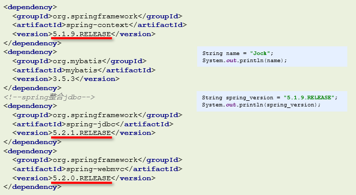

### **4.2)属性类别**

1.自定义属性

2.内置属性

3.Setting属性

4.Java系统属性

5.环境变量属性

### **4.3)属性类别：自定义属性**

作用

- 等同于定义变量，方便统一维护

定义格式：

```xml
<!--定义自定义属性-->
<properties>
    <spring.version>5.1.9.RELEASE</spring.version>
    <junit.version>4.12</junit.version>
</properties>
```

- 聚合与继承的pom.xml文件打包方式均为pom，可以将两种关系制作到同一个pom文件中

- 聚合与继承均属于设计型模块，并无实际的模块内容

调用格式：

```xml
<dependency>
    <groupId>org.springframework</groupId>
    <artifactId>spring-context</artifactId>
    <version>${spring.version}</version>
</dependency>
```

### **4.4)属性类别：内置属性**

作用

- 使用maven内置属性，快速配置

调用格式：

```xml
${basedir}
${version}
```

### **4.5)属性类别：Setting属性**

作用

- 使用Maven配置文件setting.xml中的标签属性，用于动态配置

调用格式：

```xml
${settings.localRepository} 
```

### **4.6)属性类别：Java系统属性**

作用

- 读取Java系统属性

调用格式

```
${user.home} 
```

系统属性查询方式

```
mvn help:system 
```

### **4.7)属性类别：环境变量属性**

作用

- 使用Maven配置文件setting.xml中的标签属性，用于动态配置

调用格式

```
${env.JAVA_HOME} 
```

环境变量属性查询方式

```
mvn help:system 
```

## 5)版本管理

### **5.1)工程版本区分**

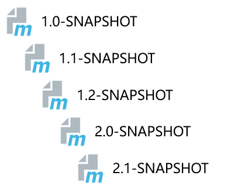

### **5.2)工程版本**

- SNAPSHOT（快照版本）

  - 项目开发过程中，为方便团队成员合作，解决模块间相互依赖和时时更新的问题，开发者对每个模块进行构建的时候，输出的临时性版本叫快照版本（测试阶段版本）

  - u快照版本会随着开发的进展不断更新

- RELEASE（发布版本）

  - u项目开发到进入阶段里程碑后，向团队外部发布较为稳定的版本，这种版本所对应的构件文件是稳定的，即便进行功能的后续开发，也不会改变当前发布版本内容，这种版本称为发布版本

### **5.3)工程版本号约定**

约定规范：

- <主版本>.<次版本>.<增量版本>.<里程碑版本>

- 主版本：表示项目重大架构的变更，如：spring5相较于spring4的迭代

- 次版本：表示有较大的功能增加和变化，或者全面系统地修复漏洞

- 增量版本：表示有重大漏洞的修复

- 里程碑版本：表明一个版本的里程碑（版本内部）。这样的版本同下一个正式版本相比，相对来说不是很稳定，有待更多的测试

范例：

- 5.1.9.RELEASE

## 6)资源配置

### **6.1)资源配置多文件维护**

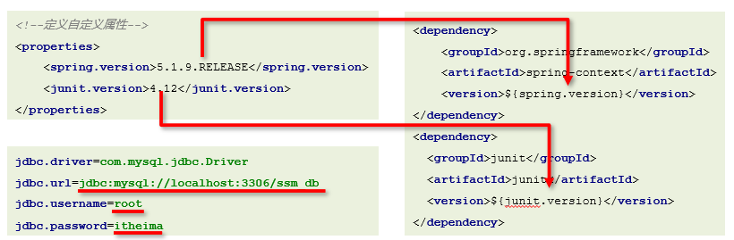

### **6.2)配置文件引用pom属性**

- 作用
  - 在任意配置文件中加载pom文件中定义的属性
- 调用格式

```
${jdbc.url} 
```

- 开启配置文件加载pom属性

  ```xml
  <!--配置资源文件对应的信息-->
  <resources> 
      <resource>  
          <!--设定配置文件对应的位置目录，支持使用属性动态设定路径-->        <directory>${project.basedir}/src/main/resources</directory>  
          <!--开启对配置文件的资源加载过滤-->  
          <filtering>true</filtering>  
      </resource>
  </resources>
  ```

## 7)多环境开发配置

### **7.1)多环境兼容**

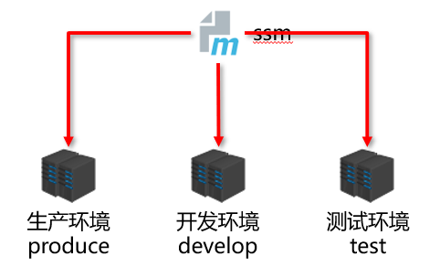

### **7.2)多环境配置**

```xml
<!--创建多环境-->
<profiles>  
    <!--定义具体的环境：生产环境--> 
    <profile>      
        <!--定义环境对应的唯一名称-->   
        <id>pro_env</id>   
        <!--定义环境中专用的属性值-->  
        <properties>        
            <jdbc.url>jdbc:mysql://127.1.1.1:3306/ssm_db</jdbc.url>   
        </properties>     
        <!--设置默认启动-->    
        <activation>       
            <activeByDefault>true</activeByDefault>  
        </activation>  
    </profile>  
    <!--定义具体的环境：开发环境-->  
    <profile>    
        <id>dev_env</id>  
        ……   
    </profile>
</profiles>
```

### **7.3)加载指定环境**

作用

- 加载指定环境配置

调用格式

```
mvn 指令 –P 环境定义id
```

范例

```
mvn install –P pro_env
```

## 8)跳过测试

### **8.1)跳过测试环节的应用场景**

整体模块功能未开发

模块中某个功能未开发完毕

单个功能更新调试导致其他功能失败

快速打包

……

### **8.2)使用命令跳过测试**

命令

```
mvn 指令 –D skipTests
```

注意事项

- 执行的指令生命周期必须包含测试环节

### **8.3)使用界面操作跳过测试**

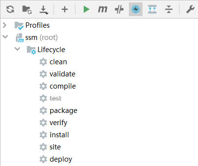

### **8.4)使用配置跳过测试**

```xml
<plugin>
    <artifactId>maven-surefire-plugin</artifactId> 
    <version>2.22.1</version>  
    <configuration> 
        <skipTests>true</skipTests><!--设置跳过测试--> 
        <includes> <!--包含指定的测试用例-->  
            <include>**/User*Test.java</include>  
        </includes>     
        <excludes><!--排除指定的测试用例-->    
            <exclude>**/User*TestCase.java</exclude>   
        </excludes> 
    </configuration>
</plugin>
```

## 9)私服

### **9.1)分模块合作开发**

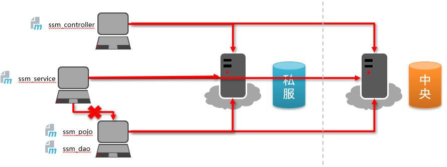

### **9.2)Nexus**

Nexus是Sonatype公司的一款maven私服产品

下载地址：https://help.sonatype.com/repomanager3/download 

### **9.3)Nexus*安装、启动与配置**

启动服务器（命令行启动）

```
nexus.exe /run nexus
```

访问服务器（默认端口：8081）

```
http://localhost:8081
```

修改基础配置信息

- 安装路径下etc目录中nexus-default.properties文件保存有nexus基础配置信息，例如默认访问端口

修改服务器运行配置信息

- 安装路径下bin目录中nexus.vmoptions文件保存有nexus服务器启动对应的配置信息，例如默认占用内存空间

### **9.4)私服资源获取**

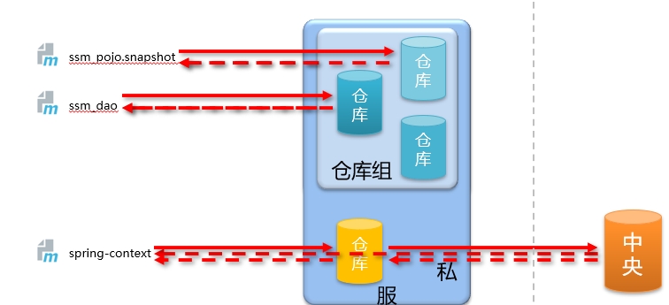

### **9.5)仓库分类**

宿主仓库hosted 

- 保存无法从中央仓库获取的资源
  - 自主研发
  - 第三方非开源项目

代理仓库proxy 

- 代理远程仓库，通过nexus访问其他公共仓库，例如中央仓库

仓库组group 

- 将若干个仓库组成一个群组，简化配置
- 仓库组不能保存资源，属于设计型仓库

### **9.6)资源上传**

上传资源时提供对应的信息

- 保存的位置（宿主仓库）

- 资源文件

- 对应坐标

### **9.7)idea环境中资源上传与下载**

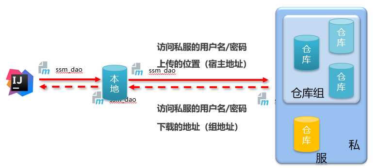

### **9.8)访问私服配置（本地仓库访问私服）**

配置本地仓库访问私服的权限（setting.xml）

```xml
<servers>  
    <server>  
        <id>heima-release</id>    
        <username>admin</username>   
        <password>admin</password>   
    </server>   
    <server>    
        <id>heima-snapshots</id> 
        <username>admin</username>  
        <password>admin</password>  
    </server>
</servers>
```

配置本地仓库资源来源（setting.xml）

```xml
<mirrors>  
    <mirror> 
        <id>nexus-heima</id> 
        <mirrorOf>*</mirrorOf> 
        <url>http://localhost:8081/repository/maven-public/</url> 
    </mirror>
</mirrors>
```

### **9.9)访问私服配置（ 项目工程访问私服）**

配置当前项目访问私服上传资源的保存位置（pom.xml）

```xml
<distributionManagement>  
    <repository>      
        <id>heima-release</id>   
        <url>http://localhost:8081/repository/heima-release/</url> 
    </repository>  
    <snapshotRepository>  
        <id>heima-snapshots</id>   
        <url>http://localhost:8081/repository/heima-snapshots/</url>    </snapshotRepository>
</distributionManagement>
```

```xml
<distributionManagement>  
    <repository>      
        <id>heima-release</id>       
        <url>http://localhost:8081/repository/heima-release/</url>   
    </repository> 
    <snapshotRepository>   
        <id>heima-snapshots</id>  
        <url>http://localhost:8081/repository/heima-snapshots/</url>    </snapshotRepository>
</distributionManagement>
```


发布资源到私服命令

```
mvn deploy
```

