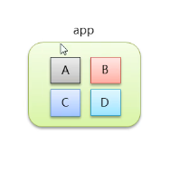
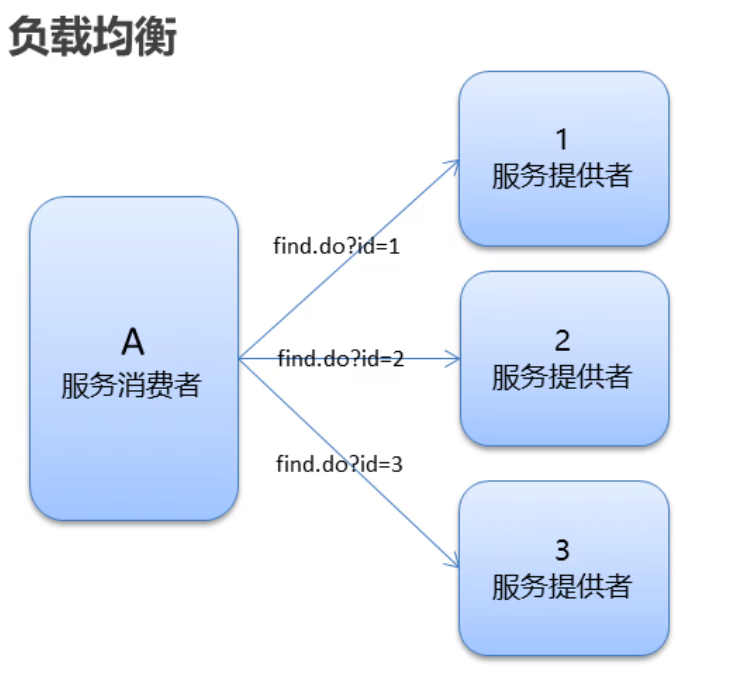

# dubbo

## **1-今日内容**

 分布式系统中的相关概念

dubbo 概述

dubbo快速入门

dubbo的高级特性


## **2-相关概念**

### 2.1-互联网项目架构-特点

互联网项目架构-特点

1. 用户多

2. 流量大，并发高

3. 海量数据

4. 易受攻击

5. 功能繁琐

6. 变更快

   

**传统项目和互联网项目的不同**


**用户体验**：
	美观、功能、速度、稳定性

**衡量一个网站速度是否快:**
	打开一个新页面一瞬间完成;页面内跳转，-刹那间完成。
	根据佛经《僧衹律》记载:一 刹那者为-念,二十念为-瞬,二十瞬为-弹
	指，二十弹指为-罗预， 二十罗预为-须臾，一日一夜有三十须臾。


### 2.2-互联网项目架构-目标


**衡量网站的性能指标:**
	**响应时间:**指执行一个请求从开始到最后收到响应数据所花费的总体时间。
	**并发数:**指系统同时能处理的请求数量。
	**并发连接数:** 指的是客户端向服务器发起请求，并建立了TCP连接。每秒钟服务器连接的总TCP数量
	**请求数:**也称为QPS(Query Per Second)指每秒多少请求.
	**并发用户数:**单位时间内有多少用户
	**吞吐量:**指单位时间内系统能处理的请求数量。


	●QPS: Query Per Second每秒查询数。
	●TPS: Transactions Per Second每秒事务数。
	●一个事务是指一 个客户机向服务器发送请求然后服务器做出反应的过程。客户机在发送请求时开始计时，收到服务器响应后结束
	计时，以此来计算使用的时间和完成的事务个数。
	●一个页面的一次访问，只会形成一 个TPS; 但-次页面请求，可能产生多次对服务器的请求，就会有多个QPS
	  QPS>=并发连接数>= TPS

**大型互联网项目架构目标**:

​	●**高性能:**提供快速的访问体验。
​	●**高可用:**网站服务- 可以正常访问

### 2.3-集群和分布式

集群和分布式，
●集群:很多“人”一起，干一样的事。
●一个业务模块，部署在多台服务器上。
●分布式:很多"人”一起，干不样的事。这些不一样的事， 合起来是一件大事。


### 2.4-架构演进

**单体架构：**

**优点:**
	简单:开发部署都很方便，小型项目首选
**缺点:**
●项目启动慢
●可靠性差




**垂直架构：**垂直架构是指将单体架构中的多个模块拆分为多个独立的项目。形成多个独立的单体架构。

**单体架构存在的问题:**

- 项目启动慢

- 可靠性差

- 可伸缩性差

- 扩展性和可维护性差

- 性能低

**垂直架构存在的问题:** 重复功能太多


**分布式架构：**是指在垂直架构的基础上,将公共业务模块抽取出来,作为独立的服务供其他调用者消费，以实现服务的共享和重用。底层通过RPC（远程过程调用实现）
	**RPC:** Remote Procedure Call远程过程调用。有非常多的协议和技术来都实现了RPC的过程。比如: HTTP REST风格，Java RMI规范、WebService SOAP协议Hession等等。
**垂直架构存在的问题:**
	●重复功能太多

**分布式架构存在的问题:**
​	●服务提供方- -旦产生变更,所有消费方都需要变更。


**SOA: (Service- Oriented Architecture,面向服务的架构)**：是一个组件模型,它将应用程序的不同功能单元(称为服务)进行拆分，并通过这些服务之间定义良好的接口和契约联系起来。

**ESB: (Enterparise Servce Bus)**：企业服务总线,服务中介。主要是提供了一一个服
务于服务之间的交互。ESB包含的功能如:负载均衡，流量控制，加密处理，服务
的监控，异常处理，监控告急等等。


**微服务架构：**

●微服务架构是在SOA上做的升华,微服务架构强调的一个重点是“业务需要彻底的组件化和服务化”，原有的单个
业务系统会拆分为多个可以独立开发、设计、运行的小应用。这些小应用之间通过服务完成交互和集成。

●微服务架构= 80%的SOA服务架构思想+ 100%的组件化架构思想+ 80%的领域建模思想


**特点:**
●服务实现组件化:开发者可以自由选择开发技术。也不需要协调其他团队
●服务之间交互一 般使用REST API
●去中心化:每个微服务有自己私有的数据库持久化业务数据
●自动化部署:把应用拆分成为一 个-个独立的单个服务,方便自动化部署、测试、运维


## 3-dubbo 概述

**Dubbo概念**

●Dubbo是阿里巴巴公司开源的一个高性能、轻量级的Java RPC框架。
●致力于提供高性能和透明化的RPC远程服务调用方案,以及SOA服务治理方案。
●官网: http://ubbo.apache.org


节点角色说明: .
●Provider: 暴露服务的服务提供方
●Contahier: 服务运行容器
●Consumer: 调用远程服务的服务消费方
●Registry: 服务注册与发现的注册中心
●Monitor:统计服务的调用次数和调用时间的监控中心


## 4-dubbo快速入门

### 4.1zookeeper安装

安装步骤：

第一步：安装 jdk（略）
第二步：把 zookeeper 的压缩包（zookeeper-3.4.6.tar.gz）上传到 linux 系统
第三步：解压缩压缩包

```sh
tar -zxvf  zookeeper-3.4.6.tar.gz
```

第四步：进入zookeeper-3.4.6目录，创建data目录

```sh
mkdir data
```

第五步：进入conf目录 ，把zoo_sample.cfg 改名为zoo.cfg

```sh
cd conf
mv zoo_sample.cfg zoo.cfg
```

第六步：打开zoo.cfg文件,  修改data属性：

```sh
dataDir=/root/zookeeper-3.4.6/data
```


进入Zookeeper的bin目录，启动服务命令

```sh
./zkServer.sh start
```


停止服务命令

```sh
./zkServer.sh stop
```


查看服务状态：standalone 单节点

```sh
./zkServer.sh status
```


### 4.2spring和springmvc整合

实施步骤：

1.创建服务提供者Provider模块
2.创建服务消费者Consumer模块
3.在服务提供者模块编写UserServicelmpl提供服务
4.在服务消费者中的UserC ontroller远程调用
5.UserServicelmpl提供的服务
6.分别启动两个服务，测试


Dubbo作为一个RPC框架，其最核心的功能就是要实现跨网络的远程调用。本小节就是要创建两个应用，一个作为服务的提供方，一个作为服务的消费方。通过Dubbo来实现服务消费方远程调用服务提供方的方法。

1 服务提供方开发

开发步骤：

（1）创建maven工程（打包方式为war）dubbodemo_provider，在pom.xml文件中导入如下坐标

```xml
<properties>
    <project.build.sourceEncoding>UTF-8</project.build.sourceEncoding>
    <maven.compiler.source>1.8</maven.compiler.source>
    <maven.compiler.target>1.8</maven.compiler.target>
    <spring.version>5.0.5.RELEASE</spring.version>
</properties>
<dependencies>
    <dependency>
        <groupId>org.springframework</groupId>
        <artifactId>spring-context</artifactId>
        <version>${spring.version}</version>
    </dependency>
    <dependency>
        <groupId>org.springframework</groupId>
        <artifactId>spring-beans</artifactId>
        <version>${spring.version}</version>
    </dependency>
    <dependency>
        <groupId>org.springframework</groupId>
        <artifactId>spring-webmvc</artifactId>
        <version>${spring.version}</version>
    </dependency>
    <dependency>
        <groupId>org.springframework</groupId>
        <artifactId>spring-jdbc</artifactId>
        <version>${spring.version}</version>
    </dependency>
    <dependency>
        <groupId>org.springframework</groupId>
        <artifactId>spring-aspects</artifactId>
        <version>${spring.version}</version>
    </dependency>
    <dependency>
        <groupId>org.springframework</groupId>
        <artifactId>spring-jms</artifactId>
        <version>${spring.version}</version>
    </dependency>
    <dependency>
        <groupId>org.springframework</groupId>
        <artifactId>spring-context-support</artifactId>
        <version>${spring.version}</version>
    </dependency> <!-- dubbo相关 -->
    <dependency>
        <groupId>com.alibaba</groupId>
        <artifactId>dubbo</artifactId>
        <version>2.6.0</version>
    </dependency>
    <dependency>
        <groupId>org.apache.zookeeper</groupId>
        <artifactId>zookeeper</artifactId>
        <version>3.4.6</version>
    </dependency>
    <dependency>
        <groupId>com.github.sgroschupf</groupId>
        <artifactId>zkclient</artifactId>
        <version>0.1</version>
    </dependency>
    <dependency>
        <groupId>javassist</groupId>
        <artifactId>javassist</artifactId>
        <version>3.12.1.GA</version>
    </dependency>
    <dependency>
        <groupId>com.alibaba</groupId>
        <artifactId>fastjson</artifactId>
        <version>1.2.47</version>
    </dependency>
</dependencies>
<build>
    <plugins>
        <plugin>
            <groupId>org.apache.maven.plugins</groupId>
            <artifactId>maven-compiler-plugin</artifactId>
            <version>2.3.2</version>
            <configuration>
                <source>1.8</source>
                <target>1.8</target>
            </configuration>
        </plugin>
        <plugin>
            <groupId>org.apache.tomcat.maven</groupId>
            <artifactId>tomcat7-maven-plugin</artifactId>
            <configuration>
                <!-- 指定端口 -->
                <port>8081</port> <!-- 请求路径 -->
                <path>/</path>
            </configuration>
        </plugin>
    </plugins>
</build>
```

（2）配置web.xml文件

```xml
<!DOCTYPE web-app PUBLIC "-//Sun Microsystems, Inc.//DTD Web Application 2.3//EN" "http://java.sun.com/dtd/web-app_2_3.dtd">
<web-app>
  <display-name>Archetype Created Web Application</display-name>
  <context-param>
    <param-name>contextConfigLocation</param-name>
    <param-value>classpath:applicationContext*.xml</param-value>
  </context-param>
  <listener>
    <listener-class
      >org.springframework.web.context.ContextLoaderListener</listener-class
    >
  </listener>
</web-app>

```

（3）创建服务接口

```java
package com.itheima.service;public interface HelloService {    public String sayHello(String name);}
```

（4）创建服务实现类


**注意：**服务实现类上使用的Service注解是Dubbo提供的，用于对外发布服务

```java
package com.itheima.service.impl;import com.alibaba.dubbo.config.annotation.Service;import com.itheima.service.HelloService;@Servicepublic class HelloServiceImpl implements HelloService {    public String sayHello(String name) {        return "hello " + name;    }}
```


tomcat7:run

2 服务消费方开发

开发步骤：

（1）创建maven工程（打包方式为war）dubbodemo_consumer，pom.xml配置和上面服务提供者相同，只需要将Tomcat插件的端口号改为8082即可

（2）配置web.xml文件

```xml
<!DOCTYPE web-app
    PUBLIC "-//Sun Microsystems, Inc.//DTD Web Application 2.3//EN" "http://java.sun.com/dtd/web-app_2_3.dtd">
<web-app>
    <display-name>Archetype Created Web Application</display-name>
    <servlet>
        <servlet-name>springmvc</servlet-name>
        <servlet-class>org.springframework.web.servlet.DispatcherServlet</servlet-class>
        <!-- 指定加载的配置文件 ，通过参数contextConfigLocation加载 -->
        <init-param>
            <param-name>contextConfigLocation</param-name>
            <param-value>classpath:applicationContext-web.xml</param-value>
        </init-param>
        <load-on-startup>1</load-on-startup>
    </servlet>
    <servlet-mapping>
        <servlet-name>springmvc</servlet-name>
        <url-pattern>*.do</url-pattern>
    </servlet-mapping>
</web-app>
```

（3）将服务提供者工程中的HelloService接口复制到当前工程

（4）编写Controller

```java
package com.itheima.controller;import com.alibaba.dubbo.config.annotation.Reference;import com.itheima.service.HelloService;import org.springframework.stereotype.Controller;import org.springframework.web.bind.annotation.RequestMapping;import org.springframework.web.bind.annotation.ResponseBody;@Controller@RequestMapping("/demo")public class HelloController {    @Reference    private HelloService helloService;    @RequestMapping("/hello")    @ResponseBody    public String getName(String name){        //远程调用        String result = helloService.sayHello(name);        System.out.println(result);        return result;    }}
```

注意：Controller中注入HelloService使用的是Dubbo提供的@Reference注解

### 4.3服务提供者

在dubbodemo_provider工程中src/main/resources下创建applicationContext-service.xml 

```xml
<?xml version="1.0" encoding="UTF-8"?>
<beans xmlns="http://www.springframework.org/schema/beans" xmlns:xsi="http://www.w3.org/2001/XMLSchema-instance"
    xmlns:p="http://www.springframework.org/schema/p" xmlns:context="http://www.springframework.org/schema/context"
    xmlns:dubbo="http://code.alibabatech.com/schema/dubbo" xmlns:mvc="http://www.springframework.org/schema/mvc"
    xsi:schemaLocation="http://www.springframework.org/schema/beans		http://www.springframework.org/schema/beans/spring-beans.xsd         http://www.springframework.org/schema/mvc         http://www.springframework.org/schema/mvc/spring-mvc.xsd         http://code.alibabatech.com/schema/dubbo         http://code.alibabatech.com/schema/dubbo/dubbo.xsd         http://www.springframework.org/schema/context         http://www.springframework.org/schema/context/spring-context.xsd">
    <!-- 当前应用名称，用于注册中心计算应用间依赖关系，注意：消费者和提供者应用名不要一样 -->
    <dubbo:application name="dubbodemo_provider" /> <!-- 连接服务注册中心zookeeper ip为zookeeper所在服务器的ip地址-->
    <dubbo:registry address="zookeeper://192.168.134.129:2181" /> <!-- 注册  协议和port   端口默认是20880 -->
    <dubbo:protocol name="dubbo" port="20881"></dubbo:protocol> <!-- 扫描指定包，加上@Service注解的类会被发布为服务  -->
    <dubbo:annotation package="com.itheima.service.impl" />
</beans>
```


### 4.4服务消费者

在dubbodemo_consumer工程中src/main/resources下创建applicationContext-web.xml

```xml
<?xml version="1.0" encoding="UTF-8"?>
<beans xmlns="http://www.springframework.org/schema/beans" xmlns:xsi="http://www.w3.org/2001/XMLSchema-instance"
    xmlns:p="http://www.springframework.org/schema/p" xmlns:context="http://www.springframework.org/schema/context"
    xmlns:dubbo="http://code.alibabatech.com/schema/dubbo" xmlns:mvc="http://www.springframework.org/schema/mvc"
    xsi:schemaLocation="http://www.springframework.org/schema/beans			http://www.springframework.org/schema/beans/spring-beans.xsd			http://www.springframework.org/schema/mvc			http://www.springframework.org/schema/mvc/spring-mvc.xsd			http://code.alibabatech.com/schema/dubbo			http://code.alibabatech.com/schema/dubbo/dubbo.xsd			http://www.springframework.org/schema/context			http://www.springframework.org/schema/context/spring-context.xsd">
    <!-- 当前应用名称，用于注册中心计算应用间依赖关系，注意：消费者和提供者应用名不要一样 -->
    <dubbo:application name="dubbodemo-consumer" /> <!-- 连接服务注册中心zookeeper ip为zookeeper所在服务器的ip地址-->
    <dubbo:registry address="zookeeper://192.168.134.129:2181" /> <!-- 包扫描的方式 引用服务 扫描@Reference -->
    <dubbo:annotation package="com.itheima.controller" />
</beans>
```


运行测试

tomcat7:run启动

在浏览器输入http://localhost:8082/demo/hello.do?name=Jack，查看浏览器输出结果

## 5-dubbo高级特性

### 5.1dubbo-admin安装

dubbo- admin
	●dubbo-admin管理平台，是图形化的服务管理页面
	●从注册中心中获取到所有的提供者 /消费者进行配置管理
	●路由规则、动态配置、服务降级、访问控制、权重调整、负载均衡等管理功能
	●dubbo- admin是一个前后端分离的项目。前端使用vue，后端使用springboot
	●安装dubbo-admin其实就是部署该项目


### 5.3序列化


1. dubbo 内部已经将序列化和反序列化的过程内部封装了
2. 我们只需要在定义pojo类时**实现seriali zable接口**即可
3. 一般会定义一 个公共的pojo模块,让生产者和消费者都依赖该模块。


User对象未实现seriali zable接口

错误信息：


解决办法：

```java
User implements Serializable
```


### 5.4地址缓存


**注册中心挂了，服务是否可以正常访问？**

1.  可以，因为dubbo服务消费者在第一-次调用时，会将服务提供方地址缓存到本地，以后在调用则不会访问注册中心。
2.  当服务提供者地址发生变化时，注册中心会通知服务消费者。


### 5.5 超时


- 服务消费者在调用服务提供者的时候发生了阻塞、等待的情形,这个时候,服务消费者会直等待下去。
- 在某个峰值时刻，大量的请求都在同时请求服务消费者,会造成线程的大量堆积，势必会造成雪崩。
- dubbo利用超时机制来解决这个问题，设置-个超时时间, 在这个时间段内，无法完成服务访问,则自动断开连接。
- 使用timeout属性配置超时时间，默认值1000，单位毫秒

```java
//timeout 超时时间 单位毫秒  retries 重试次数@Service(timeout = 3000,retries=0)
```


### 5.6重试


1. 设置了超时时间，在这个时间段内，无法完成服务访问,则自动断开连接。
2. 如果出现网络抖动,则这一-次请求就会失败。
3. Dubbo提供重试机制来避免类似问题的发生。
4. 通过retries属性来设置重试次数。默认为2次

```java
//timeout 超时时间 单位毫秒  retries 重试次数@Service(timeout = 3000,retries=0)
```

### 5.7多版本


**灰度发布:**当出现新功能时,会让一部分用户先使用新功能，用户反馈没问题时，再将所有用户迁移到新功能。

dubbo中使用version属性来设置和调用同一个接口的不同版本


生产者配置

```java
@Service(version="v2.0")public class UserServiceImp12 implements UserService {...}
```

消费者配置

```java
@Reference(version = "v2.0")//远程注入private UserService userService;
```


### 5.8负载均衡

**负载均衡策略(4种) :** 
**Random:**按权重随机，默认值。按权重设置随机概率。

**RoundRobin:** 按权重轮询。

**LeastActive:** 最少活跃调用数,相同活跃数的随机。

**ConsistentHash:**一 致性Hash,相同参数的请求总是发到同一提供者。




服务提供者配置

```java
@Service(weight = 100)public class UserServiceImp12 implements UserService {...}
```


application.xml 配置parameter key


消费者配置

```java
//@Reference(loadbalance = "roundrobin")//@Reference(loadbalance = "leastactive")//@Reference(loadbalance = "consistenthash")@Reference(loadbalance = "random")//默认 按权重随机private UserService userService;
```

### 5.9集群容错


**集群容错模式:**
	**Failover Cluster:**失败重试。默认值。当出现失败，重试其它服务器，默认重试2次，使用retries配置。一般用于读操作
	**Failfast Cluster :**快速失败,发起-次调用，失败立即报错。通常用于写操作。
	**Failsafe Cluster:**失败安全，出现异常时，直接忽略。返回一个空结果。
	**Failback Cluster:**失败自动恢复,后台记录失败请求,定时重发。
	**Forking Cluster :**并行调用多个服务器，只要一个成功即返回。
	**Broadcast Cluster:** 广播调用所有提供者,逐个调用，任意一台报错则报错。

消费者配置

```java
@Reference(cluster = "failover")//远程注入private UserService userService;
```

### 5.10服务降级

**服务降级**：当服务器压力剧增的情况下，根据实际业务情况及流量，对一些服务和页面有策略的不处理或换种简单的方式处理，从而释放服务器资源以保证**核心交易**正常运作或高效运作

**服务降级方式:**
**mock= force:return null**：表示消费方对该服务的方法调用都直接返回null值,不发起远程调用。用来屏蔽不重要服务不可用时对调用方的影响。

**mock=fail:return null**：表示消费方对该服务的方法调用在失败后，再返回null值,不抛异常。用来容忍不重要服务不稳定时对调用方的影响


消费方配置

```java
//远程注入@Reference(mock =“ force :return null")//不再调用userService的服务private UserService userService;
```


