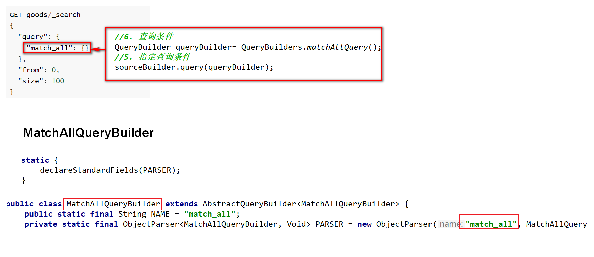
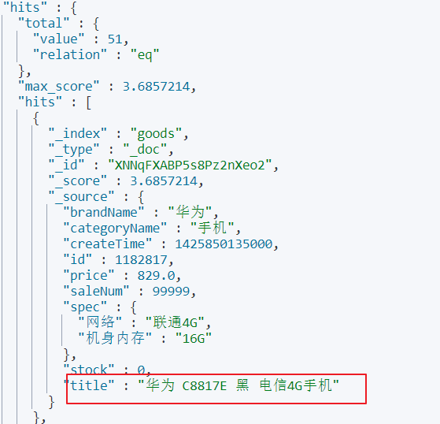
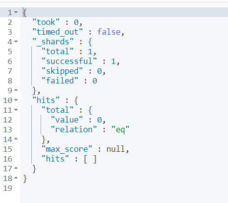
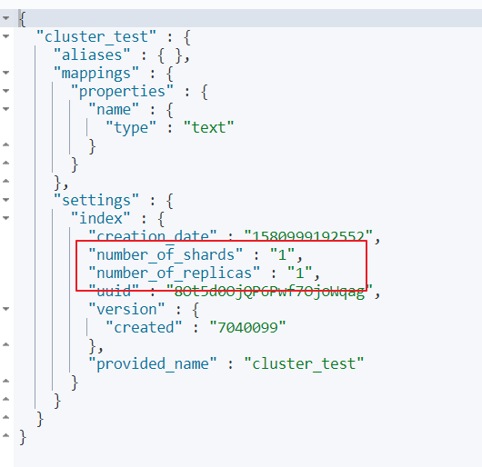
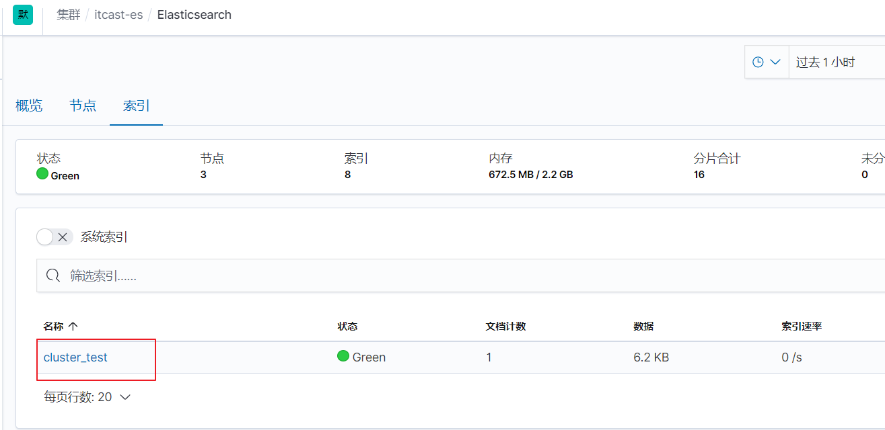

## **01-今日内容**

1.  ElasticSearch 高级操作

2.  ElasticSearch 集群管理


## **02-ElasticSearch高级操作**

### 2.1-bulk批量操作-脚本

 脚本：

测试用的5号文档

```
POST /person1/_doc/5
{
  "name":"张三5号",
  "age":18,
  "address":"北京海淀区"
}
```

批量操作文本

```json
#批量操作
#1.删除5号
#新增8号
#更新2号 name为2号
POST _bulk
{"delete":{"_index":"person1","_id":"5"}}
{"create":{"_index":"person1","_id":"8"}}
{"name":"八号","age":18,"address":"北京"}
{"update":{"_index":"person1","_id":"2"}}
{"doc":{"name":"2号"}}
```

结果

```json
{
  "took" : 51,
  "errors" : true,
  "items" : [
    {
      "delete" : {
        "_index" : "person1",
        "_type" : "_doc",
        "_id" : "5",
        "_version" : 2,
        "result" : "deleted",
        "_shards" : {
          "total" : 2,
          "successful" : 1,
          "failed" : 0
        },
        "_seq_no" : 6,
        "_primary_term" : 2,
        "status" : 200
      }
    },
    {
      "create" : {
        "_index" : "person1",
        "_type" : "_doc",
        "_id" : "8",
        "_version" : 1,
        "result" : "created",
        "_shards" : {
          "total" : 2,
          "successful" : 1,
          "failed" : 0
        },
        "_seq_no" : 7,
        "_primary_term" : 2,
        "status" : 201
      }
    },
    {
      "update" : {
        "_index" : "person1",
        "_type" : "_doc",
        "_id" : "2",
        "_version" : 2,
        "result" : "updated",
        "_shards" : {
          "total" : 2,
          "successful" : 1,
          "failed" : 0
        },
        "_seq_no" : 10,
        "_primary_term" : 2,
        "status" : 200
      }
    }
  ]
}

```


### **2.2-bulk批量操作-JavaAPI**


```java
 /**
     *  Bulk 批量操作
     */
    @Test
    public void test2() throws IOException {

        //创建bulkrequest对象，整合所有操作
        BulkRequest bulkRequest =new BulkRequest();

           /*
        # 1. 删除5号记录
        # 2. 添加6号记录
        # 3. 修改3号记录 名称为 “三号”
         */
        //添加对应操作
        //1. 删除5号记录
        DeleteRequest deleteRequest=new DeleteRequest("person1","5");
        bulkRequest.add(deleteRequest);

        //2. 添加6号记录
        Map<String, Object> map=new HashMap<>();
        map.put("name","六号");
        IndexRequest indexRequest=new IndexRequest("person1").id("6").source(map);
        bulkRequest.add(indexRequest);
        //3. 修改3号记录 名称为 “三号”
        Map<String, Object> mapUpdate=new HashMap<>();
        mapUpdate.put("name","三号");
        UpdateRequest updateRequest=new UpdateRequest("person1","3").doc(mapUpdate);

        bulkRequest.add(updateRequest);
        //执行批量操作


        BulkResponse response = client.bulk(bulkRequest, RequestOptions.DEFAULT);
        System.out.println(response.status());

    }
```


### **2.3-导入数据-分析&创建索引**

 

```json
PUT goods
{
	"mappings": {
		"properties": {
			"title": {
				"type": "text",
				"analyzer": "ik_smart"
			},
			"price": { 
				"type": "double"
			},
			"createTime": {
				"type": "date"
			},
			"categoryName": {	
				"type": "keyword"
			},
			"brandName": {	
				"type": "keyword"
			},
	
			"spec": {		
				"type": "object"
			},
			"saleNum": {	
				"type": "integer"
			},
			
			"stock": {	
				"type": "integer"
			}
		}
	}
}
```


### **2.4-导入数据-代码实现**

 

```java
 /**
     * 从Mysql 批量导入 elasticSearch
     */
    @Test
    public void test3() throws IOException {
        //1.查询所有数据，mysql
        List<Goods> goodsList = goodsMapper.findAll();

        //2.bulk导入
        BulkRequest bulkRequest=new BulkRequest();

        //2.1 循环goodsList，创建IndexRequest添加数据
        for (Goods goods : goodsList) {

            //2.2 设置spec规格信息 Map的数据   specStr:{}
            String specStr = goods.getSpecStr();

            //将json格式字符串转为Map集合
            Map map = JSON.parseObject(specStr, Map.class);

            //设置spec map
            goods.setSpec(map);

            //将goods对象转换为json字符串
            String data = JSON.toJSONString(goods);

            IndexRequest indexRequest=new IndexRequest("goods").source(data,XContentType.JSON);
            bulkRequest.add(indexRequest);

        }


        BulkResponse response = client.bulk(bulkRequest, RequestOptions.DEFAULT);
        System.out.println(response.status());

    }
```


### **2.5-导入数据-代码实现-详解（选放）**

 转换成JSON的原因：

```JSON
#spec配置的数据类型是JSON对象，所以当存放字符串的时候报错
			"spec": {		
				"type": "object"
			},
```


错误信息


## **3-ElasticSearch查询**

###  3.1-matchAll-脚本

```json
# 默认情况下，es一次展示10条数据,通过from和size来控制分页
# 查询结果详解

GET goods/_search
{
  "query": {
    "match_all": {}
  },
  "from": 0,
  "size": 100
}

GET goods
```


### **3.2-matchAll-JavaAPI**

 

```java
/**     * 查询所有     *  1. matchAll     *  2. 将查询结果封装为Goods对象，装载到List中     *  3. 分页。默认显示10条     */    @Test    public void matchAll() throws IOException {        //2. 构建查询请求对象，指定查询的索引名称        SearchRequest searchRequest=new SearchRequest("goods");        //4. 创建查询条件构建器SearchSourceBuilder        SearchSourceBuilder sourceBuilder=new SearchSourceBuilder();        //6. 查询条件        QueryBuilder queryBuilder= QueryBuilders.matchAllQuery();        //5. 指定查询条件        sourceBuilder.query(queryBuilder);        //3. 添加查询条件构建器 SearchSourceBuilder        searchRequest.source(sourceBuilder);        // 8 . 添加分页信息  不设置 默认10条//        sourceBuilder.from(0);//        sourceBuilder.size(100);        //1. 查询,获取查询结果        SearchResponse searchResponse = client.search(searchRequest, RequestOptions.DEFAULT);        //7. 获取命中对象 SearchHits        SearchHits hits = searchResponse.getHits();        //7.1 获取总记录数      Long total= hits.getTotalHits().value;        System.out.println("总数："+total);        //7.2 获取Hits数据  数组        SearchHit[] hits1 = hits.getHits();            //获取json字符串格式的数据        List<Goods> goodsList = new ArrayList<>();        for (SearchHit searchHit : hits1) {            String sourceAsString = searchHit.getSourceAsString();            //转为java对象            Goods goods = JSON.parseObject(sourceAsString, Goods.class);            goodsList.add(goods);        }        for (Goods goods : goodsList) {            System.out.println(goods);        }    }
```


设置条件的疑问点




### **3.3-termQuery**


term查询和字段类型有关系，首先回顾一下ElasticSearch两个数据类型

 ElasticSearch两个数据类型

```
text：会分词，不支持聚合keyword：不会分词，将全部内容作为一个词条，支持聚合
```

term查询：不会对查询条件进行分词。

```
GET goods/_search{  "query": {    "term": {      "title": {        "value": "华为"      }    }  }}
```

term查询，查询text类型字段时，只有其中的单词相匹配都会查到，text字段会对数据进行分词

例如：查询title 为“华为”的，title type 为text





查询categoryName 字段时，categoryName字段为keyword  ,keyword：不会分词，将全部内容作为一个词条,

即完全匹配，才能查询出结果


```json
GET goods/_search{  "query": {    "term": {      "categoryName": {        "value": "华为手机"      }    }  }}
```





### **3.4-matchQuery**

 

match查询：

•会对查询条件进行分词。

•然后将分词后的查询条件和词条进行等值匹配

•默认取并集（OR）


```
# match查询GET goods/_search{  "query": {    "match": {      "title": "华为手机"    }  },  "size": 500}
```


match 的默认搜索（or 并集）

例如：华为手机，会分词为 “华为”，“手机” 只要出现其中一个词条都会搜索到

match的 and（交集） 搜索

例如：例如：华为手机，会分词为 “华为”，“手机”  但要求“华为”，和“手机”同时出现在词条中


**总结：**

- term query会去倒排索引中寻找确切的term，它并不知道分词器的存在。这种查询适合**keyword** 、**numeric**、**date**
- match query知道分词器的存在。并且理解是如何被分词的


### **3.5-模糊查询-脚本**

### 3.5.1-wildcard查询

wildcard查询：会对查询条件进行分词。还可以使用通配符 ?（任意单个字符） 和  * （0个或多个字符）

```
"*华*"  包含华字的"华*"   华字后边多个字符"华?"  华字后边多个字符"*华"或"?华" 会引发全表（全索引）扫描 注意效率问题
```


```json
# wildcard 查询。查询条件分词，模糊查询GET goods/_search{  "query": {    "wildcard": {      "title": {        "value": "华*"      }    }  }}
```

### 3.5.2正则查询

```
\W：匹配包括下划线的任何单词字符，等价于 [A-Z a-z 0-9_]   开头的反斜杠是转义符+号多次出现(.)*为任意字符正则查询取决于正则表达式的效率
```

```json
GET goods/_search{  "query": {    "regexp": {      "title": "\\w+(.)*"    }  }}
```

### 3.5.3前缀查询

 对keyword类型支持比较好

```json
# 前缀查询 对keyword类型支持比较好GET goods/_search{  "query": {    "prefix": {      "brandName": {        "value": "三"      }    }  }}
```


### **3.6-模糊查询-JavaAPI**

 

```java
//模糊查询WildcardQueryBuilder query = QueryBuilders.wildcardQuery("title", "华*");//华后多个字符//正则查询 RegexpQueryBuilder query = QueryBuilders.regexpQuery("title", "\\w+(.)*"); //前缀查询 PrefixQueryBuilder query = QueryBuilders.prefixQuery("brandName", "三");
```


### **3.7-范围&排序查询**

 

```json
# 范围查询GET goods/_search{  "query": {    "range": {      "price": {        "gte": 2000,        "lte": 3000      }    }  },  "sort": [    {      "price": {        "order": "desc"      }    }  ]}
```


```java
 //范围查询 以price 价格为条件RangeQueryBuilder query = QueryBuilders.rangeQuery("price");//指定下限query.gte(2000);//指定上限query.lte(3000);sourceBuilder.query(query);//排序  价格 降序排列sourceBuilder.sort("price",SortOrder.DESC);
```


### **3.8-queryString查询**

 queryString 多条件查询

•会对查询条件进行分词。

•然后将分词后的查询条件和词条进行等值匹配

•默认取并集（OR）

•可以指定多个查询字段

query_string：识别query中的连接符（or 、and）

```
# queryStringGET goods/_search{  "query": {    "query_string": {      "fields": ["title","categoryName","brandName"],       "query": "华为 AND 手机"    }  }}
```


simple_query_string：不识别query中的连接符（or 、and），查询时会将 “华为”、"and"、“手机”分别进行查询

```
GET goods/_search{  "query": {    "simple_query_string": {      "fields": ["title","categoryName","brandName"],       "query": "华为 AND 手机"    }  }}
```


query_string：有default_operator连接符的脚本

```json
GET goods/_search{  "query": {    "query_string": {      "fields": ["title","brandName","categoryName"],      "query": "华为手机 "      , "default_operator": "AND"    }  }}
```

java代码

```java
QueryStringQueryBuilder query = QueryBuilders.queryStringQuery("华为手机").field("title").field("categoryName").field("brandName").defaultOperator(Operator.AND);
```


simple_query_string：有default_operator连接符的脚本

```json
GET goods/_search{  "query": {    "simple_query_string": {      "fields": ["title","brandName","categoryName"],      "query": "华为手机 "      , "default_operator": "OR"    }  }}
```


注意：query中的or   and 是查询时 匹配条件是否同时出现----or 出现一个即可，and 两个条件同时出现

default_operator的or   and 是对结果进行 并集（or）、交集（and）


### **3.9-布尔查询-脚本**

 boolQuery：对多个查询条件连接。连接方式：

•must（and）：条件必须成立

•must_not（not）：条件必须不成立

•should（or）：条件可以成立

•filter：条件必须成立，性能比must高。不会计算得分

**得分:**即条件匹配度,匹配度越高，得分越高


```json 
# boolquery#must和filter配合使用时，max_score（得分）是显示的#must 默认数组形式GET goods/_search{  "query": {    "bool": {      "must": [        {          "term": {            "brandName": {              "value": "华为"            }          }        }      ],      "filter":[         {        "term": {          "title": "手机"        }       },       {         "range":{          "price": {            "gte": 2000,            "lte": 3000         }         }       }            ]    }  }}#filter 单独使用   filter可以是单个条件，也可多个条件（数组形式）GET goods/_search{  "query": {    "bool": {      "filter": [        {          "term": {            "brandName": {              "value": "华为"            }          }        }      ]    }  }}
```


### **3.10-布尔查询-JavaAPI**

布尔查询：boolQuery 

1. 查询品牌名称为:华为 
2. 查询标题包含：手机
3. 查询价格在：2000-3000 

must 、filter为连接方式

term、match为不同的查询方式

```java
       //1.构建boolQuery        BoolQueryBuilder boolQuery = QueryBuilders.boolQuery();        //2.构建各个查询条件        //2.1 查询品牌名称为:华为        TermQueryBuilder termQueryBuilder = QueryBuilders.termQuery("brandName", "华为");        boolQuery.must(termQueryBuilder);        //2.2. 查询标题包含：手机        MatchQueryBuilder matchQuery = QueryBuilders.matchQuery("title", "手机");        boolQuery.filter(matchQuery);        //2.3 查询价格在：2000-3000        RangeQueryBuilder rangeQuery = QueryBuilders.rangeQuery("price");        rangeQuery.gte(2000);        rangeQuery.lte(3000);        boolQuery.filter(rangeQuery);        sourceBuilder.query(boolQuery);
```


### **3.11-聚合查询-脚本**

 

•指标聚合：相当于MySQL的聚合函数。max、min、avg、sum等

•桶聚合：相当于MySQL的 group by 操作。不要对text类型的数据进行分组，会失败。


```json
# 聚合查询# 指标聚合 聚合函数GET goods/_search{  "query": {    "match": {      "title": "手机"    }  },  "aggs": {    "max_price": {      "max": {        "field": "price"      }    }  }}# 桶聚合  分组GET goods/_search{  "query": {    "match": {      "title": "手机"    }  },  "aggs": {    "goods_brands": {      "terms": {        "field": "brandName",        "size": 100      }    }  }}
```


### **3.12-聚合查询-JavaAPI**

 

聚合查询：桶聚合，分组查询

1. 查询title包含手机的数据
2. 查询品牌列表

```java 
/**     * 聚合查询：桶聚合，分组查询     * 1. 查询title包含手机的数据     * 2. 查询品牌列表     */@Testpublic void testAggQuery() throws IOException {    SearchRequest searchRequest=new SearchRequest("goods");    SearchSourceBuilder sourceBuilder=new SearchSourceBuilder();    //1. 查询title包含手机的数据    MatchQueryBuilder queryBuilder = QueryBuilders.matchQuery("title", "手机");    sourceBuilder.query(queryBuilder);    //2. 查询品牌列表  只展示前100条    AggregationBuilder aggregation=AggregationBuilders.terms("goods_brands").field("brandName").size(100);    sourceBuilder.aggregation(aggregation);    searchRequest.source(sourceBuilder);    SearchResponse searchResponse = client.search(searchRequest, RequestOptions.DEFAULT);    //7. 获取命中对象 SearchHits    SearchHits hits = searchResponse.getHits();    //7.1 获取总记录数    Long total= hits.getTotalHits().value;    System.out.println("总数："+total);    // aggregations 对象    Aggregations aggregations = searchResponse.getAggregations();    //将aggregations 转化为map    Map<String, Aggregation> aggregationMap = aggregations.asMap();    //通过key获取goods_brands 对象 使用Aggregation的子类接收  buckets属性在Terms接口中体现    //        Aggregation goods_brands1 = aggregationMap.get("goods_brands");    Terms goods_brands =(Terms) aggregationMap.get("goods_brands");    //获取buckets 数组集合    List<? extends Terms.Bucket> buckets = goods_brands.getBuckets();    Map<String,Object>map=new HashMap<>();    //遍历buckets   key 属性名，doc_count 统计聚合数    for (Terms.Bucket bucket : buckets) {        System.out.println(bucket.getKey());        map.put(bucket.getKeyAsString(),bucket.getDocCount());    }    System.out.println(map);}
```


### **3.13-高亮查询-脚本**

 

高亮三要素：

•高亮字段

•前缀

•后缀

默认前后缀 ：em

```html
<em>手机</em>
```


```json
GET goods/_search{  "query": {    "match": {      "title": "电视"    }  },  "highlight": {    "fields": {      "title": {        "pre_tags": "<font color='red'>",        "post_tags": "</font>"      }    }  }}
```


### **3.14-高亮查询-JavaAPI**

  实施步骤：
      高亮查询：
       1. 设置高亮
                  		高亮字段
                		 前缀
                    	   后缀
            2. 将高亮了的字段数据，替换原有数据

```java
/**     *     * 高亮查询：     *  1. 设置高亮     *      * 高亮字段     *      * 前缀     *      * 后缀     *  2. 将高亮了的字段数据，替换原有数据     */@Testpublic void testHighLightQuery() throws IOException {    SearchRequest searchRequest = new SearchRequest("goods");    SearchSourceBuilder sourceBulider = new SearchSourceBuilder();    // 1. 查询title包含手机的数据    MatchQueryBuilder query = QueryBuilders.matchQuery("title", "手机");    sourceBulider.query(query);    //设置高亮    HighlightBuilder highlighter = new HighlightBuilder();    //设置三要素    highlighter.field("title");    //设置前后缀标签    highlighter.preTags("<font color='red'>");    highlighter.postTags("</font>");    //加载已经设置好的高亮配置    sourceBulider.highlighter(highlighter);    searchRequest.source(sourceBulider);    SearchResponse searchResponse = client.search(searchRequest, RequestOptions.DEFAULT);    SearchHits searchHits = searchResponse.getHits();    //获取记录数    long value = searchHits.getTotalHits().value;    System.out.println("总记录数："+value);    List<Goods> goodsList = new ArrayList<>();    SearchHit[] hits = searchHits.getHits();    for (SearchHit hit : hits) {        String sourceAsString = hit.getSourceAsString();        //转为java        Goods goods = JSON.parseObject(sourceAsString, Goods.class);        // 获取高亮结果，替换goods中的title        Map<String, HighlightField> highlightFields = hit.getHighlightFields();        HighlightField HighlightField = highlightFields.get("title");        Text[] fragments = HighlightField.fragments();        //highlight title替换 替换goods中的title        goods.setTitle(fragments[0].toString());        goodsList.add(goods);    }    for (Goods goods : goodsList) {        System.out.println(goods);    }}
```


### **3.15-重建索引&索引别名**

 

```json
#查询别名 默认别名无法查看，默认别名同索引名GET goods/_alias/#结果{  "goods" : {    "aliases" : { }  }}
```


1.新建student_index_v1索引

```json
# -------重建索引-----------# 新建student_index_v1。索引名称必须全部小写PUT student_index_v1{  "mappings": {    "properties": {      "birthday":{        "type": "date"      }    }  }}#查看 student_index_v1 结构GET student_index_v1#添加数据PUT student_index_v1/_doc/1{  "birthday":"1999-11-11"}#查看数据GET student_index_v1/_search#添加数据PUT student_index_v1/_doc/1{  "birthday":"1999年11月11日"}
```

2.重建索引:将student_index_v1 数据拷贝到 student_index_v2

```json
# 业务变更了，需要改变birthday字段的类型为text# 1. 创建新的索引 student_index_v2# 2. 将student_index_v1 数据拷贝到 student_index_v2# 创建新的索引 student_index_v2PUT student_index_v2{  "mappings": {    "properties": {      "birthday":{        "type": "text"      }    }  }}# 将student_index_v1 数据拷贝到 student_index_v2# _reindex 拷贝数据POST _reindex{  "source": {    "index": "student_index_v1"  },  "dest": {    "index": "student_index_v2"  }}GET student_index_v2/_searchPUT student_index_v2/_doc/2{  "birthday":"1999年11月11日"}
```

3.创建索引库别名：

注意：DELETE student_index_v1 这一操作将删除student_index_v1索引库，并不是删除别名

```json
# 思考： 现在java代码中操作es，还是使用的实student_index_v1老的索引名称。# 1. 改代码（不推荐）# 2. 索引别名（推荐）# 步骤：# 0. 先删除student_index_v1# 1. 给student_index_v2起个别名 student_index_v1# 先删除student_index_v1#DELETE student_index_v1 这一操作将删除student_index_v1索引库#索引库默认的别名与索引库同名，无法删除# 给student_index_v1起个别名 student_index_v11POST student_index_v2/_alias/student_index_v11#测试删除命令POST /_aliases{    "actions": [        {"remove": {"index": "student_index_v1", "alias": "student_index_v11"}}    ]}# 给student_index_v2起个别名 student_index_v1POST student_index_v2/_alias/student_index_v1#查询别名GET goods/_alias/GET student_index_v1/_searchGET student_index_v2/_search
```


## **4-ElasticSearch 集群**

### 4.1-集群介绍

- 集群和分布式：

​			集群：多个人做一样的事。

​			分布式：多个人做不一样的事

- 集群解决的问题：

​			让系统高可用

​			分担请求压力

- 分布式解决的问题：

​		分担存储和计算的压力，提速

​		解耦

- 集群和分布式架构往往是并存的


### **4.2-ES集群相关概念**

 es 集群:

•ElasticSearch 天然支持分布式

•ElasticSearch 的设计隐藏了分布式本身的复杂性

**ES集群相关概念**:

•集群（cluster）：一组拥有共同的 cluster name 的 节点。

•节点（node)  ：集群中的一个 Elasticearch 实例

•索引（index) ：es存储数据的地方。相当于关系数据库中的database概念

•分片（shard）：索引可以被拆分为不同的部分进行存储，称为分片。在集群环境下，一个索引的不同分片可以拆分到不同的节点中

•主分片（Primary shard）：相对于副本分片的定义。

•副本分片（Replica shard）每个主分片可以有一个或者多个副本，数据和主分片一样。


### **4.3-集群搭建**

 	参见ElasticSearch 集群-集群搭建.md


### **4.4-kibina管理集群**

 

```shell
vim  kibana-7.4.0-linux-x86_64-cluster/config/kibana.yml
```

kibana.yml

```yaml
#支持中文i18n.locale: "zh-CN"#5602避免与之前的冲突server.port: 5602server.host: "0.0.0.0"server.name: "kibana-itcast-cluster"elasticsearch.hosts: ["http://localhost:9201","http://localhost:9202","http://localhost:9203"]elasticsearch.requestTimeout: 99999
```


### **4.5-JavaAPI 访问集群**

 

```json
PUT cluster_test{  "mappings": {    "properties": {      "name":{        "type": "text"      }    }  }}GET cluster_testGET cluster_test/_searchPOST /cluster_test/_doc/1{  "name":"张三"}
```

测试类

```java
     @Resource(name="clusterClient")    RestHighLevelClient clusterClient;  /**     * 测试集群     * @throws IOException     */    @Test    public void testCluster() throws IOException {        //设置查询的索引、文档        GetRequest indexRequest=new GetRequest("cluster_test","1");        GetResponse response = clusterClient.get(indexRequest, RequestOptions.DEFAULT);        System.out.println(response.getSourceAsString());    }
```


ElasticSearchConfig

```java
private String host1;private int port1;private String host2;private int port2;private String host3;private int port3;//get/set ...@Bean("clusterClient")    public RestHighLevelClient clusterClient(){        return new RestHighLevelClient(RestClient.builder(                new HttpHost(host1,port1,"http"),                new HttpHost(host2,port2,"http"),                new HttpHost(host3,port3,"http")        ));    }
```

application.yml

```yml
elasticsearch:   host: 192.168.140.130   port: 9200   host1: 192.168.140.130   port1: 9201   host2: 192.168.140.130   port2: 9202   host3: 192.168.140.130   port3: 9203
```


### **4.6-分片配置**

 •在创建索引时，如果不指定分片配置，则默认主分片1，副本分片1。

•在创建索引时，可以通过settings设置分片







**分片配置**

```json
#分片配置#"number_of_shards": 3, 主分片数量#"number_of_replicas": 1  主分片备份数量，每一个主分片有一个备份# 3个主分片+3个副分片=6个分片PUT cluster_test1{  "settings": {    "number_of_shards": 3,    "number_of_replicas": 1  },   "mappings": {    "properties": {      "name":{        "type": "text"      }    }  }}
```


1.三个节点正常运行（0、1、2分片标号）


2.itcast-3 挂掉


3.将挂掉节点的分片，自平衡到其他节点


4.itcast-3 恢复正常后，节点分片将自平衡回去（并不一定是原来的分片）


**分片与自平衡**

•当节点挂掉后，挂掉的节点分片会自平衡到其他节点中

注意：分片数量一旦确定好，不能修改。

**索引分片推荐配置方案：**

1.每个分片推荐大小10-30GB

2.分片数量推荐 = 节点数量 * 1~3倍


**思考：比如有1000GB数据，应该有多少个分片？多少个节点**

1.每个分片20GB   则可以分为40个分片

2.分片数量推荐 = 节点数量 * 1~3倍 -->  40/2=20   即20个节点


### **4.7-路由原理**

 **路由原理**

•文档存入对应的分片，ES计算分片编号的过程，称为路由。

•Elasticsearch 是怎么知道一个文档应该存放到哪个分片中呢？

•查询时，根据文档id查询文档， Elasticsearch 又该去哪个分片中查询数据呢？

•路由算法 ：shard_index = hash(id) % number_of_primary_shards


查询id为5的文档：假如hash(5)=17  ，根据算法17%3=2


### **4.8-脑裂**

 **ElasticSearch 集群正常状态：**

• 一个正常es集群中只有一个主节点（Master），主节点负责管理整个集群。如创建或删除索引，跟踪哪些节点是群集的一部分，并决定哪些分片分配给相关的节点。

•集群的所有节点都会选择同一个节点作为主节点。


**脑裂现象：**

•脑裂问题的出现就是因为从节点在选择主节点上出现分歧导致一个集群出现多个主节点从而使集群分裂，使得集群处于异常状态。


**脑裂产生的原因：**

1.网络原因：网络延迟

​	•一般es集群会在内网部署，也可能在外网部署，比如阿里云。

​	•内网一般不会出现此问题，外网的网络出现问题的可能性大些。

2.节点负载

​	•主节点的角色既为master又为data。数据访问量较大时，可能会导致Master节点停止响应（假死状态）。

​	

3. JVM内存回收

   •当Master节点设置的JVM内存较小时，引发JVM的大规模内存回收，造成ES进程失去响应。


**避免脑裂**：

1.网络原因：discovery.zen.ping.timeout 超时时间配置大一点。默认是3S

2.节点负载：角色分离策略

​	•候选主节点配置为

​		•node.master: true

​		•node.data: false

​	•数据节点配置为

​		•node.master: false

​		•node.data: true

3.JVM内存回收：修改 config/jvm.options 文件的 -Xms 和 -Xmx 为服务器的内存一半。


### **30-ElasticSearch 集群-集群扩容**

 

 按照集群搭建步骤再复制Es节点进行配置，参见ElasticSearch 集群-集群搭建.md
