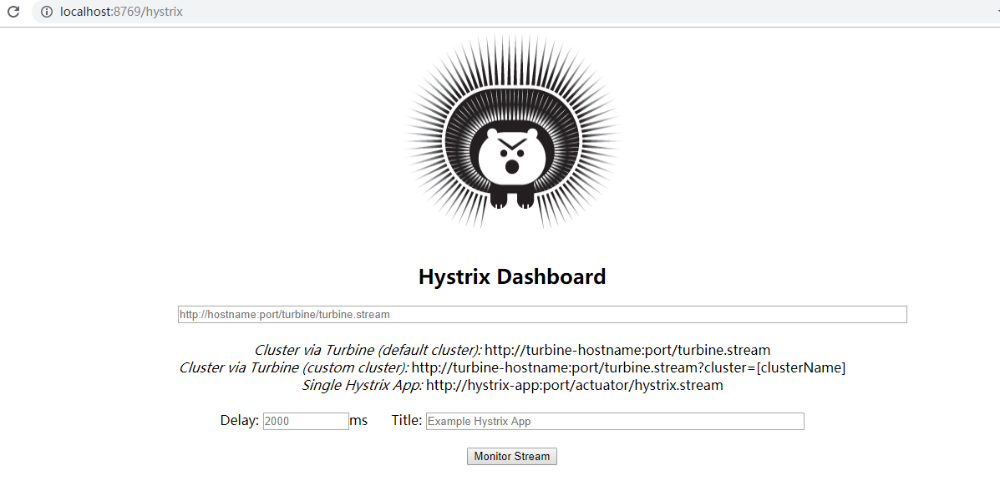
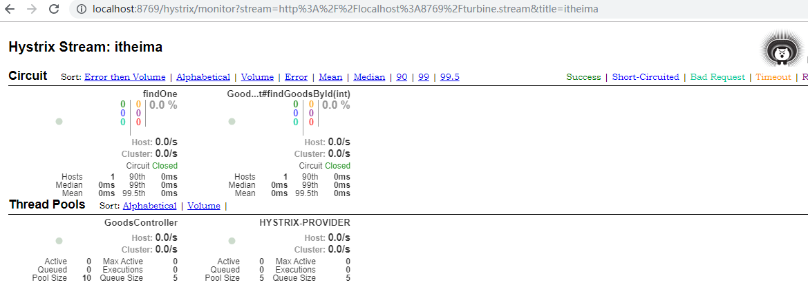

## Turbine聚合监控 

### 一、搭建监控模块

**1. 创建监控模块**

创建hystrix-monitor模块，使用Turbine聚合监控多个Hystrix dashboard功能,

**2. 引入Turbine聚合监控起步依赖**

```xml
<?xml version="1.0" encoding="UTF-8"?>
<project xmlns="http://maven.apache.org/POM/4.0.0"
         xmlns:xsi="http://www.w3.org/2001/XMLSchema-instance"
         xsi:schemaLocation="http://maven.apache.org/POM/4.0.0 http://maven.apache.org/xsd/maven-4.0.0.xsd">
    <parent>
        <artifactId>hystrix-parent</artifactId>
        <groupId>com.itheima</groupId>
        <version>1.0-SNAPSHOT</version>
    </parent>
    <modelVersion>4.0.0</modelVersion>

    <artifactId>hystrix-monitor</artifactId>
    <properties>
        <project.build.sourceEncoding>UTF-8</project.build.sourceEncoding>
        <project.reporting.outputEncoding>UTF-8</project.reporting.outputEncoding>
        <java.version>1.8</java.version>
    </properties>

    <dependencies>
        <dependency>
            <groupId>org.springframework.cloud</groupId>
            <artifactId>spring-cloud-starter-netflix-hystrix-dashboard</artifactId>
        </dependency>

        <dependency>
            <groupId>org.springframework.cloud</groupId>
            <artifactId>spring-cloud-starter-netflix-turbine</artifactId>
        </dependency>

        <dependency>
            <groupId>org.springframework.boot</groupId>
            <artifactId>spring-boot-starter-actuator</artifactId>
        </dependency>

        <dependency>
            <groupId>org.springframework.cloud</groupId>
            <artifactId>spring-cloud-starter-netflix-eureka-client</artifactId>
        </dependency>


        <dependency>
            <groupId>org.springframework.boot</groupId>
            <artifactId>spring-boot-starter-test</artifactId>
            <scope>test</scope>
        </dependency>
    </dependencies>

    <build>
        <plugins>
            <plugin>
                <groupId>org.springframework.boot</groupId>
                <artifactId>spring-boot-maven-plugin</artifactId>
            </plugin>
        </plugins>
    </build>

</project>
```

**3. 修改application.yml**

```yml
spring:
  application.name: hystrix-monitor
server:
  port: 8769
turbine:
  combine-host-port: true
  # 配置需要监控的服务名称列表
  app-config: hystrix-provider,hystrix-consumer
  cluster-name-expression: "'default'"
  aggregator:
    cluster-config: default
  #instanceUrlSuffix: /actuator/hystrix.stream
eureka:
  client:
    serviceUrl:
      defaultZone: http://localhost:8761/eureka/

```

**4. 创建启动类**

```java
@SpringBootApplication
@EnableEurekaClient

@EnableTurbine //开启Turbine 很聚合监控功能
@EnableHystrixDashboard //开启Hystrix仪表盘监控功能
public class HystrixMonitorApp {

    public static void main(String[] args) {
        SpringApplication.run(HystrixMonitorApp.class, args);
    }

}

```

### 二、修改被监控模块

需要分别修改 hystrix-provider 和 hystrix-consumer 模块：

**1、导入依赖：**

```xml
		<dependency>
            <groupId>org.springframework.boot</groupId>
            <artifactId>spring-boot-starter-actuator</artifactId>
        </dependency>

        <dependency>
            <groupId>org.springframework.cloud</groupId>
            <artifactId>spring-cloud-starter-netflix-hystrix</artifactId>
        </dependency>

        <dependency>
            <groupId>org.springframework.cloud</groupId>
            <artifactId>spring-cloud-starter-netflix-hystrix-dashboard</artifactId>
        </dependency>
```

**2、配置Bean**

此处为了方便，将其配置在启动类中。

```java
@Bean
    public ServletRegistrationBean getServlet() {
        HystrixMetricsStreamServlet streamServlet = new HystrixMetricsStreamServlet();
        ServletRegistrationBean registrationBean = new ServletRegistrationBean(streamServlet);
        registrationBean.setLoadOnStartup(1);
        registrationBean.addUrlMappings("/actuator/hystrix.stream");
        registrationBean.setName("HystrixMetricsStreamServlet");
        return registrationBean;
    }
```

**3、启动类上添加注解@EnableHystrixDashboard**

```java
@EnableDiscoveryClient
@EnableEurekaClient
@SpringBootApplication
@EnableFeignClients 
@EnableHystrixDashboard // 开启Hystrix仪表盘监控功能
public class ConsumerApp {


    public static void main(String[] args) {
        SpringApplication.run(ConsumerApp.class,args);
    }
    @Bean
    public ServletRegistrationBean getServlet() {
        HystrixMetricsStreamServlet streamServlet = new HystrixMetricsStreamServlet();
        ServletRegistrationBean registrationBean = new ServletRegistrationBean(streamServlet);
        registrationBean.setLoadOnStartup(1);
        registrationBean.addUrlMappings("/actuator/hystrix.stream");
        registrationBean.setName("HystrixMetricsStreamServlet");
        return registrationBean;
    }
}

```

### 三、启动测试

**1、启动服务：**

- eureka-server

- hystrix-provider

- hystrix-consumer

- hystrix-monitor

**2、访问：**

在浏览器访问http://localhost:8769/hystrix/ 进入Hystrix Dashboard界面



界面中输入监控的Url地址 http://localhost:8769/turbine.stream，监控时间间隔2000毫秒和title，如下图




- 实心圆：它有颜色和大小之分，分别代表实例的监控程度和流量大小。如上图所示，它的健康度从绿色、黄色、橙色、红色递减。通过该实心圆的展示，我们就可以在大量的实例中快速的发现故障实例和高压力实例。
- 曲线：用来记录 2 分钟内流量的相对变化，我们可以通过它来观察到流量的上升和下降趋势。

