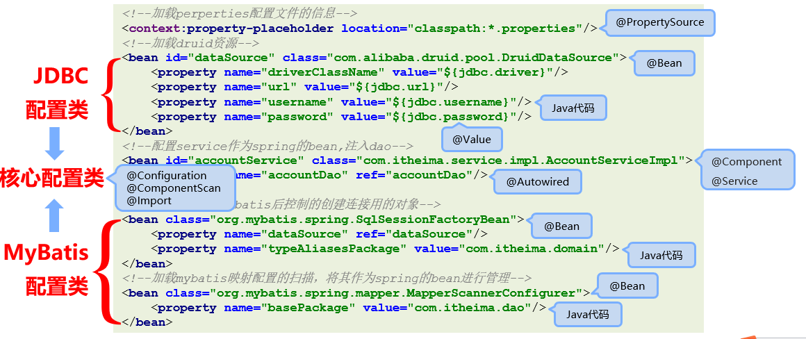

# 注解开发

## 1)注解驱动的意义

### 1.1)什么是注解驱动

注解启动时使用注解的形式替代xml配置，将繁杂的spring配置文件从工程中彻底消除掉，简化书写


### 1.2)注解驱动的弊端

- 为了达成注解驱动的目的，可能会将原先很简单的书写，变的更加复杂

- XML中配置第三方开发的资源是很方便的，但使用注解驱动无法在第三方开发的资源中进行编辑，因此会增大开发工作量


## 2)常用注解

### 2.1)启动注解功能

- 启动注解扫描，加载类中配置的注解项

  ```xml
  <context:component-scan base-package="packageName"/>
  ```

- 说明：

  - 在进行包所扫描时，会对配置的包及其子包中所有文件进行扫描

  - 扫描过程是以文件夹递归迭代的形式进行的

  - 扫描过程仅读取合法的java文件

  - 扫描时仅读取spring可识别的注解

  - 扫描结束后会将可识别的有效注解转化为spring对应的资源加入IoC容器

- 注意：

  - 无论是注解格式还是XML配置格式，最终都是将资源加载到IoC容器中，差别仅仅是数据读取方式不同

  - 从加载效率上来说注解优于XML配置文件

### 2.2)bean的定义

- 名称：@Component    @Controller    @Service    @Repository

- 类型：**类注解**

- 位置：类定义上方

- 作用：设置该类为spring管理的bean

- 范例：

  ```java
  @Component
  public class ClassName{}
  ```

- 说明：

  - @Controller、@Service 、@Repository是@Component的衍生注解，功能同@Component

- 相关属性

  - value（默认）：定义bean的访问id

### 2.3)bean的作用域

- 名称：@Scope

- 类型：**类注解**

- 位置：类定义上方

- 作用：设置该类作为bean对应的scope属性

- 范例：

  ```java
  @Scope
  public class ClassName{}
  ```

- 相关属性

  - value（默认）：定义bean的作用域，默认为singleton

### 2.4)bean的生命周期

- 名称：@PostConstruct、@PreDestroy

- 类型：**方法注解**

- 位置：方法定义上方

- 作用：设置该类作为bean对应的生命周期方法

- 范例：

  ```java
  @PostConstruct
  public void init() { System.out.println("init..."); }
  ```

### 2.5)加载第三方资源

- 名称：@Bean

- 类型：**方法注解**

- 位置：方法定义上方

- 作用：设置该方法的返回值作为spring管理的bean

- 范例：

  ```java
  @Bean("dataSource")
  public DruidDataSource createDataSource() {    return ……;    }
  ```

- 说明：

  - 因为第三方bean无法在其源码上进行修改，使用@Bean解决第三方bean的引入问题

  - 该注解用于替代XML配置中的静态工厂与实例工厂创建bean，不区分方法是否为静态或非静态

  - @Bean所在的类必须被spring扫描加载，否则该注解无法生效

- 相关属性

  - value（默认）：定义bean的访问id

### 2.6)bean的非引用类型属性注入

- 名称：@Value

- 类型：**属性注解、方法注解**

- 位置：属性定义上方，方法定义上方

- 作用：设置对应属性的值或对方法进行传参

- 范例：

  ```java
  @Value("${jdbc.username}")
  private String username;
  ```

- 说明：

  - value值仅支持非引用类型数据，赋值时对方法的所有参数全部赋值

  - value值支持读取properties文件中的属性值，通过类属性将properties中数据传入类中

  - value值支持SpEL

  - @value注解如果添加在属性上方，可以省略set方法（set方法的目的是为属性赋值）

- 相关属性

  - value（默认）：定义对应的属性值或参数值

### 2.7)bean的引用类型属性注入

- 名称：@Autowired、@Qualifier

- 类型：**属性注解、方法注解**

- 位置：属性定义上方，方法定义上方

- 作用：设置对应属性的对象或对方法进行引用类型传参

- 范例：

  ```java
  @Autowired(required = false)
  @Qualifier("userDao")
  private UserDao userDao;
  ```

- 说明：

  - @Autowired默认按类型装配，指定@Qualifier后可以指定自动装配的bean的id

- 相关属性

  - required：定义该属性是否允许为null

### 2.8)bean的引用类型属性注入

- 名称：@Primary

- 类型：**类注解**

- 位置：类定义上方

- 作用：设置类对应的bean按类型装配时优先装配

- 范例：

  ```java
  @Primary
  public class ClassName{}
  ```

- 说明：

  - @Autowired默认按类型装配，当出现相同类型的bean，使用@Primary提高按类型自动装配的优先级，多个@Primary会导致优先级设置无效

### 2.9)bean的引用类型属性注入

- 名称：@Inject、@Named、@Resource

- 说明：
  - @Inject与@Named是JSR330规范中的注解，功能与@Autowired和@Qualifier完全相同，适用于不同架构场景
  - @Resource是JSR250规范中的注解，可以简化书写格式

- @Resource相关属性

  - name：设置注入的bean的id

  - type：设置注入的bean的类型，接收的参数为Class类型

### 2.10)加载properties文件

- 名称：@PropertySource

- 类型：**类注解**

- 位置：类定义上方

- 作用：加载properties文件中的属性值

- 范例：

  ```java
  @PropertySource(value = "classpath:filename.properties")public class ClassName {    @Value("${propertiesAttributeName}")    private String attributeName;}
  ```

- 说明：

  - 不支持*通配格式，一旦加载，所有spring控制的bean中均可使用对应属性值

- 相关属性

  - value（默认）：设置加载的properties文件名

  - ignoreResourceNotFound：如果资源未找到，是否忽略，默认为false

### 2.11)纯注解格式

- 名称：@Configuration、@ComponentScan

- 类型：**类注解**

- 位置：类定义上方

- 作用：设置当前类为spring核心配置加载类

- 范例：

  ```java
  @Configuration@ComponentScan("scanPackageName")public class SpringConfigClassName{}
  ```

- 说明：

  - 核心配合类用于替换spring核心配置文件，此类可以设置空的，不设置变量与属性

  - bean扫描工作使用注解@ComponentScan替代

**AnnotationConfigApplicationContext**

- 加载纯注解格式上下文对象，需要使用AnnotationConfigApplicationContext

  ```java
  AnnotationConfigApplicationContext ctx = new AnnotationConfigApplicationContext(SpringConfig.class);
  ```

### 2.12)第三方bean配置与管理

- 名称：@Import

- 类型：**类注解**

- 位置：类定义上方

- 作用：导入第三方bean作为spring控制的资源

- 范例：

  ```java
  @Configuration@Import(OtherClassName.class)public class ClassName {}
  ```

- 说明：

  - @Import注解在同一个类上，仅允许添加一次，如果需要导入多个，使用数组的形式进行设定

  - 在被导入的类中可以继续使用@Import导入其他资源（了解）

  - @Bean所在的类可以使用导入的形式进入spring容器，无需声明为bean

## 3)bean加载控制

### 3.1)依赖加载

(1)@DependsOn

- 名称：@DependsOn

- 类型：类注解、方法注解

- 位置：bean定义的位置（类上或方法上）

- 作用：控制bean的加载顺序，使其在指定bean加载完毕后再加载

- 范例：

  ```java
  @DependsOn("beanId")public class ClassName {}
  ```

- 说明：

  - 配置在方法上，使@DependsOn指定的bean优先于@Bean配置的bean进行加载

  - 配置在类上，使@DependsOn指定的bean优先于当前类中所有@Bean配置的bean进行加载

  - 配置在类上，使@DependsOn指定的bean优先于@Component等配置的bean进行加载

- 相关属性

  - value（默认）：设置当前bean所依赖的bean的id

(2)@Order

- 名称：@Order

- 类型：**配置类注解**

- 位置：配置类定义的位置（类上）

- 作用：控制配置类的加载顺序

- 范例：

  ```java
  @Order(1)public class SpringConfigClassName {}
  ```

(3)@Lazy

- 名称：@Lazy

- 类型：**类注解、方法注解**

- 位置：bean定义的位置（类上或方法上）

- 作用：控制bean的加载时机，使其延迟加载

- 范例：

  ```java
  @Lazypublic class ClassName {}
  ```

### **3.2)依赖加载应用场景**

@DependsOn

- 微信订阅号，发布消息和订阅消息的bean的加载顺序控制

- 双11活动期间，零点前是结算策略A，零点后是结算策略B，策略B操作的数据为促销数据。策略B加载顺序与促销数据的加载顺序

@Lazy

- 程序灾难出现后对应的应急预案处理是启动容器时加载时机

@Order

- 多个种类的配置出现后，优先加载系统级的，然后加载业务级的，避免细粒度的加载控制


## 4)整合第三方技术

### 4.1)综合案例改版（注解整合MyBatis）



### 4.2)注解整合MyBatis分析

- 业务类使用注解形式声明bean，属性采用注解注入

- 建立独立的配置管理类，分类管理外部资源，根据功能进行分类，并提供对应的方法获取bean

- 使用注解形式启动bean扫描，加载所有注解配置的资源（bean）

- 使用AnnotationConfigApplicationContext对象加载所有的启动配置类，内部使用导入方式进行关联

### 4.3)注解整合MyBatis步骤

1.修改mybatis外部配置文件格式为注解格式

2.业务类使用@Component声明bean，使用@Autowired注入对象

3.建立配置文件JDBCConfig与MyBatisConfig类，并将其导入到核心配置类SpringConfig

4.开启注解扫描

5.使用AnnotationConfigApplicationContext对象加载配置项

### 4.4)综合案例改版（注解整合Junit）

1.Spring接管Junit的运行权，使用Spring专用的Junit类加载器

2.为Junit测试用例设定对应的spring容器：

- 从Spring5.0以后，要求Junit的版本必须是4.12及以上

- Junit仅用于单元测试，不能将Junit的测试类配置成spring的bean，否则该配置将会被打包进入工程中 


导入Spring整合Junit坐标

```xml
<dependency>    <groupId>junit</groupId>    <artifactId>junit</artifactId>    <version>4.12</version></dependency><dependency>    <groupId>org.springframework</groupId>    <artifactId>spring-test</artifactId>    <version>5.1.9.RELEASE</version></dependency>
```

Spring整合Junit测试用例注解格式

```java
@RunWith(SpringJUnit4ClassRunner.class)@ContextConfiguration(classes = SpringConfig.class)public class UserServiceTest {}
```

## 5)IoC底层核心原理

### 5.1)IoC核心接口


### **5.2)组件扫描器**

- 开发过程中，需要根据需求加载必要的bean，排除指定bean


### **5.3)设定组件扫描加载过滤器**

- 名称：@ComponentScan

- 类型：**类注解**

- 位置：类定义上方

- 作用：设置spring配置加载类扫描规则

- 范例：

  ```java
  @ComponentScan(    value="com.itheima",	           //设置基础扫描路径    excludeFilters =                          //设置过滤规则，当前为排除过滤	@ComponentScan.Filter(            //设置过滤器	    type= FilterType.ANNOTATION,  //设置过滤方式为按照注解进行过滤	    classes=Repository.class)     //设置具体的过滤项，过滤所有@Repository修饰的bean    )
  ```

​	includeFilters：设置包含性过滤器

​	excludeFilters：设置排除性过滤器

​	type：设置过滤器类型

### **5.4)自定义组件过滤器**

- 名称：TypeFilter

- 类型：**接口**

- 作用：自定义类型过滤器

- 范例：

  ```java
  public class MyTypeFilter implements TypeFilter {    public boolean match(MetadataReader mr, MetadataReaderFactory mrf) throws IOException {        ClassMetadata cm = metadataReader.getClassMetadata();        tring className = cm.getClassName();        if(className.equals("com.itheima.dao.impl.BookDaoImpl")){            return false;        }        return false;    }}
  ```

### **5.5)自定义导入器**

- bean只有通过配置才可以进入spring容器，被spring加载并控制

- 配置bean的方式如下：

  - XML文件中使用<bean/>标签配置

  - 使用@Component及衍生注解配置

- 企业开发过程中，通常需要配置大量的bean，需要一种快速高效配置大量bean的方式

**ImportSelector**

- 名称： ImportSelector

- 类型：**接口**

- 作用：自定义bean导入器

- 范例：

  ```java
  public class MyImportSelector implements ImportSelector {    public String[] selectImports(AnnotationMetadata icm) {        return new String[]{"com.itheima.dao.impl.AccountDaoImpl"};    }}
  ```

  ```java
  @Configuration@ComponentScan("com.itheima")@Import(MyImportSelector.class)public class SpringConfig {}
  ```

### **5.6)自定义注册器**

- 名称：ImportBeanDefinitionRegistrar

- 类型：**接口**

- 作用：自定义bean定义注册器

- 范例：

  ```java
  public class MyImportBeanDefinitionRegistrar implements ImportBeanDefinitionRegistrar {    public void registerBeanDefinitions(AnnotationMetadata icm, BeanDefinitionRegistry r) {        ClassPathBeanDefinitionScanner scanner = new ClassPathBeanDefinitionScanner(r, false);        TypeFilter tf = new TypeFilter() {            public boolean match(MetadataReader mr, MetadataReaderFactory mrf) throws IOException {                return true;            }        };        scanner.addIncludeFilter(tf);        //scanner.addExcludeFilter(tf);        scanner.scan("com.itheima");    }}
  ```

### 5.7)bean初始化过程解析


### 5.8)bean初始化过程解析

- BeanFactoryPostProcessor

  - 作用：定义了在bean工厂对象创建后，bean对象创建前执行的动作，用于对工厂进行创建后业务处理

  - 运行时机：当前操作用于对工厂进行处理，仅运行一次

- BeanPostProcessor

  - 作用：定义了所有bean初始化前后进行的统一动作，用于对bean进行创建前业务处理与创建后业务处理

  - 运行时机：当前操作伴随着每个bean的创建过程，每次创建bean均运行该操作

- InitializingBean

  - 作用：定义了每个bean的初始化前进行的动作，属于非统一性动作，用于对bean进行创建前业务处理

  - 运行时机：当前操作伴随着任意一个bean的创建过程，保障其个性化业务处理

- 注意：上述操作均需要被spring容器加载放可运行

### 5.9)bean初始化过程解析


### 5.10)繁琐的bean初始化过程处理

- FactoryBean
  - 对单一的bean的初始化过程进行封装，达到简化配置的目的

**FactoryBean与BeanFactory区别**

- FactoryBean：封装单个bean的创建过程

- BeanFactory：Spring容器顶层接口，定义了bean相关的获取操作

