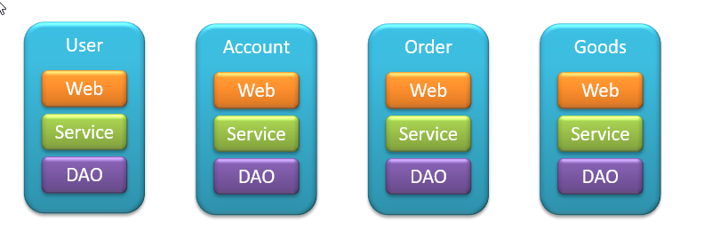
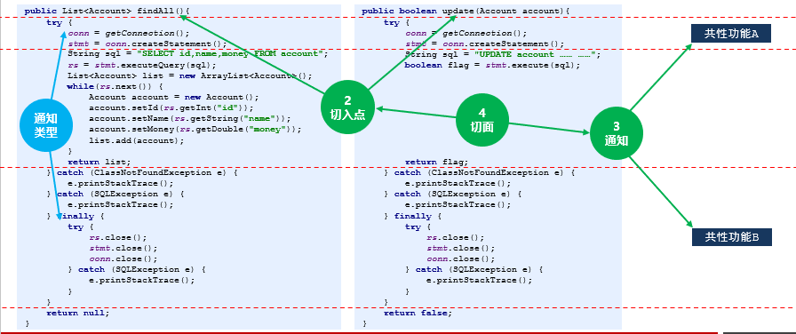
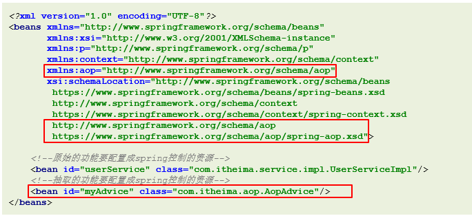

# AOP

## 1)AOP简介

### 1.1)OOP开发思路



### 1.2)AOP开发思想


### 1.3)AOP概念

- AOP(Aspect Oriented Programing)面向切面编程，一种编程**范式**，隶属于软工范畴，指导开发者如何组织程序结构

- AOP弥补了OOP的不足，基于OOP基础之上进行横向开发

  - uOOP规定程序开发以类为主体模型，一切围绕对象进行，完成某个任务先构建模型

  - uAOP程序开发主要关注基于OOP开发中的共性功能，一切围绕共性功能进行，完成某个任务先构建可能遇到的所有共性功能（当所有功能都开发出来也就没有共性与非共性之分）

- “AOP联盟”

### 1.4)AOP作用

- 伴随着AOP时代的降临，可以从各个行业的标准化、规范化开始入手，一步一步将所有共性功能逐一开发完毕，最终以功能组合来完成个别业务模块乃至整体业务系统的开发

- 目标：将软件开发由手工制作走向半自动化/全自动化阶段，实现“插拔式组件体系结构”搭建

### 1.5)AOP优势

- 提高代码的可重用性

- 业务代码编码更简洁

- 业务代码维护更高效

- 业务功能扩展更便捷


## 2)AOP入门案例

### 2.1)AOP相关概念





- Joinpoint(连接点)：就是方法

- Pointcut(切入点)：就是挖掉共性功能的方法

- Advice(通知)：就是共性功能，最终以一个方法的形式呈现

- Aspect(切面)：就是共性功能与挖的位置的对应关系

- Target(目标对象)：就是挖掉功能的方法对应的类产生的对象，这种对象是无法直接完成最终工作的

- Weaving(织入)：就是将挖掉的功能回填的动态过程

- Proxy(代理)：目标对象无法直接完成工作，需要对其进行功能回填，通过创建原始对象的代理对象实现

- Introduction(引入/引介) ：就是对原始对象无中生有的添加成员变量或成员方法

### 2.2)AOP开发过程

- 开发阶段(开发者完成)

  - 正常的制作程序

  - 将非共性功能开发到对应的目标对象类中，并制作成切入点方法

  - 将共性功能独立开发出来，制作成**通知**

  - 在配置文件中，声明**切入点**

  - 在配置文件中，声明**切入点**与**通知**间的关系（含**通知类型**），即**切面**

- 运行阶段(AOP完成)

  - Spring容器加载配置文件，监控所有配置的**切入点**方法的执行

  - 当监控到**切入点**方法被运行，使用**代理**机制，动态创建**目标对象**的**代理对象**，根据**通知类别**，在**代理对象**的对应位置将**通知**对应的功能**织入**，完成完整的代码逻辑并运行

### 2.2)AOP开发方式

- XML方式

- XML+注解方式

- 注解方式

### 2.3)入门案例制作分析

1.导入相关坐标

2.确认要抽取的功能，并将其制作成方法保存到专用的类中，删除原始业务中对应的功能

3.将所有进行AOP操作的资源加载到IoC容器中

4.使用配置的方式描述被抽取功能的位置，并描述被抽取功能与对应位置的关系

5.运行程序


步骤一 导入坐标

```xml
<dependency>
    <groupId>org.aspectj</groupId>
    <artifactId>aspectjweaver</artifactId>
    <version>1.9.4</version>
</dependency>
```

步骤二 在业务层抽取通用代码


步骤三 把通知加入spring容器管理




步骤四 在配置文件中配置aop的配置 

```xml
<!--aop配置-->
<aop:config>
    <!--配置切入点-->
    <aop:pointcut id="pt" expression="execution(* *..*())"/>
    <!--配置切面-->
    <aop:aspect ref="myAdvice">
        <!—通知与切入点之间的关系-->
        <aop:before method="logAdvice" pointcut-ref="pt"/>
    </aop:aspect>
</aop:config>
```

## 3)AOP配置（XML）

### 3.1)**AspectJ**

- Aspect（切面）用于描述切入点与通知间的关系，是AOP编程中的一个概念

- AspectJ是基于java语言对Aspect的实现

### 3.2)AOP配置

#### 3.2.1)aop:config

- 名称：aop:config

- 类型：**标签**

- 归属：beans标签

- 作用：设置AOP

- 格式：

  ```xml
  <beans>
      <aop:config>……</aop:config>
      <aop:config>……</aop:config>
  </beans>
  ```

- 说明：一个beans标签中可以配置多个aop:config标签

#### 3.2.2)aop:aspect

- 名称：aop:aspect

- 类型：**标签**

- 归属：aop:config标签

- 作用：设置具体的AOP通知对应的切入点

- 格式：

  ```xml
  <aop:config>
      <aop:aspect ref="beanId">……</aop:aspect>
      <aop:aspect ref="beanId">……</aop:aspect>
  </aop:config>
  ```

- 说明：

  一个aop:config标签中可以配置多个aop:aspect标签

- 基本属性：

  - ref ：通知所在的bean的id

#### 3.2.3)aop:pointcut

- 名称：aop:pointcut

- 类型：**标签**

- 归属：aop:config标签、aop:aspect标签

- 作用：设置切入点

- 格式：

  ```xml
  <aop:config>
      <aop:pointcut id="pointcutId" expression="……"/>
      <aop:aspect>
          <aop:pointcut id="pointcutId" expression="……"/>
      </aop:aspect>
  </aop:config>
  ```

- 说明：

  一个aop:config标签中可以配置多个aop:pointcut标签，且该标签可以配置在aop:aspect标签内

- 基本属性：

  - id ：识别切入点的名称

  - expression ：切入点表达式

### **3.3)切入点**

- 切入点描述的是某个方法

- 切入点表达式是一个快速匹配方法描述的通配格式，类似于正则表达式

### **3.4)切入点表达式的组成**

- 切入点描述的是某个方法

- 切入点表达式是一个快速匹配方法描述的通配格式，类似于正则表达式

  ```xml
  关键字（访问修饰符  返回值  包名.类名.方法名（参数）异常名）
  ```

​	关键字：描述表达式的匹配模式（参看关键字列表）

​	访问修饰符：方法的访问控制权限修饰符

​	类名：方法所在的类（此处可以配置接口名称）

​	异常：方法定义中指定抛出的异常

- 范例：

  ```xml
  execution（public User com.itheima.service.UserService.findById（int））
  ```

#### 3.4.1)切入点表达式——关键字

- execution ：匹配执行指定方法

- args ：匹配带有指定参数类型的方法

- within ：…… 

- this ：…… 

- target ：…… 

- @within ：…… 

- @target ：…… 

- @args ：…… 

- @annotation ：…… 

- bean ：……

- reference pointcut ：……

#### 3.4.2)切入点表达式——**通配符**

- *：单个独立的任意符号，可以独立出现，也可以作为前缀或者后缀的匹配符出现

  ```xml
  execution（public * com.itheima.*.UserService.find*（*））
  ```

​	匹配com.itheima包下的任意包中的UserService类或接口中所有find开头的带有一个参数的方法

- .. ：多个连续的任意符号，可以独立出现，常用于简化包名与参数的书写

  ```xml
  execution（public User com..UserService.findById（..））
  ```

​	匹配com包下的任意包中的UserService类或接口中所有名称为findById的方法

- +：专用于匹配子类类型

  ```xml
  execution(* *..*Service+.*(..))
  ```

#### 3.4.3)切入点表达式——逻辑运算符

- && ：连接两个切入点表达式，表示两个切入点表达式同时成立的匹配

- || ：连接两个切入点表达式，表示两个切入点表达式成立任意一个的匹配

- ! ：连接单个切入点表达式，表示该切入点表达式不成立的匹配

#### 3.4.4)切入点表达式——范例

```java
    execution(* *(..))
    execution(* *..*(..))
    execution(* *..*.*(..))
    execution(public * *..*.*(..))
    execution(public int *..*.*(..))
    execution(public void *..*.*(..))
    execution(public void com..*.*(..)) 
    execution(public void com..service.*.*(..))
    execution(public void com.itheima.service.*.*(..))
    execution(public void com.itheima.service.User*.*(..))
    execution(public void com.itheima.service.*Service.*(..))
    execution(public void com.itheima.service.UserService.*(..))
    execution(public User com.itheima.service.UserService.find*(..))
    execution(public User com.itheima.service.UserService.*Id(..))
    execution(public User com.itheima.service.UserService.findById(..))
    execution(public User com.itheima.service.UserService.findById(int))
    execution(public User com.itheima.service.UserService.findById(int,int))
    execution(public User com.itheima.service.UserService.findById(int,*))
    execution(public User com.itheima.service.UserService.findById(*,int))
    execution(public User com.itheima.service.UserService.findById())
    execution(List com.itheima.service.*Service+.findAll(..))
```

### **3.5)切入点的三种配置方式**

```xml
<aop:config>
  <!--配置公共切入点-->
  <aop:pointcut id="pt1" expression="execution(* *(..))" />
  <aop:aspect ref="myAdvice">
    <!--配置局部切入点-->
    <aop:pointcut id="pt2" expression="execution(* *(..))" />
    <!--引用公共切入点-->
    <aop:before method="logAdvice" pointcut-ref="pt1" />
    <!--引用局部切入点-->
    <aop:before method="logAdvice" pointcut-ref="pt2" />
    <!--直接配置切入点-->
    <aop:before method="logAdvice" pointcut="execution(* *(..))" />
  </aop:aspect>
</aop:config>

```

### **3.6)切入点配置经验**

- 企业开发命名规范严格遵循规范文档进行

- 先为方法配置局部切入点

- 再抽取类中公共切入点

- 最后抽取全局切入点

- 代码走查过程中检测切入点是否存在越界性包含

- 代码走查过程中检测切入点是否存在非包含性进驻

- 设定AOP执行检测程序，在单元测试中监控通知被执行次数与预计次数是否匹配

- 设定完毕的切入点如果发生调整务必进行回归测试

（以上规则适用于XML配置格式）

### **3.7)通知类型**

AOP的通知类型共5种

- 前置通知：原始方法执行前执行，如果通知中抛出异常，阻止原始方法运行

  应用：数据校验

- 后置通知：原始方法执行后执行，无论原始方法中是否出现异常，都将执行通知

  应用：现场清理

- 返回后通知：原始方法正常执行完毕并返回结果后执行，如果原始方法中抛出异常，无法执行

  应用：返回值相关数据处理

- 抛出异常后通知：原始方法抛出异常后执行，如果原始方法没有抛出异常，无法执行

  应用：对原始方法中出现的异常信息进行处理

- 环绕通知：在原始方法执行前后均有对应执行执行，还可以阻止原始方法的执行

  应用：十分强大，可以做任何事情

#### 3.7.1)aop:before

- 名称：aop:before

- 类型：**标签**

- 归属：aop:aspect标签

- 作用：设置前置通知

- 格式：

  ```xml
  <aop:aspect ref="adviceId">    <aop:before method="methodName" pointcut="……"/></aop:aspect>
  ```

- 说明：一个aop:aspect标签中可以配置多个aop:before标签

- 基本属性：

  - method ：在通知类中设置当前通知类别对应的方法

  - pointcut ：设置当前通知对应的切入点表达式，与pointcut-ref属性冲突

  - pointcut-ref ：设置当前通知对应的切入点id，与pointcut属性冲突

#### 3.7.2)aop:after

- 名称：aop:after

- 类型：**标签**

- 归属：aop:aspect标签

- 作用：设置后置通知

- 格式：

  ```xml
  <aop:aspect ref="adviceId">    <aop:after method="methodName" pointcut="……"/></aop:aspect>
  ```

- 说明：一个aop:aspect标签中可以配置多个aop:after标签

- 基本属性：

  - method ：在通知类中设置当前通知类别对应的方法

  - pointcut ：设置当前通知对应的切入点表达式，与pointcut-ref属性冲突

  - pointcut-ref ：设置当前通知对应的切入点id，与pointcut属性冲突

#### 3.7.3)aop:after-returning

- 名称：aop:after-returning

- 类型：**标签**

- 归属：aop:aspect标签

- 作用：设置返回后通知

- 格式：

  ```xml
  <aop:aspect ref="adviceId">    <aop:after-returning method="methodName" pointcut="……"/></aop:aspect>
  ```

- 说明：一个aop:aspect标签中可以配置多个aop:after-returning标签

- 基本属性：

  - method ：在通知类中设置当前通知类别对应的方法

  - pointcut ：设置当前通知对应的切入点表达式，与pointcut-ref属性冲突

  - pointcut-ref ：设置当前通知对应的切入点id，与pointcut属性冲突

#### 3.7.4)aop:after-throwing

- 名称：aop:after-throwing

- 类型：**标签**

- 归属：aop:aspect标签

- 作用：设置抛出异常后通知

- 格式：

  ```xml
  <aop:aspect ref="adviceId">    <aop:after-throwing method="methodName" pointcut="……"/></aop:aspect>
  ```

- 说明：一个aop:aspect标签中可以配置多个aop:after-throwing标签

- 基本属性：

  - method ：在通知类中设置当前通知类别对应的方法

  - pointcut ：设置当前通知对应的切入点表达式，与pointcut-ref属性冲突

  - pointcut-ref ：设置当前通知对应的切入点id，与pointcut属性冲突

#### 3.7.5)aop:around

- 名称：aop:around

- 类型：**标签**

- 归属：aop:aspect标签

- 作用：设置环绕通知

- 格式：

  ```xml
  <aop:aspect ref="adviceId">    <aop:around method="methodName" pointcut="……"/></aop:aspect>
  ```

- 说明：一个aop:aspect标签中可以配置多个aop:around标签

- 基本属性：

  - method ：在通知类中设置当前通知类别对应的方法

  - pointcut ：设置当前通知对应的切入点表达式，与pointcut-ref属性冲突

  - pointcut-ref ：设置当前通知对应的切入点id，与pointcut属性冲突

环绕通知的开发方式

- 环绕通知是在原始方法的前后添加功能，在环绕通知中，存在对原始方法的显式调用

  ```java
  public Object around(ProceedingJoinPoint pjp) throws Throwable {    Object ret = pjp.proceed();    return ret;}
  ```

- 环绕通知方法相关说明：

  - 方法须设定Object类型的返回值，否则会拦截原始方法的返回。如果原始方法返回值类型为void，通知方	也可以设定返回值类型为void，最终返回null

  - 方法需在第一个参数位置设定ProceedingJoinPoint对象，通过该对象调用proceed()方法，实现对原始方法的调用。如省略该参数，原始方法将无法执行

  - 使用proceed()方法调用原始方法时，因无法预知原始方法运行过程中是否会出现异常，强制抛出Throwable对象，封装原始方法中可能出现的异常信息

### **3.8)通知顺序（了解）**

当同一个切入点配置了多个通知时，通知会存在运行的先后顺序，该顺序以通知配置的顺序为准

### **3.9)通知获取数据**

- 参数

- 返回值

- 异常

#### **3.9.1)通知获取参数数据**

第一种情况：

- 设定通知方法第一个参数为JoinPoint，通过该对象调用getArgs()方法，获取原始方法运行的参数数组

  ```java
  public void before(JoinPoint jp) throws Throwable {    Object[] args = jp.getArgs();}
  ```

- 所有的通知均可以获取参数

第二种情况：

- 设定切入点表达式为通知方法传递参数（锁定通知变量名）

- 原始方法


第三种情况

- 设定切入点表达式为通知方法传递参数（改变通知变量名的定义顺序）

- 原始方法


#### **3.9.2)通知获取返回值数据**

第一种：返回值变量名

- 设定返回值变量名

- 原始方法

  ```java
  public int save() {	System.out.println("user service running...");    return 100;}
  ```

- AOP配置

  ```xml
  <aop:aspect ref="myAdvice">    <aop:pointcut id="pt3" expression="execution(* *(..))  "/>    <aop:after-returning method="afterReturning" pointcut-ref="pt3" returning="ret"/></aop:aspect>
  ```

- 通知类

  ```java
  public void afterReturning(Object ret) {    System.out.println(ret);}
  ```

- 适用于返回后通知（after-returning）

第二种：

- 在通知类的方法中调用原始方法获取返回值

- 原始方法

  ```java
  public int save() {    System.out.println("user service running...");    return 100;}
  ```

- AOP配置l

  ```xml
  <aop:aspect ref="myAdvice">    <aop:pointcut id="pt2" expression="execution(* *(..))  "/>    <aop:around method="around" pointcut-ref="pt2" /></aop:aspect>
  ```

- 通知类

  ```java
  public Object around(ProceedingJoinPoint pjp) throws Throwable {    Object ret = pjp.proceed();    return ret;}
  ```

- 适用于环绕通知（around）

#### **3.9.3)通知获取异常数据**

第一种：通知类的方法中调用原始方法捕获异常

- 在通知类的方法中调用原始方法捕获异常

- 原始方法

  ```java
  public void save() {    System.out.println("user service running...");    int i = 1/0;}
  ```

- AOP配置

  ```xml
  <aop:aspect ref="myAdvice">    <aop:pointcut id="pt4" expression="execution(* *(..))  "/>    <aop:around method="around" pointcut-ref="pt4" /></aop:aspect>
  ```

- 通知类

  ```java
  public Object around(ProceedingJoinPoint pjp) throws Throwable {    Object ret = pjp.proceed();	//对此处调用进行try……catch……捕获异常，或抛出异常    return ret;}
  ```

- 适用于环绕通知（around）

第二种：

- 设定异常对象变量名

- 原始方法

  ```java
  public void save() {    System.out.println("user service running...");    int i = 1/0;}
  ```

- AOP配置

  ```xml
  <aop:aspect ref="myAdvice">	<aop:pointcut id="pt4" expression="execution(* *(..))  "/>    <aop:after-throwing method="afterThrowing" pointcut-ref="pt4" throwing="t"/></aop:aspect>
  ```

- 通知类

  ```java
  public void afterThrowing(Throwable t){    System.out.println(t.getMessage());}
  ```

- 适用于返回后通知（after-throwing）

## 4)AOP配置（注解）

### 4.1)AOP配置


### 4.2)注解开发AOP制作步骤

在XML格式基础上

- 导入坐标（伴随spring-context坐标导入已经依赖导入完成）

- 开启AOP注解支持

- 配置切面@Aspect

- 定义专用的切入点方法，并配置切入点@Pointcut

- 为通知方法配置通知类型及对应切入点@Before

### 4.3)注解开发AOP注意事项

1.切入点最终体现为一个方法，无参无返回值，无实际方法体内容，但不能是抽象方法

2.引用切入点时必须使用方法调用名称，方法后面的（）不能省略

3.切面类中定义的切入点只能在当前类中使用，如果想引用其他类中定义的切入点使用“类名.方法名()”引用

4.可以在通知类型注解后添加参数，实现XML配置中的属性，例如after-returning后的returning属性


### 4.4)AOP注解详解

#### 4.4.1)@Aspect

- 名称：@Aspect

- 类型：**注解**

- 位置：类定义上方

- 作用：设置当前类为切面类

- 格式：

  ```java
  @Aspectpublic class AopAdvice {}
  ```

- 说明：一个beans标签中可以配置多个aop:config标签

#### 4.4.2)@Pointcut

- 名称：@Pointcut

- 类型：**注解**

- 位置：方法定义上方

- 作用：使用当前方法名作为切入点引用名称

- 格式：

  ```java
  @Pointcut("execution(* *(..))")public void pt() {}
  ```

- 说明：被修饰的方法忽略其业务功能，格式设定为无参无返回值的方法，方法体内空实现（非抽象）

#### 4.4.3)@Before

- 名称：@Before

- 类型：**注解**

- 位置：方法定义上方

- 作用：标注当前方法作为前置通知

- 格式：

  ```java
  @Before("pt()")public void before(){}
  ```

- 特殊参数：

  - 无

#### 4.4.4)@After

- 名称：@After

- 类型：**注解**

- 位置：方法定义上方

- 作用：标注当前方法作为后置通知

- 格式：

  ```java
  @After("pt()")public void after(){}
  ```

- 特殊参数：

  - 无

#### 4.4.5)@AfterReturning

- 名称：@AfterReturning

- 类型：**注解**

- 位置：方法定义上方

- 作用：标注当前方法作为返回后通知

- 格式：

  ```java
  @AfterReturning(value="pt()",returning = "ret")public void afterReturning(Object ret) {}
  ```

- 特殊参数：

  - returning ：设定使用通知方法参数接收返回值的变量名

#### 4.4.6)@AfterThrowing

- 名称：@AfterThrowing

- 类型：**注解**

- 位置：方法定义上方

- 作用：标注当前方法作为异常后通知

- 格式：

  ```java
  @AfterThrowing(value="pt()",throwing = "t")public void afterThrowing(Throwable t){}
  ```

- 特殊参数：

  - throwing ：设定使用通知方法参数接收原始方法中抛出的异常对象名

#### 4.4.7)@Around

- 名称：@Around

- 类型：**注解**

- 位置：方法定义上方

- 作用：标注当前方法作为环绕通知

- 格式：

  ```java
  @Around("pt()")
  public Object around(ProceedingJoinPoint pjp) throws Throwable { 
      Object ret = pjp.proceed(); 
      return ret;
  }
  ```

- 特殊参数：

  - 无

### 4.5)AOP注解开发通知执行顺序控制（了解）

1.AOP使用XML配置情况下，通知的执行顺序由配置顺序决定，在注解情况下由于不存在配置顺序的概念的概念，参照通知所配置的方法名字符串对应的编码值顺序，可以简单理解为字母排序

- 同一个通知类中，相同通知类型以方法名排序为准

- 不同通知类中，以类名排序为准

- 使用@Order注解通过变更bean的加载顺序改变通知的加载顺序

2.企业开发经验

- 通知方法名由3部分组成，分别是前缀、顺序编码、功能描述

- 前缀为固定字符串，例如baidu、itheima等，无实际意义

- 顺序编码为6位以内的整数，通常3位即可，不足位补0

- 功能描述为该方法对应的实际通知功能，例如exception、strLenCheck

  - 制通知执行顺序使用顺序编码控制，使用时做一定空间预留

  - 003使用，006使用，预留001、002、004、005、007、008

  - 使用时从中段开始使用，方便后期做前置追加或后置追加

  - 最终顺序以运行顺序为准，以测试结果为准，不以设定规则为准

### 4.6)AOP注解驱动

- 名称：@EnableAspectJAutoProxy

- 类型：**注解**

- 位置：Spring注解配置类定义上方

- 作用：设置当前类开启AOP注解驱动的支持，加载AOP注解

- 格式：

  ```java
  @Configuration@ComponentScan("com.itheima")
  @EnableAspectJAutoProxy
  public class SpringConfig {
      
  }
  ```

## 5)综合案例

### **5.1)案例介绍**

对项目进行业务层接口执行监控，测量业务层接口的执行效率

```java
public interface AccountService {   
    void save(Account account);   
    void delete(Integer id);  
    void update(Account account); 
    List<Account> findAll();  
    Account findById(Integer id);
}
```

### **5.2)案例分析**

- 测量接口执行效率：接口方法执行前后获取执行时间，求出执行时长
  - System.currentTimeMillis( )

- 对项目进行监控：项目中所有接口方法，AOP思想，执行期动态织入代码

  - 环绕通知

  - proceed()方法执行前后获取系统时间

### **5.3)案例制作步骤**

- 定义切入点（务必要绑定到接口上，而不是接口实现类上）

- 制作AOP环绕通知，完成测量功能

- 注解配置AOP

- 开启注解驱动支持

### **5.4)案例制作核心代码**

```java
@Component
@Aspect
public class RunTimeMonitorAdvice {   
    //拦截所有的业务层接口中查询操作的执行   
    @Pointcut("execution(* com.itheima.service.*Service.find*(..))")  
    public void pt(){}  
    
    @Around("pt()")  
    public Object runtimeMonitor(ProceedingJoinPoint pjp) throws Throwable {   
        //获取执行签名信息       
        Signature signature = pjp.getSignature();       
        //通过签名获取执行类型（接口名）        
        String targetClass = signature.getDeclaringTypeName();        
        //通过签名获取执行操作名称（方法名）      
        String targetMethod = signature.getName();        
        //获取操作前系统时间beginTime       
        long beginTime = System.currentTimeMillis();     
        Object ret = pjp.proceed(pjp.getArgs());        
        //获取操作后系统时间endTime       
        long endTime = System.currentTimeMillis();       
        System.out.println(targetClass+" 中 "+targetMethod+" 运行时长 "+(endTime-beginTime)+"ms");      
        return ret;    
    }
}
```

### **5.5)案例后续思考与设计**

- 测量真实性

  - 开发测量是隔离性反复执行某个操作，是理想情况，上线测量差异过大

  - 上线测量服务器性能略低于单机开发测量

  - 上线测量基于缓存的性能查询要优于数据库查询测量

  - 上线测量接口的性能与最终对外提供的服务性能差异过大

  - 当外部条件发生变化（硬件），需要进行回归测试，例如数据库迁移

- 测量结果展示

  - 测量结果无需每一个都展示，需要设定检测阈值

  - 阈值设定要根据业务进行区分，一个复杂的查询与简单的查询差异化很大

  - 阈值设定需要做独立的配置文件或通过图形工具配置（工具级别的开发）

  - 配合图形界面展示测量结果


## 6)AOP底层原理

- 静态代理

- 动态代理——Proxy

- 动态代理——CGLIB

- 织入形式

### **6.1)静态代理**

装饰者模式（Decorator Pattern）：在不惊动原始设计的基础上，为其添加功能


```java
public class UserServiceDecorator implements UserService{  
    private UserService userService;  
    public UserServiceDecorator(UserService userService) {    
        this.userService = userService; 
    }   
    public void save() {    
        //原始调用      
        userService.save();    
        //增强功能（后置）    
        System.out.println("刮大白"); 
    }
}
```

### 6.2)动态代理——JDK Proxy

JDKProxy动态代理是针对对象做代理，要求原始对象具有接口实现，并对接口方法进行增强

```java
public class UserServiceJDKProxy {  
    public UserService createUserServiceJDKProxy(final UserService userService){  
        //获取被代理对象的类加载器       
        ClassLoader classLoader = userService.getClass().getClassLoader();        
        //获取被代理对象实现的接口       
        Class[] classes = userService.getClass().getInterfaces();       
        //对原始方法执行进行拦截并增强       
        InvocationHandler ih = new InvocationHandler() {        
            public Object invoke(Object proxy, Method method, Object[] args) throws Throwable {      
                //前置增强内容              
                Object ret = method.invoke(userService, args);  
                //后置增强内容            
                System.out.println("刮大白2");      
                return ret;       
            }     
        };       
        //使用原始被代理对象创建新的代理对象    
        UserService proxy = (UserService) Proxy.newProxyInstance(classLoader,classes,ih);    
        return proxy;  
    }
}
```

### 6.3)动态代理——CGLIB

- CGLIB(Code Generation Library)，Code生成类库

- CGLIB动态代理不限定是否具有接口，可以对任意操作进行增强

- CGLIB动态代理无需要原始被代理对象，动态创建出新的代理对象

```java
package base.cglib;

import com.itheima.service.UserService;
import org.springframework.cglib.proxy.Enhancer;
import org.springframework.cglib.proxy.MethodInterceptor;
import org.springframework.cglib.proxy.MethodProxy;

import java.lang.reflect.Method;

public class UserServiceCglibProxy {

    public static UserService createUserServiceCglibProxy(Class clazz){
        //创建Enhancer对象（可以理解为内存中动态创建了一个类的字节码）
        Enhancer enhancer = new Enhancer();
        //设置Enhancer对象的父类是指定类型UserServerImpl
        enhancer.setSuperclass(clazz);
        //设置回调方法
        enhancer.setCallback(new MethodInterceptor() {
            public Object intercept(Object o, Method method, Object[] args, MethodProxy methodProxy) throws Throwable {
                //通过调用父类的方法实现对原始方法的调用
                Object ret = methodProxy.invokeSuper(o, args);
                //后置增强内容，与JDKProxy区别：JDKProxy仅对接口方法做增强，cglib对所有方法做增强，包括Object类中的方法
                if(method.getName().equals("save")) {
                    System.out.println("刮大白3");
                    System.out.println("贴墙纸3");
                }
                return ret;
            }
        });
        //使用Enhancer对象创建对应的对象
        return (UserService) enhancer.create();
    }
}
```


```java

```

### **6.4)代理模式的选择**

Spirng可以通过配置的形式控制使用的代理形式，默认使用jdkproxy，通过配置可以修改为使用cglib

- XML配置

  ```xml
  <!--XMP配置AOP--><aop:config proxy-target-class="false"></aop:config>
  ```

- XML注解支持

  ```xml
  <!--注解配置AOP--><aop:aspectj-autoproxy proxy-target-class="false"/>
  ```

- 注解驱动

  ```java
  //注解驱动@EnableAspectJAutoProxy(proxyTargetClass = true)
  ```

### **6.5)织入时机**


