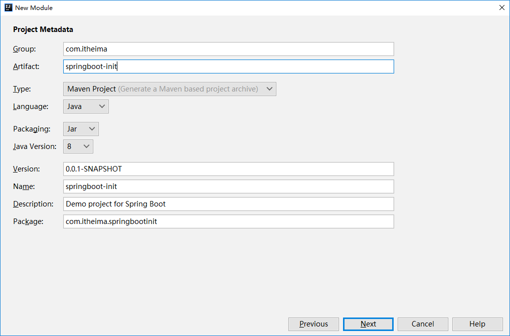
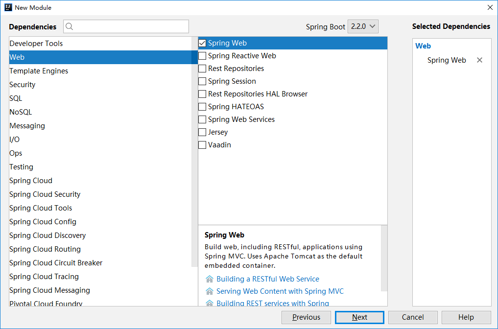
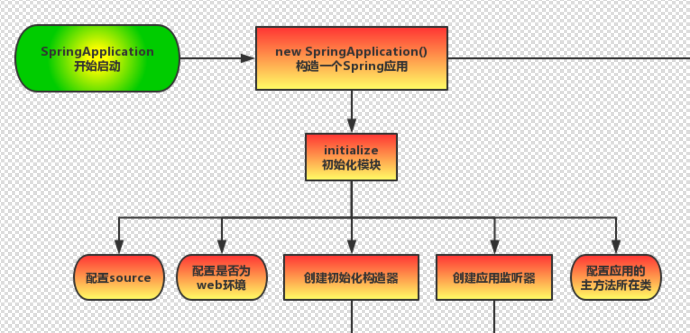
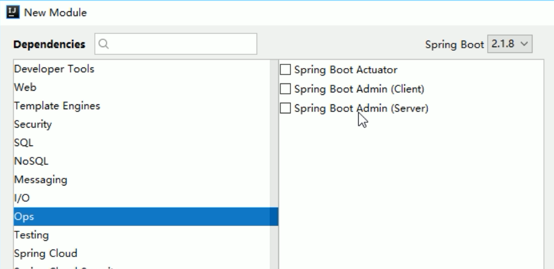

## **01-今日内容**

- Spring概述、快速入门
- SpringBoot配置
- SpringBoot整合

## **02-SpringBoot概述**

 SpringBoot提供了一种快速使用Spring的方式，基于约定优于配置的思想，可以让开发人员不必在配置与逻辑业务之间进行思维的切换，全身心的投入到逻辑业务的代码编写中，从而大大提高了开发的效率

**SpringBoot功能**

 **1**） **自动配置**

Spring Boot的自动配置是一个运行时（更准确地说，是应用程序启动时）的过程，考虑了众多因素，才决定Spring配置应该用哪个，不该用哪个。该过程是SpringBoot自动完成的。

**2**） **起步依赖**

起步依赖本质上是一个Maven项目对象模型（Project Object Model，POM），定义了对其他库的传递依赖，这些东西加在一起即支持某项功能。

简单的说，起步依赖就是将具备某种功能的坐标打包到一起，并提供一些默认的功能。

**3**） **辅助功能**

提供了一些大型项目中常见的非功能性特性，如嵌入式服务器、安全、指标，健康检测、外部配置等。


**注意：Spring Boot 并不是对 Spring 功能上的增强，而是提供了一种快速使用 Spring 的方式。**

## **03-SpringBoot快速入门**

 **需求**：搭建SpringBoot工程，定义HelloController.hello()方法，返回”Hello SpringBoot!”。

**实现步骤**：

①创建Maven项目

②导入SpringBoot起步依赖

```xml
<!--springboot工程需要继承的父工程-->
    <parent>
        <groupId>org.springframework.boot</groupId>
        <artifactId>spring-boot-starter-parent</artifactId>
        <version>2.1.8.RELEASE</version>
    </parent>

    <dependencies>
        <!--web开发的起步依赖-->
        <dependency>
            <groupId>org.springframework.boot</groupId>
            <artifactId>spring-boot-starter-web</artifactId>
        </dependency>
    </dependencies>
```

③定义Controller

```java
@RestController
public class HelloController {

    @RequestMapping("/hello")
    public String hello(){
        return " hello Spring Boot !";
    }
}

```

④编写引导类

```java
/**
 * 引导类。 SpringBoot项目的入口
 */
@SpringBootApplication
public class HelloApplication {

    public static void main(String[] args) {
        SpringApplication.run(HelloApplication.class,args);
    }
}

```

⑤启动测试

## **04-快速构建SpringBoot工程**


 







## 05-SpringBoot起步依赖原理分析

- 在spring-boot-starter-parent中定义了各种技术的版本信息，组合了一套最优搭配的技术版本。

- 在各种starter中，定义了完成该功能需要的坐标合集，其中大部分版本信息来自于父工程。

- 我们的工程继承parent，引入starter后，通过依赖传递，就可以简单方便获得需要的jar包，并且不会存在版本冲突等问题。

## **06-SpringBoot配置-配置文件分类**

SpringBoot是基于约定的，所以很多配置都有默认值，但如果想使用自己的配置替换默认配置的话，就可以使用application.properties或者application.yml（application.yaml）进行配置。

1. 默认配置文件名称：application

2. 在同一级目录下优先级为：properties>yml > yaml

例如：配置内置Tomcat的端口

properties：

```properties
server.port=8080
```

yml:

```yaml
server: port: 8080

```

## **07-SpringBoot配置-yaml基本语法**

- 大小写敏感
- 数据值前边必须有空格，作为分隔符
- 使用缩进表示层级关系
- 缩进时不允许使用Tab键，只允许使用空格（各个系统 Tab对应的 空格数目可能不同，导致层次混乱）。
- 缩进的空格数目不重要，只要相同层级的元素左侧对齐即可
- ''#" 表示注释，从这个字符一直到行尾，都会被解析器忽略。

```yaml
server: 
	port: 8080  
    address: 127.0.0.1
name: abc

```

## **08-SpringBoot配置-yaml数据格式**

**对象(map)**：键值对的集合。

```yaml
person:  
   name: zhangsan
# 行内写法
person: {name: zhangsan}

```

**数组**：一组按次序排列的值

```
address:
  - beijing
  - shanghai
# 行内写法
address: [beijing,shanghai]

```

**纯量**：单个的、不可再分的值

```yaml
msg1: 'hello \n world'  # 单引忽略转义字符msg2: "hello \n world"  # 双引识别转义字符
```

**参数引用**

```yaml
name: lisi person:  name: ${name} # 引用上边定义的name值
```

## 09-SpringBoot配置-获取数据_1

@**Value**

```java
   #获取普通配置   @Value("${name}")    private String name;    #获取对象属性    @Value("${person.name}")    private String name2;   	#获取数组    @Value("${address[0]}")    private String address1;  	#获取纯量    @Value("${msg1}")    private String msg1;
```

**Evironment**

```java
@Autowired private Environment env;System.out.println(env.getProperty("person.name")); System.out.println(env.getProperty("address[0]"));
```

## **10-SpringBoot配置-获取数据_2**

 @ConfigurationProperties 

**注意**：prefix一定要写

```java
@Component@ConfigurationProperties(prefix = "person")public class Person {    private String name;    private int age;    private String[] address;    public String getName() {        return name;    }    public void setName(String name) {        this.name = name;    }    public int getAge() {        return age;    }    public void setAge(int age) {        this.age = age;    }    public String[] getAddress() {        return address;    }    public void setAddress(String[] address) {        this.address = address;    }    @Override    public String toString() {        return "Person{" +                "name='" + name + '\'' +                ", age=" + age +                '}';    }}
```

## **11-SpringBoot配置-profile**

1. **profile是用来完成不同环境下，配置动态切换功能的**。

2. **profile配置方式**

   ​	多profile文件方式：提供多个配置文件，每个代表一种环境。

   ​		application-dev.properties/yml 开发环境

   ​		application-test.properties/yml 测试环境

   ​		application-pro.properties/yml 生产环境

   ​    yml多文档方式：

​				在yml中使用  --- 分隔不同配置

3.  **profile激活方式**

- 配置文件： 再配置文件中配置：spring.profiles.active=dev
- 虚拟机参数：在VM options 指定：-Dspring.profiles.active=dev
- 命令行参数：java –jar xxx.jar  --spring.profiles.active=dev

## **12-SpringBoot配置-项目内部配置文件加载顺序**

 加载顺序为上文的排列顺序，高优先级配置的属性会生效

- file:./config/：当前项目下的/config目录下
- file:./           ：当前项目的根目录
- classpath:/config/：classpath的/config目录
- classpath:/  ：classpath的根目录

## **13-SpringBoot配置-项目外部配置加载顺序**

 外部配置文件的使用是为了对能不文件的配合

1.命令行

```cmd
java -jar app.jar --name="Spring“ --server.port=9000
```

2.指定配置文件位置

```cmd
 java -jar myproject.jar --spring.config.location=e://application.properties
```

3.外部不带profile的properties文件

```java
    classpath:/config/application.properties    classpath:/application.properties
```


 https://docs.spring.io/spring-boot/docs/current/reference/html/spring-boot-features.html#boot-features-external-config


## **14-SpringBoot整合Junit**

1. 搭建SpringBoot工程

2. 引入starter-test起步依赖


```xml
 <dependencies>        <dependency>            <groupId>org.springframework.boot</groupId>            <artifactId>spring-boot-starter</artifactId>        </dependency>        <dependency>            <groupId>org.springframework.boot</groupId>            <artifactId>spring-boot-starter-test</artifactId>            <scope>test</scope>        </dependency>    </dependencies>
```

3. 编写测试类

```
/** * 测试类 */@RunWith(SpringRunner.class)@SpringBootTest(classes = SpringbootJunitApplication.class )public class UserServiceTest {    @Test    public void test(){        System.out.println(111);    }}
```

4.测试

## **15-SpringBoot整合mybatis**

①搭建SpringBoot工程

②引入mybatis起步依赖，添加mysql驱动

```xml
<dependencies>        <dependency>            <groupId>org.mybatis.spring.boot</groupId>            <artifactId>mybatis-spring-boot-starter</artifactId>            <version>2.1.0</version>        </dependency>        <dependency>            <groupId>mysql</groupId>            <artifactId>mysql-connector-java</artifactId>            <!--<scope>runtime</scope>-->        </dependency>        <dependency>            <groupId>org.springframework.boot</groupId>            <artifactId>spring-boot-starter-test</artifactId>            <scope>test</scope>        </dependency>    </dependencies>
```

③编写DataSource和MyBatis相关配置

application.yml

```yaml
# datasourcespring:  datasource:    url: jdbc:mysql:///springboot?serverTimezone=UTC    username: root    password: root    driver-class-name: com.mysql.cj.jdbc.Driver# mybatismybatis:  mapper-locations: classpath:mapper/*Mapper.xml # mapper映射文件路径  type-aliases-package: com.itheima.springbootmybatis.domain  # config-location:  # 指定mybatis的核心配置文件
```

④定义表和实体类

```
public class User {    private int id;    private String username;    private String password;    public int getId() {        return id;    }    public void setId(int id) {        this.id = id;    }    public String getUsername() {        return username;    }    public void setUsername(String username) {        this.username = username;    }    public String getPassword() {        return password;    }    public void setPassword(String password) {        this.password = password;    }    @Override    public String toString() {        return "User{" +                "id=" + id +                ", username='" + username + '\'' +                ", password='" + password + '\'' +                '}';    }}
```

⑤编写dao和mapper文件/纯注解开发

编写dao

```java
@Mapper@Repositorypublic interface UserXmlMapper {    public List<User> findAll();}
```

mapper.xml

```xml
<?xml version="1.0" encoding="UTF-8" ?><!DOCTYPE mapper PUBLIC "-//mybatis.org//DTD Mapper 3.0//EN" "http://mybatis.org/dtd/mybatis-3-mapper.dtd"><mapper namespace="com.itheima.springbootmybatis.mapper.UserXmlMapper">    <select id="findAll" resultType="user">        select * from t_user    </select></mapper>
```

纯注解开发

```java
@Mapper@Repositorypublic interface UserMapper {    @Select("select * from t_user")    public List<User> findAll();}
```

⑥测试

## **16-SpringBoot整合redis**

①搭建SpringBoot工程

②引入redis起步依赖

```xml
  <dependencies>
        <dependency>
            <groupId>org.springframework.boot</groupId>
            <artifactId>spring-boot-starter-data-redis</artifactId>
        </dependency>

        <dependency>
            <groupId>org.springframework.boot</groupId>
            <artifactId>spring-boot-starter-test</artifactId>
            <scope>test</scope>
        </dependency>
    </dependencies>
```

③配置redis相关属性

```yaml
spring:
  redis:
    host: 127.0.0.1 # redis的主机ip
    port: 6379

```

④注入RedisTemplate模板

⑤编写测试方法，测试

```java
@RunWith(SpringRunner.class)
@SpringBootTest
public class SpringbootRedisApplicationTests {

    @Autowired
    private RedisTemplate redisTemplate;

    @Test
    public void testSet() {
        //存入数据
        redisTemplate.boundValueOps("name").set("zhangsan");
    }

    @Test
    public void testGet() {
        //获取数据
        Object name = redisTemplate.boundValueOps("name").get();
        System.out.println(name);
    }

}

```


## **01-SpringBoot高级-今日内容**

 -  SpringBoot自定配置
-  SpringBoot事件监听
-  SpringBoot流程分析
-  SpringBoot监控
-  SpringBoot部署

## **02-SpringBoot自动配置-Condition-1**

 Condition是Spring4.0后引入的条件化配置接口，通过实现Condition接口可以完成有条件的加载相应的Bean

@Conditional要配和Condition的实现类（ClassCondition）进行使用

- ClassCondition

```java
public class ClassCondition implements Condition {
    /**
     *
     * @param context 上下文对象。用于获取环境，IOC容器，ClassLoader对象
     * @param metadata 注解元对象。 可以用于获取注解定义的属性值
     * @return
     */
    @Override
    public boolean matches(ConditionContext context, AnnotatedTypeMetadata metadata) {
      
        //1.需求： 导入Jedis坐标后创建Bean
        //思路：判断redis.clients.jedis.Jedis.class文件是否存在
        boolean flag = true;
        try {
            Class<?> cls = Class.forName("redis.clients.jedis.Jedis");
        } catch (ClassNotFoundException e) {
            flag = false;
        }
        return flag;
      
    }
}
```

- UserConfig

```java
@Configuration
public class UserConfig {

    @Bean
    @Conditional(ClassCondition.class)
    public User user(){
        return new User();
    }

}
```

测试

```java
@SpringBootApplication
public class SpringbootConditionApplication {

    public static void main(String[] args) {
        //启动SpringBoot的应用，返回Spring的IOC容器
        ConfigurableApplicationContext context = SpringApplication.run(SpringbootConditionApplication.class, args);

        Object user = context.getBean("user");
        System.out.println(user);

    }

}
```

## **03-SpringBoot自动配置-Condition-2**

 需求：将类的判断定义为动态的。判断哪个字节码文件存在可以动态指定。

自定义条件注解类

```java
import org.springframework.context.annotation.Conditional;

import java.lang.annotation.*;


@Target({ElementType.TYPE, ElementType.METHOD})
@Retention(RetentionPolicy.RUNTIME)
@Documented
@Conditional(ClassCondition.class)
public @interface ConditionOnClass {
    String[] value();
}
```

**注意：**此处@ConditionOnClass为自定义注解

```java
@Configuration
public class UserConfig {

    @Bean
    //@Conditional(ClassCondition.class)
    @ConditionOnClass("com.alibaba.fastjson.JSON")
    public User user(){
        return new User();
    }

    @Bean
    @ConditionalOnProperty(name = "itcast",havingValue = "itheima")
    public User user2(){
        return new User();
    }

}
```

测试User对象的创建

```java
@SpringBootApplication
public class SpringbootConditionApplication {

    public static void main(String[] args) {
        //启动SpringBoot的应用，返回Spring的IOC容器
        ConfigurableApplicationContext context = SpringApplication.run(SpringbootConditionApplication.class, args);

        Object user = context.getBean("user");
        System.out.println(user);

    }

}
```

查看条件注解源码


**SpringBoot 提供的常用条件注解：**

ConditionalOnProperty：判断配置文件中是否有对应属性和值才初始化Bean

ConditionalOnClass：判断环境中是否有对应字节码文件才初始化Bean

ConditionalOnMissingBean：判断环境中没有对应Bean才初始化Bean

## **04-SpringBoot自动配置-切换内置web服务器**

查看继承关系图


排除Tomcat


 

pom文件中的排除依赖效果

```xml
 <dependency>
            <groupId>org.springframework.boot</groupId>
            <artifactId>spring-boot-starter-web</artifactId>
            <!--排除tomcat依赖-->
            <exclusions>
                <exclusion>
                    <artifactId>spring-boot-starter-tomcat</artifactId>
                    <groupId>org.springframework.boot</groupId>
                </exclusion>
            </exclusions>
        </dependency>

        <!--引入jetty的依赖-->
        <dependency>
            <artifactId>spring-boot-starter-jetty</artifactId>
            <groupId>org.springframework.boot</groupId>
        </dependency>
```

## 05-SpringBoot自动配置-Enable注解原理

- SpringBoot不能直接获取在其他工程中定义的Bean

  演示代码：

  springboot-enable工程

  ```java
  /**
   * @ComponentScan 扫描范围：当前引导类所在包及其子包
   *
   * com.itheima.springbootenable
   * com.itheima.config
   * //1.使用@ComponentScan扫描com.itheima.config包
   * //2.可以使用@Import注解，加载类。这些类都会被Spring创建，并放入IOC容器
   * //3.可以对Import注解进行封装。
   */
  
  //@ComponentScan("com.itheima.config")
  //@Import(UserConfig.class)
  @EnableUser
  @SpringBootApplication
  public class SpringbootEnableApplication {
  
      public static void main(String[] args) {
          ConfigurableApplicationContext context = SpringApplication.run(SpringbootEnableApplication.class, args);
  
       //获取Bean
          Object user = context.getBean("user");
          System.out.println(user);
  
  	}
  
  }
  ```

  pom中引入springboot-enable-other

  ```
  
  ```

 		<dependency>          <groupId>com.itheima</groupId>        <artifactId>springboot-enable-other</artifactId>          <version>0.0.1-SNAPSHOT</version>    </dependency>

  ```
  springboot-enable-other工程    **UserConfig**    ```java  @Configuration  public class UserConfig {      @Bean    public User user() {          return new User();    }     }  
  ```

  **EnableUser注解类**

  ```java
  import org.springframework.context.annotation.Import;    import java.lang.annotation.*;    @Target(ElementType.TYPE)  @Retention(RetentionPolicy.RUNTIME)@Documented  @Import(UserConfig.class)public @interface EnableUser {  }  
  ```

  **原因**：@ComponentScan 扫描范围：当前引导类所在包及其子包

  **三种解决方案：**

  1.使用@ComponentScan扫描com.itheima.config包 

  2.可以使用@Import注解，加载类。这些类都会被Spring创建，并放入IOC容器

  3.可以对Import注解进行封装。

  **重点：Enable注解底层原理是使用@Import注解实现Bean的动态加载**

## **06-SpringBoot自动配置-@Import详解**

@Enable*底层依赖于@Import注解导入一些类，使用@Import导入的类会被Spring加载到IOC容器中。而@Import提供4中用法：

①导入Bean

②导入配置类

③导入 ImportSelector 实现类。一般用于加载配置文件中的类

④导入 ImportBeanDefinitionRegistrar 实现类。

- 导入Bean  @Import(User.class)

- 导入配置类  @Import(UserConfig.class)

- 导入 ImportSelector 实现类   @Import(MyImportSelector.class)

  MyImportSelector

  ```java
  public class MyImportSelector implements ImportSelector {    @Override    public String[] selectImports(AnnotationMetadata importingClassMetadata) {        return new String[]{"com.itheima.domain.User", "com.itheima.domain.Role"};    }}
  ```

- 导入 ImportBeanDefinitionRegistrar 实现类。@Import({MyImportBeanDefinitionRegistrar.class})

  ```java
  public class MyImportBeanDefinitionRegistrar implements ImportBeanDefinitionRegistrar {    @Override    public void registerBeanDefinitions(AnnotationMetadata importingClassMetadata, BeanDefinitionRegistry registry) {        AbstractBeanDefinition beanDefinition = BeanDefinitionBuilder.rootBeanDefinition(User.class).getBeanDefinition();        registry.registerBeanDefinition("user", beanDefinition);    }}
  ```

  SpringbootEnableApplication测试代码

  ```java
  /**
  ```

 * Import4中用法：
   *  1. 导入Bean
   *  2. 导入配置类
   *  3. 导入ImportSelector的实现类。
   *  4. 导入ImportBeanDefinitionRegistrar实现类
         */

  //@Import(User.class)
  //@Import(UserConfig.class)
  //@Import(MyImportSelector.class)
  //@Import({MyImportBeanDefinitionRegistrar.class})

  @SpringBootApplication
  public class SpringbootEnableApplication {

      public static void main(String[] args) {      ConfigurableApplicationContext context = SpringApplication.run(SpringbootEnableApplication.class, args);        /*//获取Bean      Object user = context.getBean("user");      System.out.println(user);*/        /*User user = context.getBean(User.class);      System.out.println(user);        Role role = context.getBean(Role.class);      System.out.println(role);*/      /*  Object user = context.getBean("user");      System.out.println(user);*/   Map<String, User> map = context.getBeansOfType(User.class);      System.out.println(map);    }

  }

  ```
@EnableAutoConfiguration中使用的是第三种方式：@Import(AutoConfigurationImportSelector.class)## **07-SpringBoot自动配置-@EnableAutoConfiguration详解**- @EnableAutoConfiguration 注解内部使用 @Import(AutoConfigurationImportSelector.**class**)来加载配置类。 - 配置文件位置：META-INF/spring.factories，该配置文件中定义了大量的配置类，当 SpringBoot 应用启动时，会自动加载这些配置类，初始化Bean- 并不是所有的Bean都会被初始化，在配置类中使用Condition来加载满足条件的Bean## **08-SpringBoot自动配置-自定义starter步骤分析****需求：**自定义redis-starter。要求当导入redis坐标时，SpringBoot自动创建Jedis的Bean。**步骤：**①创建 redis-spring-boot-autoconfigure 模块②创建 redis-spring-boot-starter 模块,依赖 redis-spring-boot-autoconfigure的模块③在 redis-spring-boot-autoconfigure 模块中初始化 Jedis 的 Bean。并定义META-INF/spring.factories 文件④在测试模块中引入自定义的 redis-starter 依赖，测试获取 Jedis 的Bean，操作 redis。## **09-SpringBoot自动配置-自定义starter实现-1**1. **创建redis-spring-boot-starter工程**​         pom文件中引入redis-spring-boot-autoconfigure```xml <!--引入configure-->        <dependency>            <groupId>com.itheima</groupId>            <artifactId>redis-spring-boot-autoconfigure</artifactId>            <version>0.0.1-SNAPSHOT</version>        </dependency>
  ```

2. **创建redis-spring-boot-autoconfigure配置工程**  

创建RedisProperties配置文件参数绑定类 

```java
@ConfigurationProperties(prefix = "redis")public class RedisProperties {    private String host = "localhost";    private int port = 6379;    public String getHost() {        return host;    }    public void setHost(String host) {        this.host = host;    }    public int getPort() {        return port;    }    public void setPort(int port) {        this.port = port;    }}
```

 创建RedisAutoConfiguration自动配置类

```java
@Configuration@EnableConfigurationProperties(RedisProperties.class)public class RedisAutoConfiguration {    /**     * 提供Jedis的bean     */    @Bean    public Jedis jedis(RedisProperties redisProperties) {               return new Jedis(redisProperties.getHost(), redisProperties.getPort());    }}
```


在resource目录下创建META-INF文件夹并创建spring.factories

注意：”\ “是换行使用的

```properties
org.springframework.boot.autoconfigure.EnableAutoConfiguration=\  com.itheima.redis.config.RedisAutoConfiguration
```

3. **在springboot-enable工程中引入自定义的redis的starter**

```
  <!--自定义的redis的starter-->        <dependency>            <groupId>com.itheima</groupId>            <artifactId>redis-spring-boot-starter</artifactId>            <version>0.0.1-SNAPSHOT</version>        </dependency>
```

在SpringbootEnableApplication启动类中测试

```java
 Jedis jedis = context.getBean(Jedis.class);        System.out.println(jedis);
```

## **10-SpringBoot自动配置-自定义starter实现-2**

测试springboot-enable工程中的application.properties中的配置参数

```properties
redis.port=6666
```

使用注解完成有条件加载配置类

```java
@Configuration@EnableConfigurationProperties(RedisProperties.class)@ConditionalOnClass(Jedis.class)public class RedisAutoConfiguration {    /**     * 提供Jedis的bean     */    @Bean    @ConditionalOnMissingBean(name = "jedis")    public Jedis jedis(RedisProperties redisProperties) {        System.out.println("RedisAutoConfiguration....");        return new Jedis(redisProperties.getHost(), redisProperties.getPort());    }}
```

## **11-SpringBoot事件监听**

 Java中的事件监听机制定义了以下几个角色：

①事件：Event，继承 java.util.EventObject 类的对象

②事件源：Source ，任意对象Object

③监听器：Listener，实现 java.util.EventListener 接口 的对象


SpringBoot 在项目启动时，会对几个监听器进行回调，我们可以实现这些监听器接口，在项目启动时完成一些操作。

- ApplicationContextInitializer、

- SpringApplicationRunListener、

- CommandLineRunner、

- ApplicationRunner

  

  自定义监听器的启动时机：MyApplicationRunner和MyCommandLineRunner都是当项目启动后执行，使用@Component放入容器即可使用

MyApplicationRunner

```java
/** * 当项目启动后执行run方法。 */@Componentpublic class MyApplicationRunner implements ApplicationRunner {    @Override    public void run(ApplicationArguments args) throws Exception {        System.out.println("ApplicationRunner...run");        System.out.println(Arrays.asList(args.getSourceArgs()));    }} 
```

 MyCommandLineRunner

```java
@Componentpublic class MyCommandLineRunner implements CommandLineRunner {    @Override    public void run(String... args) throws Exception {        System.out.println("CommandLineRunner...run");        System.out.println(Arrays.asList(args));    }}
```


MyApplicationContextInitializer的使用要在resource文件夹下添加META-INF/spring.factories

```properties
org.springframework.context.ApplicationContextInitializer=com.itheima.springbootlistener.listener.MyApplicationContextInitializer
```

```
@Componentpublic class MyApplicationContextInitializer implements ApplicationContextInitializer {    @Override    public void initialize(ConfigurableApplicationContext applicationContext) {        System.out.println("ApplicationContextInitializer....initialize");    }}
```

MySpringApplicationRunListener的使用要添加**构造器**

```
public class MySpringApplicationRunListener implements SpringApplicationRunListener {    public MySpringApplicationRunListener(SpringApplication application, String[] args) {    }    @Override    public void starting() {        System.out.println("starting...项目启动中");    }    @Override    public void environmentPrepared(ConfigurableEnvironment environment) {        System.out.println("environmentPrepared...环境对象开始准备");    }    @Override    public void contextPrepared(ConfigurableApplicationContext context) {        System.out.println("contextPrepared...上下文对象开始准备");    }    @Override    public void contextLoaded(ConfigurableApplicationContext context) {        System.out.println("contextLoaded...上下文对象开始加载");    }    @Override    public void started(ConfigurableApplicationContext context) {        System.out.println("started...上下文对象加载完成");    }    @Override    public void running(ConfigurableApplicationContext context) {        System.out.println("running...项目启动完成，开始运行");    }    @Override    public void failed(ConfigurableApplicationContext context, Throwable exception) {        System.out.println("failed...项目启动失败");    }}
```

## **12-SpringBoot流程分析-初始化**

1. 配置启动引导类（判断是否有启动主类）

2. 判断是否是Web环境

3. 获取初始化类、监听器类

   



## **13-SpringBoot流程分析-run**

1. 启动计时器

2. 执行监听器

3. 准备环境

4. 打印banner：可以resource下粘贴自定义的banner

5. 创建context

   ```
   refreshContext(context);
   ```

   执行refreshContext方法后才真正创建Bean

   


## **14-SpringBoot监控-actuator基本使用**

 ①导入依赖坐标

```xml
<dependency>  <groupId>org.springframework.boot</groupId>  <artifactId>spring-boot-starter-actuator</artifactId></dependency>
```

②访问http://localhost:8080/acruator


```json
{    "_links":{        "self":{            "href":"http://localhost:8080/actuator",            "templated":false        },        "health":{            "href":"http://localhost:8080/actuator/health",            "templated":false        },        "health-component-instance":{            "href":"http://localhost:8080/actuator/health/{component}/{instance}",            "templated":true        },        "health-component":{            "href":"http://localhost:8080/actuator/health/{component}",            "templated":true        },        "info":{            "href":"http://localhost:8080/actuator/info",            "templated":false        }    }}
```

http://localhost:8080/actuator/info

在application.properties中配置

```properties
info.name=lucyinfo.age=99
```

http://localhost:8080/actuator/health

开启健康检查详细信息

```properties
management.endpoint.health.show-details=always
```

```json
{    "status":"UP",    "details":{        "diskSpace":{            "status":"UP",            "details":{                "total":159579508736,                "free":13558104064,                "threshold":10485760            }        },        "redis":{            "status":"UP",            "details":{                "version":"2.4.5"            }        }    }}
```

## **15-SpringBoot监控-actuator开启所有endpoint**

 开启所有endpoint

在application.properties中配置：

```properties
management.endpoints.web.exposure.include=*
```

开启所有endpoint的返回结果：

```properties
{    "_links":{        "self":{            "href":"http://localhost:8080/actuator",            "templated":false        },        "auditevents":{            "href":"http://localhost:8080/actuator/auditevents",            "templated":false        },        "beans":{            "href":"http://localhost:8080/actuator/beans",            "templated":false        },        "caches-cache":{            "href":"http://localhost:8080/actuator/caches/{cache}",            "templated":true        },        "caches":{            "href":"http://localhost:8080/actuator/caches",            "templated":false        },        "health-component-instance":{            "href":"http://localhost:8080/actuator/health/{component}/{instance}",            "templated":true        },        "health":{            "href":"http://localhost:8080/actuator/health",            "templated":false        },        "health-component":{            "href":"http://localhost:8080/actuator/health/{component}",            "templated":true        },        "conditions":{            "href":"http://localhost:8080/actuator/conditions",            "templated":false        },        "configprops":{            "href":"http://localhost:8080/actuator/configprops",            "templated":false        },        "env":{            "href":"http://localhost:8080/actuator/env",            "templated":false        },        "env-toMatch":{            "href":"http://localhost:8080/actuator/env/{toMatch}",            "templated":true        },        "info":{            "href":"http://localhost:8080/actuator/info",            "templated":false        },        "loggers":{            "href":"http://localhost:8080/actuator/loggers",            "templated":false        },        "loggers-name":{            "href":"http://localhost:8080/actuator/loggers/{name}",            "templated":true        },        "heapdump":{            "href":"http://localhost:8080/actuator/heapdump",            "templated":false        },        "threaddump":{            "href":"http://localhost:8080/actuator/threaddump",            "templated":false        },        "metrics-requiredMetricName":{            "href":"http://localhost:8080/actuator/metrics/{requiredMetricName}",            "templated":true        },        "metrics":{            "href":"http://localhost:8080/actuator/metrics",            "templated":false        },        "scheduledtasks":{            "href":"http://localhost:8080/actuator/scheduledtasks",            "templated":false        },        "httptrace":{            "href":"http://localhost:8080/actuator/httptrace",            "templated":false        },        "mappings":{            "href":"http://localhost:8080/actuator/mappings",            "templated":false        }    }}
```

## **16-SpringBoot监控-springboot admin图形化界面使用**

SpringBoot Admin 有两个角色，客户端(Client)和服务端(Server)。

以下为创建服务端和客户端工程步骤：

admin-server：

①创建 admin-server 模块

②导入依赖坐标 admin-starter-server



```xml
      <dependency>            <groupId>de.codecentric</groupId>            <artifactId>spring-boot-admin-starter-server</artifactId>        </dependency>
```

③在引导类上启用监控功能@EnableAdminServer

```java
@EnableAdminServer@SpringBootApplicationpublic class SpringbootAdminServerApplication {    public static void main(String[] args) {        SpringApplication.run(SpringbootAdminServerApplication.class, args);    }}
```


admin-client：

①创建 admin-client 模块

②导入依赖坐标 admin-starter-client

```xml
  		<dependency>            <groupId>de.codecentric</groupId>            <artifactId>spring-boot-admin-starter-client</artifactId>        </dependency>
```

③配置相关信息：server地址等

```properties
# 执行admin.server地址spring.boot.admin.client.url=http://localhost:9000management.endpoint.health.show-details=alwaysmanagement.endpoints.web.exposure.include=*
```

④启动server和client服务，访问server

## **17-SpringBoot部署**

 

 SpringBoot 项目开发完毕后，支持两种方式部署到服务器：

①jar包(官方推荐)

②war包

**更改pom文件中的打包方式为war**

修改启动类

```java
import org.springframework.boot.SpringApplication;import org.springframework.boot.autoconfigure.SpringBootApplication;import org.springframework.boot.builder.SpringApplicationBuilder;import org.springframework.boot.web.servlet.support.SpringBootServletInitializer;@SpringBootApplicationpublic class SpringbootDeployApplication extends SpringBootServletInitializer {    public static void main(String[] args) {        SpringApplication.run(SpringbootDeployApplication.class, args);    }    @Override    protected SpringApplicationBuilder configure(SpringApplicationBuilder builder) {        return builder.sources(SpringbootDeployApplication.class);    }}
```


指定打包的名称

```xml
 <build>        <finalName>springboot</finalName>        <plugins>            <plugin>                <groupId>org.springframework.boot</groupId>                <artifactId>spring-boot-maven-plugin</artifactId>            </plugin>        </plugins>    </build>
```

