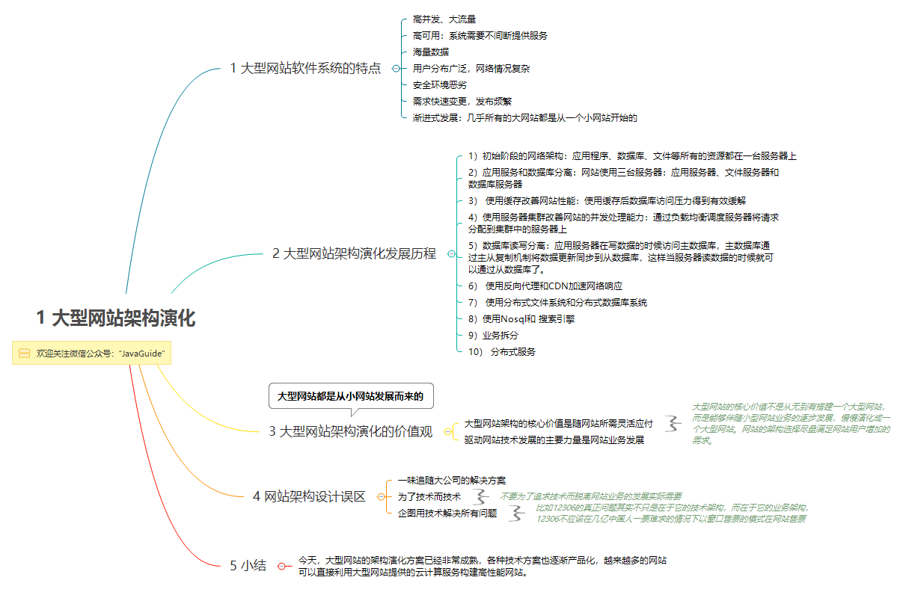
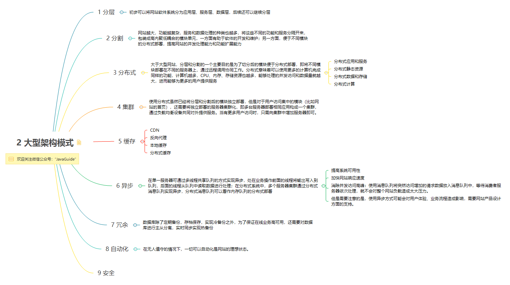
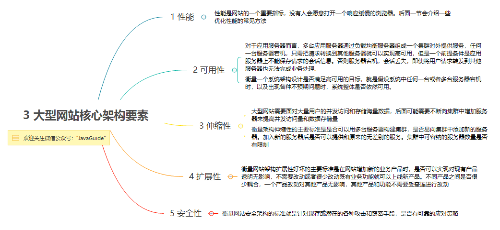
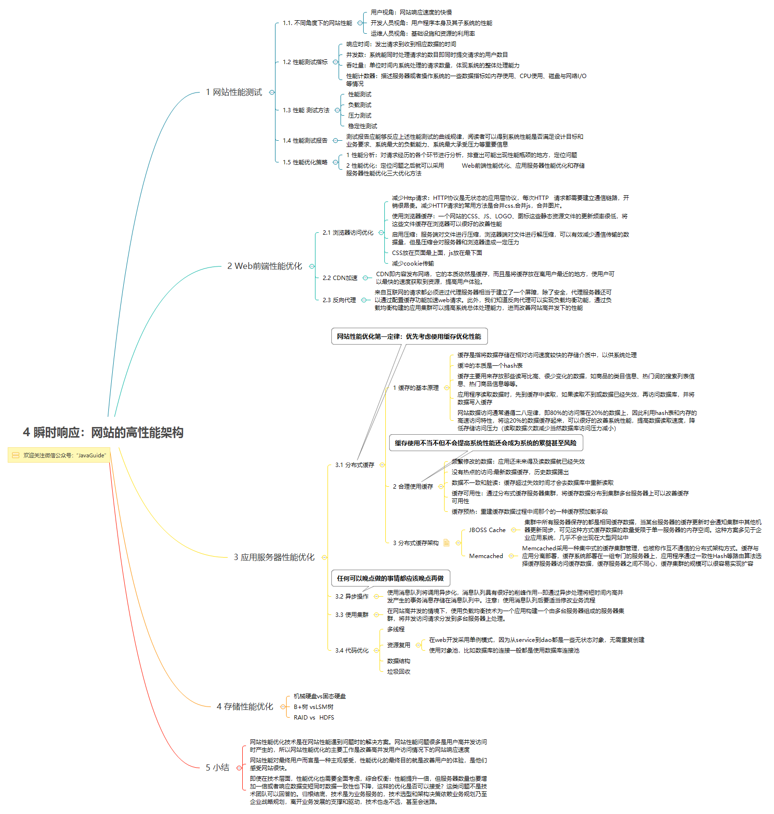
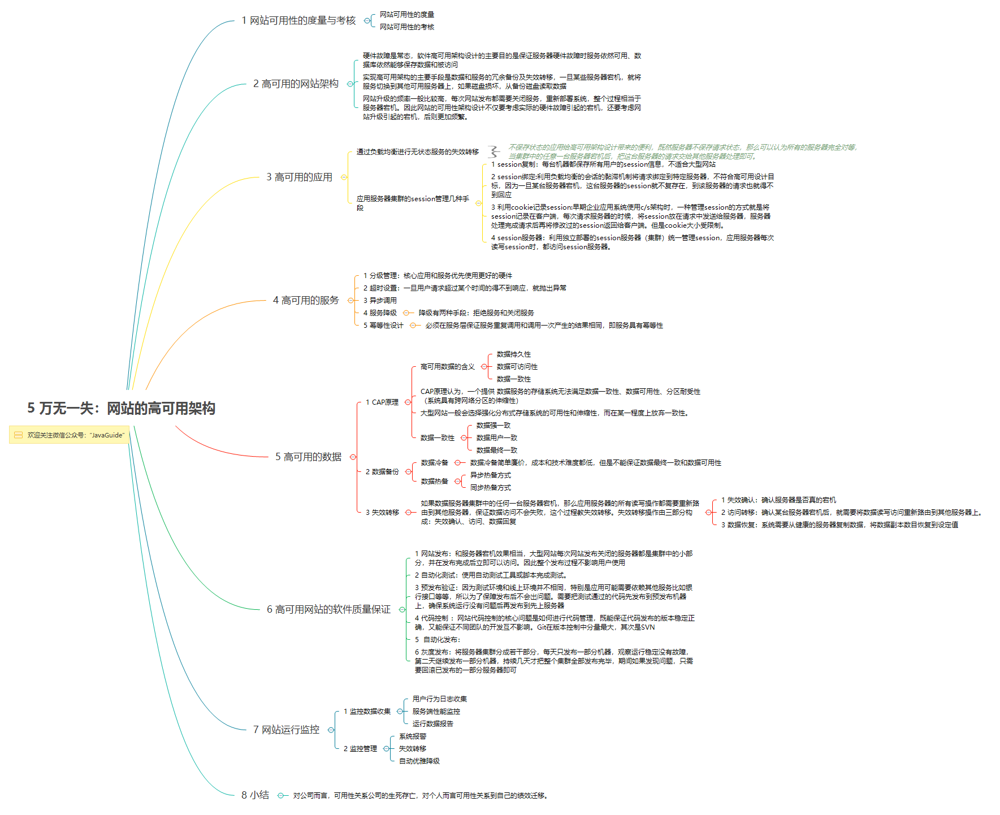
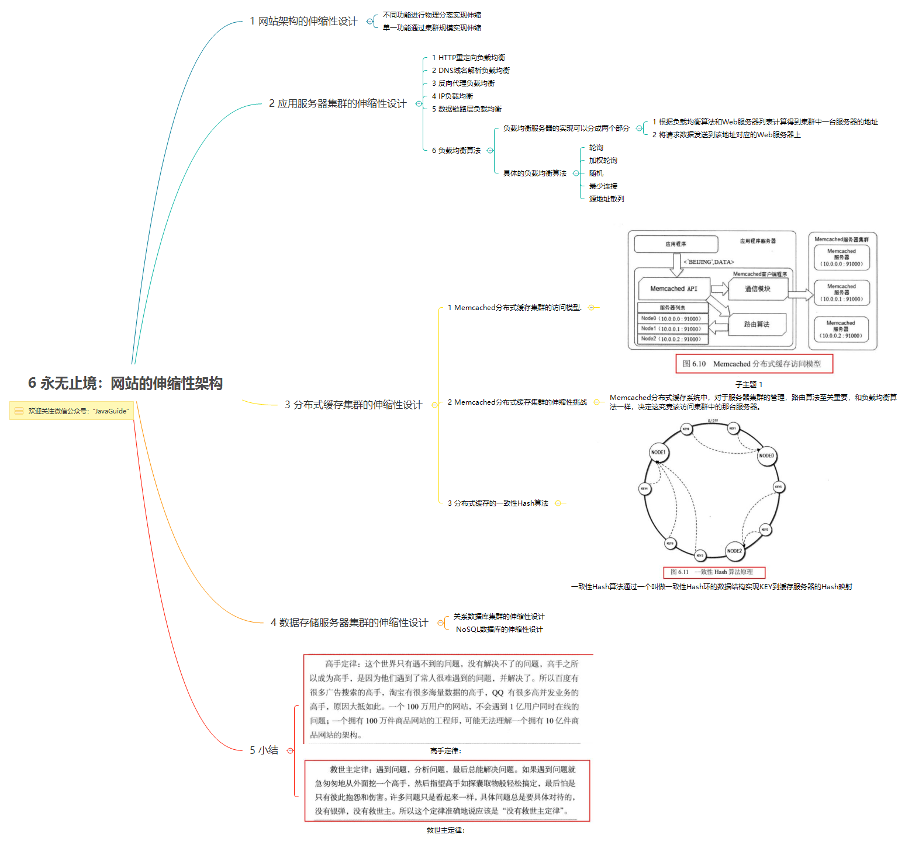
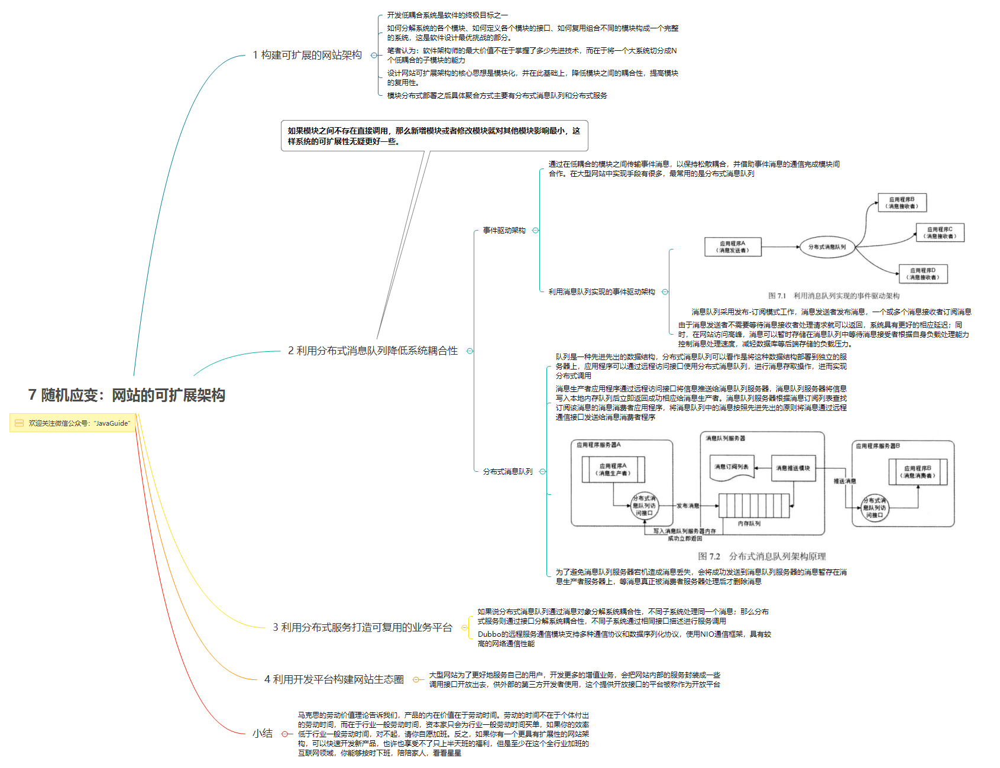
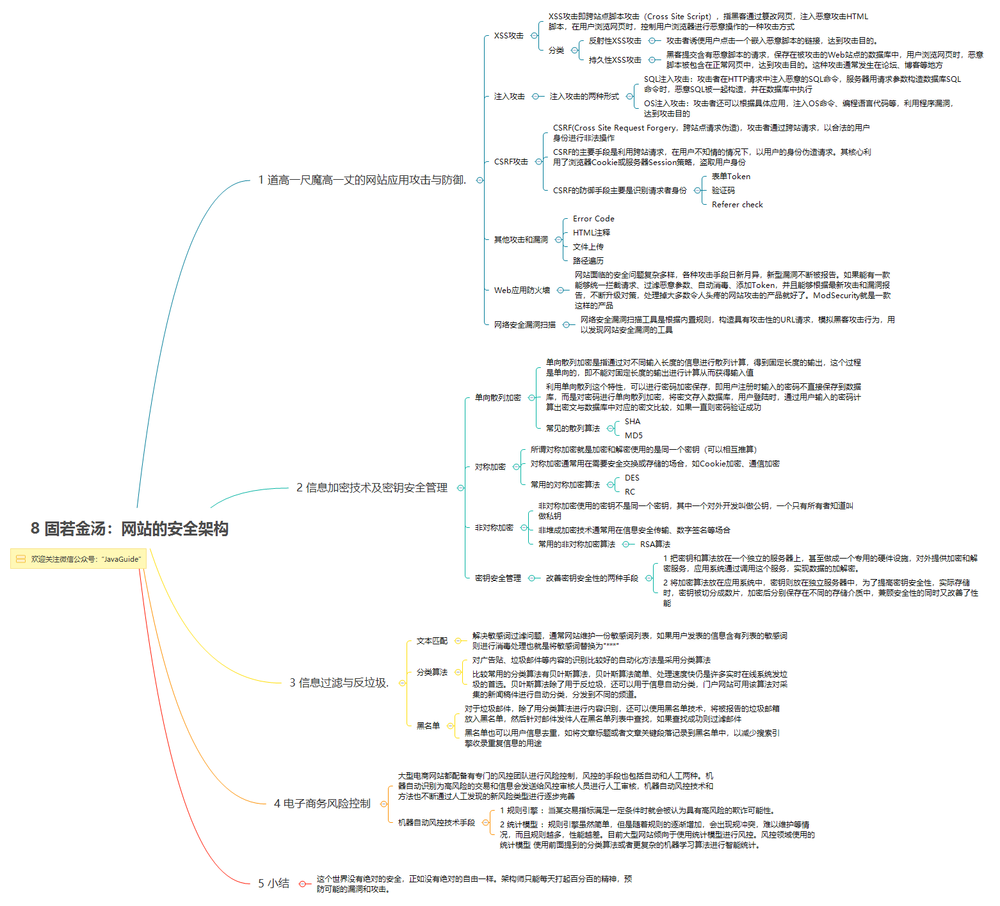

> 本文是作者读 《大型网站技术架构》所做的思维导图，在这里分享给各位，公众号(JavaGuide)后台回复：“架构”。即可获得下面图片的源文件以及思维导图源文件！

<!-- MarkdownTOC -->

- [1. 大型网站架构演化](#1-大型网站架构演化)
- [2. 大型架构模式](#2-大型架构模式)
- [3. 大型网站核心架构要素](#3-大型网站核心架构要素)
- [4. 瞬时响应:网站的高性能架构](#4-瞬时响应网站的高性能架构)
- [5. 万无一失:网站的高可用架构](#5-万无一失网站的高可用架构)
- [6. 永无止境:网站的伸缩性架构](#6-永无止境网站的伸缩性架构)
- [7. 随机应变:网站的可扩展性架构](#7-随机应变网站的可扩展性架构)
- [8. 固若金汤:网站的安全机构](#8-固若金汤网站的安全机构)

<!-- /MarkdownTOC -->

### 1. 大型网站架构演化

### 2. 大型架构模式

### 3. 大型网站核心架构要素

### 4. 瞬时响应:网站的高性能架构

### 5. 万无一失:网站的高可用架构

### 6. 永无止境:网站的伸缩性架构

### 7. 随机应变:网站的可扩展性架构

### 8. 固若金汤:网站的安全机构

