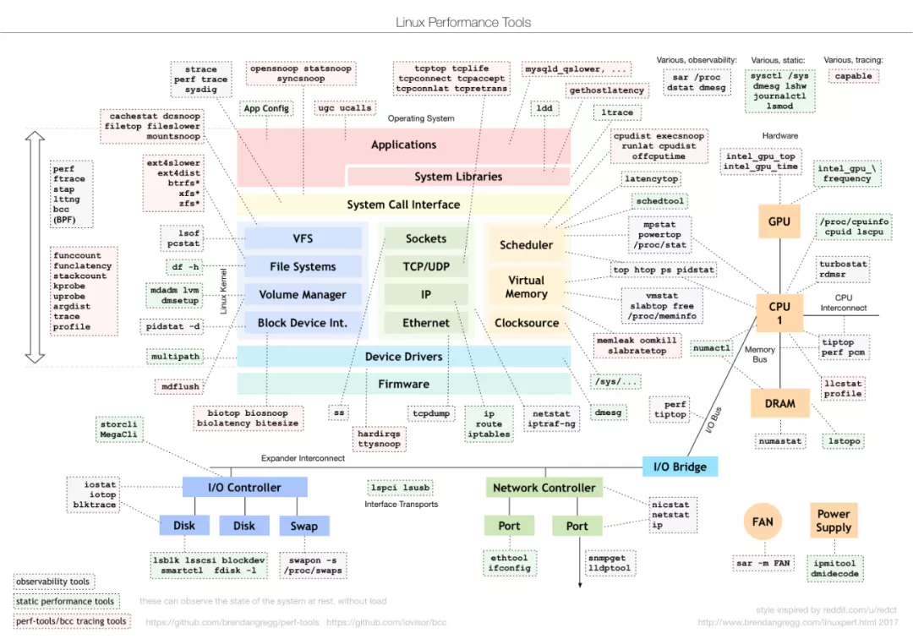
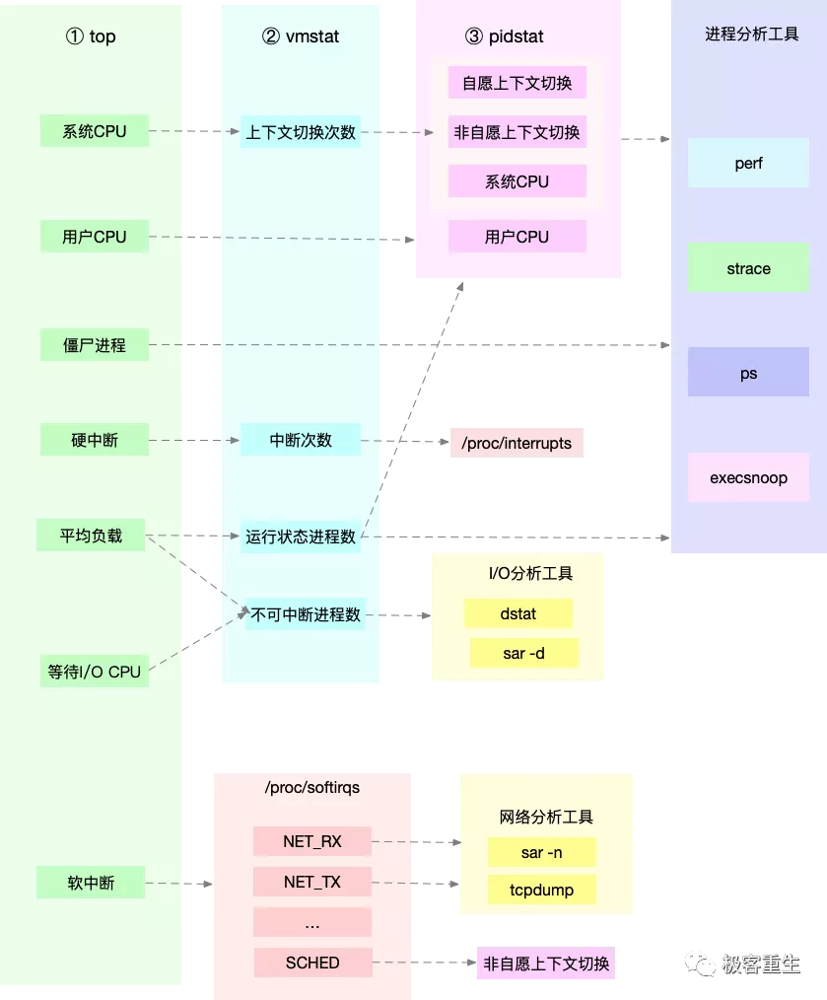
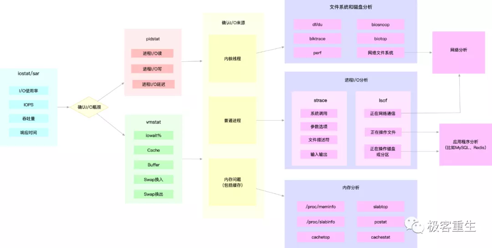
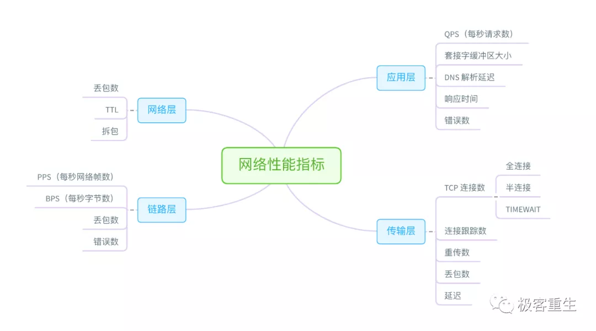

# ***\*Linux问题分析与性能优化\****

极客重生 [极客重生](https://mp.weixin.qq.com/javascript:void(0);) 8/20

 

## 排查顺序

整体情况：

1. `top/htop/atop`命令查看进程/线程、CPU、内存使用情况，CPU使用情况；
2. `dstat 2`查看CPU、磁盘IO、网络IO、换页、中断、切换，系统I/O状态;
3. `vmstat 2`查看内存使用情况，内存状态；
4. `iostat -d -x 2`查看所有磁盘的IO情况，系统I/O状态；
5. `iotop`查看IO靠前的进程，系统的I/O状态；
6. `perf top`查看占用CPU最多的函数，CPU使用情况；
7. `perf record -ag -- sleep 15;perf report`查看CPU事件占比，调用栈，CPU使用情况；
8. `sar -n DEV 2`查看网卡的吞吐，网卡状态；
9. `/usr/share/bcc/tools/filetop -C`查看每个文件的读写情况，系统的I/O状态；
10. `/usr/share/bcc/tools/opensnoop`显示正在被打开的文件，系统的I/O状态；
11. `mpstat -P ALL 1 `单核CPU是否被打爆；
12. `ps aux --sort=-%cpu `按CPU使用率排序，找出CPU消耗最多进程；
13.  `ps -eo pid,comm,rss | awk '{m=$3/1e6;s["*"]+=m;s[$2]+=m} END{for (n in s) printf"%10.3f GB %s\n",s[n],n}' | sort -nr | head -20 `统计前20内存占用`；`
14. `awk 'NF>3{s["*"]+=s[$1]=$3*$4/1e6} END{for (n in s) printf"%10.1f MB  %s\n",s[n],n}' /proc/slabinfo | sort -nr | head -20 ` 统计内核前20slab的占用；

进程分析，进程占用的资源：

1. `pidstat 2 -p 进程号`查看可疑进程CPU使用率变化情况；
2. `pidstat -w -p 进程号 2`查看可疑进程的上下文切换情况；
3. `pidstat -d -p 进程号 2`查看可疑进程的IO情况；
4. `lsof -p 进程号`查看进程打开的文件；
5. `strace -f -T -tt -p 进程号`显示进程发起的系统调用；

协议栈分析，连接/协议栈状态：

1. `ethtool -S `查看网卡硬件情况；
2. `cat /proc/net/softnet_stat/ifconfig eth1 `查看网卡驱动情况；
3. `netstat -nat|awk '{print awk $NF}'|sort|uniq -c|sort -n查看连接状态分布；`
4. `ss -ntp`或者`netstat -ntp`查看连接队列；
5. `netstat -s `查看协议栈情况；

## ***\*方法论\****

RED方法：监控服务的请求数（Rate）、错误数（Errors）、响应时间（Duration）。Weave Cloud在监控微服务性能时提出的思路。

USE方法：监控系统资源的使用率（Utilization）、饱和度（Saturation）、错误数（Errors）。

 

## ***\*性能分析工具\****

 

 

Linux 内核的各个子系统出发，汇总了对各个子系统进行性能分析时，你可以选择的工具。不过，虽然这个图是性能分析最好的参考资料之一，它其实还不够具体。比如，当你需要查看某个性能指标时，这张图里对应的子系统部分，可能有多个性能工具可供选择。但实际上，并非所有这些工具都适用，具体要用哪个，还需要你去查找每个工具的手册，对比分析做出选择。

 

## ***\*CPU分析思路\****

首先，从 CPU 的角度来说，主要的性能指标就是 CPU 的使用率、上下文切换以及 CPU Cache 的命中率等。下面这张图就列出了常见的 CPU 性能指标。

 

 

 

 

 

 

 

## ***\*内存分析思路\****

接着我们来看内存方面。从内存的角度来说，主要的性能指标，就是系统内存的分配和使用、进程内存的分配和使用以及 SWAP 的用量。下面这张图列出了常见的内存性能指标。

 

 

 

 

## ***\*IO分析思路\****

从文件系统和磁盘 I/O 的角度来说，主要性能指标，就是文件系统的使用、缓存和缓冲区的使用，以及磁盘 I/O 的使用率、吞吐量和延迟等。下面这张图列出了常见的 I/O 性能指标。

 

 

 

 

 

 

 

## ***\*网络分析思路\****

从网络的角度来说，主要性能指标就是吞吐量、响应时间、连接数、丢包数等。根据 TCP/IP 网络协议栈的原理，我们可以把这些性能指标，进一步细化为每层协议的具体指标。这里我同样用一张图，分别从链路层、网络层、传输层和应用层，列出了各层的主要指标。

 

 

 

 

 

 

## ***\*基准测试工具\****

除了性能分析外，很多时候，我们还需要对系统性能进行基准测试。比如，

· 

在文件系统和磁盘 I/O 模块中，我们使用 fio 工具，测试了磁盘 I/O 的性能。

· 

· 

在网络模块中，我们使用 iperf、pktgen 等，测试了网络的性能。

· 

· 

而在很多基于 Nginx 的案例中，我们则使用 ab、wrk 等，测试 Nginx 应用的性能。

· 

 

## ***\*参考\****

· 

相当一部分内容来自极客时间出品的倪鹏飞专栏《Linux性能优化》, 这是之前这个专栏的学习笔记。

· 

· 

另一份资料是IBM红宝书Linux性能调优指南。

· 

· 

此外，The Linux Documentation Project是一个非常好的资料库。

· 

· 

将硬件中断的处理任务分配个多个CPU：SMP affinity and proper interrupt handling in Linux

· 

· 

Hidden Costs of Memory Allocation

· 

· 

https://www.lijiaocn.com/soft/linux/

· 

 