# ***\*深入理解程序的本质\****

极客重生 [极客重生](https://mp.weixin.qq.com/javascript:void(0);) 8/23

hi ,大家好，这篇文章源于知乎一些问题，真正的技术高手，无非是对计算机程序本质的深刻理解，水平高低，取决于你对计算机的理解深度，这句话，大家可以慢慢体会，很多编程问题，写代码有bug，解决bug慢等问题，本质上来说，都是你对计算机理解不够深刻导致的。

 

 

 

**导读**

 

很久很久以前（其实也没有那么久，毕竟计算机科学的发展也才那么几十年而已），程序员都是用二进制编码的，后来开始用汇编语言，今天，事情发生了很大的变化，人们开始使用高级语言，或者说已经工作在更高的抽象层次上了。你可能会有疑惑：为什么今天我们还要花力气来学习机器级别的编程方式呢？

 

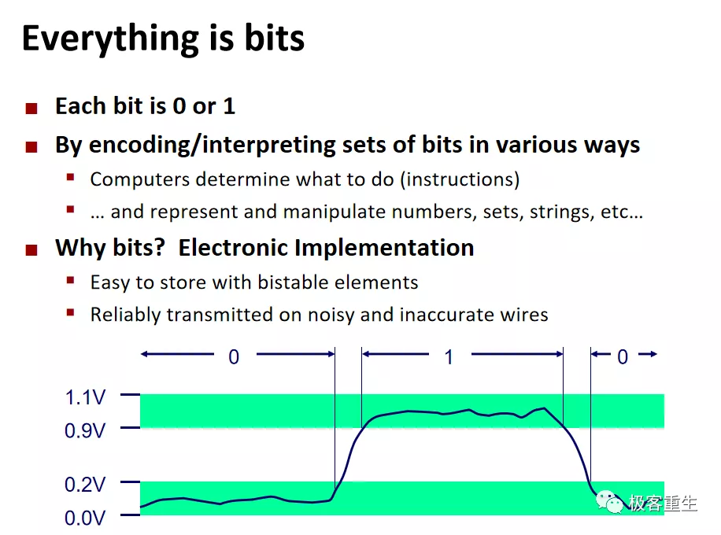 

 

 

这里的机器级编程包含了两种含义**，一个是可以直接在机器上运行的二进制指令**，**另一个是汇编语言（就是编译器产生的代码）**，对于我们来说，两者都属于机器级别，两个概念可以互换，它们之所以很重要，因为它们是连接你所编写的高级语言代码和机器之间的纽带，是实实在在的基石，理解这里面的一些底层工作的原理还是很有必要的，实际上这也是CSAPP区别于其他课程的一个显著点，但这并不是要求你徒手写汇编代码（现代编译器可能比你更精通这一点，或许也比你更有耐心），只是希望当你遇到需要阅读一点点汇编代码的时候不至于惊慌无措，当然了，如果你想成为一名系统程序员或者想成为一名黑客，那么这个话题就很重要了。

 

历史上出现过很多知名的指令集架构，比如Alpha， SPARC，PowerPC，MIPS等，但是今天最流行的指令集架构是**x86(-64)，ARM，RISC-V**，本课程把重点放在了英特尔x86-64上，毕竟讲课的话总是限定在某种处理器上讲起来也相对容易一些嘛，**指令集架构（ISA）的地位非常重要，就是在那里，软件遇见了硬件！**

 

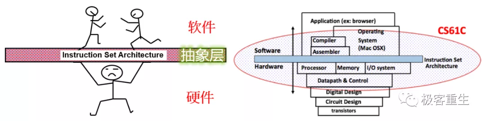 

 

 

历史上出现过很多成功的指令集架构，但是时过境迁，当今主流的指令集架构，如下图所示：

 

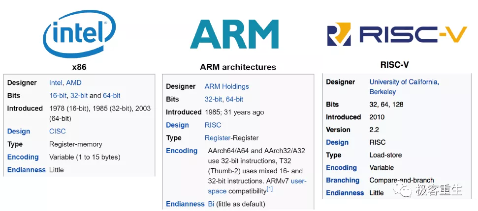 

 

------

 

**基本概念**

 

**Instructure Set Architecture**：指令集架构 (包括指令规格，寄存器等)，简称ISA，它是软硬件之间的“合同”

**Mircoarchitecture**：指令集架构的具体实现方式 (比如流水线级数，缓存大小等)，它是可变的

**Machine Code**：机器码，也就是机器可以直接执行的二进制指令

**Assembly Code**：汇编码，也就是机器码的文本形式 (主要是给人类阅读)

 

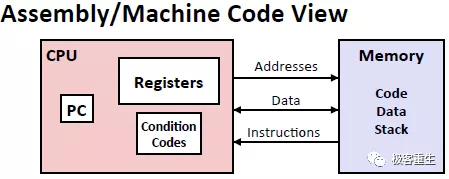 

从汇编码/机器码的角度来看计算机系统

 

**程序员的角度 vs 微体系结构 （程序员可见 vs 程序员不可见）**，在CPU方面，开放给程序员的编程接口只是PC，寄存器，条件码，其他的内部信息比如CPU内部的Cache对程序员来说都是不可见的，内存角度来讲，大部分的ISA支持字节寻址方式 (即Byte寻址，实际上还有Bit寻址，32-bit寻址，64-bit寻址等，只是比较少见而已)，绝大多数的ISA具有确定的大小端模式 (有些ISA可变)。

 

**编译过程**

 

其次，理解C程序的编译过程：源代码 -> 编译 -> 汇编 -> 链接 -> 可执行文件 -> 装载 -> 执行

 

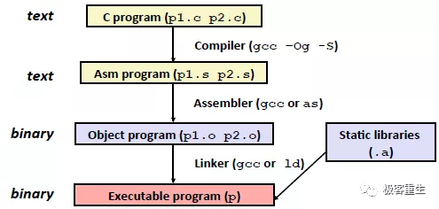 

 

 

以下是x86-64平台编译后的汇编码和机器码，注意：不同的平台（ISA不同）和不同的编译器会产生完全不同的机器码，但是无论如何大家可以看到最终产生的机器码无非就是0和1的组合，关键在于机器知道该怎样来解释它们。

 

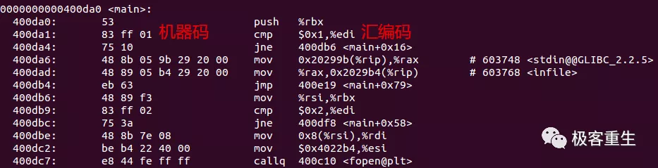 

 

 

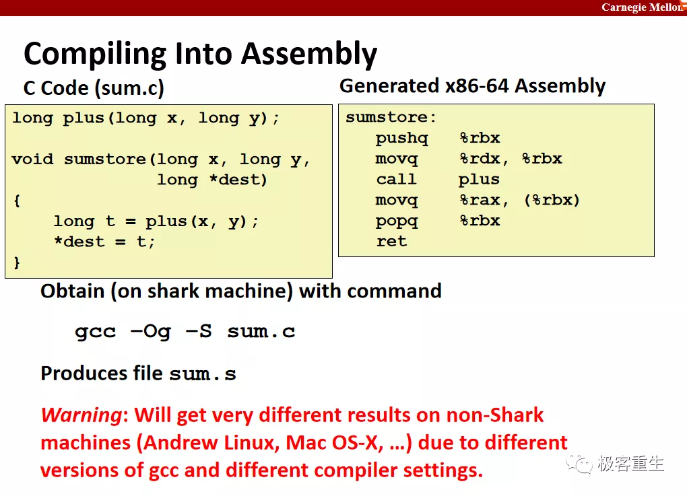 

 

**重要思想**：程序就是一系列（被编码了的）字节序列 （看上去和数据一模一样），这就是所谓的冯诺依曼结构计算机，即程序存储型计算机，冯诺依曼结构由于EDVAC项目的技术报告分发而开始被人们熟知。

 

 

 

 

**学习方式**

 

机器级编程-I：基础

 

**历史**：Intel在开发自己的64位指令集架构 (Itanium) 的时候遭遇了失败，部分原因在于它和之前的 IA32 指令集不兼容，而且性能也达不到预期，最终不得不转而采用AMD的64位指令集x64-86.

 

**重点提示**：了解 Intel x86-64的寄存器组（下图所示），基础指令集，包括数据传送（包括压栈和出栈），算术和逻辑运算，特别需要留意<源操作数>和<目的操作数>在具体指令中的方向！

 

学习C语言和x86汇编语言之间的关系的一个绝佳方式就是逆向工程，你可以使用GNU提供的工具例如 **objdump** 或者 **GDB** 查看反汇编代码来学习！

 

 

 

 

机器级编程-II：控制

 

**重点提示**：理解条件码 (**CF**，ZF，SF，**OF**)，分支（Conditional Move => 分支预测相关），循环

 

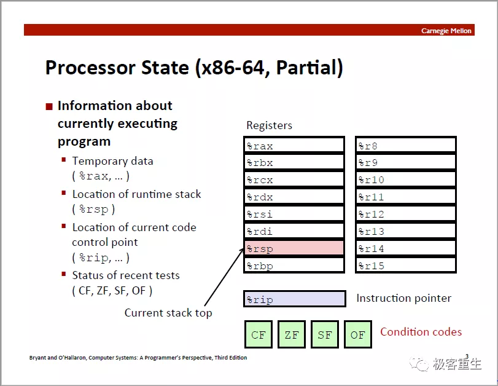 

 

 

**备注**：编译器比你想象的要聪明，例如，你写的switch语句可能会被优化为 jump table，还会消除无用的语句(Dead code elimination)等，汇编代码有时候不仅仅是C代码的直译，也就是说：编译器可以执行不同程度的优化，那么你很有可能会一下子很难理解编译器生成的汇编代码，请不要害怕，多点耐心，试着自己分析看看，说不定你会恍然大悟，赞叹编译器的聪明之处！关于编译器的优化在第5章会有更多的探讨。

 

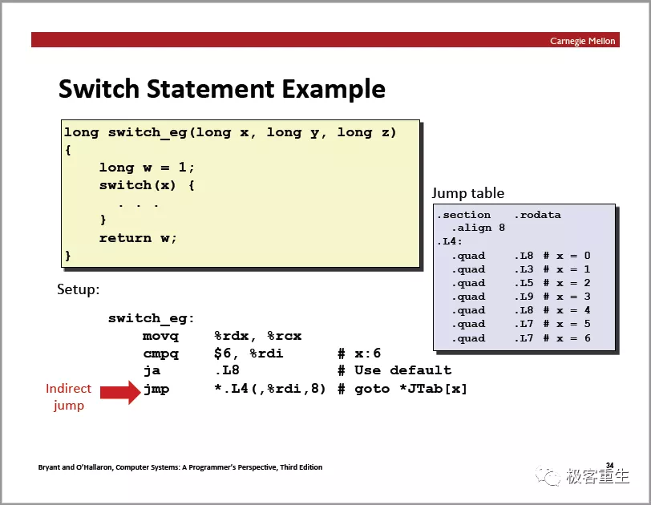 

 

机器级编程-III：过程

 

**重点提示**：函数调用的过程 ：控制权转移 (含返回地址的保存)，参数传递，内存管理 (栈)，控制权返回.

 

**备注**：无论何种 ISA，函数调用过程大同小异，只是在具体的指令或者在ABI (Application Binary Interface) 层面略有不同而已，比如不同的ISA会有不同的 Calling Convention，也就是调用规则，它是调用者 Caller 和被调者 Callee 之间的某种合约，比如哪些寄存器用来传递参数，哪些寄存器用来存放返回值，哪些寄存器调用者/被调者可以放心使用等 (Caller Saved & Callee Saved)，理解Prologue & Epilogue！

 

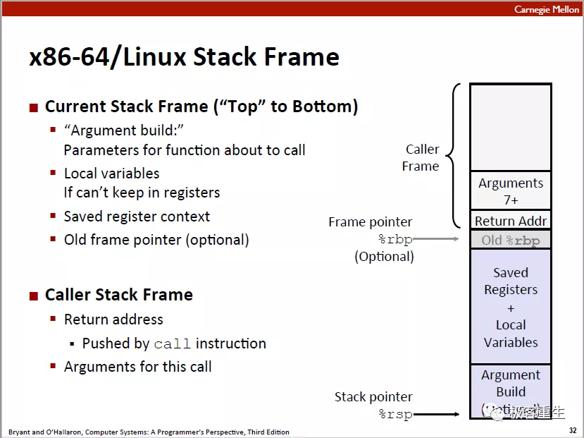 

 

请务必理解对应的投影片中的内容，如果你真的理解了递归函数的调用过程，那么恭喜你，你学会了 !

 

机器级编程-IV：数据

 

**Bits, Bytes, and Integers**

**道生一，一生二，二生三，三生万物****：**

 

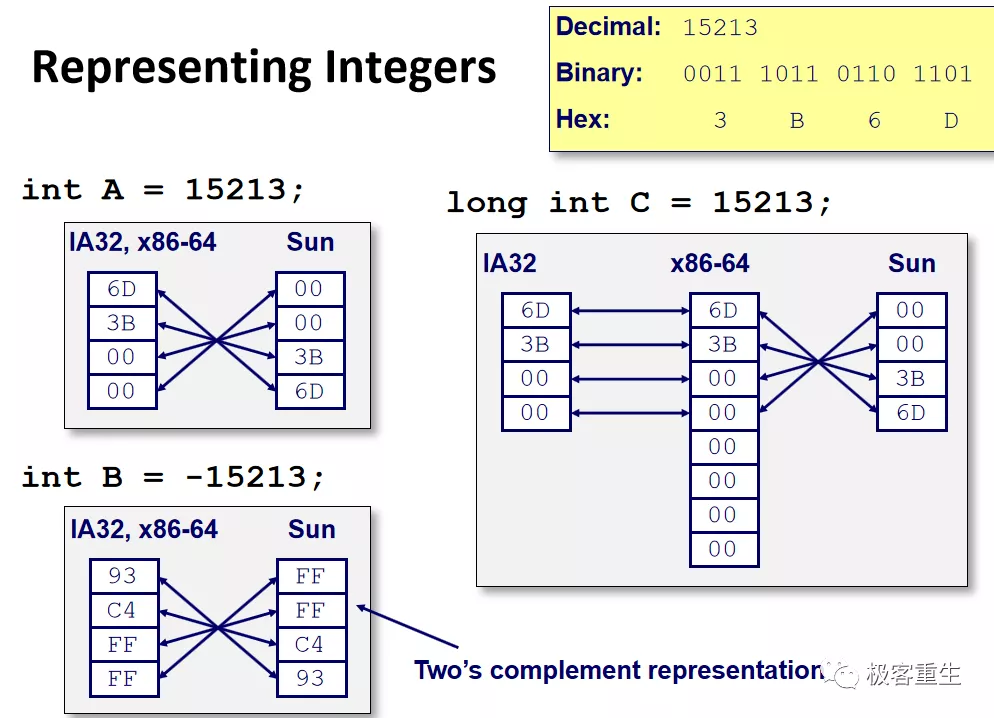 

 

**重点提示**：理解C语言中的数组和指针在机器级是如何表示的，理解字节对齐的作用 （有些指令集架构是强制要求字节对齐的，即使不要求也应该做到字节对齐，不仅能节省空间，更重要的是会影响访问性能）

 

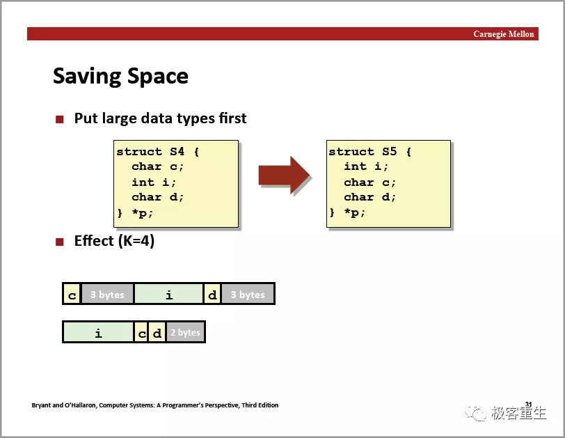 

 

机器级编程-V：进阶

 

**重点提示**：理解典型的内存布局 (栈，共享库，堆，代码段，数据段 ...)，如下图所示：

 

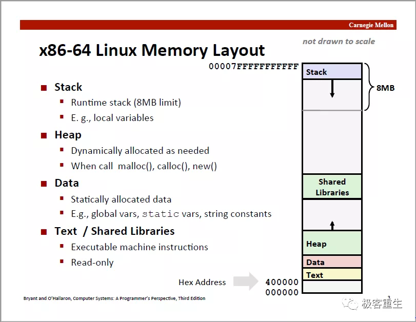 

 

理解缓冲区溢出导致的安全问题，以下是一个简单的示例程序（gcc编译参数：-fno-stack-protector）：

备注：我们这里讲缓冲区溢出的时候，重点讨论的是**栈**溢出的问题，实际上还有**堆**溢出的漏洞。

 

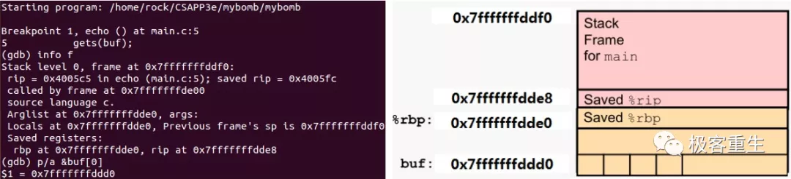简单的示例程序（运行gets前的栈）

 

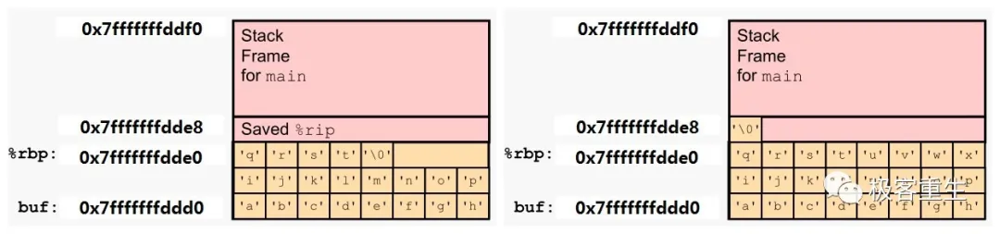 

简单的示例程序（运行gets后的栈：两种情况）

 

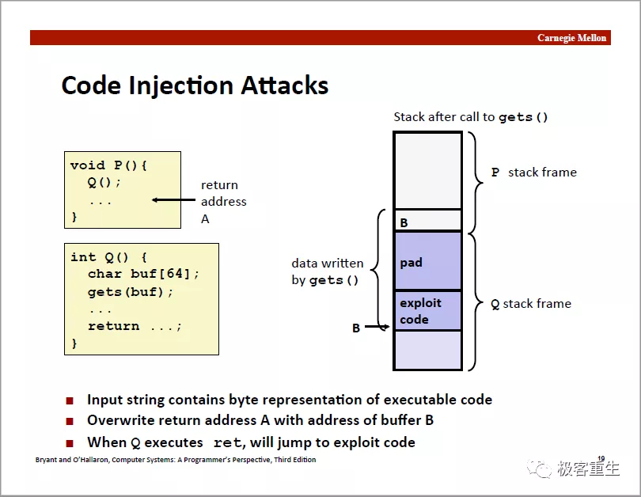 

 

 

**如何避免缓冲区溢出问题？**

 

\1. **程序员层面**，避免调用不安全的函数，比如，fgets代替gets，strncpy代替strcpy

2**. 操作系统层面**，增加保护机制，例如ASLR (地址空间随机化)，让攻击者难以猜测地址（依然可以攻破）

实际上，今天的绝大多数系统在默认情况下是启用ASLR的，可以通过以下命令查看**：**

 

 

 

· 

0 没有随机化，也就是关闭 ASLR

· 

· 

1 保留的随机化，其中共享库、栈、mmap 以及 VDSO 将被随机化

· 

· 

2 完全的随机化，在 1 的基础上，通过 brk() 分配的内存空间也将被随机化

· 

 

· 

**注意**：在用GDB调试时，可以通过set disable-randomization命令开启或者关闭地址空间随机化，默认是关闭随机化的，也就是on状态，具体参见：https://sourceware.org/gdb/onlinedocs/gdb/Starting.html

 

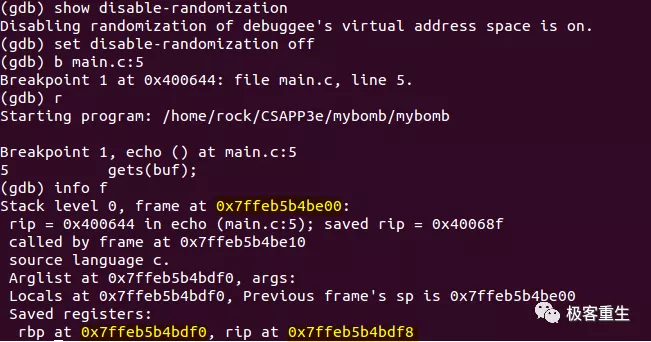 

 

 

\3. **硬件层面**，对栈区增加权限保护：**NX （**No-eXecute**），**gcc编译选项 -z  **execstack**/noexecstack

 

**思考**：如何绕过NX？一种方式是ROP（就是你在Attack Lab实验中的 Phase4~Phase5），另外一种攻击方式是 **ret2libc**（不能返回到我写的代码，返回libc的代码总可以吧 ... 这种方式需要自己构建栈帧 ...）

 

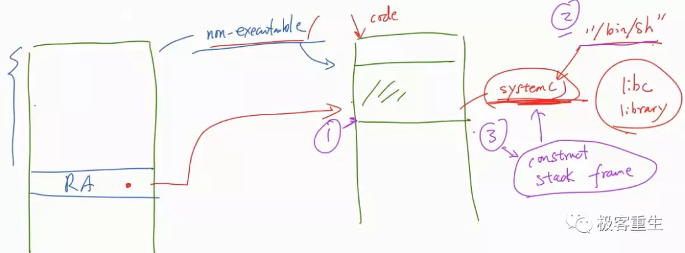 

 

 

\4. **编译器层面**，缓冲区溢出的检测（Stack Guard），又被称作栈“金丝雀”（Canary）,故事：人们发现将金丝雀可以检测一氧化碳的浓度，于是煤矿工人将金丝雀带入煤矿，一旦超标，鸟类会在矿工面前死去或者出现生病的症状，这可以作为有毒气体（要是一氧化碳）的预警信号。

 

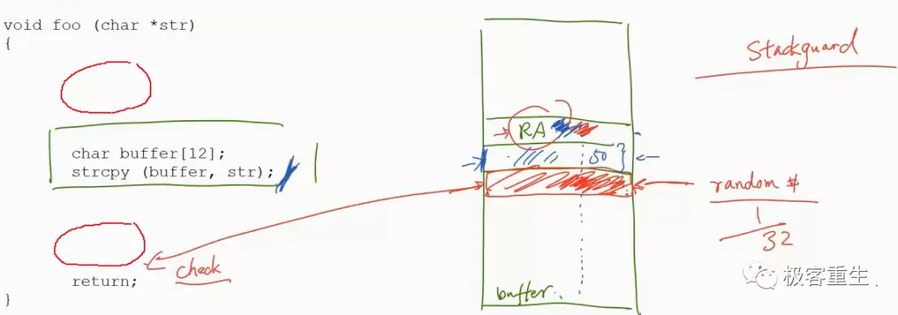 

思考：“金丝雀值” 应该存放在哪里？

 

还是前面那个简单的示例程序（gcc编译参数：-fstack-protector）：

 

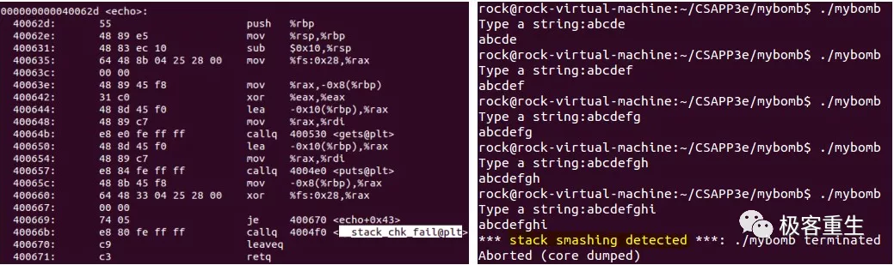 

缓冲区溢出检测的例子（gcc编译参数：-fstack-protector）

 

备注：所谓 “道高一尺魔高一丈”，黑客会利用其它的机器级别的特性来进行针对性的攻击，例如，ROP攻击， ROP全称Return-Oriented Programming，就是对栈上的返回地址进行利用的一种攻击方式，ROP的攻击方法是借用代码段里面的多个片段指令拼凑成一段有效的逻辑，从而达到攻击的目的，片段指令一般称之为Gadget，即利用Gadget + retq，我们可以利用多个retq跳到不同的Gadget来实现我们完整的攻击流。

 

 

 

 

 

 

C语言复习

 

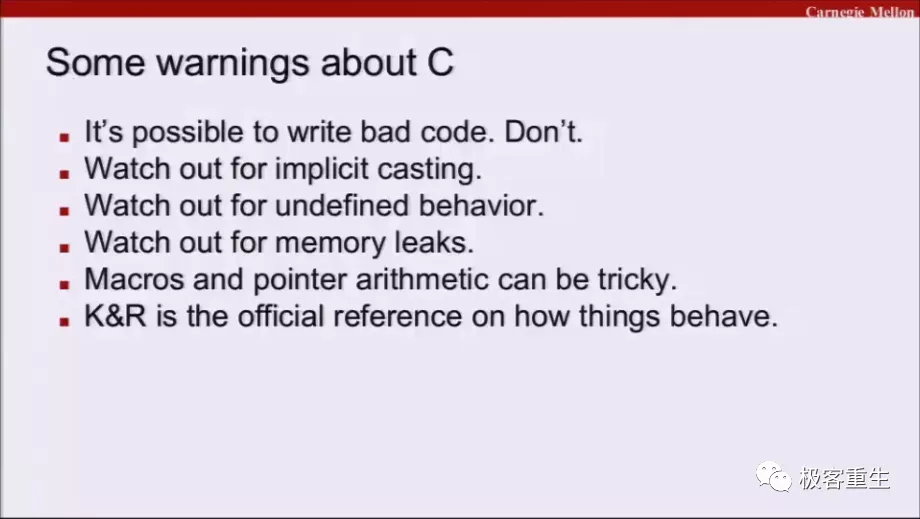 

 

 

**实验解读（*****\*Bomb Lab\******）**

 

提示用户输入正确的字符串来拆掉炸弹，如果任何一个不正确，炸弹就会“爆炸”，你必须通过逆向工程来解除炸弹，这会让你理解汇编语言，学习如何使用GDB来调试程序，设计得很有意思。

 

实验相关说明（CMU的助教讲解）：**Bomb Lab实验说明**

 

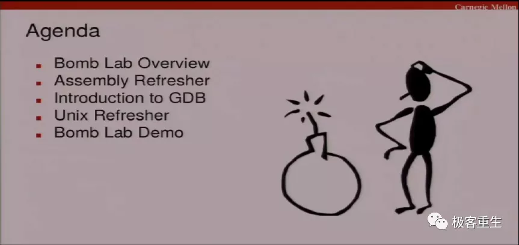 

 

 

请首先学习和熟悉GDB的使用方法：

http://csapp.cs.cmu.edu/3e/docs/gdbnotes-x86-64.pdf

然后学习一些汇编的基础知识：

Intel 64 and IA-32 Architectures Software Developer's Manuals

经过了6个步骤，拆除炸弹后大概是这个样子（实际上还隐藏了一个彩蛋，这里没有画出）

 

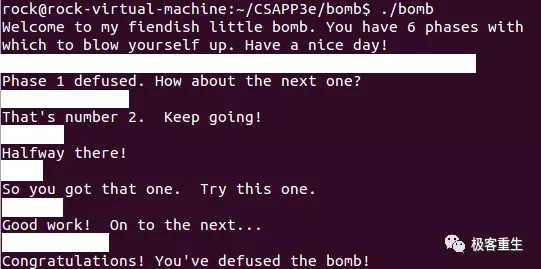 

 

 

**实验解读（****Attack Lab****）**

 

要求大家利用Code Injection Attacks （代码注入攻击）和 ROP（返回导向的编程）这两种方法来攻击程序，对现有程序进行控制流劫持，执行非法程序代码，模拟当黑客的感觉，同时学会如何预防这些攻击手段。

 

实验相关说明（CMU的助教讲解）：Attack Lab实验说明 （前3题是CIA实验，后2题是ROP实验）

开始实验之前，请仔细阅读实验说明（讲义）：

http://csapp.cs.cmu.edu/3e/labs.html

 

 

 

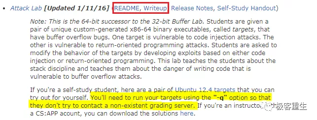 

 

**温馨提示**：计算机安全中的不少攻击和防御方法表面上看起来不同， 但如果深入研究的话，会发现它们其实是相似的或有关联，反过来，有些内容看起来相似， 本质上却有所不同，这就是知识点的相关性，只有将不同的知识点联系起来， 才能在脑海中形成知识体系，计算机安全知识更新很快，每天都有新的漏洞和攻击出现。有了扎实的知识体系，就不会疲于学习这些新知识，因为很多东西万变不离其宗。

 

**抽象很重要**，但是作为学生，请不要 “总是” 习惯忽略细节，导致只懂理论，不会实践，从CMU精心设计的实验可以看出，一个细节没搞清楚， 攻击就无法成功，作为一个主动学习者，我们有时候需要多问一个为什么，比如：**怎样让我写的程序不能被GDB追踪调试？**另外一方面，很多时候学生没有兴趣或者学不会，问题可能真的不在学生身上，而是老师没有认真思考如何教，让学生真正有学会的感觉，像是杜文亮教授这样的老师就让我很感动：

https://www.handsonsecurity.net/

你可以真正学到有价值的东西！

 

 

 

 

**延伸阅读**

 

· 

· 

英特尔官方提供的开发者手册：Intel 64 and IA-32 Architectures Software Developer's Manuals

· 

· 

· 

如果你想彻底搞懂C指针，强烈推荐你看看这个视频课程：4小时彻底掌握C指针 - 顶尖程序员图文讲解

· 

· 

关于C语言和x86汇编语言之间的关系 (含函数调用过程等)，还可以参考印度理工的：C语言和汇编语言

· 

· 

关于C语言指针和数组的关系以及内存的更多讨论，请参考本人拙作：关于指针，数组，内存的思考

· 

· 

现代C语言相关的信息可以参考这本书（出自INRIA，在法国的地位相当于我国的中科院）：现代C语言

· 

· 

文中的视频地址：

· 

https://fengmuzi2003.gitbook.io/csapp3e/di-3-zhang-ji-qi-ji-bian-cheng

 