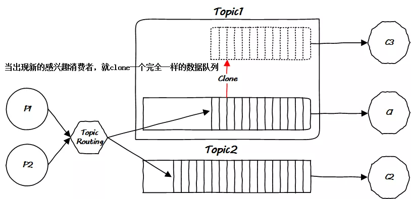
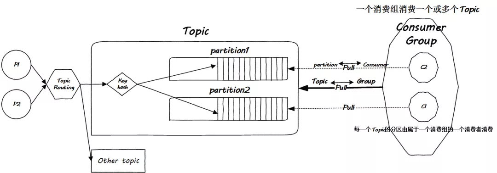

# ***\*深入理解Kafka的设计思想\****

 

hi 大家周末好，消息队列是分布式系统中重要的组件，在很多生产环境如商品抢购等需要控制并发量的场景下都需要用到，消息队列主要解决了应用耦合、异步处理、流量削锋等问题，当前使用较多的消息队列有RabbitMQ、RocketMQ、ActiveMQ、Kafka、ZeroMQ、MetaMq等，而部分数据库如Redis，Mysql以及phxsql也可实现消息队列的功能。

 

消息队列在实际应用场景：

应用解耦：多应用间通过消息队列对同一消息进行处理，避免调用接口失败导致整个过程失败；

异步处理：多应用对消息队列中同一消息进行处理，应用间并发处理消息，相比串行处理，减少处理时间；

限流削峰：广泛应用于秒杀或抢购活动中，避免流量过大导致应用系统挂掉的情况；

 

今天分享一篇经典的Kafka设计剖析文章给大家，Kafka作为顶级消息中间件，据 Confluent 称， 超过三分之一的财富 500 强公司使用 Apache Kafka，**kafka的性能快，吞吐量大，并且高于其他消息队列一个水平, 即使在消息量巨大的情况下还能保持高性能**, 在互联网公司中非常流行， 希望大家领悟到kafka设计的核心原理。

 

 

**Kafka****架构**

 

**Kafka**是一个被精心设计的东西，我只能这样说。我这里所谓的精心不是说它很完备的实现了某种规范，像个学生那般完成了某个作业，比如JMS，恰恰相反，Kafka突破了类似JMS这种规范性的束缚，它是卓越的，乃yet another JMS。当我用yet…如此称呼一个技术的时候，意味着这玩意儿已经进入了我的视野。好了，现在是Kafka和Storm时间，本文先谈Kafka。

 

**Kafka是什么？**

参见官方文档，它是Apache的一个项目。它是一个消息队列。

 

**消息队列若何**

消息队列是生产者和消费者之间的信使，避免了二者之间直接的接触。在效果上，它可能和缓存所起的作用一样，平滑了生产者和消费者之间的代谢速率差，但是在其根本目的上，它是为了解除生产者和消费者之间的耦合。如果你觉得有点费解，那么简单点说。

 

**fire and forget**，这句话的意思再简单点说，就是真男人从不看爆炸，烟头往油箱里一丢，把风衣的领子一竖，手插裤兜里，径直走开，决不不回头。

 

**消息队列**，以下简称MQ，就是造就这种真男人的。它能让生产者把消息扔进MQ就不管了，然后消费者从MQ里取消息即可，不用和生产者交互。下面的篇幅，我将逐步用我的方式演化出Kafka的原型，为了掌握整体脉络，难免会隐掉很多细节，当然这些细节可以随便在其官方文档以及别人的博客里搜到，**我的目的只是希望能整理出一个脉络，在设计类似的系统的时候，见招拆招以备参考**。

 

**MQ朝着”正确”方向的演化**

Kafka就一定正确吗？客观讲，肯定不，但是它是本文的主角，所以它就一定正确。

 

我们先来看看作为通用的MQ，其最简单的形式，一般而言，这是大家在首次接触到MQ后的一个课后作业。

 

 

 

现在有个问题，如果有两个或者多个消费者需要消费消息，怎么办？很简单，广播呗：

 

 

 

消费者是上帝，很难搞的，你推给它们的东西，并不是它们全部都想要的，只要一部分怎么办？

 

 

 

好吧，消费者一定在怪MQ服务不周，然而MQ有什么错，它又不理解消息的语义，面对百般刁难的消费者，它最多只能要求生产者把消息细分一下，因此就出现了多个**Topic**：

 

 

 

这是很显然的想法，就是是在消息入队处区分消息的Topic，然消费者从取自己感兴趣的消息队列取消息即可。

 

但还是会潜在的多个消费对同一Topic消息感兴趣的情况：

 

 

 

如果采用广播，那么就仍然会出现冗余传播问题，如果单播，那么一个消费者取出消息后，这条消息该不该删除呢？如果删除了，另一个消费者怎么办？广播会浪费带宽，不广播也不行…这貌似进入了一个死循环，必须一劳永逸地从根源解决问题才行。显然的想法是下面的方案(至少我自己设计的话就会这么做)：

 

 

 

问题是解决了，然而我的天啊，仔细想一下先前的架构，把简图画出来后，会发现事情会一发而不可收拾，MQ本身的逻辑太复杂了：

 

 

 

回到UNIX哲学，遇到新问题的时候，**要新编一个程序，而不是为已有的程序添加一个功能**。本着这个思路，为什么不把这件因为消费者而导致复杂化的事情完全交给消费者呢？

 

有点往Kafka上靠了啊。

 

如果把MQ里面的数据**全部持久化存储**，消费者不就可以各取所需了吗？这是一个根本的转变，如果以前的方式是限量商务套餐-套餐强行推给你，不想要的自己扔掉，那么现在的方式就是无限量自助餐-想要什么自己去拿即可。**消息自取，消息永远都在MQ，消费者随便取，取哪个消息都行，什么时候取都行**。消费者只需要告诉MQ它想要哪个消息就好，因此需要传递一个消息的offset参数：

 

 

 

**(然而自助餐也有打烊的时候，部分也会限制就餐时长，这是Kafka策略化存储的问题，详见文档。)**

 

简化一下，现在看下图：

 

 

 

一切OK了。嗯，是的，这就是Kafka的原始模型。然而Kafka远不仅此而已。且看下文继续演化。

 

**集群化，容错**

先看一下现在的情况：

 

 

 

这是在**逻辑上**一个Kafka类似的MQ应有的结构。但是在物理实现上，它又如何呢？

 

常听人说，Kafka一开始就是为分布式而生的，这话怎么理解呢？我们只需要先理解它如何扩容，然后再理解它如何将扩容**作用于不同的机器即可**。先看扩容。

 

类似高速公路，一般当你听到广深高速的时候，我们知道这是从广州到深圳的一条高速公路，这是逻辑上的说法，类似到目前为止我们讨论的MQ的Topic。然而这条高速公路到底长什么样子，沿途怎么路由，这就是物理实现了。此外，所有的道路都会分多个车道用于并行。严格来讲，每一个车道都会被细分，比如小型车道，客车道，大货车道，超车道等等，所有这些车道上的车都是到达同一个目的地(属于同一个Topic)，然而它们确实是细分的不同种类。把一个叫做partition的概念类比为车道，如下图：

 

 

 

注意这个**key hash模块**，这里就是**区分车子要进入哪个车道**的逻辑。在Kafka的术语中，车道就是**partition**，即**分区**。在同一个Topic中分发消息的时候，你要自己设计hash函数，该hash函数就是一个分发策略，决定把消息**按序**放到哪一个分区中去。

 

温州皮鞋厂老板说类比和举例不好，但这是技术散文，不是技术文档，多半是给自己看，所以还要类比。Topic Routing做的事是决定从哪条高速公路到哪里，而key hash则是决定你是坐轿车，客车还是卡车过去。

 

值得注意的是，Kafka只保证同一Topic内同一partition内消息的有序性，无法做到全局有序性。这并不是一个缺陷，这是两全不能齐美的。**完全的顺序就需要串行化，然而串行化就无法并行**，这简直就是废话！

 

现在，在**Topic**之下，我们又有了一个新的单位，叫做**partition**，这个叫做partition的就是Kafka中最基本的部署单位，这一点务必要记住，它关乎到如何组织你的集群。

 

好了，看一下这些Topic以及其旗下的partition是如何部署在M1和M2两台机器上的吧：

 

 

 

以上是花开两朵，各表一枝，现在该说说消费者了。

 

消费者面对MQ本身进化到如此细粒度，该如何应对呢？其实消费者也有**横向扩展**的需求，如果说消费者对应partition，那么对应Topic的就是消费者的上级了。因此多加了一个层次，引出**消费组**的概念，解决问题：

 

 

 

从CPU cache到Kafka，设计思路殊途同归，这就是一个典型的全方位组相联结构：

 

 

 

到此为止，全部图景已经完全绘制完毕，是时候展示集群的部署了。我们知道所谓的Kafka集群，就是将各个Topic的partition部署在不同的机器上，达到两个目的，一个是负载均衡，即提供访问的并行性，另一个就是提供高可用性，即做热备份，这两个功能我希望能用一个图展示：

 

 

 

总体的一个结构如下：

 

 

 

**持久化存储/查询机制**

上面的两个小节，我已经展示了Kafka是如何一步一步地肚子里面的勾当内外有别的，虽然我不知道作者怎么去设计，但如果是我自己，我肯定就是上面这个思路了。

…

 

------

 

前面的叙述终究是概览，不甚过瘾。本节将给出半点细节，瑾阐释一下Kafka存储的半景。

 

------

 

我们知道，Kafka为了卸载MQ本身的复杂性，为了其真正**无状态**的设计，它将状态维护机制这口锅完全甩给了消费者，因此取消息的问题就转化成了消费者拿着一个offset索引来Kafka存储器里取消息的问题，这就涉及到了性能。But 如何能查的更快？How？

 

还是先给出一个最简单的场景。假设Kafka的每一个partition都一个完整独立的文件，那么如果这个文件非常大，事实上也确实非常大(有可能到达T级别甚至P级别…)，那么在大文件中检索一个特定的消息本身就是一个头疼的问题，并且该文件还在磁盘中，这更是雪上加霜，我们都知道磁盘的随机读写是硬伤，顺序读写也好不到哪去，这怎么办？

 

遍历？如果每一个partition只是一个独立文件，那么只能遍历：

 

 

面对这个遍历问题，一般的解决方案就是建立索引，并且把索引数据常驻内存，很多数据库就是这么干的，Kafka当然也可以这么干。

 

Kafka比较帅的一点就是它并不借助任何特殊的文件系统，它的数据就存在一般的文件中，然而它把一个partition分成了等大小的一系列小文件，因此在物理上，并不存在一个完整的partition文件，partiotion只是表现为一个目录。我们知道，文件系统管理几个等大的文件是非常方便的：

 

 

 

 

以上的例子中，一个partiton被分成了100M大小的文件，这种小文件叫做分段，在Kafka存储的时候，每一个段文件存满为止再开辟下一个，由于消息的长度并不一定统一，因此每一个小段文件里面包含的消息数量并不一定一样多。

 

但是不管怎样，抽取每一个段文件的首尾消息偏移作为元数据保存起来是一件一劳永逸的事情，这便于建立一个**常驻内存**的索引：

 

 

 

通过这个区间查找树，很快就能定位到特定的段文件，但是事情并没有结束。

 

在Kafka中，每一个partition的段文件，均配带一个index索引文件，这个文件是做什么的呢？它是段文件内部消息的稀疏索引，见下图：

 

 

 

最终，经过两次区间树查找之后，最多再经历一次简单的遍历即可完成offset定位工作。诚然，最终的遍历可能是少不了的，但是Kafka尽可能地避免了大长段耗时的遍历计算，而是将遍历压缩到一个很小的量级，这是一个权衡！跟谁权衡呢？为什么不把段文件所有消息的索引均建立起来呢？

 

很简单，建立全部的索引会造成索引非常大，这样如果你还想其常驻内存的话，内存占用会很大，这确实又是一个时间和空间之间的权衡了。

 

 

**稀疏索引闲谈**

 

稀疏索引很有用，除了本文列举的Kafka的segment index稀疏索引之外，还有两个更为常见的例子(我不是应用编程的，我是搞内核网络协议栈的，所以在我看来Kafka更不常见！)：

 

索引整个内存地址空间，稀疏化的做法就是分页，即采用规则的方式将内存划分为等大小的块，叫做内存页，然后索引这些内存页即可，页表而不是地址表稀疏化索引，减小索引的大小。

 

另外，IP地址具有地域聚集性，因此对于路由器物理设备而言，对于每一个接口引出的方向，其IP地址集在很大程度上是可以聚集的，路由表一开始采用地址分类的方法，后来采用了前缀匹配的方法稀疏化索引，地址分类有点像内存地址分页，只是页面有多种大小而不仅仅是一种，而这里的地址前缀则比较像Kafka使用的两种索引，第一种是段索引，这是规则的，第二种是消息索引，这是不规则的。因为消息并不定长。

 

两种说法总结如下。

 

· 

**OS内存页表**

· 

在从虚拟地址定位物理地址的时候，需要一一对应定位到每一个地址吗？假如真是这样子，那么光页表项这种管理内存就要耗多少你算过吗？虚拟地址和物理地址将会是全相联结构。

 

采用稀疏索引后，只需要定位一个4K大小的页面即可，这将大大减小内存页表的内存占用。从而更加高效。

 

**·** 

**路由表**

**·** 

将每一个IP地址均对应到路由器设备的接口吗？这不现实。解决方案一开始是基于分配机构的分类地址稀疏索引，后来采用了基于使用结构的无类子网的前缀系数索引，无论哪种情况，均大大减少了路由表项的数量。

 

**UNIX哲学的出路**

 

没出路了！Why？因为只有复杂才能体现自己的工作量。

 

人们都希望制造门槛，把程序做的非常复杂，方才体现自己的能力，毕竟简单的东西大家都会，想体现区别，只能让自己的东西更复杂。如果你用几行Bash脚本完成了一项艰巨的工作，经理大概率会觉得你这是奇技淫巧，完全无法和C++的方案相比。Python好一点，Java则更好。

 

4,5年以前的曾经，我们有个编程道场的活动，有一次的一个题目是拼接字符串，即join操作，当时的经理兼主持者强调尽量用现成的接口，然而…

 

多少个优秀的极简方案没有被表扬，最后被表扬的方案你们知道其特征是什么吗？其特征就是**复杂**。我记得当时这个方案的作者上台介绍他的方案，上来就说”我这个设计非常简单…”结果呢，唉，用技术术语讲，过度设计了，用白话讲，装逼了。主持者显然也是完全半瓶子晃荡的吧，哈哈。

 

**事情必须做的尽量复杂，这样才是能力的体现**，2行能搞定的东西，必须凑够30行才算牛逼。UNIX哲学，在我们这，显然不合适吧。

 

**扩展阅读：**

https://blog.csdn.net/dog250/article/details/79588437

https://www.cloudamqp.com/blog/when-to-use-rabbitmq-or-apache-kafka.html

 