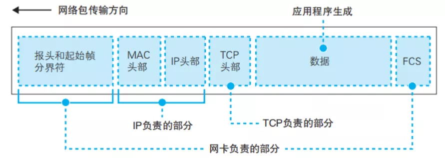

# ***\*计算机网络硬核指南|网络设计核心思想\****

 

大家好，我是Alex，今天分享计算机网络硬核系列的第一篇：计算机网络通信的理解

 

本篇主要是对计算机网络一些核心思想理解，属于内功心法，初学者适合入门，非初学者可以学习其设计思想，总之希望帮助大家提高对网络的理解；

 

深入浅出Linux网络硬核指南

 

 

***\*本系列从网络通信理解到云计算网络等网络的不同应用角色（场景）入手，深入浅出讨论了网络\*******\*设计的核心思想，网络TCP/IP协议栈的设计，网络编程核心技术，网络性能优化，云网络核心技术，网络问题排障等，\*******\*计算机网络\*******\*是程序员或者IT工程师必须要掌握的技能，本系列目的就是让不同读者都能加深对网络认识，打好坚实的网络基础，不管是面试中遇到的网络问题，还是工作中遇到的网络问题，都能得心应手。\****

 

 

***\*计算机网络通信的理解\****

 

 

1 计算机网络通信的本质

 

1948年 ***\*香农\**** 在 《通信的数学理论》中写道:

 

"通信的基本问题是在一点精确地或者近似的复现在另一个点所选取的信息"

 

网络通信的本质是信息的传播：

 

 

这里A与B之间的传播介质可以有很多不同层次的理解

· 

可以是有线的（双绞线、电缆、光纤等）

· 

· 

可以是无线的（蓝牙，WIFI，2345G等）

· 

· 

可以是具体的（物理直连）

· 

· 

可以是间接抽象的（跨网络）

· 

 

 

 

我们可以看看计算机网络通信模型：

 

 

 

这张图揭示计算机网络通信中的核心元素和要解决的核心问题：

 

**发送端：数据的生产者**

 

· 

信息编码

· 

· 

数据发送

· 

 

· 

**怎么发送数据？**

 

要发送数据，需要借助网卡这种硬件，OS会按照RFC标准格式来封装数据，然后把数据传给网卡，网卡把数据转化为电信号/电磁波传输出去；

 

**数据：信息载体**

 

· 

01比特流

· 

· 

编码格式

· 

 

· 

**怎么定义数据格式？**

 

大家按照标准来封装报文，整个链路所有网络设备都讲相同的“语言”，这样大家才可以自由交流；

 

**传输通道：数据传输中转站**

 

· 

数据存储

· 

· 

数据运输

· 

 

· 

**怎么转发数据？**

 

由于发送端和接收端：

\1. 

一个发送端可能要发给多个接收端，或者多对多场景，发送端端口有限，不能每个都单独通信，而且成本高，不易操作；

\2. 

\3. 

两台设备长距离传输，不可能直接网线相连，性价比太低；

\4. 

 

\5. 

这个时候数据需要中间节点来转发。中转节点一般是从一个网口进转到另外一个网口出，一般都是专有硬件处理，可以达到线速转发（像"直接连线一样速度"）；

 

**接收端: 数据的消费者**

 

· 

数据接收

· 

· 

解码信息

· 

 

· 

**怎么接收数据？**

 

同样要接收数据，需要借助网卡这种硬件，把电信号/电磁波信号转化为数据传给OS，OS会按照RFC标准格式来解析，最后把真正的数据交给应用；

 

 

 

计算机网络通信原理本质上是比较“简单”的，好理解，如果让你去设计一个全球网络通信系统，类似当今的互联网，你会怎么设计呢？你会考虑下面的问题吗？

\1. 

协议要怎么设计？

\2. 

\3. 

报文的转发机制是什么？

\4. 

\5. 

怎么保证系统不会挂掉（不可用）？

\6. 

\7. 

怎么满足不同类型计算机通信要求？

\8. 

 

互联网获得的成功显而易见，它已经成为当今全球数字社会最重要的基础设施，改变我们生活方方面面，如今电脑，笔记本，电视，iPad，手机等都可以轻松上网，网络四通八达，信息随处可达，这背后到底是什么核心技术支撑这个世界最大网络通信系统。是不是你也很好奇，不妨让我们来看一看互联网是怎么解决这些问题的。

 

2 计算机网络通信的核心思想

 

**网络的复杂性**

 

 

 

· 

长距离传输，比如访问国外的网站，数据跨越几千公里，怎么保证数据可达？

· 

· 

随着设备规模增大，数据流量增大，网络会不会崩溃？

· 

· 

计算机性能各异，怎么保证网络的公平性？

· 

· 

... 

· 

 

· 

那计算机网络是如何解决这些问题的呢？

 

## ***\*分布式思想--无连接分组交换\****

 

在此之前，数据通信是基于电路交换的想法，就像在传统的电话网络一样，在通话前先建立专有线路，时延小，适合电话实时通信场景，电路交换体现了一种集中管理思想，所有通信资源都集中分配管理。但适合计算机网络通信吗？ 

 

 

 

数据通信的技术演进

​                  

**电路交换**（英语：Circuit Switching）是相对于报文交换（或称分组交换）的一个概念。电路交换要求必须首先在通信双方之间建立连接通道。在连接建立成功之后，双方的通信活动才能开始。通信双方需要传递的信息都是通过已经建立好的连接来进行传递的，而且这个连接也将一直被维持到双方的通信结束。在某次通信活动的整个过程中，这个连接将始终占用着。连接建立开始时，通信系统分配给它的资源（通道、带宽、时隙、码字等等），这也体现了电路交换区别于报文交换的本质特征。

 

电路交换虽然通信实时性高但不适合计算机网络通信:

· 

建立专有连接代价高，需要整条链路每个节点分配资源，计算机网络通信场景复杂，高频低流，不好预估资源，资源管理会很复杂；

· 

· 

电路交换采用时分复用的原理，完全无法应对现代互联网的流量突发，同时将会有大量的能量被空闲时隙浪费，链路资源利用不高，可以说，传统的电信网络是不可扩展的；

· 

 

报文交换提高了通信线路的利用率，不需要建立连接，但也不适合计算机网络通信:

· 

报文交换是以报文为数据交换的单位，报文携带有目标地址、源地址等信息，报文整个地发送，一次一跳，在交换结点采用存储转发的传输方式，电报通信采用这种传输技术，由于报文长度没有限制，而每个中间结点都要完整地接收传来的整个报文，当输出线路不空闲时，还可能要存储几个完整报文等待转发，要求网络中每个结点有较大的缓冲区。为了降低成本，减少结点的缓冲存储器的容量，有时要把等待转发的报文存在磁盘上，进一步增加了传送时延；

· 

 

 

 

最终计算机网络采用了分组交换技术：

· 

基于报文交换，将报文划分为更小的数据单位：报文分组（也称为段、包、分组），分组交换比报文交换的时延小，尤其适合于计算机之间的突发式的数据通信；

· 

· 

分组交换采用分布式思想，每台电脑都是一个“节点”(node)，每个节点都彼此相联，形成纵横交错的网状结构。此种网络结构中，不存在中央的概念，而且单个节点的重要性大大降低，每个节点只关心与自己相邻节点，不会考虑整个链路，这样新节点更容易加入网络，而新节点加入，增加路径选择，又加强了网络的容错性；

· 

 

· 

 

· 

 

· 

 

· 

不需要建立连接，数据报文独立于网络链路之上（每个报文都会携带地址信息），链路可复用，资源利用率高；

· 

· 

所有转发节点采用存储转发模式，网络节点仅仅负责交换数据包，业务响应的功能则被推送到网络边缘的设备上，由上层来保证数据完整性，这样极大减轻网络节点设计；

· 

· 

分组交换采用统计复用原则，意味着在一个处理节点，数据包分组的到达的分布是符合泊松分布，再结合存储转发机制，节点可缓存一定量报文，从而有效避免处理不及时导致的丢包，保证了整个网络稳定和平衡。

· 

 

分组交换（英语：Packet switching）是一种相对于电路交换的通信范例，分组（又称消息、或消息碎片）在节点间单独路由，不需要在传输前先建立通信路径。分组交换是数据通信中一种新的且重要的概念，现在是世界上互联网通讯、数据和语音通信中最重要的基础。在此之前，数据通信是基于电路交换的想法，就像在传统的电话电路一样，在通话前先建立专有线路，通信双方要在电路的两端。分组交换技术是在1960年代末出现的，当时美国高级研究计划局（简称ARPA）为实现远程计算机之间的信息交换，资助建设一个试验性的网络，该网络被称为ARPANET。ARPANET的主要研究成果之一就是开发一种新的网络协议，在ARPANET网络上对话必须使用这种网络协议。该协议采用一种新的网络信息传输技术，这就是分组交换技术。

 

 

计算机网络通信

 

理解分组交换这种设计对我们理解网络有什么好处？

· 

整个互联网就是一个大型分布式系统，TCP/IP协议就是站在这种视角来设计的, 拥塞控制算法通过自我退让机制（非自私思想，我为人人，人人为我），保障整个网络公平性和稳定性；

· 

· 

网络设备在转发层面上只关心与它相连节点，节点根据转发规则，按照统一转发机制路由最长匹配，把数据包扔给下一跳设备，而配置是管理员配置或者动态学习的，网络节点只是转发工具，上层控制转发行为；

· 

· 

网络节点转发行为不是集中控制的，没有上帝视角，但网络最终可以实现数据转发，这里面反映出一些哲学思考，网络可以通过节点周围关系连接任何一个未知节点（六度理论），这或许就是分组交换能够成功的底层理论；

· 

· 

## ***\*分层思想--网络协议分层设计\****

 

**网络协议要怎么设计？** 

 

 

 

· 

分层好处是降低耦合，上层不关心底层实现，只关心底层提供服务（接口）；

· 

· 

这样层与层之间通信就可以标准化。标准化意味着层与层之间独立性。，可以独自发展，这样设计带来很大灵活性和扩展性，比如传输层有TCP/UDP/DCCP/STCP等，网络层有IPv4/IPv6等, 数据链路层有以太网，VLAN，WIFI，无线3G，4G，5G协议等；

· 

 

· 

· 

网络是异构复杂的，分层可以整合异构网络，向上层提供统一视图，比如中间IP层做了适配，传输层和链路层互不纠缠，可以独立发展；

· 

· 

分层模式拥有递归特性，该特性允许逻辑意义的任意封装和再封装，比如overlay网络，VPN，各种tunnel等，使网络扩展性大大增强；

· 

 

理解了计算机网络的分层设计对我们理解网络有什么好处？

 

\1. 每一层只关心自己逻辑执行，不会受到其他层的影响

 

 

\2. 网络问题可以从上而下或者从下而上分层分析

 

 

 

报文分层封装处理：

​     

应用层：需要用socket编程接口发送应用数据；

 

传输层（四层）：四层采用TCP/UDP等传输协议进行数据传输；

 

网络层（三层）：三层主要是实现路由转发；

路由表主要是存储路由条目，IP层采用最长匹配算法，查询路由再再转发：

 

链路层（二层）： 

根据接口对应的链路层协议(如以太网)组装报文：

邻居表主要是保存目的IP地址对应的mac地址，mac地址是2层以太网节点标识，一般通过ARP协议报文动态学习，也可以静态配置指定：

 

记录在ARP表里面：

 

ARP表主要是给报文添加mac头部：

 

二层转发报文：

主要二层设备（桥，交换机等）用来根据目的mac地址查找转发端口，实现二层转发；

 

物理层： 主要是网卡驱动，网卡芯片处理，把数据转化电或者光信息或者无线信号；

 

网络分层分析可以参考： [云网络丢包故障定位全景指南](#wechat_redirect)

## ***\*公平思想--传输控制\****

 

随着互联网规模越来越大，计算机处理性能提高，大量数据包流向网络，必然会加剧网络拥塞，当网络发生拥塞时，一般会出现数据丢失，时延增加，吞吐量下降，严重时甚至会导致“拥塞崩溃“。

 

拥塞控制需要确保网络能够承载用户提交的通信量，是一个全局性问题，涉及主机、路由器等很多因素：互联网采用TCP拥塞控制算法来控制系统的容量，核心思想是主动退让机制，发现网络拥塞（丢包或者延时加大），就主动减少发包量，我为人人，人人为我，最终解除拥塞，达到共赢局面:

在终端系统上通常根据接受到的ACK(Acknowledge character)确认包中包含的信息来调整拥塞控制窗口的大小，进而控制TCP连接的发送速率，譬如：TCP Tahoe, TCP Reno, TCP Vegas, TCP NewReno, TCP BIC, TCP CBIC, BBR等算法；

 

 

 

在网络中间设备上(路由器、防火墙、交换机等)的拥塞控制算法（AQM-Active Queue Management-主动队列管理）通常根据设备中的缓存队列长度信息对网络拥塞控制程度进行判断，并将拥塞控制信息显示或隐式地告知端点，端点根据获得的拥塞控制信息对自身发送速率进行调整，譬如：FIFO, RED(Random Early Detection), ECN(Explicit Congestion Notification), FQ(Fair Queuing)等算法；

 

道路交通系统是一个典型的统计复用的分组交换系统，其实早在TCP/IP分组交换网络之前，道路交通系统就已经存在了好几千年了，我们可以用道路交通系统一些问题来类比分析TCP/IP网络中出现的问题，比如道路拥堵类比网络拥塞，可以帮助我们更容易理解网络。

 

 

 

## ***\*总结\****

 

这里主要提到了互联网通信的三种设计思想：

 

分布式思想--分组交换：提供足够简单且灵活的分组转发逻辑，实现数据报文在系统中稳定转发，网络节点转发行为不是集中控制的，没有上帝视角，但网络最终可以实现数据转发，反映出网络设计参考一些哲学思想，网络可以通过节点周围关系连接任何一个未知节点（六度理论），这或许就是分组交换能够成功的底层理论。

 

分层思想--网络协议分层设计：应用层高度可扩展，应用程序爆炸式增长，得益于网络的分层模型；
公平思想--传输控制：TCP的拥塞控制使网络更加公平和稳定，提高系统的容错率，让系统可以持续正常运转；
从技术上看，“无连接分组交换”这一“革命性的创造”为互联网带来了胜利。而TCP/IP分层模型的“系统化和完备化”使得互联网进入了蓬勃发展的商业化发展阶段。互联网的设计原理保证了TCP/IP的成功，使其成为了当今信息社会最重要的基础设施。

一些应对复杂性设计思想：

· 

底层实现一套稳定运行的机制（转发机制）: 比如三层路由最长匹配转发机制；二层mac地址转发机制（bridge 转发机制）；

· 

· 

上层实现可配置策略（各种转发规则）: 比如路由表，邻居表，mac转发表等；

· 

· 

分层设计经典思想一致延续至今，加一层的思想可以实现解耦，也可以实现关联，增强了设计的扩展性；

· 

· 

越简单且可扩展的设计越能应对未来的变化；

· 

 

3 计算机网络技术演进

 

推动网络不断向前发展的核心诉求：

 

**网络通信场景不断扩展**

 

 

 

人们不断扩展网络通信场景：局域网，城域网，广域网，无线网络，互联网，移动互联网，工业互联网，云计算网络，物联网，车联网等；

 

 

**网络容量和用户爆发式增长**

 

从Web1.0、Web2.0、到移动互联网发展，社交，游戏，短视频，直播等应用流行，互联网流量暴涨几十倍，对网络的支撑能力带来巨大挑战，倒逼网络不断进行向前发展

 

 

 

 

· 

TCP/IP协议不断发展: 从TCP拥塞控制算法Reno到BBR，从TCP到QUIC，从http1.0到http3.0，从IPv4到IPv6等等；

· 

· 

网络架构演进：从分布式网络->中心化网络演进，SDN兴起；

· 

· 

移动网络技术演进：2G->3G->4G->5G->6G...

· 

· 

传输网络技术演进：PDH→SDH->WDM->OTN

· 

· 

...

· 

 

**计算机网络安全问题**

 

计算机网络安全是当今世界的重要关注点。黑客一直在使用各种创新技术窃取重要信息。现在人们在利用网络空间进行日常活动，对网络空间的依赖性非常高。无论人们被窃取的是业务和技术机密，还是金融系统，威胁性都是致命的。

 

 

 

· 

防火墙技术演进：包防火墙->状态防火墙->应用防火墙->...

· 

· 

加密技术演进：对称加密->非对称加密->量子加密

· 

· 

安全领域演进：传统网络安全->移动网络安全->云计算网络安全->云原生网络安全

· 

· 

...

· 

 

以上是我对网络的部分理解，主要是核心思想理解，希望能够帮助大家更好理解网络，也为该系列后续文章做一些铺垫，希望大家喜欢

 

参考：

***\*《The design philosophy of the DARPA internet protocols》\****

 ***\*https://wikipedia.org\****

***\*《Congestion Avoidance and Control》\****

***\*《网络是怎样连接的》\****

 