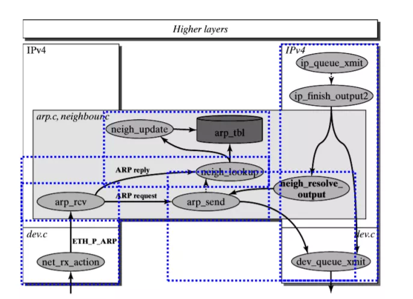

# ***\*Linux Kernel TCP/IP Stack|Linux网络硬核系列\****

 

 

大家好，我是Alex，今天给大家介绍Linux网络技术中最核心的部分--TCP/IP协议栈 。    

 

我们先看一下抽象的网络协议栈模型

 

***\*TCP/IP四层（参考）模型\****

 

 

再按分层思想看Linux内核协议栈实现框架

 

**自顶向下**

**Socket/ L4 TCP layer**

 

**1. socket layer**

**socket对象层次结构**

 

 

**socket框架**

· 

**socket系统调用（socket，bind，listen，accept，send，recv等）**

· 

· 

**BSD socket API**

· 

· 

**协议栈sock抽象适配层**

· 

· 

**tcp/udp/icmp/raw/packet/netlink/... socket管理**

· 

· 

**socket选项**

· 

 

**2. tcp/udp layer**

 

· 

**TCP报文收发**

· 

· 

**TCP Socket连接管理**

· 

· 

**TCP协议状态机，定时器处理**

· 

· 

**TCP滑动窗口，拥塞控制框架**

· 

**L3 IP layer**

 

**1. IP handle**

 

· 

**报文分片和重组**

· 

· 

**IP协议字段处理，IP选项，Qos，TTL，校验等处理**

· 

· 

**报文接收（解封装）和发送(IP协议封装，提供给上层接口）**

· 

· 

**组播，ICMP协议处理等**

· 

**2. netlfilter框架**

 

5个HOOK点：

PREROUTING：数据包进入路由表之前

INPUT：通过路由表后目的地为本机

FORWARD：通过路由表后，目的地不为本机

OUTPUT：由本机产生，向外发送

POSTROUTIONG：发送到网卡接口之前。

 

每个HOOK点都会执行一些函数，大致分为下面几个表：

NAT表: 用于实现nat功能，端口映射，地址映射等

mangle表: 用来修改报文，例如更改IP标头的TOS / DSCP / ECN位

filter表：用来过滤报文

raw表：用来提前标记报文不走一些流程（比如不需要建会话)

conntrack表：连接跟踪表，跟踪连接会话，用来实现状态防火墙，NAT功能的基础，可扩展更多功能。

 

**核心处理流程**

 

 

 

主要功能

· 

**无状态数据包过滤（IPv4和IPv6）**

· 

· 

**有状态的数据包过滤（IPv4和IPv6）**

· 

· 

**各种网络地址和端口转换，例如NAT / NAPT（IPv4和IPv6）**

· 

· 

**灵活可扩展的基础架构**

· 

· 

**第三方扩展的API**

· 

**3. 路由系统**

**协议栈处理位置**

 

**路由子系统架构**

 

 

· 

**FIB（The Forwarding Information Base ）**

· 

· 

**策略路由 Policies**

· 

· 

**路由匹配HASH，LC-tries等**

· 

主要功能

· 

**三层路由转发**

· 

**4. 邻居系统**

 

· 

**ARP协议(IPV4),NDP协议（IPV6)**

· 

· 

**邻居表新建，更新，老化机制，状态转化等**

· 

· 

**API接口**

· 

主要功能

· 

**获取mac地址**

· 

 

**L2 link layer(driver)**

 

**1. Link layer**

**Bridge**

 

· 

**FDB(mac forwarding database)管理**

· 

· 

**port，bridge对象管理和报文接收，转发**

· 

· 

**STP，vlan协议相关处理**

· 

主要功能

· 

**实现二层mac转发**

· 

**链路协议**

 

· 

**IEEE 802协议族（STP，VLAN，以太网，无线wifi，令牌环等）**

· 

 

**Packt Type**

· 

**Protocol handler**

· 

· 

**Packet_type list**

· 

主要功能

· 

**链路层报文协议分发**

· 

 

**Traffic control**

 

· 

**qdisc ：通过队列将数据包缓存起来，用来控制网络收发的速度**

· 

· 

**class ：用来表示控制策略**

· 

· 

**filter ：用来将数据包划分到具体的控制策略**

· 

主要功能

· 

**提供的流量限速、整形和策略控制机制（Qos）**

· 

 

**2. hardware driver layer**

 

· 

**网络设备管理**

· 

· 

**RPS,RFS,XPS,GRO,GSO,TSO等优化特性**

· 

· 

**网卡软中断收发，NAPI，DMA**

· 

· 

**支持各种网卡驱动实现**

· 

· 

**协议栈文件系统**

**Proc FileSystem**

· 

**/proc/net**

· 

· 

**/proc/sys/net**

· 

 **ipv4**

· 

​     **core**

**Sys FileSystem**

· 

**/sys/class/net/ethx**

· 

主要功能

· 

**提供协议栈相关配置查询和设置**

· 

 

**最后**

**整体架构图**

 

 

**如果想了解更多细节，请阅读Linux内核源码或者参考下面两本经典著作：**

**《The Linux Networking Architecture》**

**《Understanding Linux Network Internals》**

 