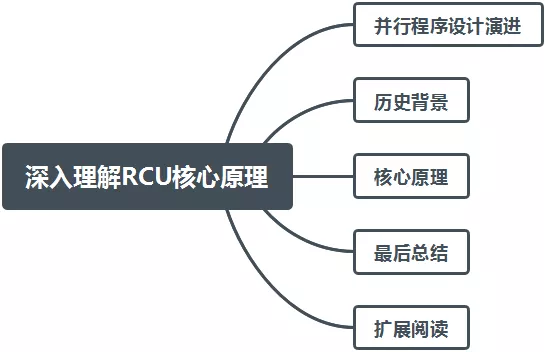
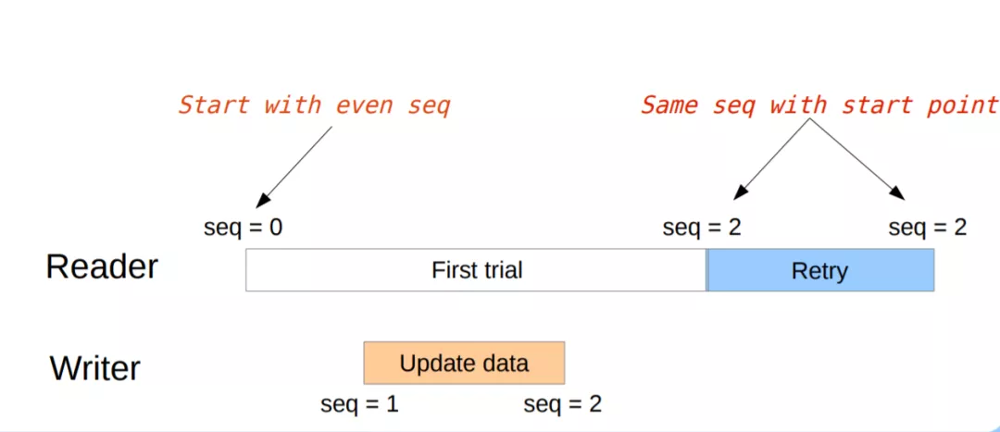
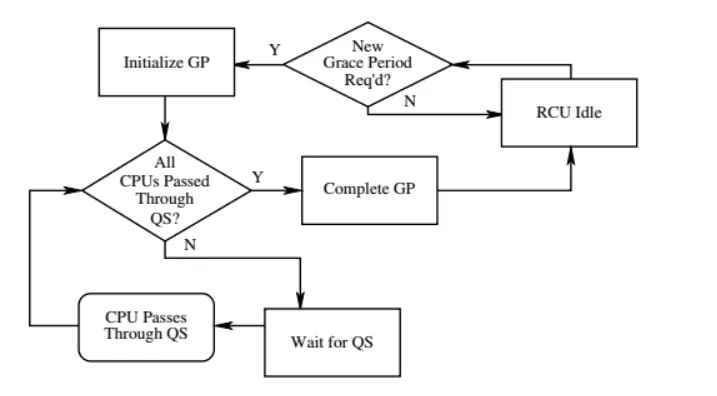
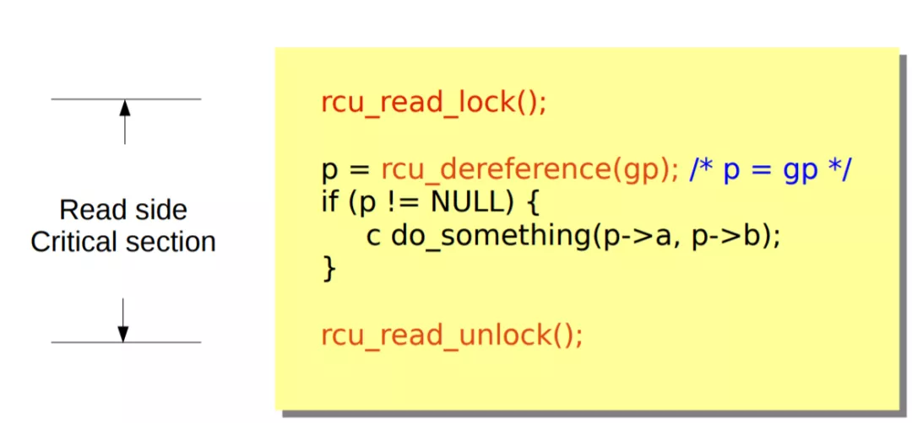
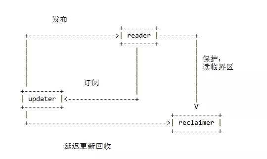
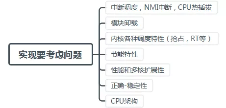
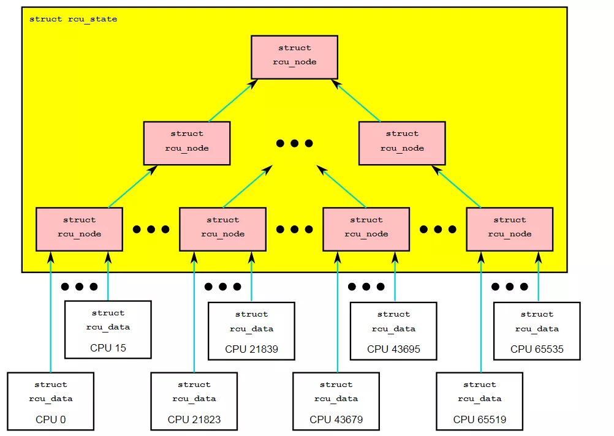

# ***\*深入理解RCU|核心原理\****

Original Alex码农的艺术 [极客重生](https://mp.weixin.qq.com/javascript:void(0);) 6/24

收录于话题

\#深入理解Linux系统22个内容

\#原创文章34个内容

\#核心突破系列13个内容

hi，大家好，今天给大家分享并行程序设计中最重要的锁-**RCU锁**，RCU锁本质是用空间换时间，是对读写锁的一种优化加强，但不仅仅是这样简单，RCU体现出来的**垃圾回收思想**，也是值得我们学习和借鉴，各个语言C, C++,Java, go等都有RCU锁实现，同时内核精巧的实现也是学习代码设计好素材，深入理解RCU分为两个部分，第一部分主要是讲**核心原理**，理解其核心设计思想，对RCU会有个宏观的理解；第二部分会分析**源码实现**（本来准备放在一起，由于实现相当精巧，篇幅会很多，就单独成一篇），希望大家喜欢。

 

 

 

### 并行程序设计演进

**如何正确有效的保护共享数据**是编写并行程序必须面临的一个难题，通常的手段就是同步。同步可分为**阻塞型同步**（Blocking Synchronization）和**非阻塞型同步**（ Non-blocking Synchronization）。

 

**阻塞型同步**是指当一个线程到达临界区时，因另外一个线程已经持有访问该共享数据的锁，从而不能获取锁资源而阻塞（睡眠），直到另外一个线程释放锁。常见的同步原语有 mutex、semaphore 等。如果同步方案采用不当，就会造成死锁（deadlock），活锁（livelock）和优先级反转（priority inversion），以及效率低下等现象。

 

为了降低风险程度和提高程序运行效率，业界提出了不采用锁的同步方案，依照这种设计思路设计的算法称为**非阻塞型同步**，其本质就是停止一个线程的执行不会阻碍系统中其他执行实体的运行。

 

## ***\*先有阻塞型同步\****

 

**互斥锁**（英語：Mutual exclusion，缩写**Mutex**）是一种用于多线程编程中，防止两条线程同时对同一公共资源进行读写的机制。该目的通过将代码切片成一个一个的临界区域（critical section）达成。临界区域指的是一块对公共资源进行存取的代码。

 

**信号量**(Semaphore)，是在多线程环境下使用的一种设施，是可以用来保证两个或多个关键代码段不被并发调用，可以认为mutex是0-1信号量；

 

**读写锁**是计算机程序的并发控制的一种同步机制，它把对共享资源的访问者划分成读者和**写**者，读者只对共享资源进行**读**访问，**写**者则需要对共享资源进行**写**操作，读操作可并发重入，写操作是互斥的。

## ***\*再有非阻塞型同步\****

当今比较流行的非阻塞型同步实现方案有三种：

\1. 

**Wait-free（****无等待****）**

\2. 

**Wait-free** 是指任意线程的任何操作都可以在有限步之内结束，而不用关心其它线程的执行速度。Wait-free 是基于 per-thread 的，可以认为是 starvation-free 的。非常遗憾的是实际情况并非如此，采用 Wait-free 的程序并不能保证 starvation-free，同时内存消耗也随线程数量而线性增长。目前只有极少数的非阻塞算法实现了这一点。

\3. 

**简单理解**：任意时刻所有的线程都在干活；

\4. 

\5. 

**Lock-free（无锁）**

\6. 

**Lock-Free**是指能够确保执行它的所有线程中至少有一个能够继续往下执行。由于每个线程不是 starvation-free 的，即有些线程可能会被任意地延迟，然而在每一步都至少有一个线程能够往下执行，因此系统作为一个整体是在持续执行的，可以认为是 system-wide 的。所有 Wait-free 的算法都是 Lock-Free 的。

\7. 

**简单理解：**任意时刻至少一个线程在干活；

\8. 

\9. 

**Obstruction-free（****无障碍****）**

\10. 

Obstruction-free 是指在任何时间点，一个孤立运行线程的每一个操作可以在有限步之内结束。只要没有竞争，线程就可以持续运行。一旦共享数据被修改，Obstruction-free 要求中止已经完成的部分操作，并进行回滚。所有 Lock-Free 的算法都是 Obstruction-free 的。

\11. 

**简单理解：**只要数据有修改，就会重新获取，并且把已经完成操作回滚重来；

\12. 

 

\13. 

综上所述，不难得出 Obstruction-free 是 Non-blocking synchronization 中性能最差的，而 Wait-free 性能是最好的，但实现难度也是最大的，因此 Lock-free 算法开始被重视，并广泛运用于各种程序设计中，这里主要介绍**Lock_free算法**。

 

**lock-free（无锁）**往往可以提供更好的性能和伸缩性保证，但实际上其优点不止于此。早期这些概念首先是在操作系统上应用的，因为一个不依赖于锁的算法，可以应用于各种场景下，而无需考虑各种错误，故障，失败等情形。比如死锁，中断，甚至CPU失效。

 

**主流无锁****技术**

 

**Atomic operation（原子操作），**在单一、不间断的步骤中读取和更改数据的操作。需要处理器指令支持原子操作：

● test-and-set (TSR)

● compare-and-swap (CAS)

● load-link/store-conditional (ll/sc)

 

 

**Spin Lock（自旋锁）**是一种轻量级的同步方法，一种非阻塞锁。当 lock 操作被阻塞时，并不是把自己挂到一个等待队列，而是死循环 CPU 空转等待其他线程释放锁。

 

 

 

**Seqlock (顺序锁)** 是Linux 2.6 内核中引入一种新型锁，它与 spin lock 读写锁非常相似，只是它为写者赋予了较高的优先级。也就是说，即使读者正在读的时候也允许写者继续运行，读者会检查数据是否有更新，如果数据有更新就会重试，因为 seqlock 对写者更有利，只要没有其他写者，写锁总能获取成功。

 

 

 

**RCU(Read-Copy Update)，**顾名思义就是读-拷贝修改，它是基于其原理命名的。对于被RCU保护的共享数据结构，读者不需要获得任何锁就可以访问它，但写者在访问它时首先拷贝一个副本，然后对副本进行修改，最后使用一个回调（callback）机制在适当的时机把指向原来数据的指针替换为新的被修改的数据。这个时机就是所有引用该数据的CPU都退出对共享数据的访问。

 

本文主要讲解**RCU的核心原理****。**

### 历史背景

**高性能并行程序**中，数据一致性访问是一个非常重要的部分，一般都是采用锁机制（semaphore、spinlock、rwlock等）进行保护共享数据，根本的思想就是在访问临界资源时，首先访问一个全局的变量（锁），通过全局变量的状态来控制线程对临界资源的访问。但是，这种思想是需要硬件支持的，硬件需要配合实现全局变量（锁）的读-修改-写，现代CPU都会提供这样的原子化指令。

 

采用锁机制实现数据访问的一致性存在如下两个问题：

· 

**效率问题**。锁机制的实现需要对内存的原子化访问，这种访问操作会破坏流水线操作，降低了流水线效率，这是影响性能的一个因素。另外，在采用读写锁机制的情况下，写锁是排他锁，无法实现写锁与读锁的并发操作，在某些应用下会降低性能。

· 

· 

**扩展性问题**。例如，当系统中CPU数量增多的时候，采用锁机制实现数据的同步访问效率偏低。并且随着CPU数量的增多，效率降低，由此可见锁机制实现的数据一致性访问扩展性差。

· 

 

· 

 

**原始的RCU思想**

 

在多线程场景下，经常我们需要并发访问一个数据结构，为了保证线程安全我们会考虑使用互斥设施来进行同步，更进一步我们会根据对这个数据结构的读写比例而选用读写锁进行优化。但是读写锁不是唯一的方式，我们可以借助于COW技术来做到写操作不需要加锁，也就是在读的时候正常读，写的时候，先加锁拷贝一份，然后进行写，写完就原子的更新回去，使用COW实现避免了频繁加读写锁本身的性能开销。

 

**优缺点**

由于 RCU 旨在最小化读取端开销，因此仅在以更高速率使用同步逻辑进行读取操作时才使用它。如果更新操作超过10%，性能反而会变差，所以应该选择另一种同步方式而不是RCU。

· 

好处

· 

§ 

几乎没有读取端开销。零等待，零开销

§ 

§ 

没有死锁问题

§ 

§ 

没有优先级倒置问题（优先级倒置和优先级继承）

§ 

§ 

无限制延迟没有问题

§ 

§ 

无内存泄漏风险问题

§ 

· 

缺点

· 

§ 

使用起来有点复杂

§ 

§ 

对于写操作，它比其他同步技术稍慢

§ 

· 

适用场景

· 

 

### 核心原理

**理论基础-QSBR算法**

**(Quiescent State-Based Reclamation)**

 

这个算法的核心思想就是识别出线程的不活动(quiescent)状态，那么什么时候才算是不活动的状态呢？这个状态和临界区状态是相对的，线程离开临界区就是不活动的状态了。识别出不活动状态了，还需要把状态通知出去，让其他线程知道，这整个过程可以用下面的图来描述:

 

 

 

上面有四个线程，线程1执行完更新操作后添加了释放内存的callback，此时线程2,3,4都读取的是之前的内容，等他们执行完成后分别回去调用onQuiescentState来表明自己已经不不活动了，等到最后一个线程调用onQuiescentState的时候就可以去调用注册的callback了。要实现上面这个过程其要点就是选择适合的位置执行onQuiescentState，还有就是如何知道谁是最后一个执行onQuiescentState的线程。

 

 

 

 

**批量回收**，如果更新的次数比较多的话，但是每次只回调一个callback，释放一次内存就会导致内存释放跟不上回收的速度，为此需要进行批量回收，每次更新都会注册新的callback，当第一次所有的线程都进入不活动状态的时候就把当前的所有callback保存起来，等待下一次所有线程进入不活动的状态的时候就回调前一次所有的callback。

 

 

**基本架构**

 

Linux 内核RCU 参考**QSBR算法**设计一套无锁同步机制。

 

 

 

 

· 

多个读者可以并发访问共享数据，而不需要加锁；

· 

· 

写者更新共享数据时候，需要先copy副本，在副本上修改，最终，读者只访问原始数据，因此他们可以安全地访问数据，多个写者之间是需要用锁互斥访问的（比如用自旋锁）；

· 

· 

修改资源后，需要更新共享资源，让后面读者可以访问最新的数据；

· 

· 

等旧资源上所有的读者都访问完毕后，就可以回收旧资源了；

· 

 

**RCU 模型**

 

 

· 

**Removal**：在写端临界区部分，读取（Read()），进行复制（Copy），并执行更改（Update）操作；

· 

 

· 

**Grace Period**：这是一个等待期，以确保所有与执行删除的数据相关的reader访问完毕；

· 

 

· 

· 

**Reclamation**：回收旧数据；

· 

 

 

**三个重要概念**

 

**静止状态QS(Quiescent State):** CPU发生了上下文切换称为经历一个quiescent state；

 

 

 

**宽限期GP(Grace Period):** grace period就是所有CPU都经历一次quiescent state所需要的等待的时间，也即系统中所有的读者完成对共享临界区的访问；

 

 

**GP原理**

 

**读侧临界部分RCS(Read-Side Critical Section):** 保护禁止其他CPU修改的代码区域，但允许多个CPU同时读；

 

 

 

**三个主要的角色**

 

**读者reader**：

· 

安全访问临界区资源；

· 

· 

负责标识进出临界区；

· 

**写者updater**：

· 

复制一份数据，然后更新数据；

· 

· 

用新数据覆盖旧数据，然后进入grace period；

· 

**回收者reclaimer**：

· 

等待在grace period之前的读者退出临界区；

· 

· 

在宽限期结束后，负责回收旧资源；

· 

 

**三个重要机制**

 

**发布/订阅机制**

· 

主要用于更新数据，即使在数据被同时修改时线程也能安全浏览数据。RCU通过发布-订阅机制（Publish-Subscribe Mechanism）实现这种并发的插入操作能力；

· 

 

· 

**延迟回收机制**：

· 

实现检查旧数据上所有RCU读者完成，用于安全删除旧数据；

· 

 

**多版本机制**：

· 

维护最近更新对象的多个版本，用于允许读者容忍并发的插入和删除新对象的多个版本；

· 

 

 

 

###  

### 最后总结

最后，总结一下**RCU锁的核心思想**：

· 

读者无锁访问数据，标记进出临界区；

· 

· 

写者读取，复制，更新；

· 

· 

旧数据延迟回收；

· 

 

· 

RCU核心思想就三句话，产品经理都说简单，但Linux内核实现却不是这么简单。除了要实现基本功能，需要考虑很多复杂情况：

 

 

###  

### ***\*内核的\******RCU系统*****\*可以说是\******内核最复杂系统*****\*之一，为了高性能和多核扩展性，设计了非常精巧的数据结构：\****

 

 

 

 

同时巧妙实现了很多核心流程：

· 

检查当前CPU是否度过QS；

· 

· 

QS report(汇报宽限期度过)；

· 

· 

宽限期的发起与完成；

· 

· 

rcu callbacks处理；

· 

 

其中很多实现都可以说是非常精巧，结合了预处理，批量处理，延后（异步）处理，多核并发，原子操作，异常处理，多场景精细优化等多种技术，性能好，可扩展性强，稳定性强，有一定的学习和参考价值，即使你的工作不是内核编程，里面体现很多编程思想和代码设计思想，也是值得大家学习的。

 

预知后事如何，且听下回分解，下次会带大家领悟RCU源码实现的美妙。

### 扩展阅读

http://csng.cs.toronto.edu/publication_files/0000/0159/jpdc07.pdf

http://www.rdrop.com/users/paulmck/rclock/RCUdissertation.2004.07.14e1.pdf

https://lwn.net/Articles/262464/

http://www.wowotech.net/kernel_synchronization/461.html

http://concurrencyfreaks.blogspot.com/2013/05/lock-free-and-wait-free-definition-and.html

 

\- END -

 