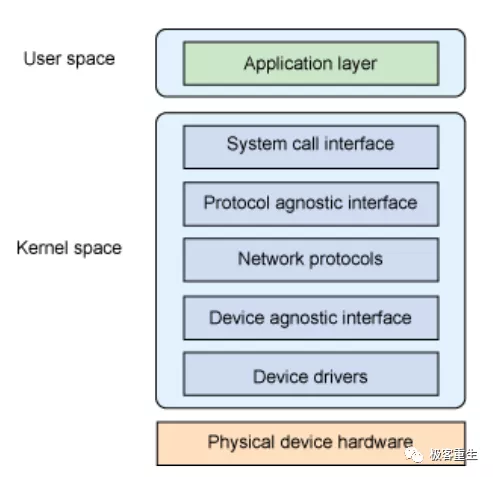
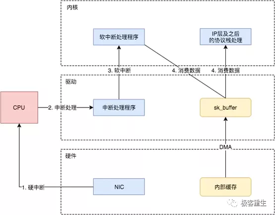
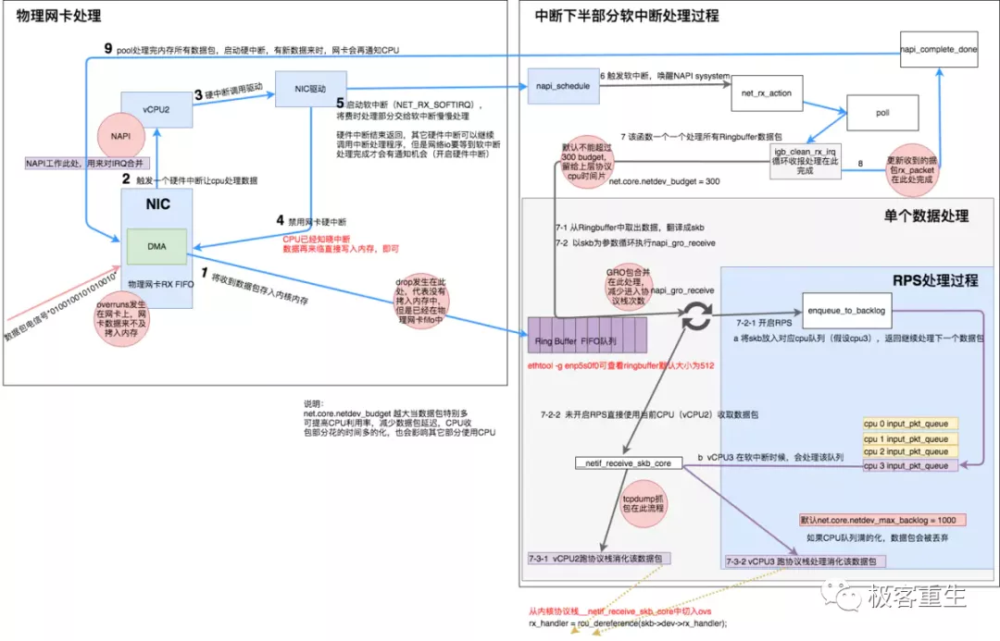

# ***\*Linux网络子系统\****

xholic [极客重生](https://mp.weixin.qq.com/javascript:void(0);) 8/25

 

#  

# ***\*今天分享一篇经典Linux协议栈文章，主要讲解Linux网络子系统，看完相信大家对协议栈又会加深不少，不光可以了解协议栈处理流程，方便定位问题，还可以学习一下怎么去设计一个可扩展的子系统，屏蔽不同层次的差异。\****

# ***\*目录\****

1.Linux网络子系统的分层

2.TCP/IP分层模型

3.Linux 网络协议栈

4.Linux 网卡收包时的中断处理问题

5.Linux 网络启动的准备工作

6.Linux网络包：中断到网络层接收

7.总结

# ***\*Linux网络子系统的分层\****

Linux网络子系统实现需要：

· 

支持不同的协议族 ( INET, INET6, UNIX, NETLINK...)

· 

· 

支持不同的网络设备

· 

· 

支持统一的BSD socket API

· 

· 

需要屏蔽协议、硬件、平台(API)的差异，因而采用分层结构：

· 

 

 

系统调用提供用户的应用程序访问内核的唯一途径。协议无关接口由socket layer来实现的，其提供一组通用功能，以支持各种不同的协议。网络协议层为socket层提供具体协议接口——proto{}，实现具体的协议细节。设备无关接口，提供一组通用函数供底层网络设备驱动程序使用。设备驱动与特定网卡设备相关，定义了具体的协议细节，会分配一个net_device结构，然后用其必需的例程进行初始化。

 

# ***\*TCP/IP分层模型\****

在TCP/IP网络分层模型里，整个协议栈被分成了物理层、链路层、网络层，传输层和应用层。物理层对应的是网卡和网线，应用层对应的是我们常见的Nginx，FTP等等各种应用。Linux实现的是链路层、网络层和传输层这三层。

 

在Linux内核实现中，链路层协议靠网卡驱动来实现，内核协议栈来实现网络层和传输层。内核对更上层的应用层提供socket接口来供用户进程访问。我们用Linux的视角来看到的TCP/IP网络分层模型应该是下面这个样子的。

 

 

 

 

首先我们梳理一下每层模型的职责：

**链路层**：对0和1进行分组，定义数据帧，确认主机的物理地址，传输数据;

**网络层**：定义IP地址，确认主机所在的网络位置，并通过IP进行MAC寻址，对外网数据包进行路由转发;

**传输层**：定义端口，确认主机上应用程序的身份，并将数据包交给对应的应用程序;

**应用层**：定义数据格式，并按照对应的格式解读数据。

 

然后再把每层模型的职责串联起来，用一句通俗易懂的话讲就是：

当你输入一个网址并按下回车键的时候，首先，应用层协议对该请求包做了格式定义;紧接着传输层协议加上了双方的端口号，确认了双方通信的应用程序;然后网络协议加上了双方的IP地址，确认了双方的网络位置;最后链路层协议加上了双方的MAC地址，确认了双方的物理位置，同时将数据进行分组，形成数据帧，采用广播方式，通过传输介质发送给对方主机。而对于不同网段，该数据包首先会转发给网关路由器，经过多次转发后，最终被发送到目标主机。目标机接收到数据包后，采用对应的协议，对帧数据进行组装，然后再通过一层一层的协议进行解析，最终被应用层的协议解析并交给服务器处理。

# ***\*Linux 网络协议栈\****

 

 

基于TCP/IP协议栈的send/recv在应用层，传输层，网络层和链路层中具体函数调用过程已经有很多人研究，本文引用一张比较完善的图如下：

 

 

 

以上说明基本大致说明了TCP/IP中TCP，UDP协议包在网络子系统中的实现流程。本文主要在链路层中，即关于网卡收报触发中断到进入网络层之间的过程探究。

 

# ***\*Linux 网卡收包时的中断处理问题\****

中断，一般指硬件中断，多由系统自身或与之链接的外设（如键盘、鼠标、网卡等）产生。中断首先是处理器提供的一种响应外设请求的机制，是处理器硬件支持的特性。一个外设通过产生一种电信号通知中断控制器，中断控制器再向处理器发送相应的信号。处理器检测到了这个信号后就会打断自己当前正在做的工作，转而去处理这次中断（所以才叫中断）。当然在转去处理中断和中断返回时都有保护现场和返回现场的操作，这里不赘述。

 

那软中断又是什么呢？我们知道在中断处理时CPU没法处理其它事物，对于网卡来说，如果每次网卡收包时中断的时间都过长，那很可能造成丢包的可能性。当然我们不能完全避免丢包的可能性，以太包的传输是没有100%保证的，所以网络才有协议栈，通过高层的协议来保证连续数据传输的数据完整性（比如在协议发现丢包时要求重传）。但是即使有协议保证，那我们也不能肆无忌惮的使用中断，中断的时间越短越好，尽快放开处理器，让它可以去响应下次中断甚至进行调度工作。基于这样的考虑，我们将中断分成了上下两部分，上半部分就是上面说的中断部分，需要快速及时响应，同时需要越快结束越好。而下半部分就是完成一些可以推后执行的工作。对于网卡收包来说，网卡收到数据包，通知内核数据包到了，中断处理将数据包存入内存这些都是急切需要完成的工作，放到上半部完成。而解析处理数据包的工作则可以放到下半部去执行。

 

软中断就是下半部使用的一种机制，它通过软件模仿硬件中断的处理过程，但是和硬件没有关系，单纯的通过软件达到一种异步处理的方式。其它下半部的处理机制还包括tasklet，工作队列等。依据所处理的场合不同，选择不同的机制，网卡收包一般使用软中断。对应NET_RX_SOFTIRQ这个软中断，软中断的类型如下：

 

· 

· 

· 

· 

· 

· 

· 

· 

· 

· 

· 

· 

· 

· 

enum{     HI_SOFTIRQ=0,     TIMER_SOFTIRQ,     NET_TX_SOFTIRQ,     NET_RX_SOFTIRQ,     BLOCK_SOFTIRQ,     IRQ_POLL_SOFTIRQ,     TASKLET_SOFTIRQ,     SCHED_SOFTIRQ,     HRTIMER_SOFTIRQ,     RCU_SOFTIRQ,   /* Preferable RCU should always be the last softirq */     NR_SOFTIRQS};

 

通过以上可以了解到，Linux中断注册显然应该包括网卡的硬中断，包处理的软中断两个步骤。

 

**注册网卡中断**

我们以一个具体的网卡驱动为例，比如e1000。其模块初始化函数就是：

 

· 

· 

· 

· 

· 

· 

· 

· 

· 

· 

static int __init e1000_init_module(void){     int ret;     pr_info("%s - version %s\n", e1000_driver_string, e1000_driver_version);     pr_info("%s\n", e1000_copyright);     ret = pci_register_driver(&e1000_driver);...     return ret;
}

其中e1000_driver这个结构体是一个关键，这个结构体中很主要的一个方法就是.probe方法，也就是e1000_probe()：

 

· 

· 

· 

· 

· 

· 

· 

· 

· 

· 

· 

· 

· 

· 

· 

· 

· 

· 

· 

· 

· 

/**                          
 \* e1000_probe - Device Initialization Routine      * @pdev: PCI device information struct           * @ent: entry in e1000_pci_tbl    *                 * Returns 0 on success, negative on failure                                         *                                                         * e1000_probe initializes an adapter identified by a pci_dev structure.                                 * The OS initialization, configuring of the adapter private structure,                                  * and a hardware reset occur.                            **/static int e1000_probe(struct pci_dev *pdev, const struct pci_device_id *ent){......     netdev->netdev_ops = &e1000_netdev_ops;     e1000_set_ethtool_ops(netdev);......}

 

 

这个函数很长，我们不都列出来，这是e1000主要的初始化函数，即使从注释都能看出来。我们留意其注册了netdev的netdev_ops，用的是e1000_netdev_ops这个结构体：

 

· 

· 

· 

· 

· 

· 

· 

· 

· 

· 

static const struct net_device_ops e1000_netdev_ops = {     .ndo_open        = e1000_open,     .ndo_stop        = e1000_close,     .ndo_start_xmit     = e1000_xmit_frame,     .ndo_set_rx_mode     = e1000_set_rx_mode,     .ndo_set_mac_address   = e1000_set_mac,     .ndo_tx_timeout     = e1000_tx_timeout,......};

这个e1000的方法集里有一个重要的方法，e1000_open，我们要说的中断的注册就从这里开始：

 

· 

· 

· 

· 

· 

· 

· 

· 

· 

· 

· 

· 

· 

· 

· 

· 

· 

· 

· 

· 

· 

/**       * e1000_open - Called when a network interface is made active  * @netdev: network interface device structure       *                          * Returns 0 on success, negative value on failure    *    * The open entry point is called when a network interface is made                                                   * active by the system (IFF_UP).  At this point all resources needed                                       * for transmit and receive operations are allocated, the interrupt                            * handler is registered with the OS, the watchdog task is started,                                                    * and the stack is notified that the interface is ready.                                                        **/int e1000_open(struct net_device *netdev){     struct e1000_adapter *adapter = netdev_priv(netdev);     struct e1000_hw *hw = &adapter->hw;......     err = e1000_request_irq(adapter);...}

 

e1000在这里注册了中断：

· 

· 

· 

· 

· 

· 

· 

· 

· 

· 

· 

static int e1000_request_irq(struct e1000_adapter *adapter){     struct net_device *netdev = adapter->netdev;     irq_handler_t handler = e1000_intr;     int irq_flags = IRQF_SHARED;     int err;     err = request_irq(adapter->pdev->irq, handler, irq_flags, netdev->name,......} 

 

如上所示，这个被注册的中断处理函数，也就是handler，就是e1000_intr()。我们不展开这个中断处理函数看了，我们知道中断处理函数在这里被注册了，在网络包来的时候会触发这个中断函数。

 

**注册软中断**

内核初始化期间，softirq_init会注册TASKLET_SOFTIRQ以及HI_SOFTIRQ相关联的处理函数。

· 

· 

· 

· 

· 

· 

· 

void __init softirq_init(void){   ......   open_softirq(TASKLET_SOFTIRQ, tasklet_action);   open_softirq(HI_SOFTIRQ, tasklet_hi_action);
}

 

网络子系统分两种soft IRQ。NET_TX_SOFTIRQ和NET_RX_SOFTIRQ，分别处理发送数据包和接收数据包。这两个soft IQ在net_dev_init函数（net/core/dev.c）中注册：

· 

· 

  open_softirq(NET_TX_SOFTIRQ, net_tx_action);  open_softirq(NET_RX_SOFTIRQ, net_rx_action);

收发数据包的软中断处理函数被注册为net_rx_action和net_tx_action。其中open_softirq实现为：

· 

· 

· 

· 

· 

void open_softirq(int nr, void (*action)(struct softirq_action *)){   softirq_vec[nr].action = action;
}

 

 

 

 

 

 

 

· 

**从硬中断到软中断**

· 

 

 

 

### ***\*Linux 网络启动的准备工作\****

首先在开始收包之前，Linux要做许多的准备工作：

\1. 创建ksoftirqd线程，为它设置好它自己的线程函数，后面就指望着它来处理软中断呢。

\2. 协议栈注册，linux要实现许多协议，比如arp，icmp，ip，udp，tcp，每一个协议都会将自己的处理函数注册一下，方便包来了迅速找到对应的处理函数

\3. 网卡驱动初始化，每个驱动都有一个初始化函数，内核会让驱动也初始化一下。在这个初始化过程中，把自己的DMA准备好，把NAPI的poll函数地址告诉内核

\4. 启动网卡，分配RX，TX队列，注册中断对应的处理函数

 

**创建ksoftirqd内核线程**

Linux的软中断都是在专门的内核线程（ksoftirqd）中进行的，因此我们非常有必要看一下这些进程是怎么初始化的，这样我们才能在后面更准确地了解收包过程。该进程数量不是1个，而是N个，其中N等于你的机器的核数。

系统初始化的时候在kernel/smpboot.c中调用了smpboot_register_percpu_thread， 该函数进一步会执行到spawn_ksoftirqd（位于kernel/softirq.c）来创建出softirqd进程。

 

 

相关代码如下：

· 

· 

· 

· 

· 

· 

· 

//file: kernel/softirq.cstatic struct smp_hotplug_thread softirq_threads = {   .store      = &ksoftirqd,   .thread_should_run  = ksoftirqd_should_run,   .thread_fn    = run_ksoftirqd,   .thread_comm     = "ksoftirqd/%u",};

 

 

 

 

当ksoftirqd被创建出来以后，它就会进入自己的线程循环函数ksoftirqd_should_run和run_ksoftirqd了。不停地判断有没有软中断需要被处理。这里需要注意的一点是，软中断不仅仅只有网络软中断，还有其它类型。

 

**创建ksoftirqd内核线程**

 

 

linux内核通过调用subsys_initcall来初始化各个子系统，在源代码目录里你可以grep出许多对这个函数的调用。这里我们要说的是网络子系统的初始化，会执行到net_dev_init函数。

 

 

 

 

在这个函数里，会为每个CPU都申请一个softnet_data数据结构，在这个数据结构里的poll_list是等待驱动程序将其poll函数注册进来，稍后网卡驱动初始化的时候我们可以看到这一过程。

另外open_softirq注册了每一种软中断都注册一个处理函数。NET_TX_SOFTIRQ的处理函数为net_tx_action，NET_RX_SOFTIRQ的为net_rx_action。继续跟踪open_softirq后发现这个注册的方式是记录在softirq_vec变量里的。后面ksoftirqd线程收到软中断的时候，也会使用这个变量来找到每一种软中断对应的处理函数。

 

**协议栈注册**

内核实现了网络层的ip协议，也实现了传输层的tcp协议和udp协议。这些协议对应的实现函数分别是ip_rcv(),tcp_v4_rcv()和udp_rcv()。和我们平时写代码的方式不一样的是，内核是通过注册的方式来实现的。Linux内核中的fs_initcall和subsys_initcall类似，也是初始化模块的入口。fs_initcall调用inet_init后开始网络协议栈注册。通过inet_init，将这些函数注册到了inet_protos和ptype_base数据结构中

相关代码如下

 

· 

· 

· 

· 

· 

· 

· 

· 

· 

· 

· 

· 

· 

· 

· 

· 

· 

· 

· 

· 

· 

**//file: net/ipv4/af_inet.c**
static struct packet_type ip_packet_type __read_mostly = {   .type = cpu_to_be16(ETH_P_IP),   .func = ip_rcv,};
static const struct net_protocol udp_protocol = {   .handler =  udp_rcv,   .err_handler =  udp_err,   .no_policy =   1,   .netns_ok = 1,};
static const struct net_protocol tcp_protocol = {   .early_demux   =  tcp_v4_early_demux,   .handler   =  tcp_v4_rcv,   .err_handler   =  tcp_v4_err,   .no_policy  =  1,   .netns_ok  =  1,};

 

 

 

 

 

扩展一下，如果看一下ip_rcv和udp_rcv等函数的代码能看到很多协议的处理过程。例如，ip_rcv中会处理netfilter和iptable过滤，如果你有很多或者很复杂的 netfilter 或 iptables 规则，这些规则都是在软中断的上下文中执行的，会加大网络延迟。再例如，udp_rcv中会判断socket接收队列是否满了。对应的相关内核参数是net.core.rmem_max和net.core.rmem_default。如果有兴趣，建议大家好好读一下inet_init这个函数的代码。

 

**网卡驱动初始化**

每一个驱动程序（不仅仅只是网卡驱动）会使用 module_init 向内核注册一个初始化函数，当驱动被加载时，内核会调用这个函数。比如igb网卡驱动的代码位于drivers/net/ethernet/intel/igb/igb_main.c

 

驱动的pci_register_driver调用完成后，Linux内核就知道了该驱动的相关信息，比如igb网卡驱动的igb_driver_name和igb_probe函数地址等等。当网卡设备被识别以后，内核会调用其驱动的probe方法（igb_driver的probe方法是igb_probe）。驱动probe方法执行的目的就是让设备ready，对于igb网卡，其igb_probe位于drivers/net/ethernet/intel/igb/igb_main.c下。主要执行的操作如下：

 

 

第5步中我们看到，网卡驱动实现了ethtool所需要的接口，也在这里注册完成函数地址的注册。当 ethtool 发起一个系统调用之后，内核会找到对应操作的回调函数。对于igb网卡来说，其实现函数都在drivers/net/ethernet/intel/igb/igb_ethtool.c下。相信你这次能彻底理解ethtool的工作原理了吧？这个命令之所以能查看网卡收发包统计、能修改网卡自适应模式、能调整RX 队列的数量和大小，是因为ethtool命令最终调用到了网卡驱动的相应方法，而不是ethtool本身有这个超能力。

第6步注册的igb_netdev_ops中包含的是igb_open等函数，该函数在网卡被启动的时候会被调用。

 

· 

· 

· 

· 

· 

· 

· 

· 

· 

· 

· 

· 

//file: drivers/net/ethernet/intel/igb/igb_main.......static const struct net_device_ops igb_netdev_ops = {  .ndo_open        = igb_open,  .ndo_stop        = igb_close,  .ndo_start_xmit     = igb_xmit_frame,  .ndo_get_stats64     = igb_get_stats64,  .ndo_set_rx_mode     = igb_set_rx_mode,  .ndo_set_mac_address   = igb_set_mac,  .ndo_change_mtu     = igb_change_mtu,  .ndo_do_ioctl      = igb_ioctl,......}

第7步中，在igb_probe初始化过程中，还调用到了igb_alloc_q_vector。他注册了一个NAPI机制所必须的poll函数，对于igb网卡驱动来说，这个函数就是igb_poll,如下代码所示。

 

· 

· 

· 

· 

· 

· 

· 

· 

· 

· 

· 

static int igb_alloc_q_vector(struct igb_adapter *adapter,          int v_count, int v_idx,          int txr_count, int txr_idx,          int rxr_count, int rxr_idx){   ......   /* initialize NAPI */   netif_napi_add(adapter->netdev, &q_vector->napi,        igb_poll, 64);
}

 

 

**启动网卡**

当上面的初始化都完成以后，就可以启动网卡了。回忆前面网卡驱动初始化时，我们提到了驱动向内核注册了 structure net_device_ops 变量，它包含着网卡启用、发包、设置mac 地址等回调函数（函数指针）。当启用一个网卡时（例如，通过 ifconfig eth0 up），net_device_ops 中的 igb_open方法会被调用。它通常会做以下事情：

 

 

· 

· 

· 

· 

· 

· 

· 

· 

· 

· 

· 

· 

· 

· 

· 

· 

//file: drivers/net/ethernet/intel/igb/igb_main.cstatic int __igb_open(struct net_device *netdev, bool resuming){   /* allocate transmit descriptors */   err = igb_setup_all_tx_resources(adapter);   /* allocate receive descriptors */   err = igb_setup_all_rx_resources(adapter);   /* 注册中断处理函数 */   err = igb_request_irq(adapter);   if (err)     goto err_req_irq;   /* 启用NAPI */   for (i = 0; i < adapter->num_q_vectors; i++)     napi_enable(&(adapter->q_vector[i]->napi));   ......}

 

在上面__igb_open函数调用了igb_setup_all_tx_resources,和igb_setup_all_rx_resources。在igb_setup_all_rx_resources这一步操作中，分配了RingBuffer，并建立内存和Rx队列的映射关系。（Rx Tx 队列的数量和大小可以通过 ethtool 进行配置）。我们再接着看中断函数注册igb_request_irq:

 

· 

· 

· 

· 

· 

· 

· 

· 

· 

· 

· 

· 

· 

· 

· 

· 

· 

· 

· 

static int igb_request_irq(struct igb_adapter *adapter){   if (adapter->msix_entries) {     err = igb_request_msix(adapter);     if (!err)       goto request_done;     ......   }}
static int igb_request_msix(struct igb_adapter *adapter){   ......   for (i = 0; i < adapter->num_q_vectors; i++) {     ...     err = request_irq(adapter->msix_entries[vector].vector,          igb_msix_ring, 0, q_vector->name,   } 

 

在上面的代码中跟踪函数调用， __igb_open => igb_request_irq => igb_request_msix, 在igb_request_msix中我们看到了，对于多队列的网卡，为每一个队列都注册了中断，其对应的中断处理函数是igb_msix_ring（该函数也在drivers/net/ethernet/intel/igb/igb_main.c下）。我们也可以看到，msix方式下，每个 RX 队列有独立的MSI-X 中断，从网卡硬件中断的层面就可以设置让收到的包被不同的 CPU处理。（可以通过 irqbalance ，或者修改 /proc/irq/IRQ_NUMBER/smp_affinity能够修改和CPU的绑定行为）。

 

到此准备工作完成。

 

### **Linux网络包：中断到网络层接收**

网卡收包从整体上是网线中的高低电平转换到网卡FIFO存储再拷贝到系统主内存（DDR3）的过程，其中涉及到网卡控制器，CPU，DMA，驱动程序，在OSI模型中属于物理层和链路层，如下图所示。

 

###  

### **中断处理**

 

 

 

 

物理网卡收到数据包的处理流程如上图左半部分所示，详细步骤如下：

\1. 网卡收到数据包，先将高低电平转换到网卡fifo存储，网卡申请ring buffer的描述，根据描述找到具体的物理地址，从fifo队列物理网卡会使用DMA将数据包写到了该物理地址,，其实就是skb_buffer中.

\2. 这个时候数据包已经被转移到skb_buffer中，因为是DMA写入，内核并没有监控数据包写入情况，这时候NIC触发一个硬中断，每一个硬件中断会对应一个中断号，且指定一个vCPU来处理，如上图vcpu2收到了该硬件中断.

\3. 硬件中断的中断处理程序，调用驱动程序完成，a.启动软中断

\4. 硬中断触发的驱动程序会禁用网卡硬中断，其实这时候意思是告诉NIC，再来数据不用触发硬中断了，把数据DMA拷入系统内存即可

\5. 硬中断触发的驱动程序会启动软中断，启用软中断目的是将数据包后续处理流程交给软中断慢慢处理，这个时候退出硬件中断了，但是注意和网络有关的硬中断，要等到后续开启硬中断后，才有机会再次被触发

\6. NAPI触发软中断，触发napi系统

\7. 消耗ringbuffer指向的skb_buffer

\8. NAPI循环处理ringbuffer数据，处理完成

\9. 启动网络硬件中断，有数据来时候就可以继续触发硬件中断，继续通知CPU来消耗数据包.

 

其实上述过程过程简单描述为：网卡收到数据包，DMA到内核内存，中断通知内核数据有了，内核按轮次处理消耗数据包，一轮处理完成后，开启硬中断。其核心就是网卡和内核其实是生产和消费模型，网卡生产，内核负责消费，生产者需要通知消费者消费；如果生产过快会产生丢包，如果消费过慢也会产生问题。也就说在高流量压力情况下，只有生产消费优化后，消费能力够快，此生产消费关系才可以正常维持，所以如果物理接口有丢包计数时候，未必是网卡存在问题，也可能是内核消费的太慢。

 

关于CPU与ksoftirqd的关系可以描述如下：

 

 

 

**网卡收到的数据写入到内核内存**

NIC在接收到数据包之后，首先需要将数据同步到内核中，这中间的桥梁是rx ring buffer。它是由NIC和驱动程序共享的一片区域，事实上，rx ring buffer存储的并不是实际的packet数据，而是一个描述符，这个描述符指向了它真正的存储地址，具体流程如下：

\1. 驱动在内存中分配一片缓冲区用来接收数据包，叫做sk_buffer;

\2. 将上述缓冲区的地址和大小（即接收描述符），加入到rx ring buffer。描述符中的缓冲区地址是DMA使用的物理地址;

\3. 驱动通知网卡有一个新的描述符;

\4. 网卡从rx ring buffer中取出描述符，从而获知缓冲区的地址和大小;

\5. 网卡收到新的数据包;

\6. 网卡将新数据包通过DMA直接写到sk_buffer中。

 

 

 

当驱动处理速度跟不上网卡收包速度时，驱动来不及分配缓冲区，NIC接收到的数据包无法及时写到sk_buffer，就会产生堆积，当NIC内部缓冲区写满后，就会丢弃部分数据，引起丢包。这部分丢包为rx_fifo_errors，在 /proc/net/dev中体现为fifo字段增长，在ifconfig中体现为overruns指标增长。

 

**中断下半部分**

ksoftirqd内核线程处理软中断，即中断下半部分软中断处理过程：

1.NAPI（以e1000网卡为例）：net_rx_action() -> e1000_clean() -> e1000_clean_rx_irq() -> e1000_receive_skb() -> netif_receive_skb()

2.非NAPI（以dm9000网卡为例）：net_rx_action() -> process_backlog() -> netif_receive_skb()

最后网卡驱动通过netif_receive_skb()将sk_buff上送协议栈。

 

内核线程初始化的时候，我们介绍了ksoftirqd中两个线程函数ksoftirqd_should_run和run_ksoftirqd。其中ksoftirqd_should_run代码如下：

 

 

\#define local_softirq_pending() \

__IRQ_STAT(smp_processor_id(), __softirq_pending)

 

这里看到和硬中断中调用了同一个函数local_softirq_pending。使用方式不同的是硬中断位置是为了写入标记，这里仅仅只是读取。如果硬中断中设置了NET_RX_SOFTIRQ,这里自然能读取的到。接下来会真正进入线程函数中run_ksoftirqd处理：

 

· 

· 

· 

· 

· 

· 

· 

· 

· 

· 

· 

· 

static void run_ksoftirqd(unsigned int cpu){   local_irq_disable();   if (local_softirq_pending()) {     __do_softirq();     rcu_note_context_switch(cpu);     local_irq_enable();     cond_resched();     return;   }   local_irq_enable();}

 

 

在__do_softirq中，判断根据当前CPU的软中断类型，调用其注册的action方法。

asmlinkage void __do_softirq(void)

 

在网络子系统初始化小节，我们看到我们为NET_RX_SOFTIRQ注册了处理函数net_rx_action。所以net_rx_action函数就会被执行到了。

这里需要注意一个细节，硬中断中设置软中断标记，和ksoftirq的判断是否有软中断到达，都是基于smp_processor_id()的。这意味着只要硬中断在哪个CPU上被响应，那么软中断也是在这个CPU上处理的。所以说，如果你发现你的Linux软中断CPU消耗都集中在一个核上的话，做法是要把调整硬中断的CPU亲和性，来将硬中断打散到不通的CPU核上去。

我们再来把精力集中到这个核心函数net_rx_action上来。

 

· 

· 

· 

· 

· 

· 

· 

· 

· 

· 

· 

· 

· 

· 

· 

· 

· 

· 

static void net_rx_action(struct softirq_action *h){   struct softnet_data *sd = &__get_cpu_var(softnet_data);   unsigned long time_limit = jiffies + 2;   int budget = netdev_budget;   void *have;   local_irq_disable();   while (!list_empty(&sd->poll_list)) {     ......     n = list_first_entry(&sd->poll_list, struct napi_struct, poll_list);     work = 0;     if (test_bit(NAPI_STATE_SCHED, &n->state)) {       work = n->poll(n, weight);       trace_napi_poll(n);     }     budget -= work;   }}

函数开头的time_limit和budget是用来控制net_rx_action函数主动退出的，目的是保证网络包的接收不霸占CPU不放。等下次网卡再有硬中断过来的时候再处理剩下的接收数据包。其中budget可以通过内核参数调整。这个函数中剩下的核心逻辑是获取到当前CPU变量softnet_data，对其poll_list进行遍历, 然后执行到网卡驱动注册到的poll函数。对于igb网卡来说，就是igb驱动力的igb_poll函数了。

· 

· 

· 

· 

· 

· 

· 

· 

· 

· 

· 

· 

· 

· 

**/** \*  igb_poll - NAPI Rx polling callback \*  @napi: napi polling structure \*  @budget: count of how many packets we should handle **/**static int igb_poll(struct napi_struct *napi, int budget){   ...if (q_vector->tx.ring)     clean_complete = igb_clean_tx_irq(q_vector);if (q_vector->rx.ring)     clean_complete &= igb_clean_rx_irq(q_vector, budget);   ...}

 

在读取操作中，igb_poll的重点工作是对igb_clean_rx_irq的调用。

 

· 

· 

· 

· 

· 

· 

· 

· 

· 

· 

· 

· 

· 

· 

· 

· 

· 

· 

· 

static bool igb_clean_rx_irq(struct igb_q_vector *q_vector, const int budget){   ...do {**/\* retrieve a buffer from the ring \*/**    skb = igb_fetch_rx_buffer(rx_ring, rx_desc, skb);**/\* fetch next buffer in frame if non-eop \*/**if (igb_is_non_eop(rx_ring, rx_desc))continue;     }**/\* verify the packet layout is correct \*/**if (igb_cleanup_headers(rx_ring, rx_desc, skb)) {       skb = NULL;continue;     }**/\* populate checksum, timestamp, VLAN, and protocol \*/**    igb_process_skb_fields(rx_ring, rx_desc, skb);     napi_gro_receive(&q_vector->napi, skb);}

 

igb_fetch_rx_buffer和igb_is_non_eop的作用就是把数据帧从RingBuffer上取下来。为什么需要两个函数呢？因为有可能帧要占多多个RingBuffer，所以是在一个循环中获取的，直到帧尾部。获取下来的一个数据帧用一个sk_buff来表示。收取完数据以后，对其进行一些校验，然后开始设置sbk变量的timestamp, VLAN id, protocol等字段。接下来进入到napi_gro_receive中:

 

· 

· 

· 

· 

· 

· 

**//file: net/core/dev.c**gro_result_t napi_gro_receive(struct napi_struct *napi, struct sk_buff *skb){   skb_gro_reset_offset(skb);return napi_skb_finish(dev_gro_receive(napi, skb), skb);}

 

dev_gro_receive这个函数代表的是网卡GRO特性，可以简单理解成把相关的小包合并成一个大包就行，目的是减少传送给网络栈的包数，这有助于减少 CPU 的使用量。我们暂且忽略，直接看napi_skb_finish, 这个函数主要就是调用了netif_receive_skb。

 

· 

· 

· 

· 

· 

· 

· 

· 

· 

· 

**//file: net/core/dev.c**static gro_result_t napi_skb_finish(gro_result_t ret, struct sk_buff *skb){switch (ret) {case GRO_NORMAL:if (netif_receive_skb(skb))       ret = GRO_DROP;break;   ......}

在netif_receive_skb中，数据包将被送到协议栈中，接下来在网络层协议层的处理流程便不再赘述。

 

# ***\*总结\****

 

**send发包过程**

 

1、网卡驱动创建tx descriptor ring（一致性DMA内存），将tx descriptor ring的总线地址写入网卡寄存器TDBA

2、协议栈通过dev_queue_xmit()将sk_buff下送网卡驱动

3、网卡驱动将sk_buff放入tx descriptor ring，更新TDT

4、DMA感知到TDT的改变后，找到tx descriptor ring中下一个将要使用的descriptor

5、DMA通过PCI总线将descriptor的数据缓存区复制到Tx FIFO

6、复制完后，通过MAC芯片将数据包发送出去

7、发送完后，网卡更新TDH，启动硬中断通知CPU释放数据缓存区中的数据包

 

**recv收包过程**

 

1、网卡驱动创建rx descriptor ring（一致性DMA内存），将rx descriptor ring的总线地址写入网卡寄存器RDBA

2、网卡驱动为每个descriptor分配sk_buff和数据缓存区，流式DMA映射数据缓存区，将数据缓存区的总线地址保存到descriptor

3、网卡接收数据包，将数据包写入Rx FIFO

4、DMA找到rx descriptor ring中下一个将要使用的descriptor

5、整个数据包写入Rx FIFO后，DMA通过PCI总线将Rx FIFO中的数据包复制到descriptor的数据缓存区

6、复制完后，网卡启动硬中断通知CPU数据缓存区中已经有新的数据包了，CPU执行硬中断函数：

NAPI（以e1000网卡为例）：e1000_intr() -> __napi_schedule() -> __raise_softirq_irqoff(NET_RX_SOFTIRQ)

非NAPI（以dm9000网卡为例）：dm9000_interrupt() -> dm9000_rx() -> netif_rx() -> napi_schedule() -> __napi_schedule() -> __raise_softirq_irqoff(NET_RX_SOFTIRQ)

7、ksoftirqd执行软中断函数net_rx_action()：

NAPI（以e1000网卡为例）：net_rx_action() -> e1000_clean() -> e1000_clean_rx_irq() -> e1000_receive_skb() -> netif_receive_skb()

非NAPI（以dm9000网卡为例）：net_rx_action() -> process_backlog() -> netif_receive_skb()

8、网卡驱动通过netif_receive_skb()将sk_buff上送协议栈

 

 

# ***\*Linux网络子系统的分层\****

Linux网络子系统实现需要：

· 

支持不同的协议族 ( INET, INET6, UNIX, NETLINK...)

· 

· 

支持不同的网络设备

· 

· 

支持统一的BSD socket API

· 

· 

需要屏蔽协议、硬件、平台(API)的差异，因而采用分层结构

· 

 

**系统调用**

**系统调用**提供用户的应用程序访问内核的唯一途径。协议无关接口由socket layer来实现的，其提供一组通用功能，以支持各种不同的协议。网络协议层为socket层提供具体协议接口——proto{}，实现具体的协议细节。设备无关接口，提供一组通用函数供底层网络设备驱动程序使用。设备驱动与特定网卡设备相关，定义了具体的协议细节，会分配一个net_device结构，然后用其必需的例程进行初始化。

 

来源：https://www.cnblogs.com/ypholic/p/14337328.html

 