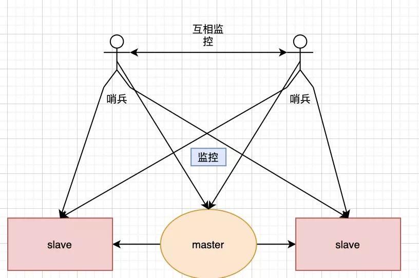

# Redis 主从哨兵集群

## **前言碎语**

说起 Redis 应该没有人会陌生了吧，作为开发中最最最最最最最常用的 nosql，它的重要性不言而喻。

Redis有三种集群模式，第一个就是主从模式，第二种“哨兵”模式，第三种是 Cluster 集群模式。(准确的说应该是四种，单机模式，但是基本上只适用于自己玩玩，这里就不说了)

今天就和大家细细聊聊这三种模式。

## **主从复制**

 

当其中一台服务器更新之后，服务器会自动的将这台更新的**数据同步到另外一台服务器**上。

通过持久化的功能，redis可以保证就算是服务宕机重启了，也只有少量的数据会丢失。但是在真实的使用场景当中，如果真的只有一台服务器，并且恰好宕机了，那么就会导致整个服务都不可用，因此redis提供了集群的方式来部署，可以避免这种问题。

在主从复制这种集群部署模式中，我们会将**数据库分为两类**，第一种称为**主数据库**(master)，另一种称为**从数据库**(slave)。

**主**数据库会**负责**我们整个系统中的**读写**操作，**从**数据库会**负责**我们整个数据库中的**读**操作。

其中在职场开发中的真实情况是，我们会让主数据库只负责写操作，让从数据库只负责读操作，就是为了**读写分离**，**减轻服务器的压力**。

但是我在实际开发中会遇到一种情况，该数据是个热点数据，我们知道，数据同步一定是会耗时的，那么当一个**热点数据进入master中**，**而slave没有来得及更新**，再去读这个数据就会造成**数据不一致**现象，所以当时我的方案就是直接去读master节点，这个逻辑同样适用于mysql主从中出现的问题。

## **主从同步原理**

· 当一个从数据库启动时，它会向主数据库发送一个**SYNC命令**

· master收到后，在后台**保存快照**，也就是我们说的RDB持久化，当然保存快照是需要消耗时间的，并且redis是单线程的(redis后面也支持了多线程，这里我们先不讲)，**在保存快照期间redis收到的命令会缓存起来**，快照完成后会将缓存的命令以及快照一起打包发给slave节点，从而保证主从数据库的一致性。

· 从数据库接受到快照以及缓存的命令后会将这部分数据**写入到硬盘上的临时文件**当中，写入完成后会用这份文件去替换掉RDB快照文件，当然，这个操作是不会阻塞的，可以继续接收命令执行，具体原因其实就是fork了一个子进程，用子进程去完成了这些功能。

因为不会阻塞，所以，这部分初始化完成后，当主数据库执行了改变数据的命令后，会异步的给slave，这也就是我们说的**复制同步阶段**，这个阶段会**贯穿在整个主从同步**的过程中，直到主从同步结束后，复制同步才会终止。

### **那么我上文提到的数据不一致的现象又是怎么回事呢？**

是因为redis采用了**乐观复制**的策略:

**容忍一定时间内主从数据库的数据是不一致的，但是会保证最终的结果一致**。

所以当主从复制发生时，正常情况下的命令都会在主数据库完成，然后直接反回给客户端，这样我们的性能就不会受到影响了，因为这里是主数据库先完成命令，那么就会产生其他问题。

**举个例子**，假如现在有1个master，6个slave，现在只有两个slave完成了同步，master写了新命令，在master准备将此命令传输给其他slave时，此刻其他的slave断电了，那么就会造成**数据不一致**的现象发生。

所以redis针对这种情况作了两个配置

min-slaves-to-write  2  (只有2个及以上的从数据库连接到了主数据库时，master库才是可写的)

min-slaves-max-lag  10 (10秒slave没有和master进行交互就认为丢失链接)

## **无硬盘复制**

我们刚刚说了主从之间是通过RDB快照来交互的，虽然看来逻辑很简单，但是还是**会存在一些问题**:

· 1.master**禁用了RDB快照**时，发生了主从同步(复制初始化)操作，也会生成RDB快照，但是之后如果master发成了重启，就会用RDB快照去恢复数据，这份数据可能已经很久了，中间就会丢失数据

· 2.在这种一主多从的结构中，master每次和slave同步数据都要进行一次快照，从而在硬盘中生成RDB文件，会**影响性能**

为了解决这种问题，redis在后续的更新中也加入了无硬盘复制功能，也就是说**直接通过网络发送给slave**，避免了和硬盘交互，但是也是有io消耗的。

## **增量复制**

### **为什么会有增量复制？**

刚刚我们说了复制的原理，但是他的缺点是很明显的，就是在**断开主从链接后，即使你只发生了一条数据变化，也需要将所有的数据通过SYNC命令用RDB将所有的数据同步给slave**，但是其实并不需要同步所有的数据，只需要将改变的这小部分数据同步给slave就好了

**所以为了解决这个问题，redis就有了增量复制。**

这个原理其实是很简单的，学过kafka 的小伙伴应该知道，kafka消费是通过偏移量来计算的，redis的增量复制也是如此。

master会**记下每个slave的id**，在复制期间，如果有新消息，会将新消息(其实是新的命令，当然只包括让数据放生变动的命令，如 set  这种 )**存放在一个固定大小的循环队列中**，这个大小是可以配置的，当然这时候发送的就是PSYNC命令了，然后master会在复制完成后将这部分数据发送给slave，这样就在很大程度上保证了数据一致性。

## **哨兵模式**

上文咱们说主从复制，在这种一主多从的结构中，我们让主从数据库做到了读写分离，也让从数据库能够完成数据备份的功能，可是也留下了一个比较严重的问题，当**master挂了之后，只能由运维人员重新选择一个slave升级成master，然后继续提供服务**。

想想一下，你国庆正放假，躺在三亚的海边沐浴着阳光，享受着香槟，突然你们boss给你来了个电话，说线上的master挂了，是不是会心里一句mmp？？？，所以，redis为了你考虑，在redis2.6版本中，他来了他来了--------**哨兵模式**

## **什么是哨兵？**

顾名思义，哨兵其实就是放哨的，它主要会有完成**两个功能**。

· 

1.监控整个主数据库和从数据库，观察它们是否正常运行

· 

· 

2.当主数据库发生异常时，自动的将从数据库升级为主数据库，继续保证整个服务的稳定

· 

哨兵其实是一个独立的进程，如下图

 

当然，上图只是一个哨兵存在时的情况，但在现实中还会有两个，甚至**更多哨兵存在**的情况

 

## **实现原理**

当一个哨兵进程启动时，它会先**通过配置文件，找我们的主数据库**，当然，我们这里也只需要配置其监控的主数据库就好，之后哨兵会自动发现所有复制该主数据库的从数据库，当然**一个哨兵是可以监控多个redis系统**的，同时，多个哨兵也可以同时监控一个redis系统的，这里moon先给大家灌输下这个概念，大家理解下，详细的我会在后文提到。

哨兵进程启动后后会和master建立两条链接

· 1.用来获取其他同样在监控着此redis系统的哨兵信息

· 2.发送一个info命令来获取此redis系统master本身的信息

当和master完成链接建立后，该哨兵就会定时的做以下三件事情

· 1.每10秒会向master和slave发送info命令

· 2.每2秒会向master和slave发送自己的信息

· 3.每1秒会向master，slave以及其他同样在监控着此redis系统的哨兵发送ping命令

以上三个操作可是说**是哨兵的核心**了，下面就着重介绍一下这三个命令

首先，**info命令可以让哨兵获取到当前数据库的信息**，比如运行id，复制信息等等，从而**实现新节点的自动发现**，从数据库的信息正是从info命令中获取的，获取从数据库信息后，就会和从数据库建立两条链接，和主数据库建立的链接是完全一样的，之后就会每**10s向主从数据库发送info**命令，当有新的从数据库加入时，就会从info命令中发现了，从而将这个新的slave加入自己的监控列表中。

当然如果有新的哨兵加入到了监控中，其他哨兵也是从这个info命令中获取的。

于此，就完成了对数据库以及其他哨兵的自动发现和监控，是不是很easy呢？？

以上讲了**自动发现数据库和其他的哨兵节点**，之后哨兵就开始了它的工作，就是去监控这些数据库和节点有没有停止，哨兵就会每隔一段时间向这些节点发送PING命令，如果一段时间没有收到回复后，那么这个哨兵就会认为该节点已经挂了，我们将其称为**主观下线**。

如果该节点是master，哨兵就会向其他节点询问，看其他节点时候也认为该master挂了，我们可以认为他们在投票，当票数达到了一定的次数，那么哨兵就认为该节点真的挂了，我们成为**客观下线**，然后哨兵之间就会选举，选出一个领头的哨兵对主从数据库发起故障的修复。

## **哨兵选举过程**

· 1.第一个发现该master挂了的哨兵，向每个哨兵发送命令，让对方选举自己成为领头哨兵

· 2.其他哨兵如果没有选举过他人，就会将这一票投给第一个发现该master挂了的哨兵

· 3.第一个发现该master挂了的哨兵如果发现由超过一半哨兵投给自己，并且其数量也超过了设定的quoram参数，那么该哨兵就成了领头哨兵

· 4.如果多个哨兵同时参与这个选举，那么就会重复该过程，知道选出一个领头哨兵

**选出领头哨兵后，就开始了故障修复，会从选出一个从数据库作为新的master**

## **master选举过程**

· 1.从所有在线的从数据库中，选择优先级最高的从数据库

· 2.如果有多个优先级高的从数据库，那么就会判断其偏移量，选择偏移量最小的从数据库，这里的偏移量就是增量复制的

· 3.如果还是有相同条件的从数据库，就会选择运行id较小的从数据库升级为master

## **cluster集群模式**

在redis3.0版本中支持了cluster集群部署的方式，这种集群部署的方式能**自动将数据进行分片，每个master上放一部分数据**，提供了内置的高可用服务，即使某个master挂了，服务还可以正常地提供，我们先来看张图：

 

使用cluster集群模式，只需要将每个数据库节点的cluster-enabled配置选项打开即可，但是每个cluster集群**至少要保证有3个主数据库**才能正常运行。

## **cluster集群模式是怎么存放数据的？**

一个cluster集群中**总共有16384个节点**，集群会将这16384个节点平均分配给每个节点，当然，我这里的节点指的是每个**主节点**，就如同下图：

 

 

## **键是如何和16384个插槽做关联的？**

redis将每个redis的键的键名有效部分使用CRC16算法计算出散列值，然后与16384取余数，这样的就可以使每个键能够尽量的**均匀分布**在16384个插槽中。

## **插槽是如何和节点做关联的?**

· 1.插槽之前**没有被分配过**，现在想分配给指定节点

· 2.插槽之前**被分配过**，现在想移动指定节点

第一种情况可以通过cluster add slot s 命令来实现

第二种情况的原理相对麻烦一点，但是redis也提供的便捷的方式去操作，我们可以使用redis-trib.rb去实现

## **如何获取与插槽对应的节点？**

当客户端向redis集群中的任意一个节点发送命令后，该节点都会判断当前键的信息是否存在于当前节点：

· 

如果**存在**，那么就会像单机的reids一样执行命令。

· 

· 

如果**不存在**，就会返回一个move重定向请求，告诉客户端负责该数据的节点是哪一个，然后客户端会向该节点发送命令再次请求获取数据

· 

## **新节点的加入**

需要通过cluster meet命令来实现:

cluster meet ip port

ip port 是我们已运行的redis集群中**任意一个节点的地址和端口号**，新节点在客户端输入命令后，会与命令中的节点**进行握手**，握手后，命令中的集群节点会将这个新节点的**信息分享给集群**中的每一个节点。

## **故障恢复**

判断故障的逻辑其实与哨兵模式有点类似，在集群中，每个节点都会**定期的向其他节点发送ping命令**，通过有没有收到回复来判断其他节点是否已经下线。

如果长时间没有回复，那么发起ping命令的节点就会认为目标节点疑似下线，也可以和哨兵一样称作主观下线，当然也需要集群中**一定数量的节点都认为该节点下线**才可以，我们来说说具体过程：

· 1。当A节点发现目标节点**疑似下线**，就会向集群中的其他节点散播消息，其他节点就会向目标节点发送命令，判断目标节点是否下线

· 2.如果集群中**半数以上**的节点都认为目标节点下线，就会对目标节点标记为下线，从而告诉其他节点，让目标节点在整个集群中都下线

## **如何提高redis的读写能力**

这个问题也是我们之前抛出来的问题，我们放一张图大家就会很容易明白了：

 

提高写能力只需要**横向扩容master**

提高读能力只需要**横向扩容slave**

## **结语**

关于这三种部署的方式，基本上在我知道的公司都毫无疑问直接选择cluster模式，当然具体的选择还是要看公司的规模了，毕竟技术服务于业务，选择合适于当前业务的，就是最好的。

 