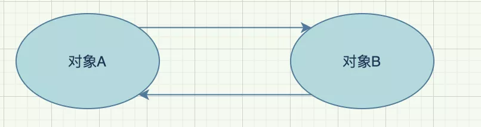
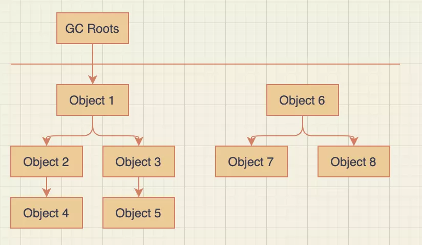
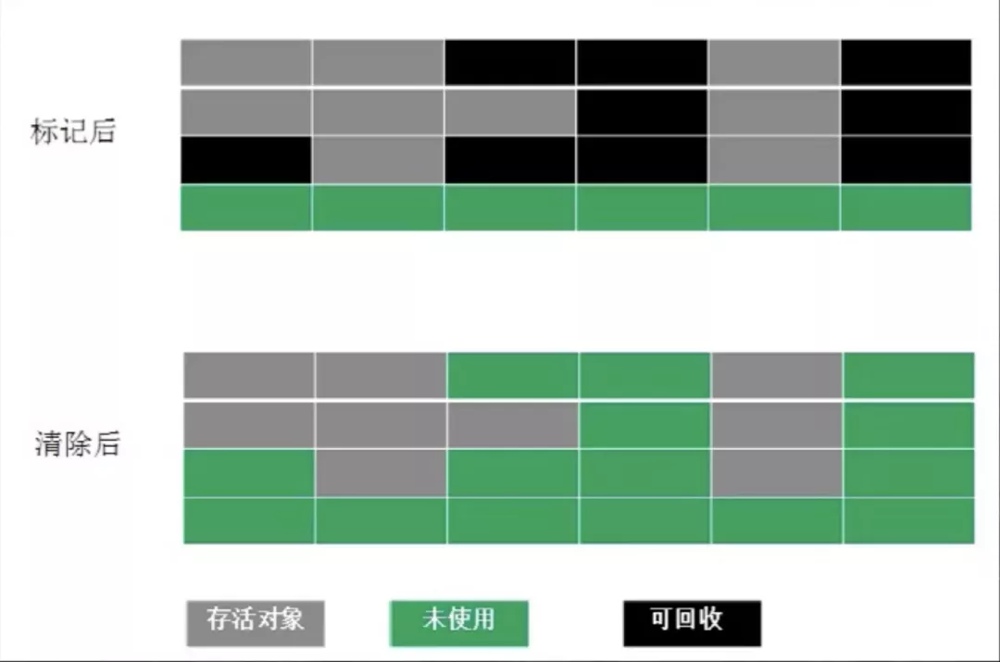
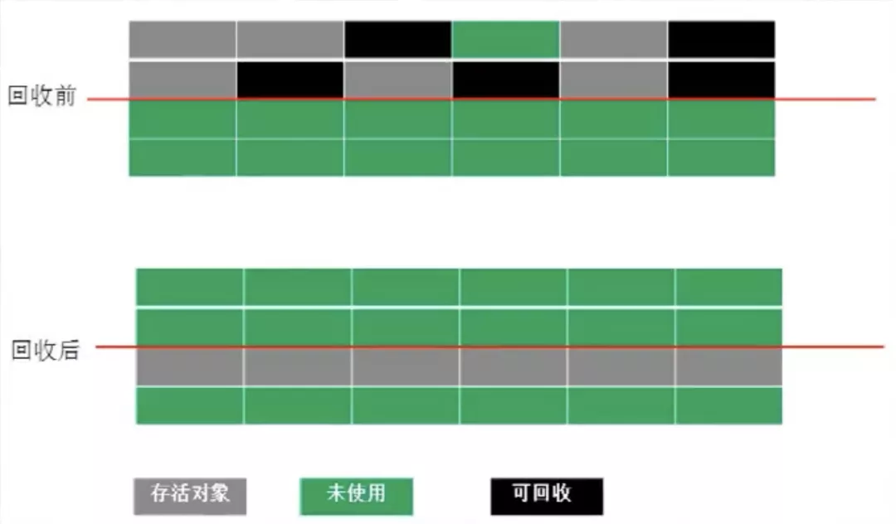
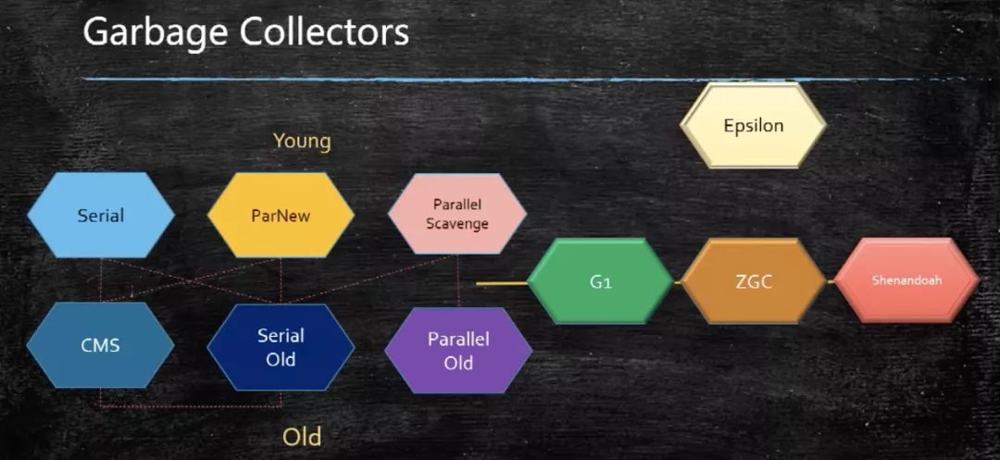
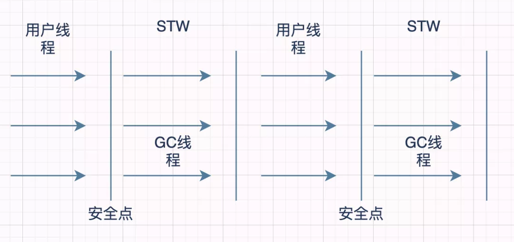
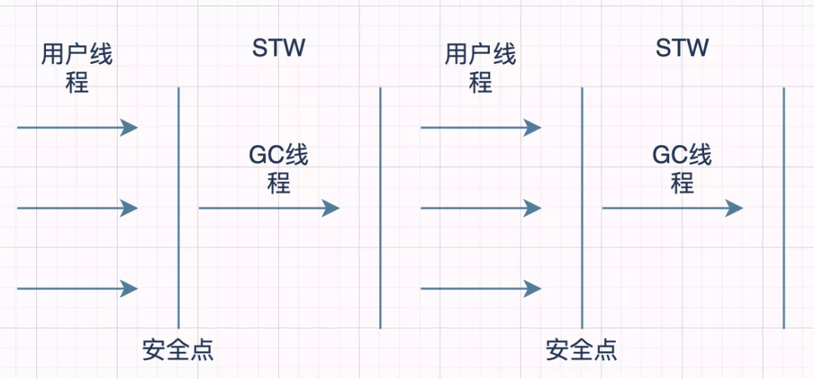
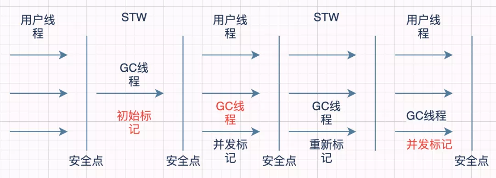
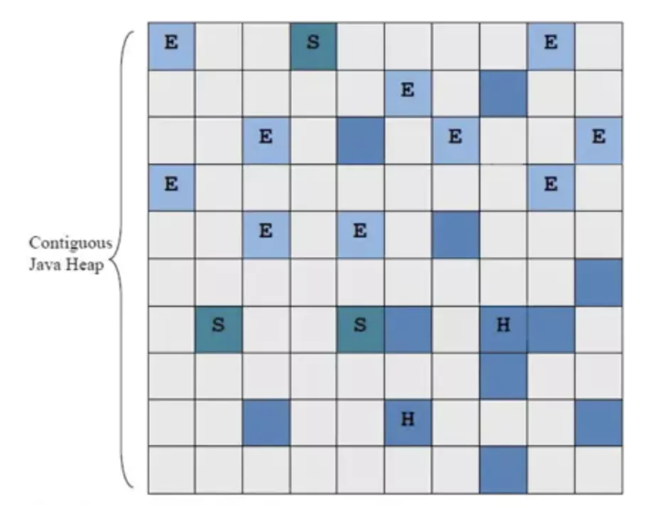
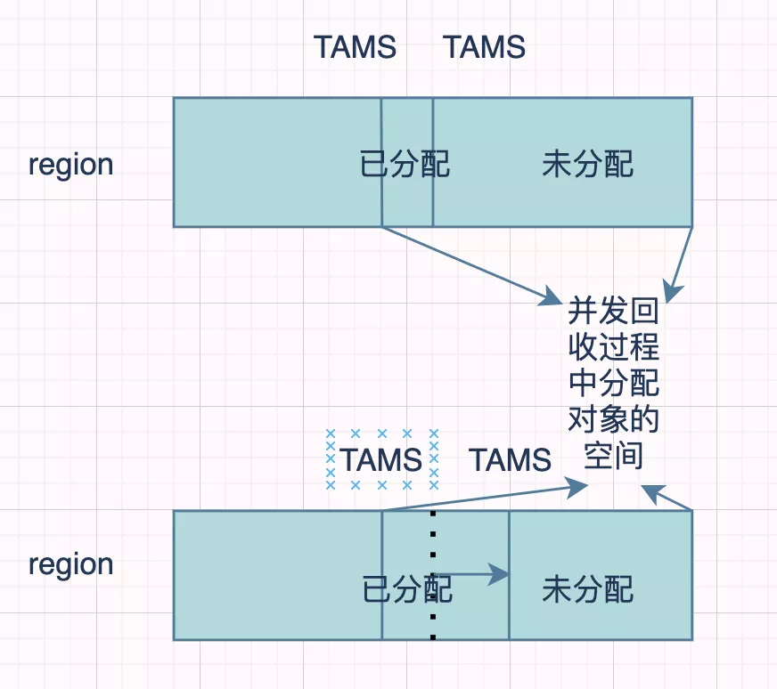

# jvm垃圾回收

垃圾是怎么找到的？
OopMap有什么作用？
为什么需要STW？
记忆集有什么作用？
常用的7种垃圾回收器都有哪些？？
三色标记算法？
CMS为什么会产生碎片化？
G1居然会引起Full GC？
......

## **垃圾对象是怎么找到的？**

### **引用计数算法**

就是给对象添加一个计数器

o 每当有一个地方引用它的时候，计数器就加1

o 每当有一个引用失效的时候，计数器就减1

**「当计数器的值为0的时候，那么该对象就是垃圾了」**

这种方案的原理很简单，而且判定的效率也非常高，但是却可能会有其他的额外情况需要考虑。

比如两个**「对象循环引用」**，a对象引用了b对象，b对象也引用了a对象，a、b对象却没有再被其他对象所引用了，其实正常来说这两个对象已经是垃圾了，因为没有其他对象在使用了，但是计数器内的数值却不是0，所以引用计数算法就无法回收它们。

这种算法是比较**「直接的找到垃圾」**，然后去回收，也被称为"直接垃圾收集"。

### **根可达算法**

这也是**「jvm默认使用」**的寻找垃圾算法

它的原理就是定义了一系列的根，我们把它称为 **「"GC Roots"」** ，从 **「"GC Roots"」** 开始往下进行搜索，走过的路径我们把它称为 **「"引用链"」** ，当一个对象到 **「"GC Roots"」** 之间没有任何引用链相连时，那么这个对象就可以被当做垃圾回收了。

 

如图，**「根可达算法」**就可以**「避免」**计数器算法不好解决的**「循环引用问题，Object 6、Object 7、Object 8」**彼此之前有引用关系，但是没有与 **「"GC Roots"」** 相连，那么就会被当做垃圾所回收。

在java中，有**「固定的GC Roots 对象」**和**「不固定的临时GC Roots对象:」**

**「固定的GC Roots:」**

o 1.在**「虚拟机栈(栈帧的本地变量表)中所引用的对象」**，譬如各个线程被调用的方法堆栈中使用到的参数、局部变量、临时变量等。

o 在方法区中**「类静态属性引用的对象」**，譬如 Java 类的引用静态变量。

o 在方法区中**「常量引用的对象」**，譬如字符串常量池中的引用。

o 在方法区栈中 **「JNI (譬如 Native 方法)引用的对象」**。

o Java **「虚拟机内部的引用」**，如基本数据类型对应的 Class 对象，一些常驻的异常对象(空指针异常、OOM等)，还有类加载器。

o 所有**「被 Synchronized 持有的对象」**。

o 反应 Java 虚拟机内部情况的 **「JMXBean、JVMTI 中注册的回调本地代码缓存等」**。

**「临时GC Roots:」**

**「为什么会有临时的 GC Roots ？」**

目前的垃圾回收大部分都是**「分代收集和局部回收」**，如果只针对某一部分区域进行局部回收，那么就必须要考虑的**「当前区域的对象有可能正被其他区域的对象所引用」**，这时候就要将这部分关联的对象也添加到 GC Roots 中去来确保根可达算法的准确性。

这种算法是利用了**「逆向思维」**，找到使用的对象，剩下的就是垃圾，也被称为"间接垃圾收集"。

## **四种引用类型**

### **强引用**

"Object o = new Object()" 就是一种强引用关系，这也是我们在代码中最常用的一种引用关系。

无论任何情况下，只要强引用关系还存在，垃圾回收器就不会回收掉被引用的对象。

### **软引用**

当内存空间不足时，就会回收软引用对象。

String str = new String("abc");
**// 软引用**
SoftReference<String> softRef = new SoftReference<String>(str);

软引用用来描述那些有用但是没必要的对象。

### **弱引用**

弱引用要比软引用更弱一点，它**「只能够存活到下次垃圾回收之前」**。

也就是说，垃圾回收器开始工作，会回收掉所有只被弱引用关联的对象。

**//弱引用**
WeakReference<String> weakRef = new WeakReference<String>(str);

在ThreadLocal中就使用了弱引用来防止内存泄漏。

### **虚引用**

虚引用是最弱的一种引用关系，它的唯一作用是用来作为一种通知。

如零拷贝(Zero Copy)，开辟了堆外内存，虚引用在这里使用，会将这部分信息存储到一个队列中，以便于后续对堆外内存的回收管理。

## **分代收集理论**

大多数的垃圾回收器都遵循了分代收集的理论进行设计，它建立在两个分代假说之上:

o **「弱分代假说」**:绝大多数对象都是朝升夕灭的。

o **「强分代假说」**:熬过越多次数垃圾回收过程的对象就越难消亡。

这两种假说的设计原则都是相同的:

垃圾收集器**「应该将jvm划分出不同的区域」**，把那些较难回收的对象放在一起（一般指老年代），这个区域的垃圾回收频率就可以降低，减少垃圾回收的开销。剩下的区域(一般指新生代)可以用较高的频率去回收，并且只需要去关心那些存活的对象，也不用标记出需要回收的垃圾，这样就能够以较低的代价去完成垃圾回收。

o **「跨代引用假说」**：如果某个新生代的对象存在了跨代引用，但是老年代的对象是很难消亡的，那么随着时间的推移，这个新生代对象也会慢慢晋升为老年代对象，那么这种跨代引用也就被消除了。

由于跨代引用是很少的，所以我们不应该为了少量的跨代引用去扫描整个老年代的数据，只需要在新生代对象建立一个**「记忆集」**来记录引用信息。

记忆集:**「将老年代分为若干个小块，每块区域中有N个对象」**，在对象引用信息发生变动的时候来维护记忆集数据的准确性，这样每次发生了 **「"Minor GC"」** 的时候只需要将记忆集中的对象添加到 **「"GC Roots"」** 中就可以了。

## **三种垃圾收集算法**

### **标记清除算法**

这种算法的实现是很简单的，有两种方式

o 1.标记出垃圾，然后清理掉

o 2.标记出存货的对象，回收其他空间

 

这种算法有两个缺点

o 1.随着对象越来越多，那么所需要消耗的时间就会越来越多

o 2.标记清除后会导致碎片化，如果有大对象分配很有可能分配不下而出发另一次的垃圾收集动作

### **标记复制算法**

这种算法解决了第一种算法碎片化的问题。

就是**「开辟两块完全相同的区域」**，对象只在其中一篇区域内分配，然后**「标记」**出那些**「存活的对象，按顺序整体移到另外一个空间」**，如下图，可以看到回收后的对象是排列有序的，这种操作只需要移动指针就可以完成，效率很高，**「之后就回收移除前的空间」**。

 

这种算法的缺点也是很明显的

o 浪费过多的内存，使现有的**「可用空间变为」**原先的**「一半」**

### **标记整理算法**

这种算法可以说是结合了前两种算法，既有标记删除，又有整理功能。

 

这种算法就是通过标记清除算法找到存活的对象，然后将所有**「存活的对象，向空间的一端移动」**，然后回收掉其他的内存。

但是这种算法却有一个缺点，就是在移动对象的时候必须要暂停用户的应用程序(**「STW」**)才能移动。

## **STW**

Java 中**「Stop-The-World机制简称 STW」** ，是在执行垃圾收集算法时，Java 应用程序的其他所有线程都被挂起（除了垃圾收集帮助器之外）。Java 中一种全局暂停现象，全局停顿，所有 Java 代码停止，native 代码可以执行，但不能与 JVM 交互。

### **为什么需要STW**

在 java 应用程序中**「引用关系」**是不断发生**「变化」**的，那么就会有会有很多种情况来导致**「垃圾标识」**出错。

想想一下如果 Object a  目前是个垃圾，GC 把它标记为垃圾，但是在清除前又有其他对象指向了 Object a，那么此刻 Object a 又不是垃圾了，那么如果没有 STW 就要去无限维护这种关系来去采集正确的信息。

再举个例子，到了秋天，道路上洒满了金色的落叶，环卫工人在打扫街道，却永远也无法打扫干净，因为总会有不断的落叶。

## **垃圾回收器是怎样寻找 GC Roots 的？**

我们在前面说明了根可达算法是通过 GC Roots 来找到存活的对象的，也定义了 GC Roots，那么垃圾回收器是怎样寻找GC Roots 的呢？

首先，**「为了保证结果的准确性，GC Roots枚举时是要在STW的情况下进行的」**，但是由于java应用越来越大，所以也不能逐个检查每个对象是否为GC Root，那将消耗大量的时间。

一个很自然的想法是，能不能用空间换时间，在某个时候把栈上代表引用的位置全部记录下来，这样到真正 gc 的时候就可以直接读取，而不用再一点一点的扫描了。事实上，大部分主流的虚拟机也正是这么做的，比如 HotSpot ，它使用一种叫做 **「OopMap」** 的数据结构来记录这类信息。

### **OopMap**

我们知道，一个线程意味着一个栈，一个栈由多个栈帧组成，一个栈帧对应着一个方法，一个方法里面可能有多个安全点。gc 发生时，程序首先运行到最近的一个安全点停下来，然后更新自己的 OopMap ，记下栈上哪些位置代表着引用。枚举根节点时，递归遍历每个栈帧的 OopMap ，通过栈中记录的被引用对象的内存地址，即可找到这些对象（ GC Roots ）。

使用 OopMap 可以**「避免全栈扫描」**，加快枚举根节点的速度。但这并不是它的全部用意。它的另外一个更根本的作用是，可以帮助 HotSpot 实现准确式 GC (即使用准确式内存管理，虚拟机可用知道内存中某个位置的数据具体是什么类型) 。

### **安全点**

从线程角度看，安全点可以理解成是在**「代码执行过程中」**的一些**「特殊位置」**，当线程执行到这些位置的时候，说明**「虚拟机当前的状态是安全」**的。

比如：**「方法调用、循环跳转、异常跳转等这些地方才会产生安全点」**。

如果有需要，可以在这个位置暂停，比如发生GC时，需要暂停所有活动线程，但是线程在这个时刻，还没有执行到一个安全点，所以该线程应该继续执行，到达下一个安全点的时候暂停，等待GC结束。

那么如何让线程在垃圾回收的时候都跑到最近的安全点呢？这里有**「两种方式」**：

o 抢先式中断

o 主动式中断

抢先式中断：就是在stw的时候，先让所有线程**「完全中断」**，如果中断的地方不在安全点上，然后**「再激活」**，**「直到运行到安全点的位置」**再中断。

主动式中断：在安全点的位置打一个标志位，每个线程执行都去轮询这个标志位，如果为真，就在最近的安全点挂起。

但是如果有些线程处于sleep状态怎么办呢？

### **安全区域**

为了解决这种问题，又引入了安全区域的概念

安全区域是指**「在一段代码片中，引用关系不会发生改变」**，实际上就是一个安全点的拓展。当线程执行到安全区域时，首先标识自己已进入安全区域，那样，当在这段时间里JVM要发起GC时，就不用管标识自己为“安全区域”状态的线程了，该线程只能乖乖的等待根节点枚举完或者整个GC过程完成之后才能继续执行。

## **聊聊垃圾回收器**

前面和大家聊了很多垃圾收集算法，所以在真正实践的时候会有多种选择，垃圾回收器就是真正的实践者，接下来就和大家聊聊10种垃圾回收器

 

### **Serial**

Serial是一个**「单线程」**的垃圾回收器，**「采用复制算法负责新生代」**的垃圾回收工作，可以与CMS垃圾回收器一起搭配工作。

 

在STW的时候**「只会有一条线程」**去进行垃圾收集的工作，所以可想而知，它的效率会比较慢。

但是他确是所有垃圾回收器里面消耗额外内存最小的，没错，就是因为简单。

### **ParNew**

ParNew 是一个**「多线程」**的垃圾回收器，**「采用复制算法负责新生代」**的垃圾回收工作，可以与CMS垃圾回收器一起搭配工作。

 

它其实就是 Serial 的多线程版本，主要区别就是在 STW 的时候可以用多个线程去清理垃圾。

### **Pararllel Scavenge**

Pararllel Scavenge 是一个**「多线程」**的垃圾回收器，**「采用复制算法负责新生代」**的垃圾回收工作，可以与 Serial Old ， Parallel Old 垃圾回收器一起搭配工作。

 

是与ParNew类似，都是用于年轻代回收的使用复制算法的并行收集器，与ParNew不同的是，Parallel Scavenge的**「目标是达到一个可控的吞吐量」**。

吞吐量=程序运行时间/（程序运行时间+GC时间）。

如程序运行了99s，GC耗时1s，吞吐量=99/（99+1）=99%。Parallel Scavenge提供了两个参数用以精确控制吞吐量，分别是用以控制最大GC停顿时间的-XX:MaxGCPauseMillis及直接控制吞吐量的参数-XX:GCTimeRatio.

**「停顿时间越短就越适合需要与用户交互的程序」**，良好的响应速度能提升用户体验，而高吞吐量则可以高效的利用CPU时间，尽快完成程序的运算任务，主要适合在后台运算而不需要太多交互的任务。

### **Serial Old**

Serial Old 是一个**「单线程」**的垃圾回收器，**「采用标记整理算法负责老年代」**的垃圾回收工作，有可能还会配合 **「CMS」** 一起工作。

 

其实它就是 Serial 的老年代版本，整体链路和 Serial 大相径庭。

### **Parallel Old**

Parallel Old 是一个**「多线程」**的垃圾回收器，**「采用标记整理算法负责新生代」**的垃圾回收工作，可以与 Parallel Scavenge 垃圾回收器一起搭配工作。

 

Parallel Old 是 Pararllel Scavenge 的老年代版本，它的设计思路也是以吞吐量优先的，ps+po也是很常用的一种组合。

### **CMS**

CMS可以说是一款具有"跨时代"意义的垃圾回收器，支持了和用户线程一起工作，做到了**「一起并发回收垃圾」**的"壮举"。

 

o 1.初始标记

§ 初始标记只是标记出来**「和 GC Roots 直接关联」**的对象，整个速度是非常快的，为了保证标记的准确，这部分会在 **「STW」** 的状态下运行。

o 2.并发标记

§ 并发标记这个阶段会直接根据第一步关联的对象找到**「所有的引用」**关系，这一部分时刻用户线程**「并发运行」**的，虽然耗时较长，但是不会有很大的影响。

o 3.重新标记

§ 重新标记是为了解决第二步并发标记所导致的标错情况，这里简单举个例子：并发标记时a没有被任何对象引用，此时垃圾回收器将该对象标位垃圾，在之后的标记过程中，a又被其他对象引用了，这时候如果不进行重新标记就会发生**「误清除」**。

§ 这部分内容也是在 **「STW」** 的情况下去标记的。

o 4.并发清除

§ 这一步就是最后的清除阶段了，将之前**「真正确认为垃圾的对象回收」**，这部分会和用户线程一起并发执行。

CMS的**「三个缺点」**：

o 1.影响用户线程的执行效率

§ CMS默认启动的回收线程数是（处理器核心数 + 3）/ 4 ,由于是和用户线程一起并发清理，那么势必会影响到用户线程的执行速度，并且这个影响**「随着核心线程数的递减而增加」**。所以 JVM 提供了一种 "**「增量式并发收集器」**"的 CMS 变种，主要是用来减少垃圾回收线程独占资源的时间，所以会感觉到回收时间变长，这样的话**「单位时间内处理垃圾的效率就会降低」**，也是一种缓和的方案。

o 2.会产生"浮动垃圾"

§ 之前说到 CMS 真正清理垃圾是和用户线程一起进行的，在**「清理」**这部分垃圾的时候**「用户线程会产生新的垃圾」**，这部分垃圾就叫做浮动垃圾，并且只能等着下一次的垃圾回收再清除。

o 3.会产生碎片化的空间

§ CMS 是使用了标记删除的算法去清理垃圾的，而这种算法的缺点就是会产生**「碎片化」**，后续可能会**「导致大对象无法分配」**从而触发**「和 Serial Old 一起配合使用」**来处理碎片化的问题，当然这也处于 **「STW」** 的情况下，所以当 java 应用非常庞大时，如果采用了 CMS 垃圾回收器，产生了碎片化，那么在 STW 来处理碎片化的时间会非常之久。

### **G1**

G1(Garbage First)：顾名思义，**「垃圾回收第一」**，官方对它的评价是在垃圾回收器技术上具有**「里程碑式」**的成果。

G1回收的目标不再是整个新生代，不再是整个老年代，也不再是整个堆了。G1可以**「面向堆内存的任何空间来进行」**回收，衡量的标准也不再是根据年代来区分，而是哪块**「空间的垃圾最多就回收哪」**块儿空间，这也符合G1垃圾回收器的名字，垃圾第一，这就是G1的 **「Mixed GC」** 模式。

当然我的意思是**「垃圾回收不根据年代来区分」**，但是G1还是**「根据年代来设计」**的，我们先来看下G1对于堆空间的划分：

 

G1 垃圾回收器把堆划分成一个个**「大小相同的Region」**，每个 Region 都会扮演一个角色，H、S、E、O。

E代表伊甸区，S代表 Survivor 区，H代表的是 Humongous(G1用来分配**「大对象的区域」**，对于 Humongous 也分配不下的超大对象，会分配在连续的N个 Humongous 中)，剩余的深蓝色代表的是 Old 区，灰色的代表的是空闲的 region。

在 HotSpot 的实现中，整个堆被划分成2048左右个 Region。每个 Region 的大小在1-32MB之间，具体多大取决于堆的大小。

在并发标记垃圾时也会产生新的对象，G1对于这部分对象的处理是这样的：

将 Region **「新增一块并发回收过程中分配对象的空间」**，并为此设计了两个 TAMS(Top at Mark Start)指针，这块区域专门用来在并发时分配新对象，有对象新增只需要将 TAMS 指针移动下就可以了，并且这些**「新对象默认是标记为存活」**，这样就**「不会干扰到标记过程」**。

 

但是这种方法也会有个问题，有可能**「垃圾回收的速度小于新对象分配的速度」**，这样会导致 "Full GC" 而产生长时间的 STW。

在 G1 的设计理念里，**「最小回收单元是 Region」** ，每次回收的空间大小都是Region的N倍，那么G1是**「怎么选择要回收哪块儿区域」**的呢？

G1 会跟踪各个 Region 区域内的垃圾价值，和回收空间大小回收时间有关，然后**「维护一个优先级列表」**，来收集那些价值最高的Reigon区域。

#### **执行的步骤：**

o 初始标记：

§ 标记出来 GC Roots 能**「直接关联」**到的对象

§ 修改 TAMS 的值以便于并发回收时新对象分配

§ 是在 Minor GC 时期(**「STW」**)完成的

o 并发标记：

§ 根据刚刚关联的对像扫描整个对象引用图，和用户线程**「并发执行」**

§ 记录 SATB(原始快照) 在并发时有引用的值

o 最终标记：

§ 处于 **「STW」**，处理第二步遗留下来的少量 SATB(原始快照) 记录

o 筛选回收：

§ 维护之前提到的优先级列表

§ 根据**「优先级列表」**，**「用户设置的最大暂停时间」**来回收 Region

§ 将需要回收的 Region 内存活的对象**「复制」**到不需要回收的 Region区域内，然后回收需要回收的 Region

§ 这部分是处于 **「STW」** 下执行，并且是多线程的

#### **三色标记**

这里我们又提到了一个概念叫做 **「SATB 原始快照」**，关于SATB会延伸出有一个概念，**「三色标记算法」**，也就是垃圾回收器标记垃圾的时候使用的算法，这里我们简单说下：

将对象分为**「三种颜色」**：

o 白色：没被 GC 访问过的对象(被 GC 标记完后还是白色代表是垃圾)

o 黑丝：存活的对象

o 灰色：被 GC 访问过的对象，但是对象引用链上至少还有一个引用没被扫描过

我们知道在**「并发标记」**的时候**「可能会」**出现**「误标」**的情况，这里举两个例子：

o 1.刚开始标记为**「存活」**的对象，但是在并发标记过程中**「变为了垃圾对象」**

o 2.刚开始标记为**「垃圾」**的对象，但是在并发标记过程中**「变为了存活对象」**

第一种情况影响还不算很大，只是相当于垃圾没有清理干净，待下一次清理的时候再清理一下就好了。

第二种情况就危险了，正在使**「用的对象的突然被清理掉」**了，后果会很严重。

那么**「产生上述第二种情况的原因」**是什么呢？

o 1.**「新增」**一条或多条**「黑色到白色」**对象的**新引用

o 2.删除**「了」**灰色**「对象」**到该白色对象**「的直接」**引用**或间接引用。

当这两种情况**「都满足」**的时候就会出现这种问题了。

所以为了解决这个问题，引入了**「增量更新」**(Incremental Update)和**「原始快照」**(SATB)的方案：

增量更新破坏了第一个条件：**「增加新引用时记录」**该引用信息，在后续 STW 扫描中重新扫描(CMS的使用方案)。

原始快照破坏了第二个条件：**「删除引用时记录下来」**，在后续 STW 扫描时将这些记录过的灰色对象为根再扫描一次(G1的使用方案)。

## **结尾的唠叨**

今天聊的这些东西应该能够帮你把堆垃圾回收的整体链路打通，其实关于垃圾回收器，我们这里只介绍了最常用的7中，是因为剩下的 Shenandoah，ZGC，Epsilon这些垃圾回收器，每个拿出来讲解都是可以单独成一篇文章的(其实是我也没有太深入了解哈哈，还不能够写成文章)，作者这里就不再添加到这篇文章了，后续有机会我会单独成文去写这些垃圾回收器。

 