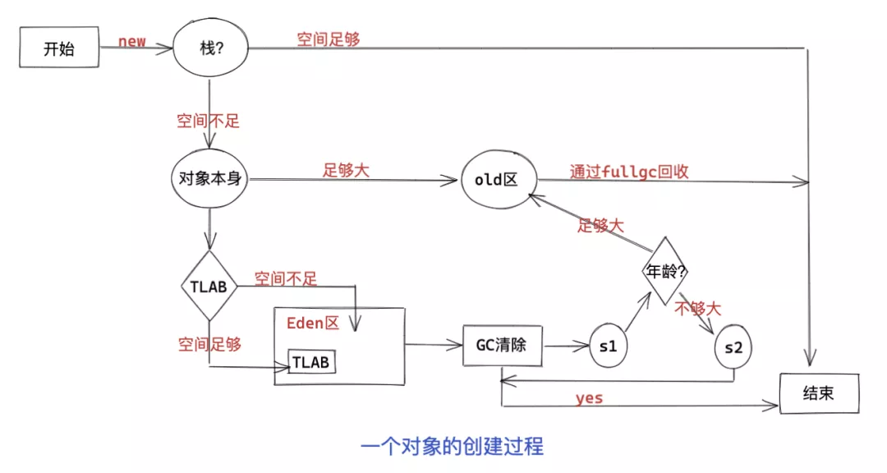
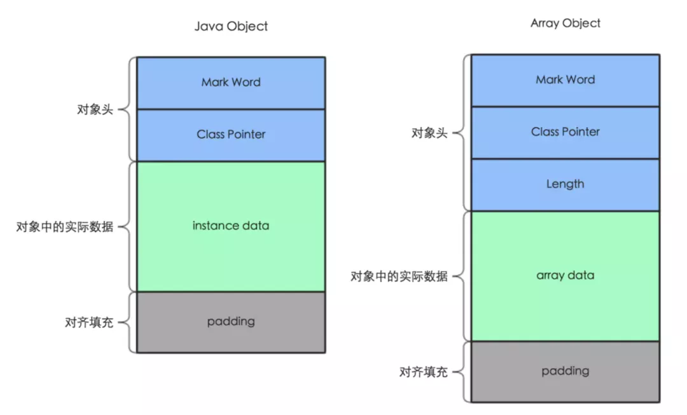
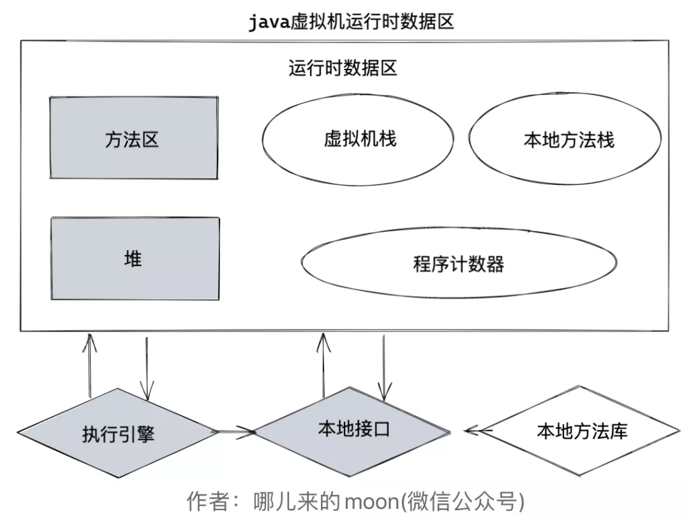
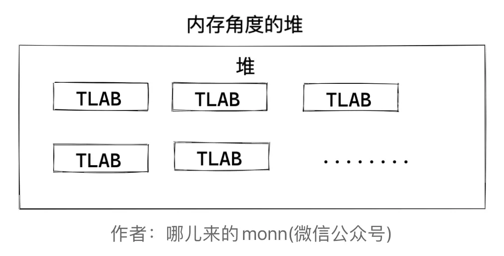

# jvm对象的创建过程内存布局

 **1.对象的创建过程**

  **2.对象的内存布局**

## **对象的创建过程**

**以下内容基于HotSpot VM 分代模型**

 

这张图其实就能完整的说明一个对象的创建过程到底发生了什么，很多朋友可能一下看不懂，那么我们就跟着左上角的一步一步来：

\1. **一个对象new出来先判断线程栈是否能分配下**

· 如果能分配下，直接分配在栈中。

· 如果分配不下则进行第二步。

\2. **判断该对象是否足够大**

· 如果足够大，则直接进入老年代。

· 如果不够大，则进行第三步。

\3. **判断创建对象的线程的TLAB（本地线程缓冲区）空间是否足够**

· 如果足够，直接分配在TLAB中。

· 如果不够，则进入Eden区中其他空间。然后进行第四步。

\4. **GC清除**

· 如果清除掉了该对象，则直接结束。

· 如果没有清除掉对象，进行第5步。

\5. **此刻对象进入Survivor 1 区，判断年龄是否足够大**

· 如果年龄足够大，则直接进入old区域。

· 如果年龄不够大，则进入Survivor 2 区，然后进入第4步，循环往复。

  通过这张流程图和步骤解析大家应该对一个对象的创建过程有一个很清晰的概念了，但是其中还是有很多小细节会被忽略，为什么jvm会在对象的创建过程中大作文章，会分这么多种情况？为了让大家更深入的能够理解它，我们就再来看看下面这几个问题：

\1. **为什么对象会选择先分配在栈中？**

  首先栈是线程私有的,将对象优先分配在栈中,**可以通过pop直接将对象的所有信息,空间直接清除**，当线程消亡的时候也可以直接清理这一块儿TLAB区域。

\1. **为什么jvm会让大对象会直接进入老年代？**

  大对象需要连续的空间来存储,如果不存入老年代对jvm说就可能是一个负担，**如果没有足够的空间就有可能导致提前触发gc来清理空间来安置大对象**。

\1. **为什么会选择先进入TLAB？**

  TLAB是线程本地缓冲区，**TLAB的好处就是防止不同线程创建对象选择同一块儿内存区域而产生竞争**，会使其概率大大减少。

\1. **为什么会有两个Survivor区？并且存活且年龄不够大的对象会从一个Survivor区转到另一个Survivor区？**

  根据根可达算法，jvm会从开始寻找到所有正在使用的对象，没有使用的就是垃圾,通常情况下，**很多对象都是用完就抛弃的**，所以真正在Survivor区长时间存活的对象非常少，**将这部分对象从一个Survivor区转到另一个Survivor区后，就可以直接对这个Survivor区进行全量的空间回收了**，效率会很高。

## **对象的内存布局**

  作者可不是标题党，哈哈，所以我们回到文章的标题，Object o = new Object();到底占用多少个字节？这道题的目的其实就是考验看你对对象的内存布局了解的是否清晰，先上图:

 

  在java中对象的内存布局分为两种情况，非数组对象和数组对象，**数组对象和非数组对象的区别就是需要额外的空间存储数组的长度length**。

##### **对象头**

  对象头又分为MarkWord和Class Pointer两部分。

· 

MarkWord:包含一系列的标记位，比如轻量级锁的标记位，偏向锁标记位,gc记录信息等等，**在32位系统占4字节，在64位系统中占8字节**。

· 

· 

ClassPointer:用来指向对象对应的Class对象（其对应的元数据对象）的内存地址。**在32位系统占4字节，在64位系统中占8字节**。

· 

· 

Length:只在数组对象中存在，用来记录数组的长度，占用4字节

· 

##### **Interface data**

· Interface data:对象实际数据，对象实际数据**包括了对象的所有成员变量，其大小由各个成员变量的大小决定**。(这里**不包括静态成员变量**，因为其是在方法区维护的)

##### **Padding**

· Padding:Java对象占用空间是8字节对齐的，即所有Java对象占用bytes数必须是8的倍数,是因为当我们从磁盘中取一个数据时，不会说我想取一个字节就是一个字节，都是按照一块儿一块儿来取的，这一块大小是8个字节，所以为了完整，**padding的作用就是补充字节，保证对象是8字节的整数倍**。

  moon在上文特意标注了32位系统和64位系统不同区域占用空间大小的区别，这是因为**对象指针在64位JVM下的寻址更长**，所以想比32位会多出来更多占用空间。

  但是现在假设一个场景，公司现在项目部署的机器是32位的，你们老板要让你将项目迁移到64位的系统上，但是又因为64位系统比32位系统要多出更多占用空间，怎么办，因为正常来说我们是不需要这一部分多余空间的，所以jvm已经帮你考虑好了，那就是**指针压缩**。

#### **指针压缩**

  -XX:+UseCompressedOops 这个参数就是JVM提供给你的解决方案，可以压缩指针，将占用的空间压缩为原来的一半，起到节约空间的作用，classpointer参数大小就受到其影响。

#### **Object o = new Object()到底占用多少个字节？**

  通过刚才内存布局的学习后，这个问题就很好回答了，面试官其实就是想问你对象的内存布局是怎样的，我们这里就针对这个问题的结果分析下，这里分两种情况：

· 

**在开启指针压缩的情况下**，markword占用8字节，classpoint占用4字节，Interface data无数据，总共是12字节，由于对象需要为8的整数倍，Padding会补充4个字节，总共占用16字节的存储空间。

· 

· 

**在没有指针的情况下**，markword占用8字节，classpoint占用8字节，Interface data无数据，总共是16字节。

· 

#  jvm┃java内存区域

## **目录**

· 

目录

· 

· 

前言

· 

· 

正文

· 

§ 

1.程序计数器

§ 

§ 

2.虚拟机栈

§ 

§ 

3.本地方法栈

§ 

§ 

4.堆

§ 

§ 

5.方法区

§ 

§ 

6.直接内存

§ 

· 

结语

· 

 

## **前言**

  在java的使用过程当中，我们会发现java的内存是自己释放的，并不像C、C++代码那样，每一块儿内存都需要程序员自己去维护，但是在如此便捷的同时可能也会出现很多问题，比如**内存溢出**，**内存泄漏**更不好排查了，所以今天的文章中，moon会带大家先了解**java的内存区域的到底是怎样的**，以及**各个组件的作用是什么**，让你一点一点翻越虚拟机内存管理这座大山。

 

## **正文**

  我们先来看一张图：

 

  这张图就是一个java虚拟机运行时数据图，**深色区域代表是线程共享的区域**，java程序在运行的过程中会把他管理的内存划分为若干个不同的数据区域，每一块儿的数据区域所负责的功能都是不同的，他们也有不同的创建时间和销毁时间，本文将会从这张图开始一一展开，清晰的告诉你每一个模块的作用。

### **1.程序计数器**

  程序计数器就像是控制城市交通的红绿灯一样，是整个系统的中枢。在jvm中，它就是程序控制流的指示器，**循环，跳转，异常处理，线程的恢复**等工作都需要依赖程序计数器去完成。
  **程序计数器是线程私有的**，它的生命周期是和线程保持一致的，我们知道，N个核心数的CPU在同一时刻，最多有N个线程同时运行，在我们真实的使用过程中可能会创建很多线程，**jvm的多线程其实是通过线程轮流切换，分配处理器执行时间来实现的**。既然涉及的线程切换，所以每条线程必须有一个独立的程序计数器。

### **2.虚拟机栈**

  虚拟机栈，其描述的就是线程内存模型，也可以称作线程栈，也是每个线程私有的，生命周期与线程保持一致。在每个方法执行的时候，jvm都会同步创建一个栈帧去存储**局部变量表，操作数栈，动态连接，方法出口等信息**。一个方法的生命周期就贯彻了一个栈帧从入栈到出栈的全部过程。  **局部变量表**应该是我们接触的最多的，**里面存储了java的8大基本数据类型**（byte、short、char、int、float、long、double、boolean）、**对象引用**(reference类型，不是对象本身，是指向对象的引用)和**returnAddress类型**（指向一条字节码指令的地址）。局部变量表的存储单位是**局部变量槽**(slot)，long和double类型会占据两个变量槽，其余类型只占用一个，但是每一个变量槽的大小是由jvm自己决定的。

### **3.本地方法栈**

  本地方法栈的概念很好理解，我们知道，java底层用了很多c的代码去实现，而其调用c端的方法上都会有native，代表**本地方法**服务，而本地方法栈就是为其服务的。

### **4.堆**

  堆可以说是**jvm中最大的一块儿内存区域**了，**它是所有线程共享**的，不管你是初学者还是资深开发，多少都会听说过堆，毕竟几乎所有的对象都会在堆中分配。

  **我们先从分配内存的角度看看堆是怎么样的**：  其实这就是一个最真实的堆，可能有些同学会觉得我说的不对，应该还有新生代，老年代，永久代，伊甸区，servivor区等等。这种说法基于某种逻辑上说是对的，但是并不是标准，它只是某些垃圾回收器的设计理念，需要新生代，老年代收集器搭配才能工作。

  我们来说说**TLAB(thread  local allocation buffer)**,TLAB的数量和线程数是一一对应的，也就是说，TLAB是线程私有的，在堆空间中分配，**对象会首先存放在这个线程私有的TLAB中**，可以提升线程分配的效率。

### **5.方法区**

  方法区也是所有线程共享的区域，它存储了被jvm加载的类型信息、常量、静态变量等数据。
  **运行时常量池**就是方法区的一部分，编译期生成的各种字面量与符号引用就存储在其中。

### **6.直接内存**

  **这部分数据并不是jvm运行时数据区的一部分**，nio就会使用到直接内存，也可以说堆外内存，**通常会配合虚引用一起去使用**，就是为了资源释放，会将堆外内存开辟空间的信息存储到一个队列中，然后GC会去清理这部分空间。

  堆外内存优势在 IO 操作上，对于网络 IO，使用 Socket 发送数据时，能够节省堆内存到堆外内存的数据拷贝，所以性能更高。看过 Netty 源码的同学应该了解，**Netty 使用堆外内存池来实现零拷贝技术**。对于磁盘 IO 时，也可以使用内存映射，来提升性能。另外，更重要的几乎不用考虑堆内存烦人的 GC 问题。但是既然是内存。也会受到本机总内存的限制，

 