# mysql┃多个角度说明sql优化

## **目录**

· 

目录

· 

· 

前言

· 

· 

正文

· 

§ 

1.表结构优化●

§ 

§ 

1.1拆分字段

§ 

§ 

1.2字段类型的选择

§ 

§ 

1.3字段类型大小的限制

§ 

§ 

1.4合理的增加冗余字段

§ 

§ 

1.5新建字段一定要有默认值

§ 

§ 

2.索引方面●

§ 

§ 

2.1索引字段的选择

§ 

§ 

2.2利用好mysql支持的索引下推，覆盖索引等功能

§ 

§ 

2.3唯一索引和普通索引的选择

§ 

§ 

3.查询语句方面●

§ 

§ 

3.1避免索引失效

§ 

§ 

3.2合理的书写where条件字段顺序

§ 

§ 

3.3小表驱动大表

§ 

§ 

3.4可以使用force index()防止优化器选错索引

§ 

§ 

4.分库分表●

§ 

· 

结语

· 

## **前言**

  mysql的优化是我们经常都会提到的一个话题，也是重中之重，在很多大厂中会有专门的DBA来做这件事情，甚至更过分的是连应届生的招聘岗位要求上都写了需要懂一点sql优化，最近moon一直在写关于mysql的文章，包括之前写的索引相关，其实也都是为了这篇文章做个铺垫，所以你懂了吗，今天我将从表结构、索引、查询语句、分库分表这四个维度来和大家聊聊，在工作中，怎么进行sql优化？

## **正文**

### **1.表结构优化●**

  优化sql最基本的条件时要有一张表，那么我们怎么通过一张表来达到sql语句优化的目的呢？

### **1.1拆分字段**

我们给出一个场景，想象自己是一家包子铺老板，每天都要结账，于是肯定会有一张账户余额表，来记录包子铺的总资产

CREATE TABLE `accout_balance` (
 `id` bigint(20) NOT NULL AUTO_INCREMENT COMMENT '主键',
 `account` varchar(64) NOT NULL DEFAULT '' COMMENT '账户',
 `balance` decimal(16,2) DEFAULT NULL COMMENT '余额',
 PRIMARY KEY (`id`)
) ENGINE=InnoDB AUTO_INCREMENT=1 DEFAULT CHARSET=utf8mb4;

  可是后来包子铺的生意做的越来越好，老板陆陆续续开了几百家店，后来居然做成了全国连锁店。

  老板很开心，但是他发现了一个问题，由于生意太火爆，所以**每时每刻都会有人结账，而且他们的系统越来越卡了**，这是为什么？

  我们来分析下:

  每时每刻都会有人结账，结账后会修改accout_balance(账户余额表)的balance(余额)字段，所以这张表是一张热表，而每一次修改都会开启一个事务（update语句就相当于一个事务），所以在高并发的情况下，问题显而易见，**针对同一行数据**，**一个事务必须要等上另一个事务执行完成之后才能执行自己的更新语句**，所以越来越慢。(行锁)

  那么我们怎么针对这种情况来优化呢？moon的思路是控制并发度。

  我们目前的情况是几百家分店都会操作这同一行记录，那么我们就可以把这一行记录分成多行，也就是说，把账户的余额分成N份,这样每次增加的时候选择其中的一条记录增加，冲突的概率也变成了之前的N分之一。

### **1.2字段类型的选择**

  这种优化应该是比较常见的，我们就长话短说。

  **比如针对UUID这种数据我们可以直接使用**char(36)**来作为该字段的类型，或者说在表示boolean这种数据格式的时候，我们就可以直接使用**tinyint(2)**作为我们的字段类型**，在我们提前可预知字段的大小的时候，最好在类型上直接限制，避免浪费存储空间占用。

### **1.3字段类型大小的限制**

  这点在我们公司的sql建表规范上就会明确写到。

  我这里简单的举个例子，比如varchar，要使用varchar(255),这里会有几点考量：

  **一**.**255刚好会消耗**一个字节**的存储单元**，但是256会导致消耗两个字节的存储单元。(这个针对UTF-8编码)

  **二**.如果你要在varchar上建立索引，255会是一个完全索引，而266以上只能用到最左前缀（**MySQL的每个单表中所创建的**索引长度是有限制的**,且对不同存储引擎下的表有不同的限制。**myisam表**，单列索引，最大长度不能超过1000 bytes，否则会报警，但是创建成功，最终创建的是前缀索引。**innodb表**，单列索引，超过 767 bytes的，给出warning，最终索引创建成功，取前缀索引（取前 255 字符）**），最左前缀的弊端就是无法用到mysql提供的覆盖索引的加速功能了。

  **三**.此外在onlineddl的时候，255以下可以用inplace的方式，256需要rebuild。(**Inplace方式:这是原生MySQL 5.5，以及innodb_plugin中提供的创建索引的方式。所谓Inplace，也就是**索引创建在原表上直接进行**，不会拷贝临时表。相对于Copy Table方式，这是一个进步。Inplace方式创建索引，创建过程中，原表同样可读的，但是不可写。**)

### **1.4合理的增加冗余字段**

  在我们刚开始学习mysql的时候，就会了解到数据库的三范式，**而在实际的使用过程中，为了性能，我们也可以抛弃数据库的三范式**。

  moon在之前的公司就有这样的问题，一条sql语句要连5张表，正常一个查询下来可能要1分多钟，所以这条sql太重了，而在moon的细心观察下发现，其中两张表都只用到了其中一个字段，然后我就和DBA商量下将这两个字段冗余到了其它的两个表中(业务有关联)，结果这条sql语句的执行时间就变成了十几秒。

### **1.5新建字段一定要有默认值**

**好处如下**：

  **1.节省空间。**

  大体看上去，好像设置可以为空的时候更节省空间，但实际上，他比NOT NULL要多占用一个bit的空间，用来判断该字段是否为空。

  **2.索引失效索引分裂**

  引用到null，索引会失效。还看到一个说法：空更新到非空时，如果空间不足，有可能会引起索引分裂。

  **3.减少因空值出现的计算错误等**

  count()在遇到null值时，这条记录不会计算在内。

### **2.索引方面●**

### **2.1索引字段的选择**

  一般情况下，可以通过慢查询日志选择出一些热sql语句，**给select条件后以及where条件后的字段加索引**。

### **2.2利用好mysql支持的索引下推，覆盖索引等功能**

select a from user where b = 5；

  此时给a和b字段增加索引，这样可以利用mysql的覆盖索引加速的功能，省去了回表的过程。

select a from user where c = 5 and d > 5；

  此时给c和d字段增加索引，也可以在判断的时候也能利用到索引下推的功能，也就是说mysql在判断c=5后，发现d也是索引，会直接找到d判断d>5，如果不给d增加索引此时也是需要回表的。

  其次对于组合索引：
  (a,b)这种索引一旦建立，就不需要再给a建立索引了，mysql的最左前缀原则支持组合索引或者字符串类型的索引最左N个单位的索引建立。反之，如果你此刻建立的是(a，b)索引，但是你的业务却还需要一个b的单独索引，那么就可以考虑给b单独新建索引了。如果现在你的表中只有a索引，但是业务需求需要(a，b)索引，一定要记得，**先增加索引，然后再建立索引**，不然**可能会导致服务挂掉**。moon有个朋友的同事，在新增索引的时候，选择了先删除，后增加，这样就导致的在删除后到新增前的这段空白期，出现了很多慢查询sql，同时请求量有很大，业务无法在短时间内处理完，只能慢慢等待，最后导致服务挂掉。

### **2.3唯一索引和普通索引的选择**

  如果我们**能在业务意义上保证某个字段是唯一的**，并且这张表又是一个**经常写入数据**的表，那么这里moon推荐你用普通索引，而不是唯一索引，原因如下：
  **一**.在读取数据的时候，普通索引在查到满足第一个条件的记录后，会继续查找下一个记录，直到第一个不满足条件的记录。而唯一索引，查找到第一个满足条件的记录时，就直接停止了。这样看来其实唯一索引更好，但是实际观察来看，这种性能的差异微乎其微，况且我们还可以在**查询语句上用limit 1**来限制。重点是第二点。
  **二**.在更新过程中，普通索引的更新因为不用考虑唯一性，会将这次更新操作直接写入change buffer中，之后会定期或者再次访问到这个数据页的时候持久化到磁盘当中。而唯一索引的更新不能用change bufer，原因是要在表中判断是否已经有该条记录，所以会有一个将数据页读入内存的IO操作，而IO操作又是很消耗资源的。

### **3.查询语句方面●**

### **3.1避免索引失效**

  **一**.最佳左前缀法则（带头索引不能死，中间索引不能断

  **二**.不要在索引上做任何操作（计算、函数、自动/手动类型转换），不然会导致索引失效而转向全表扫描

  **三**.不能继续使用索引中范围条件（bettween、<、>、in等）右边的列，如：

select a from user where c > 5 and b = 4；

  **四**.索引字段上使用（！= 或者 < >）判断时，会导致索引失效而转向全表扫描

  **五**.索引字段上使用 is null / is not null 判断时，会导致索引失效而转向全表扫描。

  **六**.索引字段使用like以通配符开头（‘%字符串’）时，会导致索引失效而转向全表扫描，也是最左前缀原则。

  **七**.索引字段是字符串，但查询时不加单引号，会导致索引失效而转向全表扫描

  **八**.索引字段使用 or 时，会导致索引失效而转向全表扫描

### **3.2合理的书写where条件字段顺序**

  这里其实也是最左前缀原则。在一些后需维护开发工作中，可以观察表中的联合索引，当你新写的sql有where条件时，尽量在where条件的书写顺序**按照联合索引的顺序**。

### **3.3小表驱动大表**

  join查询在有索引条件下，**驱动表有索引不会使用到索引，被驱动表建立索引会使用到索引**。

  MySQL 表关联的算法是 Nest Loop Join，是通过驱动表的结果集作为循环基础数据，然后一条一条地通过该结果集中的数据作为过滤条件到下一个表中查询数据，然后合并结果。如果还有第三个参与Join，则再通过前两个表的Join结果集作为循环基础数据，再一次通过循环查询条件到第三个表中查询数据，如此往复。所以，**小表驱动大表所建立的连接次数也远比大表驱动小表所建立的连接次数要小的多**。

  可以通过EXPLAIN分析来判断在sql中谁是驱动表，EXPLAIN语句分析出来的第一行的表即是驱动表。

### **3.4可以使用force index()防止优化器选错索引**

  在我们确定要使用某个索引的时候可以使用force index()强制只用某个索引，避免在某些情况下优化器选择错误导致查询效率降低。

  优化器选择索引的目的，是找到一个最优的执行方案，并用最小的代价去执行语句。

  优化器会结合是否使用临时表、是否排序、扫描行数等因素进行综合判断。

  当然是用force index 也是有弊端的，如果你的索引发生了变化，而你的sql语句没有即使更改，那么这里就会报错。

### **4.分库分表●**

  **在以上你能做到优化的极致条件下，由于数据量很大，可能还是会面临着慢查询的情况出现**，那么这时候我们就要考虑分库分表了。

  moon这里简单的和大家举个例子:

  一家做客服系统的公司，业务量很大，客户很多，每天可能有上千万的数据量，如果你将这些数据都放在一张表里面，毫无疑问，会死的很惨。这时候我们可以考虑和业务相关的方式来进行分表，**比如说你有10000家客户，你可以每一百家客户放在一张表上**，这样平均下来一天该表可能只能几十万条数据，这样是可以接受的。但是时间久了，你会发现之前的数据都是没有用的，客户关心的都是最新产生的数据，那么我们就可以分库，**将这些客户不关心的数据放在这个冷库中**，以提高线上热数据的查询效率。

 

# mysql┃explain 都不会用？怎么优化？

## **目录**

------

· 

目录

· 

· 

前言

· 

· 

正文

· 

§ 

什么是explain？

§ 

§ 

explaing该怎么使用

§ 

§ 

explain输出格式字段详解

§ 

· 

结语

· 

## **前言**

------

  现在的java开发人员越来越多，竞争也越来越激烈，moon在某钩招聘网站上发布了一个岗位需求，不到短短1天就收到20多份简历，大部分都是应届一年两年的，新鲜血液越来越多，我们也要不断的提升自己才能够不被挤下去，大家可以看下各大网站的java岗位3年以上的招聘需求：

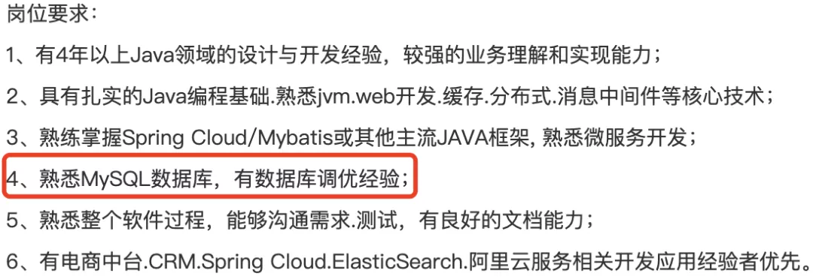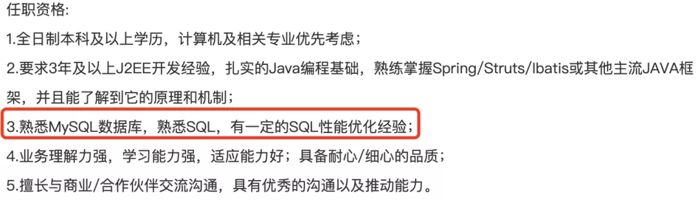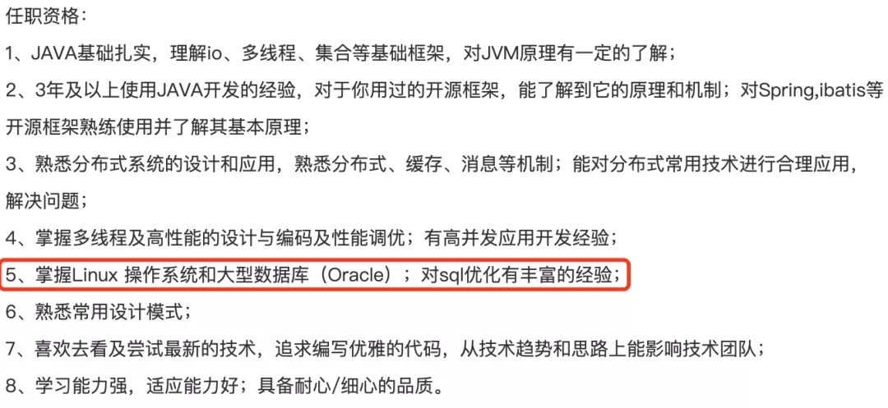 

<<< 左右滑动见更多 >>>

  大部分java开发岗位都会有写到数据库相关，会把sql优化作为一个重要的岗位要求之一，由此可见sql优化的重要性。

  mysql调优是一块很大的挑战，并且有很多维度可以优化比如事务方面，表结构方面等等。

  今天我们就来聊一聊最基本的，如何针对某条sql语句优化，以及explain执行计划的使用。

## **正文**

------

### **什么是explain？**

  **explain**是MYSQL提供的一个命令，它可以用来分析select语句，并且输出相应的分析结果，使得开发人员可以针对输出结果来对sql语句进行特定的优化。

### **explaing该怎么使用**

  explain的使用很简单，只需要在s需要执行的语句前加上explain就可以了

**例如**：

explain select gab_table_id from gravity_plan_operate_record where ID = 7

### **explain输出格式字段详解**

  我们准备两张表

CREATE TABLE `user` (
 `id` bigint(20) NOT NULL AUTO_INCREMENT,
 `name` varchar(64) NOT NULL DEFAULT '',
 `age` int(11) DEFAULT NULL,
 PRIMARY KEY (`id`),
 KEY `idx_name` (`name`)
) ENGINE=InnoDB DEFAULT CHARSET=utf8mb4;

CREATE TABLE `order` (
 `id` bigint(20) NOT NULL AUTO_INCREMENT,
 `user_id` bigint(20) DEFAULT '0',
 `product_name` varchar(50) NOT NULL DEFAULT '',
 `productor` varchar(30) DEFAULT '',
 PRIMARY KEY (`id`),
 KEY `idx_user_id_product_name` (`user_id`,`product_name`)
) ENGINE=InnoDB DEFAULT CHARSET=utf8mb4;

我们在这两张表中都插入一些数据

INSERT INTO user (name, age) VALUES ('xy是的s', 11);
INSERT INTO user (name, age) VALUES ('a的撒风', 10);
INSERT INTO user (name, age) VALUES ('asdfb', 13);
INSERT INTO user (name, age) VALUES ('csadf', 20);
INSERT INTO user (name, age) VALUES ('dsaf', 14);
INSERT INTO user (name, age) VALUES ('exzcv', 44);
INSERT INTO user (name, age) VALUES ('fgw', 18);
INSERT INTO user (name, age) VALUES ('gbht', 17);
INSERT INTO user (name, age) VALUES ('hbfd', 14);
INSERT INTO user (name, age) VALUES ('ibdfsb', 15);

INSERT INTO tuya_gravity.order (user_id, product_name, productor) VALUES (111, 'qqq', 'aaa');
INSERT INTO tuya_gravity.order (user_id, product_name, productor) VALUES (111, '234', 'aaa');
INSERT INTO tuya_gravity.order (user_id, product_name, productor) VALUES (1333, 'qqq', 'cc');
INSERT INTO tuya_gravity.order (user_id, product_name, productor) VALUES (222, '444', 'aaa');
INSERT INTO tuya_gravity.order (user_id, product_name, productor) VALUES (2222, '555', 'cc');
INSERT INTO tuya_gravity.order (user_id, product_name, productor) VALUES (333, '444', 'dd');
INSERT INTO tuya_gravity.order (user_id, product_name, productor) VALUES (333, 'qerwq', 'cc');
INSERT INTO tuya_gravity.order (user_id, product_name, productor) VALUES (643, 'vdvd', 'qq');
INSERT INTO tuya_gravity.order (user_id, product_name, productor) VALUES (922, 'vdvd', 'qq');

左边为 order表  右边为 user表

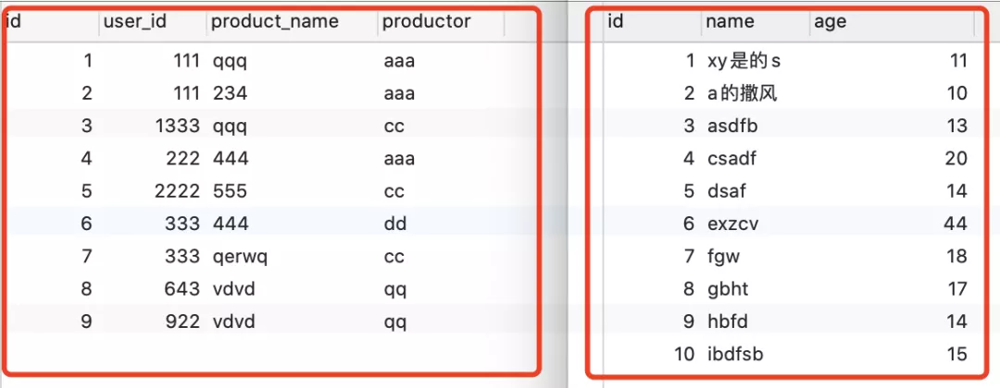我们看下explain到底会输出哪些东西

explain select * from user where id = 4

下图就是explain输出的内容，我们来一一解析下

**各列的含义如下**:

· 

**id**: SELECT 查询的标识符

· 

· 

**select_type**: SELECT 查询的类型.

· 

§ **simple**：进行不需要Union操作或不含子查询的简单select查询时，响应查询语句的select_type 即为simple

§ **primary**：一个需要Union操作或含子查询的select查询执行计划中，位于最外层的select_type即为primary。与simple一样，select_type为primary的单位select查询也只存在1个，位于查询最外侧的select单位查询的select_type为primary

§ **union**：由union操作联合而成的单位select查询中，除第一个外，第二个以后的所有单位select查询的select_type都为union。union的第一个单位select的select_type不是union，而是DERIVED。它是一个临时表，用于存储联合（Union）后的查询结果。

§ **DEPENDENT UNION dependent**：与UNION  select_type一样，dependent union出现在union或union all 形成的集合查询中。此处的dependent表示union或union all联合而成的单位查询受外部影响。下列查询中，两个select 查询用union联合起来，所一union出阿信在select_type中，从in所包含的子查询中可以看到，两个查询通过union连接在一起。MariaDB中，不会在默认优化器模式下先处理IN（subquery）查询内部的子查询，而是读取外部的employees数据表，再执行子查询时，dependent关键字就会出现在select_type中。

§ **union result**：union result为包含union结果的数据表。MariaDB中，union all或union（DISTINCT）查询会将所有union结果创建为临时表。执行计划中，该临时表所在行为select_type为union result。由于union result在实际查询中不是单位查询，所以没有单独的id值。

§ **SUBQUERY**：子查询中第一个select

§ **DEPENDENT SUBQUERY**：子查询中的第一个 SELECT, 取决于外面的查询. 即子查询依赖于外层查询的结果.

· 

**table**: 查询的是哪个表

· 

· 

**partitions**: 匹配的分区

· 

· 

**type**: 通过 type 字段, 我们判断此次查询是 全表扫描 还是 索引扫描 等.

· 

§ **system**：表中只有一条数据. 这个类型是特殊的 const 类型.

§ **const**：针对主键或唯一索引的等值查询扫描, 最多只返回一行数据. const 查询速度非常快, 因为它仅仅读取一次即可. 例如下面的这个查询, 它使用了主键索引, 因此 type 就是 const 类型的.

explain select * from user where id = 4

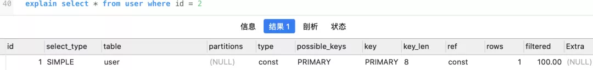 

· **eq_ref**：此类型通常出现在多表的 join 查询, 表示对于前表的每一个结果, 都只能匹配到后表的一行结果. 并且查询的比较操作通常是 =, 查询效率较高. 例如:

EXPLAIN SELECT * FROM user, tuya_gravity.order WHERE user.id = tuya_gravity.order.user_id

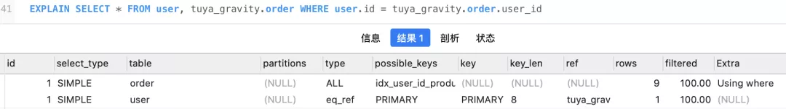 

· **ref**：此类型通常出现在多表的 join 查询, 针对于非唯一或非主键索引, 或者是使用了 最左前缀 规则索引的查询. 例如下面这个例子中, 就使用到了 ref 类型的查询:

EXPLAIN SELECT * FROM user, tuya_gravity.order WHERE user.id = tuya_gravity.order.user_id AND tuya_gravity.order.user_id = 5

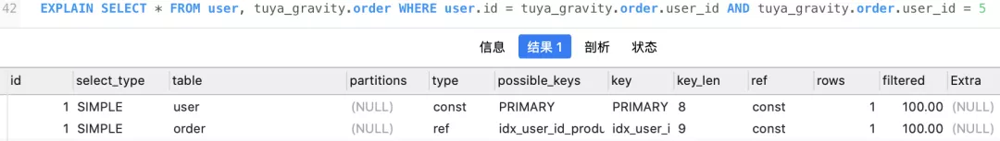 

· **range**：表示使用索引范围查询, 通过索引字段范围获取表中部分数据记录. 这个类型通常出现在 =, <>, >, >=, <, <=, IS NULL, <=>, BETWEEN, IN() 操作中. 当 type 是 range 时, 那么 EXPLAIN 输出的 ref 字段为 NULL, 并且 key_len 字段是此次查询中使用到的索引的最长的那个.

EXPLAIN SELECT * FROM user WHERE id BETWEEN 1 AND 11

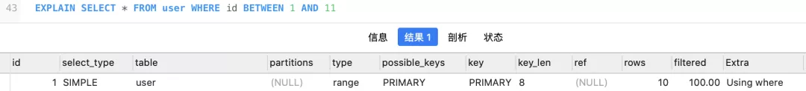 

· **index**：表示全索引扫描(full index scan), 和 ALL 类型类似, 只不过 ALL 类型是全表扫描, 而 index 类型则仅仅扫描所有的索引, 而不扫描数据. index 类型通常出现在: 所要查询的数据直接在索引树中就可以获取到, 而不需要扫描数据. 当是这种情况时, Extra 字段 会显示 Using index.

EXPLAIN SELECT name FROM user

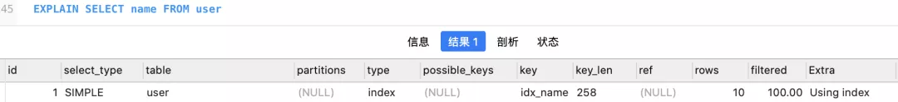 

· **all**：表示全表扫描, 这个类型的查询是性能最差的查询之一. 通常来说, 我们的查询不应该出现 ALL 类型的查询, 因为这样的查询在数据量大的情况下, 对数据库的性能是巨大的灾难. 如一个查询是 ALL 类型查询, 那么一般来说可以对相应的字段添加索引来避免. 下面是一个全表扫描的例子, 可以看到, 在全表扫描时, possible_keys 和 key 字段都是 NULL, 表示没有使用到索引, 并且 rows 十分巨大, 因此整个查询效率是十分低下的.

EXPLAIN SELECT age FROM user WHERE age = 20

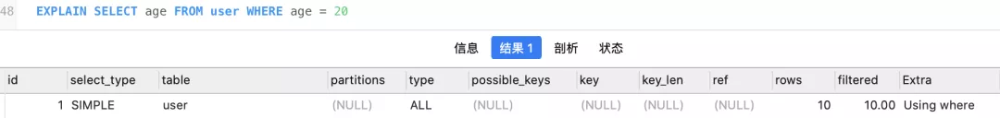 

· 

**possible_keys**: 此次查询中可能选用的索引

· 

· 

**key**: 此次查询中确切使用到的索引.

· 

· 

**key_len**: 表示查询优化器使用了索引的字节数. 这个字段可以评估组合索引是否完全被使用, 或只有最左部分字段被使用到.

· 

· 

**ref**: 哪个字段或常数与 key 一起被使用

· 

· 

**rows**: 显示此查询一共扫描了多少行. 这个是一个估计值.

· 

· 

**filtered**: 表示此查询条件所过滤的数据的百分比

· 

· 

**extra**: 额外信息

· 

§ **Using filesort**:当 Extra 中有 Using filesort 时, 表示 MySQL 需额外的排序操作, 不能通过索引顺序达到排序效果. 一般有 Using filesort, 都建议优化去掉, 因为这样的查询 CPU 资源消耗大.

EXPLAIN SELECT id FROM tuya_gravity.order ORDER BY product_name

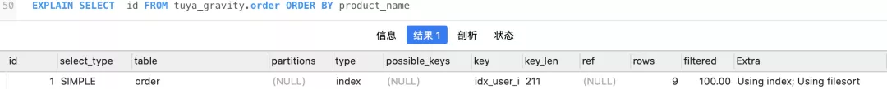    这个时候我们是没有用到索引的，如果改成ORDER BY user_id, product_name就可以利用我们的最左前缀原则用到索引了，例如

EXPLAIN SELECT id FROM tuya_gravity.order ORDER BY user_id,product_name

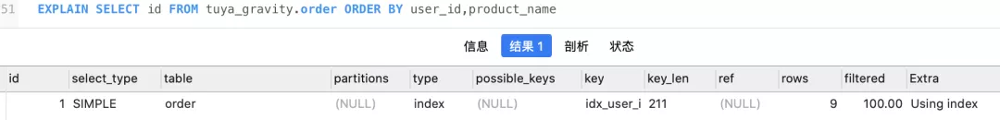 

· **Using index**:"覆盖索引扫描", 表示查询在索引树中就可查找所需数据, 不用扫描表数据文件, 往往说明性能不错

· **Using temporary**:查询有使用临时表, 一般出现于排序, 分组和多表 join 的情况, 查询效率不高, 建议优化.

 