# 《面试八股文》之 JVM 20卷

1.说说 JVM 内存区域
2.垃圾对象是怎么找到的？
3.GC Roots 有哪些?
4.java 有哪四种引用类型?
5.说一说分代收集理论
6.垃圾收集算法有哪些?
7.什么是 STW ?
8.为什么需要 STW?
9.垃圾回收器是怎样寻找 GC Roots 的？
10.OopMap 是做什么的?有什么好处?
11.什么是安全点?
12.安全区域是什么?解决了什么问题
13.常见的垃圾回收器?
14.说说三色标记
15.什么情况下会发生栈内存溢出？
16.如何排查 OOM 的问题？
17.说一说类加载机制是什么?加载的过程又是怎么样的?
18.介绍一下双亲委派模型,它的好处是什么?
19.说一说对象的栈上分配吧?
20.说一说对象的内存布局是怎样的?
------
## **1.说说 JVM 内存区域**
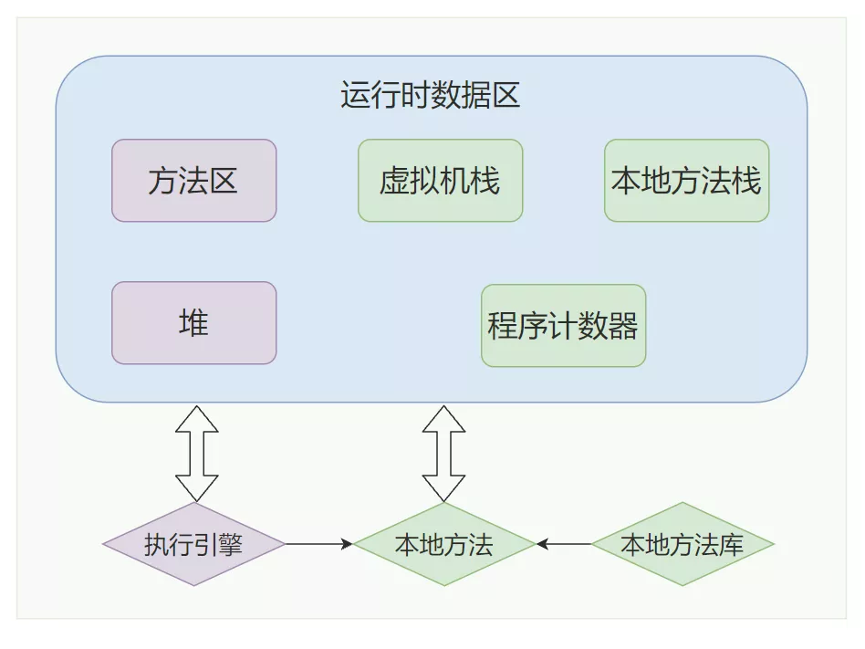JVM 内存区域
这张图就是一个 JVM 运行时数据图，**「紫色区域代表是线程共享的区域」**，JAVA 程序在运行的过程中会把他管理的内存划分为若干个不同的数据区域，**「每一块儿的数据区域所负责的功能都是不同的，他们也有不同的创建时间和销毁时间」**。
o 
**「1.程序计数器」**
o 
§ 程序计数器是**「程序控制流的指示器，循环，跳转，异常处理，线程的恢复等工作都需要依赖程序计数器去完成」**。程序计数器是**「线程私有」**的，它的**「生命周期是和线程保持一致」**的，我们知道，N 个核心数的 CPU 在同一时刻，最多有  N个线程同时运行，在我们真实的使用过程中可能会创建很多线程，JVM 的多线程其实是通过线程轮流切换，分配处理器执行时间来实现的。既然涉及的线程切换，所以每条线程必须有一个独立的程序计数器。
o 
**「2.虚拟机栈」**
o 
§ 虚拟机栈，其描述的就是线程内存模型，**「也可以称作线程栈」**，也是每个**「线程私有」**的，**「生命周期与线程保持一致」**。在每个方法执行的时候，jvm 都会同步创建一个栈帧去存储局部变量表，操作数栈，动态连接，方法出口等信息。一个方法的生命周期就贯彻了一个栈帧从入栈到出栈的全部过程。
o 
**「3.本地方法栈」**本地方法栈的概念很好理解，我们知道，java底层用了很多c的代码去实现，而其调用c端的方法上都会有native，代表本地方法服务，而本地方法栈就是为其服务的。
**「4.堆」**堆可以说是jvm中最大的一块儿内存区域了，它是所有线程共享的，不管你是初学者还是资深开发，多少都会听说过堆，毕竟几乎所有的对象都会在堆中分配。
**「5.方法区」**
o 
§ 方法区也是所有**「线程共享」**的区域，它**「存储」**了被 jvm 加载的**「类型信息、常量、静态变量等数据」**。运行时常量池就是方法区的一部分，编译期生成的各种字面量与符号引用就存储在其中。
o 
**「6.直接内存」**
o 
§ 这部分数据并**「不是 jvm 运行时数据区的一部分」**，nio 就会使用到直接内存，也可以说**「堆外内存」**，通常会**「配合虚引用一起去使用」**，就是为了资源释放，会将堆外内存开辟空间的信息存储到一个队列中，然后GC会去清理这部分空间。堆外内存优势在 IO 操作上，对于网络 IO，使用 Socket 发送数据时，能够节省堆内存到堆外内存的数据拷贝，所以性能更高。看过 Netty 源码的同学应该了解，Netty 使用堆外内存池来实现零拷贝技术。对于磁盘 IO 时，也可以使用内存映射，来提升性能。另外，更重要的几乎不用考虑堆内存烦人的 GC 问题。但是既然是内存。也会受到本机总内存的限制，
## **2.垃圾对象是怎么找到的？**
o **「1.引用计数算法」**
就是给对象添加一个计数器
o 每当有一个地方引用它的时候，计数器就加1
o 每当有一个引用失效的时候，计数器就减1
「**「当计数器的值为0的时候，那么该对象就是垃圾了」**」这种方案的原理很简单，而且判定的效率也非常高，但是却可能会有其他的额外情况需要考虑。
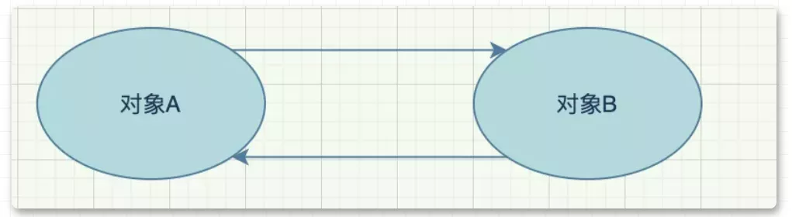相互引用
比如两个「**「对象循环引用」**」，a 对象引用了 b 对象，b 对象也引用了 a 对象，a、b 对象却没有再被其他对象所引用了，其实正常来说这两个对象已经是垃圾了，因为没有其他对象在使用了，但是计数器内的数值却不是 0，所以引用计数算法就无法回收它们。这种算法是比较「**「直接的找到垃圾」**」，然后去回收，也被称为"直接垃圾收集"。
o **「2.根可达算法」**
这也是「**「JVM 默认使用」**」的寻找垃圾算法它的原理就是定义了一系列的根，我们把它称为 **「「"GC Roots"」」** ，从 **「「"GC Roots"」」** 开始往下进行搜索，走过的路径我们把它称为 **「「"引用链"」」** ，当一个对象到 **「「"GC Roots"」」** 之间没有任何引用链相连时，那么这个对象就可以被当做垃圾回收了。
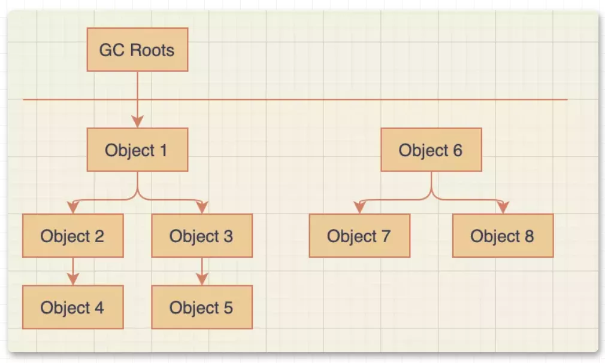root search
如图，「**「根可达算法」**」就可以「**「避免」**」计数器算法不好解决的「**「循环引用问题」**」，Object 6、Object 7、Object 8彼此之前有引用关系，但是**「没有与「"GC Roots"」 相连，那么就会被当做垃圾所回收」**。
## **3.GC Roots 有哪些?**
在java中，有「**「固定的GC Roots 对象」**」和「**「不固定的临时GC Roots对象」**:」
「**「固定的GC Roots:」**」
o 1.在「**「虚拟机栈(栈帧的本地变量表)中所引用的对象」**」，譬如各个线程被调用的方法堆栈中使用到的参数、局部变量、临时变量等。
o 在方法区中「类静态属性引用的对象」，譬如 Java 类的**「引用静态变量」**。
o 在方法区中「**「常量引用的对象」**」，譬如字符串常量池中的引用。
o 在方法区栈中 **「「JNI (譬如 Native 方法)引用的对象」」**。
o Java **「「虚拟机内部的引用」」**，如基本数据类型对应的 Class 对象，一些常驻的异常对象(空指针异常、OOM等)，还有类加载器。
o 所有「**「被 Synchronized 持有的对象」**」。
o 反应 Java 虚拟机内部情况的 **「「JMXBean、JVMTI 中注册的回调本地代码缓存等」」**。
「**「临时GC Roots:」**」
o 「**「为什么会有临时的 GC Roots ？」**」:目前的垃圾回收大部分都是「**「分代收集和局部回收」**」，如果只针对某一部分区域进行局部回收，那么就必须要考虑的「**「当前区域的对象有可能正被其他区域的对象所引用」**」，这时候就要将这部分关联的对象也添加到 GC Roots 中去来确保根可达算法的准确性。这种算法是利用了「**「逆向思维」**」，找到使用的对象，剩下的就是垃圾，也被称为"间接垃圾收集"。
## **4.java 有哪四种引用类型?**
o **「1.强引用」**
"Object o = new Object()" 就是一种强引用关系，这也是我们在代码中最常用的一种引用关系。无论任何情况下，只要强引用关系还存在，垃圾回收器就不会回收掉被引用的对象。
o **「2.软引用」**
当内存空间不足时，就会回收软引用对象。
// 软引用  
SoftReference<String> softRef = new SoftReference<String>(str);
软引用用来描述那些有用但是没必要的对象。
o **「3.弱引用」**
弱引用要比软引用更弱一点，它「**「只能够存活到下次垃圾回收之前」**」。也就是说，垃圾回收器开始工作，会回收掉所有只被弱引用关联的对象。
WeakReference<String> weakRef = new WeakReference<String>(str);
在 **「ThreadLocal」** 中就使用了弱引用来防止内存泄漏。
o **「4.虚引用」**
虚引用是最弱的一种引用关系，它的唯一作用是用来作为一种通知。如零拷贝(Zero Copy)，开辟了堆外内存，虚引用在这里使用，会将这部分信息存储到一个队列中，以便于后续对堆外内存的回收管理。
## **5.说一说分代收集理论**
大多数的垃圾回收器都遵循了分代收集的理论进行设计，它建立在两个分代假说之上:
o **「「弱分代假说」」**:绝大多数对象都是朝生夕灭的。
o **「「强分代假说」」**:熬过越多次数垃圾回收过程的对象就越难消亡。
这两种假说的设计原则都是相同的:垃圾收集器「**「应该将jvm划分出不同的区域」**」，把那些较难回收的对象放在一起（一般指老年代），这个区域的垃圾回收频率就可以降低，减少垃圾回收的开销。剩下的区域(一般指新生代)可以用较高的频率去回收，并且只需要去关心那些存活的对象，也不用标记出需要回收的垃圾，这样就能够以较低的代价去完成垃圾回收。
o **「「跨代引用假说」」**：如果某个新生代的对象存在了跨代引用，但是老年代的对象是很难消亡的，那么随着时间的推移，这个新生代对象也会慢慢晋升为老年代对象，那么这种跨代引用也就被消除了。
由于跨代引用是很少的，所以我们不应该为了少量的跨代引用去扫描整个老年代的数据，只需要在新生代对象建立一个「**「记忆集」**」来记录引用信息。记忆集:「**「将老年代分为若干个小块，每块区域中有 N 个对象」**」，在对象引用信息发生变动的时候来维护记忆集数据的准确性，这样每次发生了 「**「"Minor GC"」**」 的时候只需要将记忆集中的对象添加到 「**「"GC Roots"」**」 中就可以了。
## **6.垃圾收集算法有哪些?**
总共有三种
o **「1.标记清除算法」**
这种算法的实现是很简单的，有两种方式
o 1.标记出垃圾，然后清理掉
o 2.标记出存货的对象，回收其他空间
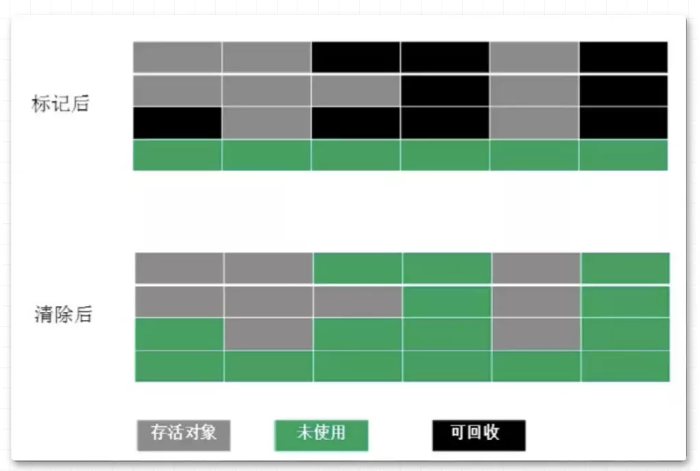标记清除算法
这种算法有两个**「缺点」**
o 
1.随着对象越来越多，那么所需要消耗的时间就会越来越多
2.标记清除后会导致碎片化，如果有大对象分配很有可能分配不下而出发另一次的垃圾收集动作
**「2.标记复制算法」**
o 
这种算法解决了第一种算法碎片化的问题。就是「**「开辟两块完全相同的区域」**」，对象只在其中一篇区域内分配，然后「**「标记」**」出那些「**「存活的对象，按顺序整体移到另外一个空间」**」，如下图，可以看到回收后的对象是排列有序的，这种操作只需要移动指针就可以完成，效率很高，「**「之后就回收移除前的空间」**」。
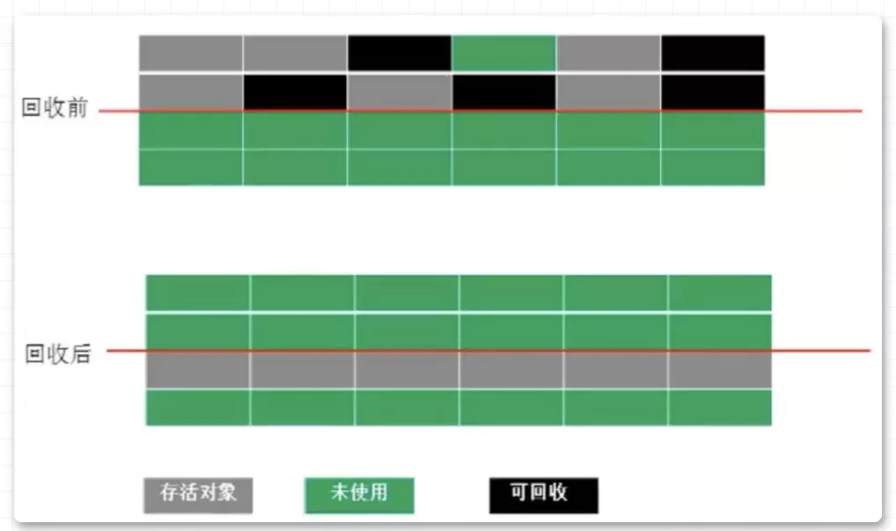标记复制算法
这种算法的缺点也是很明显的
o 
浪费过多的内存，使现有的「**「可用空间变为」**」原先的「**「一半」**」
**「3.标记整理算法」**
o 
这种算法可以说是结合了前两种算法，既有标记删除，又有整理功能。
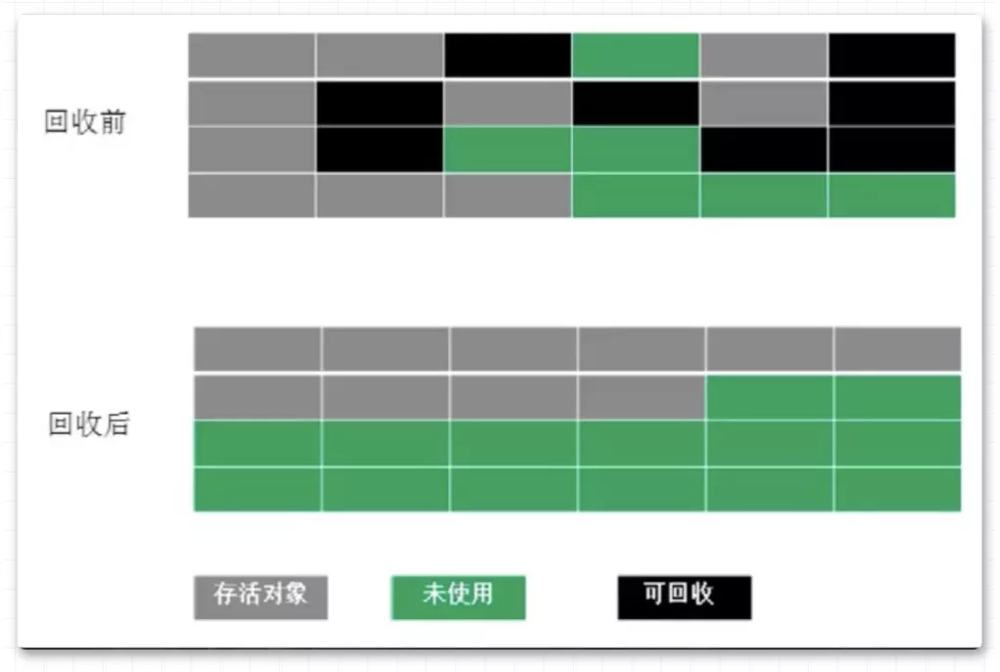标记整理算法
这种算法就是通过标记清除算法找到存活的对象，然后将所有「**「存活的对象，向空间的一端移动」**」，然后回收掉其他的内存。
## **7.什么是 STW ?**
Java 中「**「Stop-The-World机制简称 STW」**」 ，是在执行垃圾收集算法时，Java 应用程序的其他所有线程都被挂起（除了垃圾收集帮助器之外）。**「Java 中一种全局暂停现象，全局停顿」**，所有 Java 代码停止，native 代码可以执行，但不能与 JVM 交互。
## **8.为什么需要 STW?**
在 java 应用程序中「**「引用关系」**」是不断发生「**「变化」**」的，那么就会有会有很多种情况来导致「**「垃圾标识」**」出错。想想一下如果 Object a  目前是个垃圾，GC 把它标记为垃圾，但是在清除前又有其他对象指向了 Object a，那么此刻 Object a 又不是垃圾了，那么如果没有 STW 就要去无限维护这种关系来去采集正确的信息。再举个例子，到了秋天，道路上洒满了金色的落叶，环卫工人在打扫街道，却永远也无法打扫干净，因为总会有不断的落叶。
## **9.垃圾回收器是怎样寻找 GC Roots 的？**
我们在前面说明了根可达算法是通过 GC Roots 来找到存活的对象的，也定义了 GC Roots，那么垃圾回收器是怎样寻找GC Roots 的呢？首先，**「「为了保证结果的准确性，GC Roots枚举时是要在STW的情况下进行的」」**，但是由于 JAVA 应用越来越大，所以也不能逐个检查每个对象是否为 GC Root，那将消耗大量的时间。一个很自然的想法是，能不能用空间换时间，在某个时候把栈上代表引用的位置全部记录下来，这样到真正 GC 的时候就可以直接读取，而不用再一点一点的扫描了。事实上，大部分主流的虚拟机也正是这么做的，比如 HotSpot ，它使用一种叫做 **「「OopMap」」** 的数据结构来记录这类信息。
## **10.OopMap 是做什么的?有什么好处?**
我们知道，一个线程意味着一个栈，一个栈由多个栈帧组成，一个栈帧对应着一个方法，一个方法里面可能有多个安全点。gc 发生时，程序首先运行到最近的一个安全点停下来，然后更新自己的 OopMap ，记下栈上哪些位置代表着引用。枚举根节点时，递归遍历每个栈帧的 OopMap ，通过栈中记录的被引用对象的内存地址，即可找到这些对象（ GC Roots ）。使用 OopMap 可以「**「避免全栈扫描」**」，加快枚举根节点的速度。但这并不是它的全部用意。它的另外一个更根本的作用是，可以帮助 HotSpot 实现准确式 GC (即使用准确式内存管理，虚拟机可用知道内存中某个位置的数据具体是什么类型) 。
## **11.什么是安全点?**
从线程角度看，安全点可以理解成是在「**「代码执行过程中」**」的一些「**「特殊位置」**」，当线程执行到这些位置的时候，说明「**「虚拟机当前的状态是安全」**」的。比如：「**「方法调用、循环跳转、异常跳转等这些地方才会产生安全点」**」。如果有需要，可以在这个位置暂停，比如发生GC时，需要暂停所有活动线程，但是线程在这个时刻，还没有执行到一个安全点，所以该线程应该继续执行，到达下一个安全点的时候暂停，等待 GC 结束。那么如何让线程在垃圾回收的时候都跑到最近的安全点呢？这里有「**「两种方式」**」：
o **「抢先式中断」**
§ 抢先式中断：就是在stw的时候，先让所有线程「**「完全中断」**」，如果中断的地方不在安全点上，然后「**「再激活」**」，「**「直到运行到安全点的位置」**」再中断。
o **「主动式中断」**
§ 主动式中断：在安全点的位置打一个标志位，每个线程执行都去轮询这个标志位，如果为真，就在最近的安全点挂起。
## **12.安全区域是什么?解决了什么问题**
刚刚说到了主动式中断,但是如果有些线程处于sleep状态怎么办呢？
为了解决这种问题，又引入了安全区域的概念安全区域是指「**「在一段代码片中，引用关系不会发生改变」**」，实际上就是一个安全点的拓展。当线程执行到安全区域时，首先标识自己已进入安全区域，那样，当在这段时间里 JVM 要发起 GC 时，就不用管标识自己为“安全区域”状态的线程了，该线程只能乖乖的等待根节点枚举完或者整个GC过程完成之后才能继续执行。
## **13.常见的垃圾回收器?**
前面和大家聊了很多垃圾收集算法，所以在真正实践的时候会有多种选择，垃圾回收器就是真正的实践者，接下来就和大家聊聊10种垃圾回收器
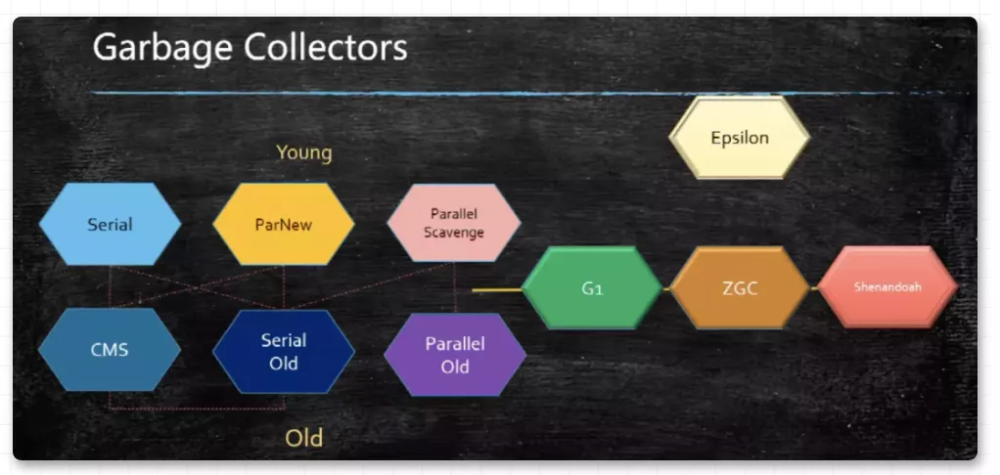 
o **「1.Serial」**
Serial是一个「**「单线程」**」的垃圾回收器，「**「采用复制算法负责新生代」**」的垃圾回收工作，可以与 CMS 垃圾回收器一起搭配工作。
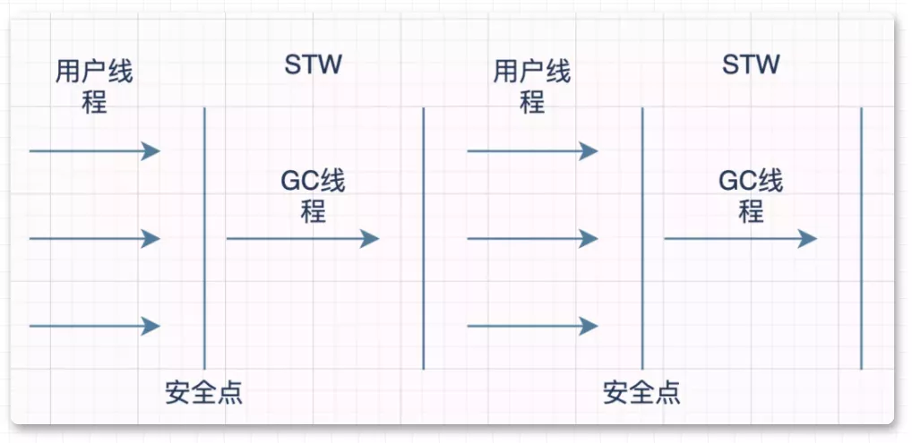Serial
在 STW 的时候「**「只会有一条线程」**」去进行垃圾收集的工作，所以可想而知，它的效率会比较慢。但是他确是所有垃圾回收器里面消耗额外内存最小的，没错，就是因为简单。
o **「2.ParNew」**
ParNew 是一个「**「多线程」**」的垃圾回收器，**「采用复制算法负责新生代」**的垃圾回收工作，可以与CMS垃圾回收器一起搭配工作。
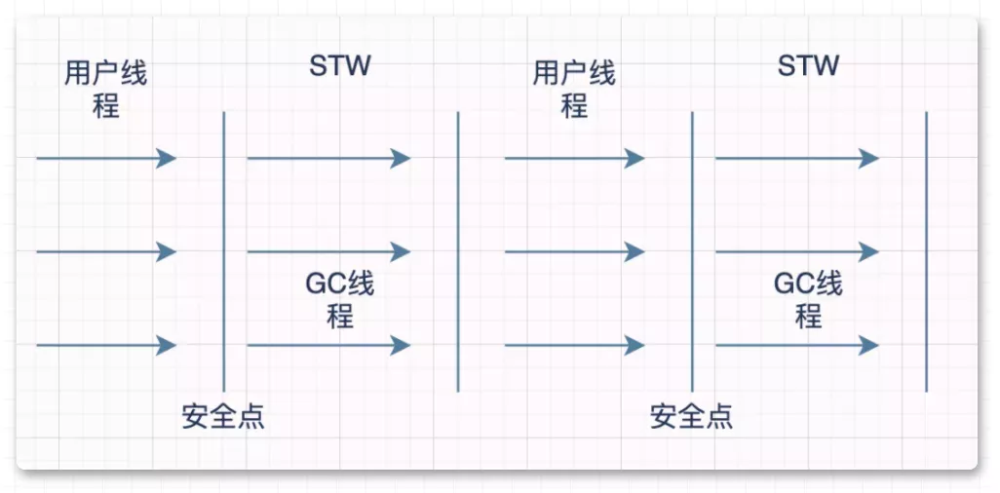ParNew
它其实就是 Serial 的多线程版本，主要区别就是在 STW 的时候可以用多个线程去清理垃圾。
o **「3.Pararllel Scavenge」**
Pararllel Scavenge 是一个「**「多线程」**」的垃圾回收器，「**「采用复制算法负责新生代」**」的垃圾回收工作，可以与 Serial Old ， Parallel Old 垃圾回收器一起搭配工作。
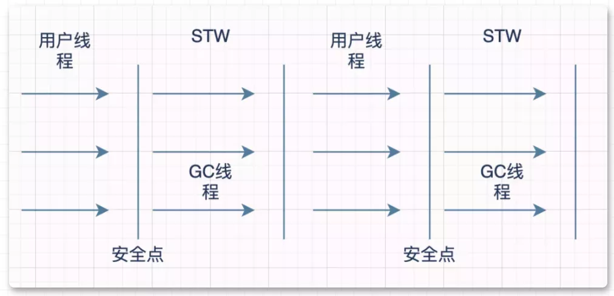Pararllel Scavenge
是与 ParNew 类似，都是用于年轻代回收的使用复制算法的并行收集器，与 ParNew 不同的是，Parallel Scavenge 的「**「目标是达到一个可控的吞吐量」**」。吞吐量=程序运行时间/（程序运行时间+GC时间）。如程序运行了99s，GC耗时1s，吞吐量=99/（99+1）=99%。Parallel Scavenge 提供了两个参数用以精确控制吞吐量，分别是用以控制最大 GC 停顿时间的 -XX:MaxGCPauseMillis 及直接控制吞吐量的参数 -XX:GCTimeRatio.「**「停顿时间越短就越适合需要与用户交互的程序」**」，良好的响应速度能提升用户体验，而高吞吐量则可以高效的利用 CPU 时间，尽快完成程序的运算任务，主要适合在后台运算而不需要太多交互的任务。
o **「4.Serial Old」**
Serial Old 是一个「**「单线程」**」的垃圾回收器，「**「采用标记整理算法负责老年代」**」的垃圾回收工作，有可能还会配合 「**「CMS」**」 一起工作。
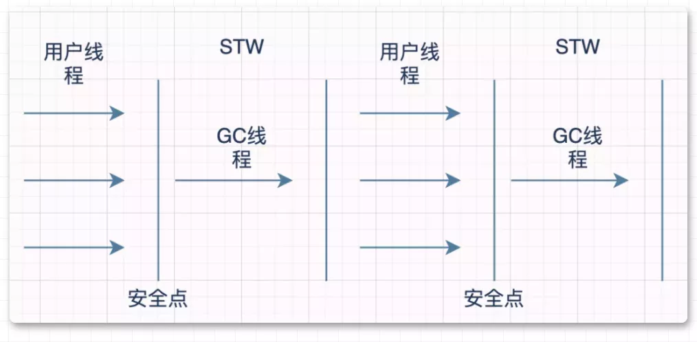 
其实它就是 Serial 的老年代版本，整体链路和 Serial 大相径庭。
o **「5.Parallel Old」**
Parallel Old 是一个「**「多线程」**」的垃圾回收器，「**「采用标记整理算法负责新生代」**」的垃圾回收工作，可以与 Parallel Scavenge 垃圾回收器一起搭配工作。
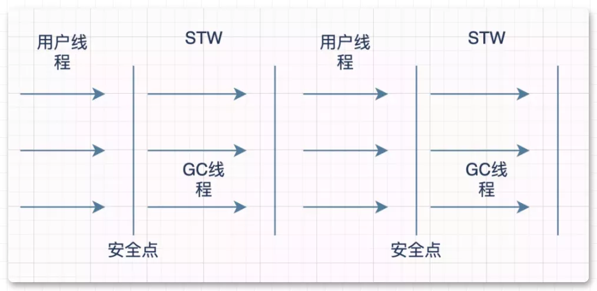 
Parallel Old 是 Pararllel Scavenge 的老年代版本，它的设计思路也是以吞吐量优先的，ps+po 是很常用的一种组合。
o **「6.CMS」**
CMS可以说是一款具有"跨时代"意义的垃圾回收器，支持了和用户线程一起工作，做到了**「一起并发回收垃圾」**的"壮举"。
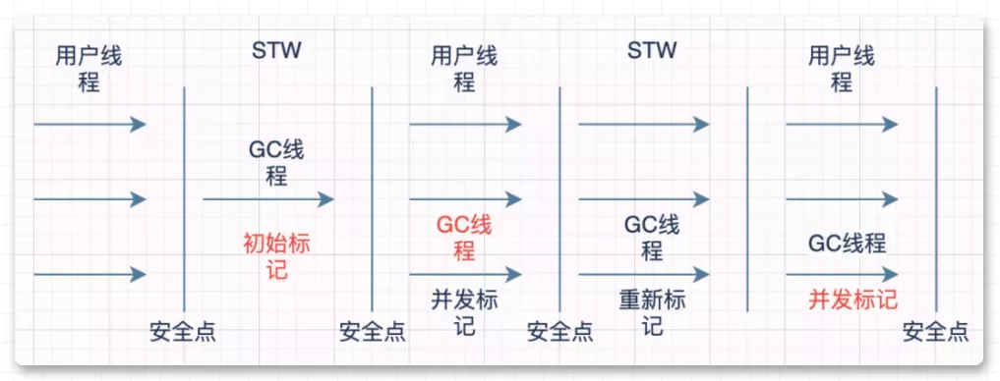CMS
o 
**「1.初始标记」**
初始标记只是标记出来「**「和 GC Roots 直接关联」**」的对象，整个速度是非常快的，为了保证标记的准确，这部分会在 「**「STW」**」 的状态下运行。
**「2.并发标记」**
并发标记这个阶段会直接根据第一步关联的对象找到「**「所有的引用」**」关系，这一部分时刻用户线程「**「并发运行」**」的，虽然耗时较长，但是不会有很大的影响。
**「3.重新标记」**
重新标记是为了解决第二步并发标记所导致的标错情况，这里简单举个例子：并发标记时a没有被任何对象引用，此时垃圾回收器将该对象标位垃圾，在之后的标记过程中，a又被其他对象引用了，这时候如果不进行重新标记就会发生「**「误清除」**」。这部分内容也是在「**「STW」**」的情况下去标记的。
**「4.并发清除」**
这一步就是最后的清除阶段了，将之前「**「真正确认为垃圾的对象回收」**」，这部分会和用户线程一起并发执行。
o 
CMS的「**「三个缺点」**」：
o 
**「1.影响用户线程的执行效率」**
o 
§ CMS默认启动的回收线程数是（处理器核心数 + 3）/ 4 ,由于是和用户线程一起并发清理，那么势必会影响到用户线程的执行速度，并且这个影响「**「随着核心线程数的递减而增加」**」。所以 JVM 提供了一种 "「**「增量式并发收集器」**」"的 CMS 变种，主要是用来减少垃圾回收线程独占资源的时间，所以会感觉到回收时间变长，这样的话「**「单位时间内处理垃圾的效率就会降低」**」，也是一种缓和的方案。
o 
**「2.会产生"浮动垃圾"」**
o 
§ 之前说到 CMS 真正清理垃圾是和用户线程一起进行的，在「**「清理」**」这部分垃圾的时候「**「用户线程会产生新的垃圾」**」，这部分垃圾就叫做浮动垃圾，并且只能等着下一次的垃圾回收再清除。
o 
**「3.会产生碎片化的空间」**
o 
§ CMS 是使用了标记删除的算法去清理垃圾的，而这种算法的缺点就是会产生「**「碎片化」**」，后续可能会「**「导致大对象无法分配」**」从而触发「**「和 Serial Old 一起配合使用」**」来处理碎片化的问题，当然这也处于 「**「STW」**」的情况下，所以当 java 应用非常庞大时，如果采用了 CMS 垃圾回收器，产生了碎片化，那么在 STW 来处理碎片化的时间会非常之久。
o 
**「7.G1」**
o 
G1(Garbage First)：顾名思义，「**「垃圾回收第一」**」，官方对它的评价是在垃圾回收器技术上具有「**「里程碑式」**」的成果。G1 回收的目标不再是整个新生代，不再是整个老年代，也不再是整个堆了。G1 可以「**「面向堆内存的任何空间来进行」**」回收，衡量的标准也不再是根据年代来区分，而是哪块「**「空间的垃圾最多就回收哪」**」块儿空间，这也符合 G1 垃圾回收器的名字，垃圾第一，这就是 G1 的 「**「Mixed GC」**」 模式。当然我的意思是「**「垃圾回收不根据年代来区分」**」，但是 G1 还是「**「根据年代来设计」**」的，我们先来看下 G1 对于堆空间的划分：
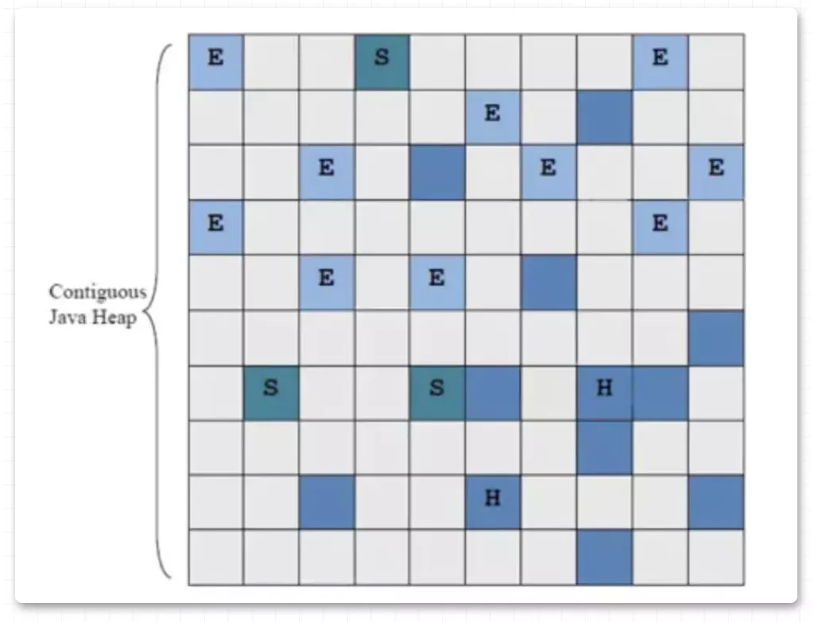G1
G1 垃圾回收器把堆划分成一个个「**「大小相同的Region」**」，每个 Region 都会扮演一个角色，H、S、E、O。E代表伊甸区，S代表 Survivor 区，H代表的是 Humongous(G1用来分配「**「大对象的区域」**」，对于 Humongous 也分配不下的超大对象，会分配在连续的 N 个 Humongous 中)，剩余的深蓝色代表的是 Old 区，灰色的代表的是空闲的 region。在 HotSpot 的实现中，整个堆被划分成2048左右个 Region。每个 Region 的大小在1-32MB之间，具体多大取决于堆的大小。在并发标记垃圾时也会产生新的对象，G1 对于这部分对象的处理是这样的：将 Region 「**「新增一块并发回收过程中分配对象的空间」**」，并为此设计了两个 TAMS(Top at Mark Start)指针，这块区域专门用来在并发时分配新对象，有对象新增只需要将 TAMS 指针移动下就可以了，并且这些「**「新对象默认是标记为存活」**」，这样就「**「不会干扰到标记过程」**」。
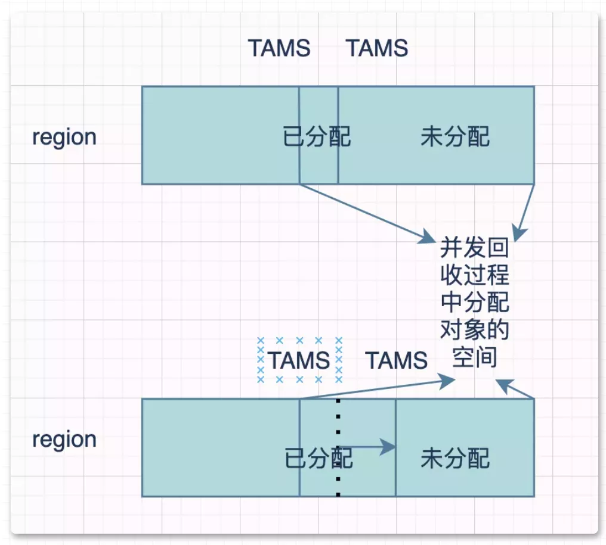 
但是这种方法也会有个问题，有可能「**「垃圾回收的速度小于新对象分配的速度」**」，这样会导致 "Full GC" 而产生长时间的 STW。在 G1 的设计理念里，「**「最小回收单元是 Region」**」，每次回收的空间大小都是Region的N倍，那么G1是「**「怎么选择要回收哪块儿区域」**」的呢？G1 会跟踪各个 Region 区域内的垃圾价值，和回收空间大小回收时间有关，然后「**「维护一个优先级列表」**」，来收集那些价值最高的Reigon区域。
#### **执行的步骤：**
o 
**「初始标记」**：
o 
§ 标记出来 GC Roots 能「**「直接关联」**」到的对象
§ 修改 TAMS 的值以便于并发回收时新对象分配
§ 是在 Minor GC 时期(**「「STW」」**)完成的
o 
**「并发标记」**：
o 
§ 根据刚刚关联的对像扫描整个对象引用图，和用户线程**「并发执行」**
§ 记录 SATB(原始快照) 在并发时有引用的值
o 
**「最终标记」**：
o 
§ 处于 **「「STW」」**，处理第二步遗留下来的少量 SATB(原始快照) 记录
o 
**「筛选回收」**：
o 
§ 维护之前提到的优先级列表
§ 根据「**「优先级列表」**」，「**「用户设置的最大暂停时间」**」来回收 Region
§ 将需要回收的 Region 内存活的对象「**「复制」**」到不需要回收的 Region区域内，然后回收需要回收的 Region
§ 这部分是处于 「**「STW」**」 下执行，并且是多线程的
## **14.说说三色标记**
这里我们又提到了一个概念叫做 **「「SATB 原始快照」」**，关于SATB会延伸出有一个概念，**「「三色标记算法」」**，也就是垃圾回收器标记垃圾的时候使用的算法，这里我们简单说下：将对象分为「**「三种颜色」**」：
o 白色：没被 GC 访问过的对象(被 GC 标记完后还是白色代表是垃圾)
o 黑丝：存活的对象
o 灰色：被 GC 访问过的对象，但是对象引用链上至少还有一个引用没被扫描过
我们知道在 **「「并发标记」」** 的时候 **「「可能会」」** 出现 **「「误标」」** 的情况，这里举两个例子：
o 1.刚开始标记为 **「「垃圾」」** 的对象，但是在并发标记过程中 **「「变为了存活对象」」**
o 2.刚开始标记为 **「「存活」」** 的对象，但是在并发标记过程中  **「「变为了垃圾对象」」**
第一种情况影响还不算很大，只是相当于垃圾没有清理干净，待下一次清理的时候再清理一下就好了。第二种情况就危险了，正在使 **「「用的对象的突然被清理掉」」** 了，后果会很严重。那么 **「「产生上述第二种情况的原因」」** 是什么呢？
o 1.**「「新增」」** 一条或多条 **「「黑色到白色」」** 对象的新引用
o 2.删除 **「「了」」** 灰色 **「「对象」」** 到该白色对象 **「「的直接」」** 引用或间接引用。
当这两种情况 **「「都满足」」** 的时候就会出现这种问题了。所以为了解决这个问题，引入了 **「「增量更新」」** (Incremental Update)和 **「「原始快照」」** (SATB)的方案：
o 增量更新破坏了第一个条件：**「「增加新引用时记录」」** 该引用信息，在后续 STW 扫描中重新扫描(CMS的使用方案)。
o 原始快照破坏了第二个条件：**「「删除引用时记录下来」」**，在后续 STW 扫描时将这些记录过的灰色对象为根再扫描一次(G1的使用方案)。
## **15.什么情况下会发生栈内存溢出？**
Java 栈内存溢出可能抛出两种异常，两种异常虽然都发生在栈内存，但是两者导致内存溢出的根本原因是不一样的：
o 
1.**「如果线程请求分配的栈容量超过 Java 虚拟机栈允许的最大容量的时候」**，Java 虚拟机将抛出一个 StackOverFlowError 异常。
2.如果 Java 虚拟机栈可以动态拓展，并且扩展的动作已经尝试过，但是目前**「无法申请到足够的内存去完成拓展，或者在建立新线程的时候没有足够的内存去创建对应的虚拟机栈」**，那 Java 虚拟机将会抛出一个 OutOfMemoryError 异常。
o 
## **16.如何排查 OOM 的问题？**
o 1.增加两个参数 -XX:+HeapDumpOnOutOfMemoryError -XX:HeapDumpPath=/tmp/heapdump.hprof，当 OOM 发生时自动 dump 堆内存信息到指定目录；
o 2.同时 jstat 查看监控 JVM 的内存和 GC 情况，先观察问题大概出在什么区域；
o 3.使用工具载入到 dump 文件，分析大对象的占用情况。
## **17.说一说类加载机制是什么?加载的过程又是怎么样的?**
**「类加载机制」**:
o Java 虚拟机**「把描述类的数据从 Class 文件加载到内存，并对数据进行校验、转换解析和初始化，最终形成可以被 Jvm 可以直接使用的类型」**，这个过程就可以成为虚拟机的类加载机制。
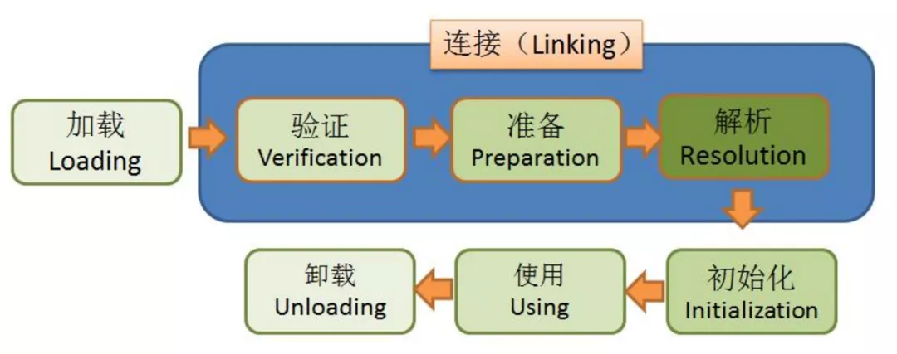 
这是一张很经典的图，标明了一个类的生命周期，而很多人一眼看过去就以为明白了类的生命周期，但是这只是其中一种情况。
真实情况是**「加载、验证、准备、初始化、卸载这五个阶段的顺序是确定的，是依次有序的」**。但是**「解析阶段有可能会在初始化之后才会进行」**，这是**「为了支持 Java 动态绑定」**的特性。
**「动态绑定」**:
o **「在运行时根据具体对象的类型进行绑定」**。提供了一些机制，可在运行期间判断对象的类型，并分别调用适当的方法。也就是说，编译器此时依然不知道对象的类型，但方法调用机制能自己去调查，找到正确的方法主体。
## **18.介绍一下双亲委派模型,它的好处是什么?**
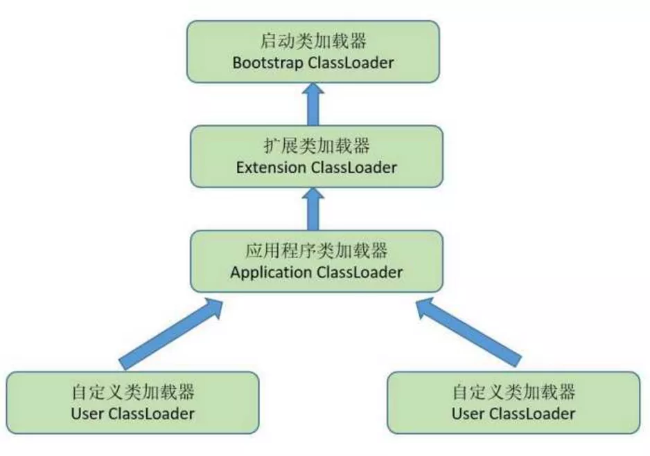 
**「双亲委派模型」**：
o 简而言之，就是说一个类加载器收到了类加载的请求，不会自己先加载，而是把它**「交给自己的父类去加载，层层迭代」**。
用上图来说明就是如果应用程序类加载器收到了一个类加载的请求，会先给扩展类加载器，然后再给启动类加载器，如果启动类加载器无法完成这个类加载的请求，再返回给扩展类加载器，如果扩展类加载器也无法完成，就返回给应用类加载器。
**「好处:」**
o 说这个问题前我要先和大家说一个概念，**「Jvm 中类的唯一性是由类本身和加载这个类的类加载器决定的」**，简单的说，如果有个a类，如果被两个不同的类加载器加载，那么他们必不相等。你看到这里会不会想到所有类的父类都是 Object 是怎么实现的了吗？是因为无论哪一个类加载器加载 Object 类，都会交给最顶层的启动类加载器去加载，这样就**「保证了 Object 类在 Jvm 中是唯一的」**。
## **19.说一说对象的栈上分配吧?**
如果所有对象都分配在堆中那么会给 GC 带来许多不必要的压力,比如有些对象的生命周期只是在当前线程中，为了减少临时对象在堆内分配的数量，就**「可以在在栈上分配」**，随着线程的消亡而消亡。当然栈上空间必须充足,否则也无法分配，在判断是否能分配到栈上的另一条件就是要经过逃逸分析，
**「逃逸分析(Escape Analysis)」**:
o 简单来讲就是：Java Hotspot 虚拟机判断这个新对象是否只会被当前线程引用，并且决定是否能够在 Java 堆上分配内存。
## **20.说一说对象的内存布局是怎样的?**
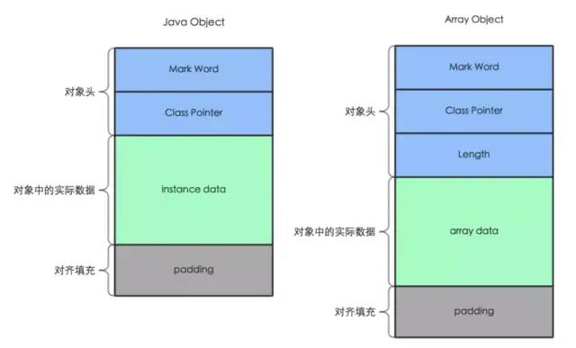对象内存布局
o **「1.对象头」**: 对象头又分为 **「MarkWord」** 和 **「Class Pointer」** 两部分。
§ **「MarkWord」**:包含一系列的标记位，比如轻量级锁的标记位，偏向锁标记位,gc记录信息等等。
§ **「ClassPointer」**:用来指向对象对应的 Class 对象（其对应的元数据对象）的内存地址。在 32 位系统占 4 字节，在 64 位系统中占 8 字节。
o **「2.Length」**:只在数组对象中存在，用来记录数组的长度，占用 4 字节
o **「3.Instance data」**: 对象实际数据，对象实际数据包括了对象的所有成员变量，其大小由各个成员变量的大小决定。(这里不包括静态成员变量，因为其是在方法区维护的)
o **「4.Padding」**:Java 对象占用空间是 8 字节对齐的，即所有 Java 对象占用 bytes 数必须是 8 的倍数,是因为当我们从磁盘中取一个数据时，不会说我想取一个字节就是一个字节，都是按照一块儿一块儿来取的，这一块大小是 8 个字节，所以为了完整，padding 的作用就是补充字节，**「保证对象是 8 字节的整数倍」**。
