# 《面试八股文》之Zookeeper12卷
1.Zookeeper 是什么？能做什么？
2.说说 Zookeeper 的数据结构吧
3.Znode里面都存储了什么？
4.Zookeeper 的系统架构又是怎么样的？
5.那你继续给我讲讲 ZAB 协议吧
6.Zookeeper初始化是如何进行Leader选举的？
7.如果Leader挂了，进入崩溃恢复，怎么选举Leader？
8.说说Wather监听机制和它的原理？
9.Zookeeper有哪些特性呢？
10.Zookeeper 如何识别请求的先后顺序？
11.选举 leader 后是怎么进行数据同步的
12.Zookeeper 会有数据不一致的情况发生吗？
------
## **1.Zookeeper 是什么？能做什么？**
Zookeeper 是一个**开源的**，是用于维护配置信息，命名，提供**分布式**同步和提供组服务的集中式服务。
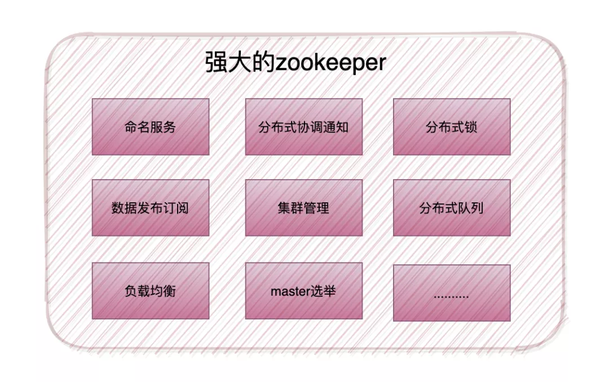 
可以基于 Zookeeper 实现诸如**数据发布/订阅、负载均衡、命名服务、分布式协调/通知、集群管理、Master 选举、分布式锁和分布式队列**等功能。
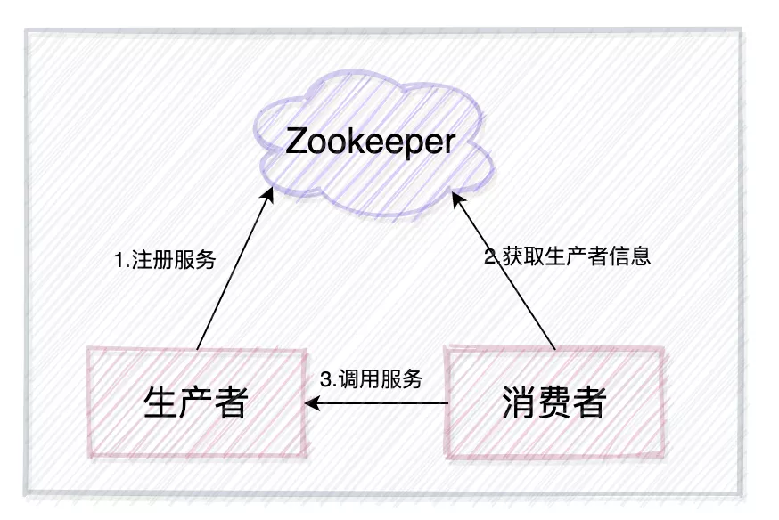 
Zookeeper 最常用的一个使用场景就是作为**注册中心**，生产者将自己提供的服务注册到 Zookeeper，然后消费者从 Zookeeper 中**拿到生产者的服务列表信息**，然后再去**调用生产者**的内容数据，比如 **Dubbo，Kafka** 都是使用 Zookeeper 作为注册中心的。
## **2.说说 Zookeeper 的数据结构吧**
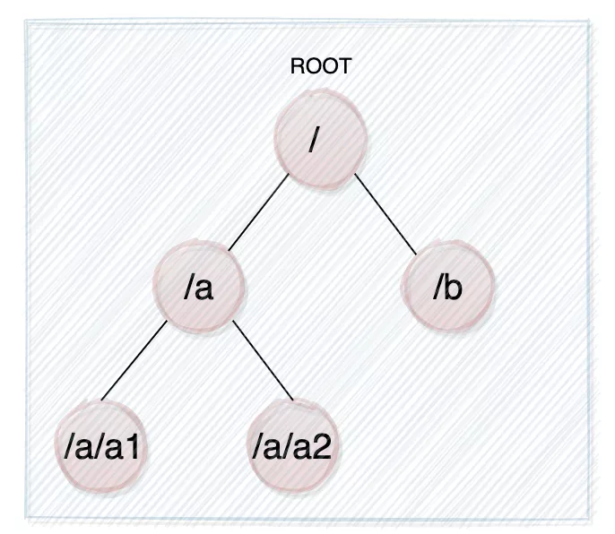 
ZooKeeper 提供的名称空间与标准文件系统的名称空间非常相似。名称是由斜杠（“ /”）分隔的一系列路径元素。ZooKeeper 命名空间中的每个 znode 均由路径标识。**每个 znode 都有一个父对象**，其路径是 znode 的前缀，元素少一个；此规则的例外是 root（“ /”），它没有父项。此外，与标准文件系统完全一样，**如果 znode 有子节点，则无法删除它**。
ZooKeeper 与标准文件系统之间的主要区别在于，**每个 znode 都可以具有与之关联的数据**（每个文件也可以是目录，反之亦然），并且 znode 限于它们可以拥有的数据量。ZooKeeper 旨在存储协调数据：状态信息，配置，位置信息等。这种元信息通常以千字节（如果不是字节）来度量。**ZooKeeper 具有1M的内置完整性检查，以防止将其用作大型数据存储**，但是通常，它用于存储小得多的数据。
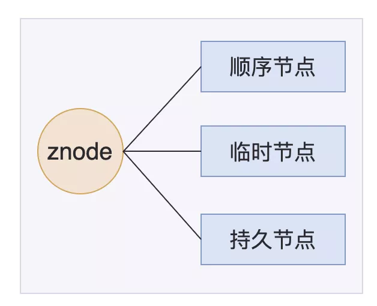 
**Znode的三种类型:**
· **持久节点**（persistent node）节点会被持久
· **临时节点**（ephemeral node），客户端断开连接后，ZooKeeper 会自动删除临时节点
· **顺序节点**（sequential node），每次创建顺序节点时，ZooKeeper 都会在路径后面自动添加上10位的数字，从1开始，最大是2147483647 （2^32-1）
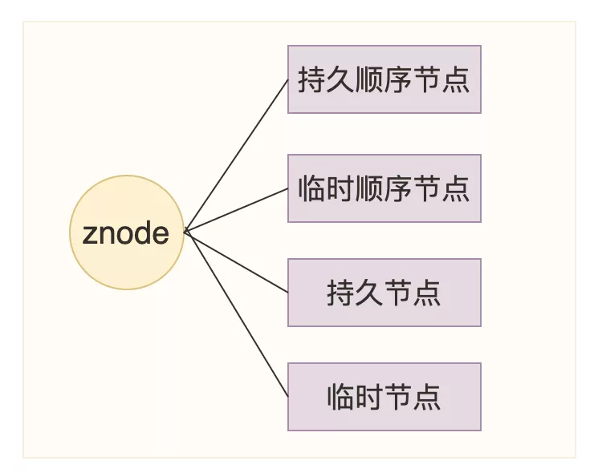 
**Znode的四种形式:**
· **持久节点**:如 create /test/a  "hello"，通过 create参数指定为持久节点
· **持久顺序节点**:通过 create -s参数指定为顺序节点
· **临时节点**:通过 create -e参数指定为顺序节点
· **临时顺序节点**:通过 create -s -e参数指定为临时及顺序节点
## **3.Znode里面都存储了什么？**
Znode包含了**存储数据(data)**、**访问权限(acl)**、**子节点引用(child)**、**节点状态信息(stat)**
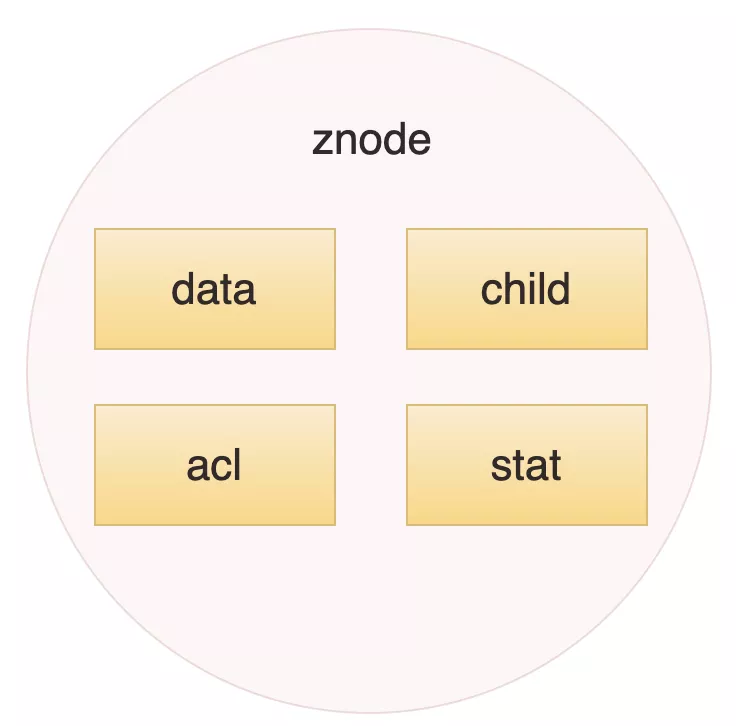 
· **data**: znode存储的业务数据信息
· **acl**: 记录客户端对znode节点的访问权限，如IP等。
· **child**: 当前节点的子节点引用
· **stat**: 包含Znode节点的状态信息，比如事务id、版本号、时间戳等等。
## **4.Zookeeper 的系统架构又是怎么样的？**
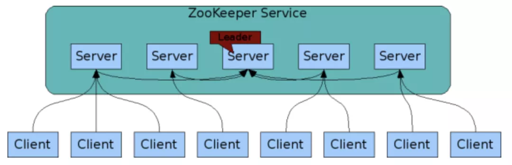 
ZooKeeper 分为**服务器端**（Server） 和**客户端**（Client），客户端可以连接到整个 ZooKeeper 服务的任意服务器上（除非 leaderServes 参数被显式设置，leader 不允许接受客户端连接），客户端使用并维护一个 **TCP 连接**，通过这个连接发送请求、接受响应、获取观察的事件以及发送信息。
组成 ZooKeeper 服务的服务器必须彼此了解。它们维护一个内存中的状态图像，以及持久存储中的事务日志和快照，只要**大多数服务器可用，ZooKeeper 服务就可用**；
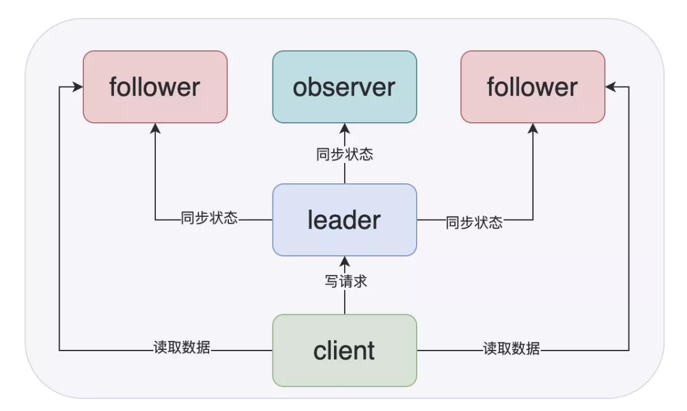 
Zookeeper 集群中**Server有三种角色**，Leader、Follower 和 Observer
· **Leader**:负责投投票的发起与决议，更新系统状态，写数据
· **Follower**:用于接收客户端请求并用来返回结果，在选主过程中参与投票
· **Observer**:可以接受客户端连接，将**写请求转发给leader**节点，但是不参与投票过程，只**同步leader状态**，主要存在目的就是**为了提高读取效率**
将 server 分为三种是为了**避免太多的从节点参与过半写**的过程，导致影响性能，这样 Zookeeper 只要使用一个几台机器的小集群就可以实现高性能了，如果要横向扩展的话，只需要增加 Observer 节点即可。
Zookeeper 建议集群节点个数为奇数，只要**超过一半的机器**能够正常提供服务，那么整个集群都是可用的状态。
ZooKeeper 启动时，将从实例中选举一个 leader，**Leader 负责处理数据更新**等操作，一个更新操作成功的标志是当且仅当大多数 Server 在内存中成功修改数据。每个 Server 在内存中存储了一份数据。
Zookeeper 的数据一致性是依靠**ZAB协议**完成的。
## **5.那你继续给我讲讲 ZAB 协议吧**
ZAB（ZooKeeper Atomic Broadcast 原子广播） 协议是为 ZooKeeper 特殊设计的一种**支持崩溃恢复**的原子广播协议。在 ZooKeeper 中，主要依赖 ZAB 协议来实现分布式数据一致性，基于该协议，ZooKeeper 实现了一种主备模式的系统架构来保持集群中各个副本之间的数据一致性。
ZAB 协议包括有两种模式，分别是 **崩溃恢复和消息广播**。
崩溃恢复:当整个服务框架在启动过程中，或是当 Leader 服务器出现网络中断、崩溃退出与重启等异常情况时，ZAB 协议就会进人恢复模式并**选举产生新的 Leader** 服务器。当选举产生了新的 Leader 服务器，同时集群中已经有**过半的机器与该 Leader 服务器完成了状态同步**之后，ZAB 协议**就会退出恢复模式**。剩下未同步完成的机器会继续同步，**直到同步完成并加入集群后该节点的服务才可用**。
消息广播:当集群中**已经有过半的 Follower 服务器完成了和 Leader 服务器的状态同步**，那么整个服务框架就可以**进人消息广播模式**了。当一台同样遵守 ZAB 协议的服务器启动后加人到集群中时，如果此时集群中**已经存在一个 Leader 服务器在负责进行消息广播**，那么新加人的服务器就会**自觉地进人数据恢复模式**：找到 Leader 所在的服务器，并与其进行数据同步，然后一起参与到消息广播流程中去。ZooKeeper 设计成**只允许唯一的一个 Leader 服务器来进行事务请求**的处理。Leader 服务器在接收到客户端的事务请求后，会生成对应的事务提案并发起一轮广播协议；而如果集群中的**其他机器接收到客户端的事务**请求，那么这些非 Leader 服务器会**首先将这个事务请求转发给 Leader** 服务器。
## **6.Zookeeper初始化是如何进行Leader选举的？**
 
在集群初始化阶段，只有两台以以上的 ZK 启动才会发生leader选举，过程如下：
(1) **每个 Server 发出一个投票**。初始选举 ZK1 和 ZK2 都会将自己作为 Leader 服务器来进行投票，每次投票会包含所推举的服务器的(**myid, ZXID**)，此时 ZK1 的投票为(1, 0)，ZK2 的投票为(2, 0)，然后各自**将这个投票发给集群中其他机器**。
(2) 收到投票。集群的每个服务器收到投票后，首先**判断**该投票的**有效性**，如检查是否是本轮投票、是否来自 LOOKING 状态的服务器。
(3) 处理投票。每个发起投票的服务器需要**将别人的投票和自己的投票进行比较**，规则如下:
§ 优先检查 ZXID。**ZXID 比较大的服务器优先作为 Leader**。**如果 ZXID 相同**，那么就比较 myid。**myid 较大的服务器作为Leader服务器**。
(4) 统计投票。每次投票后，服务器都会统计投票信息，**判断是否已经有过半机器接受到相同的投票信息**，对于 ZK1、ZK2 而言，都统计出集群中已经有两台机器接受了(2, 0)的投票信息，此时便认为已经选出 ZK2 作为Leader。
(5) 改变服务器状态。**一旦确定了 Leader，每个服务器就会更新自己的状态**，如果是Follower，那么就变更为 FOLLOWING，如果是 Leader，就变更为 LEADING。当新的 Zookeeper 节点 ZK3 启动时，发现已经有 Leader 了，不再选举，直接将直接的状态从 LOOKING 改为 FOLLOWING。
## **7.如果Leader挂了，进入崩溃恢复，怎么选举Leader？**
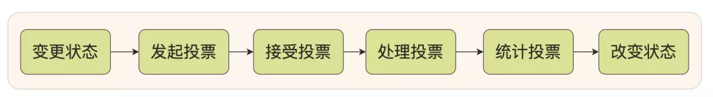 
1.**变更状态**。Leader 挂后，余下的非 Observer 服务器都会讲自己的服务器状态变更为 LOOKING，然后开始进入 Leader 选举过程。
2.每个**非 Observer** 的 Server 会**发出一个投票**。和启动过程一致。
3.**接收**来自各个服务器的**投票**。与启动时过程相同。
4.**处理投票**。与启动时过程相同。
5.**统计投票**。与启动时过程相同。
6.**改变服务器的状态**。与启动时过程相同。
## **8.说说Wather监听机制和它的原理？**
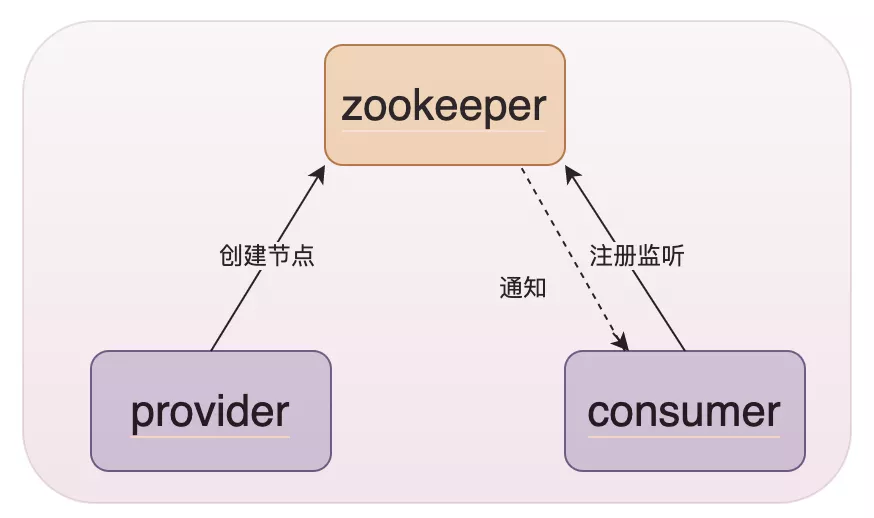 
具体的步骤如下:
· **服务注册**：Provider 启动时，会向 zookeeper 服务端**注册服务信息**，也就是创建一个节点。
· **服务发现**：Consumer 启动时，根据自身配置的依赖服务信息，向 zookeeper 服务端获取注册的服务信息并**设置 watch 监听**，获取到注册的服务信息之后，将服务提供者的信息**缓存在本地**，并进行服务的调用。
· **服务通知**：一旦服务提供者因某种原因宕机不再提供服务之后，客户端与 zookeeper **服务端断开**连接，zookeeper 服务端上服务提供者对应服务**节点会被删除**，随后 zookeeper 服务端会**异步向所有注册了该服务，且设置了 watch 监听的服务消费者**发出节点被删除的通知，消费者根据**收到的通知拉取最新服务列表**，**更新本地缓存**的服务列表。
简单的理解就是 client 会对某个 znode 注册一个 watcher 事件，当该 **znode 发生变化**时，这些 client 会**收到 ZooKeeper 的通知**。
四个特性：
· 一次性：一旦一个Wather**触发**之后，Zookeeper**就会**将它从存储中**移除**，**如果还要继续监听**这个节点，就**需要**我们在客户端的监听回调中，**再次**对节点的监听watch事件**设置为True**。否则客户端只能接收到一次该节点的变更通知
· 客户端串行：客户端的**Wather回调处理是串行同步**的过程，不要因为一个Wather的逻辑阻塞整个客户端
· 轻量：Wather通知的单位是WathedEvent，**只包含通知状态、事件类型和节点路径，不包含具体的事件内容**，具体的时间内容需要客户端主动去重新获取数据
· 异步:  Zookeeper服务器**发送watcher的通知事件到客户端是异步**的，不能期望能够监控到节点每次的变化，Zookeeper只能保证最终的一致性，而无法保证强一致性。
## **9.Zookeeper有哪些特性呢？**
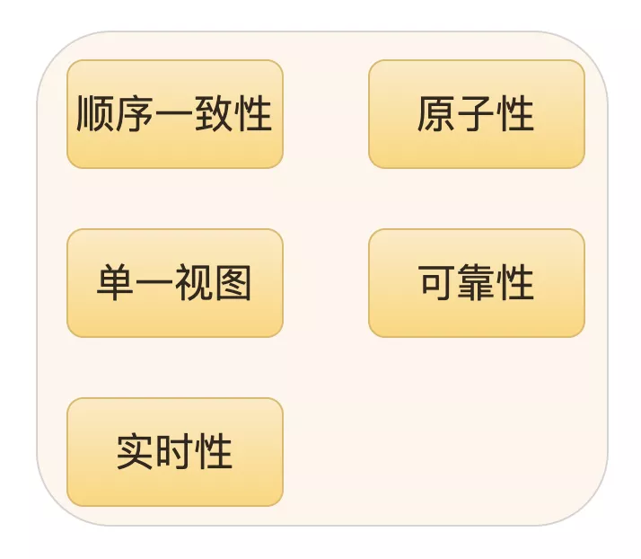 
· **顺序一致性**：leader会根据请求顺序生成 ZXID 来严格保证请求顺序的下发执行。
· **原子性**：所有事务请求的处理结果在整个集群中所有机器上的应用情况是一致的，要么成功，要么就失败。
· **单一视图**：无论客户端连到哪一个 ZooKeeper 服务器上，看到的数据都是一致的。
· **可靠性**：一旦服务端成功地应用了一个事务，并完成对客户端的响应，那么该事务所引起的服务端状态变更将会被一直保留下来。
· **实时性**：Zookeeper 仅仅能保证在段时间内客户端最终一定能够从服务端上读取到最新的数据状态。
## **10.Zookeeper 如何识别请求的先后顺序？**
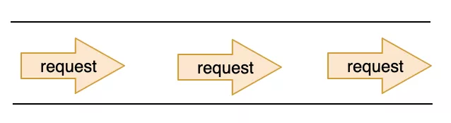 
Leader 收到请求之后，会将每个请求分配一个全局唯一递增的事务ID：zxid，然后把请求放入到一个 **FIFO 的队列**中，之后就会按照 FIFO 的策略发送给所有的 Follower。
## **11.选举 leader 后是怎么进行数据同步的**
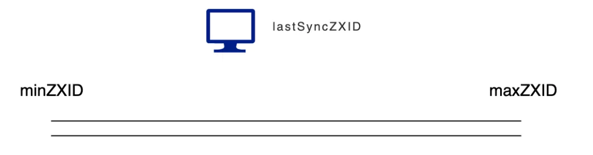 
前面提到写数据是由 leader 负责的，而 leader 会将每个请求分配一个 ZXID，放入一个队列中，依次执行，每次 leader  执行完一个请求后，会记录下执行的这个 ZXID。
我们将这个队列中最大的 ZXID 称为 **maxZXID**，最小的 ZXID 称为 **minZXID**。
将 Observer 和 follower 中最新的 ZXID **称为lastSyncZXID**
**proposal :** **l其实就是将请求中的一些信息如请求头，请求体以及 ZXID 等信息封装到 proposal对象当中**
**1.差异化同步**
§ 1).leader 向 Observer 和 follower 发送 DIFF 指令，之后就开始差异化同步
§ 2).然后把差异数据 提议 proposal 发送给 Observer 和 follower , Observer 和 follower 返回ACK表示已经完成了同步
§ 3).只要集群中过半的 Observer 和 follower 响应了 ACK 就发送一个 UPTODATE 命令
§ 4).leader 返回 ACK，同步流程结束
§ 
**触发条件**:minZXID < lastSyncZXID < maxZXID
§ 
§ 
**同步过程**:
§ 
**2.回滚同步**
§ 1).直接回滚到 maxZXID
§ **触发条件** maxZXID < lastSyncZXID
§ **举个例子**：a，b，c三台服务服务器 a是leader，此时队列里面最大的 ZXID 为100，a 收到请求，该 ZXID 为101，还没来得及发送同步数据 a 就挂了，b 变为leader，然后 a 恢复了，此时就需要 a 先将之前 ZXID 为101的数据回滚
§ **同步过程**:
**3.回滚+差异化同步**
§ 1).Observer 和 follower 将数据回滚
§ 2).进行差异化同步
§ **触发条件**:如果Leader刚生成一个proposal，还没有来得及发送出去，此时Leader宕机，重新选举之后作为Follower，但是新的Leader没有这个proposal数据
§ **举个例子**：a，b，c三台服务服务器 a是leader，此时队列里面最大的 ZXID 为100，a 收到请求，该 ZXID 为101，还没来得及发送同步数据 a 就挂了，b 变为leader，b 又处理了3个请求，则 b 队列中最大的 ZXID 为103，然后 a 恢复了，此时就需要 a 先将之前 ZXID 为101的数据回滚，再进行同步
§ **同步过程**:
**4.全量同步**
§ 1).lastSyncZXID < minZXID
§ 2).Leader服务器上没有缓存队列，并且lastSyncZXID!=maxZXID
§ **触发条件**
§ **同步过程**：leader 向 Observer 和 follower 发送SNAP命令，进行数据全量同步
## **12.Zookeeper 会有数据不一致的情况发生吗？**
还是会有的，因为 Zookeeper 采用的是**过半写**机制，意味着**3台服务器只要有两台写成功就代表整个集群写成功**，如果刚好有请求打在这台还**未写的服务器**上就查询不到该数据，就会有数据不一致的情况产生。
