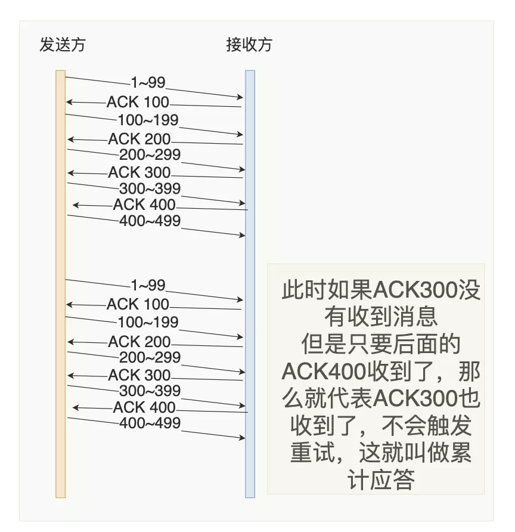

# 《面试八股文》之网络19卷
1.TCP/IP 网络模型有几层？分别有什么用？
2.介绍一下 HTTP 协议吧
3.GET 和 POST有什么区别？
4.PING 的作用？
5.常见的 HTTP 状态码有哪些
6.HTTP1.1 和 HTTP1.0 的区别有哪些？
7.HTTPS 和 HTTP 的区别是什么？
8.HTTP2 和 HTTP1.1 的区别是什么？
9.HTTP3 和 HTTP2 的区别是什么？
10.TCP 建立连接的过程是怎样的？
11.为什么是三次握手？？？
12.TCP 断开连接的过程是怎样的？
13.第四次挥手为什么要等待2MSL(60s)
14.为什么是四次挥手？
15.TCP 滑动窗⼝是什么？
16.发送方一直发送数据，但是接收方处理不过来怎么办？（流量控制）
17.TCP 半连接队列和全连接队列是什么？
18.粘包/拆包是怎么发生的？怎么解决这个问题？
19.浏览器地址栏输入网站按回车后发生了什么？
------
## **1.TCP/IP 网络模型有几层？分别有什么用？**
 
TCP/IP网络模型总共有**五层**
**1.应用层**:我们能接触到的就是应用层了，手机，电脑这些这些设备都属于应用层。
**2.传输层**:就是**为应用层提供网络支持**的，当设备作为接收⽅时，传输层则要负责把数据包传给应⽤，但是⼀台设备上可能会有很多应⽤在接收或者传输数据，因此需要⽤⼀个编号将应⽤区分开来，这个编号就是**端⼝**。所以 **TCP 和 UDP 协议就是在这一层的**
**3.网络层**:是**负责传输数据的**，最常使用的 ip 协议就在该层，⽹络层负责将数据从⼀个设备传输到另⼀个设备，世界上有很多设备，⽹络层需要有区分设备的编号。我们⼀般⽤ **IP 地址**给设备进⾏编号
**4.数据链路层**:每⼀台设备的⽹卡都会有⼀个 MAC 地址，它就是⽤来唯⼀标识设备的。路由器计算出了下⼀个⽬的地 IP 地址，再通过 ARP 协议找到该⽬的地的 MAC 地址，这样就知道这个 IP 地址是哪个设备的了。路由器就是通过数据链路层来知道这个 ip 地址是属于哪个设备的，它主要**为⽹络层提供链路级别传输的服务**。
**5.物理层**:当数据准备要从设备发送到⽹络的时候，需要把数据包转换成电信号，让其可以在物理介质中传输，它**主要是为数据链路层提供⼆进制传输的服务**。
## **2.介绍一下 HTTP 协议吧**
 
HTTP 协议是**基于 TCP 协议**实现的，它是一个**超文本传输协议**，其实就是一个简单的请求-响应协议，它**指定了客户端可能发送给服务器什么样的消息以及得到什么样的响应**。
它主要是**负责点对点之间通信**的。
**超文本**就是用超链接的方法，将各种不同空间的文字信息组织在一起的网状文本。比如说html，内部定义了很多图片视频的链接，放在浏览器上就呈现出了画面。
**协议**就是约定俗称的东西，比如说 moon 要给读者送一本书，读者那里只接受顺丰快递，那么 moon 觉得可以，发快递的时候选择的顺丰，那么我们彼此之间共同约定好的就叫做协议。
**传输**这个就很好理解了，比如刚才举的例子，将书发给读者，要通过骑车或者飞机的方式，传递的这个过程就是运输。
## **3.GET 和 POST有什么区别？**
**GET 和 POST 本质上就是 TCP 链接，并无差别。**
**但是由于 HTTP 的规定和浏览器/服务器的限制，导致他们在应用过程中体现出一些不同。**
| **区别**   | **GET**                                                | **POST**                                     |
| ---------------- | ------------------------------------------------------------ | -------------------------------------------------- |
| 数据传输方式     | 从服务器获取数据                                             | 向服务器提交数据                                   |
| 对数据长度的限制 | 当发送数据时，GET 方法向 URL 添加数据；URL 的长度是受限制的（URL 的最大长度是 2048 个字符） | 无限制                                             |
| 对数据类型的限制 | 只允许 ASCII 字符                                            | 无限制                                             |
| 安全性           | 较差，所发送的数据是 URL 的一部分，会显示在网页上            | 较好 参数不会被保存在浏览器历史或 WEB 服务器日志中 |
| 可见性           | 显示在 URL 上                                                | 不显示                                             |
| 收藏为书签       | 可以                                                         | 不可以                                             |
| 历史记录         | 可以被保留在历史记录当中                                     | 不可以被保留                                       |
| 缓存             | 能被缓存                                                     | 不可以被缓存                                       |
## **4.PING 的作用？**
PING 主要的作用就是**测试在两台主机之间能否建立连接**，如果 PING 不通就无法建立连接。
它其实就是向目的主机发送多个 ICMP 回送请求报文
· 如果没有响应则无法建立连接
· 如果有响应就可以根据目的主机返回的回送报文的时间和成功响应的次数估算出数据包**往返时间及丢包率**
## **5.常见的 HTTP 状态码有哪些**
| **1xx** | **信息，服务器收到请求，需要请求者继续执行操作** |
| ------------- | ------------------------------------------------------ |
| 2xx           | 成功，操作被成功接收并处理                             |
| 3xx           | 重定向，需要进一步的操作以完成请求                     |
| 4xx           | 客户端错误，请求包含语法错误或无法完成请求             |
| 5xx           | 服务器错误，服务器在处理请求的过程中发生了错误         |
## **6.HTTP1.1 和 HTTP1.0 的区别有哪些？**
 
· 1.**长链接**
§ 早期 HTTP1.0 的每一次请求都伴随着一次三次握手的过程，并且是**串行的请求**，增加了不必要的性能开销
§ HTTP1.1 **新增了长链接**的通讯方式，减少了性能损耗
· 2.**管道**
§ HTTP1.0 只有串行发送，没有管道
§ HTTP1.1 增加了**管道**的概念，使得在同一个 TCP 链接当中可以同时发出多个请求
· 3.**断点续传**
§ HTTP1.0 **不支持断点续传**
§ HTTP1.1 新增了 **range** 字段，用来指定数据字节位置，开启了断点续传的时代
· 4.**Host头处理**
§ HTTP1.0 任务主机只有一个节点，所以并**没有传 HOST**
§ HTTP1.1 时代，虚拟机技术越来越发达，一台机器上也有可能有很多节点，故**增加了 HOST 信息**
· 5.**缓存处理**
§ 在HTTP1.0中主要使用header里的If-Modified-Since,Expires来做为缓存判断的标准
§ HTTP1.1则**引入了更多的缓存控制策略**例如Entity tag，If-Unmodified-Since, If-Match, If-None-Match等更多可供选择的缓存头来控制缓存策略。
· 6.**错误状态响应码**
§ 在HTTP1.1中**新增了24个错误状态响应码**，如410（Gone）表示服务器上的某个资源被永久性的删除等。
## **7.HTTPS 和 HTTP 的区别是什么？**
 
· 1.**SSL安全协议**
§ HTTP 是超⽂本传输协议，信息是**明⽂传输**，存在安全⻛险的问题。
§ HTTPS 则解决 HTTP 不安全的缺陷，在TCP 和 HTTP ⽹络层之间加⼊了 SSL/TLS 安全协议，使得报⽂能够**加密传输**。
· 2.**建立连接**
§ HTTP 连接建⽴相对简单， TCP **三次握⼿**之后便可进⾏ HTTP 的报⽂传输。
§ HTTPS 在 TCP **三次握⼿**之后，还需进⾏ **SSL/TLS** 的**握⼿**过程，才可进⼊加密报⽂传输。
· 3.**端口号**
§ HTTP 的端⼝号是 **80**。
§ HTTPS 的端⼝号是 **443**。
· 4.**CA证书**
§ **HTTPS 协议需要向 CA（证书权威。机构）申请数字证书**来保证服务器的身份是可信的。
## **8.HTTP2 和 HTTP1.1 的区别是什么？**
 
1.**头部压缩**
§ 在 HTTP2 当中，如果你发出了**多个请求**，并且它们的**头部(header)是相同的**，那么 HTTP2 协议会帮你**消除同样的部分**。(其实就是在客户端和服务端维护一张索引表来实现)
2.**二进制格式**
§ HTTP1.1 采用**明文**的形式
§ HTTP/2 全⾯采⽤了**⼆进制格式**，头信息和数据体都是⼆进制
3.**数据流**
§ HTTP/2 的数据包不是按顺序发送的，同⼀个连接⾥⾯连续的数据包，可能属于不同的回应。(对数据包做了标记，标志其属于哪一个请求，其中规定客户端发出的数据流编号为奇数，服务器发出的数据流编号为偶数。**客户端还可以指定数据流的优先级**，优先级⾼的请求，服务器就先响应该请求)
4.**IO多路复用**
§ 如:在⼀个连接中，服务器收到了客户端 A 和 B 的两个请求，但是发现在处理 A 的过程中⾮常耗时，索性就先回应 A 已经处理好的部分，再接着回应 B 请求，最后再回应 A 请求剩下的部分。
§ HTTP/2 可以**在⼀个连接中并发多个请求或回应**。
5.**服务器推送**
§ 服务器可以主动向客户端发送请求
## **9.HTTP3 和 HTTP2 的区别是什么？**
 
· 1.**协议不同**
§ HTTP2 是基于 **TCP** 协议实现的
§ HTTP3 是基于 **UDP** 协议实现的
· 2.**QUIC**
§ **HTTP3 新增了 QUIC 协议**来实现可靠性的传输
· 3.**握手次数**
§ HTTP2 是基于 HTTPS 实现的，建立连接需要先进行 TCP 3次握手，然后再进行 TLS 3次握手，**总共6次握手**
§ HTTP3 只需要 QUIC 的**3次握手**
## **10.TCP 建立连接的过程是怎样的？**
 
第一次握手:A 的 TCP 进程创建一个 传输控制块 TCB ，然后向 B 发出连接请求报文段。之后将同步位 **SYN 设置为 1**，同时选择一个初始序列号 **seq=x**，这时客户端 A 进入到 **SYN-SENT（同步已发送**）状态。
第二次握手:B 收到连接请求报文段，如果同意建立连接，则向 A 发送确认。在确认报文段中 **同步位 SYN=1、确认位 ACK=1、确认号 ack=x+1**，同时也为自己选择一个初始序列号 **seq=y**，这时服务器 B 进入 SYN-RCVID 状态。
第三次握手:A 收到 B 的确认以后，再向 B 发出确认。确认报文 **ACK=1、确认号ack=y+1**。这时A进入到 ESTAB-LISHED 状态。**当B接收到A的确认后，也进入 ESTAB-LISHED 状态。连接建立完成**
## **11.为什么是三次握手？？？**
 
· 1.为了防止已经失效的连接请求报文段突然又传到服务端，因而产生错误
§ 如果客户端连续发送多次 SYN 建⽴连接的报⽂，如果出现了**网络拥堵**，可能会有**旧连接先于新连接到达**的情况，就可能会出现**连接覆盖**，要避免这种情况，最少需要三次握手
· 2.三次握⼿正好避免资源浪费
§ 三次握⼿就已经是理论上**建立可靠连接的最小次数**了，所以不需要更多的连接
· 3.同步双⽅初始序列号
§ 同步序列号(可以鉴别重复数序，按序接受等)其实并不要三次握手，只要一来一回两次就可以了
## **12.TCP 断开连接的过程是怎样的？**
 
第一次挥手:A 先发送连接释放报文段，段首部的终止控制位 **FIN=1**，序号**seq=u**（等于**A前面发送数据的最后一个序号加1**）；然后 A 进入 FIN-WAIT-1（终止等待1）状态，等待 B 的确认。
第二次挥手:B 收到 A 的连接释放报文段后，立刻发出确认报文段，确认号 **ack=u+1**，序号 **seq=v**（等于 **B 前面发送数据的最后一个序号加1**）；然后 B 进入 CLOSE-WAIT（关闭等待）状态。
第三次挥手:A 收到 B 的确认报文段后进入到 FIN-WAIT-2（终止等待2）状态，继续等待 B 发出连接释放报文段；
§ 若 B 已经没有数据要发送，B 就会向 A 发送连接释放报文段，段首部的终止控制位 **FIN=1**，序号 **seq=w**（半关闭状态可能又发送了一些数据），确认号 **ack=u+1**，这时B进入 **LAST-ACK**（最后确认）状态，等待A的确认。
第四次挥手:A收到B的连接释放报文段并发出确认，确认段中 确认位 **ACK=1**，确认号 **ack=w+1**，序号 **seq=u+1**；然后 A 进入到**TIME-WAIT**（时间等待）状态。当 B 再接收到该确认段后，B 就进入 **CLOSED** 状态。
## **13.第四次挥手为什么要等待2MSL(60s)**
 
首先 2MSL 的时间是从客户端(A)接收到 **FIN 后发送 ACK 开始计时**的。如果**在 TIME-WAIT 时间内**，因为客户端(A)的 ACK **没有传输**到服务端(B)，客户端(A)又接收到了服务端(B)重发的 FIN 报文，那么 2MSL **时间会被重置**。等待 2MSL 原因如下
· 1.**得原来连接的数据包消失**
§ 1）如果B没有收到自己的ACK，会超时重传FiN那么A再次接到重传的FIN，会再次发送ACK
§ 2）如果B收到自己的ACK，也不会再发任何消息，
§ 在最后一次挥手后 A 并不知道 B 是否接到自己的 信息
包括 ACK 是以上哪两种情况，A 都需要等待，要取这两种情况等待时间的最大值，以应对最坏的情况发生，这个最坏情况是：去向ACK消息最大存活时间（MSL) + 来向FIN消息的最大存活时间(MSL)。这刚好是2MSL，这个时间，足以**使得原来连接的数据包在网络中消失**。
· 2.**保证 ACK 能被服务端接收到从而正确关闭链接**
§ 因为这个 ACK 是有可能丢失的，会导致服务器收不到对 FIN-ACK 确认报文。假设客户端不等待 2MSL ，而是在发送完 ACK 之后直接释放关闭，一但这个 ACK 丢失的话，服务器就**无法正常的进入关闭连接状态**。
## **14.为什么是四次挥手？**
 
因为 tcp 可以在发送数据的同时也能接受数据，要实现可靠的连接关闭，A 发出结束报文 FIN，收到 B 确认后 A 知道自己没有数据需要发送了，B 知道 A 不再发送数据了，自己也不会接收数据了，**但是此时 A 还是可以接收数据，B 也可以发送数据**；当 B 发出 FIN 报文的时候此时两边才会真正的断开连接，读写分开。
## **15.TCP 滑动窗⼝是什么？**
 
TCP 是**每发送⼀个数据，都要进⾏⼀次确认应答**。只有上一个收到了回应才发送下一个，这样**效率会非常低**，因此**引进了滑动窗口**的概念.
其实就是在发送方**设立一个缓存区间**，将已发送但未收到确认的消息**缓存**起来，**假如一个窗口可以发送 5 个 TCP 段**，那么发送方就可以连续发送 5 个 TCP 段，然后就会将这 5 个 TCP 段的数据缓存起来，这 5 个 TCP 段是有序的，只要后面的消息收到了 ACK ，那么不管前面的是否有收到 ACK,都代表成功，**窗⼝⼤⼩是由接收方决定的**。
窗⼝⼤⼩就是指**不需要等待应答，还可以发送数据的大小**。
## **16.发送方一直发送数据，但是接收方处理不过来怎么办？（流量控制）**
如果接收方处理不过来，发送方就会触发重试机制再次发送数据，然而这个是有性能损耗的，为了解决这个问题，TCP 就提出了流量控制，为的就是**让发送方知道接受方的处理能力**。
也就是说，每次接收方接受到数据后会**将剩余可处理数据的大小告诉发送方**。
比如接受方滑动窗口可用大小为400字节，发送方发送过来100字节的数据，那么接收方剩余可用滑动窗口大小就为300字节，这是发送方就知道下次返送数据的大小范围了。
但是这里有一个问题，数据会存放在缓冲区，但是这个**缓冲区是操作系统控制的，当系统繁忙的时候，会缩减缓冲区减小，可能就会造成丢包的问题**。
 
如: 发送方接收方窗口大小各为200字节，发送方发送100字节的给接收方，此时双方各剩100字节，但是此时操作系统非常忙，将接收方的缓存区减少了50字节，这时接收方就会告诉发送方，我还有50字节可用，但是在接收方发送到达之前，发送方是不知道的，只会看到自己还有100字节可用，那么就继续发送数据，如果发送了80字节数据，那么接收方缓存区大小为50字节，就会丢失30字节的数据，也就是会发生丢包现象。
我们会发现，这个问题发生的原因就是减少了缓存，又收缩了窗口大小，所以 TCP 是**不允许同时减少缓存⼜收缩窗⼝**的。
## **17.TCP 半连接队列和全连接队列是什么？**
 
服务端收到客户端发出的 SYN 请求后，会把这个连接信息存储到**半链接队列(SYN 队列)**。
服务端收到第三次握⼿的 ACK 后，内核会把连接从半连接队列移除，然后创建新的完全的连接，并将其添加到**全连接队列**(accept 队列)，等待进程调⽤ accept 函数时把连接取出来。
这两个队列都是有大小限制的，当超过容量后就会将链接丢弃，或者返回 RST 包。
## **18.粘包/拆包是怎么发生的？怎么解决这个问题？**
TCP 发送数据时会根据 TCP 缓冲区的实际情况进行包的划分，一个完整的包**可能会被 TCP 拆分成多个包进行发送，也有可能把多个小的包封装成一个大的数据包发送**，这就是 TCP 粘包和拆包问题。
 
发生 TCP **粘包**的**原因**:
· 1.**发送的数据小于 TCP 缓冲区大小**，TCP将缓冲区中的数据(数据属于多条业务内容)一次发送出去可能就会发生粘包。
· 2.接收数据端的应用层没有及时读取接收缓冲区中的数据，将发生粘包。
发生 TCP **拆包**的**原因**:
· 1.**待发送数据大于最大报文长度**，TCP 在传输前将进行拆包。
· 2.**发送的数据大于 TCP 发送缓冲区剩余空间大小**，将会发生拆包。
**解决方案**:
 
1.**发送端给每个数据包添加包首部**，首部中包含数据包的长度，这样接收端在接收到数据后，通过该字段就可以知道每个数据包的实际长度了。
2.发送端将每个数据包**设置固定长度**，这样接收端每次从读取固定长度的数据把每个数据包拆分开。
3.可以在数据包之间**设置边界**，如添加特殊符号，接收端可以通过这个特殊符号来拆分包。
## **19.浏览器地址栏输入网站按回车后发生了什么？**
 
· 1:**解析网址**,生成 HTTP 请求信息
· 2:根据 DNS 服务器**查询真实请求的 IP 地址**，如果本地服务器有缓存则直接返回
· 3:得到了 IP 以后，向服务器**发送 TCP 连接**，TCP 连接经过三次握手。
· 4:接受 TCP 报文后，对**连接进行处理**，对 HTTP 协议解析
· 5:服务器**返回响应**
· **6:浏览器**接受响应，显示页面，渲染页面**
