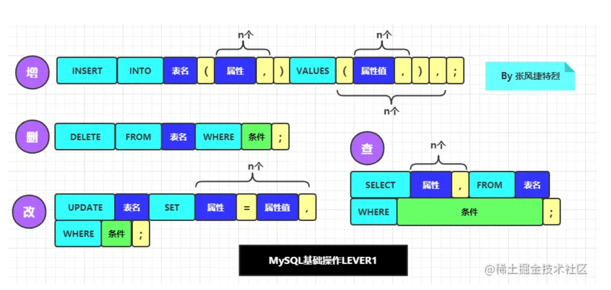
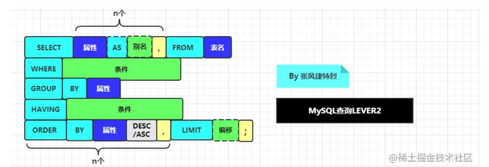
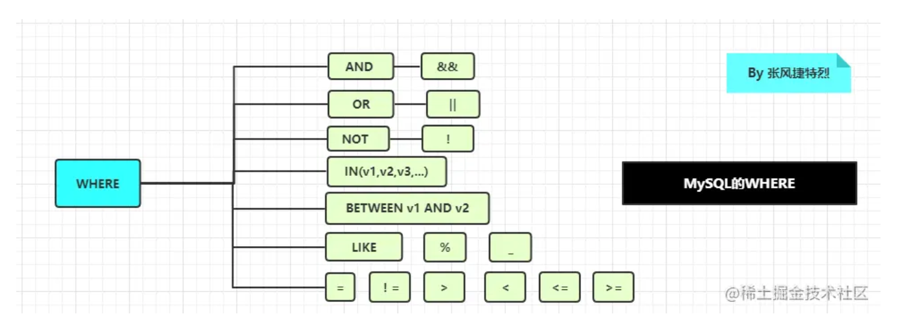

# MySQL常见语句汇总

# MySQL常见语句汇总

## 数据库操作

### 连接数据库

```
C:\Users\21952>mysql -u root -p
Enter password: ******
Welcome to the MySQL monitor.  Commands end with ; or \g.
Your MySQL connection id is 16
Server version: 8.0.19 MySQL Community Server - GPL

Copyright (c) 2000, 2020, Oracle and/or its affiliates. All rights reserved.

Oracle is a registered trademark of Oracle Corporation and/or its
affiliates. Other names may be trademarks of their respective
owners.

Type 'help;' or '\h' for help. Type '\c' to clear the current input statement.

```

### 创建数据库

```
CREATE DATABASE 数据库名;

```

### 删除数据库

```
DROP DATABASE 数据库名;

```

### 选择数据库

```
use 数据库名;

```

### 查看所有数据库

```
mysql> SHOW DATABASES;
+--------------------+
| Database           |
+--------------------+
| blog               |
| information_schema |
| mydb               |
| mysql              |
| notes              |
| notesblog          |
| performance_schema |
| sys                |
| test               |
+--------------------+
9 rows in set (0.00 sec)

```

## 数据表操作

### 创建数据表

```
CREATE TABLE table_name(
    column_name column_type,
    ...
);

```

以下例子中将创建user表

```
CREATE TABLE IF NOT EXISTS `user`(
    `uid` INT UNSIGNED AUTO_INCREMENT,
    `uname` VARCHAR(20) NOT NULL,
    `age` INT,
    `sex` VARCHAR(2),
    PRIMARY KEY(`uid`)
)ENGINE=InnoDB DEFAULT CHARSET=utf8mb4;

```

解析：

- IF NOT EXISTS表示只有当user表不存在时才创建
- UNSIGNED存储的时无符号数
- NOT NULL表示该字段不能为空，否则会报错
- AUTO_INCREMENT定义列为自增的属性，一般用于主键，数值会自动加1。
- PRIMARY KEY关键字用于定义列为主键。 您可以使用多列来定义主键，列间以逗号分隔。
- ENGINE 设置存储引擎，CHARSET 设置编码。

### 删除数据表

```
DROP TABLE [IF EXISTS] table_name;

```

### 修改表结构

#### 修改表名

修改表名有两种方式：

```
ALTER TABLE old_table_name RENAME new_table_name;

RENAME TABLE old_table_name TO new_table_name;

```

示例如下：

```
mysql> ALTER TABLE user RENAME user1;
Query OK, 0 rows affected (0.28 sec)

mysql> RENAME TABLE user1 TO user;
Query OK, 0 rows affected (0.51 sec)

```

#### 修改表中某一列的列名和列结构

```
ALTER TABLE table_name CHANGE old_column_name new_column_name new_ype;

```

将user表的uname更改为name，且将VARCHAR(20)修改为VARCHAR(21)

```
ALTER TABLE user CHANGE uname name VARCHAR(21) NOT NULL;

```

#### 修改列结构

```
ALTER TABLE table_name MODIFY column_name new_type;

```

实例：

```
mysql> ALTER TABLE user MODIFY uname VARCHAR(20);
Query OK, 3 rows affected (1.28 sec)
Records: 3  Duplicates: 0  Warnings: 0

```

#### 增加列

```
mysql> ALTER TABLE user ADD address VARCHAR(20);
Query OK, 0 rows affected (0.63 sec)
Records: 0  Duplicates: 0  Warnings: 0

```

#### 删除列

```
mysql> ALTER TABLE user DROP address;
Query OK, 0 rows affected (0.93 sec)
Records: 0  Duplicates: 0  Warnings: 0

```

### 查看表结构

```
DESC table_name;

mysql> DESC user;
+-------+--------------+------+-----+---------+----------------+
| Field | Type         | Null | Key | Default | Extra          |
+-------+--------------+------+-----+---------+----------------+
| uid   | int unsigned | NO   | PRI | NULL    | auto_increment |
| uname | varchar(21)  | NO   |     | NULL    |                |
| age   | int          | YES  |     | NULL    |                |
| sex   | varchar(2)   | YES  |     | NULL    |                |
+-------+--------------+------+-----+---------+----------------+
4 rows in set (0.00 sec)

```

### 查看当前数据库的所有表

```
mysql> SHOW TABLES;
+----------------+
| Tables_in_test |
+----------------+
| stu            |
| user           |
+----------------+
2 rows in set (0.00 sec)

```

## 数据操作

### 插入数据

```
INSERT INTO table_name (field1, field2,...fieldN) VALUES (value1, value2,...valueN);

```

我们可以在VALUES前面指定部分要插入的字段

当我们要插入全部字段可以省略`(field1, field2,...fieldN)`

插入全部字段：(要指定主键)

```
mysql> INSERT INTO user VALUES (1, 'xgc', 21, '男');
Query OK, 1 row affected (0.08 sec)

```

插入部分字段(当主键设置了AUTO_INCREMENT，主键可以省略，主键会自动加1)

```
mysql> INSERT INTO user (uname, age) VALUES ('zhangsan', 22);
Query OK, 1 row affected (0.08 sec)

```

### 查询数据

```
SELECT column_name [AS result_name],column_name FROM table_name [WHRER Clause] [LIMIT N] [OFFSET M]

```

`[]`内的为可选项

- `AS result_name`表示为查询结果对应的列名取个别名
- WHERE子句后面跟着选择条件
- LIMIT来设置返回的记录数
- OFFSET指定查询数据的偏移量，默认为0

当我们要查询全部字段的时候，可以用`*`来代替列名

```
mysql> SELECT * FROM user;
+-----+----------+------+------+
| uid | uname    | age  | sex  |
+-----+----------+------+------+
|   1 | xgc      |   21 | 男   |
|   6 | zhangsan |   22 | NULL |
+-----+----------+------+------+
2 rows in set (0.00 sec)

```

查询部分字段

```
mysql> SELECT uname AS name,age FROM user;
+----------+------+
| name     | age  |
+----------+------+
| xgc      |   21 |
| zhangsan |   22 |
+----------+------+
2 rows in set (0.00 sec)

```

#### WHERE子句

```
mysql> SELECT * FROM user WHERE uid=6;
+-----+----------+------+------+
| uid | uname    | age  | sex  |
+-----+----------+------+------+
|   6 | zhangsan |   22 | NULL |
+-----+----------+------+------+
1 row in set (0.00 sec)

```

#### LIMIT子句

LIMIT后面可以加一个或两个参数

只有一个参数，则表示要查询的记录数

```
mysql> SELECT * FROM  user LIMIT 1;
+-----+-------+------+------+
| uid | uname | age  | sex  |
+-----+-------+------+------+
|   1 | xgc   |   21 | 男   |
+-----+-------+------+------+
1 row in set (0.00 sec)

```

有两个参数，第一个表示要跳过的数量，第二个表示要查询的记录数

```
mysql> SELECT * FROM  user LIMIT 1,2;
+-----+----------+------+------+
| uid | uname    | age  | sex  |
+-----+----------+------+------+
|   6 | zhangsan |   22 | NULL |
+-----+----------+------+------+
1 row in set (0.00 sec)

```

##### OFFSET子句

OFFSET子句不能单独使用，只有在LIMIT子句存在的时候才能使用

为了方便测试，再增加一条数据

```
mysql> INSERT INTO user (uname, age, sex) VALUES ('xiaoli', 22, '男');
Query OK, 1 row affected (0.35 sec)

```

此时全部数据如下：

```
mysql> SELECT * FROM user;
+-----+----------+------+------+
| uid | uname    | age  | sex  |
+-----+----------+------+------+
|   1 | xgc      |   21 | 男   |
|   6 | zhangsan |   22 | NULL |
|   7 | xiaoli   |   22 | 男   |
+-----+----------+------+------+
3 rows in set (0.00 sec)

```

测试OFFSET子句

```
mysql> SELECT * FROM user WHERE age=22 LIMIT 1 OFFSET 1;
+-----+--------+------+------+
| uid | uname  | age  | sex  |
+-----+--------+------+------+
|   7 | xiaoli |   22 | 男   |
+-----+--------+------+------+
1 row in set (0.00 sec)

```

#### UNION操作符

MySQL UNION 操作符用于连接两个以上的 SELECT 语句的结果组合到一个结果集合中。

```
SELECT column_name, column_name FROM table_name [WHERE Clause]
UNION [ALL | DISTINCT]
SELECT column_name, column_name FROM table_name [WHERE Clause];

```

参数：

- **DISTINCT:** 可选，删除结果集中重复的数据。默认。
- **ALL:** 可选，返回所有结果集，包含重复数据。

**注：**

- 查询结果的列数要相同，不同会报错。
- UNION操作符不会检查列名是否相同，直接将第二个SELECT语句的组合到第一个SELECT语句的结果集中。即结果集的列名为第一个SELECT语句的列名。

实例：

```
SELECT * FROM user WHERE uname = 'xgc'
UNION
SELECT * FROM user WHERE age = 22;

```

#### ORDER BY 排序

我们可以使用ORDER BY子句来对数据集排序，再返回结果

```
SELECT column_name, column_name FROM table_name ORDER BY column_name [ASC | DESC], [column_name [ASC | DESC]]

```

- ORDER BY后面的列名表示要根据这个列名来排序
- ASC表示升序排序，DESC表示降序排序。默认按升序排序
- 我们可以使用多个列名排序，先按照靠前的列名排序，当列名相同时就按照下一个列名来排序。

示例：

```
mysql> SELECT * FROM user ORDER BY age DESC;
+-----+----------+------+------+
| uid | uname    | age  | sex  |
+-----+----------+------+------+
|   6 | zhangsan |   22 | NULL |
|   7 | xiaoli   |   22 | 男   |
|   1 | xgc      |   21 | 男   |
+-----+----------+------+------+
3 rows in set (0.00 sec)

```

#### GROUP BY 分组

GROUP BY 语句根据一个或多个列对结果集进行分组。将列值相同的分为一组。

在分组的列上我们可以使用 COUNT, SUM, AVG等函数。

```
SELECT column_name function(column_name) FROM table_name [WITH ROLLUP]
GROUP BY column_name;

```

- WITH ROLLUP 可以实现在分组统计数据基础上再进行相同的统计

示例：将统计user表中年龄为22的分为一组，并统计对应人数

```
mysql> select age, count(age) AS num from user group by age;
+------+------------+
| age  | num        |
+------+------------+
|   21 |          1 |
|   22 |          2 |
+------+------------+
2 rows in set (0.00 sec)

```

这里，我们可以使用`WITH ROLLUP`再统计查询出的总人数

```
mysql> select age, count(age) AS num from user group by age WITH ROLLUP;
+------+-----+
| age  | num |
+------+-----+
|   21 |   1 |
|   22 |   2 |
| NULL |   3 |
+------+-----+
3 rows in set (0.00 sec)

```

我们看到使用`WITH ROLLUP`统计出的数据对应age列的值为NULL。我们可以使用coalesce来设置取代NULL的值。

我们来看看语法

```
coalesce(a,b,c)

```

说明：如果a==null,则选择b；如果b==null,则选择c；如果a!=null,则选择a；如果a b c 都为null ，则返回为null。

我们将其设置为`总数`

```
mysql> select coalesce(age, '总数') AS age, count(age) AS num from user group by age WITH ROLLUP;
+--------+-----+
| age    | num |
+--------+-----+
| 21     |   1 |
| 22     |   2 |
| 总数   |   3 |
+--------+-----+
3 rows in set, 1 warning (0.00 sec)

```

### 修改数据

```
UPDATE table_name SET column_name = new_value, column_name = new_value [WHERE Clause]

```

### 删除数据

```
DELETE FROM table_name [WHERE Clause]

```

### WHERE子句

```
SELECT column_name, column_name FROM table_name [WHERE condition1 [AND|OR] condition2 ..]

```

- WHERE后面跟的是查询条件

- 可以使用AND和OR连接多个查询条件

- WHERE 子句可以运用于 SQL 的 SELECT、DELETE 或者 UPDATE 命令。

- MySQL 的 WHERE 子句的字符串比较是不区分大小写的。 可以使用 BINARY 关键字来设定 WHERE 子句的字符串比较是区分大小写的。

  ```
  SELECT * FROM user WHERE BINARY name=`xgc`;
  
  ```

操作符如下表：

| 操作符 | 描述                                                         | 实例               |
| ------ | ------------------------------------------------------------ | ------------------ |
| =      | 等号，检测两个值是否相等，如果相等返回true                   | (A = B) 返回false  |
| <>, != | 不等于，检测两个值是否相等，如果不相等返回true               | (A != B) 返回 true |
| >      | 大于号，检测左边的值是否大于右边的值, 如果左边的值大于右边的值返回true | (A > B) 返回false  |
| <      | 小于号，检测左边的值是否小于右边的值, 如果左边的值小于右边的值返回true | (A < B) 返回 true  |
| >=     | 大于等于号，检测左边的值是否大于或等于右边的值, 如果左边的值大于或等于右边的值返回true | (A >= B) 返回false |
| <=     | 小于等于号，检测左边的值是否小于或等于右边的值, 如果左边的值小于或等于右边的值返回true | (A <= B) 返回 true |

#### LIKE子句

我们可以在WHERE子句中使用LIKE子句

LIKE子句可以代替等号`=`，区别在于LIKE子句支持模糊匹配。

MySQL提供了两种匹配方式

- `%`：匹配任意0个或多个字符。
- `_`：匹配单个任意字符

```
mysql> SELECT * FROM user WHERE uname LIKE 'zh%';
+-----+----------+------+------+
| uid | uname    | age  | sex  |
+-----+----------+------+------+
|   6 | zhangsan |   22 | NULL |
+-----+----------+------+------+
1 row in set (0.00 sec)

```

#### REGEXP

我们知道MySQL可以通过`LIKE`进行模糊匹配。

MySQL中使用 REGEXP 操作符来进行正则表达式匹配。

```
SELECT * FROM user WHERE uname REGEXP '^xiao'

```

上面就表示查询列uname的值以xiao开头的数据。

| 模式       | 描述                                                         |
| ---------- | ------------------------------------------------------------ |
| ^          | 匹配输入字符串的开始位置。                                   |
| $          | 匹配输入字符串的结束位置。                                   |
| .          | 匹配除 `\n` 之外的任何单个字符。要匹配包括 `\n` 在内的任何字符，使用 `[.\n]` |
| [...]      | 字符集合。匹配所包含的任意一个字符。例如， `[abc]` 可以匹配 `plain` 中的 `a`。 |
| [^...]     | 负值字符集合。匹配未包含的任意字符。例如， `[^abc]`可以匹配 `plain` 中的`p`。 |
| p1\|p2\|p3 | 匹配 p1 或 p2 或 p3。例如，`z|flood`能匹配 `z` 或 `food`。`(z|f)ood`则匹配 `zood` 或 `food`。 |
| *          | 匹配前面的子表达式零次或多次。例如，`zo*` 能匹配 `z` 以及 `zoo`。`*` 等价于`{0,}`。 |
| +          | 匹配前面的子表达式一次或多次。例如，`zo+` 能匹配 `zo` 以及 `zoo`，但不能匹配 `z`。`+` 等价于 `{1,}`。 |
| {n}        | `n` 是一个非负整数。匹配确定的 `n` 次。例如，`o{2}` 不能匹配 `Bob` 中的 `o`，但是能匹配 "food" 中的两个 o。 |
| {n,m}      | m 和 n 均为非负整数，其中n <= m。最少匹配 n 次且最多匹配 m 次。 |

#### NULL值处理

当我们需要查询列值为空或不为空是，`=`和`!=`是不起作用的。

我们应该使用的应该是`IS NULL`和`IS NOT NULL`

```
SELECT * FROM user WHERE sex IS NULL;

SELECT * FROM user WHERE sex IS NOT NULL;

```

### JOIN 连接

在真正的应用中经常需要从多个数据表中读取数据。

我们可以使用MySQL 的 JOIN 在两个或多个表中查询数据。

我们可以在 SELECT, UPDATE 和 DELETE 语句中使用 Mysql 的 JOIN 来进行联合多表查询。

JOIN 按照功能大致分为如下三类：

- **INNER JOIN（内连接,或等值连接）**：获取两个表中字段匹配关系的记录。
- **LEFT JOIN（左连接）：**获取左表所有记录，即使右表没有对应匹配的记录。
- **RIGHT JOIN（右连接）：** 与 LEFT JOIN 相反，用于获取右表所有记录，即使左表没有对应匹配的记录。

在学习JOIN前，我们先了解什么叫做笛卡尔积：

> 在我们进行多表联合查询的时候会出现的一种情况——**笛卡尔积现象**

现在，我们有两个集合A和B

A = {0,1} B = {2,3,4}

集合 A×B 和 B×A的结果集就可以分别表示为以下这种形式：

A×B = {（0，2），（1，2），（0，3），（1，3），（0，4），（1，4）}；

B×A = {（2，0），（2，1），（3，0），（3，1），（4，0），（4，1）}

以上A×B和B×A的结果就可以叫做两个集合相乘的**笛卡尔积**。

从上面我们得出两个结论：

- 两个集合相乘，不满足交换率，既 A×B ≠ B×A
- A集合和B集合相乘，包含了集合A中元素和集合B中元素相结合的所有的可能性。即两个集合相乘得到的新集合的元素个数是 A集合的元素个数 × B集合的元素个数

数据库表连接数据行匹配时所遵循的算法就是以上提到的**笛卡尔积**

在使用前，我们先看看联合多表查询的两个表

```
mysql> SELECT * FROM stu;
+-----+----------+------+------+---------+
| sid | sname    | age  | sex  | address |
+-----+----------+------+------+---------+
|   1 | zhangsan |   21 | 男   | NULL    |
|   2 | lisi     |   21 | NULL | NULL    |
+-----+----------+------+------+---------+
2 rows in set (0.00 sec)

mysql> SELECT * FROM user;
+-----+----------+------+------+
| uid | uname    | age  | sex  |
+-----+----------+------+------+
|   1 | xgc      |   21 | 男   |
|   6 | zhangsan |   22 | NULL |
|   7 | xiaoli   |   22 | 男   |
+-----+----------+------+------+
3 rows in set (0.00 sec)

```

**INNER JOIN：**

我们把stu表和user表中age相等的记录查询出来(当然，查询出来的数据是没应用意义的，但只是为了查看一下效果)

```
mysql> SELECT * FROM user u INNER JOIN stu s ON u.age = s.age;
+-----+-------+------+------+-----+----------+------+------+---------+
| uid | uname | age  | sex  | sid | sname    | age  | sex  | address |
+-----+-------+------+------+-----+----------+------+------+---------+
|   1 | xgc   |   21 | 男   |   1 | zhangsan |   21 | 男   | NULL    |
|   1 | xgc   |   21 | 男   |   2 | lisi     |   21 | NULL | NULL    |
+-----+-------+------+------+-----+----------+------+------+---------+
2 rows in set (0.00 sec)

```

我来先解释一下上面SQL语句的意义

- INNER JOIN，就是内连接
- 表名user、stu后面的u、s分别是它们的别名，从`u.age = s.age`可以看到，它有区分两个表相同列名的作用
- ON的作用类似于WHERE，表示的是查询后符合条件的记录

我们看到内连接的匹配就是：

- 先用笛卡尔积来进行组合成 `A表记录数 x B表记录数` 个记录
- 然后使用ON后面条件筛选出符合的记录

**LEFT JOIN：**

```
mysql> SELECT * FROM user u LEFT JOIN stu s ON u.age = s.age;
+-----+----------+------+------+------+----------+------+------+---------+
| uid | uname    | age  | sex  | sid  | sname    | age  | sex  | address |
+-----+----------+------+------+------+----------+------+------+---------+
|   1 | xgc      |   21 | 男   |    1 | zhangsan |   21 | 男   | NULL    |
|   1 | xgc      |   21 | 男   |    2 | lisi     |   21 | NULL | NULL    |
|   6 | zhangsan |   22 | NULL | NULL | NULL     | NULL | NULL | NULL    |
|   7 | xiaoli   |   22 | 男   | NULL | NULL     | NULL | NULL | NULL    |
+-----+----------+------+------+------+----------+------+------+---------+
4 rows in set (0.00 sec)

```

RIGHT JOIN:

```
mysql> SELECT * FROM user u RIGHT JOIN stu s ON u.age = s.age;
+------+-------+------+------+-----+----------+------+------+---------+
| uid  | uname | age  | sex  | sid | sname    | age  | sex  | address |
+------+-------+------+------+-----+----------+------+------+---------+
|    1 | xgc   |   21 | 男   |   1 | zhangsan |   21 | 男   | NULL    |
|    1 | xgc   |   21 | 男   |   2 | lisi     |   21 | NULL | NULL    |
+------+-------+------+------+-----+----------+------+------+---------+
2 rows in set (0.00 sec)

```

## MySQL事务

事务指的是一组SQL语句，要么全部执行，要么全部执行。

- 在 MySQL 中只有使用了 Innodb 数据库引擎的数据库或表才支持事务。
- 事务用来管理 insert,update,delete 语句

> 在 MySQL 命令行的默认设置下，事务都是自动提交的，即执行 SQL 语句后就会马上执行 COMMIT 操作。
>
> 因此要显式地开启一个事务务须使用命令 BEGIN 或 START TRANSACTION，或者执行命令 SET AUTOCOMMIT=0，用来禁止使用当前会话的自动提交。

### 修改MySQL自动提交模式

MySQL中事务默认是自动提交的，我们可以手动设置关闭或开启自动提交事务的模式

- **SET AUTOCOMMIT=0** 禁止自动提交
- **SET AUTOCOMMIT=1** 开启自动提交

### 开启事务

我们可以手动开启一个事务，从而使对数据库的操作在提交后才永久生效

- BEGIN 或 START TRANSACTION 显式地开启一个事务；

### 事务回滚

当我们在执行事务的时候，发现其中一条语句出现错误，并且希望撤销正在进行的所有未提交的修改。那么我们可以使用事务回滚。

- ROLLBACK 或 ROLLBACK WORK 进行事务的回滚

### 事务提交

当事务执行之后，而且没有一条语句出现错误。我们打算提交所有的修改，从而让对数据库的修改持久化。我们就要进行事务的提交

- COMMIT 或 COMMIT WORK 会提交事务，并使已对数据库进行的所有修改成为永久性的；

### 事务处理示例(开启、回滚、提交)

```
mysql> SELECT * FROM user;
+-----+----------+------+------+
| uid | uname    | age  | sex  |
+-----+----------+------+------+
|   1 | xgc      |   21 | 男   |
|   6 | zhangsan |   22 | NULL |
|   7 | xiaoli   |   22 | 男   |
+-----+----------+------+------+
3 rows in set (0.00 sec)

# 开启事务
mysql> BEGIN;
Query OK, 0 rows affected (0.00 sec)

mysql> INSERT INTO user (uname, age) VALUES('lisi', 18);
Query OK, 1 row affected (0.00 sec)

# 提交事务
mysql> COMMIT;
Query OK, 0 rows affected (0.06 sec)

# 开启事务
mysql> BEGIN;
Query OK, 0 rows affected (0.00 sec)

mysql> INSERT INTO user (uname, age) VALUES('xiaohong', 18);
Query OK, 1 row affected (0.00 sec)

# 事务回滚
mysql> ROLLBACK;
Query OK, 0 rows affected (0.04 sec)

# 查看回滚后的数据
mysql> SELECT * FROM user;
+-----+----------+------+------+
| uid | uname    | age  | sex  |
+-----+----------+------+------+
|   1 | xgc      |   21 | 男   |
|   6 | zhangsan |   22 | NULL |
|   7 | xiaoli   |   22 | 男   |
|   8 | lisi     |   18 | NULL |
+-----+----------+------+------+
4 rows in set (0.00 sec)

```

### 保存点

SAVEPOINT是在数据库事务处理中实现子事务（subtransaction），也称为嵌套事务的方法。事务可以回滚到SAVEPOINT 而不影响到SAVEPOINT创建前的变化，不需要放弃整个事务。

允许在事务中创建一个保存点，一个事务中可以有多个 SAVEPOINT

- 声明一个保存点

  ```
  SAVEPOINT savapoint_name;
  
  ```

- 回滚到保存点

  ```
  ROLLBACK TO savepoint_name;
  
  ```

- 删除保存点，一般在事务处理完成后（执行一条 ROLLBACK 或 COMMIT）自动释放

  MySQL5以来，可以用：

  ```
  RELEASE SAVEPOINT savepoint_name; #删除指定保存点
  
  ```

### 设置事务隔离级别

事务的隔离级别是用来解决并发时的问题，如：脏读、幻读、不可重复读

InnoDB 存储引擎提供事务的隔离级别有

- READ UNCOMMITTED
- READ COMMITTED
- REPEATABLE READ
- SERIALIZABLE

设置事务隔离级别

```
SET [GLOBAL|SESSION] TRANSACTION ISOLATION LEVEL 
READ COMMITTED | READ UNCOMMITTED | REPEATABLE READ | SERIALIZABLE

```

### 查看事务隔离级别

查看全局和当前会话事务隔离级别：

```
mysql> select @@global.transaction_isolation, @@transaction_isolation;
+--------------------------------+-------------------------+
| @@global.transaction_isolation | @@transaction_isolation |
+--------------------------------+-------------------------+
| REPEATABLE-READ                | REPEATABLE-READ         |
+--------------------------------+-------------------------+
1 row in set (0.00 sec)

```

## MySQL 索引

MySQL索引的建立对于MySQL的高效运行是很重要的，索引能够大大提高MySQL的检索速度。

创建索引，你需要确保该索引是应用在SQL查询条件的条件(一般是作为WHERE子句的条件)

实际上，索引也是一张表。该表保存了主键与索引字段，并指向实体表的记录。

虽然索引能够加快查询速度，但我们不应该滥用索引。因此更新(UPDATE、DELETE、INSERT)表的时候，MySQL不仅会保存数据，还要保存一下索引文件，这会降低更新表的速度。

### 索引分类

在MySQL中，索引分为普通索引，唯一索引，主键索引和全文索引。其中每种索引根据包含列的不同又可以分为单列索引和组合索引。

因此，我们又可以说索引分为单列索引和组合索引。

- 单列索引，即一个索引只包含单个列。一个表中可以有多个单列索引。

- 组合索引，即一个索引包含多个列。

  组合索引指的是在多个字段上创建的索引。只有在查询条件中使用了创建索引的第一个字段，索引才用被使用。使用组合索引时遵循最左前缀匹配原则。

  **最左前缀匹配原则：**

  mysql会一直向右匹配直到遇到范围查询(>、<、between、like)就停止匹配。

  比如a = 1 and b = 2 and c > 3 and d = 4，如果建立(a,b,c,d)顺序的索引，d是用不到索引的，

  如果建立(a,b,d,c)的索引则都可以用到，a,b,d的顺序可以任意调整。

这里，我们来看看普通索引，唯一索引，主键索引和全文索引的不同

- 普通索引：这是最基本的索引，它没有任何限制。

- 唯一索引：它与普通索引类似，不同的就是：索引列的值必须唯一，但允许有空值。

  如果是组合索引，则列值的组合必须唯一。

- 主键索引：一种特殊的唯一索引，一个表只能有一个主键，不允许有空值。一般是在建表时同时创建主键索引。

- 全文索引：主要用来查找文本中的关键字，而不是直接与索引中的值相比较。

  FULLTEXT索引跟其它索引大不相同，它更像是一个搜索引擎，而不是简单的where语句的参数匹配。

  FULLTEXT索引配合match against操作使用，而不是一般的where语句加like。

### 创建索引

下面这三种方法是创建普通索引、唯一索引和全文索引的方法：

#### 建表后，直接创建

```
CREATE [UNIQUE | FULLTEXT] INDEX index_name ON table_name(column_name[, column_name]);

```

#### 修改表结构(添加索引)

```
ALTER TABLE table_name ADD [UNIQUE | FULLTEXT] INDEX index_name(column_name[, column_name]);

```

#### 创建表时同时指定

```
CREATA TABLE table_name(
	column_name column_type,
    column_name column_type,
    [INDEX | FULLTEXT | UNIQUE] [index_name] (column_name[, column_name])
);

```

创建主键索引的两种方式如下：

#### 修改表结构(主键索引)

```
ALTER TABLE table_name ADD CONSTRAINT pk_name PRIMARY KEY(column_name[, column_name]);

```

#### 建表时同时创建

```
CREATE TABLE table_name(
	column_name column_type,
    column_name column_type,
    PRIMARY KEY(column_name[, column_name])
);

```

### 删除索引

上面所有的索引都可以使用下面语句删除

```
DROP INDEX index_name ON table_name;

ALTER TABLE table_name DROP INDEX index_name;

```

如果是主键，我们还可以不用指定索引名

```
ALTER TABLE table_name DROP PRIMARY KEY;

```

### 显示索引信息

```
SHOW INDEX FROM table_name;

```

示例：

```
mysql> SHOW INDEX FROM user;
+-------+------------+----------+--------------+-------------+-----------+-------------+----------+--------+------+------------+---------+---------------+---------+------------+
| Table | Non_unique | Key_name | Seq_in_index | Column_name | Collation | Cardinality | Sub_part | Packed | Null | Index_type | Comment | Index_comment | Visible | Expression |
+-------+------------+----------+--------------+-------------+-----------+-------------+----------+--------+------+------------+---------+---------------+---------+------------+
| user  |          0 | PRIMARY  |            1 | uid         | A         |           0 |     NULL |   NULL |      | BTREE      |         |               | YES     | NULL       |
+-------+------------+----------+--------------+-------------+-----------+-------------+----------+--------+------+------------+---------+---------------+---------+------------+
1 row in set (0.00 sec)

```

## 临时表

MySQL 临时表在我们需要保存一些临时数据时是非常有用的。临时表只在当前连接可见，当关闭连接时，Mysql会自动删除表并释放所有空间。

临时表在MySQL 3.23版本中添加，如果你的MySQL版本低于 3.23版本就无法使用MySQL的临时表。

### 创建临时表

```
CREATE TEMPORARY TABLE table_name(
	column_name column_type,
    column_name column_type
);

```

使用**SHOW TABLES**命令显示数据表列表时，我们是无法看到临时表。

### 删除临时表

默认情况下，当你断开与数据库的连接后，临时表就会自动被销毁。

当然我们也可以在当前MySQL会话使用 **DROP TABLE** 命令来手动删除临时表。

```
DROP TABLE table_name;

```

## 复制表

有时候，我们需要完成的复制MySQL的数据表，包括表结构、索引等。如果仅仅使用`CREATE TABLE new_table_name SELECT`命令是无法实现的。

可能我们也会需要复制MySQL表的数据到另一个表。

### 复制表结构

1. 使用 **SHOW CREATE TABLE** 命令获取创建数据表语句，该语句包含了原数据表的结构，索引等。

   ```
   SHOW CREATE TABLE table_name;
   
   ```

2. 复制该数据库表语句修改表名并执行

示例：

```
mysql> SHOW CREATE TABLE user;
+-------+-------------------------------------------------------------------------------------------------------------------------------------------------------------------------------------------------------------------------------------------------------------------------------+
| Table | Create Table                                                                                                                                                                                                                                                                  |
+-------+-------------------------------------------------------------------------------------------------------------------------------------------------------------------------------------------------------------------------------------------------------------------------------+
| user  | CREATE TABLE `user` (
  `uid` int unsigned NOT NULL AUTO_INCREMENT,
  `uname` varchar(20) DEFAULT NULL,
  `age` int DEFAULT NULL,
  `sex` varchar(2) DEFAULT NULL,
  PRIMARY KEY (`uid`)
) ENGINE=InnoDB AUTO_INCREMENT=10 DEFAULT CHARSET=utf8mb4 COLLATE=utf8mb4_0900_ai_ci |
+-------+-------------------------------------------------------------------------------------------------------------------------------------------------------------------------------------------------------------------------------------------------------------------------------+
1 row in set (0.00 sec)

```

### 复制表数据

```
INSERT INTO table_name SELECT column_name FROM table_name;

```

## 元数据

| 命令              | 描述                      |
| ----------------- | ------------------------- |
| SELECT VERSION()  | 服务器版本信息            |
| SELECT DATABASE() | 当前数据库名 (或者返回空) |
| SELECT USER()     | 当前用户名                |
| SHOW STATUS       | 服务器状态                |
| SHOW VARIABLES    | 服务器配置变量            |

## MySQL 序列

一张数据表只能有一个字段是自增主键。如果我们想实现其他字段也自动增加，可以使用MySQL序列。

### 使用AUTO_INCREMENT

MySQL 中最简单使用序列的方法就是使用 AUTO_INCREMENT 来定义列。

```
mysql> CREATE TABLE insect
    -> (
    -> id INT UNSIGNED NOT NULL AUTO_INCREMENT,
    -> PRIMARY KEY (id),
    -> name VARCHAR(30) NOT NULL, # type of insect
    -> date DATE NOT NULL, # date collected
    -> origin VARCHAR(30) NOT NULL # where collected
);
Query OK, 0 rows affected (0.02 sec)

mysql> INSERT INTO insect (id,name,date,origin) VALUES
    -> (NULL,'housefly','2001-09-10','kitchen'),
    -> (NULL,'millipede','2001-09-10','driveway'),
    -> (NULL,'grasshopper','2001-09-10','front yard');
Query OK, 3 rows affected (0.02 sec)
Records: 3  Duplicates: 0  Warnings: 0
mysql> SELECT * FROM insect ORDER BY id;
+----+-------------+------------+------------+
| id | name        | date       | origin     |
+----+-------------+------------+------------+
|  1 | housefly    | 2001-09-10 | kitchen    |
|  2 | millipede   | 2001-09-10 | driveway   |
|  3 | grasshopper | 2001-09-10 | front yard |
+----+-------------+------------+------------+
3 rows in set (0.00 sec)

```

### 获取AUTO_INCREMENT值

在MySQL的客户端中我们可以使用 SQL中的1686434 函数来获取最后的插入表中的自增列的值。

```
SELECT LAST_INSERT_ID();

```

### 重置序列

如果我们删除了数据表中的多条记录，并希望对剩下数据的AUTO_INCREMENT列进行重新排列。那么我们可以通过删除自增的列，然后重新添加来实现。

不过该操作要非常小心，如果在删除的同时又有新记录添加，有可能会出现数据混乱。

```
mysql> ALTER TABLE insect DROP id;
mysql> ALTER TABLE insect
    -> ADD id INT UNSIGNED NOT NULL AUTO_INCREMENT FIRST,
    -> ADD PRIMARY KEY (id);

```

### 设置序列的开始值

一般情况下序列的开始值为1，但如果你需要指定一个开始值100，那我们可以通过以下语句来实现：

```
mysql> CREATE TABLE insect
    -> (
    -> id INT UNSIGNED NOT NULL AUTO_INCREMENT,
    -> PRIMARY KEY (id),
    -> name VARCHAR(30) NOT NULL, 
    -> date DATE NOT NULL,
    -> origin VARCHAR(30) NOT NULL
)engine=innodb auto_increment=100 charset=utf8;

```

或者你也可以在表创建成功后，通过以下语句来实现：

```
mysql> ALTER TABLE t AUTO_INCREMENT = 100;

```

## 处理重复数据

有些 MySQL 数据表中可能存在重复的记录，有些情况我们允许重复数据的存在，但有时候我们也需要删除这些重复的数据。

### 防止表中出现重复数据

你可以在 MySQL 数据表中设置指定的字段为 **PRIMARY KEY（主键）** 或者 **UNIQUE（唯一）** 索引来保证数据的唯一性。

让我们尝试一个实例：下表中无索引及主键，所以该表允许出现多条重复记录。

```
CREATE TABLE person_tbl
(
    first_name CHAR(20),
    last_name CHAR(20),
    sex CHAR(10)
);

```

如果你想设置表中字段 first_name，last_name 数据不能重复，你可以设置双**主键**模式来设置数据的唯一性， 如果你设置了双主键，那么那个键的默认值不能为 NULL，可设置为 NOT NULL。如下所示：

```
CREATE TABLE person_tbl
(
   first_name CHAR(20) NOT NULL,
   last_name CHAR(20) NOT NULL,
   sex CHAR(10),
   PRIMARY KEY (last_name, first_name)
);

```

另一种设置数据的唯一性方法是添加一个 **UNIQUE 索引**，如下所示：

```
CREATE TABLE person_tbl
(
   first_name CHAR(20) NOT NULL,
   last_name CHAR(20) NOT NULL,
   sex CHAR(10),
   UNIQUE (last_name, first_name)
);

```

**INSERT IGNORE INTO** 与 **INSERT INTO** 的区别就是 INSERT IGNORE 会忽略数据库中已经存在的数据，如果数据库没有数据，就插入新的数据，如果有数据的话就跳过这条数据。这样就可以保留数据库中已经存在数据，达到在间隙中插入数据的目的。

以下实例使用了 INSERT IGNORE INTO，执行后不会出错，也不会向数据表中插入重复数据：

```
mysql> INSERT IGNORE INTO person_tbl (last_name, first_name)
    -> VALUES( 'Jay', 'Thomas');
Query OK, 1 row affected (0.00 sec)
mysql> INSERT IGNORE INTO person_tbl (last_name, first_name)
    -> VALUES( 'Jay', 'Thomas');
Query OK, 0 rows affected (0.00 sec)

```

如果我们设置了**唯一索引**，那么在使用`INSERT INTO`插入重复数据时，SQL 语句将无法执行成功,并抛出错。假设我们使用INSERT IGNORE INTO，如果插入重复数据，将不返回错误，只以警告形式返回。

### 统计重复数据

以下我们将统计表中 first_name 和 last_name的重复记录数：

```
mysql> SELECT COUNT(*) as repetitions, last_name, first_name
    -> FROM person_tbl
    -> GROUP BY last_name, first_name
    -> HAVING repetitions > 1;

```

### 过滤重复数据

如果你需要读取不重复的数据可以在 SELECT 语句中使用 DISTINCT 关键字来过滤重复数据。

```
mysql> SELECT DISTINCT last_name, first_name
    -> FROM person_tbl;

```

你也可以使用 GROUP BY 来读取数据表中不重复的数据：

```
mysql> SELECT last_name, first_name
    -> FROM person_tbl
    -> GROUP BY (last_name, first_name);

```

### 删除重复数据

如果你想删除数据表中的重复数据，你可以使用以下的SQL语句：

```
mysql> CREATE TABLE tmp SELECT last_name, first_name, sex FROM person_tbl  GROUP BY (last_name, first_name, sex);
mysql> DROP TABLE person_tbl;
mysql> ALTER TABLE tmp RENAME TO person_tbl;

```

当然你也可以在数据表中添加 INDEX（索引） 和 PRIMAY KEY（主键）这种简单的方法来删除表中的重复记录。方法如下：

```
mysql> ALTER IGNORE TABLE person_tbl
    -> ADD PRIMARY KEY (last_name, first_name);

```

## 导出数据

MySQL中你可以使用**SELECT...INTO OUTFILE**语句来简单的导出数据到文本文件上。

### 使用 SELECT ... INTO OUTFILE 语句导出数据

以下实例中我们将数据表 runoob_tbl 数据导出到 /tmp/runoob.txt 文件中:

```
mysql> SELECT * FROM runoob_tbl 
    -> INTO OUTFILE '/tmp/runoob.txt';

```

### 导出表

**mysqldump** 是 mysql 用于转存储数据库的实用程序。它主要产生一个 SQL 脚本，其中包含从头重新创建数据库所必需的命令 CREATE TABLE INSERT 等。

使用 **mysqldump** 导出数据需要使用 **--tab** 选项来指定导出文件指定的目录，该目标必须是可写的。

以下实例将数据表 runoob_tbl 导出到 /tmp 目录中：

```
$ mysqldump -u root -p --no-create-info \
            --tab=/tmp RUNOOB runoob_tbl
password ******

```

### 导出SQL格式数据

导出 SQL 格式的数据到指定文件，如下所示：

```
$ mysqldump -u root -p RUNOOB runoob_tbl > dump.txt
password ******

```

以上命令创建的文件内容如下：

```
-- MySQL dump 8.23
--
-- Host: localhost    Database: RUNOOB
---------------------------------------------------------
-- Server version       3.23.58

--
-- Table structure for table `runoob_tbl`
--

CREATE TABLE runoob_tbl (
  runoob_id int(11) NOT NULL auto_increment,
  runoob_title varchar(100) NOT NULL default '',
  runoob_author varchar(40) NOT NULL default '',
  submission_date date default NULL,
  PRIMARY KEY  (runoob_id),
  UNIQUE KEY AUTHOR_INDEX (runoob_author)
) TYPE=MyISAM;

--
-- Dumping data for table `runoob_tbl`
--

INSERT INTO runoob_tbl 
       VALUES (1,'Learn PHP','John Poul','2007-05-24');
INSERT INTO runoob_tbl 
       VALUES (2,'Learn MySQL','Abdul S','2007-05-24');
INSERT INTO runoob_tbl 
       VALUES (3,'JAVA Tutorial','Sanjay','2007-05-06');

```

如果你需要导出整个数据库的数据，可以使用以下命令：

```
$ mysqldump -u root -p RUNOOB > database_dump.txt
password ******

```

如果需要备份所有数据库，可以使用以下命令：

```
$ mysqldump -u root -p --all-databases > database_dump.txt
password ******

```

--all-databases 选项在 MySQL 3.23.12 及以后版本加入。

该方法可用于实现数据库的备份策略。

### 将数据表及数据库拷贝至其他主机

如果你需要将数据拷贝至其他的 MySQL 服务器上, 你可以在 mysqldump 命令中指定数据库名及数据表。

在**源主机**上执行以下命令，将数据备份至 dump.txt 文件中:

```
$ mysqldump -u root -p database_name table_name > dump.txt
password *****

```

如果完整备份数据库，则无需使用特定的表名称。

如果你需要将备份的数据库**导入到MySQL服务器**中，可以使用以下命令，使用以下命令你需要确认数据库已经创建：

```
$ mysql -u root -p database_name < dump.txt
password *****

```

你也可以使用以下命令将导出的数据直接导入到远程的服务器上，但请确保两台服务器是相通的，是可以相互访问的：

```
$ mysqldump -u root -p database_name \
       | mysql -h other-host.com database_name

```

以上命令中使用了管道来将导出的数据导入到指定的远程主机上。

## 导入数据

### mysql 命令导入

```
mysql -u user_name -p < 要导入的数据库数据(runoob.sql)

```

### source命令导入

```
source sql文件

```

### LOAD DATA 导入数据

```
LOAD DATA LOCAL INFILE 'dump.txt' INTO TABLE table_name;

```

如果指定LOCAL关键词，则表明从客户主机上按路径读取文件。如果没有指定，则文件在服务器上按路径读取文件。

### 使用mysqlimport导入数据

mysqlimport 客户端提供了 LOAD DATA INFILEQL 语句的一个命令行接口。mysqlimport 的大多数选项直接对应 LOAD DATA INFILE 子句。

从文件 dump.txt 中将数据导入到 mytbl 数据表中, 可以使用以下命令：

```
$ mysqlimport -u root -p --local mytbl dump.txt
password *****

```

 

# MySQL指南之SQL语句基础

#### 零、结构化查询语言：SQL(Structured Query Language)

```
DDL 数据定义语言 管理库，表
DML 数据操作语言 增删改查 
DCL 数据控制语言 数据控制，权限访问等

```

------

##### 准备活动：创建库和表

```
CREATE DATABASE datatype;
USE datatype;

CREATE TABLE type_number(
type CHAR(12), 
byte TINYINT UNSIGNED,
range_singed VARCHAR(20),
range_unsinged VARCHAR(20),
info VARCHAR(40)
);

```

------

> 目前状态：

```
mysql> SHOW DATABASES;                                                      
+--------------------+                                                      
| Database           |                                                      
+--------------------+                                                      
| datatype           |                                                      
| information_schema |                                                      
| mycode             |                                                      
| mysql              |                                                      
| performance_schema |                                                      
| seckill            |                                                      
+--------------------+                   

mysql> USE datatype;
Database changed

mysql> SHOW TABLES;
+--------------------+
| Tables_in_datatype |
+--------------------+
| type_number        |
+--------------------+

mysql> DESC type_number;
+----------------+---------------------+------+-----+---------+-------+
| Field          | Type                | Null | Key | Default | Extra |
+----------------+---------------------+------+-----+---------+-------+
| type           | char(12)            | YES  |     | NULL    |       |
| byte           | tinyint(3) unsigned | YES  |     | NULL    |       |
| range_singed   | varchar(20)         | YES  |     | NULL    |       |
| range_unsinged | varchar(20)         | YES  |     | NULL    |       |
| info           | varchar(40)         | YES  |     | NULL    |       |
+----------------+---------------------+------+-----+---------+-------+

```

------

#### 一、DML 数据库记录操作 `LEVEL 1`

> LEVEL 1先简单掌握一下下面的用法




------

##### 1、记录的插入操作

> ```
> INSERT INTO <表名> (属性,...) VALUES (值,...),...;
> ```

```
|-- 插入一条数据 INSERT INTO <表名> (属性,...) VALUES (值,...);
INSERT INTO 
type_number(type,byte,range_singed,range_unsinged,info) 
VALUES
('TINYINT',1,'-2⁷ ~ 2⁷-1','0 ~ 2⁸-1','很小整数');

|-- 查询所有 SELECT * FROM <表名>;
mysql> SELECT * FROM type_number;
+---------+------+----------------+----------------+--------------+
| type    | byte | range_singed   | range_unsinged | info         |
+---------+------+----------------+----------------+--------------+
| TINYINT |    1 | -2⁷ ~ 2⁷-1     | 0 ~ 2⁸-1       | 很小整数     |
+---------+------+----------------+----------------+--------------+

|-- 你也可以一次，插入多条数据
INSERT INTO 
type_number(type,byte,range_singed,range_unsinged,info) 
VALUES
('TINYINT',1,'-2⁷ ~ 2⁷-1','0 ~ 2⁸-1','很小整数'),
('SMALLINT',2,'-2¹⁶ ~ 2¹⁶-1','0 ~ 2¹⁶-1','小整数'),
('MEDIUMINT',3,'-2²⁴ ~ 2²⁴-1','0 ~ 2²⁴-1','中等整数'),
('INT',4,'-2³² ~ 2³²-1','0 ~ 2³²-1','标准整数'),
('BIGINT',8,'-2⁶⁴ ~ 2⁶⁴-1','0 ~ 2⁶⁴-1','大整数');

mysql> SELECT * FROM type_number;
+-----------+------+----------------------+----------------+--------------+
| type      | byte | range_singed         | range_unsinged | info         |
+-----------+------+----------------------+----------------+--------------+
| TINYINT   |    1 | -2⁷ ~ 2⁷-1           | 0 ~ 2⁸-1       | 很小整数     |
| TINYINT   |    1 | -2⁷ ~ 2⁷-1           | 0 ~ 2⁸-1       | 很小整数     |
| SMALLINT  |    2 | -2¹⁶ ~ 2¹⁶-1         | 0 ~ 2¹⁶-1      | 小整数       |
| MEDIUMINT |    3 | -2²⁴ ~ 2²⁴-1         | 0 ~ 2²⁴-1      | 中等整数     |
| INT       |    4 | -2³² ~ 2³²-1         | 0 ~ 2³²-1      | 标准整数     |
| BIGINT    |    8 | -2⁶⁴ ~ 2⁶⁴-1         | 0 ~ 2⁶⁴-1      | 大整数       |
+-----------+------+----------------------+----------------+--------------+

```

##### 2、记录的更新操作

> ```
> UPDATE <表名> SET 属性 = 值,... WHERE 条件;
> ```

```
UPDATE type_number 
SET 
info='微型整数'
WHERE type = 'TINYINT';

mysql> SELECT * FROM type_number;
+-----------+------+----------------------+----------------+--------------+
| type      | byte | range_singed         | range_unsinged | info         |
+-----------+------+----------------------+----------------+--------------+
| TINYINT   |    1 | -2⁷ ~ 2⁷-1           | 0 ~ 2⁸-1       | 微型整数     |
| TINYINT   |    1 | -2⁷ ~ 2⁷-1           | 0 ~ 2⁸-1       | 微型整数     |
| SMALLINT  |    2 | -2¹⁶ ~ 2¹⁶-1         | 0 ~ 2¹⁶-1      | 小整数       |
| MEDIUMINT |    3 | -2²⁴ ~ 2²⁴-1         | 0 ~ 2²⁴-1      | 中等整数     |
| INT       |    4 | -2³² ~ 2³²-1         | 0 ~ 2³²-1      | 标准整数     |
| BIGINT    |    8 | -2⁶⁴ ~ 2⁶⁴-1         | 0 ~ 2⁶⁴-1      | 大整数       |
+-----------+------+----------------------+----------------+--------------+

```

------

##### 3.记录的删除操作

> ```
> DELETE FROM <表名> WHERE 条件;
> ```

```
|--- 删除操作
DELETE FROM type_number 
WHERE type = 'TINYINT';

mysql> SELECT * FROM type_number;
+-----------+------+----------------------+----------------+--------------+
| type      | byte | range_singed         | range_unsinged | info         |
+-----------+------+----------------------+----------------+--------------+
| SMALLINT  |    2 | -2¹⁶ ~ 2¹⁶-1         | 0 ~ 2¹⁶-1      | 小整数       |
| MEDIUMINT |    3 | -2²⁴ ~ 2²⁴-1         | 0 ~ 2²⁴-1      | 中等整数     |
| INT       |    4 | -2³² ~ 2³²-1         | 0 ~ 2³²-1      | 标准整数     |
| BIGINT    |    8 | -2⁶⁴ ~ 2⁶⁴-1         | 0 ~ 2⁶⁴-1      | 大整数       |
+-----------+------+----------------------+----------------+--------------+

```

------

##### 4.记录的查询操作

> ```
> SELECT 属性,... FROM <表名> WHERE 条件;
> ```

```
mysql> 
SELECT 
type,range_unsinged 
FROM type_number 
WHERE byte>=4;
+--------+----------------+
| type   | range_unsinged |
+--------+----------------+
| INT    | 0 ~ 2³²-1      |
| BIGINT | 0 ~ 2⁶⁴-1      |
+--------+----------------+

```

------

#### 二、图片表pic `(LEVER 2)`

> 这个是用来记录图片信息的表，数据准备过程详见番外篇：
>  [[番外\]-练习MySQL没素材？来一波字符串操作](https://juejin.cn/post/6844903798335520781)




##### 1.建表语句

```
CREATE TABLE pic(
   id INT UNSIGNED AUTO_INCREMENT PRIMARY KEY,
   pic_path  VARCHAR(120)   NOT NULL,
   pic_length  INT UNSIGNED  DEFAULT 0,
   pic_mime TINYINT UNSIGNED,
   pic_width SMALLINT UNSIGNED,
   pic_height SMALLINT UNSIGNED
 );

|--- id 为主键 自增长
|--- pic_path表示名字，不定长度 ，给个VARCHAR 120 吧，差不多够用吧
|--- 图片文件大小不会非常大，给个INT足够了 ， 给个默认值 0 
|--- pic_mime 0 表示 image/png  1表示 image/jpeg 给个最小的
|--- pic_width和pic_height也不会非常大，无符号SMALLINT足够

```

------

##### 2.查询操作 `AS` 的作用

```
|-- 查询高大于1200像素的记录，使用AS 来 临时更改查询输出的属性名(不会改变实际记录)
mysql> 
SELECT 
pic_path AS 路径 , 
pic_width AS '宽/px', 
pic_height AS '高/px' 
FROM pic 
WHERE pic_height>1200;

+----------------------+--------+--------+
| 路径                 | 宽/px  | 高/px  |
+----------------------+--------+--------+
| 30000X20000.jpg      |  30000 |  20000 |
| 3000X2000.jpg        |   3000 |   2000 |
| ecNKedygCmSjTWWF.jpg |    700 |   1352 |
| gtQiXnRfkvvTLinw.jpg |   2880 |   2025 |
| HXqqASHJETSlvpnc.jpg |   3600 |   2400 |
| ndbMXlwKuCpiiVqC.jpg |   1701 |   2268 |
| screen.png           |   1080 |   1920 |
| XQWGrglfjGVuJfzJ.jpg |   1200 |   1696 |
+----------------------+--------+--------+

```

------

##### 3.查询是属性可参与运算

```
|-- CONCAT函数用于连接字符串  注意：\需要转义 
mysql> 
SELECT 
CONCAT('E:\\SpringBootFiles\\imgs\\',pic_path) AS 绝对路径,
pic_width * pic_height AS '像素点个数' 
FROM pic 
WHERE pic_height>1200;

+----------------------------------------------+-----------------+
| 绝对路径                                     | 像素点个数      |
+----------------------------------------------+-----------------+
| E:\SpringBootFiles\imgs\30000X20000.jpg      |       600000000 |
| E:\SpringBootFiles\imgs\3000X2000.jpg        |         6000000 |
| E:\SpringBootFiles\imgs\ecNKedygCmSjTWWF.jpg |          946400 |
| E:\SpringBootFiles\imgs\gtQiXnRfkvvTLinw.jpg |         5832000 |
| E:\SpringBootFiles\imgs\HXqqASHJETSlvpnc.jpg |         8640000 |
| E:\SpringBootFiles\imgs\ndbMXlwKuCpiiVqC.jpg |         3857868 |
| E:\SpringBootFiles\imgs\screen.png           |         2073600 |
| E:\SpringBootFiles\imgs\XQWGrglfjGVuJfzJ.jpg |         2035200 |
+----------------------------------------------+-----------------+

```

------

##### 4.`WHERE`条件的千变万化




###### 4.1: 条件`与` -- `AND` 和 `&&`

> 条件必须全部满足

```
SELECT 
pic_path AS 路径 , 
pic_width AS '宽/px', 
pic_height AS '高/px' 
FROM pic 
WHERE pic_height>1200 AND 
pic_width > 1500;

+----------------------+--------+--------+
| 路径                 | 宽/px  | 高/px  |
+----------------------+--------+--------+
| 30000X20000.jpg      |  30000 |  20000 |
| 3000X2000.jpg        |   3000 |   2000 |
| gtQiXnRfkvvTLinw.jpg |   2880 |   2025 |
| HXqqASHJETSlvpnc.jpg |   3600 |   2400 |
| ndbMXlwKuCpiiVqC.jpg |   1701 |   2268 |
+----------------------+--------+--------+

|--- AND 效果等于 &&
SELECT 
pic_path AS 路径 , 
pic_width AS '宽/px', 
pic_height AS '高/px' 
FROM pic 
WHERE pic_height>1200 && 
pic_width > 1500;

```

------

###### 4.2: 条件`或` -- `OR` 和 `||`

> 条件满足一个即可

```
SELECT 
pic_path AS 路径 , 
pic_width AS '宽/px', 
pic_height AS '高/px' 
FROM pic 
WHERE pic_height>1200 OR 
pic_width > 1500;

+----------------------+--------+--------+
| 路径                 | 宽/px  | 高/px  |
+----------------------+--------+--------+
| 30000X20000.jpg      |  30000 |  20000 |
| 3000X2000.jpg        |   3000 |   2000 |
| ecNKedygCmSjTWWF.jpg |    700 |   1352 |
| gtQiXnRfkvvTLinw.jpg |   2880 |   2025 |
| HXqqASHJETSlvpnc.jpg |   3600 |   2400 |
| ndbMXlwKuCpiiVqC.jpg |   1701 |   2268 |
| screen.png           |   1080 |   1920 |
| XQWGrglfjGVuJfzJ.jpg |   1200 |   1696 |
+----------------------+--------+--------+

|--- OR 效果等于 || 
SELECT 
pic_path AS 路径 , 
pic_width AS '宽/px', 
pic_height AS '高/px' 
FROM pic 
WHERE pic_height>1200 ||
pic_width > 1500;

```

------

###### 4.3: 条件`非` -- `NOT` 和 `!`

> 对条件取反

```
SELECT 
pic_path AS 路径 , 
pic_width AS '宽/px', 
pic_height AS '高/px' 
FROM pic 
WHERE NOT pic_height < 1200;  

+----------------------+--------+--------+
| 路径                 | 宽/px  | 高/px  |
+----------------------+--------+--------+
| 30000X20000.jpg      |  30000 |  20000 |
| 3000X2000.jpg        |   3000 |   2000 |
| ecNKedygCmSjTWWF.jpg |    700 |   1352 |
| gtQiXnRfkvvTLinw.jpg |   2880 |   2025 |
| HXqqASHJETSlvpnc.jpg |   3600 |   2400 |
| ndbMXlwKuCpiiVqC.jpg |   1701 |   2268 |
| screen.png           |   1080 |   1920 |
| XQWGrglfjGVuJfzJ.jpg |   1200 |   1696 |
+----------------------+--------+--------+

```

------

###### 4.4: 散点匹配`IN(v1,v2,v3,...)`

> 符合v1,v2,v3,...之一可匹配

```
SELECT 
pic_path AS 路径 , 
pic_width AS '宽/px', 
pic_height AS '高/px' 
FROM pic 
WHERE pic_height IN (1696,2268); 

+----------------------+--------+--------+
| 路径                 | 宽/px  | 高/px  |
+----------------------+--------+--------+
| ndbMXlwKuCpiiVqC.jpg |   1701 |   2268 |
| XQWGrglfjGVuJfzJ.jpg |   1200 |   1696 |
+----------------------+--------+--------+

```

------

###### 4.5: 区间匹配`BETWEEN v1 AND v2`

> v1,v2之间可匹配

```
SELECT 
pic_path AS 路径 , 
pic_width AS '宽/px', 
pic_height AS '高/px' 
FROM pic 
WHERE pic_height BETWEEN 1696 AND 2268; 

+----------------------+--------+--------+
| 路径                 | 宽/px  | 高/px  |
+----------------------+--------+--------+
| 3000X2000.jpg        |   3000 |   2000 |
| gtQiXnRfkvvTLinw.jpg |   2880 |   2025 |
| ndbMXlwKuCpiiVqC.jpg |   1701 |   2268 |
| screen.png           |   1080 |   1920 |
| XQWGrglfjGVuJfzJ.jpg |   1200 |   1696 |
+----------------------+--------+--------+

```

------

###### 4.6：模糊查询：`LIKE`

> ```
> '%'匹配任意多个字符,'_'匹配任意单个字符
> ```

```
mysql>
SELECT 
pic_path AS 路径 , 
pic_width AS '宽/px', 
pic_height AS '高/px' 
FROM pic 
WHERE pic_path LIKE 'androi%'; 

+----------------------------------------------+--------+--------+
| 路径                                         | 宽/px  | 高/px  |
+----------------------------------------------+--------+--------+
| android\008525ebc2b7d434070e74c00841a30f.png |    544 |    544 |
| android\054d98e2d96dc42d9b2b036126fccf49.png |    544 |    544 |
| android\05baf2d03651d1110d7a403f14aee877.png |    544 |    544 |
| android\0655e07d6717847489cd222c9c9e0b1d.png |    500 |    500 |
| android\079c4cb46c95b2365b5bc5150e7d5213.png |    544 |    544 |
| android\07a4dc9b4b207cb420a71cbf941ad45a.png |    544 |    544 |
| android\07abb7972a5638b53afa3b5eb98b19c1.png |    500 |    500 |
    ......
 
mysql>
SELECT 
pic_path AS 路径 , 
pic_width AS '宽/px', 
pic_height AS '高/px' 
FROM pic 
WHERE pic_path LIKE 'p_em%';

+--------------------------------------------+--------+--------+
| 路径                                       | 宽/px  | 高/px  |
+--------------------------------------------+--------+--------+
| poem\世界·绽放.jpg                         |   1148 |    712 |
| poem\我爱你，是火山岩的缄默.jpg            |    690 |    397 |
| poem\枝·你是树的狂舞.jpg                   |    500 |    333 |
| poem\海与鹿王.jpg                          |    799 |    499 |
| poem\游梦人·诗的诞生.jpg                   |    800 |    444 |
| poem\珊瑚墓地.jpg                          |   1104 |    719 |
+--------------------------------------------+--------+--------+

```

------

###### 4.7:比较符号`= != < > <= >=`

> 小学生都知道的，就不废话了，查看一下小于10Kb的图片

```
mysql>
SELECT 
pic_path AS 路径 ,  
pic_length AS '大小/byte' 
FROM pic 
WHERE pic_length < 10*1024;

+----------------------------------------------+-------------+
| 路径                                         | 大小/byte   |
+----------------------------------------------+-------------+
| 30X20.jpg                                    |       10158 |
| android\613f2b8f0eaa8f63bedce9781527c9ab.png |        4001 |
| android\94b5c41232f9761403890c09c2b1aae3.png |        4001 |
| android\d3fd676f224f0734beb48d0c0d2f4e66.png |        4001 |
| udp发送与接收消息_控制台.png                 |        9184 |
+----------------------------------------------+-------------+

```

------

##### 5. `GROUP BY`分组查询

> 会先排序，再列出

```
|--- GROUP BY
SELECT 
pic_mime AS "类型",
avg(pic_length) AS '平均大小/byte' ,
count(pic_length) AS '总数量/个' ,
min(pic_length) AS '最小值/byte' ,
max(pic_length) AS '最大值/byte' ,
sum(pic_length) AS '总和/byte'
FROM pic 
GROUP BY pic_mime;

+--------+-------------------+---------------+----------------+----------------+-------------+
| 类型   | 平均大小/byte     | 总数量/个     | 最小值/byte    | 最大值/byte    | 总和/byte   |
+--------+-------------------+---------------+----------------+----------------+-------------+
|      0 |       141518.8734 |           229 |           4001 |         829338 |    32407822 |
|      1 |      2133272.8000 |            60 |          10158 |      116342886 |   127996368 |
+--------+-------------------+---------------+----------------+----------------+-------------+

```

------

##### 6.结果集筛选：`HAVING`

> 现在查询宽高比在1.1和1.3之间的图片

```
|-- 如果用WHERE 来查询 感觉有点不优雅
SELECT 
pic_path AS 路径 , 
pic_width/pic_height AS '宽高比'
FROM pic 
WHERE pic_width/pic_height > 1.1 && pic_width/pic_height<1.3; 

+------------------------------------------------------------------+-----------+
| 路径                                                             | 宽高比    |
+------------------------------------------------------------------+-----------+
| dQXbnTRjUdNxhiyl.jpg                                             |    1.2308 |
| JsXHWmKqOlziKmeA.jpg                                             |    1.2600 |
| logo\android\Android原生绘图之让你了解View的运动.png             |    1.2884 |
| 洛天依.jpg                                                       |    1.1990 |
+------------------------------------------------------------------+-----------+

|-- AS 相当于将列取了变量，对结果集再进行筛选用HAVING,用WHERE则报错，找不到列
SELECT 
pic_path AS 路径 , 
pic_width/pic_height AS ratio 
FROM pic 
HAVING ratio > 1.1 && ratio <1.3;

+------------------------------------------------------------------+--------+
| 路径                                                             | ratio  |
+------------------------------------------------------------------+--------+
| dQXbnTRjUdNxhiyl.jpg                                             | 1.2308 |
| JsXHWmKqOlziKmeA.jpg                                             | 1.2600 |
| logo\android\Android原生绘图之让你了解View的运动.png             | 1.2884 |
| 洛天依.jpg                                                       | 1.1990 |
+------------------------------------------------------------------+--------+

```

------

##### 7.结果排序：`ORDER BY`

> 按照ratio将序排列

```
SELECT 
pic_path AS 路径 , 
pic_width/pic_height AS ratio 
FROM pic 
HAVING ratio > 1.1 && ratio <1.3;
ORDER BY ratio DESC 

+------------------------------------------------------------------+--------+
| 路径                                                             | ratio  |
+------------------------------------------------------------------+--------+
| dQXbnTRjUdNxhiyl.jpg                                             | 1.2308 |
| JsXHWmKqOlziKmeA.jpg                                             | 1.2600 |
| logo\android\Android原生绘图之让你了解View的运动.png             | 1.2884 |
| 洛天依.jpg                                                       | 1.1990 |
+------------------------------------------------------------------+--------+

```

------

##### 8.控制条目数：`LIMIT`

```
|-- 偏移一条，取两条
SELECT 
pic_path AS 路径 , 
pic_width/pic_height AS ratio 
FROM pic 
HAVING ratio > 1.1 && ratio <1.3
ORDER BY ratio DESC LIMIT 1,2;

+----------------------+--------+
| 路径                 | ratio  |
+----------------------+--------+
| JsXHWmKqOlziKmeA.jpg | 1.2600 |
| dQXbnTRjUdNxhiyl.jpg | 1.2308 |
+----------------------+--------+

```

------

#### 三、子查询 `(LEVER 3)`

##### 1.查询大于平均尺寸的图片 --  `WHERE`

```
|--- 出现在其他SQL语句内的SELECT语句
|--- 子查询必须在()内
|--- 增删改查都可以进行子查询,返回：标量，行，列或子查询

|-- 1-1：查出图片平均大小
SELECT 
ROUND(AVG(pic_length),2) AS '平均大小' 
FROM pic;

+--------------+
| 平均大小     |
+--------------+
|    555031.80 |
+--------------+
1 row in set (0.00 sec)

|-- 1-2：在用WHERE 筛选
SELECT 
pic_path AS 路径 , 
pic_length  AS '大小/byte' 
FROM pic 
WHERE pic_length > 555031.80;

+----------------------------------------------+-------------+
| 路径                                         | 大小/byte   |
+----------------------------------------------+-------------+
| 30000X20000.jpg                              |   116342886 |
| 3000X2000.jpg                                |     3404969 |
| android\12284e5f7197d8be737fa967c8b00fbe.png |      829338 |
| android\594665add495ac9da8b6bbee1c63f1b8.png |      598974 |
| android\7cc97458727e23f7d161b8a1a7c6b453.png |      559420 |
| android\cbb1524f5ab4266698f3a6fc2992ccae.png |      829338 |
| android\d52539b1b508a594d1f2865037ff50c5.png |      598974 |
| android\f07ddfe5a103e4a024e14e2569f1d70e.png |      829338 |
| android\f0d1e7713d5557a8f9c74c9904843e09.png |      559420 |
| bg.png                                       |      688207 |
| gtQiXnRfkvvTLinw.jpg                         |      771187 |
| poem\珊瑚墓地.jpg                            |      984472 |
| XoazFNMQROveEPQn.jpg                         |      795364 |
+----------------------------------------------+-------------+

|--- 也就是将一个语句包在WHERE 条件里
SELECT 
pic_path AS 路径 , 
pic_length  AS '大小/byte' 
FROM pic 
WHERE pic_length > (
    SELECT 
    ROUND(AVG(pic_length),2) 
    FROM pic
);

```

------

##### 2.查出每种类型的最新插入的图片 --  `WHERE`

```
SELECT 
pic_path AS 路径 , 
pic_mime AS 类型 
FROM pic 
WHERE id IN (
    SELECT 
    max(id)
    FROM pic 
    GROUP BY pic_mime
);

+------------------+--------+
| 路径             | 类型   |
+------------------+--------+
| 洛天依.jpg       |      1 |
| 虚拟机栈.png     |      0 |
+------------------+--------+

```

------

##### 3.FROM子查询 --  `FROM`

```
SELECT 
id, 
pic_path AS 路径 , 
pic_length  AS '大小/byte' 
FROM pic 
WHERE id>=10&&id<=15 
ORDER BY pic_length DESC;

+----+----------------------------------------------+-------------+
| id | 路径                                         | 大小/byte   |
+----+----------------------------------------------+-------------+
| 15 | android\0f3bf63796ac370a08ee97b056b0587b.png |      178849 |
| 14 | android\0951ef0be68f0c498ca34ffcd7fc7faa.png |      175842 |
| 11 | android\079c4cb46c95b2365b5bc5150e7d5213.png |       86996 |
| 10 | android\0655e07d6717847489cd222c9c9e0b1d.png |       53764 |
| 12 | android\07a4dc9b4b207cb420a71cbf941ad45a.png |       46270 |
| 13 | android\07abb7972a5638b53afa3b5eb98b19c1.png |       43360 |
+----+----------------------------------------------+-------------+

|--- 将查询结果当做一张表，再查询操作
SELECT 
id,路径 FROM (
   SELECT 
   id, 
   pic_path AS 路径 , 
   pic_length  AS '大小/byte' 
   FROM pic 
   WHERE id>=10&&id<=15 
   ORDER BY pic_length DESC
) AS result 
WHERE `大小/byte` < 59999;

+----+----------------------------------------------+
| id | 路径                                         |
+----+----------------------------------------------+
| 10 | android\0655e07d6717847489cd222c9c9e0b1d.png |
| 12 | android\07a4dc9b4b207cb420a71cbf941ad45a.png |
| 13 | android\07abb7972a5638b53afa3b5eb98b19c1.png |
+----+----------------------------------------------+

```

------

#### 四、连接查询

##### 0.创建关联表

> 首先连接查询要多张表，现在建一个`mime_type` 的表

```
|--- 建表
CREATE TABLE mime_type(
   mime_id SMALLINT UNSIGNED PRIMARY KEY,
   mime_info CHAR(24)
 );

|--- 插入数据
INSERT INTO mime_type(mime_id,mime_info) VALUES
(0,'image/png'),
(1,'image/jpeg'),
(2,'image/svg+xml'),
(3,'video/mp4'),
(4,'text/plain');

|--- 效果
mysql> select * from mime_type;
+---------+---------------+
| mime_id | mime_info     |
+---------+---------------+
|       0 | image/png     |
|       1 | image/jpeg    |
|       2 | image/svg+xml |
|       3 | video/mp4     |
|       4 | text/plain    |
+---------+---------------+

|-- 为了说明问题，pic表添加一条测试数据：pic_mime = 8  也就是 mime_type表找不到时
INSERT INTO pic(pic_path,pic_length,pic_mime,pic_width,pic_height) VALUES('test.jpg',100,8,300,200);

```

------

##### 1.内连接查询 `INNER JOIN`

> ```
> SELECT 待查属性 FROM 表1 INNER JOIN 表2 ON 条件 WHERE 条件
> ```

```
SELECT id, pic_path AS 路径 , mime_type.mime_info AS 类型 , pic_length 
FROM pic INNER JOIN mime_type 
ON pic.pic_mime = mime_type.mime_id 
ORDER BY id DESC LIMIT 4;

+-----+------------------+------------+------------+
| id  | 路径             | 类型       | pic_length |
+-----+------------------+------------+------------+
| 289 | 虚拟机栈.png     | image/png  |      63723 |
| 288 | 统一返回.png     | image/png  |      29485 |
| 287 | 洛天依.jpg       | image/jpeg |      42117 |
| 286 | 标记整理.png     | image/png  |      29288 |
+-----+------------------+------------+------------+

```

------

##### 2.左连接查询 : `LEFT JOIN`

> 保持左表的记录完整性，右表查不到就摆 NULL

```
SELECT id, pic_path AS 路径 , mime_type.mime_info AS 类型 , pic_length 
FROM pic LEFT JOIN mime_type 
ON pic.pic_mime = mime_type.mime_id 
ORDER BY id DESC LIMIT 4;

+-----+------------------+------------+------------+
| id  | 路径             | 类型       | pic_length |
+-----+------------------+------------+------------+
| 290 | test.jpg         | NULL       |        100 |
| 289 | 虚拟机栈.png     | image/png  |      63723 |
| 288 | 统一返回.png     | image/png  |      29485 |
| 287 | 洛天依.jpg       | image/jpeg |      42117 |
+-----+------------------+------------+------------+

```

------

##### 3. 右(外)连接查询 :`RIGHT JOIN`

> 保持右表的记录完整性，左表查不到就摆 NULL

```
SELECT id, pic_path AS 路径 , mime_type.mime_info AS 类型 , pic_length 
FROM pic RIGHT JOIN mime_type 
ON pic.pic_mime = mime_type.mime_id 
ORDER BY id LIMIT 8;

+------+--------------------------------------+---------------+------------+
| id   | 路径                                 | 类型          | pic_length |
+------+--------------------------------------+---------------+------------+
| NULL | NULL                                 | text/plain    |       NULL |
| NULL | NULL                                 | video/mp4     |       NULL |
| NULL | NULL                                 | image/svg+xml |       NULL |
|    1 | 30000X20000.jpg                      | image/jpeg    |  116342886 |
|    2 | 3000X2000.jpg                        | image/jpeg    |    3404969 |
|    3 | 300X200.jpg                          | image/jpeg    |      99097 |
|    4 | 30X20.jpg                            | image/jpeg    |      10158 |
|    5 | 6dc9e8455c47d964e1a8a4ef04cf9477.jpg | image/jpeg    |     236254 |
+------+--------------------------------------+---------------+------------+

```

------

##### 4. 全(外)连接 (伪):`使用UNION`

> MySQL不支持全外连接，所以只能采取关键字UNION来联合左、右连接的方法 UNION : 将若干条sql的查询结果集合并成一个。 `UNION ALL`不会覆盖相同结果

```
SELECT id, pic_path AS 路径 , mime_type.mime_info AS 类型 , pic_length 
FROM pic LEFT JOIN mime_type ON pic.pic_mime = mime_type.mime_id 
UNION(
SELECT id, pic_path AS 路径 , mime_type.mime_info AS 类型 , pic_length 
FROM pic RIGHT JOIN mime_type ON pic.pic_mime = mime_type.mime_id 
) 
ORDER BY id DESC;

+------+------------------------------------------------------------------------------------+---------------+------------+
| id   | 路径                                                                               | 类型          | pic_length |
+------+------------------------------------------------------------------------------------+---------------+------------+
|  290 | test.jpg                                                                           | NULL          |        100 |
|  289 | 虚拟机栈.png                                                                       | image/png     |      63723 |
|  288 | 统一返回.png                                                                       | image/png     |      29485 |
|  287 | 洛天依.jpg                                                                         | image/jpeg    |      42117 |
...
|    3 | 300X200.jpg                                                                        | image/jpeg    |      99097 |
|    2 | 3000X2000.jpg                                                                      | image/jpeg    |    3404969 |
|    1 | 30000X20000.jpg                                                                    | image/jpeg    |  116342886 |
| NULL | NULL                                                                               | text/plain    |       NULL |
| NULL | NULL                                                                               | video/mp4     |       NULL |
| NULL | NULL                                                                               | image/svg+xml |       NULL |
+------+------------------------------------------------------------------------------------+---------------+------------+

```

------

##### 5. UNION小测试

```
CREATE TABLE a(
id CHAR(4),
num INT
);

INSERT INTO a(id,num) VALUES
('a',4),('b',6),('c',2),('d',8);

CREATE TABLE b(
id CHAR(4),
num INT
);
INSERT INTO b(id,num) VALUES
('b',8),('c',7),('d',3),('e',18);

mysql> SELECT * FROM a;         mysql> SELECT * FROM b;         
+------+------+                 +------+------+  
| id   | num  |                 | id   | num  |  
+------+------+                 +------+------+  
| a    |    4 |                 | b    |    8 |  
| b    |    6 |                 | c    |    7 |  
| c    |    2 |                 | d    |    3 |  
| d    |    8 |                 | e    |   18 |  
+------+------+                 +------+------+  

SELECT id,sum(num) FROM 
(SELECT * FROM a 
UNION ALL 
SELECT * FROM b) as temp 
GROUP BY id;

+------+----------+
| id   | sum(num) |
+------+----------+
| a    |        4 |
| b    |       14 |
| c    |        9 |
| d    |       11 |
| e    |       18 |
+------+----------+

```

------

#### 六、DDL 建库/表

##### 1、关于操作数据库

```
SHOW DATABASES; # 显示所有的数据库
SHOW CREATE DATABASE <数据库名> # 查看数据库创建信息
USE <数据库名>; # 使用数据库
CREATE DATABASE <数据库名> [CHARACTER SET <字符集>]; # 创建一个将的数据库指定字符集
ALTER DATABASE <数据库名> CHARACTER SET <字符集>; # 修改数据库字符集
DROP DATABASE  <数据库名>; # 传说中的删库跑路
SELECT DATABASE(); # 查看当前选中的数据库

```

------

##### 2.显示数据库信息

```
SHOW TABLES; # 展示当前数据库中的表
SHOW TABLES FROM mysql # 展示指定数据库中的表
DESC <表名>; # 查看表结构
SHOW COLUMNS FROM <表名>; # 查看表结构

```

------

##### 3.创建表

```
|-- UNSIGNED 无符号  AUTO_INCREMENT 自增长 
|-- ZEROFILL 前面自动填 0 , 默认 UNSIGNED
CREATE TABLE create_test(
   id INT UNSIGNED AUTO_INCREMENT PRIMARY KEY,
   code TINYINT(5) ZEROFILL DEFAULT 0  
 );
 
 INSERT INTO create_test(code) VALUES (5);
 INSERT INTO create_test VALUES (); #默认值测试
 mysql> SELECT * FROM create_test;
+----+-------+
| id | code  |
+----+-------+
|  1 | 00005 |
|  2 | 00000 |
+----+-------+

```

------

##### 4.为表增加属性

> ```
> ALTER TABLE <表名> ADD 属性信息 [AFTER 属性] ;
> ```

```
|-- 看一下当前表结构

mysql> DESC create_test;
+-------+------------------------------+------+-----+---------+----------------+
| Field | Type                         | Null | Key | Default | Extra          |
+-------+------------------------------+------+-----+---------+----------------+
| id    | int(10) unsigned             | NO   | PRI | NULL    | auto_increment |
| code  | tinyint(5) unsigned zerofill | YES  |     | 00000   |                |
+-------+------------------------------+------+-----+---------+----------------+

mysql> ALTER TABLE create_test ADD age SMALLINT UNSIGNED NOT NULL;
mysql> DESC create_test;
+-------+------------------------------+------+-----+---------+----------------+
| Field | Type                         | Null | Key | Default | Extra          |
+-------+------------------------------+------+-----+---------+----------------+
| id    | int(10) unsigned             | NO   | PRI | NULL    | auto_increment |
| code  | tinyint(5) unsigned zerofill | YES  |     | 00000   |                |
| age   | smallint(5) unsigned         | NO   |     | NULL    |                |
+-------+------------------------------+------+-----+---------+----------------+

|-- AFTER可将属性排在指定属性之后(强迫症专用)
|-- ALTER TABLE create_test ADD password VARCHAR(32) AFTER id;
mysql> ALTER TABLE create_test ADD password VARCHAR(32) AFTER id;
mysql> DESC create_test;
+----------+------------------------------+------+-----+---------+----------------+
| Field    | Type                         | Null | Key | Default | Extra          |
+----------+------------------------------+------+-----+---------+----------------+
| id       | int(10) unsigned             | NO   | PRI | NULL    | auto_increment |
| password | varchar(32)                  | YES  |     | NULL    |                |
| code     | tinyint(5) unsigned zerofill | YES  |     | 00000   |                |
| age      | smallint(5) unsigned         | NO   |     | NULL    |                |
+----------+------------------------------+------+-----+---------+----------------+

|-- 一次添加多个属性
ALTER TABLE create_test ADD (aaa VARCHAR(32), bbb VARCHAR(32),ccc VARCHAR(32));
mysql> DESC create_test;
+----------+------------------------------+------+-----+---------+----------------+
| Field    | Type                         | Null | Key | Default | Extra          |
+----------+------------------------------+------+-----+---------+----------------+
| id       | int(10) unsigned             | NO   | PRI | NULL    | auto_increment |
| password | varchar(32)                  | YES  |     | NULL    |                |
| code     | tinyint(5) unsigned zerofill | YES  |     | 00000   |                |
| age      | smallint(5) unsigned         | NO   |     | NULL    |                |
| aaa      | varchar(32)                  | YES  |     | NULL    |                |
| bbb      | varchar(32)                  | YES  |     | NULL    |                |
| ccc      | varchar(32)                  | YES  |     | NULL    |                |
+----------+------------------------------+------+-----+---------+----------------+

```

------

##### 5.为表删除属性

> ```
> ALTER TABLE <表名> DROP 属性
> ```

```
ALTER TABLE create_test DROP aaa,DROP bbb,DROP ccc;

mysql> DESC create_test;
+----------+------------------------------+------+-----+---------+----------------+
| Field    | Type                         | Null | Key | Default | Extra          |
+----------+------------------------------+------+-----+---------+----------------+
| id       | int(10) unsigned             | NO   | PRI | NULL    | auto_increment |
| password | varchar(32)                  | YES  |     | NULL    |                |
| code     | tinyint(5) unsigned zerofill | YES  |     | 00000   |                |
| age      | smallint(5) unsigned         | NO   |     | NULL    |                |
+----------+------------------------------+------+-----+---------+----------------+

```

------

##### 6.修改属性的类型

> ```
> ALTER TABLE <表名> MODIFY 属性 属性类型 [FIRST];
> ```

```
|-- 把password改成VARCHAR(40)
ALTER TABLE create_test MODIFY password VARCHAR(40);
mysql> DESC create_test;
+----------+------------------------------+------+-----+---------+----------------+
| Field    | Type                         | Null | Key | Default | Extra          |
+----------+------------------------------+------+-----+---------+----------------+
| id       | int(10) unsigned             | NO   | PRI | NULL    | auto_increment |
| password | varchar(40)                  | YES  |     | NULL    |                |
| code     | tinyint(5) unsigned zerofill | YES  |     | 00000   |                |
| age      | smallint(5) unsigned         | NO   |     | NULL    |                |
+----------+------------------------------+------+-----+---------+----------------+

|-- 将某个属性移到最顶
ALTER TABLE create_test MODIFY password VARCHAR(40) FIRST;
+----------+------------------------------+------+-----+---------+----------------+
| Field    | Type                         | Null | Key | Default | Extra          |
+----------+------------------------------+------+-----+---------+----------------+
| password | varchar(40)                  | YES  |     | NULL    |                |
| id       | int(10) unsigned             | NO   | PRI | NULL    | auto_increment |
| code     | tinyint(5) unsigned zerofill | YES  |     | 00000   |                |
| age      | smallint(5) unsigned         | NO   |     | NULL    |                |
+----------+------------------------------+------+-----+---------+----------------+

```

------

###### 7.修改表的属性名

> ```
> ALTER TABLE <表名> CHANGE 原属性 新属性 新属性类型;
> ```

```
mysql> ALTER TABLE create_test CHANGE password pw varchar(40);
mysql> DESC create_test;
+-------+------------------------------+------+-----+---------+----------------+
| Field | Type                         | Null | Key | Default | Extra          |
+-------+------------------------------+------+-----+---------+----------------+
| pw    | varchar(40)                  | YES  |     | NULL    |                |
| id    | int(10) unsigned             | NO   | PRI | NULL    | auto_increment |
| code  | tinyint(5) unsigned zerofill | YES  |     | 00000   |                |
| age   | smallint(5) unsigned         | NO   |     | NULL    |                |
+-------+------------------------------+------+-----+---------+----------------+

```

------

##### 8.修改表名

> 方式一：`ALTER TABLE 旧表名 RENAME 新表名;` 方式二：`RENAME TABLE 旧表名 TO 新表名;`

```
ALTER TABLE create_test RENAME 阿姆斯特朗回旋加速喷气式阿姆斯特朗炮;
mysql> SHOW TABLES;
+--------------------------------------------------------+
| Tables_in_datatype                                     |
+--------------------------------------------------------+
| 阿姆斯特朗回旋加速喷气式阿姆斯特朗炮                   |
| a                                                      |
| b                                                      |
| mime_type                                              |
| pic                                                    |
| type_number                                            |
+--------------------------------------------------------+

RENAME TABLE 阿姆斯特朗回旋加速喷气式阿姆斯特朗炮 TO toly;

mysql> SHOW TABLES;
+--------------------+
| Tables_in_datatype |
+--------------------+
| a                  |
| b                  |
| mime_type          |
| pic                |
| toly               |
| type_number        |
+--------------------+

```

  