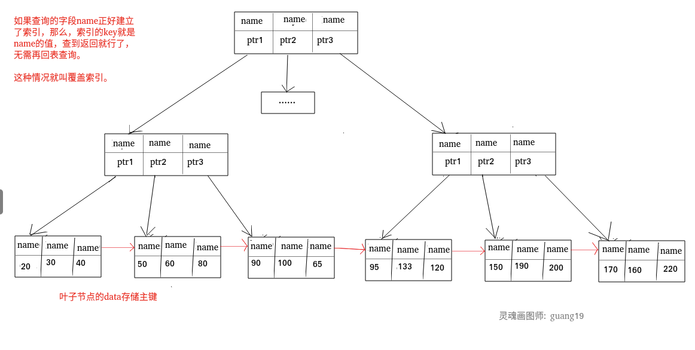
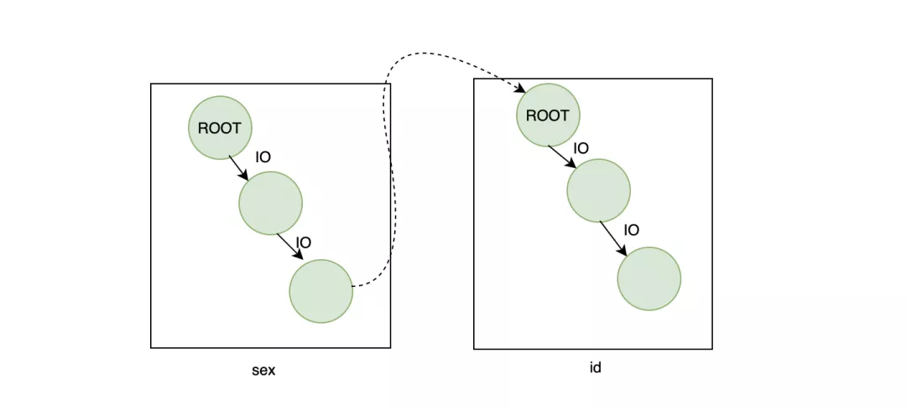

## 何为索引？有什么作用？

**索引是一种用于快速查询和检索数据的数据结构。常见的索引结构有: B 树， B+树和 Hash。**

索引的作用就相当于目录的作用。打个比方: 我们在查字典的时候，如果没有目录，那我们就只能一页一页的去找我们需要查的那个字，速度很慢。如果有目录了，我们只需要先去目录里查找字的位置，然后直接翻到那一页就行了。

## 索引的优缺点

**优点** ：

- 使用索引可以大大加快 数据的检索速度（大大减少检索的数据量）, 这也是创建索引的最主要的原因。
- 通过创建唯一性索引，可以保证数据库表中每一行数据的唯一性。

**缺点** ：

- 创建索引和维护索引需要耗费许多时间。当对表中的数据进行增删改的时候，如果数据有索引，那么索引也需要动态的修改，会降低 SQL 执行效率。
- 索引需要使用物理文件存储，也会耗费一定空间。

但是，**使用索引一定能提高查询性能吗?**

大多数情况下，索引查询都是比全表扫描要快的。但是如果数据库的数据量不大，那么使用索引也不一定能够带来很大提升。

## 索引的底层数据结构

### Hash表 & B+树

哈希表是键值对的集合，通过键(key)即可快速取出对应的值(value)，因此哈希表可以快速检索数据（接近 O（1））。

**为何能够通过 key 快速取出 value呢？** 原因在于 **哈希算法**（也叫散列算法）。通过哈希算法，我们可以快速找到 value 对应的 index，找到了 index 也就找到了对应的 value。

```java
hash = hashfunc(key)
index = hash % array_size
```


但是！哈希算法有个 **Hash 冲突** 问题，也就是说多个不同的  key 最后得到的 index 相同。通常情况下，我们常用的解决办法是 **链地址法**。链地址法就是将哈希冲突数据存放在链表中。就比如 JDK1.8 之前 `HashMap` 就是通过链地址法来解决哈希冲突的。不过，JDK1.8 以后`HashMap`为了减少链表过长的时候搜索时间过长引入了红黑树。


为了减少 Hash 冲突的发生，一个好的哈希函数应该“均匀地”将数据分布在整个可能的哈希值集合中。

既然哈希表这么快，**为什么MySQL 没有使用其作为索引的数据结构呢？**

**1.Hash 冲突问题** ：我们上面也提到过Hash 冲突了，不过对于数据库来说这还不算最大的缺点。

**2.Hash 索引不支持顺序和范围查询(Hash 索引不支持顺序和范围查询是它最大的缺点：** 假如我们要对表中的数据进行排序或者进行范围查询，那 Hash 索引可就不行了。

试想一种情况:

```java
SELECT * FROM tb1 WHERE id < 500;Copy to clipboardErrorCopied
```

在这种范围查询中，优势非常大，直接遍历比 500 小的叶子节点就够了。而 Hash 索引是根据 hash 算法来定位的，难不成还要把 1 - 499 的数据，每个都进行一次 hash 计算来定位吗?这就是 Hash 最大的缺点了。

### B 树& B+树

B 树也称 B-树,全称为 **多路平衡查找树** ，B+ 树是 B 树的一种变体。B 树和 B+树中的 B 是 `Balanced` （平衡）的意思。

目前大部分数据库系统及文件系统都采用 B-Tree 或其变种 B+Tree 作为索引结构。

**B 树& B+树两者有何异同呢？**

- B 树的所有节点既存放键(key) 也存放 数据(data)，而 B+树只有叶子节点存放 key 和 data，其他内节点只存放 key。
- B 树的叶子节点都是独立的;B+树的叶子节点有一条引用链指向与它相邻的叶子节点。
- B 树的检索的过程相当于对范围内的每个节点的关键字做二分查找，可能还没有到达叶子节点，检索就结束了。而 B+树的检索效率就很稳定了，任何查找都是从根节点到叶子节点的过程，叶子节点的顺序检索很明显。


在 MySQL 中，MyISAM 引擎和 InnoDB 引擎都是使用 B+Tree 作为索引结构，但是，两者的实现方式不太一样。（下面的内容整理自《Java 工程师修炼之道》）

MyISAM 引擎中，B+Tree 叶节点的 data 域存放的是数据记录的地址。在索引检索的时候，首先按照 B+Tree 搜索算法搜索索引，如果指定的 Key 存在，则取出其 data 域的值，然后以 data 域的值为地址读取相应的数据记录。这被称为“非聚簇索引”。

InnoDB 引擎中，其数据文件本身就是索引文件。相比 MyISAM，索引文件和数据文件是分离的，其表数据文件本身就是按 B+Tree 组织的一个索引结构，树的叶节点 data 域保存了完整的数据记录。这个索引的 key 是数据表的主键，因此 InnoDB 表数据文件本身就是主索引。这被称为“聚簇索引（或聚集索引）”，而其余的索引都作为辅助索引，辅助索引的 data 域存储相应记录主键的值而不是地址，这也是和 MyISAM 不同的地方。在根据主索引搜索时，直接找到 key 所在的节点即可取出数据；在根据辅助索引查找时，则需要先取出主键的值，在走一遍主索引。 因此，在设计表的时候，不建议使用过长的字段作为主键，也不建议使用非单调的字段作为主键，这样会造成主索引频繁分裂。

## 索引类型

### 主键索引(Primary Key)

数据表的主键列使用的就是主键索引。

一张数据表有只能有一个主键，并且主键不能为 null，不能重复。

在 MySQL 的 InnoDB 的表中，当没有显示的指定表的主键时，InnoDB 会自动先检查表中是否有唯一索引的字段，如果有，则选择该字段为默认的主键，否则 InnoDB 将会自动创建一个 6Byte 的自增主键。

### 二级索引(辅助索引)

**二级索引又称为辅助索引，是因为二级索引的叶子节点存储的数据是主键。也就是说，通过二级索引，可以定位主键的位置。**

唯一索引，普通索引，前缀索引等索引属于二级索引。

**PS:不懂的同学可以暂存疑，慢慢往下看，后面会有答案的，也可以自行搜索。**

1. **唯一索引(Unique Key)** ：唯一索引也是一种约束。**唯一索引的属性列不能出现重复的数据，但是允许数据为 NULL，一张表允许创建多个唯一索引。** 建立唯一索引的目的大部分时候都是为了该属性列的数据的唯一性，而不是为了查询效率。
2. **普通索引(Index)** ：**普通索引的唯一作用就是为了快速查询数据，一张表允许创建多个普通索引，并允许数据重复和 NULL。**
3. **前缀索引(Prefix)** ：前缀索引只适用于字符串类型的数据。前缀索引是对文本的前几个字符创建索引，相比普通索引建立的数据更小，
   因为只取前几个字符。
4. **全文索引(Full Text)** ：全文索引主要是为了检索大文本数据中的关键字的信息，是目前搜索引擎数据库使用的一种技术。Mysql5.6 之前只有 MYISAM 引擎支持全文索引，5.6 之后 InnoDB 也支持了全文索引。

二级索引:


## 聚集索引与非聚集索引

### 聚集索引

**聚集索引即索引结构和数据一起存放的索引。主键索引属于聚集索引。**

在 Mysql 中，InnoDB 引擎的表的 `.ibd`文件就包含了该表的索引和数据，对于 InnoDB 引擎表来说，该表的索引(B+树)的每个非叶子节点存储索引，叶子节点存储索引和索引对应的数据。

#### 聚集索引的优点

聚集索引的查询速度非常的快，因为整个 B+树本身就是一颗多叉平衡树，叶子节点也都是有序的，定位到索引的节点，就相当于定位到了数据。

#### 聚集索引的缺点

1. **依赖于有序的数据** ：因为 B+树是多路平衡树，如果索引的数据不是有序的，那么就需要在插入时排序，如果数据是整型还好，否则类似于字符串或 UUID 这种又长又难比较的数据，插入或查找的速度肯定比较慢。
2. **更新代价大** ： 如果对索引列的数据被修改时，那么对应的索引也将会被修改，
   而且况聚集索引的叶子节点还存放着数据，修改代价肯定是较大的，
   所以对于主键索引来说，主键一般都是不可被修改的。

### 非聚集索引

**非聚集索引即索引结构和数据分开存放的索引。**

**二级索引属于非聚集索引。**

> MYISAM 引擎的表的.MYI 文件包含了表的索引，
> 该表的索引(B+树)的每个叶子非叶子节点存储索引，
> 叶子节点存储索引和索引对应数据的指针，指向.MYD 文件的数据。
>
> **非聚集索引的叶子节点并不一定存放数据的指针，
> 因为二级索引的叶子节点就存放的是主键，根据主键再回表查数据。**

#### 非聚集索引的优点

**更新代价比聚集索引要小** 。非聚集索引的更新代价就没有聚集索引那么大了，非聚集索引的叶子节点是不存放数据的

#### 非聚集索引的缺点

1. 跟聚集索引一样，非聚集索引也依赖于有序的数据
2. **可能会二次查询(回表)** :这应该是非聚集索引最大的缺点了。 当查到索引对应的指针或主键后，可能还需要根据指针或主键再到数据文件或表中查询。

这是 MySQL 的表的文件截图:


聚集索引和非聚集索引:


### 非聚集索引一定回表查询吗(覆盖索引)?

**非聚集索引不一定回表查询。**

> 试想一种情况，用户准备使用 SQL 查询用户名，而用户名字段正好建立了索引。

```text
 SELECT name FROM table WHERE name='guang19';
```

> 那么这个索引的 key 本身就是 name，查到对应的 name 直接返回就行了，无需回表查询。

**即使是 MYISAM 也是这样，虽然 MYISAM 的主键索引确实需要回表，
因为它的主键索引的叶子节点存放的是指针。但是如果 SQL 查的就是主键呢?**

```text
SELECT id FROM table WHERE id=1;
```

主键索引本身的 key 就是主键，查到返回就行了。这种情况就称之为覆盖索引了。

## 覆盖索引

如果一个索引包含（或者说覆盖）所有需要查询的字段的值，我们就称之为“覆盖索引”。我们知道在 InnoDB 存储引擎中，如果不是主键索引，叶子节点存储的是主键+列值。最终还是要“回表”，也就是要通过主键再查找一次。这样就会比较慢覆盖索引就是把要查询出的列和索引是对应的，不做回表操作！

**覆盖索引即需要查询的字段正好是索引的字段，那么直接根据该索引，就可以查到数据了，
而无需回表查询。**

> 如主键索引，如果一条 SQL 需要查询主键，那么正好根据主键索引就可以查到主键。
>
> 再如普通索引，如果一条 SQL 需要查询 name，name 字段正好有索引，
> 那么直接根据这个索引就可以查到数据，也无需回表。

覆盖索引:


## 创建索引的注意事项

**1.选择合适的字段创建索引：**

- **不为 NULL 的字段** ：索引字段的数据应该尽量不为 NULL，因为对于数据为 NULL 的字段，数据库较难优化。如果字段频繁被查询，但又避免不了为 NULL，建议使用 0,1,true,false 这样语义较为清晰的短值或短字符作为替代。
- **被频繁查询的字段** ：我们创建索引的字段应该是查询操作非常频繁的字段。
- **被作为条件查询的字段** ：被作为 WHERE 条件查询的字段，应该被考虑建立索引。
- **频繁需要排序的字段** ：索引已经排序，这样查询可以利用索引的排序，加快排序查询时间。
- **被经常频繁用于连接的字段** ：经常用于连接的字段可能是一些外键列，对于外键列并不一定要建立外键，只是说该列涉及到表与表的关系。对于频繁被连接查询的字段，可以考虑建立索引，提高多表连接查询的效率。

**2.被频繁更新的字段应该慎重建立索引。**

虽然索引能带来查询上的效率，但是维护索引的成本也是不小的。
如果一个字段不被经常查询，反而被经常修改，那么就更不应该在这种字段上建立索引了。

**3.尽可能的考虑建立联合索引而不是单列索引。**

因为索引是需要占用磁盘空间的，可以简单理解为每个索引都对应着一颗 B+树。如果一个表的字段过多，索引过多，那么当这个表的数据达到一个体量后，索引占用的空间也是很多的，且修改索引时，耗费的时间也是较多的。如果是联合索引，多个字段在一个索引上，那么将会节约很大磁盘空间，且修改数据的操作效率也会提升。

**4.注意避免冗余索引** 。

冗余索引指的是索引的功能相同，能够命中索引(a, b)就肯定能命中索引(a) ，那么索引(a)就是冗余索引。如（name,city ）和（name ）这两个索引就是冗余索引，能够命中前者的查询肯定是能够命中后者的 在大多数情况下，都应该尽量扩展已有的索引而不是创建新索引。

**5.考虑在字符串类型的字段上使用前缀索引代替普通索引。**

前缀索引仅限于字符串类型，较普通索引会占用更小的空间，所以可以考虑使用前缀索引带替普通索引。

## 使用索引的一些建议

- 对于中到大型表索引都是非常有效的，但是特大型表的话维护开销会很大，不适合建索引
- 避免 where 子句中对字段施加函数，这会造成无法命中索引。
- 在使用 InnoDB 时使用与业务无关的自增主键作为主键，即使用逻辑主键，而不要使用业务主键。
- 删除长期未使用的索引，不用的索引的存在会造成不必要的性能损耗 MySQL 5.7 可以通过查询 sys 库的 schema_unused_indexes 视图来查询哪些索引从未被使用
- 在使用 limit offset 查询缓慢时，可以借助索引来提高性能

## MySQL 如何为表字段添加索引？

1.添加 PRIMARY KEY（主键索引）

```sql
ALTER TABLE `table_name` ADD PRIMARY KEY ( `column` )
```

2.添加 UNIQUE(唯一索引)

```sqlite
ALTER TABLE `table_name` ADD UNIQUE ( `column` )
```

3.添加 INDEX(普通索引)

```sql
ALTER TABLE `table_name` ADD INDEX index_name ( `column` )
```

4.添加 FULLTEXT(全文索引)

```sql
ALTER TABLE `table_name` ADD FULLTEXT ( `column`)
```

5.添加多列索引

```sql
ALTER TABLE `table_name` ADD INDEX index_name ( `column1`, `column2`, `column3` )
```


# MySQL常见问题（索引相关）

**1. 什么是索引?**

索引是一种数据结构,可以帮助我们快速的进行数据的查找.

**2. 索引是个什么样的数据结构呢?**

索引的数据结构和具体存储引擎的实现有关, 在MySQL中使用较多的索引有Hash索引,B+树索引等,而我们经常使用的InnoDB存储引擎的默认索引实现为:B+树索引.

**3. Hash索引和B+树所有有什么区别或者说优劣呢?**

首先要知道Hash索引和B+树索引的底层实现原理:

hash索引底层就是hash表,进行查找时,调用一次hash函数就可以获取到相应的键值,之后进行回表查询获得实际数据.B+树底层实现是多路平衡查找树.对于每一次的查询都是从根节点出发,查找到叶子节点方可以获得所查键值,然后根据查询判断是否需要回表查询数据.

那么可以看出他们有以下的不同:

- hash索引进行等值查询更快(一般情况下),但是却无法进行范围查询.

因为在hash索引中经过hash函数建立索引之后,索引的顺序与原顺序无法保持一致,不能支持范围查询.而B+树的的所有节点皆遵循(左节点小于父节点,右节点大于父节点,多叉树也类似),天然支持范围.

- hash索引不支持使用索引进行排序,原理同上.
- hash索引不支持模糊查询以及多列索引的最左前缀匹配.原理也是因为hash函数的不可预测.**AAAA**和**AAAAB**的索引没有相关性.
- hash索引任何时候都避免不了回表查询数据,而B+树在符合某些条件(聚簇索引,覆盖索引等)的时候可以只通过索引完成查询.
- hash索引虽然在等值查询上较快,但是不稳定.性能不可预测,当某个键值存在大量重复的时候,发生hash碰撞,此时效率可能极差.而B+树的查询效率比较稳定,对于所有的查询都是从根节点到叶子节点,且树的高度较低.

因此,在大多数情况下,直接选择B+树索引可以获得稳定且较好的查询速度.而不需要使用hash索引.

**4. 上面提到了B+树在满足聚簇索引和覆盖索引的时候不需要回表查询数据,什么是聚簇索引?**

在B+树的索引中,叶子节点可能存储了当前的key值,也可能存储了当前的key值以及整行的数据,这就是聚簇索引和非聚簇索引. 在InnoDB中,只有主键索引是聚簇索引,如果没有主键,则挑选一个唯一键建立聚簇索引.如果没有唯一键,则隐式的生成一个键来建立聚簇索引.

当查询使用聚簇索引时,在对应的叶子节点,可以获取到整行数据,因此不用再次进行回表查询.

**5. 非聚簇索引一定会回表查询吗?**

不一定,这涉及到查询语句所要求的字段是否全部命中了索引,如果全部命中了索引,那么就不必再进行回表查询.

举个简单的例子,假设我们在员工表的年龄上建立了索引,那么当进行`select age from employee where age < 20`的查询时,在索引的叶子节点上,已经包含了age信息,不会再次进行回表查询.

**6. 在建立索引的时候,都有哪些需要考虑的因素呢?**

建立索引的时候一般要考虑到字段的使用频率,经常作为条件进行查询的字段比较适合.如果需要建立联合索引的话,还需要考虑联合索引中的顺序.此外也要考虑其他方面,比如防止过多的所有对表造成太大的压力.这些都和实际的表结构以及查询方式有关.

**7. 联合索引是什么?为什么需要注意联合索引中的顺序?**

MySQL可以使用多个字段同时建立一个索引,叫做联合索引.在联合索引中,如果想要命中索引,需要按照建立索引时的字段顺序挨个使用,否则无法命中索引.

具体原因为:

MySQL使用索引时需要索引有序,假设现在建立了"name,age,school"的联合索引,那么索引的排序为: 先按照name排序,如果name相同,则按照age排序,如果age的值也相等,则按照school进行排序.

当进行查询时,此时索引仅仅按照name严格有序,因此必须首先使用name字段进行等值查询,之后对于匹配到的列而言,其按照age字段严格有序,此时可以使用age字段用做索引查找,,,以此类推.因此在建立联合索引的时候应该注意索引列的顺序,一般情况下,将查询需求频繁或者字段选择性高的列放在前面.此外可以根据特例的查询或者表结构进行单独的调整.

**8. 创建的索引有没有被使用到?或者说怎么才可以知道这条语句运行很慢的原因?**

MySQL提供了explain命令来查看语句的执行计划,MySQL在执行某个语句之前,会将该语句过一遍查询优化器,之后会拿到对语句的分析,也就是执行计划,其中包含了许多信息.
可以通过其中和索引有关的信息来分析是否命中了索引,例如possilbe_key,key,key_len等字段,分别说明了此语句可能会使用的索引,实际使用的索引以及使用的索引长度.

**9. 那么在哪些情况下会发生针对该列创建了索引但是在查询的时候并没有使用呢?**

- 使用不等于查询,
- 列参与了数学运算或者函数
- 在字符串like时左边是通配符.类似于'%aaa'.
- 当mysql分析全表扫描比使用索引快的时候不使用索引.
- 当使用联合索引,前面一个条件为范围查询,后面的即使符合最左前缀原则,也无法使用索引.
- 


# MySQL索引设计规范

### 1. 限制每张表上的索引数量,建议单张表索引不超过 5 个

索引并不是越多越好！索引可以提高效率同样可以降低效率。

索引可以增加查询效率，但同样也会降低插入和更新的效率，甚至有些情况下会降低查询效率。

因为 MySQL 优化器在选择如何优化查询时，会根据统一信息，对每一个可以用到的索引来进行评估，以生成出一个最好的执行计划，如果同时有很多个索引都可以用于查询，就会增加 MySQL 优化器生成执行计划的时间，同样会降低查询性能。

### 2. 禁止给表中的每一列都建立单独的索引

5.6 版本之前，一个 sql 只能使用到一个表中的一个索引，5.6 以后，虽然有了合并索引的优化方式，但是还是远远没有使用一个联合索引的查询方式好。

### 3. 每个 Innodb 表必须有个主键

Innodb 是一种索引组织表：数据的存储的逻辑顺序和索引的顺序是相同的。每个表都可以有多个索引，但是表的存储顺序只能有一种。

Innodb 是按照主键索引的顺序来组织表的

•不要使用更新频繁的列作为主键，不适用多列主键（相当于联合索引）•不要使用 UUID,MD5,HASH,字符串列作为主键（无法保证数据的顺序增长）•主键建议使用自增 ID 值

------

### 4. 常见索引列建议

•出现在 SELECT、UPDATE、DELETE 语句的 WHERE 从句中的列•包含在 ORDER BY、GROUP BY、DISTINCT 中的字段•并不要将符合 1 和 2 中的字段的列都建立一个索引， 通常将 1、2 中的字段建立联合索引效果更好•多表 join 的关联列

------

### 5.如何选择索引列的顺序

建立索引的目的是：希望通过索引进行数据查找，减少随机 IO，增加查询性能 ，索引能过滤出越少的数据，则从磁盘中读入的数据也就越少。

•区分度最高的放在联合索引的最左侧（区分度=列中不同值的数量/列的总行数）•尽量把字段长度小的列放在联合索引的最左侧（因为字段长度越小，一页能存储的数据量越大，IO 性能也就越好）•使用最频繁的列放到联合索引的左侧（这样可以比较少的建立一些索引）

------

### 6. 避免建立冗余索引和重复索引（增加了查询优化器生成执行计划的时间）

•重复索引示例：primary key(id)、index(id)、unique index(id)•冗余索引示例：index(a,b,c)、index(a,b)、index(a)

------

### 7. 对于频繁的查询优先考虑使用覆盖索引

> 覆盖索引：就是包含了所有查询字段 (where,select,ordery by,group by 包含的字段) 的索引

**覆盖索引的好处：**

•**避免 Innodb 表进行索引的二次查询:** Innodb 是以聚集索引的顺序来存储的，对于 Innodb 来说，二级索引在叶子节点中所保存的是行的主键信息，如果是用二级索引查询数据的话，在查找到相应的键值后，还要通过主键进行二次查询才能获取我们真实所需要的数据。而在覆盖索引中，二级索引的键值中可以获取所有的数据，避免了对主键的二次查询 ，减少了 IO 操作，提升了查询效率。•**可以把随机 IO 变成顺序 IO 加快查询效率:** 由于覆盖索引是按键值的顺序存储的，对于 IO 密集型的范围查找来说，对比随机从磁盘读取每一行的数据 IO 要少的多，因此利用覆盖索引在访问时也可以把磁盘的随机读取的 IO 转变成索引查找的顺序 IO。

------

### 8.索引 SET 规范

**尽量避免使用外键约束**

•不建议使用外键约束（foreign key），但一定要在表与表之间的关联键上建立索引•外键可用于保证数据的参照完整性，但建议在业务端实现•外键会影响父表和子表的写操作从而降低性能


# 小心陷入MySQL索引的坑

索引可以说是数据库中的一个大心脏了，如果说一个数据库少了索引，那么数据库本身存在的意义就不大了，和普通的文件没什么两样。所以说一个好的索引对数据库系统尤其重要，今天来说说MySQL索引，从细节和实际业务的角度看看在MySQL中B+树索引好处，以及我们在使用索引时需要注意的知识点。

## ***\*合理利用索引\****

在工作中，我们可能判断数据表中的一个字段是不是需要加索引的最直接办法就是：这个字段会不会经常出现在我们的where条件中。从宏观的角度来说，这样思考没有问题，但是从长远的角度来看，有时可能需要更细致的思考，比如我们是不是不仅仅需要在这个字段上建立一个索引？多个字段的联合索引是不是更好？以一张用户表为例，用户表中的字段可能会有***\*用户的姓名\****、***\*用户的身份证号\****、***\*用户的家庭地址\****等等。

 

### ***\*「1.普通索引的弊端」\****

现在有个需求需要根据用户的身份证号找到用户的姓名，这时候很显然想到的第一个办法就是在id_card上建立一个索引，严格来说是唯一索引，因为身份证号肯定是唯一的，那么当我们执行以下查询的时候：

***\*SELECT\**** ***\*name\**** ***\*FROM\**** ***\*user\**** ***\*WHERE\**** id_card=xxx

它的流程应该是这样的：

\1. 先在id_card索引树上搜索，找到id_card对应的主键id

\2. 通过id去主键索引上搜索，找到对应的name

从效果上来看，结果是没问题的，但是从效率上来看，似乎这个查询有点昂贵，因为它检索了两颗B+树，假设一颗树的高度是3，那么两颗树的高度就是6，因为根节点在内存里（此处两个根节点），所以最终要在磁盘上进行IO的次数是4次，以一次磁盘随机IO的时间平均耗时是10ms来说，那么最终就需要40ms。这个数字一般，不算快。

### ***\*「2.主键索引的陷阱」\****

既然问题是回表，造成了在两颗树都检索了，那么核心问题就是看看能不能只在一颗树上检索。这里从业务的角度你可能发现了一个切入点，***\*身份证号是唯一的\****，那么我们的主键是不是可以不用默认的自增id了，我们把主键设置成我们的身份证号，这样整个表的只需要一个索引，并且通过身份证号可以查到所有需要的数据包括我们的姓名，简单一想似乎有道理，只要每次插入数据的时候，指定id是身份证号就行了，但是仔细一想似乎有问题。

这里要从B+树的特点来说，B+树的数据都存在叶子节点上，并数据是页式管理的，一页是16K，这是什么意思呢？哪怕我们现在是一行数据，它也要占用16K的数据页，只有当我们的数据页写满了之后才会写到一个新的数据页上，新的数据页和老的数据页在物理上***\*不一定是连续的\****，而且有一点很关键，虽然数据页物理上是不连续的，但是数据在***\*逻辑上是连续的\****。

也许你会好奇，这和我们说的身份证号当主键ID有什么关系？这时你应该关注**「连续」**这个关键字，身份证号不是连续的，这意味着什么？当我们插入一条不连续的数据的时候，为了保持连续，需要移动数据，比如原来在一页上的数据有1->5，这时候插入了一条3，那么就需要把5移到3后面，也许你会说这也没多少开销，但是如果当新的数据3造成这个页A满了，那么就要看它后面的页B是否有空间，如果有空间，这时候页B的开始数据应该是这个从页A溢出来的那条，对应的也要移动数据。如果此时页B也没有足够的空间，那么就要申请新的页C，然后移一部分数据到这个新页C上，并且会切断页A与页B之间的关系，在两者之间插入一个页C，从代码的层面来说，就是切换链表的指针。

 

***\*总结来说，不连续的身份证号当主键可能会造成页数据的移动、随机IO、频繁申请新页相关的开销\****。如果我们用的是自增的主键，那么对于id来说一定是顺序的，不会因为随机IO造成数据移动的问题，在插入方面开销一定是相对较小的。

其实不推荐用身份证号当主键的还有另外一个原因：身份证号作为数字来说太大了，得用bigint来存，正常来说一个学校的学生用int已经足够了，我们知道一页可以存放16K，当一个索引本身占用的空间越大时，会导致一页能存放的数据越少，所以在一定数据量的情况下，使用bigint要比int需要更多的页也就是更多的存储空间。

### ***\*「3.联合索引的矛与盾」\****

由上面两条结论可以得出：

**1.** ***\*尽量不要去回表\****

**2.** ***\*身份证号不适合当主键索引\****

所以自然而然地想到了联合索引，创建一个【身份证号+姓名】的联合索引，注意联合索引的顺序，要符合最左原则。这样当我们同样执行以下sql时：

select name from user where id_card=xxx

不需要回表就可以得到我们需要的name字段，然而还是没有解决身份证号本身占用空间过大的问题，这是业务数据本身的问题，如果你要解决它的话，我们可以通过一些转换算法将原本大的数据转换成小的数据，比如crc32：

crc32.ChecksumIEEE([]byte("341124199408203232"))

可以将原本需要8个字节存储空间的身份证号用4个字节的crc码替代，因此我们的数据库需要再加个字段crc_id_card，联合索引也从【身份证号+姓名】变成了【crc32(身份证号)+姓名】，联合索引占的空间变小了。但是这种转换也是有代价的：

\1. 每次额外的crc，导致需要更多cpu资源

\2. 额外的字段，虽然让索引的空间变小了，但是本身也要占用空间

\3. crc会存在冲突的概率，这需要我们查询出来数据后，再根据id_card过滤一下，过滤的成本根据重复数据的数量而定，重复越多，过滤越慢。

关于联合索引存储优化，这里有个小细节，假设现在有两个字段A和B，分别占用8个字节和20个字节，我们在联合索引已经是[A,B]的情况下，还要支持B的单独查询，因此自然而然我们在B上也建立个索引，那么两个索引占用的空间为 ***\*8+20+20=48\****，现在无论我们通过A还是通过B查询都可以用到索引，如果在业务允许的条件下，我们是否可以建立[B,A]和A索引，这样的话，不仅满足单独通过A或者B查询数据用到索引，还可以占用更小的空间：***\*20+8+8=36\****。

### ***\*「4.前缀索引的短小精悍」\****

有时候我们需要索引的字段是字符串类型的，并且这个字符串很长，我们希望这个字段加上索引，但是我们又不希望这个索引占用太多的空间，这时可以考虑建立个前缀索引，以这个字段的前一部分字符建立个索引，这样既可以享受索引，又可以节省空间，这里需要注意的是在前缀重复度较高的情况下，前缀索引和普通索引的速度应该是有差距的。

alter table xx add index(name(7));#name前7个字符建立索引
select xx from xx where name="JamesBond"

### ***\*「5.唯一索引的快与慢」\****

在说唯一索引之前，我们先了解下普通索引的特点，我们知道对于B+树而言，叶子节点的数据是有序的。

 

假设现在我们要查询***\*2\****这条数据，那么在通过索引树找到2的时候，存储引擎并没有停止搜索，因为可能存在多个2，这表现为存储引擎会在叶子节点上接着向后查找，在找到第二个2之后，就停止了吗？答案是否，因为存储引擎并不知道后面还有没有更多的2，所以得接着向后查找，直至找到第一个不是2的数据，也就是3，找到3之后，停止检索，这就是普通索引的检索过程。

唯一索引就不一样了，因为唯一性，不可能存在重复的数据，所以在检索到我们的目标数据之后直接返回，不会像普通索引那样还要向后多***\*查找一次\****，从这个角度来看，唯一索引是要比普通索引快的，但是当普通索引的数据都在一个页内的话，其实也并不会快多少。在数据的插入方面，唯一索引可能就稍逊色，因为唯一性，每次插入的时候，都需要将判断要插入的数据是否已经存在，而普通索引不需要这个逻辑，并且很重要的一点是唯一索引会用不到change buffer（见下文）。

### ***\*「6.不要盲目加索引」\****

在工作中，你可能会遇到这样的情况：这个字段我需不需要加索引？。对于这个问题，我们常用的判断手段就是：查询会不会用到这个字段，如果这个字段经常在查询的条件中，我们可能会考虑加个索引。但是如果只根据这个条件判断，你可能会加了一个错误的索引。我们来看个例子：假设有张用户表，大概有100w的数据，用户表中有个性别字段表示男女，男女差不多各占一半，现在我们要统计所有男生的信息，然后我们给性别字段加了索引，并且我们这样写下了sql：

select * from user where sex="男"

如果不出意外的话，InnoDB是不会选择性别这个索引的。如果走性别索引，那么一定是需要回表的，在数据量很大的情况下，回表会造成什么样的后果？我贴一张和上面一样的图想必大家都知道了：

主要就是大量的IO，一条数据需要4次，那么50w的数据呢？结果可想而知。因此针对这种情况，MySQL的优化器大概率走全表扫描，直接扫描主键索引，因为这样性能可能会更高。

### ***\*「7.索引失效那些事」\****

某些情况下，因为我们自己使用的不当，导致mysql用不到索引，这一般很容易发生在类型转换方面，也许你会说，mysql不是已经支持隐式转换了吗？比如现在有个整型的user_id索引字段，我们因为查询的时候没注意，写成了：

select xx from user where user_id="1234"

注意这里是字符的1234，当发生这种情况下，MySQL确实足够聪明，会把字符的1234转成数字的1234，然后愉快的使用了user_id索引。但是如果我们有个字符型的user_id索引字段，还是因为我们查询的时候没注意，写成了：

select xx from user where user_id=1234

这时候就有问题了，会用不到索引，也许你会问，这时MySQL为什么不会转换了，把数字的1234转成字符型的1234不就行了？这里需要解释下转换的规则了，当出现字符串和数字比较的时候，要记住：MySQL会把字符串转换成数字。也许你又会问：为什么把字符型user_id字段转换成数字就用不到索引了? 这又要说到B+树索引的结构了，我们知道B+树的索引是按照索引的值来分叉和排序的，当我们把索引字段发生类型转换时会发生值的变化，比如原来是A值，如果执行整型转换可能会对应一个B值（int(A)=B）,这时这颗索引树就不能用了，因为索引树是按照A来构造的，不是B，所以会用不到索引。

## ***\*索引优化\****

### ***\*「1.change buffer」\****

我们知道在更新一条数据的时候，要先判断这条数据的页是否在内存里，如果在的话，直接更新对应的内存页，如果不在的话，只能去磁盘把对应的数据页读到内存中来，然后再更新，这会有什么问题呢？

\1. 去磁盘的读这个动作稍显的有点慢

\2. 如果同时更新很多数据，那么即有可能发生很多离散的IO

为了解决这种情况下的速度问题，***\*change buffer\****出现了，首先不要被buffer这个单词误导，change buffer除了会在公共的buffer pool里之外，也是会持久化到磁盘的。当有了change buffer之后，我们更新的过程中，如果发现对应的数据页不在内存里的话，也不去磁盘读取相应的数据页了，而是把要更新的数据放入到change buffer中，那change buffer的数据何时被同步到磁盘上去？如果此时发生读动作怎么办？首先后台有个线程会定期把change buffer的数据同步到磁盘上去的，如果线程还没来得及同步，但是又发生了读操作，那么也会触发把change buffer的数据merge到磁盘的事件。

 

需要注意的是并不是所有的索引都能用到changer buffer，像主键索引和唯一索引就用不到，因为唯一性，所以它们在更新的时候要判断数据存不存在，如果数据页不在内存中，就必须去磁盘上把对应的数据页读到内存里，而普通索引就没关系了，不需要校验唯一性。change buffer越大，理论收益就越大，这是因为首先离散的读IO变少了，其次当一个数据页上发生多次变更，只需merge一次到磁盘上。当然并不是所有的场景都适合change buffer，如果你的业务是更新之后，需要立马去读，change buffer会适得其反，因为需要不停地触发merge动作，导致随机IO的次数不会变少，反而增加了维护change buffer的开销。

### ***\*「2.索引下推」\****

前面我们说了联合索引，联合索引要满足最左原则，即在联合索引是[A,B]的情况下，我们可以通过以下的sql用到索引：

select * from table where A="xx"
select * from table where A="xx" AND B="xx"

其实联合索引也可以使用最左前缀的原则，即：

select * from table where A like "赵%" AND B="上海市"

但是这里需要注意的是，因为使用了A的一部分，在MySQL5.6之前，上面的sql在检索出所有A是“赵”开头的数据之后，就立马回表（使用的select *），然后再对比B是不是“上海市”这个判断，这里是不是有点懵？为什么B这个判断不直接在联合索引上判断，这样的话回表的次数不就少了吗？造成这个问题的原因还是因为使用了最左前缀的问题，导致索引虽然能使用部分A，但是完全用不到B，看起来是有点“傻”，于是在MySQL5.6之后，就出现了索引下推这个优化（Index Condition Pushdown）,有了这个功能以后，虽然使用的是最左前缀，但是也可以在联合索引上搜索出符合A%的同时也过滤非B的数据，大大减少了回表的次数。

 

### ***\*「3.刷新邻接页」\****

在说刷新邻接页之前，我们先说下脏页，我们知道在更新一条数据的时候，得先判断这条数据所在的页是否在内存中，如果不在的话，需要把这个数据页先读到内存中，然后再更新内存中的数据，这时会发现内存中的页有最新的数据，但是磁盘上的页却依然是老数据，那么此时这条数据所在的内存中的页就是脏页，需要刷到磁盘上来保持一致。所以问题来了，何时刷？每次刷多少脏页才合适？如果每次变更就刷，那么性能会很差，如果很久才刷，脏页就会堆积很多，造成内存池中可用的页变少，进而影响正常的功能。所以刷的速度不能太快但要及时，MySQL有个***\*清理线程\****会定期执行，保证了不会太快，当***\*脏页太多\****或者***\*redo log已经快满\****了，也会立刻触发刷盘，保证了及时。

 

在脏页刷盘的过程中，InnoDB这里有个优化：如果要刷的脏页的邻居页也脏了，那么就顺带一起刷，这样的好处就是可以减少随机IO，在机械磁盘的情况下，优化应该挺大，但是这里可能会有坑，如果当前脏页的邻居脏页在被一起刷入后，邻居页立马因为数据的变更又变脏了，那此时是不是有种多此一举的感觉，并且反而浪费了时间和开销。更糟糕的是如果邻居页的邻居也是脏页...，那么这个连锁反应可能会出现短暂的性能问题。

### ***\*「4.MRR」\****

在实际业务中，我们可能会被告知尽量使用覆盖索引，不要回表，因为回表需要更多IO，耗时更长，但是有时候我们又不得不回表，回表不仅仅会造成过多的IO，更严重的是过多的离散IO。

select * from user where grade between 60 and 70

现在要查询成绩在60-70之间的用户信息，于是我们的sql写成上面的那样，当然我们的grade字段是有索引的，按照常理来说，会先在grade索引上找到grade=60这条数据，然后再根据grade=60这条数据对应的id去主键索引上找，最后再次回到grade索引上，不停的重复同样的动作...， 假设现在grade=60对应的id=1，数据是在page_no_1上，grade=61对应的id=10，数据是在page_no_2上，grade=62对应的id=2，数据是在page_no_1上，所以真实的情况就是先在page_no_1上找数据，然后切到page_no_2，最后又切回page_no_1上，但其实id=1和id=2完全可以合并，读一次page_no_1即可，不仅节省了IO，同时避免了随机IO，这就是MRR。当使用MRR之后，辅助索引不会立即去回表，而是将得到的主键id，放在一个buffer中，然后再对其排序，排序后再去顺序读主键索引，大大减少了离散的IO。

 

 

# MySQL的order by

排序这个词，我的第一感觉是几乎所有App都有排序的地方，淘宝商品有按照购买时间的排序、B站的评论有按照热度排序的...，当然我们今天说的并不是大数据下该如何优雅的排序，如何提升排序性能的问题，我们说一说MySQL中的排序。

对于MySQL，一说到排序，你第一时间想到的是什么？关键字order by？order by的字段最好有索引？叶子结点已经是顺序的？还是说尽量不要在MySQL内部排序？

## ***\*事情的起因\****

现在假设有一张用户的朋友表：

***\*CREATE\**** ***\*TABLE\**** `user` (
 `id` int(10) AUTO_INCREMENT,
 `user_id` int(10),
 `friend_addr` varchar(1000),
 `friend_name` varchar(100), 
 PRIMARY ***\*KEY\**** (`id`),
 ***\*KEY\**** `user_id` (`user_id`)
) ***\*ENGINE\****=***\*InnoDB\****;

表中目前有两个点需要关注下：

\1. 用户的 ***\*user_id\**** ，朋友的姓名 ***\*friend_name\****、朋友的地址 ***\*friend_addr\****

\2. user_id 是有***\*索引\****的

有一天，有个初级开发工程师小猿，收到了来自初级产品经理小汪的需求：
***\*小汪\****：小猿同志，现在需要在后台加个功能，这个功能要支持根据用户 id 能查到他所有的朋友姓名和地址，并且要求朋友的姓名是按照字典排序的。
***\*小猿\****：好的，这个功能简单，我马上就上线。

于是小猿书写了这样的sql：

***\*select\**** friend_name，friend_addr ***\*from\**** ***\*user\**** ***\*where\**** user_id=? ***\*order\**** ***\*by\**** ***\*name\****

在电光石火的瞬间，小猿趾高气昂的上线了，这一切都很顺利，直到有一天有个运营同学导致了这样的查询：

***\*select\**** friend_name，friend_addr ***\*from\**** ***\*user\**** ***\*where\**** user_id=10086 ***\*order\**** ***\*by\**** ***\*name\****

然而，这个查询竟然比平时慢很多，数据库报了慢查询，小猿此时慌的一b：这是怎么回事？user_id 明明有索引啊，而且机智地我还只用了 select friend_name,friend_addr，并没有用 select *呀。小猿此时不停地安慰自己，要淡定要淡定，然后突然想到有个explain命令，用explain来查看下那条sql的执行计划吧，当小猿用了explain之后，发现extra字段里面有个看起来很危险的字眼：***\*using filesort\****。

“这个查询竟然用到了传说中的文件排序，但是如果一个人朋友不是很多，就算了用了文件排序，应该也很快吧”，除非这个user_id=10086的朋友很多，后来小猿去查了下，这个用户的朋友竟然有10w多个～。

陷入了沉思的小猿心想：这个锅看来是背定了，10w数据是有点大了，还有这个 using filesort 到底是怎么个排序原理？

## ***\*解剖文件排序\****

有人可能说上面的问题是10w数据太大了，就算不排序也慢，这个其实是有道理的，10w数据一次性查出来，无论是MySQL内存缓冲区的占用，还是网络带宽的消耗都是非常大的，那如果我加了limit 1000呢？网络带宽的问题肯定是解决了，因为数据包整体变小了，但是 ***\*using filesort\**** 的问题其实还是没有解决，看到这里你可能会有疑问，using filesort 难道是在文件中排序的？在文件中到底是怎么排序的？或者我这样问：如果给你来设计排序你会怎么处理？带着这些疑问和思考我们来看看 using filesort 会涉及到哪些技术难点以及是如何解决的？

\1. 首先我们的 user_id 是有索引的，所以会先在 user_id 索引树上检索我们的目标数据，即 user_id=10086 的数据，但是我们要查询的是 friend_name 和 friend_addr 字段，很不幸，光靠 user_id 索引是找不到这两个字段值的

\2. 于是需要回表，通过 user_id 对应的主键去主键索引树上去查找，ok，我们找到了第一条 user_id=10086 的 friend_name 和 friend_addr 字段

\3. 这时该怎么办？直接返回回去肯定不对，因为我需要对 friend_name 排序，如何排？数据都还没找全，那么就得把查到的数据先放在一个地方，这个地方就是 ***\*sort_buffer\****，看到名字我想你应该猜出来，没错，sort_buffer 就是用于这种情况下排序用的缓冲区，这里需要注意的是每个线程都会有一个单独的 sort_buffer，这么做的目的主要是为了避免多个线程对同一块内存进行操作带来锁竞争的问题。

\4. 当第一条数据的 friend_name 和 friend_addr 已经放入 sort_buffer 中，这当然没完，会一直重复同步的步骤，直至把所有 user_id=10086 的 friend_name 和 friend_addr 都放入到 sort_buffer 中才结束

\5. sort_buffer 中的数据已经放入完毕，接下来就该排序了，这里 MySQL 会对 friend_name 进行快排，通过快排后，sort_buffer 中 friend_name 就是有序的了

\6. 最后返回 sort_buffer 中的前1000条，结束。

 

一切看起来很丝滑，但是 sort_buffer 占用的是内存空间，这就尴尬了，内存本身就不是无限大的，它肯定是有上限的，当然 sort_buffer 也不能太小，太小的话，意义不大。在 InnoDB 存储引擎中，这个值是默认是256K。

mysql> ***\*show\**** ***\*variables\**** ***\*like\**** 'sort_buffer_size';
+------------------+--------+
| Variable_name  | Value |
+------------------+--------+
| sort_buffer_size | 262144 |
+------------------+--------+

也就是说，如果要放进 sort_buffer 中的数据是大于256K的话，那么采用在 sort_buffer 中快排的方式肯定是行不通的，这时候，你可能会问：MySQL难道不能根据数据大小自动扩充吗？额，MySQL是多线程模型，如果每个线程都扩充，那么分给其他功能buffer就小了（比如change buffer等），就会影响其他功能的质量。

这时就得换种方式来排序了，没错，此时就是真正的文件排序了，也就是磁盘的临时文件，MySQL会采用归并排序的思想，把要排序的数据分成若干份，每一份数据在内存中排序后会放入临时文件中，最终对这些已经排序好的临时文件的数据再做一次合并排序就ok了，典型的分而治之原理，它的具体步骤如下：

\1. 先将要排序的数据分割，分割成每块数据都可以放到 sort_buffer 中

\2. 对每块数据在 sort_buffer 中进行排序，排序好后，写入某个临时文件中

\3. 当所有的数据都写入临时文件后，这时对于每个临时文件而言，内部都是有序的，但是它们并不是一个整体，整体还不是有序的，所以接下来就得合并数据了

\4. 假设现在存在 tmpX 和 tmpY 两个临时文件，这时会从 tmpX 读取一部分数据进入内存，然后从 tmpY 中读取一部分数据进入内存，这里你可能会好奇为什么是一部分而不是整个或者单个？因为首先磁盘是缓慢的，所以尽量每次多读点数据进入内存，但是不能读太多，因为还有 buffer 空间的限制。

\5. 对于 tmpX 假设读进来了的是 tmpX[0-5] ,对于 tmpY 假设读进来了的是 tmpY[0-5]，于是只需要这样比较：如果 tmpX[0] < tmpY[0]，那么 tmpX[0] 肯定是最小的，然后 tmpX[1] 和 tmpY[0] 比较，如果 tmpX[1] > tmpY[0]，那么 tmpY[0] 肯定是第二小的...，就这样两两比较最终就可以把 tmpX 和 tmpY 合并成一个有序的文件tmpZ，多个这样的tmpZ再次合并...，最终就可以把所有的数据合并成一个有序的大文件。

 

## ***\*文件排序很慢，还有其他办法吗\****

通过上面的排序流程我们知道，如果要排序的数据很大，超过 sort_buffer 的大小，那么就需要文件排序，文件排序涉及到分批排序与合并，很耗时，造成这个问题的根本原因是 ***\*sort_buffer 不够用\****，不知道你发现没有我们的 friend_name 需要排序，但是却把 friend_addr 也塞进了 sort_buffer 中，这样***\*单行数据的大小就等于 friend_name 的长度 + friend_addr 的长度\****，能否让 sort_buffer 中只存 friend_name 字段，这样的话，整体的利用空间就大了，不一定用得到到临时文件。没错，这就是接下来要说的另一种排序优化***\*rowid排序\****。

rowid 排序的思想就是把不需要的数据不要放到 sort_buffer 中，让 sort_buffer 中只保留必要的数据，那么你认为什么是必要的数据呢？只放 friend_name？这肯定不行，排序完了之后，friend_addr 怎么办？因此还要把主键id放进去，这样排完之后，通过 id 再回次表，拿到 friend_addr 即可，因此它的大致流程如下：

\1. 根据 user_id 索引，查到目标数据，然后回表，只把 id 和 friend_name 放进 sort_buffer 中

\2. 重复1步骤，直至全部的目标数据都在 sort_buffer 中

\3. 对 sort_buffer 中的数据按照 friend_name 字段进行排序

\4. 排序后根据 id 再次回表查到 friend_addr 返回，直至返回1000条数据，结束。

 

这里面其实有几点需要注意的：

\1. 这种方式需要两次回表的

\2. sort_buffer 虽然小了，但是如果数据量本身还是很大，应该还是要临时文件排序的

那么问题来了，两种方式，MySQL 该如何选择？得根据某个条件来判断走哪种方式吧，这个条件就是进 sort_buffer 单行的长度，如果长度太大（friend_name + friend_addr的长度），就会采用 rowid 这种方式，否则第一种，长度的标准是根据 ***\*max_length_for_sort_data\**** 来的，这个值默认是1024字节：

mysql> ***\*show\**** ***\*variables\**** ***\*like\**** 'max_length_for_sort_data';
+--------------------------+-------+
| Variable_name     | Value |
+--------------------------+-------+
| max_length_for_sort_data | 1024 |
+--------------------------+-------+

## ***\*不想回表，不想再次排序\****

其实不管是上面哪种方法，他们都需要***\*回表\****+***\*排序\****，回表是因为二级索引上没有目标字段，排序是因为数据不是有序的，那如果二级索引上有目标字段并且已经是排序好的了，那不就两全其美了嘛。

没错，就是联合索引，我们只需要建立一个 （user_id，friend_name，friend_addr）的联合索引即可，这样我就可以通过这个索引拿到目标数据，并且friend_name已经是排序好的，同时还有friend_addr字段，一招搞定，不需要回表，不需要再次排序。因此对于上述的sql，它的大致流程如下：

\1. 通过联合索引找到user_id=10086的数据，然后读取对应的 friend_name 和 friend_addr 字段直接返回，因为 friend_name 已经是排序好的了，不需要额外处理

\2. 重复第一步骤，顺着叶子节点接着向后找，直至找到第一个不是10086的数据，结束。

 

联合索引虽然可以解决这种问题，但是在实际应用中切不可盲目建立，要根据实际的业务逻辑来判断是否需要建立，如果不是经常有类似的查询，可以不用建立，因为联合索引会占用更多的存储空间和维护开销。

## ***\*总结\****

\1. 对于 order by 没有用到索引的时候，这时 explain 中 Extra 字段大概是会出现 using filesort 字眼

\2. 出现 using filesort 的时候也不用太慌张，如果本身数据量不大，比如也就几十条数据，那么在 sort buffer 中使用快排也是很快的

\3. 如果数据量很大，超过了 sort buffer 的大小，那么是要进行临时文件排序的，也就是归并排序，这部分是由 MySQL 优化器决定的

\4. 如果查询的字段很多，想要尽量避免使用临时文件排序，可以尝试设置下 max_length_for_sort_data 字段的大小，让其小于所有查询字段长度的总和，这样放入或许可以避免，但是会多一次回表操作

\5. 实际业务中，我们也可以给经常要查询的字段组合建立个联合索引，这样既不用回表也不需要单独排序，但是联合索引会占用更多的存储和开销

\6. 大量数据查询的时候，尽量分批次，提前 explain 来观察 sql 的执行计划是个不错的选择。

 

# mysql索引

mysql索引真的是一个让人不得不说的话题，这个东西你在面试中会用到，在实际的工作中也会用到，这更是一个专业的DBA所必须掌握的内容，它的重要性体你在大厂的面试题汇总也可以看到，属于必问的一个内容。
这篇文章的内容可能有点多，也有点晦涩难懂，没有基础的小伙伴需要多读几遍才能读懂，但是希望你能沉下心来读完这篇文章，你会得到更多：

**什么是索引？****
****常见的索引模型有哪些？什么是回表？什么是覆盖索引？什么是最左前缀原则？什么是索引下推？****
****..............****
****
**

**正文**

**什么是索引？****
**相信大家小时候学习汉字的时候都会查字典，想想你查字典的步骤，我们是通过汉字的首字母a～z一个一个在字典目录中查找，最终找到该字的页数。想想，如果没有目录会怎么样，最差的结果是你有可能翻到字典的最后一页才找到你想要找的字。
索引就相当于我们字典中的目录，可以极大的提高我们在数据库的查询效率。

**常见的索引模型有哪些？**
**①有序数组**
  如图：
我们按照IDCard从小到大排列：
在我们想要根据IDCard查找某一条数据时，就可以通过二分法查找。

在我们想要根据IDCard查找IDCard在 10 到 1000 内的的数据时，就可以先通过二分法先查找10，然后向递增的方向遍历，找到IDCard为1000，再继续遍历，直到找到的IDCard大于1000时就完成了整个范围查询。
我们仅仅从查询的角度来看有序数组已经很优秀了，但是我们都知道，有序数组在插入一条数据时是非常麻烦的，你需要将你插入位置后面的数据整体向后移一位，这是非常消耗性能的。

**优点**：查询效率很高，也很适合范围查询。**缺点**：当新数据插入时会影响效率。


**②哈希表****
**如图学过hashmap 的朋友应该都比较了解了，它的原理其实就是将IDCard通过哈希算法计算出一个特定的值，然后存储地址，这样在你找数据的时候直接可以通过IDCard去找了，当然也会有种情况，就是两个元素选中了相同的空间，我们通常会引出一个链表去存储。
我们可以看到hash表在等值查询的效率是很高的，但是由于hash表是无序的，所以在范围查询的时候只能遍历所有了，效率会很低。
感兴趣的朋友可以去看看lru，是如何解决范围查询的问题的，后续我也会和大家讲讲。
**优点**：等值查询效率高，插入效率高**缺点**：不适合范围查询

**③二叉树**
如图：
二叉树是比较经典的数据结构了，它的特点是每个节点的左儿子小于父节点，父节点又小于右儿子。
二叉树是有序的，查找的时间复杂度为O(logn)

二叉树可以说在插入查询方面都是比较优秀的，但是在数据的索引选择方面我们并不会选择二叉树，我们按照上图来讲：
假如我要访问IDCard5，那么我要先访问IDCard1，然后访问IDCard3，最后才能访问到IDCard5，我们总会访问了3个数据块，每一次访问都是一次磁盘寻址的过程，假设树高30，那么我们最差的情况下寻找一个数据要访问30次磁盘，这在效率上是不能忍受的。
**④B+树****
**如图**
**
我们数据库innodb默认的索引引擎就是B+树。
B+树其实是就是一个N叉树，只在子节点上存储数据，并且子节点用链表维护，而且是有序的，在范围查询（链表更高效），等值查询，插入新数据上来说都是很高效的。并且作为N叉树，在树的每一层都可以存储很多数据，这样在数据库查询数据的时候最差也只需要几次磁盘寻址就可以了。

在mysql中有主键索引和非主键索引之分，主键索引上存储的是数据行信息，非主键索引上存储的是主键信息。
如下

· 

· 

· 

· 

· 

· 

· 

CREATE TABLE `user` ( `id` bigint(20) NOT NULL AUTO_INCREMENT COMMENT '主键',  `application` varchar(64) NOT NULL DEFAULT '' COMMENT '所属应用名称', `owner` varchar(32) NOT NULL DEFAULT '' COMMENT '负责人',  PRIMARY KEY (`id`),  UNIQUE KEY `idx_application_id` (`application`) USING BTREE)ENGINE=InnoDB AUTO_INCREMENT=11 DEFAULT CHARSET=utf8mb4 COMMENT='用户表';


主键为id，那么id这棵B+树上就会存储该行所有的信息字段，包括application，owner。
对于没有主键的表，innodb会给默认创建一个Rowid做主键。
唯一索引是application，那么在application这颗索引树上存储的信息就是id。

**优点**：

♦第一层只放索引信息，存放的索引信息更多。

♦树高更低，故磁盘寻址带来的损耗更小。♦链表维护，范围查询效率更高。
**⑤B-树**
如图B-树和B+树的区别是每一个节点都会存储数据，叶子节点之间不用链表链接。

相比B+树来说做范围查询的效率会低一点，如果空间大小固定的话，第一层存放的索引信息更少（想想目录，我们都希望第一层是只用来存储目录信息的）。

**什么是回表？**

还按这个表举例：

· 

CREATE TABLE `user` (  `id` bigint(20) NOT NULL AUTO_INCREMENT COMMENT '主键',  `application` varchar(64) NOT NULL DEFAULT '' COMMENT '所属应用名称', `owner` varchar(32) NOT NULL DEFAULT '' COMMENT '负责人',  PRIMARY KEY (`id`),  UNIQUE KEY `idx_application_id` (`application`) USING BTREE)ENGINE=InnoDB AUTO_INCREMENT=11 DEFAULT CHARSET=utf8mb4 COMMENT='用户表';


来一条查询语句

· 

select * from user where application = 'wechat';


我们来看看，针对这张user表，上述的查询语句要经过哪些步骤：

①由于application是索引，所以先搜索application这颗索引树，找到application='wechat'这条数据，取得主键id②通过取得的主键id，去主键id这颗B+树找到该条数据③找到该条数据后，取得该数据行的值，并且返回④结束
刚刚的第一步到第二步，其实就是一个回表操作，我们定义一下回表:
回表就是在普通索引树上取得主键信息，再返回到主键索引树去搜索数据信息，这就是回表操作。

# **覆盖索引**


moon这里再举个例子你就能明白覆盖索引的含义了，还是刚刚的表

· 

select id from user where application = 'wechat';


这条语句就可以用到覆盖索引这个特性了，我们再来看下步骤：

①由于application是索引，所以先搜索application这颗索引树，找到application='wechat'这条数据，取得主键id②mysql发现id 就是select要查询的数据，并且application是唯一索引，于是直接返回
这就是覆盖索引的效果，可以减少我们的回表次数，甚至可以不用回表。
当然，在实际开发场景中也不要轻易只是为了能用到覆盖索引就建立冗余字段索引，还是要根据实际开发场景来的。

# **最左前缀原则**

**
**还是之前的表，索引变成了（application，owner）的联合索引，我们再来写个sql：

· 

select owner from user where application like "w%";


当你的查询条件是application以w开头的数据时，就可以用到最左前缀原则了。
可以看到，不只是索引的全部定义，只要满足最左前缀，就可以利用索引来加速检索。这个最左前缀可以是联合索引的最左N个字段，也可以是字符串索引的最左N个字符。
聪明的朋友已经发现了，最左前缀还有一层优化，比如（application，owner）这个联合索引中，我们用到了最左前缀，可以少维护一个application的单独索引，因此，第一原则是，如果通过调整顺序，可以少维护一个索引，那么这个顺序往往就是需要优先考虑采用的。

# ***\*索引下推\****

 

联合索引（application，owner）

· 

select * from user where application like "w%" and owner = "老王";

 

这个语句在搜索索引树的时候，只能用 “w”，找到第一个满足条件的记录，然后判断其他条件是否满足。
在MySQL 5.6之前，只能从ID3开始一个个回表。到主键索引上找出数据行，再对比字段值。
而MySQL 5.6 引入的索引下推优化（index condition pushdown)， 可以在索引遍历过程中，对索引中包含的字段先做判断，直接过滤掉不满足条件的记录，减少回表次数。
也就是owner在联合索引中，‍‍‍‍‍‍‍‍‍‍‍‍‍‍‍‍‍判断owner是否等于'老王'，会直接过滤掉不等于'老王'的数据。

 