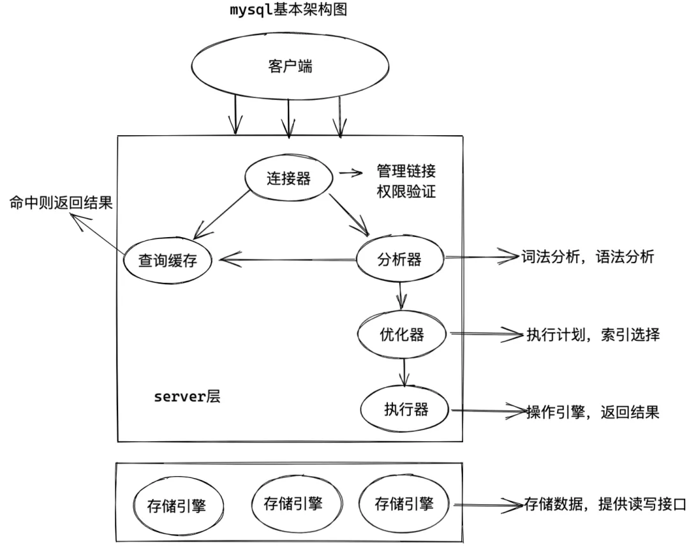
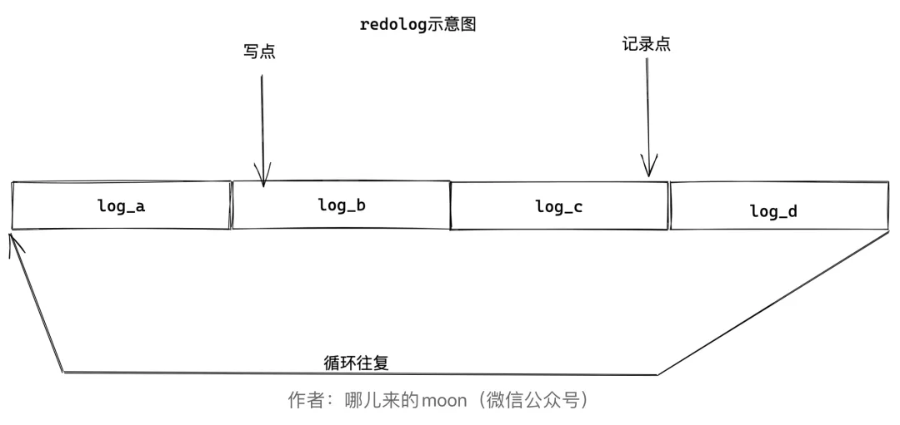

# mysql┃一条更新语句是怎么执行的？？？

一条查询语句执行过程当中要经过的模块，有连接器，查询缓存，分析器，优化器，执行器，存储引擎。

 

那么一条更新语句走完一整个流程又要经过哪些模块呢？

 

假设一张表里只有一个主键id和一个int字段c

我们从如下代码开始

 

· 

update T set c=c+1 where ID=2;

 

 

 

其实查询语句走的一套流程，基本上更新语句也会走一遍，但是更新语句还会涉及到另外两个重要的日志模块，redolog，binlog。

**redolog（重做日志）**

首先要告诉大家，redolog是innodb独有的，关于它具体做了什么，moon先和大家举个例子，不知道大家有没有了解过从前街边卖小吃老板的记账方式。

每来一个人，买一份煎饼，老板都会在自己的账单上记住+15元，假如今天第一份收入15元

 

+15 总金额 15

然后第二份

+15 总金额30

第三份

+15 总金额45

 

这样看确实没毛病，记得也很清楚，但是老板生意越来越好，而且做生意也越来越复杂，除了卖煎饼，还会卖其他的东西，价格也不同，物种琳琅满目，并且人也越来越多，老板就没办法实时去计算了，于是老板改了一种方式，分了两个账单。

 

第一个账单每天只记录一次总的信息（账本）

2020年5月5号 收入5000 支出 1000 净收入 4000

第二个账单记录每天的细节信息（账单）

2020年5月5日

+15

+16

+48

-23

...........

 

这样的话老板在忙的时候就不需要管计算的问题，只需要简单的记录下金额就好，省去了低效率的计算过程，留在生意不忙的空闲时间去做。

 

没错，redolog在mysql 的日志系统就是类似于这种账单模式，它是先写日志，再写磁盘，也就是先记账，等不忙的时候再去计算写账本。

具体来说，当有一条记录需要更新的时候，InnoDB引擎就会先把记录写到redo log里面，并更新内存，这个时候更新就算完成了（其实还没有写入磁盘）。同时，InnoDB引擎会在适当的时候（空闲时间），将这个操作记录更新到磁盘里面。如果今天账单的记录不多，掌柜可以等打烊后再整理。但如果某天账单的特别多，账本写满了，又怎么办呢？这个时候掌柜只好放下手中的活儿，把账单中的一部分赊账记录更新到账本中，然后把这些记录从账单上擦掉。与此类似，InnoDB的redo log是固定大小的，比如可以配置为一组4个文件，每个文件的大小是1GB，那么这个“账单”总共就可以记录4GB的操作。从头开始写，写到末尾就又回到开头循环写，如下面这个图所示。

 

 

记录点就是记录你要执行的语句是什么，写点就是执行记录点记录的语句，当记录点追上了写点就会发生"**内存抖动**"，从表面上看就是mysql宕机了一会儿，其实是innodb在执行redolog中记录的内容。

 

有了redo log，InnoDB就可以保证即使数据库发生异常重启，之前提交的记录都不会丢失，这个能力称为**crash-safe**。

 

**binlog（归档日志）**

 

我们刚刚说了redolog是innodb独有的，那么我们之前也讲了，mysql其实是分为两块的，一块儿是server层，另一块儿才是存储引擎层，那么server层的日志是什么？其实就是我们接下来要讲的binlog。

 

其实在最早是只有binlog的，因为在远古时代mysql的存储引擎只有myisam，redolog是在后期innodb出现的时候也跟着一起来的，这两个日志也是有很大区别的。

 

♠♥redo log是InnoDB引擎特有的；binlog是MySQL的Server层实现的，所有引擎都可以使用。

♠♥redo log是物理日志，记录的是“在某个数据页上做了什么修改”；binlog是逻辑日志，记录的是这个语句的原始逻辑，比如“给ID=2这一行的c字段加1 ”。

♠♥redo log是循环写的，空间固定会用完；binlog是可以追加写入的。“追加写”是指binlog文件写到一定大小后会切换到下一个，并不会覆盖以前的日志。

 

我们来看看这条更新语句的执行流程

 

· 

update T set c=c+1 where ID=2;

 

 

⑴.执行器先找引擎取ID=2这一行。ID是主键，引擎直接用树搜索找到这一行。

如果ID=2这一行所在的数据页本来就在内存中，就直接返回给执行器；

否则，需要先从磁盘读入内存，然后再返回。

⑵.执行器拿到引擎给的行数据，把这个值加上1，比如原来是N，现在就是N+1，得到新的一行数据，再调用引擎接口写入这行新数据。

⑶.引擎将这行新数据更新到内存中，同时将这个更新操作记录到redo log里面，此时redo log处于prepare状态。然后告知执行器执行完成了，随时可以提交事务。

⑷.执行器生成这个操作的binlog，并把binlog写入磁盘。

⑸.执行器调用引擎的提交事务接口，引擎把刚刚写入的redo log改成提交（commit）状态，更新完成。

 

 

**两阶段提交**

 

细心的已经发现上图是先写redolog，准备阶段，之后再写binlog，提交事务，commit阶段。

为什么会有两阶段提交呢？

我们先来看看，如果不适用两阶段提交会有什么问题呢？

 

**♠****♥****先写redo log后写binlog**。假设在redo log写完，binlog还没有写完的时候，MySQL进程异常重启。由于我们前面说过的，redo log写完之后，系统即使崩溃，仍然能够把数据恢复回来，所以恢复后这一行c的值是1。

但是由于binlog没写完就crash了，这时候binlog里面就没有记录这个语句。因此，之后备份日志的时候，存起来的binlog里面就没有这条语句。

然后你会发现，如果需要用这个binlog来恢复临时库的话，由于这个语句的binlog丢失，这个临时库就会少了这一次更新，恢复出来的这一行c的值就是0，与原库的值不同。

**♠****♥****先写binlog后写redo log**。如果在binlog写完之后crash，由于redo log还没写，崩溃恢复以后这个事务无效，所以这一行c的值是0。但是binlog里面已经记录了“把c从0改成1”这个日志。所以，在之后用binlog来恢复的时候就多了一个事务出来，恢复出来的这一行c的值就是1，与原库的值不同。

 

可以看到，如果不使用“两阶段提交”，那么数据库的状态就有可能和用它的日志恢复出来的库的状态不一致。

 

#  mysql┃送命题！！一条查询语句是怎么执行的？？？

首先我要告诉大家的是，在我们学习任何一件东西的时候，先要观其整个脉络，要先了解这个东西能做什么，它的整体流程是什么样的，这样能帮助你更好的理解。当你明白了整体的逻辑之后，再去扣他的细节，这样就会异常的轻松了。
我们看一行sql：

· 

select name from girlfriends where age = '18';

这行代码相信大家一眼就明了了，当然，你只是看到了这行代码，但是你了解它内部的逻辑吗？

所以，今天moon要和你们好好聊聊，拆解一下mysql，让你了解mysql中各个模块是怎样运作的，这样可以让你在今后遇到一些问题时，能够直击要害，更快速的解决问题。
我们先来看下mysql的基本架构示意图

 

通过这个示意图，你能够大致的了解mysql中具体有哪些模块，以及每个模块的功能都是什么。
总的来说，mysql分为两个大的模块，一块是服务层，一块是存储引擎层。

server层包括了连接器，查询缓存，分析器，优化器，执行器等，覆盖了sql绝大多数核心的功能，比如内置函数，存储过程，示图，触发器等等。

当然，大家从途中也可以看出，不同的存储引擎是共用一个server层的，接下来，我们就结合开头的sql语句，带大家走一遍过程。

# ***\*连接器\****

 

第一步，你会先连接到这个数据库上，这时候接待你的就是连接器。连接器负责跟客户端建立连接、获取权限、维持和管理连接。

 

· 

mysql -h$ip -P$port -u$user -p

 

连接命令中的mysql是客户端工具，用来跟服务端建立连接。在完成经典的TCP握手后，连接器就要开始认证你的身份，这个时候用的就是你输入的用户名和密码。

------

**●如果用户名或密码不对**

你就会收到一个"Access denied for user"的错误，然后客户端程序结束执行。

------

**●如果用户名密码认证通过**

连接器会到权限表里面查出你拥有的权限。之后，这个连接里面的权限判断逻辑，都将依赖于此时读到的权限。

------

 

连接完成后，如果你没有后续的动作，这个连接就处于空闲状态，客户端如果太长时间没动静，连接器就会自动将它断开。这个时间是由参数wait_timeout控制的，默认值是8小时。

 

如果之后客户端再次请求mysql，此时就会报错，那么我们只能重新再连接一次mysql了。

 

数据库里面：

**长连接**是指连接成功后，如果客户端持续有请求，则一直使用同一个连接。

**短连接**则是指每次执行完很少的几次查询就断开连接，下次查询再重新建立一个。

但是由于连接的建立是比较消耗资源的，所以在我们的使用过程中要尽可能的减少连接的次数。

# ***\*查询缓存\****

 

# ***\*在连接建立完成之后，就开始执行我们的select语句了。\****

# ***\*这个时候mysql就会去\*******\*查询缓存中查询\*******\*，看看我们刚才有没有执行过这条语句：\****

 

# **●如果有的话，就直接将缓存的结果返回给客户端。**

# **●如果没有，就会进入下一步。**

 

当进入后续步骤查询出来结果后，会再次将查询出来的结果放入查询缓存当中。

 

所以，使用查询缓存的效率是非常高的，但是使用查询缓存却有很大的弊端。

 

查询缓存的失效非常频繁，只要有对一个表的更新，这个表上所有的查询缓存都会被清空。

 

因此很可能你费劲地把结果存起来，还没使用呢，就被一个更新全**清空**了。对于更新压力大的数据库来说，查询缓存的命中率会非常低。除非你的业务就是有一张静态表，很长时间才会更新一次。

 

# ***\*分析器\****

 

如果没有命中缓存，接下来就会走到分析器这一步了。

mysql会根据自己定好的规则针对你的这条语法进行分析，比如select代表查询，where代表条件等等。

到了这一步：

 

**●如果你的sql出现了问题，那么mysql就会抛出一个错误：**

· 

You have an error in your SQL syntax; check the 。。。。。。。

**●如果没有问题，那么就会进入下一步**

 

# ***\*优化器\****

 

到了这一步的时候，mysql已经知道你要做什么了，但是在最终执行你的命令之前，mysql还要进行一遍优化，比如索引的选择。

 

· 

· 

· 

· 

· 

select name from girlfriends g left join boyfirends b on g.id = b.idwhere a.age = '18' and b.age = '19';

 

在上述语句中mysql就会去判断，是先从a.age这个索引进入还是b.age这个索引进入，哪种效率高呢？这就是优化器的工作。 

在优化完成之后，mysql已经确定好了最终的执行方式。

# ***\*优化器\****

 

于是就到了我们的执行器阶段，到底应该怎么执行。

首先，会调取用户的权限：

 

------

**●如果没有权限，则会反回错误**

------

**●如果用户拥有权限，则会打开表继续执行**

------

 

· 

select name from girlfriends where age = '18';

比如我们文章开头这条语句，假如age没有索引，执行流程如下：
①调用InnoDB引擎接口取这个表的第一行，判断age值是不是18，如果不是则跳过，如果是则将这行存在结果集中。②调用引擎接口取“下一行”，重复相同的判断逻辑，直到取到这个表的最后一行。③执行器将上述遍历过程中所有满足条件的行组成的记录集作为结果集返回给客户端。

 

对于有索引的表，整体流程也差不多，至此，就完成了一条sql语句的查询。

 