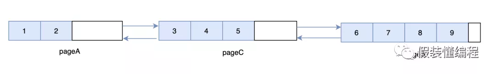

# Mysql删除

#### ***\*删除并不是真正的删除\****

熟悉mysql InnoDB存储引擎的同学都应该知道，当我们执行delete的时候，数据并没有被真正的删除，只是对应数据的删除标识deleteMark被打开了，这样每次执行查询的时候，如果发现数据存在但是deleteMark是开启的话，那么依然返回空，因为这个细节，所以经常会出现“我明明删除了数据，为什么空间没释放”的现象。

15M 7 6 18:46 user_info.ibd #删除前
15M 10 4 16:47 user_info.ibd #删除后

#### ***\*为什么不直接删除，而是打个标记\****

我们知道InnoDB存储引擎是支持MVCC的，即多版本控制，得益于MVCC，mysql在事务里查询数据的时候不需要加锁，可以提供很好的并发性，同时提供可重复读这个很重要的特性。那么它是怎么到的呢？答案是undo log，可以简单的理解为，每次更新数据的时候将更新前的数据先写入undo log中，这样当需要回滚的时候，只需要顺着undo log找到历史数据即可。undo log与原始数据之间是用指针链接起来的，即每条数据都有个回滚指针指向undo log。

如果InnoDB在删除数据的时候，真的是把数据从磁盘上擦除，那么这时候：

\1. 别的事务通过undo log是无法找到原始数据

\2. 可重复读这个特性会被破坏

#### ***\*只是打个标记的话，岂不是很浪费空间\****

mysql里面有个purge线程，它的工作中有一项任务就是专门检查这些有deleteMark的数据，当有deleteMark的数据如果没有被其他事务引用时，那么会被标记成可复用，因为叶子节点数据是有序的原因，这样当下次有同样位置的数据插入时，可以直接复用这块磁盘空间。当整个页都可以复用的时候，也不会把它还回去，会把可复用的页留下来，当下次需要新页时可以直接使用，从而减少频繁的页申请。

 

#### ***\*基于页的存储方式\****

我们知道mysql数据是存储在磁盘上的，磁盘的速度想必大家都知道，特别是当发生随机IO的时候。这里简单解释下什么叫IO，以机械磁盘为例，我们最终的数据都是落在磁盘的一个一个扇区上的，当一个扇区写满了，就得换下一个扇区，这时就要通过盘片的转动找到目标扇区，这是物理运动。如果要写入的下一个扇区和当前的扇区是紧挨着的，这叫顺序IO，如果要写入的扇区和当前的扇区中间隔了几个扇区，这叫随机IO，很明显随机IO需要更长的转动时间。所以查询一个数据的时候，减少IO是非常关键的，特别是随机IO。

为了减少磁盘IO，mysql采用B+树的索引结构来组织数据，B+树的特点是矮胖，一般树的高度就代表了IO的次数，越矮的话，树的高度越低，那么对应的IO次数就越少，还有一点需要知道的是数据最终都在叶子节点上，所以在B+树上搜索的时候，一定是要检索到最后一层叶子节点上，这是一种稳定性的表现。

 

***\*行与页\****：这里需要知道的是，我们最终通过B+树检索到的**「不是我们的目标行数据，而是目标行数据所在的页」**，这个页上有很多数据，都是索引序号相邻的，当找到目标页后，会把目标页加载到内存中，然后通过二分法找到目标数据，也许你会问，那搜索的开销不仅仅是磁盘IO，还有在二分法查找的开销。这里不可否认，但是我们一般忽略这部分开销，因为cpu在内存里检索的速度很快，并且一页也就16k，数据并不多。

***\*IO次数不一定等于树的高度\****：前面我们说到树的高度等于IO的次数，这其实不是很准确，我们知道树的根节点一定是在内存里的，那么对于一颗高度为3的数据，只用2次IO即可，这其实可以理解，毕竟根节点只占用一页的空间，一页才16K，放在内存里绰绰有余。但有时候树的第二层也可以放在内存里，假设现在主键是bigint，bigint我们知道占用8个字节，对于一个索引来说除了类型本身占用空间之外，还有一个指针，这个指针占用6个字节，那么对于根节点来说它大概能存 16K/(8+6)B = 1170 个数据，每个数据都可以指向一页（也就是它的下一层），这样整个树的第二层大概占用 1170*16K = 18M 的空间，这也不是一个很大的数字，对于机器的内存来说，几乎也是沧海一粟，所以第二层往往也在内存里，所以最终在B+树上检索数据所消耗的IO应该比理论的要低。

通过上面我们知道检索一条数据的快慢，主要受树的高度影响的，这和你的数据表的大小并没有太大的关系，现实中有人可能在数据表达到百万级别的时就考虑分表，个人认为这有点低估B+树的能力了。还是以bigint类型的主键索引为例，假设一行数据占用1K（理论上已经足够大了），那么一页可以存下 ***\*16K/1K=16\**** 条数据，对于一颗高度为3的B+树来说，它可以存下 ***\*1170\*1170\*16=21902400\**** 的数据，将近2千万，如果你的数据行占用的空间更小，就可以存下更多的数据，所以只是简单的根据数据行数来判断是否需要分表不是那么的合理。

#### ***\*可复用的空间一直没有被利用咋办\****

前面我们说到删除的数据不会被真的删除，只是打上个deleteMark的标识，然后会被复用，但是如果一直没被复用，那么空间不就是白白的浪费了，更糟糕的是，如果删除的很多数据空间都没有被复用，就会造成页空间存在大量的碎片，为了解决这种情况，mysql内部有个叫页合并的功能，这是什么意思呢？简单理解就是页A现在有很多可以被复用的空间，它的邻居页B也有很多可以复用的空间，此时页A就可以和页B合并，如果合并后能省出来一页，那么多出来的一页就可以被下次使用，从而达到页最大利用的效果。

 

合并的关键需要当前页的前一页或者后一页也有大量的碎片空间，这里为何要**「大量」**很关键，合并的动作可以简单理解就是把别的页的数据移动过来，如果两个页pageA和pageB都只有少量的可复用空间，那么合并后，即使pageA可以填满，但是另一个页Page也还是有碎片空间的，并且碎片更大，这时候数据移动的开销可能要大于存储的开销，得不偿失。

而且还会有个严重的问题，pageB可能会和pageC合并，那么pageC的碎片更大...，这样的话似乎是个无底洞，导致很多页都在移动数据。因此一个合理的合并条件很关键，InnoDB中何时合并受MERGE_THRESHOLD这个参数影响，它的默认值是50%，50%的意图很明显，两个50%就可以省出一个页。我们看个例子，pageA已经有50%的数据被删除了，它的邻居pageB只使用了不到50%的数据，这时候会将pageB的数据移动到pageA上，那么整个pageB就是空页了，可以提供给别的数据使用。这里需要知道的是除了删除会触发页合并外，更新可能也会触发页合并。

#### ***\*有合并也有分裂\****

合并页是提升页的利用率的方式，但是有时候我们又不得不分裂页，我们知道叶子节点的页之间是用双向链表串接起来的，并且页与页之间的数据是有序的。

以上图为例，当我们要插入5这条数据，按道理应该尝试放在pageA里面，但是pageA目前没有足够的空间来存放一条数据，于是尝试找到pageA的相邻页pageB，但是此时很不幸的是pageB也没有足够的空间来存放一条数据，由于要求数据的连续性，数据5必须在数据4和数据6之间，那么只能新建一个页，新建一个页后，会尝试从pageA中移动一部分数据到新的页上，并且会重新组织页与页之间的关系，即在pageA和pageB之间会隔一道新页pageC。

页分裂会造成页的利用率降低，造成页分裂的原因有很多，比如：

\1. 比如离散的插入，导致数据不连续。

\2. 把记录更新成一个更大记录，导致空间不够用

还有一点需要知道的是：不管是页的合并还是页的分裂，都是相对耗时的操作，除了移动数据的开销外，InnoDB也会在索引树上加锁。

#### ***\*手动重建表\****

页的合并和分裂主要是在插入、删除或更新的时候，并且正好满足某些条件才发生的，那如果这些条件一直不满足，碎片就无法得到清理，这时候往往会出现"**「我的表明明没多少数据，为什么还占用这么大空间」**"这个现象，针对这个现象有人说重建索引，这个是对的，重建索引可以让数据更加紧凑，页的利用率达到更高。但是如何重建索引？第一时间你可能会想到先drop index然后add index，这个似乎不是那么准确。
***\*如果要重建的索引是普通索引\****，使用这种方式还好，需要注意的是假如你的业务TPS很大，建议在业务低峰期执行，因为虽然mysql支持online ddl，但是重建索引的过程还是很耗cpu和io资源的。
***\*如果你要重建的是主键索引\****，那么问题来了，首先如果你的主键索引设置的是自增长，是不支持drop的。其次如果你的主键没设置成自增长，直接drop也不是我们想象的那样，我们知道普通索引除了记录本身的索引字段外，还会记录主键的值，如果drop是直接删除索引，那么通过普通引将找不到对应的行记录，所以InnoDB是要求必须有主键索引的，这时InnoDB会尝试去表中找个唯一索引来当主键，如果没有唯一索引，那就自动创建一个默认的主键索引rowid，当新的主键索引建立好之后，还要去修改相关的普通索引让其存储新的主键，但是如果按照这种方法来修改的话，开销会很大，特别是普通索引很多的情况下，于是InnoDB干脆选择重建表。对于紧接着执行的add index操作，同样也会发生主键索引的变更，所以也会选择重建表，最终可以发现在主键索引上的drop和add其实干了一样的事情。

综上所述，一般在你的表出现很多页碎片的时候，建议使用：

alter table xx engine=InnoDB

这个命令可以重建我们这个表，但是前提是我们的表是独占表空间的。基于mysql的online ddl，这个过程它是不影响正常的读写的，它的过程如下：

\1. 扫描原表主键索引的所有记录

\2. 生成新的b+树记录到临时文件

\3. 生成临时文件的过程中，新的变更记录到一个中转日志row log中

\4. 在临时文件生成后，将期间row log的变更应用到新的临时文件中

\5. 然后替换临时文件为当前文件

这里需要注意的是重建表的过程涉及到数据的copy，得保证磁盘有足够的空间，至少是现在磁盘空间的1倍，如果磁盘空间不足，那么是不会重建成功的。

#### ***\*重建表不一定会收缩空间\****

在重建表的过程中，有一点需要知道：InnoDB不会让重建后的页充满数据，会预留个**「1/16」**的空间，这个意图很明显，如果不预留，选择占满整个页，这时候去更新一条需要更大空间的老数据，就会需要新的页，写入新的页后，往往又会造成碎片，所以提前预留一点空间是有用的。

但是因为这个预留操作，某些情况下会导致重建后的表空间反而会变大。

\1. 如果你的表本身就很紧凑，因为预留1/16会变大。

\2. 在第一次重建表后，因为新的插入导致用掉了预留空间的一部分（这里需要注意的是预留空间没用完，还剩一部分），但是没有用到新的页，所以整体的空间没有变化，这时候如果再次重建表，就会因为要预留1/16，导致申请的新的页，那么空间就会变大。

 