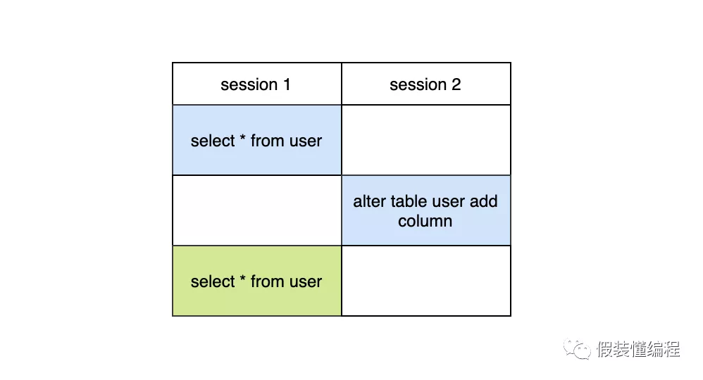
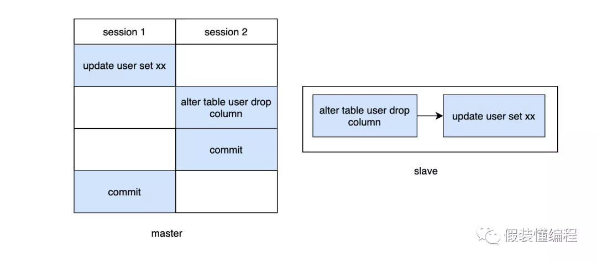
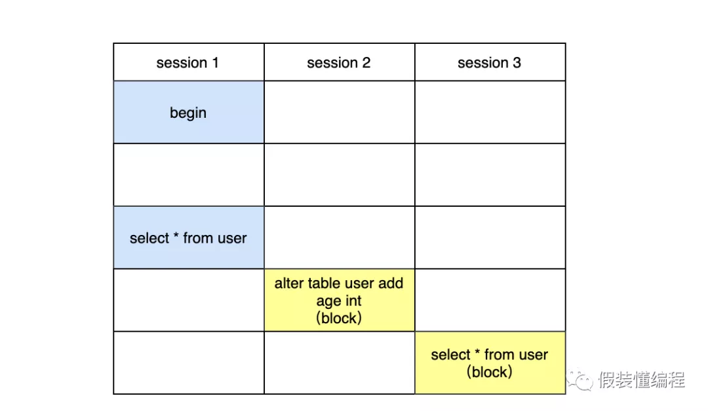
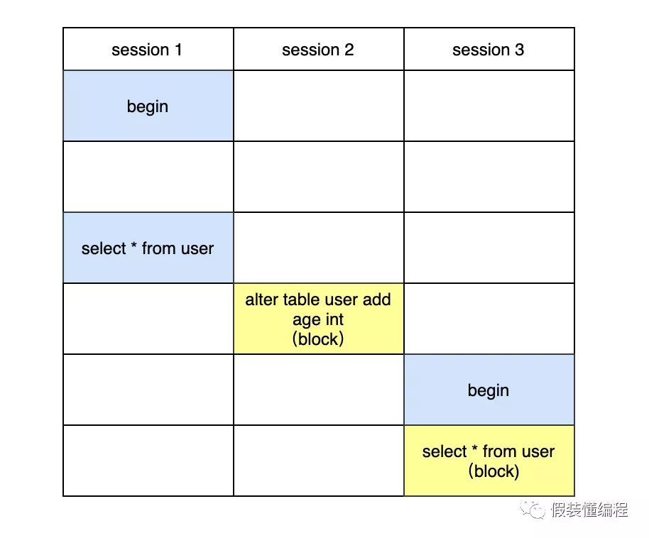
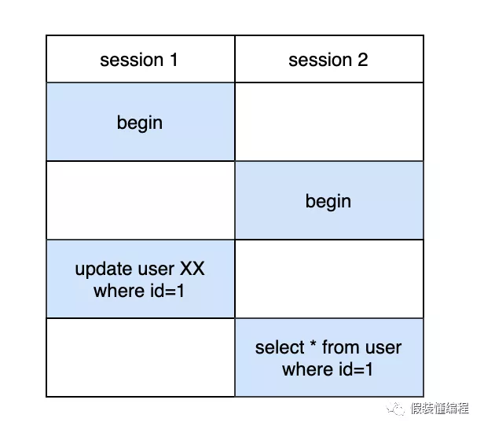
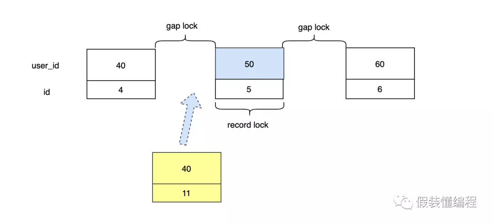
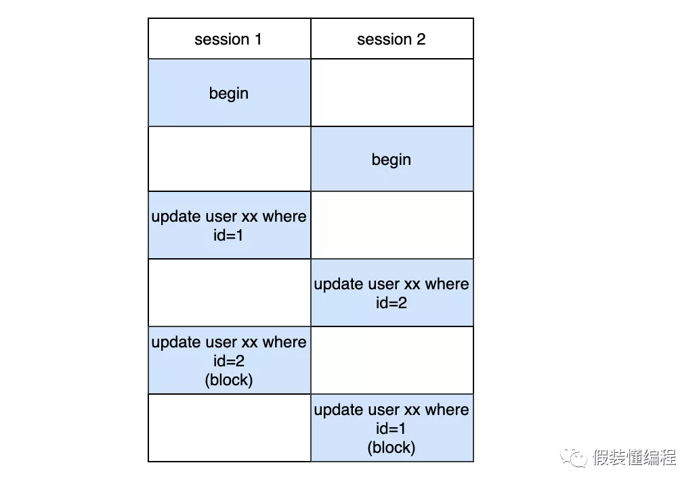
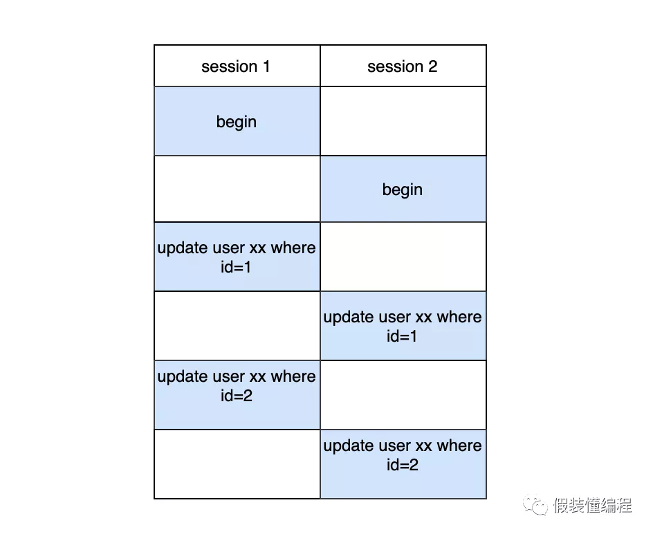

# Mysql锁

面试官：mysql支持哪些级别的锁？
我：支持库锁、表锁、行锁。

面试官：那先说说库锁吧，锁库有几种方式？

我：两种，分别是FTWRL（Flush tables with read lock）和 set global readonly=true

面试官：这两种有什么区别？

我：首先不管是谁，只要锁库了，那么整个库都处于只读状态，所有的更新操作都将被阻塞，FTWRL模式风险稍微小点，如果客户端异常断开后，FTWRL锁会自动释放，但是global readonly=true不会自动释放锁。

面试官：那myisam和innodb的锁有什么区别。

我：myisam不支持行锁，只支持表级的锁，innodb支持更细粒度的行锁。
面试官：表级锁使用过吗?

我：没有用过，表锁性能差。

面试官：那你知道MDL锁吗？

我：了解，MDL（metadata lock）锁是server层的锁，表级锁，它是隐式的，不需要显式的使用，mysql每次读写数据时（insert、update、select、delete）都要先去获取MDL读锁，只有获取到了MDL读锁，才能进行接下来的操作，否则阻塞，其中MDL读锁之间是共享的，当对数据库进行表结构变更的时候，会获取MDL写锁，MDL写锁和任何MDL锁都是互斥的，不管是MDL读锁还是MDL写锁。

面试官：那MDL锁的作用是什么？

我：MDL锁是为了解决DDL和DML之间冲突的问题。

\1. 假设事务A先查询得到一个数据，然后事务B执行了字段修改，那么事务A再次去查的时候，发现数据对不上了。

 

\1. 事务A先更新数据未提交，事务B修改字段提交，slave就会先修改字段，再更新数据，那么就会有问题

 

当使用了MDL锁后，DDL操作必须要先获得MDL写锁，我们知道写锁和写锁，写锁和读锁是冲突的，那么在DDL之前如果有任何查询或者更新，都必须要阻塞等待，不会让DDL执行的，从而解决了冲突问题。

面试官：那有了MDL锁，在线DDL是不是就很安全？

我：不一定。

 

假设session1先执行查询，但是不提交。session2紧接着执行添加字段的DDL，最后session3再执行查询。此时会发现session2和session3都是阻塞的，如果后面还来了sessionN的查询，那么都将阻塞，严重时将造成大量线程阻塞。

面试官：那你能解释下为什么这种情况下会阻塞吗？

我：首先MDL锁一定是在事务提交后才释放的，session1在执行查询后，并没有commit，那么MDL读锁是没有释放的，session2紧接着执行DDL，执行DDL是要获取MDL写锁的，由于写锁和读锁是互斥的，那么session2是卡住的，它在等待session1释放读锁，session3在session2之后执行的，此时session3是需要一个读锁的，但是由于获取锁是有先后顺序的，它们要排队，并且写锁的优先级要高于读锁，这也是为什么session3会卡住。

面试官：所以是session1执行commit之后，然后session2先执行完，最后session3先执行完？我刚试了下你的例子，看着好像session2和session3几乎同时运行完，你能否具体说说为什么呢？（看你进不进坑）

 

我：（想给我挖坑，没门），不是的，并不是session2先执行完，其实是session3先执行完，但是session2会先获得MDL写锁，由于session3没有显式的开启一个事务，那么session3默认执行完毕之后自动commit，所以在session1 commit之后，看起来像session2和session3几乎同时进行的。如果让session3显式的开启事务，就能发现运行的细节了。

 

这样当session1 commit之后可以发现session3先执行，session2依然是卡住的，只有当session3 commit之后，发现session2才能运行。所以真实情况应该是session3先执行，然后session2。

面试官：那这和你上面说的获取MDL锁排队的问题是不是矛盾了？

我：不矛盾，这其实涉及到online DDL的知识了，我们知道mysql支持在线DDL，不阻塞用户操作，当执行一个DDL，它的流程大概是这样的：

\1. 拿MDL写锁

\2. 降级成MDL读锁

\3. 真正做DDL

\4. 升级成MDL写锁

\5. 释放MDL锁

其中session2在拿到MDL写锁后，会降级成MDL读锁，降级后，session3拿到MDL读锁，然后执行select，但是没有commit，这样MDL读锁就没释放，然后session2在升级成MDL写锁的时候因为session3没释放读锁从而导致session2阻塞。

面试官：（这小子不错呀），那你知道为什么DDL过程中1-2要降级，而3-4又要升级吗？

我：（早知道就要问，还好我有准备），

 

首先在MDL写锁期间，干的事就是创建临时的frm和idb文件，这个过程要安全，是排他的，同时这个过程也是快速的，在临时文件创建好之后，就不需要排他了，那么就降级为读锁，支持正常的增删改查，这也是为什么DDL支持online的原因之一。在新的数据文件写好之后，要替换老的数据文件，这个过程要安全，所以在3执行完后，会尝试升级成MDL写锁，这个过程也是快速的，也是支持online DDL的原因之二。

面试官：我们知道InnoDB支持行级锁，行锁还分两类你知道吗？

我：知道，S（共享锁）和X（排他锁），S锁和S锁是共享的，X锁和任意锁互斥。

面试官：既然X锁和任意锁互斥，那么如果存在两个事务，事务A更新数据后，不提交，那么事务B去查询这条数据是不是就阻塞？

 

我：不会的，因为InnoDB支持MVCC（多版本控制），当一个事务执行查询的时候，它可以通过undo log查询到一个快照，这样就不用锁。

面试官：那你知道IS（意向共享锁）和IX（意向排他锁）吗？

我：首先它俩都是表级别的锁，因为InnoDB是支持行锁的，当某些行已经上了X锁之后，再想对这个表上锁的话，就得确认当前表中没有任何X锁，在没有意向锁的情况下，就得一行一行去判断，这样效率会非常低下，在有了意向锁之后，就不需要一行一行判断了，举个例子：

***\*select\**** * ***\*from\**** ***\*user\**** ***\*where\**** ***\*id\****=1 ***\*for\**** ***\*update\****;

当一个事务对id=1这行数据上了X锁之后，就会对user表也加一个IX锁。

***\*LOCK\**** ***\*TABLES\**** ***\*user\**** ***\*READ\****;

这时想要给表加上读锁，但是发现表上有IX锁，所以会阻塞无法执行。类似的如果一个事务对一行数据加上共享锁

***\*select\**** * ***\*from\**** ***\*user\**** ***\*where\**** ***\*id\****=1 ***\*lock\**** ***\*in\**** ***\*share\**** ***\*mode\****;

就会给对应的表加上IS锁。这时候如果执行

***\*LOCK\**** ***\*TABLES\**** ***\*user\**** WRITE;

也会因为表上有IS锁而阻塞。

面试官：那我们来聊聊行锁吧，InnoDB支持哪些行锁？

我：有记录锁（Record Lock）、间隙锁（Gap Lock）、Next-Key Lock

面试官：假设有一张表，表里有10条记录，还有个字段user_id，并且user_id是普通索引。

+----+---------+
| id | user_id |
+----+---------+
| 1 |   10 |
| 2 |   20 |
| 3 |   30 |
| 4 |   40 |
| 5 |   50 |
| 6 |   60 |
| 7 |   70 |
| 8 |   80 |
| 9 |   90 |
| 10 |   100 |
+----+---------+

如果事务A执行：

***\*SELECT\**** * ***\*FROM\**** ***\*user\**** ***\*WHERE\**** user_id=50 ***\*FOR\**** ***\*UPDATE\****;

紧接着事务B执行下面的sql会发生什么？：

***\*INSERT\**** ***\*INTO\**** ***\*user\**** ***\*set\**** user_id=45;

我：阻塞。

面试官：能说下原因吗？

我：因为InnoDB的Next-Key Lock算法，不仅仅会锁住user_id=50这条记录，还会锁住50左右的间隙。Next-Key Lock锁定的范围是左开右闭的，那么理论上最终(40,50],(50,60]的区间数据会被锁定。由于要插入的45在40-50之间，所以就会发生阻塞。

面试官：那按照你说的区间锁法，是包含60这条数据的是吧，所以如果插入一条60的数据，就会发生阻塞？

***\*INSERT\**** ***\*INTO\**** ***\*user\**** ***\*set\**** user_id=60;

我：其实不会，这里涉及到next key lock的优化，在等值查询中，向右遍历时且最后一个值不满足等值条件的时候，Next-Key Lock会退化为Gap Lock，所以对于(50,60]这个区间最终会降级为(50,60)，那么60这条数据就不会被锁住，是可以插入成功的。

面试官：那40这条数据是不在这个锁区间的，所以可以插入40这条数据？

***\*INSERT\**** ***\*INTO\**** ***\*user\**** ***\*set\**** user_id=40;

我：其实也不会，40这条数据的插入也会阻塞，首先对于非聚集索引user_id它的叶子节点一定是排序的，大概就像(40,4)，（50,5）这样，其次因为主键id是自增的，那么对于再插入一条40的数据，它的主键id一定是大于4的，就目前10条数据来说，下一次插入的id肯定是11，那(40,11)这条数据肯定是要在(40,4)后面的，这样的话，就落入到了间隙锁中，所以会阻塞，其实上面60那条数据可以插入也是同样的道理。

 

面试官：那如果我一开始不用select for update了，而用select lock in share mode，那么所有的插入会有什么变化吗？

我：没有变化，还是一样，因为插入需要X锁，X锁和任何锁都互斥。

面试官：如果user_id不是普通索引而是唯一索引，那会有什么变化？

我：当索引是唯一索引时，那么就会发生降级，Next Key Lock会降级成Record Lock，最终只会锁住50这条记录。

面试官：如果user_id没有索引怎么办？

我：那就所有的记录都会锁上，任何的插入都会阻塞。

面试官：那你知道为什么要有间隙锁这个东西吗？

我：为了解决幻读。比如当事务A执行以下查询时：

***\*SELECT\**** * ***\*FROM\**** ***\*user\**** ***\*WHERE\**** ***\*id\****>=9 ***\*for\**** ***\*update\****

应该返回两条记录（id=9和id=10），这时候如果另一个事务B执行

***\*INSERT\**** ***\*INTO\**** ***\*user\**** ***\*set\**** user_id=110;

在没有间隙锁的情况下，那么事务A再次查询会发现多了一条记录，就出现了幻读，如果有了间隙锁，那么[9，+∞)这个区间都会被锁住，事务B的插入就会阻塞。但是只有在事务的隔离级别设置成可重复读的时候，才支持间隙锁。

面试官：如果某个上了锁的事务一直不提交，那么后面需要获取相关锁的事务就会阻塞，这样会有什么问题？

我：如果阻塞的事务越来越多，那么阻塞的线程也会越来越多，严重时会造成连接池满了，mysql不能提供服务了。但是InnoDB支持阻塞超时后，会自动放弃这个等待锁的sql命令，这个值默认是50s。

+--------------------------+-------+
| Variable_name      | Value |
+--------------------------+-------+
| innodb_lock_wait_timeout | 50  |
+--------------------------+-------+

面试官看了看我：那你知道AUTO-INC Locking吗？

我：知道，自增长锁，在InnoDB引擎中，每个表都会维护一个表级别的自增长计数器，当对表进行插入的时候，会通过以下的命令来获取当前的自增长的值。

***\*SELECT\**** ***\*MAX\****(auto_inc_col) ***\*FROM\**** ***\*user\**** ***\*FOR\**** ***\*UPDATE\****;

插入操作会在这个基础上加1得到即将要插入的自增长id。

面试官：我们知道事务中的锁是在事务提交后才释放的，那么在更新自增长id后，当事务没来及提交，其它的事务获取自增长id就要等待吗？这样的话效率是不是有点低？

我：不用等待的，为了提高插入性能，自增长的锁不会等到事务提交之后才释放，而是在相关插入sql语句完成后立刻就释放的，这也是为什么一些事务回滚之后，发现id不连续的原因：

select * from user;
+----+---------+
| id | user_id |
+----+---------+
| .. |   .. |
| 9 |   90 |
| 10 |   100 |
| 12 |   120 |
+----+---------+
\# 11那条数据回滚了，但是id也被消耗了，id不会回滚。

面试官：虽然AUTO-INC Locking可以不用等事务提交就释放，但是在并发的时候，因为AUTO-INC Locking本身会对自增id上锁的，还是会影响效率，这个该怎么解决？

我：现在InnoDB支持互斥量的方式来实现自增长，通过互斥量可以对内存中的计数器进行累加操作，比AUTO-INC Locking要快些。

面试官：那你知道死锁吗？

我：知道。

面试官：什么情况下会出现死锁？

我：死锁出现的条件就是请求和保持，就是每一方都保持着对方的需要的资源同时请求对方占用的资源。比如：

 

事务1先锁id=1这条数据，紧接着事务2锁住id=2这条数据，然后事务1再次尝试锁住id=2这条数据，但是发现被事务2占着在，所以此时事务1会阻塞，最后事务2尝试获取id=1的锁，但是发现被事务1占着在，所以也会阻塞，那么此时就陷入僵局了，这就是死锁。

面试官：那如何解决死锁问题呢？

我：

\1. InnoDB提供锁超时的功能，当一个事务获取锁超时之后会自动放弃，另一个事务就可以执行。

+--------------------------+-------+
| Variable_name      | Value |
+--------------------------+-------+
| innodb_lock_wait_timeout | 50  |
+--------------------------+-------+

\1. 可以让每次更新都按照约定的顺序去更新，这样也可以避免死锁。

 

\1. 通过死锁检测来提前判断，InnoDB默认是开启死锁检测的。

+------------------------+-------+
| Variable_name     | Value |
+------------------------+-------+
| innodb_deadlock_detect | ON  |
+------------------------+-------+

InnoDB通过等待图的方式来进行死锁检测的，这要求存储锁的信息链表和事务的等待链表，然后通过链表构造一张等待图，每次获取锁的时候会通过等待图来判断是否会造成死锁。

 