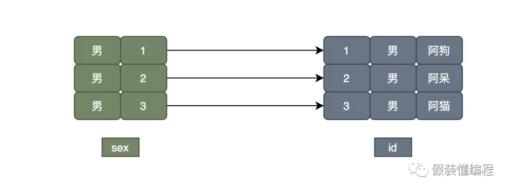

# mysql随手记-常见知识点总结

## ***\*使用覆盖索引减少IO\****

mysql的索引类型主要分为聚集索引和非聚集索引，通过聚集索引可以获取到整行数据，而通过非聚集索引只能获得主键id和当前字段。当我们要查询的字段就是非聚集索引叶子含有的字段（***\*primary key\**** + ***\*field\****），那么就不需要回表查询更多的字段，这就是覆盖索引。

\# name是索引字段
\1. ***\*SELECT\**** ***\*id\****,***\*name\**** ***\*from\**** ***\*user\**** ***\*WHERE\**** ***\*name\****='假装懂编程'#不需要回表
\2. ***\*SELECT\**** ***\*id\****,***\*name\****,age ***\*from\**** ***\*user\**** ***\*WHERE\**** ***\*name\****='假装懂编程' #需要回表

**「1」**：因为name索引包含id和name数据，所以通过name索引就能得到所需数据。
**「2」**：因为name索引不包含age数据，所以仅通过name索引是得不到age数据的，此时还会去主键索引里获取数据（**「回表」**）。

## ***\*不要用select \*\****

自己用什么字段就查询什么字段，不要使用***\*select \*\****，当我们用了***\*select \*\****：

o 肯定用不了覆盖索引。

o 多余的字段会造成mysql解析负担。

o 多余的字段会造成更多的网络开销。

## ***\*复杂的sql要explain\****

当我们写下一条复杂的sql时，如果我们通过肉眼已经无法辨别mysql会使用什么索引或者mysql会不会使用到索引，这时候通过explain来查看我们的sql执行计划是个不错的选择。

mysql> ***\*explain\**** ***\*select\**** ***\*id\****,***\*name\**** ***\*from\**** user3 ***\*where\**** ***\*name\****="假装懂编程";
+----+-------------+-------+------------+------+---------------+------+---------+-------+------+----------+-------------+
| id | select_type | table | partitions | type | possible_keys | key | key_len | ref  | rows | filtered | Extra    |
+----+-------------+-------+------------+------+---------------+------+---------+-------+------+----------+-------------+
| 1 | SIMPLE   | user3 | NULL    | ref | name     | name | 403   | const |  1 |  100.00 | Using index |
+----+-------------+-------+------------+------+---------------+------+---------+-------+------+----------+-------------+
1 row in ***\*set\****, 1 ***\*warning\**** (0.00 sec)

ref是个比较重要的指标（以下按顺序越靠后说明效率越低）：

system->const->eq_ref->ref->fulltext->ref_or_null->index_merge->unique_subquery->index_subquery->range->index->all。 

特别当我们explain出***\*ref=all\****的时候要注意，这时你的sql是要进行全表扫描的。

## ***\*varchar和char的区别\****

### ***\*char\****

固定长度（字符数），如果长度小于定义的长度会用空格补充，会浪费空间。但是因为长度固定所以char的存取速度要比varchar快，char最多能存放255个字符，和编码无关。

### ***\*varchar\****

变长（字符数），如果长度小于定义的长度会按照实际的长度来存储，相比char会节约空间，但是因为是变长的，所以存取速度相比char要慢。在存储方面，若列的长度小于等于255字节，那么额外要1个字节记录长度，如果列的长度大于255字节，那么额外要2个字节记录长度。

## ***\*分页时小心limit陷阱\****

### ***\*未用到索引的limit\****

我们在分页的业务中经常用到limit，比如后台查看用户的留言，由于留言太多，我们不得不分页。假设我们每页展示100条数据，那么每页的查询可能这样。

***\*select\**** * ***\*from\**** message ***\*limit\**** 0,100 # 第一页
***\*select\**** * ***\*from\**** message ***\*limit\**** 100,100 #第二页
...
***\*select\**** * ***\*from\**** message ***\*limit\**** 1000000,100 #第10000页

当我们查到第10000页时，此时要过滤1000000的数据，然后再取100条数据，这个耗时肯定是巨大的。这个问题的本质还是没用到索引，那么我们让分页用到索引就好了，我们可以这样解决：
因为主键id是自增且连续的，这样我们每次通过id来定位到我们的第一条数据，然后向后取100条。这个id就是你上一次获取的分页数据中，最大的那个id。

***\*select\**** * ***\*from\**** message ***\*where\**** ***\*id\****>=[***\*id\****] ***\*limit\**** 100

此场景适用主键是自增连续的，且不能有where条件的，有where条件的话会过滤数据。

### ***\*需要回表的limit\****

现在有这样一张表，除了主键索引外还有个***\*user_id\****的普通索引

***\*CREATE\**** ***\*TABLE\**** `message` (
 `id` int(11) ***\*unsigned\**** ***\*NOT\**** ***\*NULL\**** AUTO_INCREMENT,
 `user_id` int(11) ***\*unsigned\**** ***\*NOT\**** ***\*NULL\**** ***\*DEFAULT\**** '0',
 `name` varchar(255) ***\*NOT\**** ***\*NULL\**** ***\*DEFAULT\**** '',
 PRIMARY ***\*KEY\**** (`id`),
 ***\*KEY\**** `user_id` (`user_id`)
) ***\*ENGINE\****=***\*InnoDB\****;

表的数据量有将近150w：

mysql> ***\*select\**** ***\*count\****(*) ***\*from\**** message;
+----------+
| count(*) |
+----------+
| 1496067 |
+----------+

这时候我要统计***\*user_id=99999\****的用户数据，并且在所有的数据中只取第70w开始的后面5条，于是我这样执行了：

mysql> ***\*select\**** * ***\*from\**** message ***\*where\**** user_id=99999 ***\*limit\**** 700000,5;
+---------+---------+---------+
| id   | user_id | name  |
+---------+---------+---------+
| 1282606 |  99999 | t154458 |
| 1282607 |  99999 | t154459 |
| 1282608 |  99999 | t154460 |
| 1282609 |  99999 | t154461 |
| 1282610 |  99999 | t154462 |
+---------+---------+---------+
5 rows in ***\*set\**** (1.17 sec)

发现竟然需要**「1.17s」**的时间，user_id不是有索引吗，而且我只获取5条数据，我通过explain也看到用了***\*user_id\****索引。

mysql> ***\*explain\**** ***\*select\**** * ***\*from\**** message ***\*where\**** user_id=99999 ***\*limit\**** 700000,5;
+----+-------------+---------+------------+------+---------------+---------+---------+-------+--------+----------+-------+
| id | select_type | table  | partitions | type | possible_keys | key   | key_len | ref  | rows  | filtered | Extra |
+----+-------------+---------+------------+------+---------------+---------+---------+-------+--------+----------+-------+
| 1 | SIMPLE   | message | NULL    | ref | user_id    | user_id | 4    | const | 745650 |  100.00 | NULL |
+----+-------------+---------+------------+------+---------------+---------+---------+-------+--------+----------+-------+

经过分析发现了一些端倪，于是我又这样执行了一下：

mysql> ***\*select\**** a.* ***\*from\**** message a ***\*join\**** (***\*select\**** ***\*id\**** ***\*from\**** message ***\*where\**** user_id=99999 ***\*limit\**** 700000,5) b ***\*on\**** a.id=b.id;
+---------+---------+---------+
| id   | user_id | name  |
+---------+---------+---------+
| 1282606 |  99999 | t154458 |
| 1282607 |  99999 | t154459 |
| 1282608 |  99999 | t154460 |
| 1282609 |  99999 | t154461 |
| 1282610 |  99999 | t154462 |
+---------+---------+---------+
5 rows in ***\*set\**** (0.14 sec)

发现只需要**「0.14s」**，比第一种节约了将近**「1s」**的时间。

#### ***\*结论：\****

首先因为你查询的是*，这意味着你要获取所有字段，那么就算你用的是user_id索引，最终也要回表去查。所以对一条数据来说，总的消耗就是**「user_id索引的查询时间+主键id索引的查询时间」**，其次因为你用了***\*limit 70000,5\****，因为user_id=99999的数据非常多，通过limit的话，就要过滤70w的数据，所以(**「user_id索引的查询时间+主键id索引的查询时间」**)乘以**「70w」**这整个消耗就是浪费的。对于第二条sql来说，它先是用子查询来获取主键id：

***\*select\**** ***\*id\**** ***\*from\**** message ***\*where\**** user_id=99999 ***\*limit\**** 700000,5

我们知道普通索引除了含有自身的key之外还包含主键id，那么对于这条sql就不用回表，它的总体浪费的消耗就是**「user_id索引的查询时间」**乘以**「70w」**，最终通过子查询获取到的5个id，只需要消耗**「5」**乘以**「主键id索引的查询时间」**就可以得到所需数据。整体看下来，第二条sql比第一条sql节约了**「主键id索引的查询时间」**乘以**「70w」**的消耗，所以第一条要慢很多。

## ***\*联合索引\****

多个字段在一起建立个索引叫联合索引，一般联合索引的目的就是通过多个字段可以确定一条数据。比如一个姓名不能定位到一个人，因为重名的有很多，但是**「姓名」**+**「家庭地址」**就可以定位一个人。这时姓名和家庭地址可以在一起建立一个唯一索引。注意unique key(姓名，家庭地址) 和unique key(家庭地址，姓名)是不一样的。常见的问题就是假设现在有（a,b,c）联合索引，以下查询是否能用到索引：

o **「问题1」**：

***\*select\**** * ***\*from\**** xx ***\*where\**** a=1 ***\*and\**** b=2 ***\*and\**** c=3

这是最典型的联合索引的最左原则，这个是能用到索引的。

o **「问题2」**：

***\*select\**** * ***\*from\**** xx ***\*where\**** ***\*and\**** b=2 ***\*and\**** c=3

这个不符合最左原则，所以用不到索引。

o **「问题3」**：

***\*select\**** * ***\*from\**** xx ***\*where\**** ***\*and\**** b=2 ***\*and\**** a=1

这个是可以用到索引的，联合索引和查询字段的顺序没关系，和建立索引的字段的顺序有关系。

o **「问题4」**：

***\*select\**** * ***\*from\**** xx ***\*where\**** ***\*and\**** a=1 ***\*and\**** c=3

这个a是可以用到索引的，c用不到索引。

## ***\*数字隐式转换问题\****

假设现在有这样一张表：

***\*CREATE\**** ***\*TABLE\**** `user` (
 `id` int(1) ***\*unsigned\**** ***\*NOT\**** ***\*NULL\**** AUTO_INCREMENT,
 `user_id` varchar(255) ***\*DEFAULT\**** ***\*NULL\****,
 PRIMARY ***\*KEY\**** (`id`),
 ***\*KEY\**** `user_id` (`user_id`)
) ***\*ENGINE\****=***\*InnoDB\****;

其中***\*user_id\****这个字段是个***\*字符串\****类型且还有***\*索引\****。这时候要查下user_id是100000的那条数据信息。于是我们写出了以下的sql：

***\*select\**** * ***\*from\**** ***\*user\**** ***\*where\**** user_id=100000;

如果不出意外的话，在你的表已经非常大的情况下，你的sql会很慢。

***\*explain\**** ***\*select\**** * ***\*from\**** ***\*user\**** ***\*where\**** user_id=100000;
+----+-------------+-------+------------+-------+---------------+---------+---------+------+--------+----------+--------------------------+
| id | select_type | table | partitions | type | possible_keys | key   | key_len | ref | rows  | filtered | Extra          |
+----+-------------+-------+------------+-------+---------------+---------+---------+------+--------+----------+--------------------------+
| 1 | SIMPLE   | user3 | NULL    | index | user_id    | user_id | 1023  | NULL | 315384 |  10.00 | Using where; Using index |
+----+-------------+-------+------------+-------+---------------+---------+---------+------+--------+----------+--------------------------+

**「重点」**：发现***\*rows\****展示的数据竟然是要全表扫描。明明user_id是有索引的，为什么还会全表扫？造成这个问题的原因是user_id是字符串，而你给的值是整型（user_id没加单引号），在mysql中，字符串和数字做比较的话，是将字符串转换成数字再进行比较的，也就是我们的sql相当于：

***\*select\**** * ***\*from\**** ***\*user\**** ***\*where\**** ***\*CAST\****(user_id ***\*AS\**** signed int)=100000; 

**「当mysql的索引字段做了函数操作时，优化器会放弃走索引。因为通过函数的话，索引值的有序性大概率会被破坏，这时候没必须要走索引了」**。知道原因后，我们把user_id加上单引号再试试：

***\*explain\**** ***\*select\**** * ***\*from\**** ***\*user\**** ***\*where\**** user_id='100000';
+----+-------------+-------+------------+------+---------------+---------+---------+-------+------+----------+-------------+
| id | select_type | table | partitions | type | possible_keys | key   | key_len | ref  | rows | filtered | Extra    |
+----+-------------+-------+------------+------+---------------+---------+---------+-------+------+----------+-------------+
| 1 | SIMPLE   | user3 | NULL    | ref | user_id    | user_id | 1023  | const |  1 |  100.00 | Using index |
+----+-------------+-------+------------+------+---------------+---------+---------+-------+------+----------+-------------+

这时候会发现***\*rows\****的值是1。

## ***\*cpu暴涨如何排查\****

o 通过**「top」**命令确认cpu占用情况。

o 通过**「show processlist」**来查看mysql线程运行情况。

o 通过**「show OPEN TABLES where In_use > 0」**来查看表锁情况。

o 通过mysql的**「error log」**来查看是否有错误。

o 通过**「show engine innodb status\G」**;来查看是否有死锁。

o 通过**「慢查询日志」**检查是否有慢查询。

o 通过**「iostat」**来查看磁盘io情况。

## ***\*datetime和timestamp区别\****

o **「空间」**：

§ datetime占用8个字节。

§ timestamp占用4个字节。

o **「表示范围」**：

§ datetime：**「1000-01-01 00:00:00.000000」** ~ **「9999-12-31 23:59:59.999999」**

§ timestamp：**「1970-01-01 00:00:01.000000」** ~ **「2038-01-19 03:14:07.999999」**

#### ***\*总结：\****

datetime占用更大的空间，但是可以表示更久远的时间，timestamp占用更小的空间，最大只能支持到2038年。

## ***\*通过limit 1来优化查询\****

当我们要统计一下学校里是否有来自上海的学生，于是我们这样查询：

***\*select\**** * ***\*from\**** student ***\*where\**** ***\*from\****="shanghai";

这条sql会检索出所有来自上海的学生数据，而我们只需要知道有没有来自上海的学生，所以可以通过limit 1优化：

***\*select\**** * ***\*from\**** student ***\*where\**** ***\*from\****="shanghai" ***\*limit\**** 1;

这样的话，在检索出一条数据后就立马停止检索，大大降低开销。**「需要注意的是，如果from是唯一索引的话，加不加limit 1是一样的。」**

## ***\*分表后的ID怎么保证唯一性？\****

因为我们主键一般都是自增的，分表后不同表的主键肯定存在相同的，就冲突了，如何解决？

o 设定步长，比如10张表我们分别设定1-10的基础步长，这样不同的表就不会存在相同的主键id了。

***\*SET\**** auto_increment_offset=1; # 从1开始
***\*SET\**** auto_increment_increment=10; # 每次以10增长
1 11 21 ... # 第一张表
2 12 22 ... # 第二张表
...
10 20 30 ... # 第十张表

这种方式适合M-M架构。

o 分布式ID，现在有很多开源的分布式ID算法，如雪花算法。

o 分表后不依赖主键ID去查询某些数据，而是根据自己生成的唯一条件去查询，比如订单号。

## ***\*为什么要用NOT NULL\****

对于一个字段来说，你可以指定默认值***\*NULL\****，也可以指定默认值为***\*NOT NULL\****，而我的建议是最好设置***\*NOT NULL\****，理由主要是以下：

o NULL值在mysql中是占用空间的，而空值是不占用空间的。

NULL columns require additional space in the row to record whether their values are NULL.

mysql> ***\*select\**** ***\*length\****(***\*NULL\****), ***\*length\****(''), ***\*length\****('1');
+--------------+------------+-------------+
| length(NULL) | length('') | length('1') |
+--------------+------------+-------------+
|     NULL |     0 |      1 |
+--------------+------------+-------------+

o 对于字段允许null时要注意判断条件：

\1. null值过滤应该是：

***\*select\**** * ***\*from\**** xx ***\*where\**** ***\*name\**** ***\*is\**** ***\*not\**** ***\*null\****

  \2. 空值的过滤：

***\*select\**** * ***\*from\**** xx ***\*where\**** ***\*name\****!=""

o count是不会统计null值的列的：

mysql> ***\*select\**** * ***\*from\**** ***\*user\****;
+----+------+
| id | name |
+----+------+
| 2 | NULL |
| 1 | tom |
+----+------+
2 rows in ***\*set\**** (0.00 sec)

mysql> ***\*select\**** ***\*count\****(***\*name\****) ***\*from\**** ***\*user\****;
+-------------+
| count(name) |
+-------------+
|      1 |
+-------------+
1 row in ***\*set\**** (0.00 sec)

o 排序的时候（从小到大）null值会排在最前面：

mysql> ***\*select\**** * ***\*from\**** ***\*user\**** ***\*order\**** ***\*by\**** ***\*sort\**** ***\*asc\****;
+----+------+
| id | sort |
+----+------+
| 3 | NULL |
| 4 | NULL |
| 1 |  1 |
| 2 |  2 |
+----+------+

mysql认为null小于任何值。

## ***\*唯一索引字段能为NULL吗\****

是可以的。虽然唯一索引限制了每个值的唯一性，但是对null的话就束手无策，null在mysql中是一个特殊的存在，一般还是推荐NOT NULL。

***\*CREATE\**** ***\*TABLE\**** `user` (
 `id` int(1) ***\*NOT\**** ***\*NULL\**** AUTO_INCREMENT,
 `user_id` varchar(255) ***\*DEFAULT\**** ***\*NULL\****,
 PRIMARY ***\*KEY\**** (`id`),
 ***\*UNIQUE\**** ***\*KEY\**** `user_id` (`user_id`)
) ***\*ENGINE\****=***\*InnoDB\**** AUTO_INCREMENT=1;

***\*insert\**** ***\*into\**** ***\*user\**** (user_id) ***\*values\**** (1),(***\*null\****),(***\*null\****);
mysql> ***\*select\**** * ***\*from\**** ***\*user\**** ***\*order\**** ***\*by\**** user_id;
+----+---------+
| id | user_id |
+----+---------+
| 2 | NULL  |
| 3 | NULL  |
| 1 | 1    |
+----+---------+

可以发现两个null值是插入成功了。

## ***\*线上1亿数据的表加字段怎么处理\****

o 尽量选择低峰期处理

o mysql5.7支持在线DDL，主要的算法有：

§ **「ALGORITHM=INPLACE」**：需要rebuild表（注意：添加列需要rebuild，重命名列、添加索引不需要rebuild），期间仍可以DML，且保持良好的并发性能。

§ **「ALGORITHM=COPY」**：需要rebuild表，不允许并发DML写操作，可读。

**「rebuild」**:涉及表的重建，前提得保证有足够的磁盘空间。rebuild会在原表路径下创建新的.frm和.ibd文件，IO的消耗会较多。并且rebuild期间会申请row log空间记录DDL执行期间的DML操作，这部分操作会在DDL完成后同步到新的表空间中。
**「no-rebuild」**:不涉及表的重建，除添加索引，会产生部分二级索引的写入操作外，其余操作均只修改元数据项，即只在原表路径下产生.frm文件，不会申请row log，不会消耗过多的IO，通常来说速度很快。
**「复制延迟」**:在主从架构下，主一边执行DDL，一边执行DML，如果slave是单个sql线程按顺序从relay log中取命令执行，这个期间的DML，在slave上必须等待slave的DDL也执行完毕之后，才能同步。所以在IO压力比较的时候，可能会造成复制延迟。

o 生产环境推荐使用pt-osc/gh-ost等第三方工具进行在线加列。

o mysql8.0可以通过instant方式完成快速加列，只需要修改metadata信息，代价小，秒级完成。但是得满足**「不是压缩表」**、**「不是data dictionary tablespace」**、**「不是全文索引」**、**「不是临时表」**、**「新增列在最后位置」**。

## ***\*count(1)、count(\*)、count(column)的区别\****

业务中经常要统计某些信息，这离不开mysql的count函数，count(x)中的x可以是多种多样的，其实他们在某些情况下是没区别的，某些情况下又是有区别的。

o myisam引擎的count(*)最快，因为它不需要实时统计，它是保存起来的，但是前提是不能加where条件。

o count(1)和count(*)其实没什么区别,count(*)中的***\**\****也并不是所想象的那样统计所有的数据，看个例子：

***\*CREATE\**** ***\*TABLE\**** `user_info` (
 `id` int(11) ***\*unsigned\**** ***\*NOT\**** ***\*NULL\**** AUTO_INCREMENT,
 `user_id` int(11) ***\*unsigned\**** ***\*NOT\**** ***\*NULL\**** ***\*DEFAULT\**** '0',
  PRIMARY ***\*KEY\**** (`id`)
) ***\*ENGINE\****=***\*InnoDB\****;

创建一个只有主键索引的表。

\#count(*)
mysql> ***\*explain\**** ***\*select\**** ***\*count\****(*) ***\*from\**** user_info;
+----+-------------+------------+------------+-------+---------------+---------+---------+------+------+----------+-------------+
| id | select_type | table   | partitions | type | possible_keys | key   | key_len | ref | rows | filtered | Extra    |
+----+-------------+------------+------------+-------+---------------+---------+---------+------+------+----------+-------------+
| 1 | SIMPLE   | user_info | NULL    | index | NULL     | PRIMARY | 4    | NULL |  1 |  100.00 | Using index |
+----+-------------+------------+------------+-------+---------------+---------+---------+------+------+----------+-------------+
\#count(1)
mysql> ***\*explain\**** ***\*select\**** ***\*count\****(1) ***\*from\**** user_info1;
+----+-------------+------------+------------+-------+---------------+---------+---------+------+------+----------+-------------+
| id | select_type | table   | partitions | type | possible_keys | key   | key_len | ref | rows | filtered | Extra    |
+----+-------------+------------+------------+-------+---------------+---------+---------+------+------+----------+-------------+
| 1 | SIMPLE   | user_info | NULL    | index | NULL     | PRIMARY | 4    | NULL |  1 |  100.00 | Using index |
+----+-------------+------------+------------+-------+---------------+---------+---------+------+------+----------+-------------+

通过explain发现两者都是用的主键索引，没有任何区别。所以count(1)和coun(*)都是通过主键索引来统计的？

o count(*)和count(1)的覆盖索引优化：

***\*CREATE\**** ***\*TABLE\**** `user_info` (
 `id` int(11) ***\*unsigned\**** ***\*NOT\**** ***\*NULL\**** AUTO_INCREMENT,
 `user_id` int(11) ***\*unsigned\**** ***\*NOT\**** ***\*NULL\**** ***\*DEFAULT\**** '0',
 PRIMARY ***\*KEY\**** (`id`),
 ***\*KEY\**** (`user_id`)
) ***\*ENGINE\****=***\*InnoDB\****;

我们加了个user_id索引：

\#count(*)
***\*explain\**** ***\*select\**** ***\*count\****(*) ***\*from\**** user_info;
+----+-------------+------------+------------+-------+---------------+---------+---------+------+------+----------+-------------+
| id | select_type | table   | partitions | type | possible_keys | key   | key_len | ref | rows | filtered | Extra    |
+----+-------------+------------+------------+-------+---------------+---------+---------+------+------+----------+-------------+
| 1 | SIMPLE   | user_info | NULL    | index | NULL     | user_id | 4    | NULL |  1 |  100.00 | Using index |

\#count(1)
***\*explain\**** ***\*select\**** ***\*count\****(1) ***\*from\**** user_info;
+----+-------------+------------+------------+-------+---------------+---------+---------+------+------+----------+-------------+
| id | select_type | table   | partitions | type | possible_keys | key   | key_len | ref | rows | filtered | Extra    |
+----+-------------+------------+------------+-------+---------------+---------+---------+------+------+----------+-------------+
| 1 | SIMPLE   | user_info | NULL    | index | NULL     | user_id | 4    | NULL |  1 |  100.00 | Using index |

发现竟然用了user_id索引，用了覆盖索引。这其实是因为主键索引是聚集索引（除了KEY之外还有如事务ID、回滚指针等其他信息），单个索引页能存的数量行数肯定是小于user_id这种普通索引，所以同样大小的索引页，user_id可以存下更多的行数，总体来说检索的更快。

o count(column)：如果列的值允许为NULL，那么是不会统计NULL值的，上面介绍过。

mysql> ***\*select\**** * ***\*from\**** ***\*user\****;
+----+------+---------------------+
| id | name | ctime        |
+----+------+---------------------+
| 1 | tom | 2021-08-27 08:45:50 |
| 2 | NULL | 2021-08-27 08:45:50 |
| 3 | NULL | 2021-08-27 08:46:18 |
+----+------+---------------------+
3 rows in ***\*set\**** (0.00 sec)

mysql> ***\*select\**** ***\*count\****(***\*name\****) ***\*from\**** ***\*user\****;
+-------------+
| count(name) |
+-------------+
|      1 |
+-------------+
1 row in ***\*set\**** (0.00 sec)

o count(1)、count(2)...count(10086)没什么区别。

## ***\*左连接、右连接、内连接区别\****

o 左连接：以左边为主，右边的没数据的补null。

o 右连接：以右边为主，左边没数据的补null。

o 内连接：两张表的交集。

**「注意」**：使用小表驱动大表。

## ***\*小心 or 不使用索引\****

***\*CREATE\**** ***\*TABLE\**** `user_info` (
 `id` int(11) ***\*unsigned\**** ***\*NOT\**** ***\*NULL\**** AUTO_INCREMENT,
 `user_id` int(11),
 `name` varchar(10),
 PRIMARY ***\*KEY\**** (`id`)
) ***\*ENGINE\****=***\*InnoDB\**** ***\*DEFAULT\**** ***\*CHARSET\****=utf8mb4 ***\*COLLATE\****=utf8mb4_unicode_ci;

假设user_info表只有一个主键索引，这时我们要查***\*id=1\**** 或者 ***\*user_id=2\****的数据：

mysql> ***\*explain\**** ***\*select\**** * ***\*from\**** user_info ***\*where\**** ***\*id\****=1 ***\*or\**** user_id=2;
+----+-------------+------------+------------+------+---------------+------+---------+------+------+----------+-------------+
| id | select_type | table   | partitions | type | possible_keys | key | key_len | ref | rows | filtered | Extra    |
+----+-------------+------------+------------+------+---------------+------+---------+------+------+----------+-------------+
| 1 | SIMPLE   | user_info5 | NULL    | ALL | PRIMARY    | NULL | NULL  | NULL |  3 |  66.67 | Using where |
+----+-------------+------------+------------+------+---------------+------+---------+------+------+----------+-------------+

type竟然是***\*all\****（全表扫描），解决方式就是给user_id也加个索引：

***\*alter\**** ***\*table\**** user_info ***\*add\**** ***\*index\**** user_id(`user_id`)
mysql> ***\*explain\**** ***\*select\**** * ***\*from\**** user_info ***\*where\**** ***\*id\****=1 ***\*or\**** user_id=2;
+----+-------------+------------+------------+-------------+-----------------+-----------------+---------+------+------+----------+-------------------------------------------+
| id | select_type | table   | partitions | type    | possible_keys  | key       | key_len | ref | rows | filtered | Extra                   |
+----+-------------+------------+------------+-------------+-----------------+-----------------+---------+------+------+----------+-------------------------------------------+
| 1 | SIMPLE   | user_info6 | NULL    | index_merge | PRIMARY,user_id | PRIMARY,user_id | 4,5   | NULL |  2 |  100.00 | Using union(PRIMARY,user_id); Using where |
+----+-------------+------------+------------+-------------+-----------------+-----------------+---------+------+------+----------+-------------------------------------------+

## ***\*为什么像性别这种字段不适合加索引\****

一般一个字段需不需要建立索引除了看是不是经常在where中使用，还要看它的重复度，重复度越高的字段不适合建立索引，比如性别（只有男女）。我们知道索引分为聚集索引和非聚集索引，一整条行记录是和聚集索引绑定的，非聚集索引除了自身的值外还保存个主键id，这样当我们通过非聚集索引需要获取额外的信息的时候，那就得通过主键id去聚集索引再查一遍，俗称回表。

假设现在表里有100w的数据，男女各一半，现在要获取所有男的姓名，如果走了sex索引，那么首先通过sex就要过滤50w的数据，然后这50w的数据还得回到主键索引里面去找，那么整个IO次数大概等于 **「（sex树的高度+id树的高度）\* 50w」**，关键是这还不一定有全表扫的效率高，所以不推荐sex字段加索引。

#### ***\*总结：\****

o 重复度大的字段就算加了索引，效率也不一定高。

o 索引还占空间，每次数据变更的时候还得维护索引。

## ***\*复制那些事\****

### ***\*传统的复制（file+pos）\****

\1. master开启二进制日志记录所有的变更。

\2. slave开启一个IO线程，通过mysql协议，对master发起请求。

\3. master开启一个线程（dump binlog，有几个slave就有几个dump binlog线程），检查自己的binlog，通过slave请求传的位置把对应的位置后的变更发给slave，如果没有带位置，那么就从头开始一个一个发给slave。

\4. slave把收到master传过来的变更记录到自己的中继日志relay log中，并记录对应的binlog的位置。

\5. slave启动另一个线程从relay log中重放变更。

### ***\*基于GTID的复制\****

传统的复制缺点：基于file（binlog）+pos（复制偏移量）来进行复制的的模式主要存在主发生故障切换一个从为主的时候，别的从无法通过file+pos来复制新的主。于是GTID模式的复制出现了：

#### ***\*概念：\****

GTID (Global Transaction ID) 是对于一个已提交事务的编号，MySQL5.6开始支持，它是一个全局唯一的编号。GTID 实际上是由UUID+TID 组成的。其中 UUID是MySQL实例的唯一标识。TID代表了该实例上已经提交的事务数量，并且随着事务提交单调递增。 下面是一个GTID的具体形式：***\*3E11FA47-71CA-11E1-9E33-C80AA9429562:23\****，冒号分割前边为uuid，后边为TID。

##### ***\*工作原理：\****

\1. 当一个事务在master执行并提交时，产生GTID，并记录到binlog中。

\2. slave收到变更后，读取到GTID后，把它设置到gtid_next变量，即下一个要执行的GTID值。

\3. sql线程从relay log中获取GTID，然后对比slave端的binlog是否有该GTID，如果有记录，说明该GTID的事务已经执行，slave会忽略。如果没有记录，slave就会执行该GTID事务，并记录该GTID到自身的binlog。

### ***\*复制方式\****

复制是基于binlog来完成的，binlog的完整性直接关系到数据的完整性。如果你的binlog没有写入到文件系统，且此时数据库正好挂了，那么这块数据是丢失的。如果你每次事务提交的时候立马把binglog刷入到文件系统，IO的压力又很大。于是mysql给出个选项，让binlog的同步策略交给我们自己，根据业务场景决定选择什么样的同步方式。

mysql> ***\*show\**** ***\*variables\**** ***\*like\**** 'sync_binlog';
+---------------+-------+
| Variable_name | Value |
+---------------+-------+
| sync_binlog  | 1   |
+---------------+-------+

o **「sync_binlog=0」**：表示MySQL不控制binlog的刷新，由文件系统自己根据情况刷入。这时候的性能是最好的，但是风险也是最大的。因为一旦发生故障，在binlog_cache中的所有binlog信息都会被丢失。

o **「sync_binlog=1」**：表示每次事务提交，MySQL都会把binlog刷入文件系统，是最安全但是性能损耗最大的设置，做多丢失一个事务的数据。

o **「sync_binlog=N」**：如果N不等于0或者1，刷新方式同sync_binlog=1类似，只不过此时会延长刷新频率至N次后。

#### ***\*异步复制：\****

mysql默认的复制模式就是异步方式，即master同步binlog给slave后，不会关心slave是不是收到。

#### ***\*全同步复制：\****

由于普通异步模式会导致出现slave丢失数据而master不知道的情况，进而引发主从不一致。为了解决这个问题，master得知道slave同步数据的情况，全同步复制就是master收到所有slave的ack，才执行接下来的同步。

#### ***\*半同步复制：\****

全同步复制的缺点就是慢，万一某台slave的实例因为网络问题延迟回复了ack，那么所有的slave都要等他。为了解决这个问题，于是可以做个折中，只要master至少收到一个slave的ack，那么就认为是成功的。

#### ***\*多线程复制：\****

slave上的relay log回放处理，之前是在一个线程上处理的，然而master是可以并发的，并发情况下，slave还通过一个IO线程来回放是不是显得力不从心？

o 在MYSQL5.6版本中，多线程复制是数据库级别的，将多个数据库下的事务按照数据库拆分到多个线程上执行，保证数据库级别的事务一致性。但是实际应用不多，大多数还是一库多表的场景。

o 在MYSQL5.7版本后，出现了基于逻辑时钟的方式，可以在一个数据库上并发执行relay log的回放（比如update x表和update y表，它们俩没什么事务冲突的情况下就可以并发执行）。

## ***\*聚集索引与非聚集索引的区别\****

o 聚集索引一张表只能有一个，它的叶子节点存储整行数据（叶子节点即为数据页），在很多情况下，优化器倾向于使用聚集索引，因为它的叶子节点存储整行数据，并且是逻辑有序，这对一些排序、范围查找很友好。

o 非聚集索引也叫辅助索引，一张表可以有多个非聚集索引。辅助索引的叶子节点包含了列的值和主键的值。一般一页的大小为16k，相比聚集索引，同样一页非聚集索引的叶子节点可以存储更多的行。

## ***\*为什么使用b+树而不使用b树\****

o 因为B树不管是叶子节点还是非叶子节点，都会保存数据，那么对于非叶子节点来说，能保存的数量就更少，这样对于同样的数据量，B树高度可能更高，增大磁盘的IO次数，进而影响查询效率，但是b树的优点是关键字的查询也不用每次深入到叶子节点。

o 因为B+树的所有数据都存储在叶子节点上，所以每次关键字的查询都要深入到叶子节点上，每一个数据的查询效率差不多，查询更稳定。B+树叶子节点是双向链表，所以排序、范围查找更优秀。

 

 