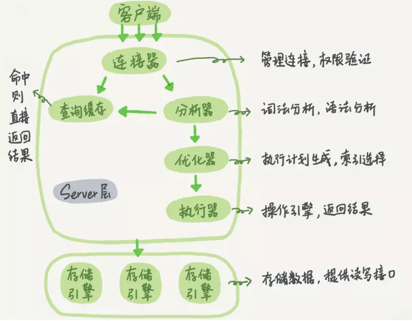
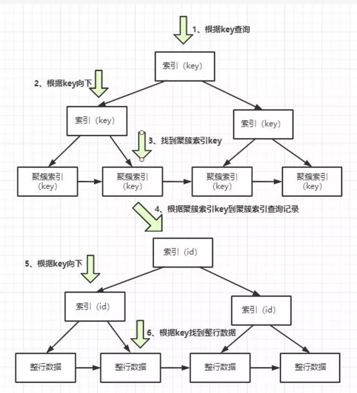
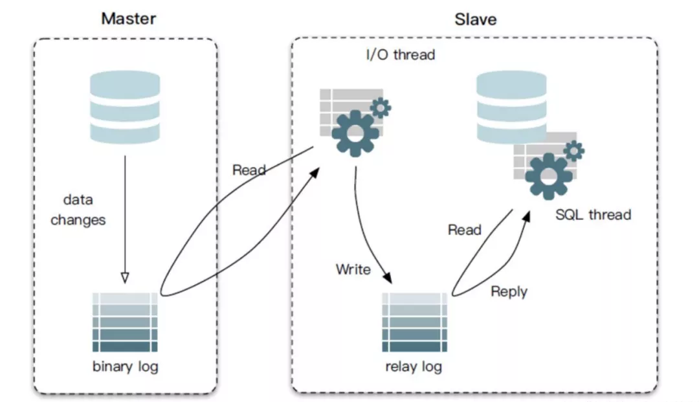
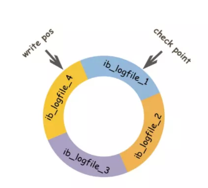
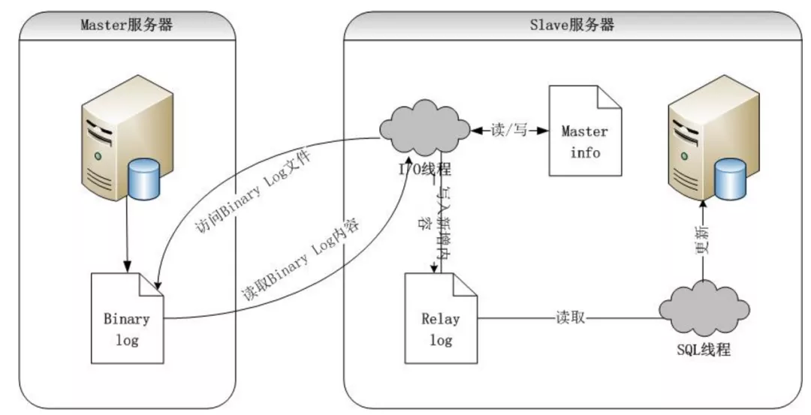

# 《面试八股文》之 MySql 35卷
1.说一说三大范式
2.MyISAM 与 InnoDB 的区别是什么？
3.为什么推荐使用自增 id 作为主键？
4.一条查询语句是怎么执行的?
5.使用 Innodb 的情况下，一条更新语句是怎么执行的?
6.Innodb 事务为什么要两阶段提交?
7.什么是索引?
8.索引失效的场景有哪些?
9.为什么采用 B+ 树,而不是 B-树
10.WAl 是什么?有什么好处?
11.什么是回表?
12.什么是索引下推?
13.什么是覆盖索引?
14.什么是最左前缀原则?
15.普通索引和唯一索引该怎么选择?
16.什么是事务?其特性是什么?
17.事务的隔离级别?
18.binlog 是做什么的?
19.undolog 是做什么的?
20.relaylog 是做什么的?
21.redolog 是做什么的?
22.redolog 是怎么记录日志的?
23.redolog 和 binlog 的区别是什么?
24.说一说 mvcc 吧，有什么作用?
25.一条 Sql 语句查询一直慢会是什么原因?
26.一条 Sql 语句查询偶尔慢会是什么原因?
27.Mysql 主从之间是怎么同步数据的?
28.主从延迟要怎么解决?
29.删除表数据后表的大小却没有变动,这是为什么?
30.为什么 VarChar 建议不要超过255?
31.分布式式事务怎么实现?
32.Mysql 中有哪些锁?
33.为什么不要使用长事务?
34.buffer pool 是做什么的?
35.说说你的 Sql 调优思路吧
------
## **1.说一说三大范式**
**「第一范式」**：数据库中的字段具有**「原子性」**，不可再分，并且是单一职责
**「第二范式」**：**「建立在第一范式的基础上」**，第二范式要求数据库表中的每个实例或行必须**「可以被惟一地区分」**。为实现区分通常需要为表加上一个列，以存储各个实例的惟一标识。这个惟一属性列被称为主键
**「第三范式」**：**「建立在第一，第二范式的基础上」**，确保每列都和主键列直接相关，而不是间接相关不存在其他表的非主键信息
但是在我们的日常开发当中，**「并不是所有的表一定要满足三大范式」**，有时候冗余几个字段可以少关联几张表，带来的查询效率的提升有可能是质变的
## **2.MyISAM 与 InnoDB 的区别是什么？**
 
\1. **「InnoDB支持事务，MyISAM不支持」**。
\1. **「InnoDB 支持外键，而 MyISAM 不支持」**。
\1. **「InnoDB是聚集索引」**，使用B+Tree作为索引结构，数据文件是和索引绑在一起的，必须要有主键。**「MyISAM是非聚集索引」**，也是使用B+Tree作为索引结构，索引和数据文件是分离的，索引保存的是数据文件的指针。主键索引和辅助索引是独立的。
\1. **「InnoDB 不保存表的具体行数」**。**「MyISAM 用一个变量保存了整个表的行数」**。
5.Innodb 有 **「redolog」** 日志文件，MyISAM 没有
6.**「Innodb存储文件有frm、ibd，而Myisam是frm、MYD、MYI」**
§ Innodb：frm是表定义文件，ibd是数据文件
§ Myisam：frm是表定义文件，myd是数据文件，myi是索引文件
\1. **「InnoDB 支持表、行锁，而 MyISAM 支持表级锁」**
8、**「InnoDB 必须有唯一索引(主键)」**,如果没有指定的话 InnoDB 会自己生成一个隐藏列Row_id来充当默认主键，**「MyISAM 可以没有」**
## **3.为什么推荐使用自增 id 作为主键？**
 
１.普通索引的 B+ 树上存放的是主键索引的值，如果该值较大，会**「导致普通索引的存储空间较大」**
２.使用自增 id 做主键索引新插入数据只要放在该页的最尾端就可以，直接**「按照顺序插入」**，不用刻意维护
3.页分裂容易维护，当插入数据的当前页快满时，会发生页分裂的现象，如果主键索引不为自增 id，那么数据就可能从页的中间插入，页的数据会频繁的变动，**「导致页分裂维护成本较高」**
## **4.一条查询语句是怎么执行的?**
 
1.通过连接器跟客户端**「建立连接」**
2.通过查询**「缓存查询」**之前是否有查询过该 sql
§ 有则直接返回结果
§ 没有则执行第三步
3.通过分析器**「分析该 sql 的语义」**是否正确，包括格式，表等等
4.通过优化器**「优化该语句」**，比如选择索引，join 表的连接顺序
5.**「验证权限」**，验证是否有该表的查询权限
§ 没有则返回无权限的错误
§ 有则执行第六步
6.通过执行器调用存储引擎执行该 sql，然后返回**「执行结果」**
## **5.使用 Innodb 的情况下，一条更新语句是怎么执行的?**
用以下语句来举例，c 字段无索引，id 为主键索引
update T set c=c+1 where id=2;
1.执行器先找引擎取 id=2 这一行。id 是主键，引擎直接用树搜索找到这一行
§ 如果 id=2 这一行所在的数据页本来就**「在内存中」**，就**「直接返回」**给执行器
§ **「不在内存」**中，需要先从磁盘**「读入内存」**，然后再**「返回」**
2.执行器拿到引擎给的行数据，把这个值加上 1，比如原来是 N，现在就是 N+1，得到新的一行数据，再调用引擎接口**「写入这行新数据」**
3.引擎将这行新数据更新到内存中，同时将这个更新操作**「记录到 redlog 里面」**，此时 redlog 处于 **「prepare」** 状态。然后告知执行器执行完成了，随时可以提交事务
4.执行器**「生成这个操作的 binlog」**，并把 binlog **「写入磁盘」**
5.执行器调用引擎的**「提交事务」**接口，引擎把刚刚写入的 redlog 改成提交（commit）状态，**「更新完成」**
## **6.Innodb 事务为什么要两阶段提交?**
先写 redolog 后写binlog。假设在 redolog 写完，binlog 还没有写完的时候，MySQL 进程异常重启，这时候 binlog 里面就没有记录这个语句。然后你会发现，如果需要用这个 binlog 来恢复临时库的话，由于这个语句的 **「binlog 丢失」**，这个临时库就会少了这一次更新，恢复出来的这一行 c 的值就是 0，与原库的值不同。
先写 binlog 后写 redolog。如果在 binlog 写完之后 crash，由于 redolog 还没写，崩溃恢复以后这个事务无效，所以这一行c的值是0。但是 binlog 里面已经记录了“把c从0改成1”这个日志。所以，在之后用 binlog 来恢复的时候就**「多了一个事务出来」**，恢复出来的这一行 c 的值就是 1，与原库的值不同。
可以看到，**「如果不使用“两阶段提交”，那么数据库的状态就有可能和用它的日志恢复出来的库的状态不一致」**。
## **7.什么是索引?**
相信大家小时候学习汉字的时候都会查字典，想想你查字典的步骤，我们是通过汉字的首字母 a～z 一个一个在字典目录中查找，最终找到该字的页数。想想，如果没有目录会怎么样，最差的结果是你有可能翻到字典的最后一页才找到你想要找的字。
索引就**「相当于我们字典中的目录」**，可以极大的提高我们在数据库的查询效率。
## **8.索引失效的场景有哪些?**
以下随便列举几个，不同版本的 mysql 场景不一
1.最左前缀法则（带头索引不能死，中间索引不能断
2.不要在索引上做任何操作（计算、函数、自动/手动类型转换），不然会导致索引失效而转向全表扫描
3.不能继续使用索引中范围条件（bettween、<、>、in等）右边的列，如：
select a from user where c > 5 and b = 4；
4.索引字段上使用（！= 或者 < >）判断时，会导致索引失效而转向全表扫描
5.索引字段上使用 is null / is not null 判断时，会导致索引失效而转向全表扫描。
6.索引字段使用like以通配符开头（‘%字符串’）时，会导致索引失效而转向全表扫描，也是最左前缀原则。
7.索引字段是字符串，但查询时不加单引号，会导致索引失效而转向全表扫描
8.索引字段使用 or 时，会导致索引失效而转向全表扫描
## **9.为什么采用 B+ 树,而不是 B-树**
B+ 树只在叶子结点储存数据，非叶子结点不存具体数据，只存 key，查询更稳定，增大了广度，而一个节点就是磁盘一个内存页，内存页大小固定，那么相比 B 树，B- 树这些**「可以存更多的索引结点」**，宽度更大，树高矮，节点小，拉取一次数据的磁盘 I次数少，并且 B+ 树只需要去遍历叶子节点就可以实现整棵树的遍历。而且在数据库中基于范围的查询是非常频繁的，效率更高。
## **10.WAl 是什么?有什么好处?**
WAL 就是 Write-Ahead Logging，其实就是**「所有的修改都先被写入到日志中，然后再写磁盘」**，用于保证数据操作的原子性和持久性。
好处:
1.**「读和写可以完全地并发执行」**，不会互相阻塞
2.先写入 log 中，磁盘写入从**「随机写变为顺序写」**，降低了 client 端的延迟就。并且，由于顺序写入大概率是在一个磁盘块内，这样产生的 i次数也大大降低
3.写入日志当数据库崩溃的时候**「可以使用日志来恢复磁盘数据」**
## **11.什么是回表?**
 
回表就是先通过数据库索引扫描出该索引树中数据所在的行，取到主键 id，再通过主键 id 取出主键索引数中的数据，即基于非主键索引的查询需要多扫描一棵索引树.
## **12.什么是索引下推?**
如果存在某些被索引的列的判断条件时，MySQL 将这一部分判断条件传递给存储引擎，然后由存储引擎通过判断索引是否符合 MySQL 服务器传递的条件，**「只有当索引符合条件时才会将数据检索出来返回给 MySQL 服务器」** 。
## **13.什么是覆盖索引?**
覆盖索引（covering index）指一个查询语句的执行只用从索引中就能够取得，不必从数据表中读取，可以减少回表的次数。比如:
select id from t where age = 1;
id 为主键索引，age 为普通索引，age 这个索引树存储的就是逐渐信息，可以直接返回
## **14.什么是最左前缀原则?**
最左前缀其实说的是，在 where 条件中出现的字段，**「如果只有组合索引中的部分列，则这部分列的触发索引顺序」**，是按照定义索引的时候的顺序从前到后触发，最左面一个列触发不了，之后的所有列索引都无法触发。
比如**「有一个 (a,b,c) 的组合索引」**
where a = 1 and b = 1
此时 a,b 会命中该组合索引
where a = 1 and c = 1
此时 a 会命中该组合索引, c 不会
where b = 1 and c = 1
此时不会命中该组合索引
## **15.普通索引和唯一索引该怎么选择?**
查询
§ 当普通索引为条件时查询到数据会一直扫描,直到扫完整张表
§ 当唯一索引为查询条件时,查到该数据会直接返回,不会继续扫表
更新
§ 普通索引会直接将操作更新到 change buffer 中,然后结束
§ 唯一索引需要判断数据是否冲突
所以**「唯一索引更加适合查询的场景,普通索引更适合插入的场景」**
## **16.什么是事务?其特性是什么?**
事务是指是程序中一系列操作必须全部成功完成，有一个失败则全部失败。
 
特性
**「1.原子性（Atomicity）」**：要么全部执行成功，要么全部不执行。
**「2.一致性（Consistency）」**：事务前后数据的完整性必须保持一致。
**「3.隔离性（Isolation）」**：隔离性是当多个事务同事触发时，不能被其他事务的操作所干扰，多个并发事务之间要相互隔离。
**「4.持久性（Durability）」**：事务完成之后的改变是永久的。
## **17.事务的隔离级别?**
1.**「读提交」**:即能够**「读取到那些已经提交」**的数据
2.**「读未提交」**:即能够**「读取到没有被提交」**的数据
3.**「可重复读」**:可重复读指的是在一个事务内，最开始读到的数据和事务结束前的**「任意时刻读到的同一批数据都是一致的」**
4.**「可串行化」**:最高事务隔离级别，不管多少事务，都是**「依次按序一个一个执行」**
 
**「脏读」**
§ 脏读指的是**「读到了其他事务未提交的数据」**，未提交意味着这些数据可能会回滚，也就是可能最终不会存到数据库中，也就是不存在的数据。读到了并一定最终存在的数据，这就是脏读
**「不可重复读」**
§ 对比可重复读，不可重复读指的是在同一事务内，**「不同的时刻读到的同一批数据可能是不一样的」**。
**「幻读」**
§ 幻读是针对数据插入（INSERT）操作来说的。假设事务A对某些行的内容作了更改，但是还未提交，此时事务B插入了与事务A更改前的记录相同的记录行，并且在事务A提交之前先提交了，而这时，在事务A中查询，会发现**「好像刚刚的更改对于某些数据未起作用」**，但其实是事务B刚插入进来的这就叫幻读
## **18.binlog 是做什么的?**
binlog 是归档日志，属于 Server 层的日志，是一个二进制格式的文件，用于**「记录用户对数据库更新的SQL语句信息」**。
主要作用
主从复制
数据恢复
## **19.undolog 是做什么的?**
undolog 是 InnoDB 存储引擎的日志，用于保证数据的原子性，**「保存了事务发生之前的数据的一个版本，也就是说记录的是数据是修改之前的数据，可以用于回滚」**，同时可以提供多版本并发控制下的读（MVCC）。
主要作用
事务回滚
实现多版本控制(MVCC)
## **20.relaylog 是做什么的?**
relaylog 是中继日志，**「在主从同步的时候使用到」**，它是一个中介临时的日志文件，用于存储从master节点同步过来的binlog日志内容。
 
master 主节点的 binlog 传到 slave 从节点后，被写入 relay log 里，从节点的 slave sql 线程从 relaylog 里读取日志然后应用到 slave 从节点本地。从服务器 I/线程将主服务器的二进制日志读取过来记录到从服务器本地文件，然后 SQL 线程会读取 relay-log 日志的内容并应用到从服务器，从而**「使从服务器和主服务器的数据保持一致」**。
## **21.redolog 是做什么的?**
redolog 是 **「InnoDB 存储引擎所特有的一种日志」**，用于记录事务操作的变化，记录的是数据修改之后的值，不管事务是否提交都会记录下来。
可以做**「数据恢复并且提供 crash-safe 能力」**
当有增删改相关的操作时，会先记录到 Innodb 中，并修改缓存页中的数据，**「等到 mysql 闲下来的时候才会真正的将 redolog 中的数据写入到磁盘当中」**。
## **22.redolog 是怎么记录日志的?**
 
InnoDB 的 redlog 是固定大小的，比如可以配置为一组4个文件，每个文件的大小是1GB，那么总共就可以记录4GB的操作。**「从头开始写，写到末尾就又回到开头循环写」**。
所以，如果数据写满了但是还没有来得及将数据真正的刷入磁盘当中，那么就会发生**「内存抖动」**现象，从肉眼的角度来观察会发现 mysql 会宕机一会儿，此时就是正在刷盘了。
## **23.redolog 和 binlog 的区别是什么?**
 
1.**「redolog」** 是 **「Innodb」** 独有的日志，而 **「binlog」** 是 **「server」** 层的，所有的存储引擎都有使用到
2.**「redolog」** 记录了**「具体的数值」**，对某个页做了什么修改，**「binlog」** 记录的**「操作内容」**
3.**「binlog」** 大小达到上限或者 flush log **「会生成一个新的文件」**，而 **「redolog」** 有固定大小**「只能循环利用」**
4.**「binlog 日志没有 crash-safe 的能力」**，只能用于归档。而 redlog 有 crash-safe 能力。
## **24.说一说 mvcc 吧，有什么作用?**
MVCC:多版本并发控制，是现代数据库(包括 MySQL、Oracle、PostgreSQL 等)引擎实现中常用的处理读写冲突的手段，目的在于**「提高数据库高并发场景下的吞吐性能」**。
在 MVCC 协议下，每个读操作会看到一个一致性的快照，**「这个快照是基于整个库的」**，并且可以实现非阻塞的读，用于**「支持读提交和可重复读隔离级别的实现」**。
MVCC 允许数据具有多个版本，这个版本可以是时间戳或者是全局递增的事务 ID，在同一个时间点，不同的事务看到的数据是不同的，这个修改的数据是**「记录在 undolog 中」**的。
## **25.一条 Sql 语句查询一直慢会是什么原因?**
 
**「1.没有用到索引」**
§ 比如函数导致的索引失效，或者本身就没有加索引
**「2.表数据量太大」**
§ 考虑分库分表吧
**「3.优化器选错了索引」**
§ **「考虑使用」** force index 强制走索引
## **26.一条 Sql 语句查询偶尔慢会是什么原因?**
 
**「1. 数据库在刷新脏页」**
§ 比如 **「redolog 写满了」**，**「内存不够用了」**释放内存如果是脏页也需要刷，mysql **「正常空闲状态刷脏页」**
**「2. 没有拿到锁」**
## **27.Mysql 主从之间是怎么同步数据的?**
1.master 主库将此次更新的事件类型**「写入到主库的 binlog 文件」**中
2.master **「创建 log dump 线程通知 slave」** 需要更新数据
3.**「slave」** 向 master 节点发送请求，**「将该 binlog 文件内容存到本地的 relaylog 中」**
4.**「slave 开启 sql 线程」**读取 relaylog 中的内容，**「将其中的内容在本地重新执行一遍」**，完成主从数据同步
 
**「同步策略」**：
1.**「全同步复制」**：主库强制同步日志到从库，等全部从库执行完才返回客户端，性能差
2.**「半同步复制」**：主库收到至少一个从库确认就认为操作成功，从库写入日志成功返回ack确认
## **28.主从延迟要怎么解决?**
1.MySQL 5.6 版本以后，提供了一种**「并行复制」**的方式，通过将 SQL 线程转换为多个 work 线程来进行重放
2.**「提高机器配置」**(王道)
3.在业务初期就选择合适的分库、分表策略，**「避免单表单库过大」**带来额外的复制压力
4.**「避免长事务」**
5.**「避免让数据库进行各种大量运算」**
6.对于一些对延迟很敏感的业务**「直接使用主库读」**
## **29.删除表数据后表的大小却没有变动,这是为什么?**
在使用 delete 删除数据时，其实对应的数据行并不是真正的删除，是**「逻辑删除」**，InnoDB 仅仅是将其**「标记成可复用的状态」**，所以表空间不会变小
## **30.为什么 VarChar 建议不要超过255?**
 
当定义varchar长度小于等于255时，长度标识位需要一个字节(utf-8编码)
当大于255时，长度标识位需要两个字节，并且建立的**「索引也会失效」**
## **31.分布式式事务怎么实现?**
1.**「本地消息表」**
2.**「消息事务」**
3.**「二阶段提交」**
4.**「三阶段提交」**
5.**「TCC」**
6.**「最大努力通知」**
7.**「Seata 框架」**
[**七种分布式事务的解决方案，一次讲给你听**](#wechat_redirect)
## **32.Mysql 中有哪些锁?**
以下并不全，主要理解下锁的意义即可
基于锁的属性分类：共享锁、排他锁
基于锁的粒度分类：表锁、行锁、记录锁、间隙锁、临键锁
基于锁的状态分类：意向共享锁、意向排它锁、死锁
## **33.为什么不要使用长事务?**
 
1.并发情况下，数据库**「连接池容易被撑爆」**
2.**「容易造成大量的阻塞和锁超时」**
§ 长事务还占用锁资源，也可能拖垮整个库，
3.执行时间长，容易造成**「主从延迟」**
4.**「回滚所需要的时间比较长」**
§ 事务越长整个时间段内的事务也就越多
5.**「undolog 日志越来越大」**
§ 长事务意味着系统里面会存在很老的事务视图。由于这些事务随时可能访问数据库里面的任何数据，所以这个事务提交之前，数据库里面它可能用到的回滚记录都必须保留，这就会导致大量占用存储空间。
## **34.buffer pool 是做什么的?**
buffer pool 是一块内存区域，为了**「提高数据库的性能」**，当数据库操作数据的时候，把硬盘上的数据加载到 buffer pool，不直接和硬盘打交道，操作的是 buffer pool 里面的数据，数据库的增删改查都是在 buffer pool 上进行
buffer pool 里面缓存的数据内容也是一个个数据页
其中**「有三大双向链表」**:
**「free 链表」**
§ 用于帮助我们找到空闲的缓存页
**「flush 链表」**
§ 用于找到脏缓存页，也就是需要刷盘的缓存页
**「lru 链表」**
§ 用来淘汰不常被访问的缓存页，分为热数据区和冷数据区，冷数据区主要存放那些不常被用到的数据
预读机制:
Buffer Pool 有一项特技叫预读，存储引擎的接口在被 Server 层调用时，会在响应的同时进行预判，将下次可能用到的数据和索引加载到 Buffer Pool
## **35.说说你的 Sql 调优思路吧**
 
1.**「表结构优化」**
§ 1.1拆分字段
§ 1.2字段类型的选择
§ 1.3字段类型大小的限制
§ 1.4合理的增加冗余字段
§ 1.5新建字段一定要有默认值
2.**「索引方面」**
§ 2.1索引字段的选择
§ 2.2利用好mysql支持的索引下推，覆盖索引等功能
§ 2.3唯一索引和普通索引的选择
3.**「查询语句方面」**
§ 3.1避免索引失效
§ 3.2合理的书写where条件字段顺序
§ 3.3小表驱动大表
§ 3.4可以使用force index()防止优化器选错索引
4.**「分库分表」**
