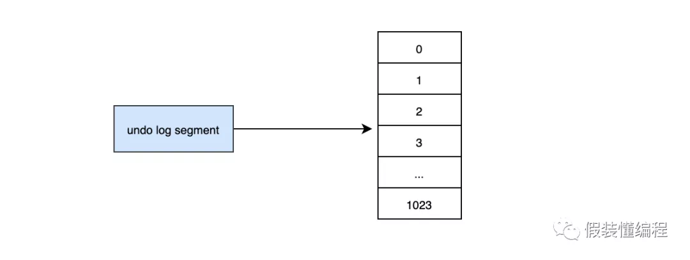

# 一文搞懂回滚和持久化

## ***\*redo log\****

事务的支持是数据库区分文件系统的重要特征之一，事务的四大特性：

· 原子性：所有的操作要么都做，要么都不做，不可分割。

· 一致性：数据库从一种状态变成另一种状态的的结果最终是一致的，比如A给B转账500，A最终少了500，B最终多了500，但是A+B的值始终没变。

· 隔离性：事务和事务之前相互隔离，互不干扰。

· 持久性：事务一旦提交，它对数据的变更是永久性的。

本篇文章主要说说持久性相关的知识。

当我们在事务中更新一条记录的时候，比如：

***\*update\**** ***\*user\**** ***\*set\**** age=11 ***\*where\**** user_id=1;

它的流程大概是这样的：

\1. 先判断user_id这条数据所在的页是否在内存里，如果不在的话，先从数据库读取到，然后加载到内存中

\2. 修改内存中的age为11

\3. 写入redo log，并且redo log处于prepare状态

\4. 写入binlog

\5. 提交事务，redo log变成commit状态

 

这里面有几个关键的点：redo log是什么？为什么需要redo log？prepare状态的redo log是什么？redo log和binlog是否可以只选其一...?带着这一系列的问题，我们来揭开redo log的面纱。

***\*为什么要先更新内存数据，不直接更新磁盘数据？\****

我们为什么不每次更新数据的时候，直接更新对应的磁盘数据？首先我们知道磁盘IO是缓慢的，内存是快速的，两者的速度不是一个量级的，那么针对缓慢的磁盘IO，出现了索引，通过索引哪怕数据成百上千万我们依然可以在磁盘上很快速的找我们的数据，这就是索引的作用。但是索引也需要维护，并不是一成不变的，当我们插入一条新数据A的时候，由于这条数据要插入在已存在的数据B之后，那么就要移动B数据，让出一个位置给A，这个有一定的开销。更糟糕的是，本来要插入的页已经满了，那么就要申请一个新的页，然后挪一部分数据过去，这叫做页的分裂，这个开销更大。如果我们的sql变更是直接修改磁盘的数据，恰巧正好出现上面的问题，那么此时的效率就会很低，严重的话会造成超时，这也是上面更新的过程为什么先要加载对应的数据页到内存中，然后先更新内存中的数据的原因。对于mysql来说，所有的变更都必须先更新缓冲池中的数据，然后缓冲池中的脏页会以一定的频率被刷入磁盘（**「checkPoint」**机制），通过缓冲池来优化CPU和磁盘之间的鸿沟，这样就可以保证整体的性能不会下降太快。

***\*为什么需要redo log？\****

缓冲池可以帮助我们消除CPU和磁盘之间的鸿沟，checkpoint机制可以保证数据的最终落盘，然而由于checkpoint并不是每次变更的时候就触发的，而是master线程隔一段时间去处理的。所以最坏的情况就是刚写完缓冲池，数据库宕机了，那么这段数据就是丢失的，无法恢复。这样的话就不满足ACID中的D，为了解决这种情况下的持久化问题，InnoDB引擎的事务采用了WAL技术（Write-Ahead Logging），这种技术的思想就是先写日志，再写磁盘，只有日志写入成功，才算事务提交成功，这里的日志就是redo log。当发生宕机且数据未刷到磁盘的时候，可以通过redo log来恢复，保证ACID中的D，这就是redo log的作用。

***\*redo log是如何实现的？\****

redo log的写入并不是直接写入磁盘的，redo log也有缓冲区的，叫做redo log buffer（重做日志缓冲），InnoDB引擎会在写redo log的时候先写redo log buffer，然后也是以一定的频率刷入到真正的redo log中，redo log buffer一般不需要特别大，它只是一个临时的容器，master线程会每秒将redo log buffer刷到redo log文件中，因此我们只要保证redo log buffer能够存下1s内的事务变更的数据量即可，以mysql5.7.23为例，这个默认是16M。

mysql> ***\*show\**** ***\*variables\**** ***\*like\**** '%innodb_log_buffer_size%';
+------------------------+----------+
| Variable_name     | Value  |
+------------------------+----------+
| innodb_log_buffer_size | 16777216 |
+------------------------+----------+

16M的buffer足够应对大部分应用了，buffer同步到redo log的策略主要有如下几个：

· master线程每秒将buffer刷到到redo log中

· 每个事务提交的时候会将buffer刷到redo log中

· 当buffer剩余空间小于1/2时，会被刷到redo log中

需要注意的是redo log buffer刷到redo log的过程并不是真正的刷到磁盘中去了，只是刷入到os cache中去，这是现代操作系统为了提高文件写入的效率做的一个优化，真正的写入会交给系统自己来决定（比如os cache足够大了）。那么对于InnoDB来说就存在一个问题，如果交给系统来fsync，同样如果系统宕机，那么数据也丢失了（虽然整个系统宕机的概率还是比较小的）。针对这种情况，InnoDB给出***\*innodb_flush_log_at_trx_commit\****策略，让用户自己决定使用哪个。

mysql> ***\*show\**** ***\*variables\**** ***\*like\**** 'innodb_flush_log_at_trx_commit';
+--------------------------------+-------+
| Variable_name         | Value |
+--------------------------------+-------+
| innodb_flush_log_at_trx_commit | 1   |
+--------------------------------+-------+

· 0：表示事务提交后，不进行fsync，而是由master每隔1s进行一次重做日志的fysnc

· 1：默认值，每次事务提交的时候同步进行fsync

· 2：写入os cache后，交给操作系统自己决定什么时候fsync

从3种刷入策略来说：

**「2」**肯定是效率最高的，但是只要操作系统发生宕机，那么就会丢失os cache中的数据，这种情况下无法满足ACID中的D

**「0」**的话，是一种折中的做法，它的IO效率理论是高于***\*1\****的，低于***\*2\****的，它的数据安全性理论是要低于***\*1\****的，高于***\*2\****的，这种策略也有丢失数据的风险，也无法保证D。

**「1」**是默认值，可以保证D，数据绝对不会丢失，但是效率最差的。个人建议使用默认值，虽然操作系统宕机的概率理论小于数据库宕机的概率，但是一般既然使用了事务，那么数据的安全应该是相对来说更重要些。

***\*redo log是对页的物理修改，第x页的第x位置修改成xx\****，比如：

page(2,4),offset 64,value 2

在InnoDB引擎中，redo log都是以512字节为单位进行存储的，每个存储的单位我们称之为redo log block（重做日志块），若一个页中存储的日志量大于512字节，那么就需要逻辑上切割成多个block进行存储。

一个redo log block是由日志头、日志体、日志尾组成。日志头占用12字节，日志尾占用8字节，所以一个block真正能存储的数据就是512-12-8=492字节。多个redo log block组成了我们的redo log。

每个redo log默认大小为48M：

mysql> ***\*show\**** ***\*variables\**** ***\*like\**** 'innodb_log_file_size';
+----------------------+----------+
| Variable_name    | Value  |
+----------------------+----------+
| innodb_log_file_size | 50331648 |
+----------------------+----------+

InnoDB默认2个redo log组成一个log组，真正工作的就是这个log组。

mysql> ***\*show\**** ***\*variables\**** ***\*like\**** 'innodb_log_files_in_group';
+---------------------------+-------+
| Variable_name       | Value |
+---------------------------+-------+
| innodb_log_files_in_group | 2   |
+---------------------------+-------+
\#ib_logfile0
\#ib_logfile1

当ib_logfile0写完之后，会写ib_logfile1，当ib_logfile1写完之后，会重新写ib_logfile0...，就这样一直不停的循环写。

 

***\*为什么一个block设计成512字节？\****

这个和磁盘的扇区有关，机械磁盘默认的扇区就是512字节，如果你要写入的数据大于512字节，那么要写入的扇区肯定不止一个，这时就要涉及到盘片的转动，找到下一个扇区，假设现在需要写入两个扇区A和B，如果扇区A写入成功，而扇区B写入失败，那么就会出现非原子性的写入，而如果每次只写入和扇区的大小一样的512字节，那么每次的写入都是原子性的。

***\*为什么要两段式提交？\****

从上文我们知道，事务的提交要先写redo log(prepare)，再写binlog，最后再提交(commit)。这里为什么要有个prepare的动作？redo log直接commit状态不行吗？假设redo log直接提交，在写binlog的时候，发生了crash，这时binlog就没有对应的数据，那么所有依靠binlog来恢复数据的slave，就没有对应的数据，导致主从不一致。所以需要通过两段式（2pc）提交来保证redo log和binlog的一致性是非常有必要的。具体的步骤是：处于prepare状态的redo log，会记录2PC的XID，binlog写入后也会记录2PC的XID，同时会在redo log上打上commit标识。

***\*redo log和bin log是否可以只需要其中一个？\****

不可以。redo log本身大小是固定的，在写满之后，会重头开始写，会覆盖老数据，因为redo log无法保存所有数据，所以在主从模式下，想要通过redo log来同步数据给从库是行不通的。那么binlog是一定需要的，binlog是mysql的server层产生的，和存储引擎无关，binglog又叫归档日志，当一个binlog file写满之后，会写入到一个新的binlog file中。所以我们是不是只需要binlog就行了？redo log可以不需要？当然也不行，redo log的作用是提供crash-safe的能力，首先对于一个数据的修改，是先修改缓冲池中的数据页的，这时修改的数据并没有真正的落盘，这主要是因为磁盘的离散读写能力效率低，真正落盘的工作交给master线程定期来处理，好处就是master可以一次性把多个修改一起写入磁盘。那么此时就有一个问题，当事务commit之后，数据在缓冲区的脏页中，还没来的及刷入磁盘，此时数据库发生了崩溃，那么这条commit的数据即使在数据库恢复后，也无法还原，并不能满足ACID中的D，然后就有了redo log，从流程来看，一个事务的提交必须保证redo log的写入成功，只有redo log写入成功才算事务提交成功，redo log大部分情况是顺序写的磁盘，所以它的效率要高很多。当commit后发生crash的情况下，我们可以通过redo log来恢复数据，这也是为什么需要redo log的原因。但是事务的提交也需要binlog的写入成功，那为什么不可以通过binlog来恢复未落盘的数据？这是因为binlog不知道哪些数据落盘了，所以不知道哪些数据需要恢复。对于redo log而言，在数据落盘后对应的redo log中的数据会被删除，那么在数据库重启后，只要把redo log中剩下的数据都恢复就行了。

***\*crash后是如何恢复的？\****

通过两段式提交我们知道redo log和binlog在各个阶段会被打上prepare或者commit的标识，同时还会记录事务的XID，有了这些数据，在数据库重启的时候，会先去redo log里检查所有的事务，如果redo log的事务处于commit状态，那么说明在commit后发生了crash，此时直接把redo log的数据恢复就行了，如果redo log是prepare状态，那么说明commit之前发生了crash，此时binlog的状态决定了当前事务的状态，如果binlog中有对应的XID，说明binlog已经写入成功，只是没来的及提交，此时再次执行commit就行了，如果binlog中找不到对应的XID，说明binlog没写入成功就crash了，那么此时应该执行回滚。

## ***\*undo log\****

redo log是事务持久性的保证，undo log是事务原子性的保证。在事务中更新数据的前置操作其实是要先写入一个undo log中的，所以它的流程大致如下：

 

***\*什么情况下会生成undo log？\****

undo log的作用就是mvcc（多版本控制）和回滚，我们这里主要说回滚，当我们在事务里insert、update、delete某些数据的时候，就会产生对应的undo log，当我们执行回滚时，通过undo log就可以回到事务开始的样子。需要注意的是回滚并不是修改的物理页，而是逻辑的恢复到最初的样子，比如一个数据A，在事务里被你修改成B，但是此时有另一个事务已经把它修改成了C，如果回滚直接修改数据页把数据改成A，那么C就被覆盖了。

对于InnoDB引擎来说，每个行记录除了记录本身的数据之外，还有几个隐藏的列：

**·** ***\*DB_ROW_ID\****：如果没有为表显式的定义主键，并且表中也没有定义唯一索引，那么InnoDB会自动为表添加一个row_id的隐藏列作为主键。

**·** ***\*DB_TRX_ID\****：每个事务都会分配一个事务ID，当对某条记录发生变更时，就会将这个事务的事务ID写入trx_id中。

**·** ***\*DB_ROLL_PTR\****：回滚指针，本质上就是指向 undo log 的指针。

 

当我们执行INSERT时：

***\*begin\****;
***\*INSERT\**** ***\*INTO\**** ***\*user\**** (***\*name\****) ***\*VALUES\**** ("tom")

插入的数据都会生一条insert undo log，并且数据的回滚指针会指向它。undo log会记录undo log的序号、插入主键的列和值...，那么在进行rollback的时候，通过主键直接把对应的数据删除即可。

 

对于更新的操作会产生update undo log，并且会分更新主键的和不更新的主键的，假设现在执行：

***\*UPDATE\**** ***\*user\**** ***\*SET\**** ***\*name\****="Sun" ***\*WHERE\**** ***\*id\****=1;

这时会把老的记录写入新的undo log，让回滚指针指向新的undo log，它的undo no是1，并且新的undo log会指向老的undo log（undo no=0）。

假设现在执行：

***\*UPDATE\**** ***\*user\**** ***\*SET\**** ***\*id\****=2 ***\*WHERE\**** ***\*id\****=1;

 

对于更新主键的操作，会先把原来的数据deletemark标识打开，这时并没有真正的删除数据，真正的删除会交给清理线程去判断，然后在后面插入一条新的数据，新的数据也会产生undo log，并且undo log的序号会递增。

可以发现每次对数据的变更都会产生一个undo log，当一条记录被变更多次时，那么就会产生多条undo log，undo log记录的是变更前的日志，并且每个undo log的序号是递增的，那么当要回滚的时候，按照序号依次向前推，就可以找到我们的原始数据了。

***\*undo log是如何回滚的？\****

以上面的例子来说，假设执行rollback，那么对应的流程应该是这样：

\1. 通过undo no=3的日志把id=2的数据删除

\2. 通过undo no=2的日志把id=1的数据的deletemark还原成0

\3. 通过undo no=1的日志把id=1的数据的name还原成Tom

\4. 通过undo no=0的日志把id=1的数据删除

***\*undo log存在什么地方？\****

InnoDB对undo log的管理采用段的方式，也就是回滚段，每个回滚段记录了1024个undo log segment，InnoDB引擎默认支持128个回滚段

mysql> ***\*show\**** ***\*variables\**** ***\*like\**** 'innodb_undo_logs';
+------------------+-------+
| Variable_name  | Value |
+------------------+-------+
| innodb_undo_logs | 128  |
+------------------+-------+

那么能支持的最大并发事务就是128*1024。每个undo log segment就像维护一个有1024个元素的数组。

 

当我们开启个事务需要写undo log的时候，就得先去undo log segment中去找到一个空闲的位置，当有空位的时候，就会去申请undo页，最后会在这个申请到的undo页中进行undo log的写入。我们知道mysql默认一页的大小是16k。

mysql> ***\*show\**** ***\*variables\**** ***\*like\**** '%innodb_page_size%';
+------------------+-------+
| Variable_name  | Value |
+------------------+-------+
| innodb_page_size | 16384 |
+------------------+-------+

那么为一个事务就分配一个页，其实是非常浪费的（除非你的事物非常长），假设你的应用的TPS为1000，那么1s就需要1000个页，大概需要16M的存储，1分钟大概需要1G的存储...，如果照这样下去除非mysql清理的非常勤快，否则随着时间的推移，磁盘空间会增长的非常快，而且很多空间都是浪费的。于是undo页就被设计的可以重用了，当事务提交时，并不会立刻删除undo页，因为重用，这个undo页它可能不干净了，所以这个undo页可能混杂着其他事务的undo log。undo log在commit后，会被放到一个链表中，然后判断undo页的使用空间是否小于3/4，如果小于3/4的话，则表示当前的undo页可以被重用，那么它就不会被回收，其他事务的undo log可以记录在当前undo页的后面。由于undo log是离散的，所以清理对应的磁盘空间时，效率不是那么高。

 