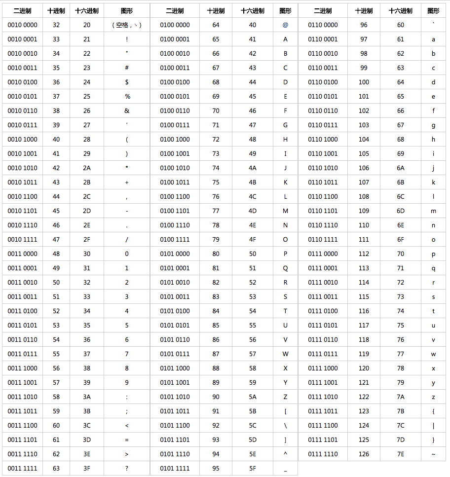
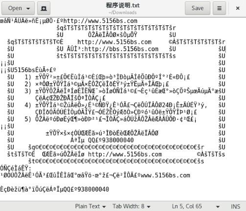
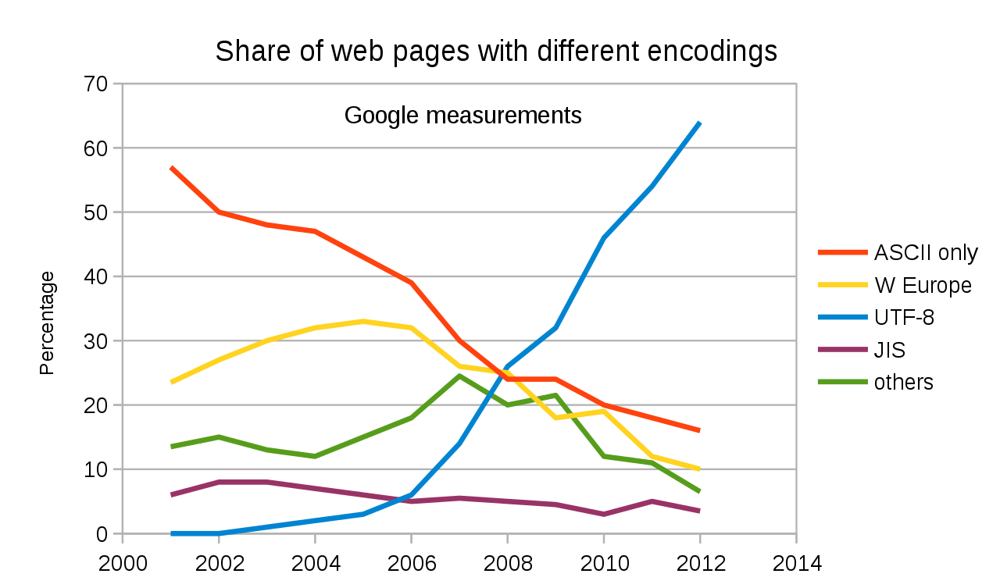
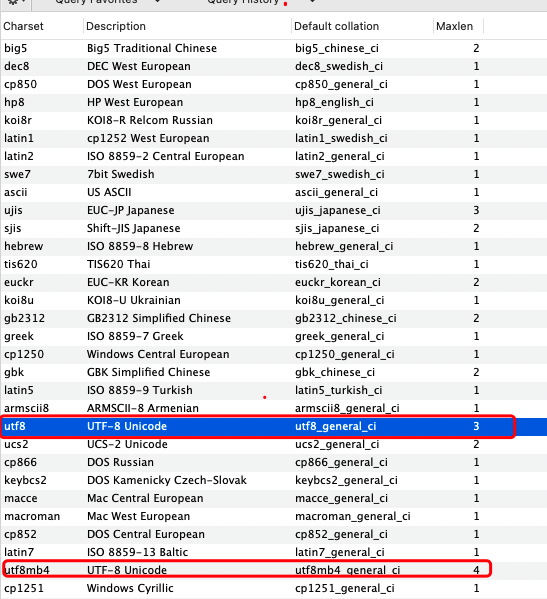

MySQL 字符编码集中有两套 UTF-8 编码实现：**`utf8`** 和 **`utf8mb4`**。

如果使用 **`utf8`**  的话，存储emoji 符号和一些比较复杂的汉字、繁体字就会出错。

为什么会这样呢？这篇文章可以从源头给你解答。

## 何为字符集？

字符是各种文字和符号的统称，包括各个国家文字、标点符号、表情、数字等等。 **字符集** 就是一系列字符的集合。字符集的种类较多，每个字符集可以表示的字符范围通常不同，就比如说有些字符集是无法表示汉字的。

**计算机只能存储二进制的数据，那英文、汉字、表情等字符应该如何存储呢？**

我们要将这些字符和二级制的数据一一对应起来，比如说字符“a”对应“01100001”，反之，“01100001”对应 “a”。我们将字符对应二进制数据的过程称为"**字符编码**"，反之，二进制数据解析成字符的过程称为“**字符解码**”。

## 有哪些常见的字符集？

常见的字符集有 ASCII、GB2312、GBK、UTF-8......。

不同的字符集的主要区别在于：

- 可以表示的字符范围
- 编码方式

### ASCII

**ASCII** (**A**merican **S**tandard **C**ode for **I**nformation **I**nterchange，美国信息交换标准代码) 是一套主要用于现代美国英语的字符集（这也是 ASCII 字符集的局限性所在）。

**为什么 ASCII 字符集没有考虑到中文等其他字符呢？** 因为计算机是美国人发明的，当时，计算机的发展还处于比较雏形的时代，还未在其他国家大规模使用。因此，美国发布 ASCII 字符集的时候没有考虑兼容其他国家的语言。

ASCII 字符集至今为止共定义了 128 个字符，其中有 33 个控制字符（比如回车、删除）无法显示。

一个 ASCII 码长度是一个字节也就是 8 个 bit，比如“a”对应的 ASCII 码是“01100001”。不过，最高位是 0 仅仅作为校验位，其余 7 位使用 0 和 1 进行组合，所以，ASCII 字符集可以定义 128（2^7）个字符。

由于，ASCII 码可以表示的字符实在是太少了。后来，人们对其进行了扩展得到了 **ASCII 扩展字符集** 。ASCII 扩展字符集使用 8 位（bits）表示一个字符，所以，ASCII 扩展字符集可以定义 256（2^8）个字符。



### GB2312

我们上面说了，ASCII 字符集是一种现代美国英语适用的字符集。因此，很多国家都捣鼓了一个适合自己国家语言的字符集。

GB2312 字符集是一种对汉字比较友好的字符集，共收录 6700 多个汉字，基本涵盖了绝大部分常用汉字。不过，GB2312 字符集不支持绝大部分的生僻字和繁体字。

对于英语字符，GB2312 编码和 ASCII 码是相同的，1 字节编码即可。对于非英字符，需要 2 字节编码。

### GBK

GBK 字符集可以看作是 GB2312 字符集的扩展，兼容 GB2312 字符集，共收录了 20000 多个汉字。

GBK 中 K 是汉语拼音 Kuo Zhan（扩展）中的“Kuo”的首字母。

### GB18030

GB18030 完全兼容 GB2312 和 GBK 字符集，纳入中国国内少数民族的文字，且收录了日韩汉字，是目前为止最全面的汉字字符集，共收录汉字 70000 多个。

### BIG5

BIG5 主要针对的是繁体中文，收录了 13000 多个汉字。

### Unicode & UTF-8编码

为了更加适合本国语言，诞生了很多种字符集。

我们上面也说了不同的字符集可以表示的字符范围以及编码规则存在差异。这就导致了一个非常严重的问题：**使用错误的编码方式查看一个包含字符的文件就会产生乱码现象。**

就比如说你使用 UTF-8 编码方式打开 GB2312 编码格式的文件就会出现乱码。示例：“牛”这个汉字 GB2312 编码后的十六进制数值为 “C5A3”，而 “C5A3” 用 UTF-8 解码之后得到的却是 “ţ”。

你可以通过这个网站在线进行编码和解码：https://www.haomeili.net/HanZi/ZiFuBianMaZhuanHuan


这样我们就搞懂了乱码的本质： **编码和解码时用了不同或者不兼容的字符集** 。



为了解决这个问题，人们就想：“如果我们能够有一种字符集将世界上所有的字符都纳入其中就好了！”。

然后，**Unicode** 带着这个使命诞生了。

Unicode 字符集中包含了世界上几乎所有已知的字符。不过，Unicode 字符集并没有规定如何存储这些字符（也就是如何使用二进制数据表示这些字符）。

然后，就有了 **UTF-8**（**8**-bit **U**nicode **T**ransformation **F**ormat）。类似的还有 UTF-16、 UTF-32。

UTF-8 使用 1 到 4 个字节为每个字符编码， UTF-16 使用 2 或 4 个字节为每个字符编码，UTF-32 固定位 4 个字节为每个字符编码。

UTF-8 可以根据不同的符号自动选择编码的长短，像英文字符只需要 1 个字节就够了，这一点 ASCII 字符集一样 。因此，对于英语字符，UTF-8 编码和 ASCII 码是相同的。

UTF-32 的规则最简单，不过缺陷也比较明显，对于英文字母这类字符消耗的空间是 UTF-8 的 4 倍之多。

**UTF-8** 是目前使用最广的一种字符编码，。



## MySQL 字符集

MySQL 支持很多种字符编码的方式，比如 UTF-8、GB2312、GBK、BIG5。

你可以通过 `SHOW CHARSET` 命令来查看。



通常情况下，我们建议使用 UTF-8 作为默认的字符编码方式。

不过，这里有一个小坑。

MySQL 字符编码集中有两套 UTF-8 编码实现：

- **`utf8`** ： `utf8`编码只支持`1-3`个字节 。 在 `utf8` 编码中，中文是占 3 个字节，其他数字、英文、符号占一个字节。但 emoji 符号占 4 个字节，一些较复杂的文字、繁体字也是 4 个字节。
- **`utf8mb4`** ： UTF-8 的完整实现，正版！最多支持使用 4 个字节表示字符，因此，可以用来存储 emoji 符号。

**为什么有两套 UTF-8 编码实现呢？** 原因如下：


因此，如果你需要存储`emoji`类型的数据或者一些比较复杂的文字、繁体字到 MySQL 数据库的话，数据库的编码一定要指定为`utf8mb4` 而不是`utf8` ，要不然存储的时候就会报错了。

演示一下吧！（环境：MySQL 5.7+）

建表语句如下，我们指定数据库 CHARSET 为 `utf8` 。

```sql
CREATE TABLE `user` (
  `id` varchar(66) CHARACTER SET utf8mb4 NOT NULL,
  `name` varchar(33) CHARACTER SET utf8mb4 NOT NULL,
  `phone` varchar(33) CHARACTER SET utf8mb4 DEFAULT NULL,
  `password` varchar(100) CHARACTER SET utf8mb4 DEFAULT NULL
) ENGINE=InnoDB DEFAULT CHARSET=utf8;
```

当我们执行下面的 insert 语句插入数据到数据库时，果然报错！

```sql
INSERT INTO `user` (`id`, `name`, `phone`, `password`)
VALUES
	('A00003', 'guide哥😘😘😘', '181631312312', '123456');

```

报错信息如下：

```
Incorrect string value: '\xF0\x9F\x98\x98\xF0\x9F...' for column 'name' at row 1
```

## 参考

- 字符集和字符编码（Charset & Encoding）： https://www.cnblogs.com/skynet/archive/2011/05/03/2035105.html
- 十分钟搞清字符集和字符编码：http://cenalulu.github.io/linux/character-encoding/
- Unicode-维基百科：https://zh.wikipedia.org/wiki/Unicode
- GB2312-维基百科：https://zh.wikipedia.org/wiki/GB_2312
- UTF-8-维基百科：https://zh.wikipedia.org/wiki/UTF-8
- GB18030-维基百科: https://zh.wikipedia.org/wiki/GB_18030