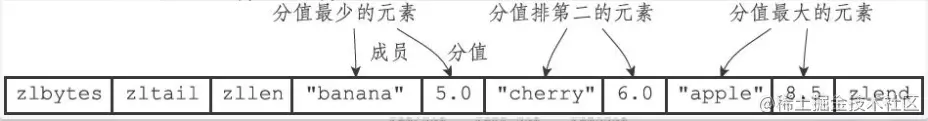

# ***\*万字长文，38 图爆肝 Redis 基础！\****

# ***\*00 前言\****

Redis 在互联网技术存储方面的使用可以说是非常广泛了，只要是接触过 Java 开发的朋友就算你没用过，都会听过它。在面试也是非常高频的一个知识点。

最近，我的的小弟***\*小胖和老王\****就对 Redis 非常感兴趣；我推荐它一本书《Redis设计与实现》。谁知这货说看不下去，非要我来总结一波。所以本文算是给***\*小胖和老王\****的学习资料，也是我自己的学习笔记。希望对你有帮助。

还是老规矩，先上张脑图。全文 13274 字，从下午 2 点爆肝到晚上 9 点，先上张思维导图镇楼：

 

## ***\*0.1 往期精彩\****

[1、小胖问我：select 语句是怎么执行的？](https://link.juejin.cn/?target=https://mp.weixin.qq.com/s/lRY7b9iS_xDDuyKNQKUWSg)

[2、女朋友问我：MySQL 索引的原理是怎样的？](https://link.juejin.cn/?target=https://mp.weixin.qq.com/s/ZDM_ttWCstw0mUwGtUEciw)

[3、小胖问我：MySQL 日志到底有啥用？](https://link.juejin.cn/?target=https://mp.weixin.qq.com/s/yG2pQW7qkTPF4TLBk8qgwQ)

[4、老王问我：MySQL 事务与 MVCC 原理是怎样的？](https://link.juejin.cn/?target=https://mp.weixin.qq.com/s/l62CAZ55ZU9f9fsLOQR71A)

[5、女朋友问我：MySQL 的锁机制是怎样的？](https://link.juejin.cn/?target=https://mp.weixin.qq.com/s/cuD8QiadO64VcSncpY18KQ)

# ***\*01 什么是 Redis？\****

官方是这么描述的：

Redis （用 C 语言实现的）是一个开源的，基于内存的数据结构存储，可用作于数据库、缓存、消息中间件。

信息简洁明了，一下就知道了三个点：***\*基于内存、用作缓存、多种数据结构\****。

的了，那就从这三个方面开始研究呗。

## ***\*1.0 为什么要用 Redis 做缓存？\****

上面说了，用作缓存。有些小伙伴可能会问：有 MySQL 数据库就得了呗？干嘛还要缓存？而且为啥要用 Redis 做？Map 不行嘛？

· 第一、二个问题，都知道 MySQL 数据是存在磁盘的，而 CPU 访问磁盘是非常慢的。如果遇到并发高的时候，所有线程每次都要访问磁盘，估计得挂。

到底有多慢？请看链接：zhuanlan.zhihu.com/p/24726196

Redis 和 Map 做下对比，就知道为啥不合适了。

· Map 是本地缓存，如果在多台机器部署，必须每个机器都要复制一份，否则造成缓存不一致；Redis 是分布式缓存，部署在多台机器，也是用的同一份缓存，保持了一致性，问题不大。

· Map 做缓存，数据量大的话会导致 JVM 内存飙升，进而拖垮程序，并且 JVM 挂了，还会导致数据丢失；Redis 可以用更大容量的内存（看你的配置，即几十G都没问题）做缓存，并且还可以持久化到磁盘。

# ***\*02 Redis 的数据结构\****

你可能第一反应不就 "String（字符串）、List（列表）、Hash（哈希）、Set（集合）和 Sorted Set（有序集合）么？"，太简单了，我都会。

老铁你错了，你说的是 Redis 的数据类型只有 5 种，也就是他的表现形式。而我说的数据结构是底层的，***\*有 6 种，分别是简单动态字符串、双向链表、压缩列表、哈希表、跳表和整数数组\****，它们的对应关系如下：

 

由上图可知 String 类型的底层实现只有一种数据结构，而 List、Hash、Set 和 Sorted Set 这四种数据类型，都有两种底层实现结构都是集合。

看到这里，你可能又有疑问了。这些数据结构都是值的底层实现，键和值本身之间用什么结构组织？

## ***\*2.0 键和值用什么结构组织？\****

实际上，***\*Redis 使用了一个哈希表来保存所有键值对。它的存储是以 key-value 的形式的。 key 一定是字符串，value 可以是 string、list、hash、set、sortset 中的随便一种\****。

***\*一个哈希表，其实就是一个数组，数组的每个元素称为一个哈希桶。每个哈希桶中保存了键值对数据，哈希桶中的元素保存的并不是值本身，而是指向具体值的指针\****。这点从下图可以看出：

 

**哈希桶中的 entry 元素中保存了 *key 和 value 指针，分别指向了实际的键和值，这样一来，即使值是一个集合，也可以通过 value 指针被查找到。

redis 的键值都是 redisObject 对象，即在创建时会生成一个用于键名的 redisObject 对象和一个用于键值的 redisObject 对象。这点从源码也可以看出来：

***\*typedef\**** ***\*struct\**** ***\*redisObject\**** {

  **// 类型**

  ***\*unsigned\**** type:4;

  

  **// 编码**

  ***\*unsigned\**** encoding:4;

  

  **// 指向数据的指针**

  ***\*void\**** *ptr;

 

  **// 记录对象最后一次被程序访问时间，用于计算空转时长(当前时间-lru)**

  ***\*unsigned\**** lru:22; **/\* lru time (relative to server.lruclock) \*/**

  

  **// 引用计数，用于内存回收**

  ***\*int\**** refcount;

} robj;复制代码

也就是说上图 entry 中的健值指针就分别指向这样一个 redisObject。***\*其中 type、 encoding 和 ptr 是最重要的三个属性\****。type 记录了对象所保存的值的类型，它的值可能是以下常量的其中一个。

**/***

 *** 对象类型**

 ***/*****\*#define REDIS_STRING 0\****  ***\**// 字符串\**\******\*#define REDIS_LIST 1\****   ***\**// 列表\**\******\*#define REDIS_SET 2\****   ***\**// 集合\**\******\*#define REDIS_ZSET 3\****   ***\**// 有序集\**\******\*#define REDIS_HASH 4\****   ***\**// 哈希表\**\***复制代码

encoding 记录了 对象所保存的值的编码，它的值可能是以下常量的其中一个.

**/***

 *** 对象编码**

 ***/*****\*#define REDIS_ENCODING_RAW 0\****       ***\**// 编码为字符串\**\******\*#define REDIS_ENCODING_INT 1\****       ***\**// 编码为整数\**\******\*#define REDIS_ENCODING_HT 2\****       ***\**// 编码为哈希表\**\******\*#define REDIS_ENCODING_ZIPMAP 3\****     ***\**// 编码为 zipmap\**\******\*#define REDIS_ENCODING_LINKEDLIST 4\****   ***\**// 编码为双端链表\**\******\*#define REDIS_ENCODING_ZIPLIST 5\****     ***\**// 编码为压缩列表\**\******\*#define REDIS_ENCODING_INTSET 6\****     ***\**// 编码为整数集合\**\******\*#define REDIS_ENCODING_SKIPLIST 7\****    ***\**// 编码为跳跃表\**\***复制代码

比如，我们在 redis 里面 put ("狗哥",666)，在 redisObject 实际上是这样存放的：

 

## ***\*2.1 SDS 简单动态字符串\****

简单动态字符串 (Simple dynamic string,SDS)

跟传统的 C 语言字符串不一样，Redis 使用了 SDS 来构建自己的字符串对象，源码如下：

***\*struct\**** ***\*sdshdr\****{

 

  **// 字节数组，用于保存字符串**

  ***\*char\**** buf[];

 

  **// 记录buf数组中已使用的字节数量，也是字符串的长度**

  ***\*int\**** len;

 

  **// 记录buf数组未使用的字节数量**

  ***\*int\**** free;

}复制代码

图示：

 

buf属性是一个char类型的数组，最后一个字节保存了空字符'\0'，不算入 len 长度。

### ***\*2.1.0 为什么使用 SDS？\****

SDS 比 C 字符串好在哪？

**·** ***\*常数复杂度获取字符串长度\****：C 字符串不记录长度，统计长度只能逐个遍历字符，复杂度是 O(N)；而 SDS 在 len 属性中记录了自身长度，复杂度仅为 O(1)。

**·** ***\*不会发生缓冲区溢出\****：SDS 不会发生溢出的问题，如果修改 SDS 时，空间不足。先会扩展空间，再修改！(***\*内部实现了动态扩展机制\****)。

· SDS 可以***\*减少内存分配的次数 (空间预分配 & 惰性空间释放)\****。在扩展空间时，除了分配修改时所必要的空间，还会分配额外的空闲空间 (free 属性)。

· SDS 是***\*二进制安全的\****，所有 SDS API 都会以处理二进制的方式来处理 SDS 存放在 buf 数组里的数据。

## ***\*2.2 链表\****

链表，大家都很熟悉了吧？在 Java 中 LinkedList 的底层数据结构就是链表 + 数组实现的。那 Redis 中的链表是怎样的呢？

按照惯例，上源码。它使用 listNode 结构（源码位于 adlist.h）表示链表的每个节点：

***\*typedef\**** strcut listNode{

  **//前置节点**

  strcut listNode  *pre;

 

  **//后置节点**

  strcut listNode  *pre;

 

  **//节点的值**

  ***\*void\**** *value;

}listNode复制代码

多个 listNode 可以通过 prev 和 next 指针组成一个双向链表，像这样：

 

节点表示出来了，整个链表又该怎么表示呢？Redis 使用 list 结构（源码位于 adlist.h）来构建链表，上源码：

***\*typedef\**** ***\*struct\**** ***\*list\****{

 

  **//表头结点**

  listNode  *head;

 

  **//表尾节点**

  listNode  *tail;

 

  **//链表长度**

  ***\*unsigned\**** ***\*long\**** len;

 

  **//节点值复制函数**

  ***\*void\**** *(*dup) (viod *ptr);

 

  **//节点值释放函数**

  ***\*void\**** (*free) (viod *ptr);

 

  **//节点值对比函数**

  ***\*int\**** (*match) (***\*void\**** *ptr,***\*void\**** *key);

 

}list复制代码

 

### ***\*2.2.0 Redis 链表的特性\****

· 双端：有 prev 和 next 两个指针；可以前后移动。

· 无环：链表不闭环，prev 和 next 都指向 null，链表访问以 null 为终点。

· 获取带表头指针、表尾指针、节点数量的时间复杂度均为 O (1)。

· 链表使用 void * 指针来保存节点值，可以保存各种不同类型的值。

## ***\*2.3 哈希表\****

哈希表，大家也都不陌生吧？在 Java 中哈希表的底层数据结构就是数组 + 链表实现的。那 Redis 中的哈希表是怎样实现的呢？

按照惯例，上源码。哈希表使用 dictht 结构（源码位于 dict.h）表示哈希表，源码如下：

***\*typedef\**** ***\*struct\**** ***\*dictht\****{

​	**// 哈希表数组**

​	dictEntry **table;  

 

​	**// 哈希表大小，也即 table 大小**

​	***\*unsigned\**** ***\*long\**** size;   

 

​	**// 哈希表大小掩码，用于计算索引值**

​	**// 总是等于size-1**

​	***\*unsigned\**** ***\*long\**** sizemark;   

 

  **// 哈希表已有节点数量**

​	***\*unsigned\**** ***\*long\**** used;

}dictht复制代码

sizemark 和哈希值决定一个键应该被放到 table 数组的那个索引上。PS：就是 Java 中计算哈希值决定位置的方法。

图示一个大小为 4 的空哈希表（不包含任何键值）

 

哈希表节点使用 dictEntry 结构表示，每个 dictEntry 都保存着一个键值对。源码如下：

 ***\*typedef\**** ***\*struct\**** ***\*dictEntry\**** {

​	**// 键**

​	***\*void\**** *key;

 

​	**// 值**

​	***\*union\**** {

​		***\*void\**** *val;

​		uint64_tu64;

​		int64_ts64;

​	}v; 

 

​	**// 指向下个哈希节点，组成链表**

​	***\*struct\**** ***\*dictEntry\**** ****\*next\****;

}dictEntry;复制代码

key 解释得很清楚了；说说 v 属性，它 保存着键值对中的值，可以是一个指针，或者是一个 uint64_t 整数，又或者是一个 int64_t 整数。

***\*next 则是执行下一个哈希表节点的指针，可以将多个哈希值相同的键值对连接在一起作为一个链表，以此来解决键冲突（collision）的问题\****。PS：参考 Java 中 HashMap 是怎么解决冲突的。旧文：[《HashMap 源码解读》](https://juejin.cn/post/6953499916027035684/)有提过。

图示通过 next 指针把相同索引值的键 k1 和 k0 连接在一起。

 

为了更好实现 rehash（扩容）；Redis 又在哈希表之上封装了一层，称之为字典。由 dict 结构表示，源码如下：

***\*typedef\**** ***\*struct\**** ***\*dict\**** {

  **// 类型特定函数**

  dictType *type;

  **// 私有数据**

  ***\*void\**** * privdata; 

  **// 哈希表，代表两个哈希表**

  dictht ht[2];

  **// rehash索引**

  **// 当rehash不在进行时， 值为 - 1** 

  in trehashidx; **/\*rehashing not in pro gress if rehashidx==-1\*/**

}dict;

 

\-------------------------------------------------------

***\*typedef\**** ***\*struct\**** ***\*dictType\****{

  **//计算哈希值的函数**

  ***\*unsigned\**** ***\*int\**** (*hashFunction)(***\*const\**** ***\*void\**** * key);

 

  **// 复制键的函数**

  ***\*void\**** *(*keyDup)(***\*void\**** ****\*private\****, ***\*const\**** ***\*void\**** *key);

 

  **// 复制值的函数**

  ***\*void\**** *(*valDup)(***\*void\**** ****\*private\****, ***\*const\**** ***\*void\**** *obj);  

 

  **// 对比键的函数**

  ***\*int\**** (*keyCompare)(***\*void\**** *privdata , ***\*const\**** ***\*void\**** *key1, ***\*const\**** ***\*void\**** *key2)

 

  **// 销毁键的函数**

  ***\*void\**** (*keyDestructor)(***\*void\**** ****\*private\****, ***\*void\**** *key);

 

  **// 销毁值的函数**

  ***\*void\**** (*valDestructor)(***\*void\**** ****\*private\****, ***\*void\**** *obj);  

}dictType复制代码

type 属性和 privdata 属性是针对不同类型的键值对，为创建多态字典而设置的。

· type 是一个指向 dictType 的指针，每个 dictType 保存了一簇用于操作特定类型键值对的函数，Redis 为用途不同的字典设置不同的类型特定函数

· 而 privdata 则保存了传给类型特定函数的可选参数

**·** ***\*ht 是包含了两个哈希表的数组； ht[0] 存放真实数据，ht[1] 在对 ht[0] 进行 rehash（扩容）时使用\****。

最终，***\*你会发现其实所谓的字典就是两个哈希表组成的\****。图式结构如下：

 

### ***\*2.3.0 哈希冲突\****

当往哈希表写入大量数据时，不可避免的就出现多个 key 计算出来的哈希值相同。也就是多个不同的 key 需要放到同一个哈希桶，这就是所谓的***\*哈希冲突\****。

而 Redis 解决哈希冲突的手段很 Java 一样，都是链式哈希：***\*同一个哈希桶中的多个元素用一个链表来保存，它们之间依次用指针连接\****。

 

如图，假设 entry1、entry2、entry3 的哈希值都是 3 ；那么他们将存放在下标为 3 的哈希桶里面，并转换成链表。

PS：没懂哈希冲突的看旧文。旧文：[《HashMap 源码解读》](https://juejin.cn/post/6953499916027035684/)有详细例子解析。

当不断发生哈希冲突，链表越来越长，影响查询性能时，Redis 就需要 rehash。

### ***\*2.3.1 rehash（扩容）\****

Redis 开始执行 rehash，这个过程分为三步：

· 1、给哈希表 2 分配更大的空间，例如是当前哈希表 1 大小的两倍；

· 2、把哈希表 1 中的数据重新映射并拷贝到哈希表 2 中；

· 3、释放哈希表 1 的空间。

如此，就可以从哈希表 1 切换到哈希表 2，用增大的哈希表 2 保存更多数据，而原来的哈希表 1 留作下一次 rehash 扩容备用。

你肯定以为这样就完美了？但还有坑，***\*当哈希表 1 数据量很大，如果一次性复制就会造成线程阻塞，无法服务其他请求\****。Redis 不允许这种事发生，因此使用了***\*渐进式 rehash\****。

PS：没懂 rehash 的看旧文。旧文：《HashMap 源码解读》有详细例子解析。

### ***\*2.3.2 渐进式 rehash\****

啥是渐进式 rehash ？

在第二步拷贝数据时，Redis 仍然正常处理客户端请求，***\*每处理一个请求，顺带从哈希表 1 中的第一个索引位置开始，把这个位置上所有的 entry 复制到哈希表 2 中，下个请求就复制位置 2\****；直至全部复制完成。

过程如下图所示：

 

具体到代码，它的过程是这样的：

· 1、在字典中维持一个索引计数器变量 rehashidx，并将设置为 0，表示 rehash 开始。

· 2、在 rehash 期间，客户端每次对字典进行 CRUD 操作时，会将 ht [0] 中 rehashidx 索引上的值 rehash 到 ht [1]，操作完成后 rehashidx+1。

· 3、字典操作不断执行，最终在某个时间点，所有的键值对完成 rehash，这时将 rehashidx 设置为 - 1，表示 rehash 完成

说到这，你可能还有以下几点疑问？

***\*只有在操作字典的时候才进行复制数据吗？如果客户端只操作一次字段是不是就完不成 rehash 了？\****

渐进式 rehash 执行时，除了根据针对字典的 CRUD 操作来进行数据迁移，***\*Redis 本身还会有一个定时任务在执行 rehash\****，如果没有针对字典的请求时，这个定时任务会周期性地（例如每 100ms 一次）搬移一些数据到新的哈希表。

***\*渐进式 rehash，CRUD 究竟在哪个哈希表操作呢？\****

在渐进式 rehash 过程中，字典会同时使用两个哈希表 ht [0] 和 ht [1]，所有的 CRUD 操作也会在两个哈希表进行。

比如要查找一个键时，服务器会优先查找 ht [0]，如果不存在，再查找 ht [1]。当执行***\*新增操作\****时，新的键值对一律保存到 ht [1]，不再对 ht [0] 进行任何操作，以保证 ht [0] 的键值对数量只减不增，最后变为空表。

## ***\*2.4 跳跃表\****

跳跃表在 Java 中很少接触到，大家对这个知识点也是挺陌生的。之前在学习数据结构是看到过小灰的一篇文章，写得通俗易懂，大家可以看下，建议看完再往下看。

[mp.weixin.qq.com/s/COBdoHWDh…](https://link.juejin.cn/?target=https://mp.weixin.qq.com/s/COBdoHWDhlw4rmG_fGFhSA)

跳跃表 (shiplist) 是实现 sortset (有序集合) 的底层数据结构之一；除此以外，在集群节点中也有用到它。

Redis 的跳跃表由 zskiplistNode 和 zskiplist 两个结构定义，源码位于 redis.h 文件中。***\*其中前者是跳跃表的结构；后者的作用是保存跳跃表的节点数量与头、尾节点的指针等信息\****。

typeof ***\*struct\**** ***\*zskiplistNode\**** {

  **// 后退指针**

  ***\*struct\**** ***\*zskiplistNode\**** ****\*backward\****;

  **// 分值**

  ***\*double\**** score;

  **// 成员对象**

  robj *obj;

  **// 层**

​	***\*struct\**** ***\*zskiplistLevel\**** {

​    **// 前进指针**

​    ***\*struct\**** ***\*zskiplistNode\**** ****\*forward\****;

​		**// 跨度**

​		***\*unsigned\**** ***\*int\**** span;

​	} level[];

} zskiplistNode;复制代码

如下图所示，展示了不同层高的跳跃表节点

 

typeof ***\*struct\**** ***\*zskiplist\**** {

  **// 表头节点，表尾节点**

  ***\*struct\**** ***\*skiplistNode\**** ****\*header\****,****\*tail\****;

  **// 表中节点数量**

  ***\*unsigned\**** ***\*long\**** length;

  **// 表中最大层数**

  ***\*int\**** level;

} zskiplist;复制代码

下图展示了一个跳跃表示例：

 

图片最左边的是 zskiplist 结构，包含：

· header：指向跳跃表的表头节点。

· tail：指向跳跃表的表尾节点。

· level：记录目前跳跃表内，层数最大的那个节点的层数（表头节点的层数不计算在内）。

· length：记录跳跃表的长度，也即是，跳跃表目前包含节点的数量（表头节点不计算在内）。

zskiplist结构右方的是四个zskiplistNode结构， 包含：

· 层：比如节点中的 L1、L2、L3 等，包括前进指针和跨度

· 前进指针：用于访问位于表尾方向的其他节点

· 跨度：记录了前进指针所指向节点和当前节点的距离

· 后退指针：指向当前节点的前一个节点，从表尾向表头遍历

· 分值：节点按各自分值从小到大排列

· 成员对象：节点所保存的成员对象

***\*PS：跳跃表这块的内容比较多，比较难说清楚实现细节。具体的看上面的链接，以及《Redis 设计与实现》这本书（说得很好，微信读书网页版就有）\****

## ***\*2.5 整数集合\****

整数集合是 Set（集合）的底层数据结构之一。 当 Set 只包含整数值元素，并且这个 Set 的元素数量不多时，Redis 就会使用整数集合作为 Set 的底层实现。

Redis 使用了 intset 用于保存整数值集合，它保证了有序以及不重复。源码如下：

typeof ***\*struct\**** ***\*intset\**** {

  **// 编码方式**

  ***\*unit32_t\**** encoding;

  **// 集合包含的元素数量**

  ***\*unit32_t\**** lenght;

  **// 保存元素的数组**

  ***\*int8_t\**** contents[];

} intset;复制代码

一个保存了 5 个整数的集合如下所示：

 

length 就不说了，主要说下 contents 和 encoding 的关系； contents 的真正类型取决于encoding 的值：

· INTSET_ENC_INT16

· INTSET_ENC_INT32

· INTSET_ENC_INT64

这三个值分别对应 16、32、64 编码对应能存放的数字范围是不一样的。16 最小（-32768~~32767），32 在中间（-2147483648~~2147483647）64 最大（-9223372036854775808~9223372036854775807）。

如下图所示为 INTSET_ENC_INT16 类型集合存放 5 位整数占用的空间：16 * 5

 

### ***\*2.5.0 升级操作\****

如果 contents 本来保存 1、3、5 三个整数值，后面加一个 2147483647456。

那么只有 2147483647456 是真正需要 int64_t 类型来保存的，而其他的 1、3、5 都可以用 int16_t 类型来保存；***\*这时是整体升级，所有元素都会被升级为 int64_t 类型\****。

也就是说本来是 int16_t 类型的集合，要放入大于本身的整数。就需要升级，步骤如下：

· 1、根据新元素类型拓展整数集合底层数组的空间并为新元素分配空间。

· 2、将底层数组现有的所有元素都转换成与新元素相同的类型，并将类型转换后的元素放到正确的位上，需要维持底层数组的有序性质不变。

· 3、将新元素添加到底层数组。

举个栗子：

1、原来是数组是 INTSET_ENC_INT16 类型 3 位，占用 48 位空间；

 

2、插入整数 65535，超出 INTSET_ENC_INT16 范围；升级为 INTSET_ENC_INT32 。需要的空间也从 48 加到 128 位。如下所示：新分配空间 = 128 - 48 = 80

 

3、元素 3 排名第三，移动到 contents 索引 2 位置；其他类似，元素 2 移动到索引 1 位置；元素 1 移动到索引 0 位置

 

4、最后添加新元素 65535 即可完成升级。

注意点：***\*整数集合只支持升级、不支持降级\****。

## ***\*2.6 压缩列表\****

压缩列表是 list 和 hash 的底层实现之一，当 list 只包含少量元素，并且每个元素都是小整数值，或者是比较短的字符串，压缩列表会作为 list 的底层实现。

压缩列表（ziplist）是 Redis 为***\*节约内存\****而开发，它的理念是***\*多大元素用多大内存\****。

如下图，根据每个节点的实际存储的内容决定内存的大小，第一个节点占用 5 字节，第二个节点占用 5 字节，第三个节点占用 1 字节，第四个节点占用 4 字节，第五个节点占用 3 字节。

 

图示为 ziplist 的结构：它类似于一个数组，不同的是它在表头有三个字段 zlbytes、zltail 和 zllen；分别表示列表长度、列表尾的偏移量和元素的个数；表尾有 zlend，列表结束的标识。

 

### ***\*2.6.0 节点构成\****

图示一个压缩列表中一个节点的构成：

 

· previous_entry_length：记录前一个节点的长度

· encoding：编码，控制 content 的类型和长度；分为字节数组编码和整数编码

· content：保存节点值，可以是一个字节数组或整数

### ***\*2.6.1 压缩列表的查找\****

 

如果查找的是第一个元素或最后一个元素，可通过表头三个字段的长度直接定位，复杂度是 O (1)。而查找其他元素时，只能逐个查找，复杂度是 O (N) 。

倒序遍历：首先指针通过 zltail 偏移量指向表尾节点，然后通过指向***\*节点记录的前一个节点的长度依次向前遍历访问整个压缩列表\****。

# ***\*03 数据类型与数据结构\****

还记得文章开头那张数据类型与底层数据结构的对应关系图吗？长这样：

 

Redis 这种对应关系实际上是由 redisObject 的 type（类型）和 encoding （编码）共同决定的，详细对应关系如下：

 

下面来具体介绍下，什么条件下使用那种类型实现对应的对象。比如：String 什么情况下用 int 编码实现？什么情况下用 embstr 编码实现？什么情况下用 raw 编码实现呢？

## ***\*3.0 字符串（String）对象\****

从上图得知，String 有 int、raw、embst 三种编码格式：

· int：整数值，可以用 long 类型表示，使用整数值保存对象

· raw：字符串值且长度 > 32字节，使用 SDS 保存对象

· embstr：字符串值且长度 < 32字节，使用 embstr 编码的 SDS 保存对象

PS：对于浮点数（long double 类型表示的），Redis 会将浮点数转换成字符串值；最终视长度决定用那种编码（embstr 或 raw）保存。取出时，再将其转成浮点值。

 

### ***\*3.0.0 embstr 和 raw 有啥区别？\****

· raw 分配内存和释放内存的次数是***\*两次\****，embstr 是一次

· embstr 编码的数据保存在一块***\*连续的内存\****里面

### ***\*3.0.1 编码的转换\****

· int 类型的字符串，当保存的不再是***\*整数值\****，将转换成 raw 类型

· embstr 类型的字符串是***\*只读的\****，修改时会转换成 raw 类型。原因：Redis 没有为 embstr 提供修改程序，所以它是只读的；要修改只能先转成 raw。

## ***\*3.1 列表（list）对象\****

还是从上图得知，列表的编码可以是 ziplist 或 linkedlist：

· ziplist：所有元素长度都小于 64 字节且元素数量少于 512 个

o 以上两个条件的上限值可以通过配置文件的 list-max-ziplist-value和list-max-ziplist-entries修改

· linkedlist：不满足上述条件时，将从 ziplist 转换成 linkedlist

### ***\*3.1.0 区别\****

执行 RPUSH 命令将创建一个列表对象，比如：

redis> RPUSH numbers 1 "three" 5

(***\*integer\****) 3复制代码

如果 numbers 使用 ziplist 编码，对象结构如下：

 

否则使用 linkedlist，就是双端链表作为底层实现。结构如下：

 

## ***\*3.2 哈希（hash）对象\****

又是从上图得知，哈希的编码可以是 ziplist 或 hashtable：

· ziplist：哈希对象保存的所有键值对的键和值的字符串长度都小于 64 字节且键值对数量小于 512

o 以上两个条件的上限值可以通过配置文件的 hash-max-ziplist-value和hash-max-ziplist-entries修改

· hashtable：不能满足上述条件，将从 ziplist 转成 hashtable

### ***\*3.2.0 区别\****

执行 HSET 命令，可以创建一个 hash 对象并保存数据：

redis> HSET profile name "Tom"

(***\*integer\****) 1

redis> HSET profile age 25

(***\*integer\****) 1

redis> HSET profile career "Programmer"

(***\*integer\****) 1复制代码

ziplist 保存的 hash 对象：

 

 

hashtable 保存的 hash 对象：

· 字典中每个键都是一个字符串对像，对象中保存键值对的键

· 字典中每个值都是一个字符串对像，对象中保存键值对的值

架构如下：

 

## ***\*3.3 集合（set）对象\****

又又是从上图得知，哈希的编码可以是 intset 或 hashtable：

· intset：集合对象保存的所有元素都是整数值且元素数量小于 512 个

o 以上两个条件的上限值可以通过配置文件的 set-max-intset-entries修改

· hashtable：不能满足上述条件，将从 intset 转成 hashtable

### ***\*3.3.0 区别\****

使用 ***\*SADD 命令\****可构建一个 intset 编码的 set 对象并保存数据：

redis> SADD numbers 1 3 5

(***\*integer\****) 3复制代码

intset 编码的集合对象结构如下：

 

使用 ***\*SADD 命令\****可构建一个 hashtable 编码的 set 对象并保存数据：

redis> SADD fruits "apple" "banana" "cherry"

(***\*integer\****) 3复制代码

hashtable 编码的 set 使用字典作为底层实现，每个键都是字符串对象，每个对象包含一个集合元素，***\*字典值全部置为 null\**** 。

hashtable 编码的集合对象结构如下：

 

## ***\*3.4 有序集合（Sorted Set）对象\****

又又又是从上图得知，有序集合的编码可以是 ziplist 或 skiplist：

· ziplist：保存的元素数量小于 128 个且所有元素长度都小于 64 字节

o 以上两个条件的上限值可以通过配置文件的 zset-max-ziplist-entries和zset-max-ziplist-value修改

· skiplist：不能同时满足上述条件，将从 ziplist 转成 skiplist

### ***\*3.4.0 区别\****

使用 ***\*ZADD\**** 命令可以构建一个 Sorted Set 对象并保存数据：

redis> ZADD price 8.5 apple 5.0 banana 6.0 cherry

(***\*integer\****) 3复制代码

 

ziplist 编码实现的 Sorted Set 对象，每个集合元素使用两个相邻的节点保存，第一个节点是***\*元素成员\****，第二个节点是***\*元素分值\****。按分值***\*从小到大\****进行排序，结构如下：

 

skiplist 编码实现的 Sorted Set 使用 ***\*zset\**** 作为底层实现，它包含***\*跳跃表\****和***\*字典\****，源码如下：

***\*typedef\**** ***\*struct\**** ***\*zset\**** {

  zskpilist *zsl;

  dict *dict;

}zset;复制代码

大体结构如下：

 

· 

跳跃表 zsl 按分值从小到大保存所有集合元素；每个节点保存一个集合元素；object 属性保存元素成员、score 属性保存元素分值。目的：***\*实现快速的范围查询操作\****。

· 

· 

字典 dict 创建一个从成员到分值的 key-value；字典中每个键值对都保存一个集合元素；键保存元素成员、值保存元素分值。目的：***\*用 O(1) 复杂度 get 元素分值\****。

· 

最后，详细的结构如下所示：

 

听到这里有人可能有疑问：zset 结构同时使用***\*跳跃表和字典\****来保存有序集合元素，不会重复吗？

不会，因为二者会通过***\*指针\****来共享同一个元素，并不会产生重复。

为什么 skiplist 编码实现的有序集合要同时用跳跃表和字典实现？***\*随便用一个行吗\****？

答案是：不好。我们来看看两种情况：

· 

只用 dict ，可以保留以 O(1) 复杂度 get 成员分值；但***\*字典是无序的\****，所以***\*每次进行范围操作都要对所有元素排序\****；显然这是性能更低的。

· 

· 

只用跳跃表，快速范围操作得以保留；但是没了字典，get 成员分值的复杂度将提高至 O(logN)，这也影响性能。

· 

所以，Redis 为了把两者有点结合起来，采用了通过***\*指针共享\****的方式，使用两种数据结构实现。

# ***\*04 一些注意的点\****

## ***\*4.0 Redis 如何执行命令\****

Redis 执行命令前，会先检查***\*值对象类型\****，判断***\*键是否能执行该命令\****；再检查***\*值对象的编码方式\****选择合适的命令执行。

举个例子：列表对象有 ziplist 和 linkedlist 两种编码格式可用；前者通过 ziplist 的 API 执行命令、后者通过 linkedlist 的 API 执行命令。

如果我们执行 LLEN 命令，Redis ***\*第一步判断执行的命令是不是针对列表的\****？是的话，第二步判断***\*值的编码格式\****，如果是 ziplist，使用 ***\*ziplistLen 函数\****操作；如果是 linkedlist 则使用 ***\*listLength 函数\****操作。

## ***\*4.1 Redis 内存回收机制与共享对象\****

Redis 为每个对象构建一个***\*引用计数\****属性，通过它可实现***\*内存回收机制\****（当一个对象的引用计数为 0 时，将会释放所占用内存）。

Redis 会共享值为 ***\*0 到 9999 的字符串对象\****（这个值可能通过修改 redis.h 文件的 REDIS_SHARDED_INTEGER 常量修改）

Redis 只共享字符串对象本身，***\*为什么不共享包含字符串的对象\****？

能共享的前提是***\*目标对象和共享对象完全相同\****。要共享就需要验证两者是否相同？因为***\*包含字符串的对象复杂度更高，验证消耗的 CPU 时间也更多\****，而性能将会下降。

## ***\*4.2 lru 属性的作用\****

redisObject 的 lru 属性***\*记录对象最后一次被访问的时间\****，这个时间可以用于计算对象的空转时间（***\*公式：当前时间 - lru 时间\****）。

# ***\*05 巨人的肩膀\****

· 《Redis 设计与实现》

· redis 源码：github.com/antirez/redis

· redis 源码中文注释版：github.com/huangz1990/redis-3.0-annotated

· cnblogs.com/Java3y/p/9870829.html

· time.geekbang.org/column/article/268253

· [www.fidding.me/article/108](https://link.juejin.cn/?target=http://www.fidding.me/article/108)

· segmentfault.com/a/1190000019980165

· cnblogs.com/chenchen0618/p/13260202.html

# ***\*06 总结\****

本文从常用的缓存技术讲起，深入 Redis 的数据类型与底层数据结构。第一小节从 Redis 和缓存聊起；第二节站在源码角度跟你分析 Redis 的 6 种数据结构：SDS、链表、哈希表、跳跃表、整数集合以及压缩列表的特性；第三节着重和你分享 5 种数据类型和 6 中底层结构的对应关系；第四节则是画龙点睛地和你分享了 Redis 是怎么执行命令的？怎么释放内存等问题。

 