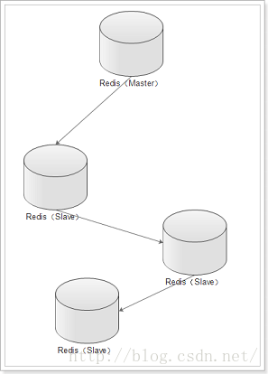
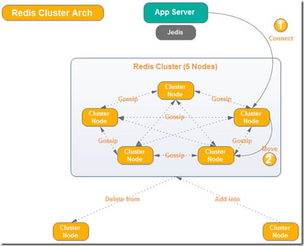
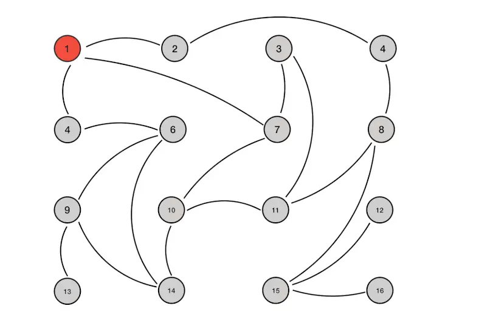
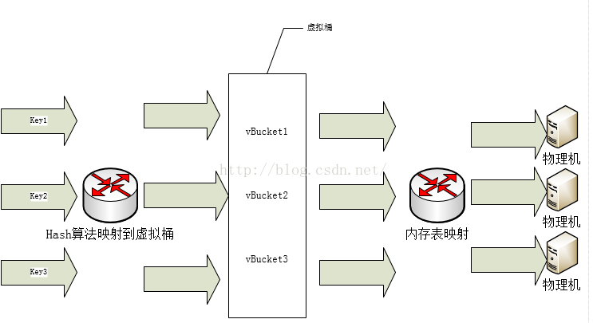

相关阅读：

- [史上最全Redis高可用技术解决方案大全](https://mp.weixin.qq.com/s?__biz=Mzg2OTA0Njk0OA==&mid=2247484850&idx=1&sn=3238360bfa8105cf758dcf7354af2814&chksm=cea24a79f9d5c36fb2399aafa91d7fb2699b5006d8d037fe8aaf2e5577ff20ae322868b04a87&token=1082669959&lang=zh_CN&scene=21#wechat_redirect)
- [Raft协议实战之Redis Sentinel的选举Leader源码解析](http://weizijun.cn/2015/04/30/Raft%E5%8D%8F%E8%AE%AE%E5%AE%9E%E6%88%98%E4%B9%8BRedis%20Sentinel%E7%9A%84%E9%80%89%E4%B8%BELeader%E6%BA%90%E7%A0%81%E8%A7%A3%E6%9E%90/)

目录：

<!-- TOC -->

- [Redis 集群以及应用](#redis-集群以及应用)
    - [集群](#集群)
        - [主从复制](#主从复制)
            - [主从链(拓扑结构)](#主从链拓扑结构)
            - [复制模式](#复制模式)
            - [问题点](#问题点)
        - [哨兵机制](#哨兵机制)
            - [拓扑图](#拓扑图)
            - [节点下线](#节点下线)
            - [Leader选举](#Leader选举)
            - [故障转移](#故障转移)
            - [读写分离](#读写分离)
            - [定时任务](#定时任务)
        - [分布式集群(Cluster)](#分布式集群cluster)
            - [拓扑图](#拓扑图)
            - [通讯](#通讯)
                - [集中式](#集中式)
                - [Gossip](#gossip)
            - [寻址分片](#寻址分片)
                - [hash取模](#hash取模)
                - [一致性hash](#一致性hash)
                - [hash槽](#hash槽)
    - [使用场景](#使用场景)
        - [热点数据](#热点数据)
        - [会话维持 Session](#会话维持-session)
        - [分布式锁 SETNX](#分布式锁-setnx)
        - [表缓存](#表缓存)
        - [消息队列 list](#消息队列-list)
        - [计数器 string](#计数器-string)
    - [缓存设计](#缓存设计)
        - [更新策略](#更新策略)
        - [更新一致性](#更新一致性)
        - [缓存粒度](#缓存粒度)
        - [缓存穿透](#缓存穿透)
            - [解决方案](#解决方案)
        - [缓存雪崩](#缓存雪崩)
            - [出现后应对](#出现后应对)
            - [请求过程](#请求过程)

<!-- /MarkdownTOC -->

# Redis 集群以及应用

## 集群

### 主从复制

#### 主从链(拓扑结构)

#### 复制模式
- 全量复制：Master 全部同步到 Slave
- 部分复制：Slave 数据丢失进行备份

#### 问题点
- 同步故障
    - 复制数据延迟(不一致)
    - 读取过期数据(Slave 不能删除数据)
    - 从节点故障
    - 主节点故障
- 配置不一致
    - maxmemory 不一致:丢失数据
    - 优化参数不一致:内存不一致.
- 避免全量复制
    - 选择小主节点(分片)、低峰期间操作.
    - 如果节点运行 id 不匹配(如主节点重启、运行 id 发生变化)，此时要执行全量复制，应该配合哨兵和集群解决.
    - 主从复制挤压缓冲区不足产生的问题(网络中断，部分复制无法满足)，可增大复制缓冲区( rel_backlog_size 参数).
- 复制风暴

### 哨兵机制

#### 拓扑图

#### 节点下线

- 主观下线
    - 即 Sentinel 节点对 Redis 节点失败的偏见，超出超时时间认为 Master 已经宕机。
    - Sentinel 集群的每一个 Sentinel 节点会定时对 Redis 集群的所有节点发心跳包检测节点是否正常。如果一个节点在 `down-after-milliseconds` 时间内没有回复 Sentinel 节点的心跳包，则该 Redis 节点被该 Sentinel 节点主观下线。
- 客观下线
    - 所有 Sentinel 节点对 Redis 节点失败要达成共识，即超过 quorum 个统一。
    - 当节点被一个 Sentinel 节点记为主观下线时，并不意味着该节点肯定故障了，还需要 Sentinel 集群的其他 Sentinel 节点共同判断为主观下线才行。
    - 该 Sentinel 节点会询问其它 Sentinel 节点，如果 Sentinel 集群中超过 quorum 数量的 Sentinel 节点认为该 Redis 节点主观下线，则该 Redis 客观下线。

#### Leader选举

- 选举出一个 Sentinel 作为 Leader：集群中至少有三个 Sentinel 节点，但只有其中一个节点可完成故障转移.通过以下命令可以进行失败判定或领导者选举。
- 选举流程
    1. 每个主观下线的 Sentinel 节点向其他 Sentinel 节点发送命令，要求设置它为领导者.
    2. 收到命令的 Sentinel 节点如果没有同意通过其他 Sentinel 节点发送的命令，则同意该请求，否则拒绝。
    3. 如果该 Sentinel 节点发现自己的票数已经超过 Sentinel 集合半数且超过 quorum，则它成为领导者。
    4. 如果此过程有多个 Sentinel 节点成为领导者，则等待一段时间再重新进行选举。

#### 故障转移

- 转移流程
    1. Sentinel 选出一个合适的 Slave 作为新的 Master(slaveof no one 命令)。
    2. 向其余 Slave 发出通知，让它们成为新 Master 的 Slave( parallel-syncs 参数)。
    3. 等待旧 Master 复活，并使之成为新 Master 的 Slave。
    4. 向客户端通知 Master 变化。
- 从 Slave 中选择新 Master 节点的规则(slave 升级成 master 之后)
    1. 选择 slave-priority 最高的节点。
    2. 选择复制偏移量最大的节点(同步数据最多)。
    3. 选择 runId 最小的节点。

>Sentinel 集群运行过程中故障转移完成，所有 Sentinel 又会恢复平等。Leader 仅仅是故障转移操作出现的角色。

#### 读写分离

#### 定时任务

- 每 1s 每个 Sentinel 对其他 Sentinel 和 Redis 执行 ping，进行心跳检测。
- 每 2s 每个 Sentinel 通过 Master 的 Channel 交换信息(pub - sub)。
- 每 10s 每个 Sentinel 对 Master 和 Slave 执行 info，目的是发现 Slave 节点、确定主从关系。

### 分布式集群(Cluster)

#### 拓扑图

#### 通讯

##### 集中式

> 将集群元数据(节点信息、故障等等)集中存储在某个节点上。
- 优势
    1. 元数据的更新读取具有很强的时效性，元数据修改立即更新
- 劣势
    1. 数据集中存储

##### Gossip

- [Gossip 协议](https://www.jianshu.com/p/8279d6fd65bb)

#### 寻址分片

##### hash取模

- hash(key)%机器数量
- 问题
    1. 机器宕机，造成数据丢失，数据读取失败
    1. 伸缩性

##### 一致性hash

- 

- 问题
    1. 一致性哈希算法在节点太少时，容易因为节点分布不均匀而造成缓存热点的问题。
        - 解决方案
            - 可以通过引入虚拟节点机制解决：即对每一个节点计算多个 hash，每个计算结果位置都放置一个虚拟节点。这样就实现了数据的均匀分布，负载均衡。

##### hash槽

- CRC16(key)%16384
- 

## 使用场景

### 热点数据

存取数据优先从 Redis 操作，如果不存在再从文件（例如 MySQL）中操作，从文件操作完后将数据存储到 Redis 中并返回。同时有个定时任务后台定时扫描 Redis 的 key，根据业务规则进行淘汰，防止某些只访问一两次的数据一直存在 Redis 中。
>例如使用 Zset 数据结构，存储 Key 的访问次数/最后访问时间作为 Score，最后做排序，来淘汰那些最少访问的 Key。  

如果企业级应用，可以参考：[阿里云的 Redis 混合存储版][1]

### 会话维持 Session

会话维持 Session 场景，即使用 Redis 作为分布式场景下的登录中心存储应用。每次不同的服务在登录的时候，都会去统一的 Redis 去验证 Session 是否正确。但是在微服务场景，一般会考虑 Redis + JWT 做 Oauth2 模块。
>其中 Redis 存储 JWT 的相关信息主要是留出口子，方便以后做统一的防刷接口，或者做登录设备限制等。

### 分布式锁 SETNX

命令格式：`SETNX key value`：当且仅当 key 不存在，将 key 的值设为 value。若给定的 key 已经存在，则 SETNX 不做任何动作。

1. 超时时间设置：获取锁的同时，启动守护线程，使用 expire 进行定时更新超时时间。如果该业务机器宕机，守护线程也挂掉，这样也会自动过期。如果该业务不是宕机，而是真的需要这么久的操作时间，那么增加超时时间在业务上也是可以接受的，但是肯定有个最大的阈值。
2. 但是为了增加高可用，需要使用多台 Redis，就增加了复杂性，就可以参考 Redlock：[Redlock分布式锁](Redlock分布式锁.md#怎么在单节点上实现分布式锁)

### 表缓存

Redis 缓存表的场景有黑名单、禁言表等。访问频率较高，即读高。根据业务需求，可以使用后台定时任务定时刷新 Redis 的缓存表数据。

### 消息队列 list

主要使用了 List 数据结构。  
List 支持在头部和尾部操作，因此可以实现简单的消息队列。
1. 发消息：在 List 尾部塞入数据。
2. 消费消息：在 List 头部拿出数据。

同时可以使用多个 List，来实现多个队列，根据不同的业务消息，塞入不同的 List，来增加吞吐量。

### 计数器 string

主要使用了 INCR、DECR、INCRBY、DECRBY 方法。

INCR key：给 key 的 value 值增加一 
DECR key：给 key 的 value 值减去一

## 缓存设计

### 更新策略

- LRU、LFU、FIFO 算法自动清除：一致性最差，维护成本低。
- 超时自动清除(key expire)：一致性较差，维护成本低。
- 主动更新：代码层面控制生命周期，一致性最好，维护成本高。

在 Redis 根据在 redis.conf 的参数 `maxmemory` 来做更新淘汰策略：
1. noeviction: 不删除策略, 达到最大内存限制时, 如果需要更多内存, 直接返回错误信息。大多数写命令都会导致占用更多的内存(有极少数会例外, 如 DEL 命令)。
2. allkeys-lru: 所有 key 通用; 优先删除最近最少使用(less recently used ,LRU) 的 key。
3. volatile-lru: 只限于设置了 expire 的部分; 优先删除最近最少使用(less recently used ,LRU) 的 key。
4. allkeys-random: 所有key通用; 随机删除一部分 key。
5. volatile-random: 只限于设置了 expire 的部分; 随机删除一部分 key。
6. volatile-ttl: 只限于设置了 expire 的部分; 优先删除剩余时间(time to live,TTL) 短的key。

### 更新一致性

- 读请求：先读缓存，缓存没有的话，就读数据库，然后取出数据后放入缓存，同时返回响应。
- 写请求：先删除缓存，然后再更新数据库(避免大量地写、却又不经常读的数据导致缓存频繁更新)。

### 缓存粒度

- 通用性：全量属性更好。
- 占用空间：部分属性更好。
- 代码维护成本。

### 缓存穿透

> 当大量的请求无命中缓存、直接请求到后端数据库(业务代码的 bug、或恶意攻击)，同时后端数据库也没有查询到相应的记录、无法添加缓存。  
> 这种状态会一直维持，流量一直打到存储层上，无法利用缓存、还会给存储层带来巨大压力。

#### 解决方案

1. 请求无法命中缓存、同时数据库记录为空时在缓存添加该 key 的空对象(设置过期时间)，缺点是可能会在缓存中添加大量的空值键(比如遭到恶意攻击或爬虫)，而且缓存层和存储层数据短期内不一致；
2. 使用布隆过滤器在缓存层前拦截非法请求、自动为空值添加黑名单(同时可能要为误判的记录添加白名单).但需要考虑布隆过滤器的维护(离线生成/ 实时生成)。

### 缓存雪崩

> 缓存崩溃时请求会直接落到数据库上，很可能由于无法承受大量的并发请求而崩溃，此时如果只重启数据库，或因为缓存重启后没有数据，新的流量进来很快又会把数据库击倒。

#### 出现后应对

- 事前：Redis 高可用，主从 + 哨兵，Redis Cluster，避免全盘崩溃。
- 事中：本地 ehcache 缓存 + hystrix 限流 & 降级，避免数据库承受太多压力。
- 事后：Redis 持久化，一旦重启，自动从磁盘上加载数据，快速恢复缓存数据。

#### 请求过程

1. 用户请求先访问本地缓存，无命中后再访问 Redis，如果本地缓存和 Redis 都没有再查数据库，并把数据添加到本地缓存和 Redis；
2. 由于设置了限流，一段时间范围内超出的请求走降级处理(返回默认值，或给出友情提示)。

