# 《面试八股文》之 Redis 16卷

· 

1.什么是 redis？它能做什么？

· 

· 

2.redis 有哪八种数据类型？有哪些应用场景？

· 

· 

3.redis为什么这么快？

· 

· 

4.听说 redis 6.0之后又使用了多线程，不会有线程安全的问题吗？

· 

· 

5.redis 的持久化机制有哪些？优缺点说说

· 

· 

\6. Redis的过期键的删除策略有哪些？

· 

· 

\7. Redis的内存满了怎么办？

· 

· 

8.Redis 的热 key 问题怎么解决？

· 

· 

9.缓存击穿、缓存穿透、缓存雪崩是什么？怎么解决呢？

· 

· 

10.Redis 有哪些部署方式？

· 

· 

11.哨兵有哪些作用？

· 

· 

12.哨兵选举过程是怎么样的？

· 

· 

13.cluster集群模式是怎么存放数据的？

· 

· 

14.cluster的故障恢复是怎么做的？

· 

· 

15.主从同步原理是怎样的？

· 

· 

16.无硬盘复制是什么？

· 

## ***\*1.什么是 redis？它能做什么？\****

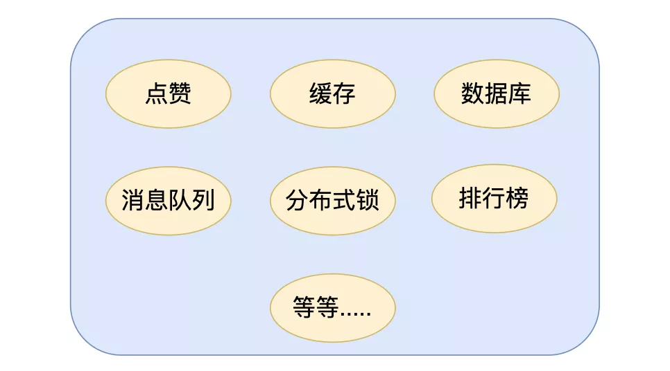 

redis: redis 即 Remote Dictionary Server，用中文翻译过来可以理解为**远程数据服务**或远程字典服务。其是使用 C 语言的编写的key-value**存储系统**

应用场景:缓存，数据库，消息队列，分布式锁，点赞列表，排行榜等等

## ***\*2.redis 有哪八种数据类型？有哪些应用场景？\****

redis 总共有**八种数据结构，五种基本数据类型和三种特殊数据类型**。

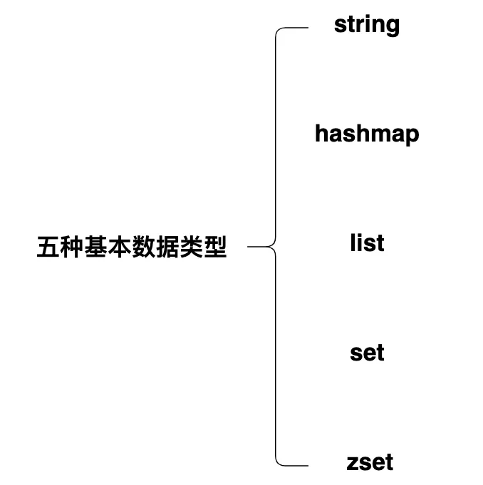五种基本数据类型:

· **1.string**:字符串类型，常被用来存储计数器，粉丝数等，简单的分布式锁也会用到该类型

· **2.hashmap**:key - value 形式的，value 是一个map

· **3.list**:基本的数据类型，列表。在 Redis 中可以把 list 用作栈、队列、阻塞队列。

· **4.set**:集合，不能有重复元素，可以做点赞，收藏等

· **5.zset**:有序集合，不能有重复元素，有序集合中的每个元素都需要指定一个分数，根据分数对元素进行升序排序。可以做排行榜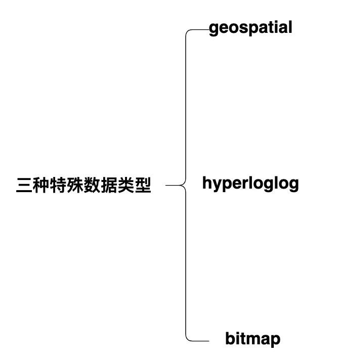三种特殊数据类型:

· **1.geospatial**: Redis 在 3.2 推出 Geo 类型，该功能**可以推算出地理位置信息，两地之间的距离**。

· **2.hyperloglog**:基数：数学上集合的元素个数，是不能重复的。这个数据结构**常用于统计网站的 UV**。

· **3.bitmap**: bitmap 就是通过最小的单位 bit 来进行0或者1的设置，表示某个元素对应的值或者状态。一个 bit 的值，或者是0，或者是1；也就是说一个 bit 能存储的最多信息是2。bitmap **常用于统计用户信息比如活跃粉丝和不活跃粉丝、登录和未登录、是否打卡等**。

## ***\*3.redis为什么这么快？\****

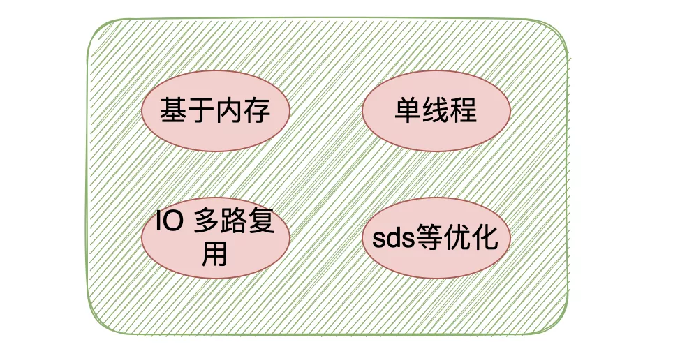 

官方数据 redis 可以做到每秒近10w的并发，这么快的原因主要总结为以下几点：

· 1:完全基于内存操作

· 2:使用单线程模型来处理客户端的请求，避免了上下文的切换

· 3:IO 多路复用机制

· 4:自身使用 C 语言编写，有很多优化机制，比如动态字符串 sds

## ***\*4.听说 redis 6.0之后又使用了多线程，不会有线程安全的问题吗？\****

**不会**

其实 redis **还是使用单线程模型来处理客户端的请求**，只是使用多线程来处理数据的读写和协议解析，执行命令还是使用单线程，所以是不会有线程安全的问题。

之所以加入了多线程因为 redis 的性能瓶颈在于网络IO而非CPU，使用多线程能提升IO读写的效率，从而整体提高redis的性能。

## ***\*5.redis 的持久化机制有哪些？优缺点说说\****

redis 有**两种**持久化的方式，AOF 和 RDB.

 

**AOF**:

· redis 每次执行一个命令时,都会把这个「命令原本的语句记录到一个.aod的文件当中,然后通过fsync策略,将命令执行后的数据持久化到磁盘中」(不包括读命令)，

AOF的优缺点

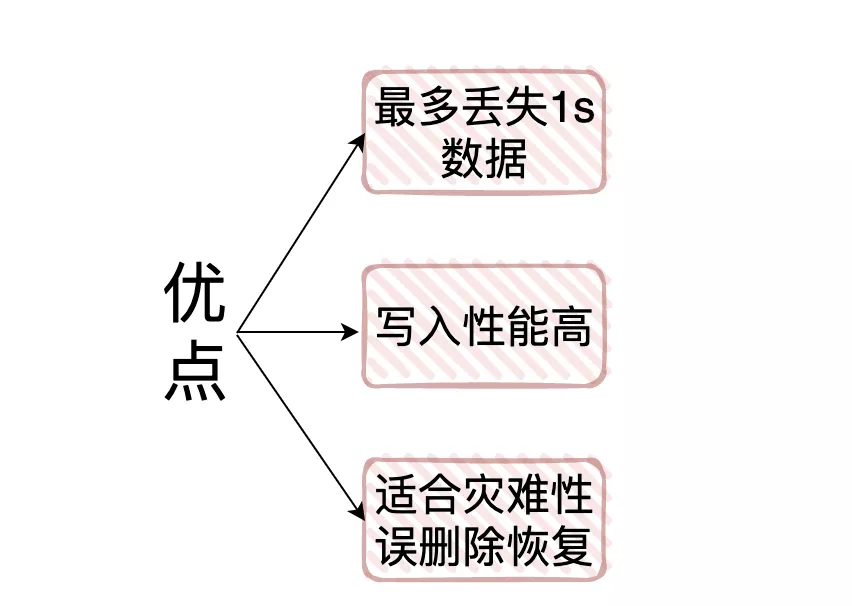 

· **AOF 的「优点」**:

§ 1.AOF可以「更好的保护数据不丢失」，一般AOF会以每隔1秒，通过后台的一个线程去执行一次fsync操作，如果redis进程挂掉，**最多丢失1秒的数据**

§ 2.AOF是将命令直接追加在文件末尾的,**「写入性能非常高」**

§ 3.AOF日志文件的命令通过非常可读的方式进行记录，这个非常「**适合做灾难性的误删除紧急恢复」**，如果某人不小心用 flushall 命令清空了所有数据，只要这个时候还没有执行 rewrite，那么就可以将日志文件中的 flushall 删除，进行恢复

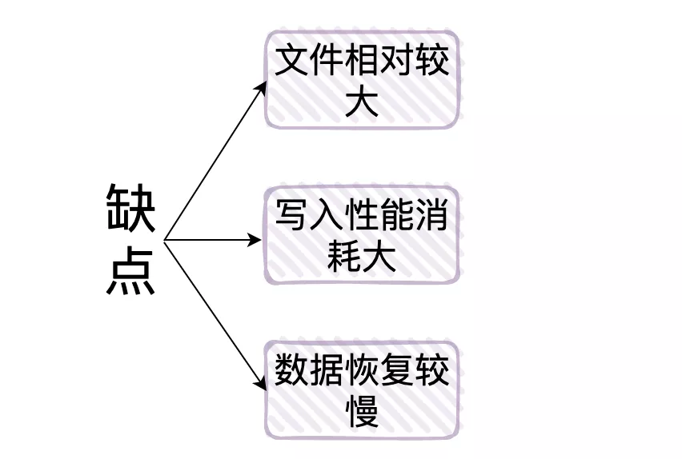 

· **AOF 的「缺点」**:

§ 1.对于同一份数据源来说,一般情况下**AOF 文件比 RDB 数据快照要大**

§ 2.由于 .aof 的**每次命令都会写入**,那么相对于 RDB 来说「需要消耗的性能也就更多」，当然也会有 **aof 重写**将 aof 文件优化。

§ 3.**「数据恢复比较慢」**，不适合做冷备。

------

**RDB**:

· 把**某个时间点 redis 内存**中的数据以二进制的形式存储的一个.rdb为后缀的文件当中,也就是「**周期性的备份redis中的整个数据**」,这是redis**默认**的持久化方式,也就是我们说的快照(snapshot)，是采用 fork 子进程的方式来写时同步的。

**RDB的优缺点**

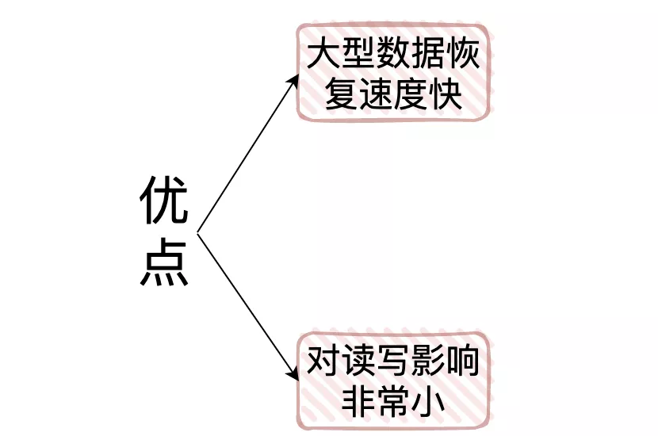 

· RDB的优点:

§ 

1.它是将某一时间点redis内的所有数据保存下来,所以当我们做「大型的数据恢复时,RDB的恢复速度会很快」

§ 

§ 

2.由于RDB的FROK子进程这种机制,队友给客户端提供读写服务的影响会非常小

§ 

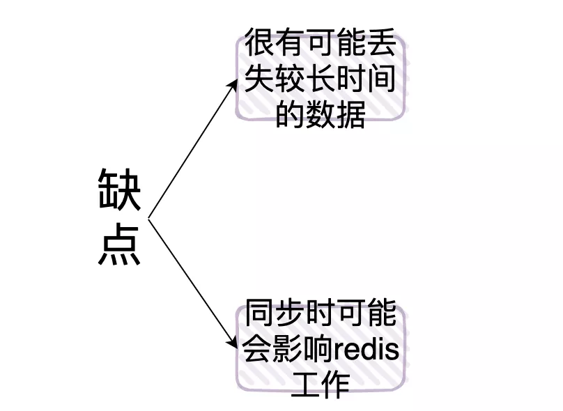 

· RDB的缺点:

§ 举个例子假设我们定时5分钟备份一次,在10:00的时候 redis 备份了数据,但是如果在10:04的时候服务挂了,那么我们就会丢失在10:00到10:04的整个数据

§ 1:「有可能会产生长时间的数据丢失」

§ 2:可能会有长时间停顿:我们前面讲了,fork 子进程这个过程是和 redis 的数据量有很大关系的,**如果「数据量很大,那么很有可能会使redis暂停几秒」**

## ***\*6. Redis的过期键的删除策略有哪些？\****

过期策略通常有以下三种：

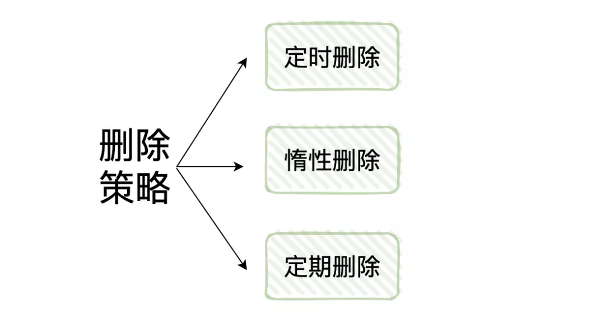 

· **定时过期**：**每个设置过期时间的key都需要创建一个定时器，到过期时间就会立即清除**。该策略可以立即清除过期的数据，对内存很友好；但是会占用大量的CPU资源去处理过期的数据，从而影响缓存的响应时间和吞吐量。

· **惰性过期**：只有当**访问一个key时，才会判断该key是否已过期**，过期则清除。该策略可以最大化地节省CPU资源，却对内存非常不友好。极端情况可能出现大量的过期key没有再次被访问，从而不会被清除，占用大量内存。

· **定期过期**：**每隔一定的时间，会扫描一定数量的数据库的expires字典中一定数量的key，并清除其中已过期的key**。该策略是前两者的一个折中方案。通过调整定时扫描的时间间隔和每次扫描的限定耗时，可以在不同情况下使得CPU和内存资源达到最优的平衡效果。

## ***\*7. Redis的内存满了怎么办？\****

实际上Redis**定义了「8种内存淘汰策略」用**来处理redis内存满的情况：

· 1.noeviction：直接返回错误，不淘汰任何已经存在的redis键

· 2.allkeys-lru：所有的键使用lru算法进行淘汰

· 3.volatile-lru：有过期时间的使用lru算法进行淘汰

· 4.allkeys-random：随机删除redis键

· 5.volatile-random：随机删除有过期时间的redis键

· 6.volatile-ttl：删除快过期的redis键

· 7.volatile-lfu：根据lfu算法从有过期时间的键删除

· 8.allkeys-lfu：根据lfu算法从所有键删除

## ***\*8.Redis 的热 key 问题怎么解决？\****

热 key  就是说，在某一时刻，有非常多的请求访问某个 key，流量过大，导致该 redi 服务器宕机

 

解决方案:

· 可以将结果缓存到本地内存中

· 将热 key 分散到不同的服务器中

· 设置永不过期

## ***\*9.缓存击穿、缓存穿透、缓存雪崩是什么？怎么解决呢？\****

缓存穿透:

· 缓存穿透是指用户请求的数据**在缓存中不存在并且在数据库中也不存在**，导致用户每次请求该数据都要去数据库中查询一遍，然后返回空。

 

解决方案:

· 布隆过滤器

· 返回空对象

缓存击穿：

· 缓存击穿，是指一个 key 非常热点，在不停的扛着大并发，大并发集中对这一个点进行访问，当这个 key 在**失效的瞬间，持续的大并发就穿破缓存**，直接请求数据库，就像在一个屏障上凿开了一个洞。

 

解决方案:

· 互斥锁

· 永不过期

缓存雪崩：

· 缓存雪崩是指缓存中**不同的数据大批量到过期时间**，而查询数据量巨大，请求直接落到数据库上导致宕机。

 

解决方案:

· 均匀过期

· 加互斥锁

· 缓存永不过期

· 双层缓存策略

## ***\*10.Redis 有哪些部署方式？\****

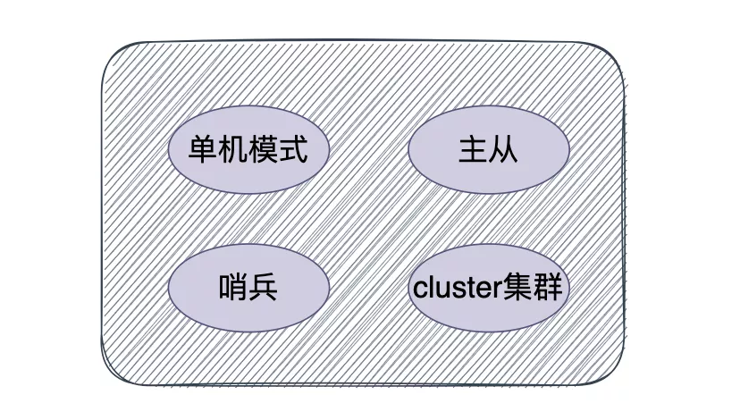 

· 

单机模式:这也是最基本的部署方式,只需要一台机器,负责读写,一般只用于开发人员自己测试

· 

· 

哨兵模式:哨兵模式是一种特殊的模式，首先Redis提供了哨兵的命令，哨兵是一个独立的进程，作为进程，它会独立运行。其原理是哨兵通过发送命令，等待Redis服务器响应，从而监控运行的多个Redis实例。它具备**自动故障转移、集群监控、消息通知**等功能。

· 

· 

cluster集群模式:在redis3.0版本中支持了cluster集群部署的方式，这种集群部署的方式能**自动将数据进行分片**，每个master上放一部分数据，提供了内置的高可用服务，即使某个master挂了，服务还可以正常地提供。

· 

· 

主从复制:在主从复制这种集群部署模式中，我们会将数据库分为两类，第一种称为主数据库(master)，另一种称为从数据库(slave)。主数据库会负责我们整个系统中的读写操作，从数据库会负责我们整个数据库中的读操作。其中在职场开发中的真实情况是，我们会让主数据库只负责写操作，让从数据库只负责读操作，就是为了**读写分离**，减轻服务器的压力。

· 

## ***\*11.哨兵有哪些作用？\****

· 

1.监控整个主数据库和从数据库，观察它们是否正常运行

· 

· 

2.当主数据库发生异常时，自动的将从数据库升级为主数据库，继续保证整个服务的稳定

· 

## ***\*12.哨兵选举过程是怎么样的？\****

· 

1.第一个发现该master挂了的哨兵，向每个哨兵发送命令，让对方选举自己成为领头哨兵

· 

· 

2.其他哨兵如果没有选举过他人，就会将这一票投给第一个发现该master挂了的哨兵

· 

· 

3.第一个发现该master挂了的哨兵如果发现由超过一半哨兵投给自己，并且其数量也超过了设定的quoram参数，那么该哨兵就成了领头哨兵

· 

· 

4.如果多个哨兵同时参与这个选举，那么就会重复该过程，知道选出一个领头哨兵

· 

选出领头哨兵后，就开始了故障修复，会从选出一个从数据库作为新的master

## ***\*13.cluster集群模式是怎么存放数据的？\****

一个cluster集群中总共有16384个节点，集群会**将这16384个节点平均分配给每个节点**，当然，我这里的节点指的是每个主节点，就如同下图：

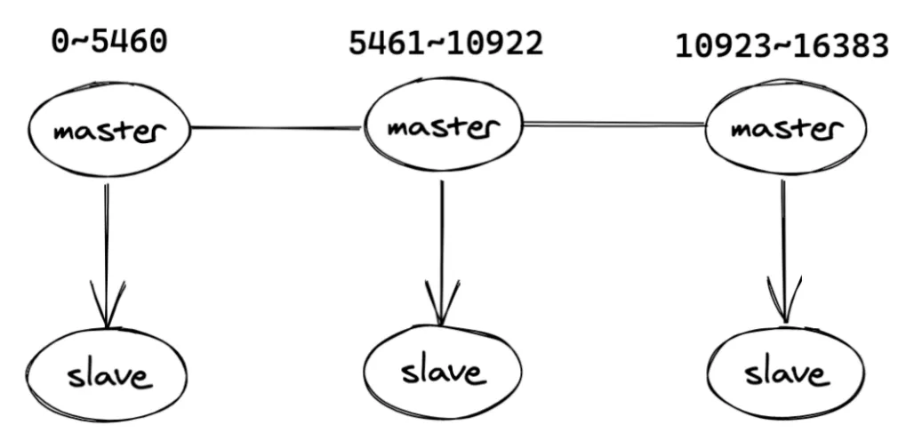 

## ***\*14.cluster的故障恢复是怎么做的？\****

判断故障的逻辑其实与哨兵模式有点类似，在集群中，每个节点都会**定期的向其他节点发送ping命令**，通过有没有收到回复来判断其他节点是否已经下线。

如果**长时间没有回复，那么发起ping命令的节点就会认为目标节点疑似下线**，也可以和哨兵一样称作主观下线，当然也需要集群中一定数量的节点都认为该节点下线才可以，我们来说说具体过程：

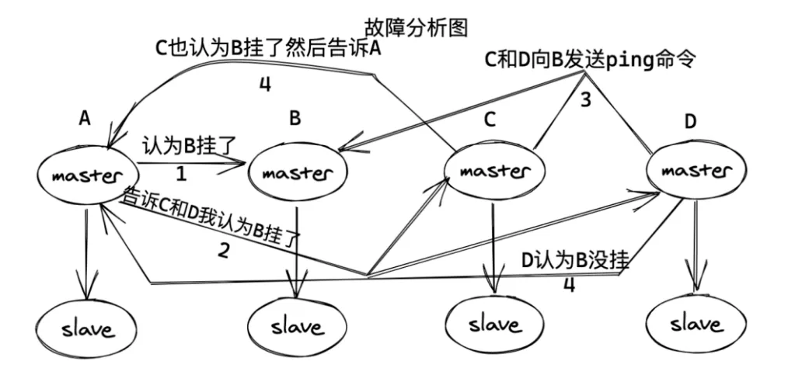 

· 1.当A节点发现目标节点疑似下线，就会向集群中的其他节点散播消息，其他节点就会向目标节点发送命令，判断目标节点是否下线

· 2.如果集群中半数以上的节点都认为目标节点下线，就会对目标节点标记为下线，从而告诉其他节点，让目标节点在整个集群中都下线

## ***\*15.主从同步原理是怎样的？\****

· 

1.当一个从数据库启动时，它会向**主数据库发送一个SYNC命令**，master收到后，在后台保存快照，也就是我们说的RDB持久化，当然保存快照是需要消耗时间的，并且redis是单线程的，在保存快照期间redis受到的命令会缓存起来

· 

· 

2.快照完成后会**将缓存的命令以及快照一起打包发给slave节点**，从而保证主从数据库的一致性。

· 

· 

3.从数据库接受到快照以及缓存的命令后会将这部分数据**写入到硬盘上的临时文件当中**，写入完成后会用这份文件去替换掉RDB快照文件，当然，这个操作是不会阻塞的，可以继续接收命令执行，具体原因其实就是fork了一个子进程，用子进程去完成了这些功能。

· 

因为不会阻塞，所以，这部分初始化完成后，当主数据库执行了改变数据的命令后，会异步的给slave，这也就是我们说的复制同步阶段，这个阶段会贯穿在整个中从同步的过程中，直到主从同步结束后，复制同步才会终止。

## ***\*16.无硬盘复制是什么？\****

我们刚刚说了主从之间是通过RDB快照来交互的，虽然看来逻辑很简单，但是还是会存在一些问题，但是会存在着一些问题。

· 

1.master禁用了RDB快照时，发生了主从同步(复制初始化)操作，也会生成RDB快照，但是之后如果master发成了重启，就会用RDB快照去恢复数据，这份数据可能已经很久了，中间就会丢失数据

· 

· 

2.在这种一主多从的结构中，master每次和slave同步数据都要进行一次快照，从而在硬盘中生成RDB文件，会影响性能

· 

为了解决这种问题，redis在后续的更新中也加入了无硬盘复制功能，也就是说**直接通过网络发送给slave**，避免了和硬盘交互，但是也是有io消耗

 